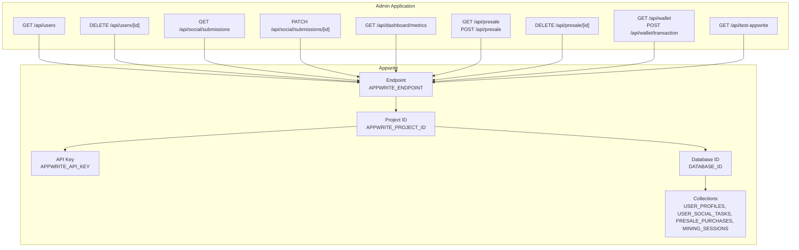
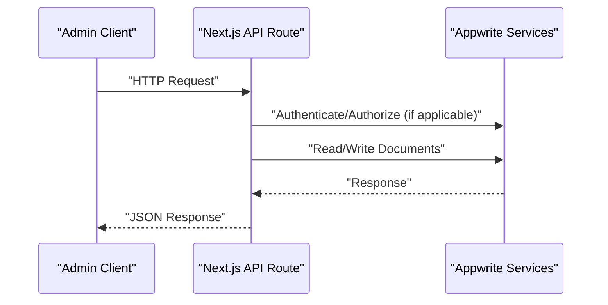
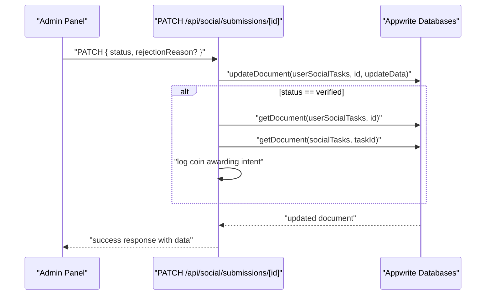
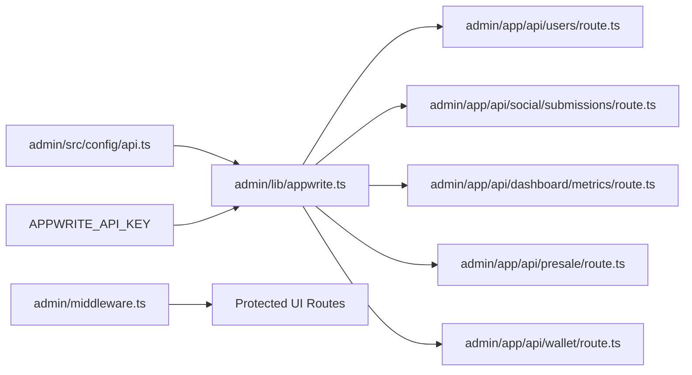

# API Reference

<cite>
**Referenced Files in This Document**
- [admin/app/api/users/route.ts](file://admin/app/api/users/route.ts)
- [admin/app/api/users/[id]/route.ts](file://admin/app/api/users/[id]/route.ts)
- [admin/app/api/social/submissions/route.ts](file://admin/app/api/social/submissions/route.ts)
- [admin/app/api/social/submissions/[id]/route.ts](file://admin/app/api/social/submissions/[id]/route.ts)
- [admin/app/api/dashboard/metrics/route.ts](file://admin/app/api/dashboard/metrics/route.ts)
- [admin/app/api/presale/route.ts](file://admin/app/api/presale/route.ts)
- [admin/app/api/presale/[id]/route.ts](file://admin/app/api/presale/[id]/route.ts)
- [admin/app/api/wallet/route.ts](file://admin/app/api/wallet/route.ts)
- [admin/src/config/api.ts](file://admin/src/config/api.ts)
- [admin/lib/appwrite.ts](file://admin/lib/appwrite.ts)
- [admin/middleware.ts](file://admin/middleware.ts)
- [admin/app/api/test-appwrite/route.ts](file://admin/app/api/test-appwrite/route.ts)
- [mobileApp/src/config/api.ts](file://mobileApp/src/config/api.ts)
- [mobileApp/src/config/appwrite.ts](file://mobileApp/src/config/appwrite.ts)
</cite>

## Table of Contents
1. [Introduction](#introduction)
2. [Project Structure](#project-structure)
3. [Core Components](#core-components)
4. [Architecture Overview](#architecture-overview)
5. [Detailed Component Analysis](#detailed-component-analysis)
6. [Dependency Analysis](#dependency-analysis)
7. [Performance Considerations](#performance-considerations)
8. [Troubleshooting Guide](#troubleshooting-guide)
9. [Conclusion](#conclusion)
10. [Appendices](#appendices)

## Introduction
This document provides comprehensive API documentation for the Ekehi Mobile application’s administrative REST endpoints. It covers HTTP methods, URL patterns, request/response schemas, authentication requirements, and operational notes derived from the repository. The focus areas include:
- User management API (listing, creating/updating, deleting)
- Social task verification API (fetching submissions, updating statuses)
- Dashboard metrics API (analytics and reporting)
- Presale API (token sales and purchase management)
- Wallet API (transactions and statistics)
- Authentication and middleware behavior
- Configuration and environment variables
- Practical usage examples and integration guidance

## Project Structure
The administrative APIs are implemented as Next.js App Router API routes under the admin application. They interact with Appwrite for authentication and database operations, using environment-driven configuration.

**Diagram sources**
- [admin/app/api/users/route.ts](file://admin/app/api/users/route.ts#L1-L209)
- [admin/app/api/users/[id]/route.ts](file://admin/app/api/users/[id]/route.ts#L1-L75)
- [admin/app/api/social/submissions/route.ts](file://admin/app/api/social/submissions/route.ts#L1-L142)
- [admin/app/api/social/submissions/[id]/route.ts](file://admin/app/api/social/submissions/[id]/route.ts#L1-L108)
- [admin/app/api/dashboard/metrics/route.ts](file://admin/app/api/dashboard/metrics/route.ts#L1-L111)
- [admin/app/api/presale/route.ts](file://admin/app/api/presale/route.ts#L1-L75)
- [admin/app/api/presale/[id]/route.ts](file://admin/app/api/presale/[id]/route.ts#L1-L29)
- [admin/app/api/wallet/route.ts](file://admin/app/api/wallet/route.ts#L1-L66)
- [admin/app/api/test-appwrite/route.ts](file://admin/app/api/test-appwrite/route.ts#L1-L47)
- [admin/src/config/api.ts](file://admin/src/config/api.ts#L1-L35)
- [admin/lib/appwrite.ts](file://admin/lib/appwrite.ts#L1-L33)

**Section sources**
- [admin/src/config/api.ts](file://admin/src/config/api.ts#L1-L35)
- [admin/lib/appwrite.ts](file://admin/lib/appwrite.ts#L1-L33)

## Core Components
- Appwrite configuration and environment variables
  - Endpoint, project ID, database ID, and collection IDs are loaded from environment variables.
  - An API key is optional in the admin runtime but required for server-side admin operations.
- Appwrite client initialization
  - The client is initialized with endpoint and project, and optionally with an API key.
- Middleware protection
  - Routes under protected paths enforce session presence via Appwrite session cookies.
  - API routes bypass middleware checks.

**Section sources**
- [admin/src/config/api.ts](file://admin/src/config/api.ts#L1-L35)
- [admin/lib/appwrite.ts](file://admin/lib/appwrite.ts#L1-L33)
- [admin/middleware.ts](file://admin/middleware.ts#L1-L70)

## Architecture Overview
The admin API routes act as thin orchestration layers that delegate to Appwrite services. Requests are authenticated via Appwrite sessions for UI routes, while API endpoints rely on server-side configuration and environment variables.

**Diagram sources**
- [admin/app/api/users/route.ts](file://admin/app/api/users/route.ts#L54-L209)
- [admin/app/api/social/submissions/route.ts](file://admin/app/api/social/submissions/route.ts#L1-L142)
- [admin/app/api/dashboard/metrics/route.ts](file://admin/app/api/dashboard/metrics/route.ts#L1-L111)
- [admin/app/api/presale/route.ts](file://admin/app/api/presale/route.ts#L1-L75)
- [admin/app/api/wallet/route.ts](file://admin/app/api/wallet/route.ts#L1-L66)
- [admin/lib/appwrite.ts](file://admin/lib/appwrite.ts#L1-L33)

## Detailed Component Analysis

### User Management API
- Purpose: Manage users (list, create/update, delete).
- Base URL: `/api/users`
- Collections used: USER_PROFILES

Endpoints:
- GET /api/users
  - Query parameters:
    - page: integer, default 1
    - limit: integer, default 10
    - search: string (full-text search across name and email)
    - sortBy: string, supported values include name, email, walletBalance, lastLogin, createdAt
    - sortOrder: string, asc or desc, default desc
  - Response fields:
    - success: boolean
    - data.users: array of user objects with id, name, email, status, role, createdAt, lastLogin, walletBalance
    - data.stats: totalUsers, activeUsers, inactiveUsers, adminUsers, userActivityStats
    - data.total, data.page, data.limit
  - Notes:
    - Sorting defaults to descending creation date if not specified.
    - Email resolution falls back to a placeholder if missing.
- POST /api/users
  - Body fields:
    - id: optional (when present, updates existing user)
    - name: required
    - email: required
    - status: optional, default active
    - role: optional, default user
    - walletBalance: optional, mapped to totalCoins
  - Response fields:
    - success: boolean
    - message: string
    - data: user object with normalized fields
  - Behavior:
    - On update, writes to USER_PROFILES by ID.
    - On create, generates a unique ID and writes to USER_PROFILES.
- DELETE /api/users/[id]
  - Path parameter: id (required)
  - Behavior:
    - Attempts to delete from USER_PROFILES and Appwrite Users collection.
    - Resilient design: continues with the second operation even if the first fails.
  - Response fields:
    - success: boolean
    - message: string

Example usage:
- Retrieve users with pagination and search:
  - GET /api/users?page=1&limit=20&search=john&sortBy=name&sortOrder=asc
- Create a new user:
  - POST /api/users with body containing name and email
- Update an existing user:
  - POST /api/users with body including id, name, email, status, role, walletBalance
- Delete a user:
  - DELETE /api/users/{id}

**Section sources**
- [admin/app/api/users/route.ts](file://admin/app/api/users/route.ts#L1-L209)
- [admin/app/api/users/[id]/route.ts](file://admin/app/api/users/[id]/route.ts#L1-L75)

### Social Task Verification API
- Purpose: View and approve/reject social task submissions.
- Base URL: `/api/social/submissions`
- Collections used: userSocialTasks, socialTasks, users

Endpoints:
- GET /api/social/submissions
  - Query parameters:
    - status: string (filter by submission status)
    - taskId: string (filter by task ID)
    - userId: string (filter by user ID)
  - Response fields:
    - success: boolean
    - data.submissions: array of submission objects enriched with task and user details
    - data.total: integer
  - Notes:
    - Results are ordered by creation date descending.
    - Related task and user details are fetched and merged.
- PATCH /api/social/submissions/[id]
  - Path parameter: id (required)
  - Body fields:
    - status: required (e.g., pending, verified, rejected)
    - rejectionReason: optional (required when status is rejected)
  - Behavior:
    - On verified status, sets verifiedAt timestamp.
    - On rejected status with reason, stores rejectionReason.
    - On verified status, logs coin awarding intent (no external call in current implementation).
  - Response fields:
    - success: boolean
    - message: string
    - data: transformed submission object

Example usage:
- Fetch pending submissions:
  - GET /api/social/submissions?status=pending
- Approve a submission:
  - PATCH /api/social/submissions/{id} with body { status: "verified" }
- Reject a submission:
  - PATCH /api/social/submissions/{id} with body { status: "rejected", rejectionReason: "..." }

**Diagram sources**
- [admin/app/api/social/submissions/[id]/route.ts](file://admin/app/api/social/submissions/[id]/route.ts#L1-L108)

**Section sources**
- [admin/app/api/social/submissions/route.ts](file://admin/app/api/social/submissions/route.ts#L1-L142)
- [admin/app/api/social/submissions/[id]/route.ts](file://admin/app/api/social/submissions/[id]/route.ts#L1-L108)

### Dashboard Metrics API
- Purpose: Provide analytics and system reports for admin dashboards.
- Base URL: `/api/dashboard/metrics`
- Collections used: USER_PROFILES, userSocialTasks

Endpoints:
- GET /api/dashboard/metrics
  - Response fields:
    - success: boolean
    - data: object with counts and recent activity
      - totalUsers
      - totalSubmissions
      - completedTasks (alias of verified submissions)
      - pendingSubmissions
      - verifiedSubmissions
      - rejectedSubmissions
      - recentActivity: array of latest submissions
      - timestamp: ISO string

Example usage:
- GET /api/dashboard/metrics

**Section sources**
- [admin/app/api/dashboard/metrics/route.ts](file://admin/app/api/dashboard/metrics/route.ts#L1-L111)

### Presale API
- Purpose: Manage token pre-sale purchases.
- Base URL: `/api/presale`
- Collections used: presalePurchases

Endpoints:
- GET /api/presale
  - Response fields:
    - success: boolean
    - data.presales: array of presale purchase documents
    - data.stats: object with totalRaised, tokensSold, participants
- POST /api/presale
  - Body fields:
    - $id: optional (when present, updates existing purchase)
    - Other fields depend on presale schema
  - Response fields:
    - success: boolean
    - message: string
    - data: created/updated purchase document
- DELETE /api/presale/[id]
  - Path parameter: id (required)
  - Response fields:
    - success: boolean
    - message: string

Example usage:
- List presales and compute stats:
  - GET /api/presale
- Create or update a presale purchase:
  - POST /api/presale with presale data

**Section sources**
- [admin/app/api/presale/route.ts](file://admin/app/api/presale/route.ts#L1-L75)
- [admin/app/api/presale/[id]/route.ts](file://admin/app/api/presale/[id]/route.ts#L1-L29)

### Wallet API
- Purpose: Retrieve wallet-related activity and process transactions.
- Base URL: `/api/wallet`
- Collections used: miningSessions (used as proxy for wallet activity)

Endpoints:
- GET /api/wallet
  - Response fields:
    - success: boolean
    - data.transactions: array of mock transaction-like objects derived from mining sessions
    - data.stats: object with totalBalance, totalDeposits, totalWithdrawals, rewardsDistributed
- POST /api/wallet/transaction
  - Body: transaction payload
  - Response fields:
    - success: boolean
    - message: string
    - data: transaction object

Notes:
- Transactions are currently mocked; in a real implementation, a dedicated wallet_transactions collection would be used.

**Section sources**
- [admin/app/api/wallet/route.ts](file://admin/app/api/wallet/route.ts#L1-L66)

## Dependency Analysis
- Configuration dependencies:
  - API endpoints depend on environment variables for Appwrite endpoint, project ID, database ID, and collection IDs.
  - Admin routes use an API key when performing privileged operations.
- Runtime dependencies:
  - Appwrite client is initialized once and reused across routes.
  - Middleware enforces session-based access for protected UI routes; API routes are not gated by middleware.

**Diagram sources**
- [admin/src/config/api.ts](file://admin/src/config/api.ts#L1-L35)
- [admin/lib/appwrite.ts](file://admin/lib/appwrite.ts#L1-L33)
- [admin/middleware.ts](file://admin/middleware.ts#L1-L70)
- [admin/app/api/users/route.ts](file://admin/app/api/users/route.ts#L1-L209)
- [admin/app/api/social/submissions/route.ts](file://admin/app/api/social/submissions/route.ts#L1-L142)
- [admin/app/api/dashboard/metrics/route.ts](file://admin/app/api/dashboard/metrics/route.ts#L1-L111)
- [admin/app/api/presale/route.ts](file://admin/app/api/presale/route.ts#L1-L75)
- [admin/app/api/wallet/route.ts](file://admin/app/api/wallet/route.ts#L1-L66)

**Section sources**
- [admin/src/config/api.ts](file://admin/src/config/api.ts#L1-L35)
- [admin/lib/appwrite.ts](file://admin/lib/appwrite.ts#L1-L33)
- [admin/middleware.ts](file://admin/middleware.ts#L1-L70)

## Performance Considerations
- Pagination and filtering:
  - User listing supports pagination and sorting; use limit and page to control load.
  - Submission listing supports filters by status, taskId, and userId.
- Batch fetching:
  - Submission enrichment fetches tasks and users in batches to avoid query limits.
- Cost of statistics:
  - Dashboard metrics and user listing compute counts over collections; prefer filtered queries and limit scope when possible.
- Recommendations:
  - Apply appropriate filters and limits in requests.
  - Cache frequently accessed dashboard data at the application layer if needed.
  - Monitor Appwrite query performance and adjust indexing as required.

[No sources needed since this section provides general guidance]

## Troubleshooting Guide
Common issues and resolutions:
- Appwrite API key not configured:
  - Symptom: 500 error indicating missing API key.
  - Resolution: Set APPWRITE_API_KEY in environment variables.
- Connection failures:
  - Use the test endpoint to validate connectivity and credentials.
- Session-based UI access:
  - If redirected to login, ensure an Appwrite session cookie is present for protected UI routes.

**Section sources**
- [admin/app/api/social/submissions/route.ts](file://admin/app/api/social/submissions/route.ts#L120-L142)
- [admin/app/api/social/submissions/[id]/route.ts](file://admin/app/api/social/submissions/[id]/route.ts#L88-L108)
- [admin/app/api/dashboard/metrics/route.ts](file://admin/app/api/dashboard/metrics/route.ts#L8-L14)
- [admin/app/api/test-appwrite/route.ts](file://admin/app/api/test-appwrite/route.ts#L1-L47)
- [admin/middleware.ts](file://admin/middleware.ts#L1-L70)

## Conclusion
The Ekehi Mobile admin API provides a focused set of endpoints for managing users, verifying social tasks, retrieving dashboard metrics, handling presale purchases, and accessing wallet activity. Configuration is environment-driven, and middleware protects UI routes via Appwrite sessions. The endpoints are designed for simplicity and resilience, with clear request/response patterns and helpful error messages.

[No sources needed since this section summarizes without analyzing specific files]

## Appendices

### Authentication and Authorization
- Admin UI:
  - Protected routes require an Appwrite session cookie; middleware enforces this.
- API routes:
  - Not gated by middleware; server-side operations use Appwrite client initialized with endpoint, project, and optional API key.
- OAuth and Appwrite configuration:
  - Mobile app configuration demonstrates Appwrite endpoint, project, database, and collection IDs, as well as OAuth settings.

**Section sources**
- [admin/middleware.ts](file://admin/middleware.ts#L1-L70)
- [admin/lib/appwrite.ts](file://admin/lib/appwrite.ts#L1-L33)
- [mobileApp/src/config/appwrite.ts](file://mobileApp/src/config/appwrite.ts#L1-L51)

### Environment Variables and Configuration
- Required variables:
  - APPWRITE_ENDPOINT, APPWRITE_PROJECT_ID, APPWRITE_API_KEY (optional for admin routes), DATABASE_ID
  - COLLECTIONS: USER_PROFILES, USER_SOCIAL_TASKS, PRESALE_PURCHASES, MINING_SESSIONS
- Example locations:
  - Admin configuration file defines constants and environment-driven values.
  - Appwrite client initialization reads environment variables.

**Section sources**
- [admin/src/config/api.ts](file://admin/src/config/api.ts#L1-L35)
- [admin/lib/appwrite.ts](file://admin/lib/appwrite.ts#L1-L33)

### Practical Usage Examples
- User management:
  - List users with pagination and search.
  - Create a new user or update an existing user by providing id.
  - Delete a user by ID.
- Social task verification:
  - Fetch submissions by status or user/task filters.
  - Approve or reject a submission with optional rejection reason.
- Dashboard:
  - Retrieve aggregated metrics and recent activity.
- Presale:
  - List purchases and compute raised amounts, tokens sold, and participants.
  - Create or update a purchase record.
  - Delete a purchase by ID.
- Wallet:
  - Retrieve mock transactions and computed stats.
  - Submit a transaction payload.

**Section sources**
- [admin/app/api/users/route.ts](file://admin/app/api/users/route.ts#L54-L209)
- [admin/app/api/users/[id]/route.ts](file://admin/app/api/users/[id]/route.ts#L41-L75)
- [admin/app/api/social/submissions/route.ts](file://admin/app/api/social/submissions/route.ts#L1-L142)
- [admin/app/api/social/submissions/[id]/route.ts](file://admin/app/api/social/submissions/[id]/route.ts#L1-L108)
- [admin/app/api/dashboard/metrics/route.ts](file://admin/app/api/dashboard/metrics/route.ts#L1-L111)
- [admin/app/api/presale/route.ts](file://admin/app/api/presale/route.ts#L1-L75)
- [admin/app/api/presale/[id]/route.ts](file://admin/app/api/presale/[id]/route.ts#L1-L29)
- [admin/app/api/wallet/route.ts](file://admin/app/api/wallet/route.ts#L1-L66)

### Integration Patterns
- Client implementation guidelines:
  - Use HTTPS endpoints exposed by the admin application.
  - Respect pagination and filtering parameters for efficient data retrieval.
  - Handle error responses and display meaningful messages to administrators.
- Monitoring approaches:
  - Log API errors and responses for auditability.
  - Track request latency and error rates for each endpoint.
  - Validate Appwrite connectivity periodically using the test endpoint.

**Section sources**
- [admin/app/api/test-appwrite/route.ts](file://admin/app/api/test-appwrite/route.ts#L1-L47)