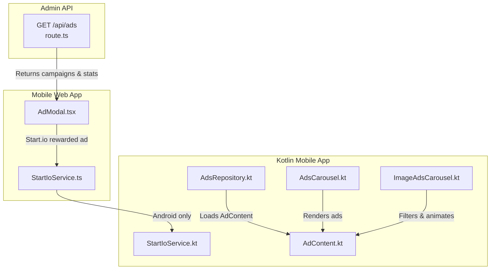
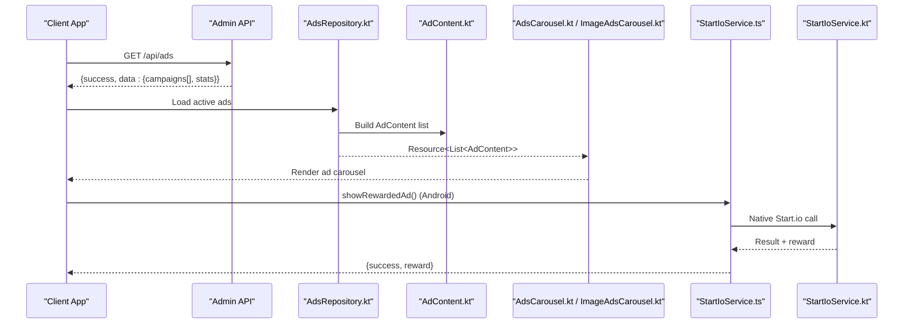
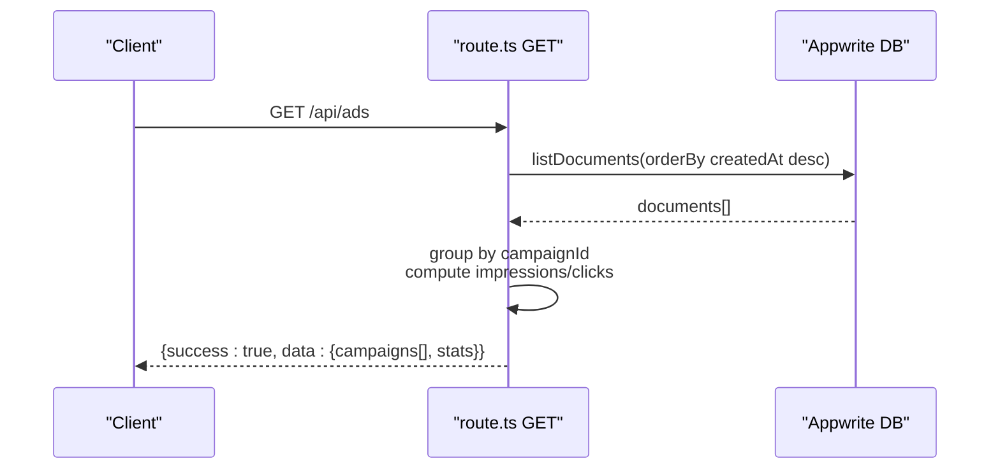
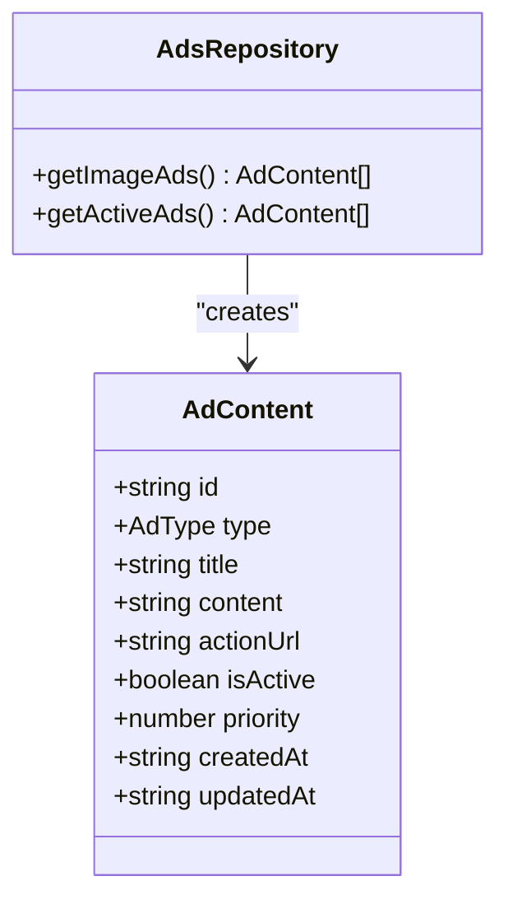
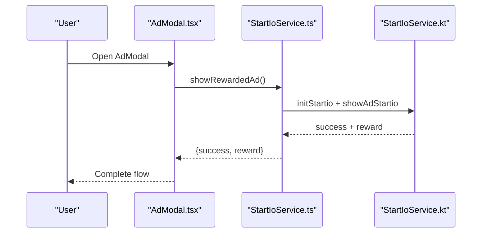
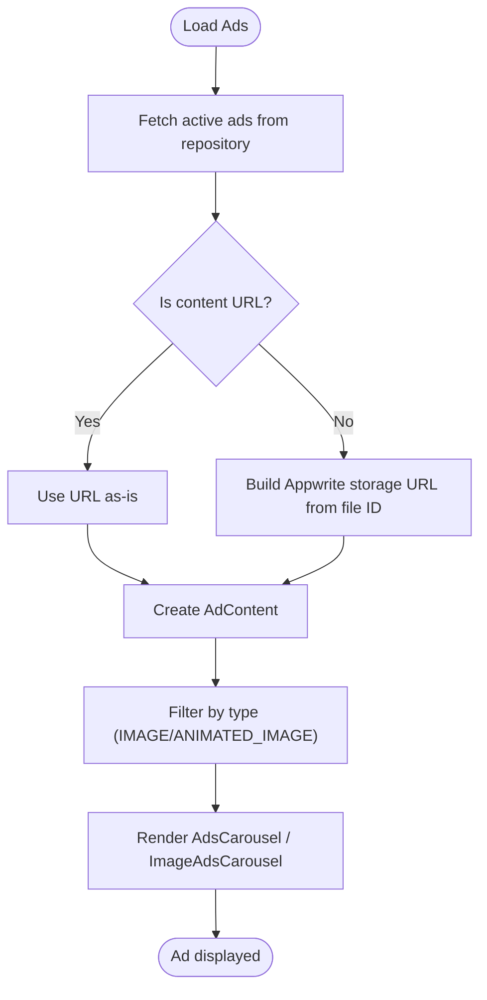
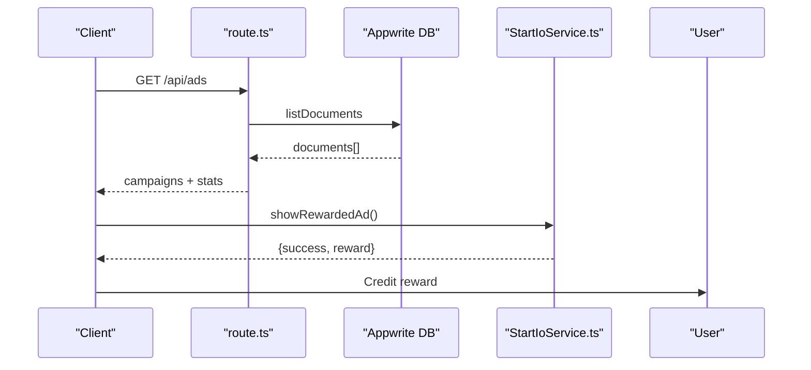
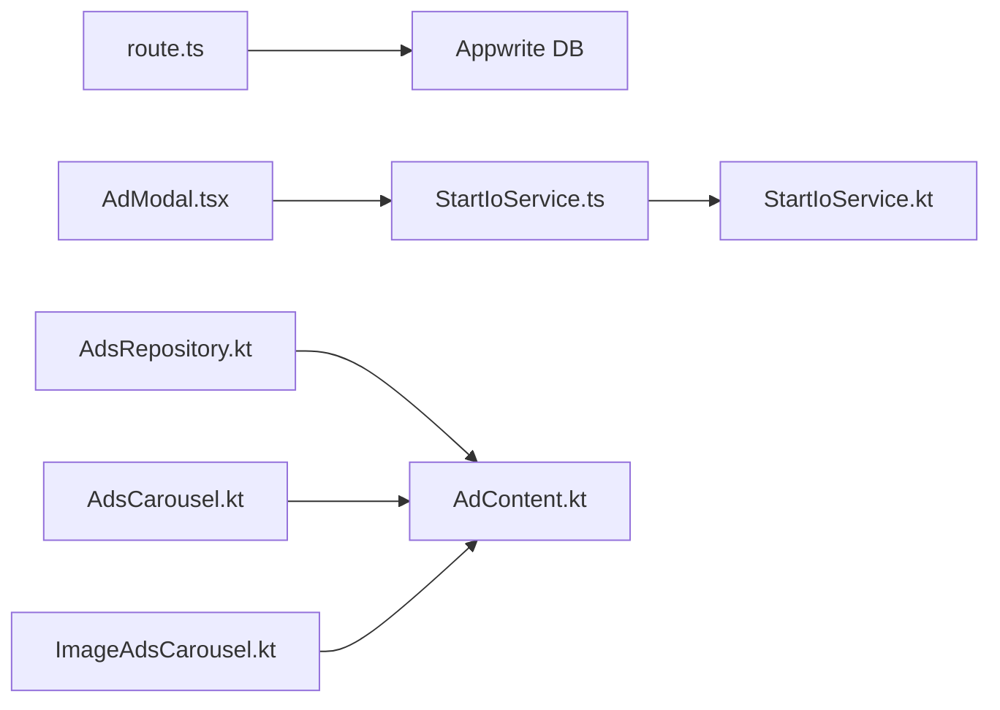

# Advertising Content API

<cite>
**Referenced Files in This Document**
- [route.ts](file://admin/app/api/ads/route.ts)
- [AdContent.kt](file://ktMobileApp/app/src/main/java/com/ekehi/network/data/model/AdContent.kt)
- [AdsRepository.kt](file://ktMobileApp/app/src/main/java/com/ekehi/network/data/repository/AdsRepository.kt)
- [AdsCarousel.kt](file://ktMobileApp/app/src/main/java/com/ekehi/network/presentation/ui/components/AdsCarousel.kt)
- [ImageAdsCarousel.kt](file://ktMobileApp/app/src/main/java/com/ekehi/network/presentation/ui/components/ImageAdsCarousel.kt)
- [StartIoService.ts](file://mobileApp/src/services/StartIoService.ts)
- [AdModal.tsx](file://mobileApp/src/components/AdModal.tsx)
- [START_IO_FIX.md](file://mobileApp/Documentations/START_IO_FIX.md)
- [START_IO_EXIT_ADS_IMPLEMENTATION.md](file://mobileApp/Documentations/START_IO_EXIT_ADS_IMPLEMENTATION.md)
- [START_IO_MIGRATION_GUIDE.md](file://mobileApp/Documentations/START_IO_MIGRATION_GUIDE.md)
- [ADS_TESTING_GUIDE.md](file://mobileApp/Documentations/ADS_TESTING_GUIDE.md)
- [test-startio.js](file://mobileApp/Scripts/test-startio.js)
- [test-ads.js](file://mobileApp/Scripts/test-ads.js)
- [verify-web-fixes.js](file://mobileApp/Scripts/verify-web-fixes.js)
- [StartIoService.kt](file://ktMobileApp/app/src/main/java/com/ekehi/network/service/StartIoService.kt)
</cite>

## Table of Contents
1. [Introduction](#introduction)
2. [Project Structure](#project-structure)
3. [Core Components](#core-components)
4. [Architecture Overview](#architecture-overview)
5. [Detailed Component Analysis](#detailed-component-analysis)
6. [Dependency Analysis](#dependency-analysis)
7. [Performance Considerations](#performance-considerations)
8. [Troubleshooting Guide](#troubleshooting-guide)
9. [Conclusion](#conclusion)
10. [Appendices](#appendices)

## Introduction
This document provides API documentation for advertising content management within the Ekehi Mobile ecosystem. It covers:
- Retrieving advertisement content and campaign metadata via a backend endpoint
- Ad content schemas used by the frontend
- Placement APIs for content delivery, impression tracking, and reward distribution
- Dynamic content loading and performance analytics
- Ad serving optimization, personalization, and integration with the Start.io monetization platform
- Ad quality standards, content moderation, and compliance considerations

## Project Structure
The advertising system spans three primary areas:
- Admin API: Backend endpoint to fetch and manage ad campaigns
- Mobile Web App: Frontend UI and service integrations for rewarded ads
- Kotlin Mobile App: Native Android ad integration and carousel rendering

**Diagram sources**
- [route.ts](file://admin/app/api/ads/route.ts#L6-L65)
- [AdModal.tsx](file://mobileApp/src/components/AdModal.tsx#L1-L120)
- [StartIoService.ts](file://mobileApp/src/services/StartIoService.ts#L1-L120)
- [StartIoService.kt](file://ktMobileApp/app/src/main/java/com/ekehi/network/service/StartIoService.kt#L1-L120)
- [AdsRepository.kt](file://ktMobileApp/app/src/main/java/com/ekehi/network/data/repository/AdsRepository.kt#L63-L108)
- [AdContent.kt](file://ktMobileApp/app/src/main/java/com/ekehi/network/data/model/AdContent.kt#L1-L19)
- [AdsCarousel.kt](file://ktMobileApp/app/src/main/java/com/ekehi/network/presentation/ui/components/AdsCarousel.kt#L1-L120)
- [ImageAdsCarousel.kt](file://ktMobileApp/app/src/main/java/com/ekehi/network/presentation/ui/components/ImageAdsCarousel.kt#L1-L120)

**Section sources**
- [route.ts](file://admin/app/api/ads/route.ts#L6-L65)
- [AdModal.tsx](file://mobileApp/src/components/AdModal.tsx#L1-L120)
- [StartIoService.ts](file://mobileApp/src/services/StartIoService.ts#L1-L120)
- [StartIoService.kt](file://ktMobileApp/app/src/main/java/com/ekehi/network/service/StartIoService.kt#L1-L120)
- [AdsRepository.kt](file://ktMobileApp/app/src/main/java/com/ekehi/network/data/repository/AdsRepository.kt#L63-L108)
- [AdContent.kt](file://ktMobileApp/app/src/main/java/com/ekehi/network/data/model/AdContent.kt#L1-L19)
- [AdsCarousel.kt](file://ktMobileApp/app/src/main/java/com/ekehi/network/presentation/ui/components/AdsCarousel.kt#L1-L120)
- [ImageAdsCarousel.kt](file://ktMobileApp/app/src/main/java/com/ekehi/network/presentation/ui/components/ImageAdsCarousel.kt#L1-L120)

## Core Components
- Admin API endpoint GET /api/ads
  - Purpose: Retrieve ad campaigns aggregated from view logs, compute impressions and clicks, and return campaign metadata along with summary statistics.
  - Response shape: success flag, campaigns array, and stats object containing totals and average click-through rate.
  - Notes: The endpoint currently groups ad views by campaign to simulate campaigns; in a production system, campaigns would be stored in a dedicated collection.

- Ad content schema
  - Fields: id, type, title, content, actionUrl, isActive, priority, createdAt, updatedAt.
  - Types: AdType includes IMAGE, TEXT, ANIMATED_IMAGE.
  - Used by repositories and UI components to render and filter ads.

- Start.io integration
  - Web app: StartIoService.ts orchestrates rewarded ad lifecycle on Android, including initialization, ad loading, and reward distribution.
  - Native app: StartIoService.kt integrates StartApp SDK for rewarded video and exit ads, with preloading and fallbacks.

**Section sources**
- [route.ts](file://admin/app/api/ads/route.ts#L6-L65)
- [AdContent.kt](file://ktMobileApp/app/src/main/java/com/ekehi/network/data/model/AdContent.kt#L1-L19)
- [StartIoService.ts](file://mobileApp/src/services/StartIoService.ts#L167-L198)
- [StartIoService.kt](file://ktMobileApp/app/src/main/java/com/ekehi/network/service/StartIoService.kt#L53-L164)

## Architecture Overview
The advertising architecture comprises:
- Admin API: Aggregates ad view data and exposes campaign metadata and stats.
- Web App: Presents rewarded ad UI and interacts with Start.io via a service layer.
- Native App: Renders ad carousels and integrates StartApp SDK for rewarded and exit ads.

**Diagram sources**
- [route.ts](file://admin/app/api/ads/route.ts#L6-L65)
- [AdsRepository.kt](file://ktMobileApp/app/src/main/java/com/ekehi/network/data/repository/AdsRepository.kt#L63-L108)
- [AdContent.kt](file://ktMobileApp/app/src/main/java/com/ekehi/network/data/model/AdContent.kt#L1-L19)
- [AdsCarousel.kt](file://ktMobileApp/app/src/main/java/com/ekehi/network/presentation/ui/components/AdsCarousel.kt#L1-L120)
- [ImageAdsCarousel.kt](file://ktMobileApp/app/src/main/java/com/ekehi/network/presentation/ui/components/ImageAdsCarousel.kt#L1-L120)
- [StartIoService.ts](file://mobileApp/src/services/StartIoService.ts#L167-L198)
- [StartIoService.kt](file://ktMobileApp/app/src/main/java/com/ekehi/network/service/StartIoService.kt#L53-L164)

## Detailed Component Analysis

### Admin API: GET /api/ads
- Endpoint: GET /api/ads
- Behavior:
  - Fetches documents from a storage collection representing ad views.
  - Groups by campaignId to compute impressions and clicks per campaign.
  - Calculates total impressions, total clicks, and average click-through rate.
  - Returns structured payload with success flag, campaigns, and stats.
- Error handling: Returns JSON with success=false and error message on failures.

**Diagram sources**
- [route.ts](file://admin/app/api/ads/route.ts#L6-L65)

**Section sources**
- [route.ts](file://admin/app/api/ads/route.ts#L6-L65)

### Ad Content Schema
- Data model: AdContent with fields id, type, title, content, actionUrl, isActive, priority, createdAt, updatedAt.
- Enumerated types: AdType supports IMAGE, TEXT, ANIMATED_IMAGE.
- Repository processing:
  - Builds content URLs for image/animated ads from file IDs or external URLs.
  - Removes temporary tokens from URLs to avoid expiration issues.
  - Filters active ads and returns typed content lists.

**Diagram sources**
- [AdContent.kt](file://ktMobileApp/app/src/main/java/com/ekehi/network/data/model/AdContent.kt#L1-L19)
- [AdsRepository.kt](file://ktMobileApp/app/src/main/java/com/ekehi/network/data/repository/AdsRepository.kt#L63-L108)

**Section sources**
- [AdContent.kt](file://ktMobileApp/app/src/main/java/com/ekehi/network/data/model/AdContent.kt#L1-L19)
- [AdsRepository.kt](file://ktMobileApp/app/src/main/java/com/ekehi/network/data/repository/AdsRepository.kt#L63-L108)

### Ad Placement and Delivery (Web App)
- AdModal.tsx
  - Presents rewarded ad prompt with reward amount and countdown.
  - On Android, triggers StartIoService.showRewardedAd().
  - Handles platform checks and error reporting.
- StartIoService.ts
  - Initializes Start.io on Android, sets user consent and ad frequency caps.
  - Invokes native Start.io functions to show rewarded ads and returns reward signals.

**Diagram sources**
- [AdModal.tsx](file://mobileApp/src/components/AdModal.tsx#L1-L120)
- [StartIoService.ts](file://mobileApp/src/services/StartIoService.ts#L167-L198)
- [StartIoService.kt](file://ktMobileApp/app/src/main/java/com/ekehi/network/service/StartIoService.kt#L53-L164)

**Section sources**
- [AdModal.tsx](file://mobileApp/src/components/AdModal.tsx#L1-L120)
- [StartIoService.ts](file://mobileApp/src/services/StartIoService.ts#L167-L198)
- [StartIoService.kt](file://ktMobileApp/app/src/main/java/com/ekehi/network/service/StartIoService.kt#L53-L164)

### Dynamic Content Loading and Rendering (Android)
- AdsRepository.kt
  - Loads active ads and builds AdContent with cleaned URLs for images/animated images.
- AdsCarousel.kt and ImageAdsCarousel.kt
  - Render ad carousels with pagination, auto-rotation, and swipe gestures.
  - Support IMAGE and ANIMATED_IMAGE types; TEXT ads rendered as text overlays.

**Diagram sources**
- [AdsRepository.kt](file://ktMobileApp/app/src/main/java/com/ekehi/network/data/repository/AdsRepository.kt#L63-L108)
- [AdsCarousel.kt](file://ktMobileApp/app/src/main/java/com/ekehi/network/presentation/ui/components/AdsCarousel.kt#L1-L120)
- [ImageAdsCarousel.kt](file://ktMobileApp/app/src/main/java/com/ekehi/network/presentation/ui/components/ImageAdsCarousel.kt#L1-L120)

**Section sources**
- [AdsRepository.kt](file://ktMobileApp/app/src/main/java/com/ekehi/network/data/repository/AdsRepository.kt#L63-L108)
- [AdsCarousel.kt](file://ktMobileApp/app/src/main/java/com/ekehi/network/presentation/ui/components/AdsCarousel.kt#L1-L120)
- [ImageAdsCarousel.kt](file://ktMobileApp/app/src/main/java/com/ekehi/network/presentation/ui/components/ImageAdsCarousel.kt#L1-L120)

### Impression Tracking and Revenue Sharing
- Admin API aggregates impressions and clicks per campaign from view logs and computes stats.
- Web app rewarded ad flow returns a reward signal; revenue sharing logic can be integrated at the service layer to distribute tokens to users.
- Exit ads (interstitial) are supported on Android via StartApp SDK.

**Diagram sources**
- [route.ts](file://admin/app/api/ads/route.ts#L6-L65)
- [StartIoService.ts](file://mobileApp/src/services/StartIoService.ts#L167-L198)

**Section sources**
- [route.ts](file://admin/app/api/ads/route.ts#L6-L65)
- [StartIoService.ts](file://mobileApp/src/services/StartIoService.ts#L167-L198)
- [START_IO_EXIT_ADS_IMPLEMENTATION.md](file://mobileApp/Documentations/START_IO_EXIT_ADS_IMPLEMENTATION.md#L37-L96)

### Performance Analytics
- Admin API returns campaign-level metrics (total campaigns, impressions, clicks, average CTR).
- Web app includes test scripts to simulate ad scenarios and cooldown periods.

**Section sources**
- [route.ts](file://admin/app/api/ads/route.ts#L42-L65)
- [ADS_TESTING_GUIDE.md](file://mobileApp/Documentations/ADS_TESTING_GUIDE.md#L1-L201)
- [test-ads.js](file://mobileApp/Scripts/test-ads.js#L88-L138)

## Dependency Analysis
- Admin API depends on Appwrite client and a configured database/collection.
- Web app depends on Start.io service and platform-specific availability checks.
- Native app depends on StartApp SDK and repository/model layers for ad rendering.

**Diagram sources**
- [route.ts](file://admin/app/api/ads/route.ts#L6-L65)
- [AdModal.tsx](file://mobileApp/src/components/AdModal.tsx#L1-L120)
- [StartIoService.ts](file://mobileApp/src/services/StartIoService.ts#L1-L120)
- [StartIoService.kt](file://ktMobileApp/app/src/main/java/com/ekehi/network/service/StartIoService.kt#L1-L120)
- [AdsRepository.kt](file://ktMobileApp/app/src/main/java/com/ekehi/network/data/repository/AdsRepository.kt#L63-L108)
- [AdContent.kt](file://ktMobileApp/app/src/main/java/com/ekehi/network/data/model/AdContent.kt#L1-L19)
- [AdsCarousel.kt](file://ktMobileApp/app/src/main/java/com/ekehi/network/presentation/ui/components/AdsCarousel.kt#L1-L120)
- [ImageAdsCarousel.kt](file://ktMobileApp/app/src/main/java/com/ekehi/network/presentation/ui/components/ImageAdsCarousel.kt#L1-L120)

**Section sources**
- [route.ts](file://admin/app/api/ads/route.ts#L6-L65)
- [AdModal.tsx](file://mobileApp/src/components/AdModal.tsx#L1-L120)
- [StartIoService.ts](file://mobileApp/src/services/StartIoService.ts#L1-L120)
- [StartIoService.kt](file://ktMobileApp/app/src/main/java/com/ekehi/network/service/StartIoService.kt#L1-L120)
- [AdsRepository.kt](file://ktMobileApp/app/src/main/java/com/ekehi/network/data/repository/AdsRepository.kt#L63-L108)
- [AdContent.kt](file://ktMobileApp/app/src/main/java/com/ekehi/network/data/model/AdContent.kt#L1-L19)
- [AdsCarousel.kt](file://ktMobileApp/app/src/main/java/com/ekehi/network/presentation/ui/components/AdsCarousel.kt#L1-L120)
- [ImageAdsCarousel.kt](file://ktMobileApp/app/src/main/java/com/ekehi/network/presentation/ui/components/ImageAdsCarousel.kt#L1-L120)

## Performance Considerations
- Carousel auto-rotation and gesture handling should avoid excessive recompositions; consider keyed animations and stable indices.
- URL building and token removal should cache results where appropriate to reduce redundant computations.
- Start.io initialization and ad loading should be preloaded to minimize latency; implement fallbacks when rewarded ads are unavailable.
- Admin API aggregation is O(n) over documents; ensure database indexing on timestamps and campaignId for scalability.

[No sources needed since this section provides general guidance]

## Troubleshooting Guide
- Start.io integration issues
  - Import and usage patterns corrected to access functions directly from the package exports.
  - Migration guide outlines steps to verify App ID and SDK installation.
  - Exit ads implementation includes load/show logic and reset flags.
- Web platform checks
  - AdModal and service layers guard against unsupported platforms and provide informative messages.
- Testing scripts
  - Start.io integration test script and ad testing script validate flows and cooldown logic.

**Section sources**
- [START_IO_FIX.md](file://mobileApp/Documentations/START_IO_FIX.md#L1-L42)
- [START_IO_MIGRATION_GUIDE.md](file://mobileApp/Documentations/START_IO_MIGRATION_GUIDE.md#L77-L88)
- [START_IO_EXIT_ADS_IMPLEMENTATION.md](file://mobileApp/Documentations/START_IO_EXIT_ADS_IMPLEMENTATION.md#L37-L96)
- [AdModal.tsx](file://mobileApp/src/components/AdModal.tsx#L1-L120)
- [verify-web-fixes.js](file://mobileApp/Scripts/verify-web-fixes.js#L1-L32)
- [test-startio.js](file://mobileApp/Scripts/test-startio.js#L1-L15)
- [test-ads.js](file://mobileApp/Scripts/test-ads.js#L88-L138)

## Conclusion
The advertising system integrates an Admin API for campaign insights, a web app rewarded ad flow via Start.io, and a native Android ad carousel powered by StartApp SDK. The design supports dynamic content loading, basic impression/click aggregation, and extensible reward and analytics pathways. By addressing platform constraints, improving URL handling, and adding robust fallbacks, the system can scale to richer targeting and personalization while maintaining compliance and quality standards.

[No sources needed since this section summarizes without analyzing specific files]

## Appendices

### API Definitions

- GET /api/ads
  - Description: Retrieve aggregated ad campaigns and performance statistics.
  - Response fields:
    - success: boolean
    - data.campaigns[]: campaign objects with id, name, description, reward, duration, isActive, impressions, clicks, createdAt
    - data.stats: totalCampaigns, totalImpressions, totalClicks, avgCTR
  - Status codes: 200 on success, 500 on error

**Section sources**
- [route.ts](file://admin/app/api/ads/route.ts#L6-L65)

### Ad Content Schema

- Fields:
  - id: string
  - type: enum IMAGE | TEXT | ANIMATED_IMAGE
  - title: string
  - content: string (URL for images/animated images; text for TEXT)
  - actionUrl: string
  - isActive: boolean
  - priority: number
  - createdAt: string
  - updatedAt: string

**Section sources**
- [AdContent.kt](file://ktMobileApp/app/src/main/java/com/ekehi/network/data/model/AdContent.kt#L1-L19)

### Start.io Integration Notes
- Web app: Android-only rewarded ad flow; initialization and ad invocation handled by StartIoService.ts.
- Native app: StartApp SDK rewarded video and exit ad support with preloading and fallbacks.

**Section sources**
- [StartIoService.ts](file://mobileApp/src/services/StartIoService.ts#L167-L198)
- [StartIoService.kt](file://ktMobileApp/app/src/main/java/com/ekehi/network/service/StartIoService.kt#L53-L164)