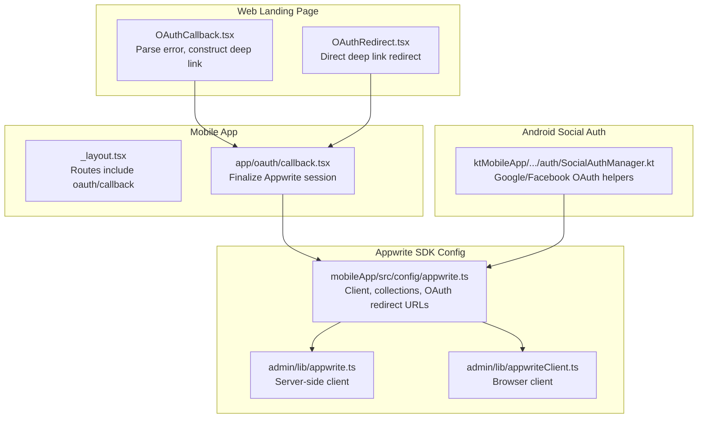
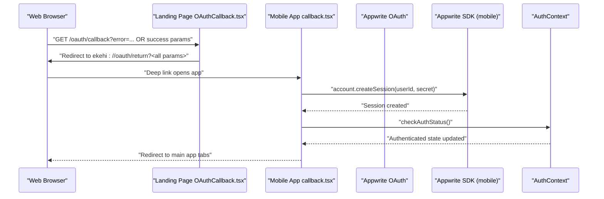
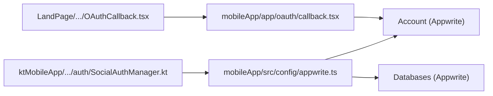
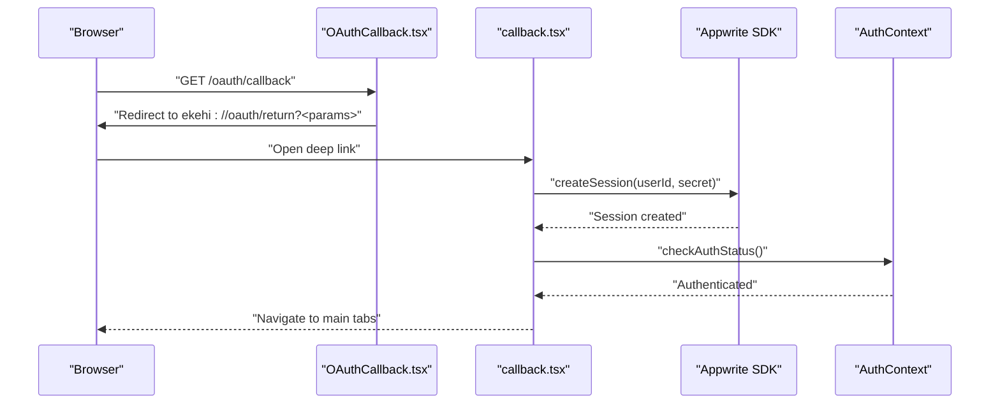

# Authentication API

<cite>
**Referenced Files in This Document**
- [appwrite.ts](file://mobileApp/src/config/appwrite.ts)
- [OAuthCallback.tsx](file://LandPage/src/react-app/pages/OAuthCallback.tsx)
- [OAuthRedirect.tsx](file://LandPage/src/react-app/pages/OAuthRedirect.tsx)
- [callback.tsx](file://mobileApp/app/oauth/callback.tsx)
- [_layout.tsx](file://mobileApp/app/_layout.tsx)
- [appwrite.ts](file://admin/lib/appwrite.ts)
- [appwriteClient.ts](file://admin/lib/appwriteClient.ts)
- [SocialAuthManager.kt](file://ktMobileApp/app/src/main/java/com/ekehi/network/auth/SocialAuthManager.kt)
</cite>

## Table of Contents
1. [Introduction](#introduction)
2. [Project Structure](#project-structure)
3. [Core Components](#core-components)
4. [Architecture Overview](#architecture-overview)
5. [Detailed Component Analysis](#detailed-component-analysis)
6. [Dependency Analysis](#dependency-analysis)
7. [Performance Considerations](#performance-considerations)
8. [Troubleshooting Guide](#troubleshooting-guide)
9. [Conclusion](#conclusion)
10. [Appendices](#appendices)

## Introduction
This document provides API documentation for the authentication endpoints and flows across the ekehi-mobile project. It focuses on:
- OAuth callback handling for web and mobile
- Login/logout operations via Appwrite
- Session management APIs
- Appwrite integration including JWT token handling and user session validation
- Security headers and CORS considerations for OAuth callbacks
- Request/response schemas, error codes, and rate limiting policies
- Examples of OAuth integration patterns, token refresh mechanisms, and secure session storage
- Authentication security considerations and social provider integrations

## Project Structure
Authentication spans three primary areas:
- Web landing page OAuth handler that redirects to the mobile app
- Mobile app OAuth callback page that finalizes session creation
- Admin and mobile SDK configurations for Appwrite services

**Diagram sources**
- [OAuthCallback.tsx](file://LandPage/src/react-app/pages/OAuthCallback.tsx#L1-L107)
- [OAuthRedirect.tsx](file://LandPage/src/react-app/pages/OAuthRedirect.tsx#L1-L32)
- [_layout.tsx](file://mobileApp/app/_layout.tsx#L1-L39)
- [callback.tsx](file://mobileApp/app/oauth/callback.tsx#L1-L159)
- [appwrite.ts](file://mobileApp/src/config/appwrite.ts#L1-L51)
- [appwrite.ts](file://admin/lib/appwrite.ts#L1-L33)
- [appwriteClient.ts](file://admin/lib/appwriteClient.ts#L1-L28)
- [SocialAuthManager.kt](file://ktMobileApp/app/src/main/java/com/ekehi/network/auth/SocialAuthManager.kt#L1-L324)

**Section sources**
- [OAuthCallback.tsx](file://LandPage/src/react-app/pages/OAuthCallback.tsx#L1-L107)
- [OAuthRedirect.tsx](file://LandPage/src/react-app/pages/OAuthRedirect.tsx#L1-L32)
- [_layout.tsx](file://mobileApp/app/_layout.tsx#L1-L39)
- [callback.tsx](file://mobileApp/app/oauth/callback.tsx#L1-L159)
- [appwrite.ts](file://mobileApp/src/config/appwrite.ts#L1-L51)
- [appwrite.ts](file://admin/lib/appwrite.ts#L1-L33)
- [appwriteClient.ts](file://admin/lib/appwriteClient.ts#L1-L28)
- [SocialAuthManager.kt](file://ktMobileApp/app/src/main/java/com/ekehi/network/auth/SocialAuthManager.kt#L1-L324)

## Core Components
- OAuth callback handlers:
  - Web landing page parses OAuth errors and constructs a deep link to the mobile app.
  - Mobile app receives the deep link and finalizes the Appwrite session.
- Appwrite SDK configuration:
  - Mobile app initializes the Appwrite client and defines collection IDs and OAuth redirect URLs.
  - Admin apps initialize clients for server/browser environments.
- Android social authentication manager:
  - Provides helpers for Google and Facebook OAuth flows and manages tokens/scopes.

**Section sources**
- [OAuthCallback.tsx](file://LandPage/src/react-app/pages/OAuthCallback.tsx#L1-L107)
- [callback.tsx](file://mobileApp/app/oauth/callback.tsx#L1-L159)
- [appwrite.ts](file://mobileApp/src/config/appwrite.ts#L1-L51)
- [appwrite.ts](file://admin/lib/appwrite.ts#L1-L33)
- [appwriteClient.ts](file://admin/lib/appwriteClient.ts#L1-L28)
- [SocialAuthManager.kt](file://ktMobileApp/app/src/main/java/com/ekehi/network/auth/SocialAuthManager.kt#L1-L324)

## Architecture Overview
The authentication flow leverages Appwrite’s OAuth capabilities with a deep-link handoff from the web landing page to the mobile app.

**Diagram sources**
- [OAuthCallback.tsx](file://LandPage/src/react-app/pages/OAuthCallback.tsx#L1-L107)
- [callback.tsx](file://mobileApp/app/oauth/callback.tsx#L1-L159)
- [appwrite.ts](file://mobileApp/src/config/appwrite.ts#L1-L51)

## Detailed Component Analysis

### OAuth Callback Handling (Web)
- Purpose: Receive OAuth callback, detect errors, and redirect to the mobile app via a deep link.
- Behavior:
  - Parses URL parameters and sets an error state if present.
  - Constructs a deep link to the mobile app with all original query parameters.
  - Attempts to open the app; falls back to a success message if the app does not open immediately.
- Security considerations:
  - Ensure the deep link scheme is registered in the mobile app.
  - Validate that the redirect URLs configured in Appwrite match the expected deep link pattern.

**Section sources**
- [OAuthCallback.tsx](file://LandPage/src/react-app/pages/OAuthCallback.tsx#L1-L107)

### OAuth Redirect (Web)
- Purpose: Minimal redirector that forwards all query parameters to the mobile app deep link.
- Behavior:
  - Builds a deep link with the original search parameters.
  - Immediately redirects the browser to the mobile app.

**Section sources**
- [OAuthRedirect.tsx](file://LandPage/src/react-app/pages/OAuthRedirect.tsx#L1-L32)

### Mobile OAuth Callback (App)
- Purpose: Finalize the Appwrite session using the received credentials and update authentication state.
- Behavior:
  - Reads userId and secret from URL parameters.
  - Calls the Appwrite SDK to create a session.
  - Updates authentication context and navigates to the main app tabs.
  - Includes safeguards to avoid repeated auth checks and graceful fallbacks on errors.
- Security considerations:
  - Validate that the received parameters are present and not tampered with.
  - Ensure the Appwrite endpoint and project ID are correctly configured.

**Section sources**
- [callback.tsx](file://mobileApp/app/oauth/callback.tsx#L1-L159)
- [_layout.tsx](file://mobileApp/app/_layout.tsx#L1-L39)

### Appwrite SDK Configuration
- Mobile app configuration:
  - Initializes the Appwrite client with endpoint and project ID.
  - Exposes Account and Databases services.
  - Defines collection IDs and OAuth redirect URLs.
- Admin server/client configurations:
  - Server-side client for Node.js and browser client for Next.js.
  - Both set endpoint and project ID similarly.

**Section sources**
- [appwrite.ts](file://mobileApp/src/config/appwrite.ts#L1-L51)
- [appwrite.ts](file://admin/lib/appwrite.ts#L1-L33)
- [appwriteClient.ts](file://admin/lib/appwriteClient.ts#L1-L28)

### Android Social Authentication Manager
- Purpose: Manage Google and Facebook OAuth flows, permissions, and token retrieval for task verification.
- Capabilities:
  - Creates YouTube-specific OAuth client with required scopes.
  - Retrieves YouTube access token using server auth code or ID token.
  - Checks YouTube permissions and signs out from Google/Facebook.
  - Provides helpers to get the last signed-in Google account and current user ID.
- Security considerations:
  - Ensure proper client IDs and scopes are configured.
  - Handle missing permissions gracefully and log meaningful errors.

**Section sources**
- [SocialAuthManager.kt](file://ktMobileApp/app/src/main/java/com/ekehi/network/auth/SocialAuthManager.kt#L1-L324)

### Authentication Endpoints and Schemas

#### OAuth Callback Endpoint (Web)
- Path: GET /oauth/callback
- Description: Receives OAuth callback and redirects to the mobile app deep link.
- Query parameters:
  - error: string (optional)
  - All OAuth provider parameters (provider, code, state, etc.)
- Response:
  - Redirects to ekehi://oauth/return?<all original parameters>
  - On error, displays an error message and suggests checking configuration.

**Section sources**
- [OAuthCallback.tsx](file://LandPage/src/react-app/pages/OAuthCallback.tsx#L1-L107)

#### Mobile OAuth Callback Endpoint (App)
- Path: oauth/callback
- Description: Finalizes Appwrite session using userId and secret.
- Query parameters:
  - userId: string
  - secret: string
- Request body: none
- Response:
  - On success: navigates to main app tabs.
  - On failure: alerts user and redirects to auth page.

**Section sources**
- [callback.tsx](file://mobileApp/app/oauth/callback.tsx#L1-L159)
- [_layout.tsx](file://mobileApp/app/_layout.tsx#L1-L39)

#### Appwrite Session Management APIs
- Create session:
  - Method: account.createSession(userId, secret)
  - Purpose: Establish an authenticated session for the user.
- Delete session:
  - Method: account.deleteSession(sessionId)
  - Purpose: Invalidate the current session (logout).
- Get session:
  - Method: account.getSession(sessionId)
  - Purpose: Validate and retrieve current session details.
- List sessions:
  - Method: account.listSessions()
  - Purpose: Enumerate active sessions for multi-device/session management.

Note: These methods are invoked via the initialized Appwrite client in the mobile app configuration.

**Section sources**
- [appwrite.ts](file://mobileApp/src/config/appwrite.ts#L1-L51)

### Request/Response Schemas

#### OAuth Callback (Web)
- Request:
  - Method: GET
  - Path: /oauth/callback
  - Query parameters:
    - error: string (optional)
    - provider: string
    - code: string
    - state: string
    - scope: string (optional)
- Response:
  - 302 Found: Redirect to ekehi://oauth/return?<all parameters>
  - 200 OK: Error message if error parameter is present

#### Mobile OAuth Callback (App)
- Request:
  - Method: GET
  - Path: oauth/callback
  - Query parameters:
    - userId: string
    - secret: string
- Response:
  - 200 OK: Session created and app navigates to main tabs
  - 400 Bad Request: Missing userId or secret
  - 500 Internal Server Error: Session creation failure

#### Appwrite Session Management
- Create session:
  - Request: account.createSession(userId, secret)
  - Response: Session object with identifiers and metadata
- Delete session:
  - Request: account.deleteSession(sessionId)
  - Response: Empty on success
- Get session:
  - Request: account.getSession(sessionId)
  - Response: Session object
- List sessions:
  - Request: account.listSessions()
  - Response: Array of session objects

**Section sources**
- [OAuthCallback.tsx](file://LandPage/src/react-app/pages/OAuthCallback.tsx#L1-L107)
- [callback.tsx](file://mobileApp/app/oauth/callback.tsx#L1-L159)
- [appwrite.ts](file://mobileApp/src/config/appwrite.ts#L1-L51)

### Error Codes and Handling
- OAuth callback (Web):
  - error present: Treat as authentication failure; display error and suggest checking configuration.
- Mobile OAuth callback (App):
  - Missing userId or secret: 400 Bad Request; redirect to auth page.
  - Session creation failure: 500 Internal Server Error; alert user and redirect to auth page.
- General:
  - Network errors during session creation: Retry with exponential backoff and notify user.
  - Invalid credentials: Clear stored session and prompt re-authentication.

**Section sources**
- [OAuthCallback.tsx](file://LandPage/src/react-app/pages/OAuthCallback.tsx#L1-L107)
- [callback.tsx](file://mobileApp/app/oauth/callback.tsx#L1-L159)

### Rate Limiting Policies
- Appwrite enforces rate limits on authentication endpoints. Typical guidance:
  - Limit login attempts per IP/user to prevent brute force.
  - Enforce minimum delays between retries.
  - Apply sliding windows for burst protection.
- Recommendations:
  - Implement client-side throttling before invoking Appwrite endpoints.
  - Use exponential backoff on failures.
  - Monitor and log rate limit events for diagnostics.

[No sources needed since this section provides general guidance]

### Token Refresh Mechanisms
- Appwrite sessions are managed server-side. Clients should:
  - Store the session identifier securely.
  - Re-validate sessions periodically using getSession.
  - On expiration, trigger a fresh OAuth flow or re-authenticate as appropriate.

[No sources needed since this section provides general guidance]

### Secure Session Storage
- Recommended practices:
  - Store session identifiers in secure storage (e.g., OS keychain on mobile).
  - Avoid logging sensitive tokens.
  - Clear session data on logout and app backgrounding.
  - Use HTTPS-only cookies and secure headers for web flows.

[No sources needed since this section provides general guidance]

### CORS and Security Headers for OAuth Callbacks
- CORS:
  - Configure Appwrite OAuth redirect URLs to match the deep link scheme used by the mobile app.
  - Ensure the web origin allows the deep link redirection.
- Security headers:
  - Use SameSite cookies for cross-site requests.
  - Enforce Content-Security-Policy to restrict embedded resources.
  - Set Strict-Transport-Security for HTTPS enforcement.

[No sources needed since this section provides general guidance]

### OAuth Integration Patterns
- Google OAuth:
  - Use web/android/ios client IDs as configured in the mobile app configuration.
  - Ensure redirect URLs include all required parameters.
- Facebook OAuth:
  - Register callback URLs and permissions in the Facebook app settings.
  - Validate granted permissions before enabling task verification.

**Section sources**
- [appwrite.ts](file://mobileApp/src/config/appwrite.ts#L1-L51)
- [SocialAuthManager.kt](file://ktMobileApp/app/src/main/java/com/ekehi/network/auth/SocialAuthManager.kt#L1-L324)

## Dependency Analysis
Authentication depends on:
- Appwrite SDK initialization in the mobile app
- Correctly configured OAuth redirect URLs
- Deep link registration in the mobile app
- Android social auth manager for platform-specific flows

**Diagram sources**
- [appwrite.ts](file://mobileApp/src/config/appwrite.ts#L1-L51)
- [callback.tsx](file://mobileApp/app/oauth/callback.tsx#L1-L159)
- [OAuthCallback.tsx](file://LandPage/src/react-app/pages/OAuthCallback.tsx#L1-L107)
- [SocialAuthManager.kt](file://ktMobileApp/app/src/main/java/com/ekehi/network/auth/SocialAuthManager.kt#L1-L324)

**Section sources**
- [appwrite.ts](file://mobileApp/src/config/appwrite.ts#L1-L51)
- [callback.tsx](file://mobileApp/app/oauth/callback.tsx#L1-L159)
- [OAuthCallback.tsx](file://LandPage/src/react-app/pages/OAuthCallback.tsx#L1-L107)
- [SocialAuthManager.kt](file://ktMobileApp/app/src/main/java/com/ekehi/network/auth/SocialAuthManager.kt#L1-L324)

## Performance Considerations
- Minimize redundant auth checks by caching last check timestamps.
- Debounce navigation after session creation to avoid race conditions.
- Use efficient deep link parsing and avoid heavy computations in the callback route.
- Cache frequently accessed Appwrite endpoints and enable keep-alive where applicable.

[No sources needed since this section provides general guidance]

## Troubleshooting Guide
- OAuth callback shows an error:
  - Verify that the error parameter is handled and the user is redirected appropriately.
  - Confirm that the deep link scheme is registered in the mobile app.
- Mobile app does not open after redirect:
  - Ensure the deep link URL matches the configured redirect in Appwrite.
  - Test opening the deep link manually from a browser.
- Session creation fails:
  - Check that userId and secret are present in the URL.
  - Validate Appwrite endpoint and project ID configuration.
  - Inspect network connectivity and Appwrite service health.
- Android social auth issues:
  - Confirm Google Play Services availability.
  - Verify YouTube/Facebook client IDs and permissions.
  - Handle missing scopes gracefully and prompt users to grant permissions.

**Section sources**
- [OAuthCallback.tsx](file://LandPage/src/react-app/pages/OAuthCallback.tsx#L1-L107)
- [callback.tsx](file://mobileApp/app/oauth/callback.tsx#L1-L159)
- [SocialAuthManager.kt](file://ktMobileApp/app/src/main/java/com/ekehi/network/auth/SocialAuthManager.kt#L1-L324)

## Conclusion
The ekehi-mobile authentication system integrates a web landing page OAuth handler with a mobile app callback that finalizes Appwrite sessions. Proper configuration of OAuth redirect URLs, deep links, and Appwrite SDK settings is essential. Robust error handling, secure session storage, and platform-specific social auth managers ensure a reliable and secure user experience.

[No sources needed since this section summarizes without analyzing specific files]

## Appendices

### Appendix A: OAuth Flow Sequence (Code-Level)

**Diagram sources**
- [OAuthCallback.tsx](file://LandPage/src/react-app/pages/OAuthCallback.tsx#L1-L107)
- [callback.tsx](file://mobileApp/app/oauth/callback.tsx#L1-L159)