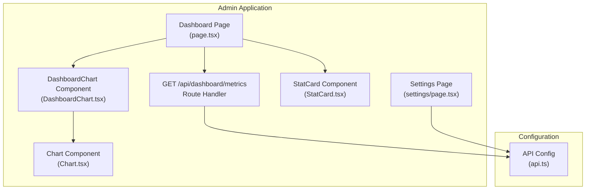
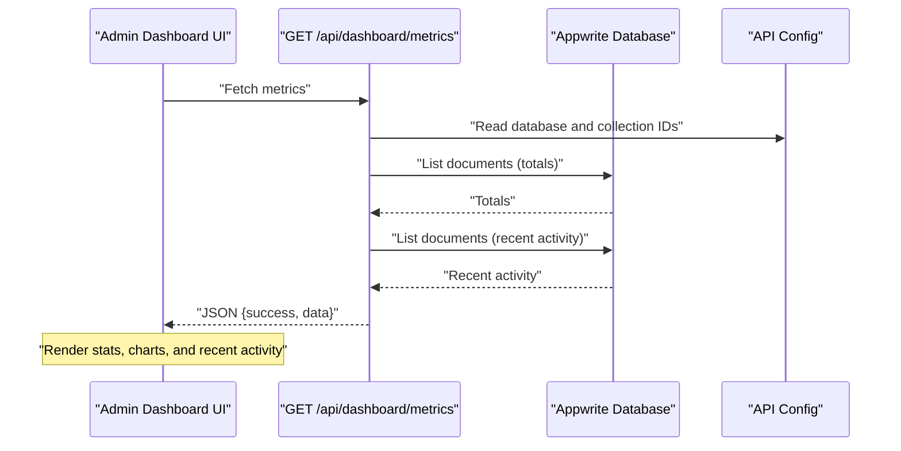
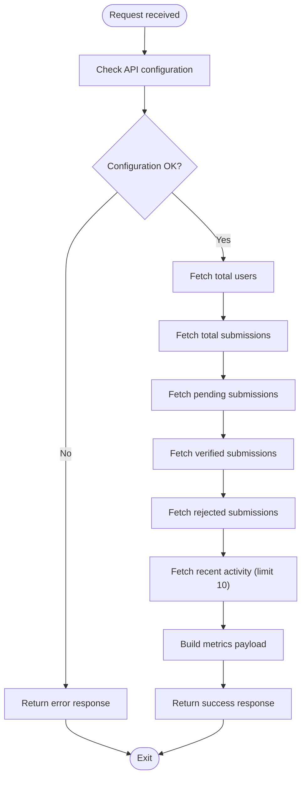
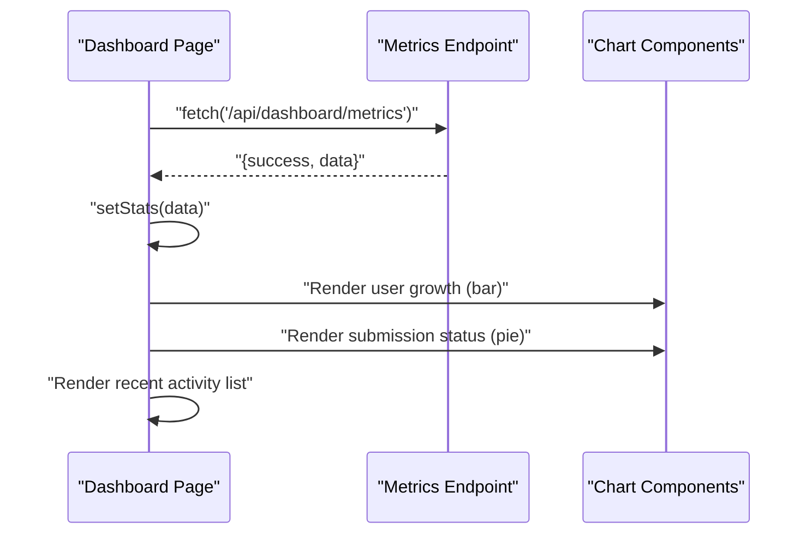
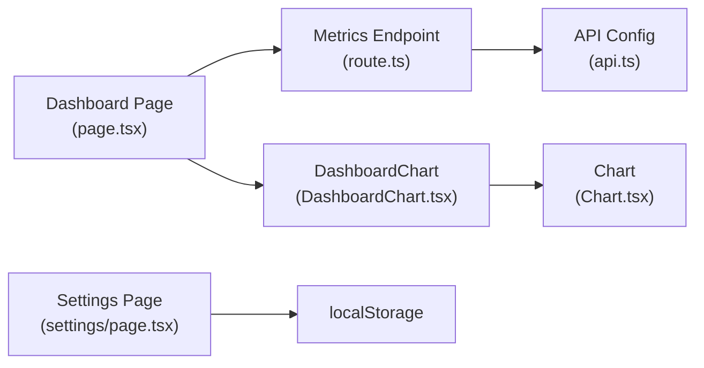

# Dashboard Analytics API

<cite>
**Referenced Files in This Document**
- [route.ts](file://admin/app/api/dashboard/metrics/route.ts)
- [api.ts](file://admin/src/config/api.ts)
- [page.tsx](file://admin/app/dashboard/page.tsx)
- [DashboardChart.tsx](file://admin/components/DashboardChart.tsx)
- [Chart.tsx](file://admin/components/Chart.tsx)
- [StatCard.tsx](file://admin/components/StatCard.tsx)
- [settings/page.tsx](file://admin/app/dashboard/settings/page.tsx)
</cite>

## Table of Contents
1. [Introduction](#introduction)
2. [Project Structure](#project-structure)
3. [Core Components](#core-components)
4. [Architecture Overview](#architecture-overview)
5. [Detailed Component Analysis](#detailed-component-analysis)
6. [Dependency Analysis](#dependency-analysis)
7. [Performance Considerations](#performance-considerations)
8. [Troubleshooting Guide](#troubleshooting-guide)
9. [Conclusion](#conclusion)
10. [Appendices](#appendices)

## Introduction
This document describes the dashboard analytics API and related frontend components for retrieving system analytics, rendering charts, and managing dashboard-related settings. It focuses on:
- GET /api/dashboard/metrics for retrieving system analytics including user counts, task submission statuses, and recent activity
- Frontend consumption of the metrics endpoint and visualization rendering
- Settings management for dashboard configuration and user preferences
- Schemas for analytics data, aggregation, and visualization formats
- Examples of dashboard data retrieval, real-time updates, and custom reporting queries
- Data caching strategies, performance optimization for large datasets, and streaming capabilities

## Project Structure
The analytics API is implemented as a Next.js Route Handler under the admin application. The frontend dashboard page consumes this endpoint and renders charts and statistics. Configuration constants for Appwrite are centralized in a shared configuration module.

**Diagram sources**
- [route.ts](file://admin/app/api/dashboard/metrics/route.ts#L1-L111)
- [page.tsx](file://admin/app/dashboard/page.tsx#L1-L706)
- [DashboardChart.tsx](file://admin/components/DashboardChart.tsx#L1-L35)
- [Chart.tsx](file://admin/components/Chart.tsx#L1-L128)
- [StatCard.tsx](file://admin/components/StatCard.tsx#L1-L53)
- [settings/page.tsx](file://admin/app/dashboard/settings/page.tsx#L1-L201)
- [api.ts](file://admin/src/config/api.ts#L1-L35)

**Section sources**
- [route.ts](file://admin/app/api/dashboard/metrics/route.ts#L1-L111)
- [page.tsx](file://admin/app/dashboard/page.tsx#L1-L706)
- [api.ts](file://admin/src/config/api.ts#L1-L35)

## Core Components
- Metrics API endpoint: GET /api/dashboard/metrics
  - Returns aggregated counts for users, submissions, and task statuses, plus recent activity
  - Uses Appwrite database queries to compute totals and recent records
- Frontend dashboard page: consumes the metrics endpoint and renders:
  - Statistics cards
  - Bar chart for user growth
  - Pie chart for submission status distribution
  - Recent activity feed
- Chart components: reusable wrappers around Recharts for line, bar, pie, and area charts
- Settings page: manages local preferences for app readiness and persists to localStorage

**Section sources**
- [route.ts](file://admin/app/api/dashboard/metrics/route.ts#L1-L111)
- [page.tsx](file://admin/app/dashboard/page.tsx#L1-L706)
- [DashboardChart.tsx](file://admin/components/DashboardChart.tsx#L1-L35)
- [Chart.tsx](file://admin/components/Chart.tsx#L1-L128)
- [StatCard.tsx](file://admin/components/StatCard.tsx#L1-L53)
- [settings/page.tsx](file://admin/app/dashboard/settings/page.tsx#L1-L201)

## Architecture Overview
The dashboard analytics pipeline consists of a serverless route handler that queries Appwrite collections, aggregates counts, and returns a normalized payload. The Next.js dashboard page fetches this data, transforms it into chart-ready series, and renders visualizations.

**Diagram sources**
- [route.ts](file://admin/app/api/dashboard/metrics/route.ts#L1-L111)
- [api.ts](file://admin/src/config/api.ts#L1-L35)
- [page.tsx](file://admin/app/dashboard/page.tsx#L93-L139)

## Detailed Component Analysis

### Metrics Endpoint: GET /api/dashboard/metrics
Purpose:
- Aggregate system analytics from Appwrite collections
- Provide recent activity feed for moderation and oversight

Key behaviors:
- Validates API configuration presence
- Computes:
  - Total registered users
  - Total social task submissions
  - Pending, verified, and rejected submissions
  - Recent activity (last 10 submissions)
- Returns a standardized payload with a timestamp

Processing logic:
- Uses Appwrite listDocuments with optional filters and ordering
- Maps raw documents to a normalized shape for recent activity

Error handling:
- Returns structured error responses on configuration or runtime failures

**Diagram sources**
- [route.ts](file://admin/app/api/dashboard/metrics/route.ts#L1-L111)

**Section sources**
- [route.ts](file://admin/app/api/dashboard/metrics/route.ts#L1-L111)
- [api.ts](file://admin/src/config/api.ts#L1-L35)

### Frontend Dashboard Consumption and Rendering
Purpose:
- Fetch metrics from the backend endpoint
- Render statistics cards and charts
- Display recent activity feed

Key behaviors:
- On mount, fetches from /api/dashboard/metrics
- Parses success/error responses and sets state
- Generates synthetic user growth data for demonstration
- Renders:
  - Stats cards for totals and statuses
  - Bar chart for user growth
  - Pie chart for submission status distribution
  - Recent activity list

**Diagram sources**
- [page.tsx](file://admin/app/dashboard/page.tsx#L93-L139)
- [DashboardChart.tsx](file://admin/components/DashboardChart.tsx#L1-L35)
- [Chart.tsx](file://admin/components/Chart.tsx#L1-L128)

**Section sources**
- [page.tsx](file://admin/app/dashboard/page.tsx#L1-L706)
- [DashboardChart.tsx](file://admin/components/DashboardChart.tsx#L1-L35)
- [Chart.tsx](file://admin/components/Chart.tsx#L1-L128)
- [StatCard.tsx](file://admin/components/StatCard.tsx#L1-L53)

### Settings Management
Purpose:
- Allow administrators to manage dashboard-related preferences locally
- Persist a simple readiness flag to localStorage

Key behaviors:
- Reads initial preference from localStorage on mount
- Toggles a boolean flag and saves to localStorage
- Provides a live preview of the setting’s effect

Note:
- This is a client-side preference store and does not expose a dedicated API endpoint.

**Section sources**
- [settings/page.tsx](file://admin/app/dashboard/settings/page.tsx#L1-L201)

## Dependency Analysis
- API endpoint depends on:
  - Appwrite client configuration for database and collection IDs
  - Appwrite query builder for filtering and ordering
- Frontend dashboard depends on:
  - Metrics endpoint for data
  - Chart components for visualization
  - Local storage for settings persistence

**Diagram sources**
- [route.ts](file://admin/app/api/dashboard/metrics/route.ts#L1-L111)
- [api.ts](file://admin/src/config/api.ts#L1-L35)
- [page.tsx](file://admin/app/dashboard/page.tsx#L1-L706)
- [DashboardChart.tsx](file://admin/components/DashboardChart.tsx#L1-L35)
- [Chart.tsx](file://admin/components/Chart.tsx#L1-L128)
- [settings/page.tsx](file://admin/app/dashboard/settings/page.tsx#L1-L201)

**Section sources**
- [route.ts](file://admin/app/api/dashboard/metrics/route.ts#L1-L111)
- [api.ts](file://admin/src/config/api.ts#L1-L35)
- [page.tsx](file://admin/app/dashboard/page.tsx#L1-L706)
- [DashboardChart.tsx](file://admin/components/DashboardChart.tsx#L1-L35)
- [Chart.tsx](file://admin/components/Chart.tsx#L1-L128)
- [settings/page.tsx](file://admin/app/dashboard/settings/page.tsx#L1-L201)

## Performance Considerations
- Aggregation strategy:
  - Use Appwrite listDocuments with appropriate filters to compute counts efficiently
  - Limit recent activity lists to small sizes (as implemented)
- Caching:
  - Frontend: cache metrics in memory for short intervals to reduce redundant requests
  - Backend: consider caching computed totals if data volume is large and update cadence is low
- Pagination and limits:
  - Apply Query.limit for recent activity and paginated user listings
- Indexing:
  - Ensure status and createdAt fields are indexed in Appwrite for fast filtering and sorting
- Streaming:
  - Real-time updates are not implemented in the current code; consider Appwrite subscriptions or polling for near-real-time dashboards

[No sources needed since this section provides general guidance]

## Troubleshooting Guide
Common issues and resolutions:
- Missing API configuration:
  - Symptom: Endpoint returns an internal error indicating missing API key
  - Resolution: Set APPWRITE_API_KEY and related environment variables
- Database connectivity:
  - Symptom: Endpoint fails with an error response
  - Resolution: Verify DATABASE_ID and collection IDs match the Appwrite instance
- Frontend fetch errors:
  - Symptom: Dashboard shows an error state
  - Resolution: Inspect network tab for 5xx responses; confirm endpoint availability and authentication

**Section sources**
- [route.ts](file://admin/app/api/dashboard/metrics/route.ts#L1-L111)
- [page.tsx](file://admin/app/dashboard/page.tsx#L93-L139)

## Conclusion
The dashboard analytics API provides a focused set of metrics derived from Appwrite collections, enabling administrators to monitor user counts, task submission statuses, and recent activity. The frontend composes these metrics into charts and cards for quick insights. While the current implementation emphasizes simplicity and clarity, future enhancements can include configurable time windows, richer aggregations, and real-time streaming for dynamic dashboards.

[No sources needed since this section summarizes without analyzing specific files]

## Appendices

### API Definition: GET /api/dashboard/metrics
- Method: GET
- Path: /api/dashboard/metrics
- Description: Retrieves system analytics including user totals, submission counts, and recent activity
- Response format:
  - success: boolean
  - data: object containing:
    - totalUsers: number
    - totalSubmissions: number
    - completedTasks: number
    - pendingSubmissions: number
    - verifiedSubmissions: number
    - rejectedSubmissions: number
    - recentActivity: array of objects with submission metadata
    - timestamp: ISO date string

Example request:
- curl -s http://localhost:3000/api/dashboard/metrics

Example response:
- {
  "success": true,
  "data": {
    "totalUsers": 1234,
    "totalSubmissions": 5678,
    "completedTasks": 4567,
    "pendingSubmissions": 890,
    "verifiedSubmissions": 4567,
    "rejectedSubmissions": 123,
    "recentActivity": [ ... ],
    "timestamp": "2025-01-01T00:00:00Z"
  }
}

Notes:
- The endpoint validates configuration and returns structured errors on failure
- Recent activity is limited to a small number of records

**Section sources**
- [route.ts](file://admin/app/api/dashboard/metrics/route.ts#L1-L111)

### Analytics Schemas and Aggregation Functions
- Metric calculations:
  - Totals: count of documents in user profiles and user social tasks collections
  - Status breakdowns: counts filtered by status values
  - Recent activity: ordered list of recent submissions
- Visualization data formats:
  - Bar chart: array of objects with name and users keys
  - Pie chart: array of objects with name and value keys
- Statistical summaries:
  - Current implementation uses raw counts; future extensions can include averages, trends, and time-based slices

**Section sources**
- [page.tsx](file://admin/app/dashboard/page.tsx#L120-L132)
- [Chart.tsx](file://admin/components/Chart.tsx#L1-L128)

### Examples: Dashboard Data Retrieval and Custom Reporting
- Dashboard data retrieval:
  - The dashboard page fetches metrics and sets stats and chart data
  - See the fetch and state-setting logic in the dashboard page
- Real-time updates:
  - Not implemented in the current code; consider periodic polling or Appwrite subscriptions
- Custom reporting queries:
  - Extend the endpoint to accept query parameters (time range, status filters)
  - Add new chart types and summary endpoints as needed

**Section sources**
- [page.tsx](file://admin/app/dashboard/page.tsx#L93-L139)
- [DashboardChart.tsx](file://admin/components/DashboardChart.tsx#L1-L35)