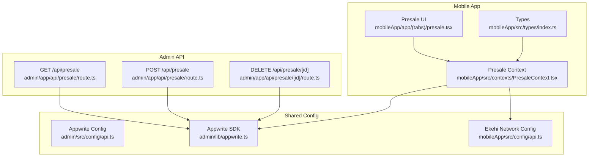
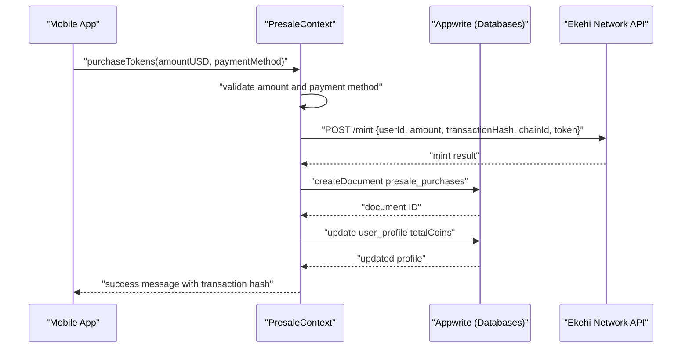
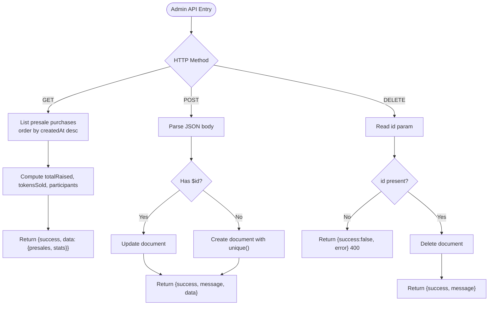
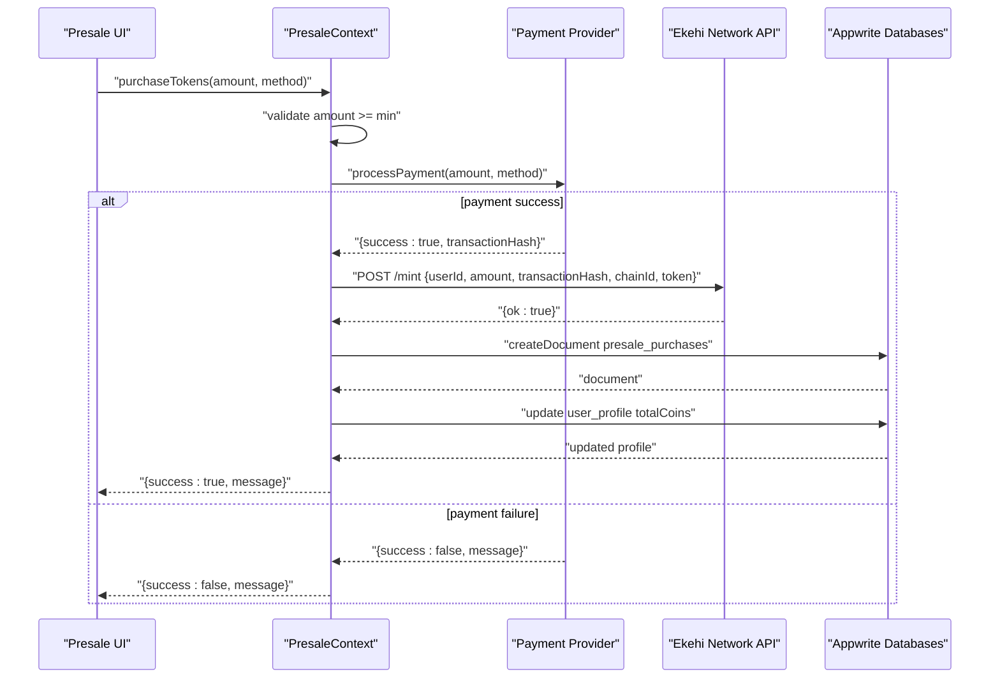
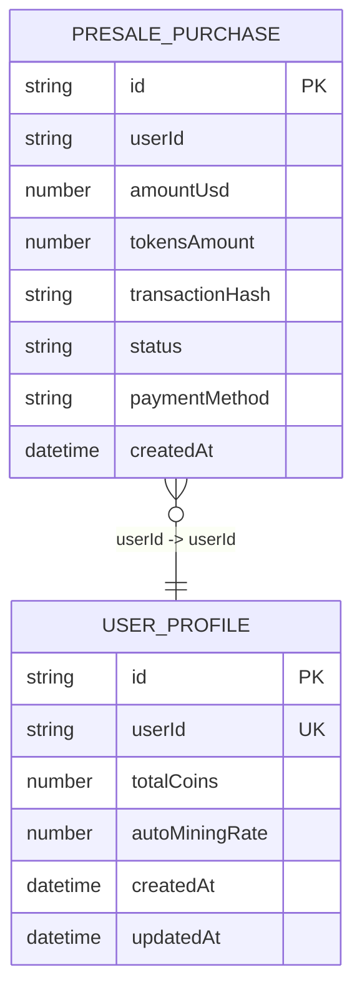
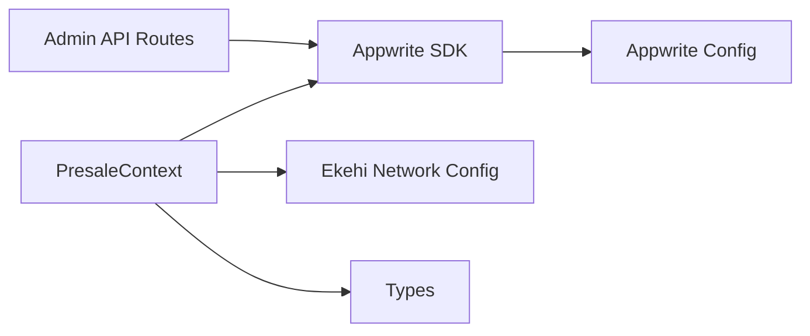

# Presale & Token API

<cite>
**Referenced Files in This Document**
- [admin/app/api/presale/route.ts](file://admin/app/api/presale/route.ts)
- [admin/app/api/presale/[id]/route.ts](file://admin/app/api/presale/[id]/route.ts)
- [admin/lib/appwrite.ts](file://admin/lib/appwrite.ts)
- [admin/src/config/api.ts](file://admin/src/config/api.ts)
- [mobileApp/src/config/api.ts](file://mobileApp/src/config/api.ts)
- [mobileApp/src/contexts/PresaleContext.tsx](file://mobileApp/src/contexts/PresaleContext.tsx)
- [mobileApp/app/(tabs)/presale.tsx](file://mobileApp/app/(tabs)/presale.tsx)
- [mobileApp/src/types/index.ts](file://mobileApp/src/types/index.ts)
- [mobileApp/docs/EKEHI_NETWORK_INTEGRATION.md](file://mobileApp/docs/EKEHI_NETWORK_INTEGRATION.md)
- [mobileApp/docs/PRESALE_ERROR_HANDLING_IMPROVEMENTS.md](file://mobileApp/docs/PRESALE_ERROR_HANDLING_IMPROVEMENTS.md)
</cite>

## Table of Contents
1. [Introduction](#introduction)
2. [Project Structure](#project-structure)
3. [Core Components](#core-components)
4. [Architecture Overview](#architecture-overview)
5. [Detailed Component Analysis](#detailed-component-analysis)
6. [Dependency Analysis](#dependency-analysis)
7. [Performance Considerations](#performance-considerations)
8. [Troubleshooting Guide](#troubleshooting-guide)
9. [Conclusion](#conclusion)
10. [Appendices](#appendices)

## Introduction
This document provides API documentation for presale and token management endpoints, focusing on:
- Retrieving presale configurations, pricing, and purchase history
- Processing token purchases, payment integration, and transaction validation
- Individual presale purchase retrieval and status tracking
- Token operation schemas for purchase transactions, refunds, and balance updates
- Examples of presale integration, payment gateway connectivity, and token distribution workflows
- Transaction security, payment validation, and blockchain wallet system integration

The backend API is implemented in the admin application using Next.js routes backed by Appwrite. The frontend mobile application integrates with Appwrite for user and purchase data and with the Ekehi Network blockchain API for minting and token transfers.

## Project Structure
The presale and token management functionality spans:
- Admin API (Next.js routes) for managing presale purchases and statistics
- Mobile app contexts and pages for purchase flow and UI
- Shared configuration for Appwrite and Ekehi Network endpoints
- Types for presale purchase records

**Diagram sources**
- [admin/app/api/presale/route.ts](file://admin/app/api/presale/route.ts#L1-L75)
- [admin/app/api/presale/[id]/route.ts](file://admin/app/api/presale/[id]/route.ts#L1-L29)
- [admin/lib/appwrite.ts](file://admin/lib/appwrite.ts#L1-L33)
- [admin/src/config/api.ts](file://admin/src/config/api.ts#L1-L35)
- [mobileApp/src/config/api.ts](file://mobileApp/src/config/api.ts#L1-L44)
- [mobileApp/src/contexts/PresaleContext.tsx](file://mobileApp/src/contexts/PresaleContext.tsx#L1-L414)
- [mobileApp/app/(tabs)/presale.tsx](file://mobileApp/app/(tabs)/presale.tsx#L1-L458)
- [mobileApp/src/types/index.ts](file://mobileApp/src/types/index.ts#L75-L84)

**Section sources**
- [admin/app/api/presale/route.ts](file://admin/app/api/presale/route.ts#L1-L75)
- [admin/app/api/presale/[id]/route.ts](file://admin/app/api/presale/[id]/route.ts#L1-L29)
- [admin/lib/appwrite.ts](file://admin/lib/appwrite.ts#L1-L33)
- [admin/src/config/api.ts](file://admin/src/config/api.ts#L1-L35)
- [mobileApp/src/config/api.ts](file://mobileApp/src/config/api.ts#L1-L44)
- [mobileApp/src/contexts/PresaleContext.tsx](file://mobileApp/src/contexts/PresaleContext.tsx#L1-L414)
- [mobileApp/app/(tabs)/presale.tsx](file://mobileApp/app/(tabs)/presale.tsx#L1-L458)
- [mobileApp/src/types/index.ts](file://mobileApp/src/types/index.ts#L75-L84)

## Core Components
- Admin presale API
  - GET /api/presale: Returns paginated presale documents and computed statistics (raised USD, tokens sold, participant count)
  - POST /api/presale: Creates or updates a presale purchase document in Appwrite
  - DELETE /api/presale/[id]: Removes a presale purchase by ID
- Mobile presale context
  - Validates purchase amount and payment method
  - Integrates with Ekehi Network API to mint tokens
  - Persists purchase record to Appwrite and updates user profile balances
- Shared configuration
  - Appwrite endpoint, project, API key, database ID, and collection IDs
  - Ekehi Network base URL, API key, chain ID, and token contract address

**Section sources**
- [admin/app/api/presale/route.ts](file://admin/app/api/presale/route.ts#L1-L75)
- [admin/app/api/presale/[id]/route.ts](file://admin/app/api/presale/[id]/route.ts#L1-L29)
- [mobileApp/src/contexts/PresaleContext.tsx](file://mobileApp/src/contexts/PresaleContext.tsx#L135-L269)
- [mobileApp/src/config/api.ts](file://mobileApp/src/config/api.ts#L1-L44)
- [admin/src/config/api.ts](file://admin/src/config/api.ts#L1-L35)

## Architecture Overview
The presale and token management architecture integrates:
- Frontend mobile app with Appwrite for user and purchase data
- Backend admin API for administrative oversight and purchase management
- Ekehi Network blockchain API for minting and token distribution

**Diagram sources**
- [mobileApp/src/contexts/PresaleContext.tsx](file://mobileApp/src/contexts/PresaleContext.tsx#L135-L269)
- [mobileApp/src/config/api.ts](file://mobileApp/src/config/api.ts#L1-L44)
- [admin/lib/appwrite.ts](file://admin/lib/appwrite.ts#L1-L33)

**Section sources**
- [mobileApp/docs/EKEHI_NETWORK_INTEGRATION.md](file://mobileApp/docs/EKEHI_NETWORK_INTEGRATION.md#L1-L49)
- [mobileApp/src/contexts/PresaleContext.tsx](file://mobileApp/src/contexts/PresaleContext.tsx#L135-L269)

## Detailed Component Analysis

### Admin API: Presale Endpoints
- GET /api/presale
  - Fetches presale purchase documents ordered by creation time
  - Computes statistics:
    - totalRaised: sum of completed purchases’ amountUsd
    - tokensSold: sum of completed purchases’ tokensAmount
    - participants: distinct userId count among completed purchases
  - Returns success flag and payload with presales array and stats
- POST /api/presale
  - Parses request body as JSON
  - If $id exists, updates existing document; otherwise creates a new document with unique ID
  - Returns success flag and created/updated document
- DELETE /api/presale/[id]
  - Requires id param
  - Deletes the specified presale purchase document
  - Returns success flag and message

**Diagram sources**
- [admin/app/api/presale/route.ts](file://admin/app/api/presale/route.ts#L1-L75)
- [admin/app/api/presale/[id]/route.ts](file://admin/app/api/presale/[id]/route.ts#L1-L29)

**Section sources**
- [admin/app/api/presale/route.ts](file://admin/app/api/presale/route.ts#L1-L75)
- [admin/app/api/presale/[id]/route.ts](file://admin/app/api/presale/[id]/route.ts#L1-L29)

### Mobile App: Presale Purchase Flow
- Validation and UI
  - Enforces minimum purchase amount and payment method selection
  - Calculates tokens from USD using tokenPrice
  - Displays loading state and success/error messages
- Payment processing
  - In the current implementation, payment processing is simulated and returns a mock transaction hash
  - In a production environment, integrate with a payment provider and capture a real transaction hash
- Minting and persistence
  - Calls Ekehi Network API POST /mint with userId, amount, transactionHash, chainId, and token
  - On success, persists a presale purchase document to Appwrite with status completed
  - Updates user profile totalCoins and refetches purchases

**Diagram sources**
- [mobileApp/app/(tabs)/presale.tsx](file://mobileApp/app/(tabs)/presale.tsx#L1-L120)
- [mobileApp/src/contexts/PresaleContext.tsx](file://mobileApp/src/contexts/PresaleContext.tsx#L135-L269)
- [mobileApp/src/config/api.ts](file://mobileApp/src/config/api.ts#L1-L44)

**Section sources**
- [mobileApp/app/(tabs)/presale.tsx](file://mobileApp/app/(tabs)/presale.tsx#L1-L120)
- [mobileApp/src/contexts/PresaleContext.tsx](file://mobileApp/src/contexts/PresaleContext.tsx#L135-L269)
- [mobileApp/src/types/index.ts](file://mobileApp/src/types/index.ts#L75-L84)

### Token Operation Schemas
- Presale purchase document (Appwrite collection: presale_purchases)
  - Fields: id, userId, amountUsd, tokensAmount, transactionHash, status, paymentMethod, createdAt
  - Status values: pending, completed, refunded (if applicable)
- User profile document (Appwrite collection: user_profiles)
  - Fields include totalCoins and autoMiningRate (and other mining-related fields)
- Ekehi Network mint request
  - Endpoint: POST /mint
  - Body: { userId, amount, transactionHash, chainId, token }
  - Response: ok indicator and message on failure

**Diagram sources**
- [mobileApp/src/types/index.ts](file://mobileApp/src/types/index.ts#L75-L84)
- [admin/src/config/api.ts](file://admin/src/config/api.ts#L1-L35)

**Section sources**
- [mobileApp/src/types/index.ts](file://mobileApp/src/types/index.ts#L75-L84)
- [mobileApp/src/config/api.ts](file://mobileApp/src/config/api.ts#L1-L44)

### API Definitions

- GET /api/presale
  - Description: Retrieve all presale purchases and compute raised totals, token counts, and participant metrics
  - Response: { success: boolean, data: { presales: PresalePurchase[], stats: { totalRaised: number, tokensSold: number, participants: number } } }
  - Errors: 500 with { success: false, error: string }

- POST /api/presale
  - Description: Create or update a presale purchase document
  - Request body: PresalePurchase (omit $id to create; include $id to update)
  - Response: { success: boolean, message: string, data: PresalePurchase }
  - Errors: 500 with { success: false, error: string }

- DELETE /api/presale/[id]
  - Description: Delete a presale purchase by ID
  - Path params: id (required)
  - Response: { success: boolean, message: string }
  - Errors: 400 with { success: false, error: string } if id missing; 500 with error on failure

**Section sources**
- [admin/app/api/presale/route.ts](file://admin/app/api/presale/route.ts#L1-L75)
- [admin/app/api/presale/[id]/route.ts](file://admin/app/api/presale/[id]/route.ts#L1-L29)
- [mobileApp/src/types/index.ts](file://mobileApp/src/types/index.ts#L75-L84)

## Dependency Analysis
- Admin API depends on:
  - Appwrite client and database service
  - Appwrite collection identifiers for presale purchases
- Mobile app depends on:
  - Appwrite for user and purchase data
  - Ekehi Network API for minting and token operations
- Shared configuration:
  - Environment variables for endpoints, project IDs, API keys, and collection IDs

**Diagram sources**
- [admin/lib/appwrite.ts](file://admin/lib/appwrite.ts#L1-L33)
- [admin/src/config/api.ts](file://admin/src/config/api.ts#L1-L35)
- [mobileApp/src/config/api.ts](file://mobileApp/src/config/api.ts#L1-L44)
- [mobileApp/src/contexts/PresaleContext.tsx](file://mobileApp/src/contexts/PresaleContext.tsx#L1-L414)
- [mobileApp/src/types/index.ts](file://mobileApp/src/types/index.ts#L75-L84)

**Section sources**
- [admin/lib/appwrite.ts](file://admin/lib/appwrite.ts#L1-L33)
- [admin/src/config/api.ts](file://admin/src/config/api.ts#L1-L35)
- [mobileApp/src/config/api.ts](file://mobileApp/src/config/api.ts#L1-L44)
- [mobileApp/src/contexts/PresaleContext.tsx](file://mobileApp/src/contexts/PresaleContext.tsx#L1-L414)

## Performance Considerations
- Use pagination and ordering efficiently on the backend to avoid large payloads
- Cache frequently accessed presale statistics at the application level when appropriate
- Apply exponential backoff and retries for external API calls (as seen in the mobile context)
- Minimize redundant reads/writes by batching updates and consolidating queries

[No sources needed since this section provides general guidance]

## Troubleshooting Guide
- Payment processing failures
  - Verify payment provider integration and transaction hash generation
  - Ensure the mobile context returns clear error messages and logs
- Minting failures
  - Confirm Ekehi Network API credentials and endpoint configuration
  - Inspect response bodies for detailed error messages
- Data synchronization issues
  - Validate Appwrite collection IDs and API keys
  - Confirm user profile exists before updating totalCoins
- UI stability
  - Follow safe formatting and calculation patterns to prevent crashes
  - Use loading states and error boundaries to improve resilience

**Section sources**
- [mobileApp/src/contexts/PresaleContext.tsx](file://mobileApp/src/contexts/PresaleContext.tsx#L135-L269)
- [mobileApp/docs/PRESALE_ERROR_HANDLING_IMPROVEMENTS.md](file://mobileApp/docs/PRESALE_ERROR_HANDLING_IMPROVEMENTS.md#L1-L192)

## Conclusion
The presale and token management system combines a robust admin API for purchase oversight with a secure mobile purchase flow integrating Appwrite and the Ekehi Network blockchain. By adhering to the documented schemas, validation steps, and integration patterns, teams can implement reliable presale experiences with strong transaction security and clear audit trails.

[No sources needed since this section summarizes without analyzing specific files]

## Appendices

### Example Workflows

- Presale purchase workflow
  - User selects amount and payment method in the UI
  - Mobile app validates amount and calls payment provider
  - On success, mobile app mints tokens via Ekehi Network API and persists the purchase to Appwrite
  - User profile totalCoins is updated and purchases are refreshed

- Token distribution workflow
  - Admin retrieves presale statistics via GET /api/presale
  - Admin can create/update/delete purchase records via POST /api/presale and DELETE /api/presale/[id]
  - Mobile app displays purchase history and calculates auto mining benefits

**Section sources**
- [mobileApp/app/(tabs)/presale.tsx](file://mobileApp/app/(tabs)/presale.tsx#L1-L120)
- [mobileApp/src/contexts/PresaleContext.tsx](file://mobileApp/src/contexts/PresaleContext.tsx#L135-L269)
- [admin/app/api/presale/route.ts](file://admin/app/api/presale/route.ts#L1-L75)
- [admin/app/api/presale/[id]/route.ts](file://admin/app/api/presale/[id]/route.ts#L1-L29)

### Transaction Security and Validation Checklist
- Validate payment method and amount thresholds before initiating minting
- Capture and persist transactionHash from the payment provider
- Use API keys and secure endpoints for Ekehi Network API
- Implement idempotency for purchase creation and updates
- Log and alert on minting failures with detailed error context

**Section sources**
- [mobileApp/src/contexts/PresaleContext.tsx](file://mobileApp/src/contexts/PresaleContext.tsx#L135-L269)
- [mobileApp/src/config/api.ts](file://mobileApp/src/config/api.ts#L1-L44)
- [admin/src/config/api.ts](file://admin/src/config/api.ts#L1-L35)