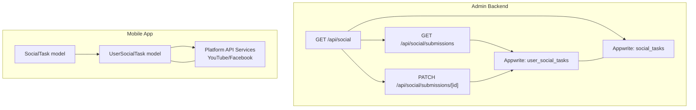
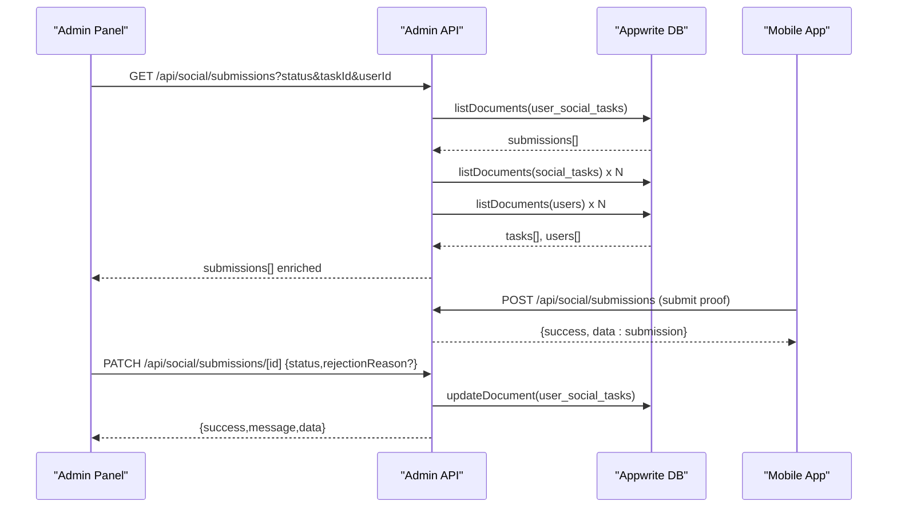
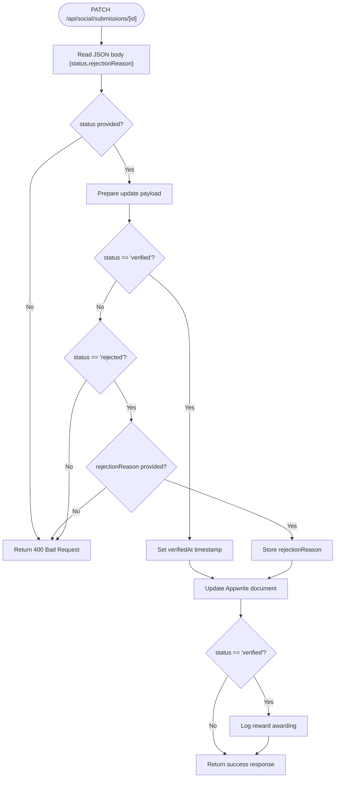
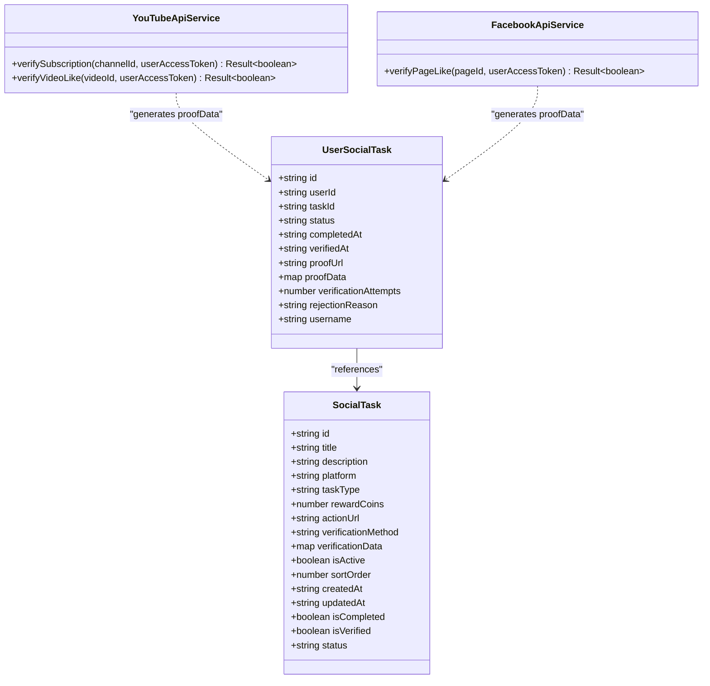
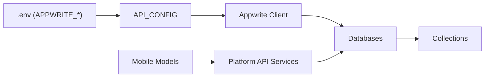

# Social Tasks API

<cite>
**Referenced Files in This Document**
- [admin/app/api/social/submissions/route.ts](file://admin/app/api/social/submissions/route.ts)
- [admin/app/api/social/submissions/[id]/route.ts](file://admin/app/api/social/submissions/[id]/route.ts)
- [admin/src/config/api.ts](file://admin/src/config/api.ts)
- [admin/lib/appwrite.ts](file://admin/lib/appwrite.ts)
- [admin/app/api/social/route.ts](file://admin/app/api/social/route.ts)
- [ktMobileApp/app/src/main/java/com/ekehi/network/data/model/SocialTask.kt](file://ktMobileApp/app/src/main/java/com/ekehi/network/data/model/SocialTask.kt)
- [ktMobileApp/app/src/main/java/com/ekehi/network/data/model/UserSocialTask.kt](file://ktMobileApp/app/src/main/java/com/ekehi/network/data/model/UserSocialTask.kt)
- [ktMobileApp/app/src/main/java/com/ekehi/network/service/FacebookApiService.kt](file://ktMobileApp/app/src/main/java/com/ekehi/network/service/FacebookApiService.kt)
- [ktMobileApp/app/src/main/java/com/ekehi/network/service/YouTubeApiService.kt](file://ktMobileApp/app/src/main/java/com/ekehi/network/service/YouTubeApiService.kt)
</cite>

## Table of Contents
1. [Introduction](#introduction)
2. [Project Structure](#project-structure)
3. [Core Components](#core-components)
4. [Architecture Overview](#architecture-overview)
5. [Detailed Component Analysis](#detailed-component-analysis)
6. [Dependency Analysis](#dependency-analysis)
7. [Performance Considerations](#performance-considerations)
8. [Troubleshooting Guide](#troubleshooting-guide)
9. [Conclusion](#conclusion)
10. [Appendices](#appendices)

## Introduction
This document describes the Social Tasks API surface for managing social task verification and submission workflows. It covers:
- Listing submissions with filtering and enrichment
- Approving/rejecting submissions and rewarding users
- Task definition lifecycle for platform-specific verification
- Client-side integration patterns for platform APIs (YouTube, Facebook)
- Schemas and validation rules for submissions and verification data

The API is implemented in the admin backend and integrates with the mobile app’s social task models and platform verification services.

## Project Structure
The Social Tasks API is organized under the admin Next.js routes:
- Social task definitions: GET/POST/DELETE for task catalog
- Submissions: GET (with filters and enrichment), PATCH (status update)
- Supporting configuration and Appwrite client bindings

**Diagram sources**
- [admin/app/api/social/route.ts](file://admin/app/api/social/route.ts#L1-L167)
- [admin/app/api/social/submissions/route.ts](file://admin/app/api/social/submissions/route.ts#L1-L142)
- [admin/app/api/social/submissions/[id]/route.ts](file://admin/app/api/social/submissions/[id]/route.ts#L1-L108)
- [admin/lib/appwrite.ts](file://admin/lib/appwrite.ts#L1-L33)
- [admin/src/config/api.ts](file://admin/src/config/api.ts#L1-L35)
- [ktMobileApp/app/src/main/java/com/ekehi/network/data/model/SocialTask.kt](file://ktMobileApp/app/src/main/java/com/ekehi/network/data/model/SocialTask.kt#L1-L22)
- [ktMobileApp/app/src/main/java/com/ekehi/network/data/model/UserSocialTask.kt](file://ktMobileApp/app/src/main/java/com/ekehi/network/data/model/UserSocialTask.kt#L1-L15)
- [ktMobileApp/app/src/main/java/com/ekehi/network/service/YouTubeApiService.kt](file://ktMobileApp/app/src/main/java/com/ekehi/network/service/YouTubeApiService.kt#L1-L98)
- [ktMobileApp/app/src/main/java/com/ekehi/network/service/FacebookApiService.kt](file://ktMobileApp/app/src/main/java/com/ekehi/network/service/FacebookApiService.kt#L1-L52)

**Section sources**
- [admin/app/api/social/route.ts](file://admin/app/api/social/route.ts#L1-L167)
- [admin/app/api/social/submissions/route.ts](file://admin/app/api/social/submissions/route.ts#L1-L142)
- [admin/app/api/social/submissions/[id]/route.ts](file://admin/app/api/social/submissions/[id]/route.ts#L1-L108)
- [admin/lib/appwrite.ts](file://admin/lib/appwrite.ts#L1-L33)
- [admin/src/config/api.ts](file://admin/src/config/api.ts#L1-L35)

## Core Components
- Social task definitions: CRUD for task catalog with verification metadata
- Submission listing: filtered retrieval with enrichment for task and user details
- Submission status update: approve/reject with optional reward logging
- Mobile models: typed representations for task and user-task records
- Platform API services: YouTube and Facebook verification integrations

**Section sources**
- [admin/app/api/social/route.ts](file://admin/app/api/social/route.ts#L1-L167)
- [admin/app/api/social/submissions/route.ts](file://admin/app/api/social/submissions/route.ts#L1-L142)
- [admin/app/api/social/submissions/[id]/route.ts](file://admin/app/api/social/submissions/[id]/route.ts#L1-L108)
- [ktMobileApp/app/src/main/java/com/ekehi/network/data/model/SocialTask.kt](file://ktMobileApp/app/src/main/java/com/ekehi/network/data/model/SocialTask.kt#L1-L22)
- [ktMobileApp/app/src/main/java/com/ekehi/network/data/model/UserSocialTask.kt](file://ktMobileApp/app/src/main/java/com/ekehi/network/data/model/UserSocialTask.kt#L1-L15)
- [ktMobileApp/app/src/main/java/com/ekehi/network/service/YouTubeApiService.kt](file://ktMobileApp/app/src/main/java/com/ekehi/network/service/YouTubeApiService.kt#L1-L98)
- [ktMobileApp/app/src/main/java/com/ekehi/network/service/FacebookApiService.kt](file://ktMobileApp/app/src/main/java/com/ekehi/network/service/FacebookApiService.kt#L1-L52)

## Architecture Overview
The admin backend exposes REST endpoints backed by Appwrite. The mobile app consumes task catalogs and submits user task attempts with platform-specific proof data. Admin endpoints enrich submissions with task and user details and support status transitions.

**Diagram sources**
- [admin/app/api/social/submissions/route.ts](file://admin/app/api/social/submissions/route.ts#L1-L142)
- [admin/app/api/social/submissions/[id]/route.ts](file://admin/app/api/social/submissions/[id]/route.ts#L1-L108)
- [admin/lib/appwrite.ts](file://admin/lib/appwrite.ts#L1-L33)
- [admin/src/config/api.ts](file://admin/src/config/api.ts#L1-L35)

## Detailed Component Analysis

### GET /api/social/submissions
- Purpose: Retrieve paginated submissions with optional filters and enrichments
- Filters:
  - status: submission status filter
  - taskId: task identifier filter
  - userId: user identifier filter
- Ordering: descending by creation time
- Enrichment:
  - Fetches related task details per submission
  - Fetches related user details per submission
- Response shape:
  - success: boolean
  - data.submissions: array of submissions with embedded task and user
  - data.total: integer count

Implementation highlights:
- Builds Appwrite queries dynamically from query parameters
- Batches reads for tasks and users to respect query limits
- Transforms raw documents to a normalized data model

**Section sources**
- [admin/app/api/social/submissions/route.ts](file://admin/app/api/social/submissions/route.ts#L1-L142)

### PATCH /api/social/submissions/[id]
- Purpose: Update submission status and optionally record rejection reason
- Required payload:
  - status: "verified" | "rejected"
  - rejectionReason: string (required when status is "rejected")
- Behavior:
  - On "verified": sets verifiedAt timestamp and logs reward awarding
  - On "rejected": stores rejectionReason
- Response shape:
  - success: boolean
  - message: string
  - data: normalized submission record

Approval workflow:
- Approve: transition to verified, set verifiedAt, log reward
- Reject: transition to rejected, store rejectionReason

**Diagram sources**
- [admin/app/api/social/submissions/[id]/route.ts](file://admin/app/api/social/submissions/[id]/route.ts#L1-L108)

**Section sources**
- [admin/app/api/social/submissions/[id]/route.ts](file://admin/app/api/social/submissions/[id]/route.ts#L1-L108)

### POST /api/social/submissions (Client-side submission)
- Purpose: Submit a user task attempt with platform-specific proof data
- Expected payload (from mobile model):
  - userId, taskId
  - status: "pending"
  - completedAt (optional)
  - proofUrl, proofEmail, proofData (platform-specific)
  - verificationAttempts, rejectionReason (nullable)
  - username (optional)
- Response shape:
  - success: boolean
  - message: string
  - data: normalized submission record

Note: The admin route for submissions does not implement POST. The mobile app constructs and sends submission payloads to the backend. The admin route for social tasks supports creation/update of task definitions.

**Section sources**
- [ktMobileApp/app/src/main/java/com/ekehi/network/data/model/UserSocialTask.kt](file://ktMobileApp/app/src/main/java/com/ekehi/network/data/model/UserSocialTask.kt#L1-L15)
- [admin/app/api/social/route.ts](file://admin/app/api/social/route.ts#L65-L122)

### GET /api/social (Task Catalog)
- Purpose: Retrieve active social tasks with statistics
- Response shape:
  - success: boolean
  - data.tasks: array of normalized task records
  - data.stats: total, active, inactive counts

Task schema fields:
- id, title, description, platform, taskType, rewardCoins, actionUrl
- verificationMethod, verificationData, isActive, sortOrder
- createdAt, updatedAt

**Section sources**
- [admin/app/api/social/route.ts](file://admin/app/api/social/route.ts#L1-L64)
- [ktMobileApp/app/src/main/java/com/ekehi/network/data/model/SocialTask.kt](file://ktMobileApp/app/src/main/java/com/ekehi/network/data/model/SocialTask.kt#L1-L22)

### Task Verification Schemas and Platform Integrations
- SocialTask model (mobile):
  - Fields include platform, taskType, rewardCoins, verificationMethod, verificationData, isActive, sortOrder, status, timestamps
- UserSocialTask model (mobile):
  - Fields include userId, taskId, status ("pending", "verified", "rejected"), timestamps, proof*, verificationAttempts, rejectionReason, username
- Platform API services:
  - YouTube: verify subscription and video like via YouTube Data API v3
  - Facebook: verify page like via Graph API

**Diagram sources**
- [ktMobileApp/app/src/main/java/com/ekehi/network/data/model/SocialTask.kt](file://ktMobileApp/app/src/main/java/com/ekehi/network/data/model/SocialTask.kt#L1-L22)
- [ktMobileApp/app/src/main/java/com/ekehi/network/data/model/UserSocialTask.kt](file://ktMobileApp/app/src/main/java/com/ekehi/network/data/model/UserSocialTask.kt#L1-L15)
- [ktMobileApp/app/src/main/java/com/ekehi/network/service/YouTubeApiService.kt](file://ktMobileApp/app/src/main/java/com/ekehi/network/service/YouTubeApiService.kt#L1-L98)
- [ktMobileApp/app/src/main/java/com/ekehi/network/service/FacebookApiService.kt](file://ktMobileApp/app/src/main/java/com/ekehi/network/service/FacebookApiService.kt#L1-L52)

**Section sources**
- [ktMobileApp/app/src/main/java/com/ekehi/network/data/model/SocialTask.kt](file://ktMobileApp/app/src/main/java/com/ekehi/network/data/model/SocialTask.kt#L1-L22)
- [ktMobileApp/app/src/main/java/com/ekehi/network/data/model/UserSocialTask.kt](file://ktMobileApp/app/src/main/java/com/ekehi/network/data/model/UserSocialTask.kt#L1-L15)
- [ktMobileApp/app/src/main/java/com/ekehi/network/service/YouTubeApiService.kt](file://ktMobileApp/app/src/main/java/com/ekehi/network/service/YouTubeApiService.kt#L1-L98)
- [ktMobileApp/app/src/main/java/com/ekehi/network/service/FacebookApiService.kt](file://ktMobileApp/app/src/main/java/com/ekehi/network/service/FacebookApiService.kt#L1-L52)

### Examples and Workflows

#### Example: Task Submission Processing
- Mobile app completes a task action and gathers platform-specific proof (e.g., YouTube subscription)
- Mobile app posts submission with proofData to the backend
- Admin lists submissions and reviews them
- Admin approves submission, which sets verifiedAt and logs reward

**Section sources**
- [ktMobileApp/app/src/main/java/com/ekehi/network/data/model/UserSocialTask.kt](file://ktMobileApp/app/src/main/java/com/ekehi/network/data/model/UserSocialTask.kt#L1-L15)
- [admin/app/api/social/submissions/route.ts](file://admin/app/api/social/submissions/route.ts#L1-L142)
- [admin/app/api/social/submissions/[id]/route.ts](file://admin/app/api/social/submissions/[id]/route.ts#L1-L108)

#### Example: Verification Approval Workflow
- Admin calls PATCH /api/social/submissions/[id] with status=verified
- Backend updates document and logs reward awarding
- Response confirms success and returns updated submission

**Section sources**
- [admin/app/api/social/submissions/[id]/route.ts](file://admin/app/api/social/submissions/[id]/route.ts#L1-L108)

#### Example: Status Tracking
- GET /api/social/submissions filters by status, userId, taskId
- Response includes submissions with embedded task and user details for quick triage

**Section sources**
- [admin/app/api/social/submissions/route.ts](file://admin/app/api/social/submissions/route.ts#L1-L142)

## Dependency Analysis
- Admin API depends on:
  - Appwrite client initialized with environment variables
  - Appwrite database and collection identifiers
- Mobile app depends on:
  - Typed models for SocialTask and UserSocialTask
  - Platform API services for verification

**Diagram sources**
- [admin/src/config/api.ts](file://admin/src/config/api.ts#L1-L35)
- [admin/lib/appwrite.ts](file://admin/lib/appwrite.ts#L1-L33)
- [ktMobileApp/app/src/main/java/com/ekehi/network/data/model/SocialTask.kt](file://ktMobileApp/app/src/main/java/com/ekehi/network/data/model/SocialTask.kt#L1-L22)
- [ktMobileApp/app/src/main/java/com/ekehi/network/data/model/UserSocialTask.kt](file://ktMobileApp/app/src/main/java/com/ekehi/network/data/model/UserSocialTask.kt#L1-L15)
- [ktMobileApp/app/src/main/java/com/ekehi/network/service/YouTubeApiService.kt](file://ktMobileApp/app/src/main/java/com/ekehi/network/service/YouTubeApiService.kt#L1-L98)
- [ktMobileApp/app/src/main/java/com/ekehi/network/service/FacebookApiService.kt](file://ktMobileApp/app/src/main/java/com/ekehi/network/service/FacebookApiService.kt#L1-L52)

**Section sources**
- [admin/src/config/api.ts](file://admin/src/config/api.ts#L1-L35)
- [admin/lib/appwrite.ts](file://admin/lib/appwrite.ts#L1-L33)

## Performance Considerations
- Batched reads: Submission listing fetches tasks and users in batches to avoid query limit issues
- Indexing: Ensure Appwrite indices exist on user_social_tasks.status, userId, taskId for efficient filtering
- Pagination: Use query parameter pagination on the client side when retrieving large submission sets
- Minimal transforms: Keep transformation logic lightweight to reduce latency

**Section sources**
- [admin/app/api/social/submissions/route.ts](file://admin/app/api/social/submissions/route.ts#L58-L113)

## Troubleshooting Guide
- Missing API key:
  - If APPWRITE_API_KEY is not configured, endpoints return a 500 error indicating missing configuration
- Validation failures:
  - PATCH requires status; rejection requires rejectionReason when status is rejected
- Reward awarding:
  - Verified submissions log reward; errors during reward logging are caught and do not fail the update

**Section sources**
- [admin/app/api/social/submissions/route.ts](file://admin/app/api/social/submissions/route.ts#L129-L141)
- [admin/app/api/social/submissions/[id]/route.ts](file://admin/app/api/social/submissions/[id]/route.ts#L94-L107)

## Conclusion
The Social Tasks API provides a robust foundation for listing, reviewing, and approving user-submitted social task attempts. It integrates with platform APIs on the mobile side and supports task definition management on the admin side. The design emphasizes filtering, enrichment, and clear approval/rejection workflows with optional reward logging.

## Appendices

### API Reference

- GET /api/social/submissions
  - Query parameters:
    - status: string
    - taskId: string
    - userId: string
  - Response: submissions array with embedded task and user, total count

- PATCH /api/social/submissions/[id]
  - Path parameter: id (string)
  - Body:
    - status: "verified" | "rejected"
    - rejectionReason: string (required when status is "rejected")
  - Response: success flag, message, updated submission

- GET /api/social
  - Response: tasks array and stats

- POST /api/social
  - Body: task definition (title, description, platform, taskType, rewardCoins, actionUrl, verificationMethod, verificationData, isActive, sortOrder)
  - Response: saved task

**Section sources**
- [admin/app/api/social/submissions/route.ts](file://admin/app/api/social/submissions/route.ts#L1-L142)
- [admin/app/api/social/submissions/[id]/route.ts](file://admin/app/api/social/submissions/[id]/route.ts#L1-L108)
- [admin/app/api/social/route.ts](file://admin/app/api/social/route.ts#L1-L167)