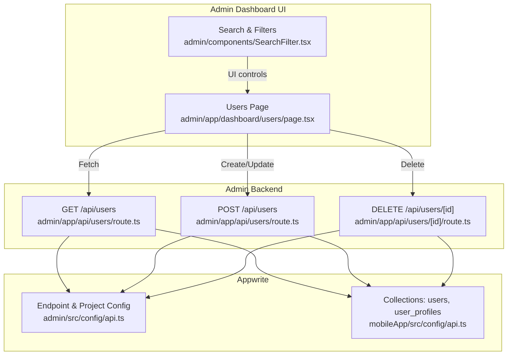
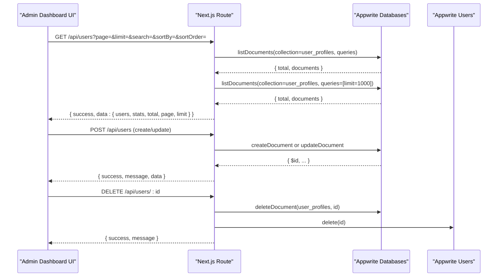
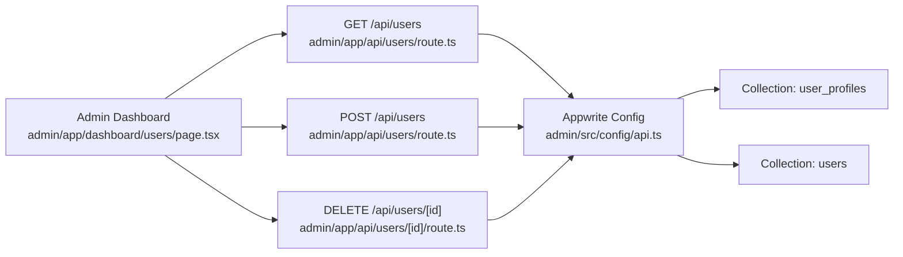

# User Management API

<cite>
**Referenced Files in This Document**
- [admin/app/api/users/route.ts](file://admin/app/api/users/route.ts)
- [admin/app/api/users/[id]/route.ts](file://admin/app/api/users/[id]/route.ts)
- [admin/app/dashboard/users/page.tsx](file://admin/app/dashboard/users/page.tsx)
- [admin/components/SearchFilter.tsx](file://admin/components/SearchFilter.tsx)
- [admin/src/config/api.ts](file://admin/src/config/api.ts)
- [mobileApp/src/config/api.ts](file://mobileApp/src/config/api.ts)
- [mobileApp/src/utils/validation.ts](file://mobileApp/src/utils/validation.ts)
- [ktMobileApp/app/src/main/java/com/ekehi/network/data/model/User.kt](file://ktMobileApp/app/src/main/java/com/ekehi/network/data/model/User.kt)
- [ktMobileApp/app/src/main/java/com/ekehi/network/data/model/UserProfile.kt](file://ktMobileApp/app/src/main/java/com/ekehi/network/data/model/UserProfile.kt)
</cite>

## Table of Contents
1. [Introduction](#introduction)
2. [Project Structure](#project-structure)
3. [Core Components](#core-components)
4. [Architecture Overview](#architecture-overview)
5. [Detailed Component Analysis](#detailed-component-analysis)
6. [Dependency Analysis](#dependency-analysis)
7. [Performance Considerations](#performance-considerations)
8. [Troubleshooting Guide](#troubleshooting-guide)
9. [Conclusion](#conclusion)
10. [Appendices](#appendices)

## Introduction
This document describes the User Management API implemented in the admin backend and consumed by the admin dashboard. It covers:
- Listing users with pagination, search, and sorting
- Creating and updating users
- Deleting users
- User data schemas and transformations
- Validation rules and duplicate prevention strategies
- Examples of CRUD and bulk operations
- Data mapping between frontend and backend formats

## Project Structure
The user management API is implemented as Next.js routes under the admin application and integrates with Appwrite for storage and authentication. The admin dashboard UI consumes these endpoints to present and manage users.

**Diagram sources**
- [admin/app/api/users/route.ts](file://admin/app/api/users/route.ts#L54-L209)
- [admin/app/api/users/[id]/route.ts](file://admin/app/api/users/[id]/route.ts#L41-L75)
- [admin/app/dashboard/users/page.tsx](file://admin/app/dashboard/users/page.tsx#L53-L71)
- [admin/components/SearchFilter.tsx](file://admin/components/SearchFilter.tsx#L1-L137)
- [admin/src/config/api.ts](file://admin/src/config/api.ts#L6-L35)
- [mobileApp/src/config/api.ts](file://mobileApp/src/config/api.ts#L8-L44)

**Section sources**
- [admin/app/api/users/route.ts](file://admin/app/api/users/route.ts#L54-L209)
- [admin/app/api/users/[id]/route.ts](file://admin/app/api/users/[id]/route.ts#L41-L75)
- [admin/app/dashboard/users/page.tsx](file://admin/app/dashboard/users/page.tsx#L53-L71)
- [admin/components/SearchFilter.tsx](file://admin/components/SearchFilter.tsx#L1-L137)
- [admin/src/config/api.ts](file://admin/src/config/api.ts#L6-L35)
- [mobileApp/src/config/api.ts](file://mobileApp/src/config/api.ts#L8-L44)

## Core Components
- GET /api/users: Returns paginated, searchable, and sortable user listings with statistics.
- POST /api/users: Creates or updates a user document in the user profiles collection.
- DELETE /api/users/[id]: Removes a user from both the database and authentication systems.

Key behaviors:
- Pagination via limit and offset
- Sorting by name, email, wallet balance, last login, and creation date
- Search across name and email fields
- Data transformation to align frontend field names and defaults
- Resilient deletion attempting both database and auth removal

**Section sources**
- [admin/app/api/users/route.ts](file://admin/app/api/users/route.ts#L54-L209)
- [admin/app/api/users/[id]/route.ts](file://admin/app/api/users/[id]/route.ts#L41-L75)

## Architecture Overview
The admin dashboard triggers requests to the user management endpoints. These endpoints use an Appwrite client configured with environment variables to access the database and users APIs. Responses are normalized to a consistent shape for the UI.

**Diagram sources**
- [admin/app/api/users/route.ts](file://admin/app/api/users/route.ts#L54-L209)
- [admin/app/api/users/[id]/route.ts](file://admin/app/api/users/[id]/route.ts#L41-L75)
- [admin/app/dashboard/users/page.tsx](file://admin/app/dashboard/users/page.tsx#L53-L71)

## Detailed Component Analysis

### GET /api/users
Purpose:
- Retrieve users with pagination, optional search, and sorting.
- Compute dashboard statistics (totals, active/inactive counts, admin counts, registration trends).

Query parameters:
- page: integer, default 1
- limit: integer, default 10
- search: string, filters by name or email
- sortBy: string, supports name, email, walletBalance, lastLogin, createdAt
- sortOrder: string, asc or desc, default desc

Sorting mapping:
- walletBalance -> totalCoins
- lastLogin -> lastLoginAt
- createdAt -> $createdAt

Search behavior:
- Uses Appwrite contains queries on name and email.
- Requires appropriate indices on these fields for efficient filtering.

Response shape:
- success: boolean
- data.users: array of user objects with id, name, email, status, role, createdAt, lastLogin, walletBalance
- data.stats: aggregated stats and registration trends
- data.total, data.page, data.limit

Notes:
- Defaults to descending creation date when no sort is provided.
- Transforms fields to align with frontend expectations.

**Section sources**
- [admin/app/api/users/route.ts](file://admin/app/api/users/route.ts#L54-L209)

### POST /api/users
Purpose:
- Create a new user or update an existing user.

Request body:
- Optional id: string (when provided, updates)
- name: string (required)
- email: string (required)
- status: "active" | "inactive", default "active"
- role: "admin" | "user", default "user"
- walletBalance: number, default 0

Behavior:
- Validates presence of name and email.
- On create: uses a unique() ID generation.
- Stores email in both email and userEmail fields for compatibility.
- Maps frontend fields to database fields (e.g., walletBalance to totalCoins).
- Returns transformed user object.

Response:
- success: boolean
- message: string
- data: user object

**Section sources**
- [admin/app/api/users/route.ts](file://admin/app/api/users/route.ts#L211-L313)

### DELETE /api/users/[id]
Purpose:
- Remove a user from both the user profiles collection and the Appwrite authentication system.

Behavior:
- Requires a user ID.
- Attempts deletion from the database first, then from the auth system.
- Proceeds even if one deletion fails to ensure cleanup.

Response:
- success: boolean
- message: string

**Section sources**
- [admin/app/api/users/[id]/route.ts](file://admin/app/api/users/[id]/route.ts#L41-L75)

### Individual User Endpoint GET /api/users/[id]
Observation:
- The admin routes define a DELETE handler for /api/users/[id] but do not define a GET handler for retrieving a single user by ID.
- The admin dashboard fetches all users and manages state locally.

Recommendation:
- To support single-user retrieval, add a GET /api/users/[id] route that:
  - Accepts an ID path parameter
  - Fetches the user from the user_profiles collection
  - Returns a normalized user object
  - Handles not-found and error cases

**Section sources**
- [admin/app/api/users/[id]/route.ts](file://admin/app/api/users/[id]/route.ts#L41-L75)
- [admin/app/dashboard/users/page.tsx](file://admin/app/dashboard/users/page.tsx#L53-L71)

### Data Schemas and Field Mapping

#### Backend User Profiles Collection Fields
- email: string (primary email)
- name: string
- status: string ("active" | "inactive")
- role: string ("admin" | "user")
- totalCoins: number (wallet balance)
- lastLoginAt: datetime (optional)
- $createdAt: datetime (system)
- $updatedAt: datetime (system)

#### Frontend User Model (Admin Dashboard)
- id: string
- name: string
- email: string
- status: "active" | "inactive"
- role: "admin" | "user"
- createdAt: string (ISO)
- lastLogin: string (ISO)
- walletBalance: number

Mapping highlights:
- walletBalance -> totalCoins
- lastLogin -> lastLoginAt or $updatedAt or $createdAt fallback
- role admin detection considers both role and is_admin flag

#### Mobile App Models
- User: id, name, email, createdAt, updatedAt
- UserProfile: includes userId, balances, streaks, rewards, totals, timestamps

These models reflect the broader user ecosystem and help ensure consistent field semantics across platforms.

**Section sources**
- [admin/app/api/users/route.ts](file://admin/app/api/users/route.ts#L173-L209)
- [admin/app/api/users/route.ts](file://admin/app/api/users/route.ts#L292-L303)
- [ktMobileApp/app/src/main/java/com/ekehi/network/data/model/User.kt](file://ktMobileApp/app/src/main/java/com/ekehi/network/data/model/User.kt#L1-L9)
- [ktMobileApp/app/src/main/java/com/ekehi/network/data/model/UserProfile.kt](file://ktMobileApp/app/src/main/java/com/ekehi/network/data/model/UserProfile.kt#L1-L32)

### Validation Rules and Duplicate Prevention
- Backend validation:
  - POST requires name and email.
- Frontend validation (mobile):
  - Email format validation.
  - Password and name length/format constraints.
- Duplicate prevention:
  - The mobile data migration scripts demonstrate unique index setup for preventing duplicates in related collections (e.g., user_social_tasks).
  - For user emails, ensure an appropriate unique index exists on the email field in the user profiles collection to prevent duplicates.

Note: The admin user creation endpoint stores email in both email and userEmail fields for compatibility.

**Section sources**
- [admin/app/api/users/route.ts](file://admin/app/api/users/route.ts#L253-L256)
- [mobileApp/src/utils/validation.ts](file://mobileApp/src/utils/validation.ts#L1-L32)

### Examples

#### List Users with Pagination, Search, and Sorting
- GET /api/users?page=1&limit=20&search=john&sortBy=walletBalance&sortOrder=desc
- Response includes users array, stats, total, page, and limit.

#### Create a User
- POST /api/users with body:
  - name, email, optional status, role, walletBalance
- Response includes success flag, message, and normalized user data.

#### Update a User
- POST /api/users with body including id and updated fields.

#### Delete a User
- DELETE /api/users/<id>
- Response indicates success.

#### Bulk User Management (via Admin Dashboard)
- The admin dashboard supports:
  - Adding new users
  - Editing existing users
  - Deleting users
  - Filtering by status and role
  - Sorting and refreshing data

**Section sources**
- [admin/app/api/users/route.ts](file://admin/app/api/users/route.ts#L211-L313)
- [admin/app/api/users/[id]/route.ts](file://admin/app/api/users/[id]/route.ts#L41-L75)
- [admin/app/dashboard/users/page.tsx](file://admin/app/dashboard/users/page.tsx#L124-L234)

## Dependency Analysis
- Routes depend on Appwrite client configuration loaded from environment variables.
- Collections used:
  - user_profiles (for user records)
  - users (legacy or separate auth records)
- The admin dashboard depends on the user listing endpoint and uses local filtering/sorting for convenience.

**Diagram sources**
- [admin/app/api/users/route.ts](file://admin/app/api/users/route.ts#L54-L209)
- [admin/app/api/users/[id]/route.ts](file://admin/app/api/users/[id]/route.ts#L41-L75)
- [admin/app/dashboard/users/page.tsx](file://admin/app/dashboard/users/page.tsx#L53-L71)
- [admin/src/config/api.ts](file://admin/src/config/api.ts#L6-L35)
- [mobileApp/src/config/api.ts](file://mobileApp/src/config/api.ts#L22-L35)

**Section sources**
- [admin/src/config/api.ts](file://admin/src/config/api.ts#L6-L35)
- [mobileApp/src/config/api.ts](file://mobileApp/src/config/api.ts#L22-L35)

## Performance Considerations
- Pagination: Use limit and calculate offset to avoid large payloads.
- Sorting: Prefer indexed fields for sortBy to reduce cost.
- Search: Use Appwrite contains queries on indexed fields; consider full-text indices if supported.
- Stats computation: The endpoint fetches a limited subset for stats; keep limit reasonable to avoid heavy queries.
- Deletion resilience: Database and auth deletions are attempted independently; network failures are handled gracefully.

## Troubleshooting Guide
Common issues and resolutions:
- Missing required fields on POST:
  - Ensure name and email are provided.
- Invalid user ID on DELETE:
  - Confirm the ID parameter is present.
- Search not returning results:
  - Verify that name and email fields are indexed in Appwrite.
- Sorting anomalies:
  - Ensure sortBy corresponds to supported fields; walletBalance maps to totalCoins.
- Email duplication:
  - Set a unique index on the email field in the user profiles collection.

**Section sources**
- [admin/app/api/users/route.ts](file://admin/app/api/users/route.ts#L253-L256)
- [admin/app/api/users/[id]/route.ts](file://admin/app/api/users/[id]/route.ts#L45-L47)

## Conclusion
The User Management API provides robust CRUD operations for users, with pagination, search, and sorting capabilities. It normalizes data for the admin dashboard and maintains compatibility with the broader platform’s data models. Ensuring proper indexing and validation will improve reliability and performance.

## Appendices

### API Definitions

- GET /api/users
  - Query parameters: page, limit, search, sortBy, sortOrder
  - Response: success, data.users[], data.stats, data.total, data.page, data.limit

- POST /api/users
  - Body: id (optional), name, email, status, role, walletBalance
  - Response: success, message, data

- DELETE /api/users/[id]
  - Path parameter: id
  - Response: success, message

### Data Transformation Notes
- Sorting field mapping:
  - walletBalance -> totalCoins
  - lastLogin -> lastLoginAt
  - createdAt -> $createdAt
- Email fallback:
  - If email is missing in profile data, a placeholder message is returned.
- Role mapping:
  - Admin detection considers both role and is_admin flag.

**Section sources**
- [admin/app/api/users/route.ts](file://admin/app/api/users/route.ts#L76-L108)
- [admin/app/api/users/route.ts](file://admin/app/api/users/route.ts#L173-L209)
- [admin/app/api/users/route.ts](file://admin/app/api/users/route.ts#L292-L303)