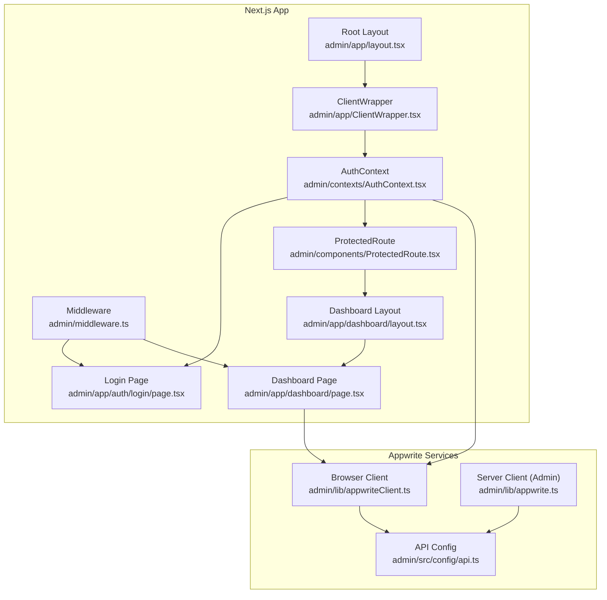
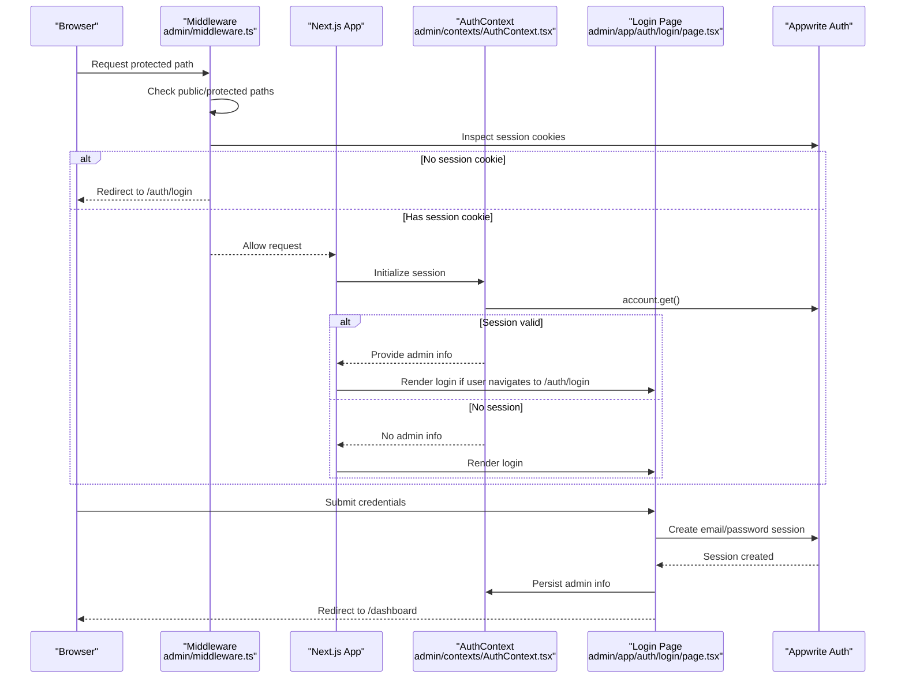
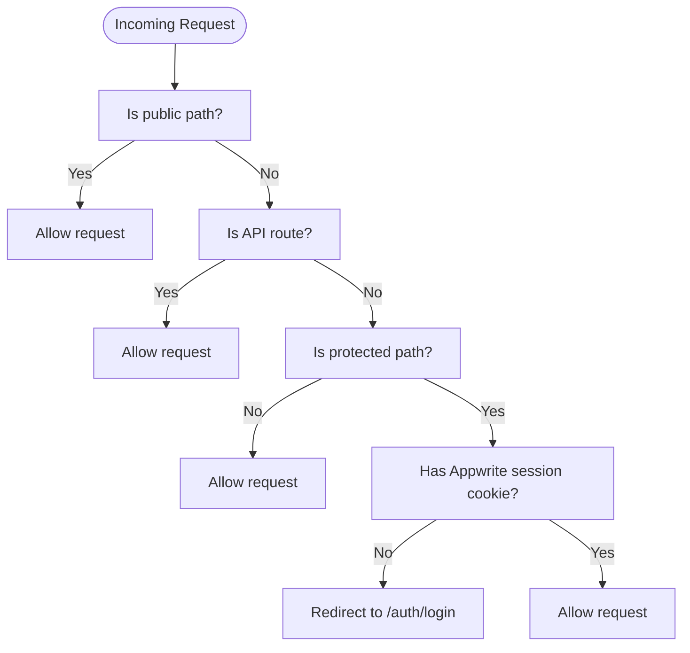
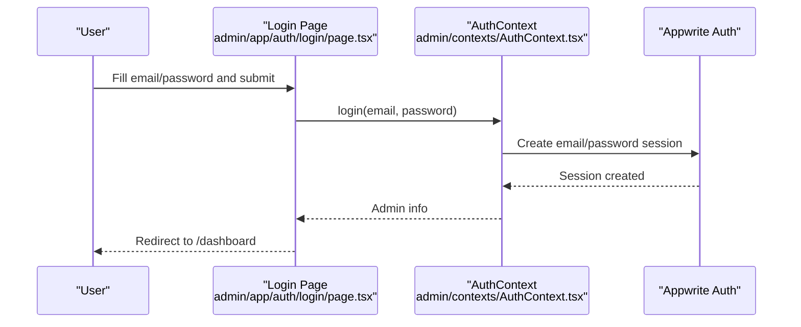
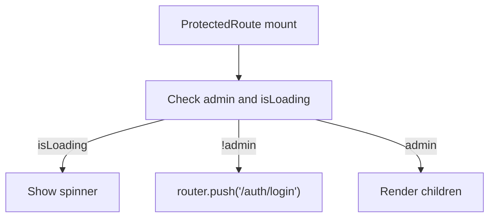
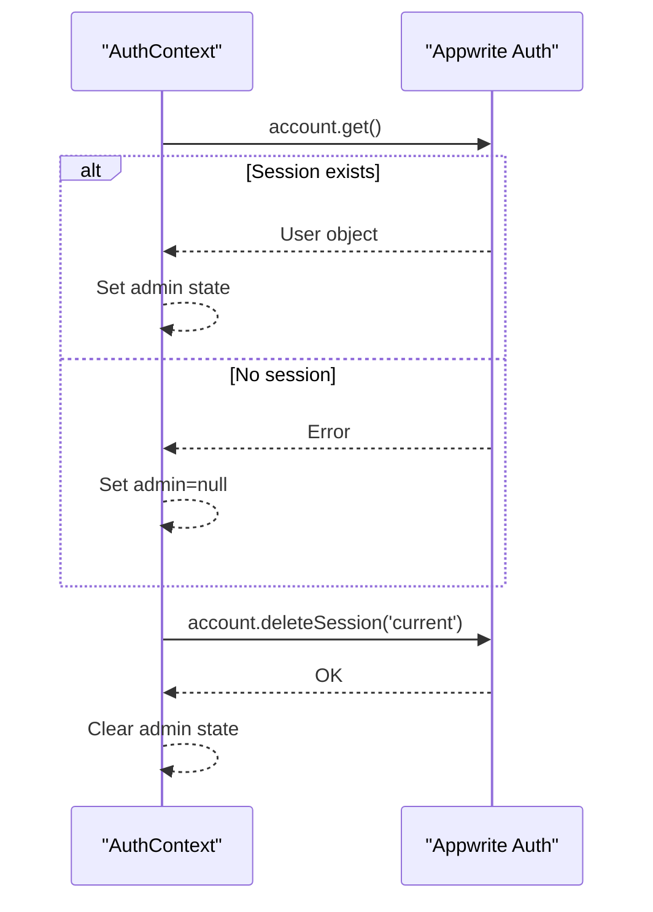
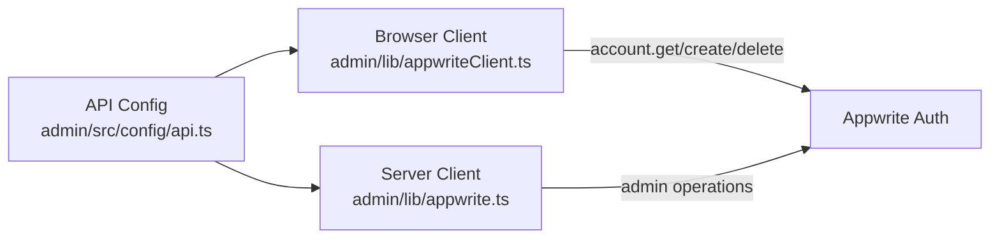
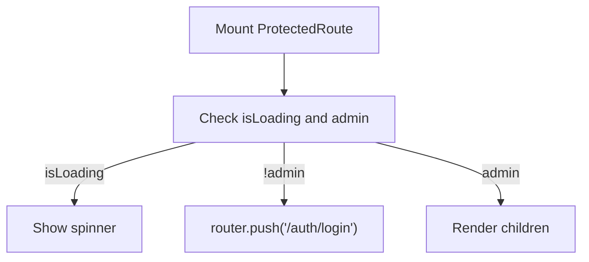
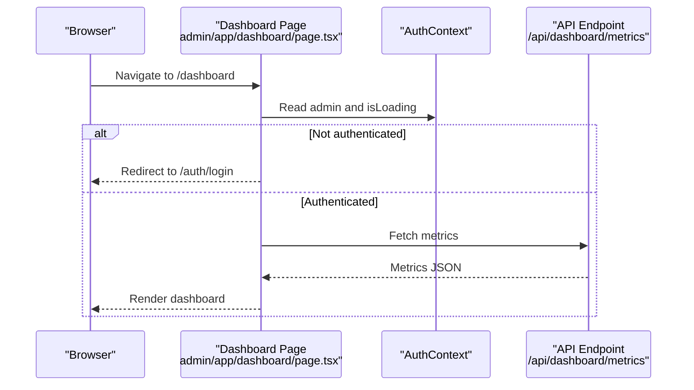
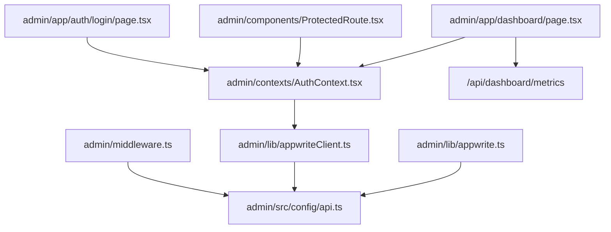

# Admin Authentication and Security

<cite>
**Referenced Files in This Document**
- [middleware.ts](file://admin/middleware.ts)
- [AuthContext.tsx](file://admin/contexts/AuthContext.tsx)
- [login/page.tsx](file://admin/app/auth/login/page.tsx)
- [ProtectedRoute.tsx](file://admin/components/ProtectedRoute.tsx)
- [appwrite.ts](file://admin/lib/appwrite.ts)
- [appwriteClient.ts](file://admin/lib/appwriteClient.ts)
- [api.ts](file://admin/src/config/api.ts)
- [route.ts](file://admin/app/api/test-appwrite/route.ts)
- [layout.tsx](file://admin/app/layout.tsx)
- [dashboard/layout.tsx](file://admin/app/dashboard/layout.tsx)
- [dashboard/page.tsx](file://admin/app/dashboard/page.tsx)
- [ClientWrapper.tsx](file://admin/app/ClientWrapper.tsx)
</cite>

## Table of Contents
1. [Introduction](#introduction)
2. [Project Structure](#project-structure)
3. [Core Components](#core-components)
4. [Architecture Overview](#architecture-overview)
5. [Detailed Component Analysis](#detailed-component-analysis)
6. [Dependency Analysis](#dependency-analysis)
7. [Performance Considerations](#performance-considerations)
8. [Troubleshooting Guide](#troubleshooting-guide)
9. [Conclusion](#conclusion)
10. [Appendices](#appendices)

## Introduction
This document describes the admin authentication and security system for the admin dashboard. It covers the middleware-based authentication flow, login page implementation, protected route handling, authentication context management, session handling, and token validation processes. It also outlines role-based access control mechanisms, security measures such as password policies and account lockout procedures, audit logging, integration with Appwrite authentication services, and best practices for error handling and security monitoring.

## Project Structure
The admin dashboard is built with Next.js and uses Appwrite for authentication and database operations. Authentication spans three layers:
- Middleware: server-side enforcement of public vs. protected paths and session presence.
- Client-side context: React context managing login/logout, session state, and initialization.
- Pages and components: login form, protected route wrapper, and dashboard layout.



**Diagram sources**
- [middleware.ts](file://admin/middleware.ts#L1-L70)
- [layout.tsx](file://admin/app/layout.tsx#L1-L28)
- [ClientWrapper.tsx](file://admin/app/ClientWrapper.tsx#L1-L68)
- [AuthContext.tsx](file://admin/contexts/AuthContext.tsx#L1-L167)
- [login/page.tsx](file://admin/app/auth/login/page.tsx#L1-L223)
- [ProtectedRoute.tsx](file://admin/components/ProtectedRoute.tsx#L1-L30)
- [dashboard/layout.tsx](file://admin/app/dashboard/layout.tsx#L1-L31)
- [dashboard/page.tsx](file://admin/app/dashboard/page.tsx#L1-L706)
- [appwrite.ts](file://admin/lib/appwrite.ts#L1-L33)
- [appwriteClient.ts](file://admin/lib/appwriteClient.ts#L1-L28)
- [api.ts](file://admin/src/config/api.ts#L1-L35)

**Section sources**
- [middleware.ts](file://admin/middleware.ts#L1-L70)
- [layout.tsx](file://admin/app/layout.tsx#L1-L28)
- [ClientWrapper.tsx](file://admin/app/ClientWrapper.tsx#L1-L68)
- [AuthContext.tsx](file://admin/contexts/AuthContext.tsx#L1-L167)
- [login/page.tsx](file://admin/app/auth/login/page.tsx#L1-L223)
- [ProtectedRoute.tsx](file://admin/components/ProtectedRoute.tsx#L1-L30)
- [dashboard/layout.tsx](file://admin/app/dashboard/layout.tsx#L1-L31)
- [dashboard/page.tsx](file://admin/app/dashboard/page.tsx#L1-L706)
- [appwrite.ts](file://admin/lib/appwrite.ts#L1-L33)
- [appwriteClient.ts](file://admin/lib/appwriteClient.ts#L1-L28)
- [api.ts](file://admin/src/config/api.ts#L1-L35)

## Core Components
- Middleware: Defines public and protected paths, enforces session presence via Appwrite cookies, and redirects unauthenticated users to the login page.
- AuthContext: Provides login/logout functions, initializes session state, and exposes admin info to components.
- Login Page: Handles form submission, displays errors, and redirects upon successful authentication.
- ProtectedRoute: Guards pages by ensuring the user is authenticated before rendering child components.
- Appwrite Clients: Browser client for front-end operations and server client for admin-only endpoints.
- API Configuration: Centralizes Appwrite endpoint, project ID, API key, database ID, and collection IDs.

**Section sources**
- [middleware.ts](file://admin/middleware.ts#L1-L70)
- [AuthContext.tsx](file://admin/contexts/AuthContext.tsx#L1-L167)
- [login/page.tsx](file://admin/app/auth/login/page.tsx#L1-L223)
- [ProtectedRoute.tsx](file://admin/components/ProtectedRoute.tsx#L1-L30)
- [appwrite.ts](file://admin/lib/appwrite.ts#L1-L33)
- [appwriteClient.ts](file://admin/lib/appwriteClient.ts#L1-L28)
- [api.ts](file://admin/src/config/api.ts#L1-L35)

## Architecture Overview
The authentication architecture combines server-side middleware enforcement with client-side session management and Appwrite’s authentication services.



**Diagram sources**
- [middleware.ts](file://admin/middleware.ts#L1-L70)
- [AuthContext.tsx](file://admin/contexts/AuthContext.tsx#L1-L167)
- [login/page.tsx](file://admin/app/auth/login/page.tsx#L1-L223)

## Detailed Component Analysis

### Middleware-Based Authentication Flow
- Public paths: Allow unrestricted access.
- Protected paths: Require a valid Appwrite session cookie; otherwise redirect to login.
- API routes: Allowed without additional checks; individual endpoints manage their own auth.
- Matcher: Applies middleware to non-static assets.



**Diagram sources**
- [middleware.ts](file://admin/middleware.ts#L1-L70)

**Section sources**
- [middleware.ts](file://admin/middleware.ts#L1-L70)

### Login Page Implementation
- Uses the AuthContext login function to authenticate via Appwrite.
- Prevents multiple redirects with internal flags.
- Displays user-friendly error messages derived from Appwrite error types.
- Redirects to the dashboard on success.



**Diagram sources**
- [login/page.tsx](file://admin/app/auth/login/page.tsx#L1-L223)
- [AuthContext.tsx](file://admin/contexts/AuthContext.tsx#L1-L167)

**Section sources**
- [login/page.tsx](file://admin/app/auth/login/page.tsx#L1-L223)
- [AuthContext.tsx](file://admin/contexts/AuthContext.tsx#L1-L167)

### Protected Route Handling
- A client-side guard checks authentication state and redirects unauthenticated users to the login page.
- Renders a minimal spinner while initialization is in progress.



**Diagram sources**
- [ProtectedRoute.tsx](file://admin/components/ProtectedRoute.tsx#L1-L30)

**Section sources**
- [ProtectedRoute.tsx](file://admin/components/ProtectedRoute.tsx#L1-L30)

### Authentication Context Management
- Initializes session by calling Appwrite’s account.get on mount.
- Exposes login, logout, admin info, and loading state.
- Handles error mapping from Appwrite error types to user-friendly messages.
- Clears local state on logout and ensures initialization completes before rendering children.

```mermaid
classDiagram
class AuthContext {
+admin : Admin|null
+login(email, password) Promise~{success,error}~
+logout() Promise~void~
+isLoading : boolean
-checkSession()
}
class Admin {
+id : string
+email : string
+name : string
}
AuthContext --> Admin : "provides"
```

**Diagram sources**
- [AuthContext.tsx](file://admin/contexts/AuthContext.tsx#L1-L167)

**Section sources**
- [AuthContext.tsx](file://admin/contexts/AuthContext.tsx#L1-L167)

### Session Handling and Token Validation
- Session detection relies on the presence of Appwrite session cookies (pattern: a_session_{projectId}_{sessionId}).
- On successful login, the client retrieves the current user and updates context state.
- Logout deletes the current session and clears local state.



**Diagram sources**
- [AuthContext.tsx](file://admin/contexts/AuthContext.tsx#L1-L167)
- [middleware.ts](file://admin/middleware.ts#L1-L70)

**Section sources**
- [AuthContext.tsx](file://admin/contexts/AuthContext.tsx#L1-L167)
- [middleware.ts](file://admin/middleware.ts#L1-L70)

### Role-Based Access Control Mechanisms
- The current admin dashboard does not implement explicit RBAC in the provided files. Role checks and permissions are not present in the middleware, context, or pages.
- The Android Kotlin module includes an AccessControlManager with role and permission helpers, but these are not integrated into the admin dashboard code shown here.

Recommendations:
- Define roles and permissions in Appwrite or a dedicated backend service.
- Extend the AuthContext to expose user roles and permissions.
- Add server-side and client-side guards to enforce RBAC on protected routes and actions.

[No sources needed since this section provides recommendations not tied to specific files]

### Security Measures
- Password policies: Not enforced in the admin dashboard code. Consider integrating input validators and enforcing minimum length, character variety, and history constraints.
- Account lockout: Not implemented in the provided code. Consider rate limiting login attempts at the server or Appwrite level.
- Audit logging: Not implemented in the admin dashboard code. Consider adding logging for authentication events and data access.

[No sources needed since this section provides recommendations not tied to specific files]

### Integration with Appwrite Authentication Services
- API configuration centralizes endpoint, project ID, API key, database ID, and collection IDs.
- Browser client initializes Appwrite for front-end operations.
- Server client initializes Appwrite with an API key for admin-only endpoints.



**Diagram sources**
- [api.ts](file://admin/src/config/api.ts#L1-L35)
- [appwriteClient.ts](file://admin/lib/appwriteClient.ts#L1-L28)
- [appwrite.ts](file://admin/lib/appwrite.ts#L1-L33)

**Section sources**
- [api.ts](file://admin/src/config/api.ts#L1-L35)
- [appwriteClient.ts](file://admin/lib/appwriteClient.ts#L1-L28)
- [appwrite.ts](file://admin/lib/appwrite.ts#L1-L33)

### Protected Route Component Implementation
- The ProtectedRoute component checks authentication state and either renders children or redirects to the login page.
- It prevents rendering until initialization completes.



**Diagram sources**
- [ProtectedRoute.tsx](file://admin/components/ProtectedRoute.tsx#L1-L30)

**Section sources**
- [ProtectedRoute.tsx](file://admin/components/ProtectedRoute.tsx#L1-L30)

### Dashboard Layout and Authentication Guard
- The dashboard layout composes the sidebar and header.
- The dashboard page uses AuthContext to guard access and fetch metrics via API endpoints.



**Diagram sources**
- [dashboard/page.tsx](file://admin/app/dashboard/page.tsx#L1-L706)
- [AuthContext.tsx](file://admin/contexts/AuthContext.tsx#L1-L167)

**Section sources**
- [dashboard/layout.tsx](file://admin/app/dashboard/layout.tsx#L1-L31)
- [dashboard/page.tsx](file://admin/app/dashboard/page.tsx#L1-L706)

## Dependency Analysis
- Middleware depends on Appwrite cookies to enforce access control.
- AuthContext depends on the browser Appwrite client and Appwrite account service.
- Login page depends on AuthContext and redirects to the dashboard.
- ProtectedRoute depends on AuthContext and router.
- Dashboard page depends on AuthContext and API endpoints.
- Appwrite clients depend on API configuration for endpoint, project, and keys.



**Diagram sources**
- [middleware.ts](file://admin/middleware.ts#L1-L70)
- [api.ts](file://admin/src/config/api.ts#L1-L35)
- [AuthContext.tsx](file://admin/contexts/AuthContext.tsx#L1-L167)
- [login/page.tsx](file://admin/app/auth/login/page.tsx#L1-L223)
- [ProtectedRoute.tsx](file://admin/components/ProtectedRoute.tsx#L1-L30)
- [dashboard/page.tsx](file://admin/app/dashboard/page.tsx#L1-L706)
- [appwrite.ts](file://admin/lib/appwrite.ts#L1-L33)
- [appwriteClient.ts](file://admin/lib/appwriteClient.ts#L1-L28)

**Section sources**
- [middleware.ts](file://admin/middleware.ts#L1-L70)
- [AuthContext.tsx](file://admin/contexts/AuthContext.tsx#L1-L167)
- [login/page.tsx](file://admin/app/auth/login/page.tsx#L1-L223)
- [ProtectedRoute.tsx](file://admin/components/ProtectedRoute.tsx#L1-L30)
- [dashboard/page.tsx](file://admin/app/dashboard/page.tsx#L1-L706)
- [appwrite.ts](file://admin/lib/appwrite.ts#L1-L33)
- [appwriteClient.ts](file://admin/lib/appwriteClient.ts#L1-L28)
- [api.ts](file://admin/src/config/api.ts#L1-L35)

## Performance Considerations
- Minimize re-renders by caching user data in the AuthContext and avoiding unnecessary fetches.
- Defer non-critical dashboard data until after authentication is confirmed.
- Use skeleton loaders during initial load to improve perceived performance.
- Keep middleware logic lightweight; rely on Appwrite for session validation.

[No sources needed since this section provides general guidance]

## Troubleshooting Guide
Common issues and resolutions:
- Redirect loops on login: Ensure the login page checks admin state and uses a redirect flag to prevent multiple redirects.
- Hydration mismatch: AuthProvider delays rendering until initialization completes.
- Session not recognized: Verify Appwrite session cookies are present and accessible; confirm middleware matcher excludes static assets.
- API connectivity: Use the test endpoint to validate Appwrite configuration and permissions.

**Section sources**
- [login/page.tsx](file://admin/app/auth/login/page.tsx#L1-L223)
- [AuthContext.tsx](file://admin/contexts/AuthContext.tsx#L1-L167)
- [middleware.ts](file://admin/middleware.ts#L1-L70)
- [route.ts](file://admin/app/api/test-appwrite/route.ts#L1-L47)

## Conclusion
The admin dashboard implements a robust, layered authentication system combining Next.js middleware, a React authentication context, and Appwrite’s authentication services. While the current implementation focuses on session-based authentication and basic error handling, extending it with role-based access control, password policies, account lockout, and audit logging will further strengthen security. Integrating these enhancements will align the admin system with industry best practices and provide a solid foundation for future security improvements.

## Appendices

### Example Authentication Flows
- Successful login flow: Login page invokes AuthContext.login, which calls Appwrite to create a session, then redirects to the dashboard.
- Protected route flow: ProtectedRoute checks authentication state and redirects unauthenticated users to the login page.
- Middleware enforcement: Middleware inspects session cookies for protected paths and redirects if missing.

**Section sources**
- [login/page.tsx](file://admin/app/auth/login/page.tsx#L1-L223)
- [ProtectedRoute.tsx](file://admin/components/ProtectedRoute.tsx#L1-L30)
- [middleware.ts](file://admin/middleware.ts#L1-L70)

### Security Best Practices
- Enforce strong password policies and consider multi-factor authentication.
- Implement rate limiting and account lockout mechanisms.
- Add audit logging for authentication and data access events.
- Regularly rotate API keys and limit permissions for server clients.

[No sources needed since this section provides general guidance]