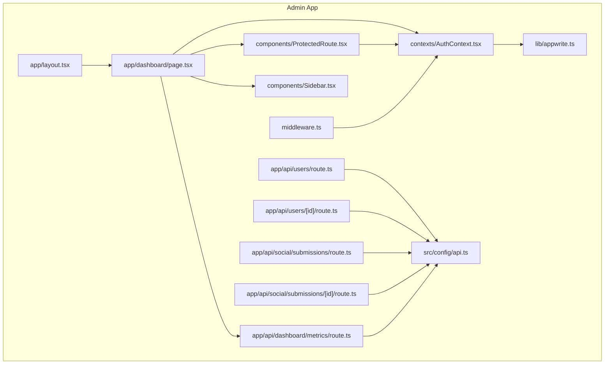
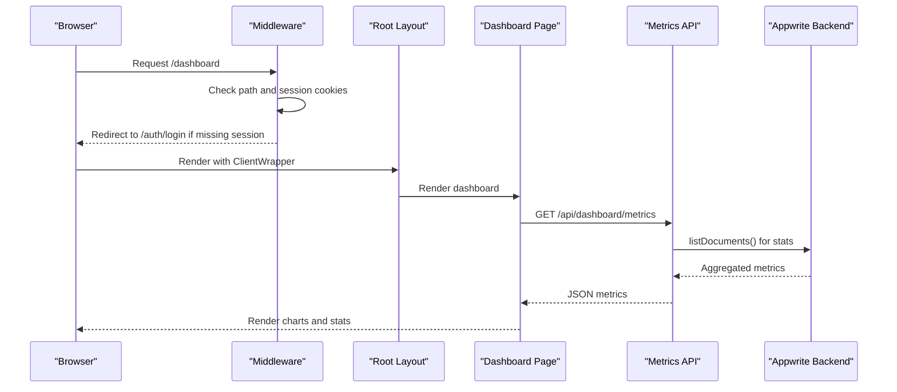
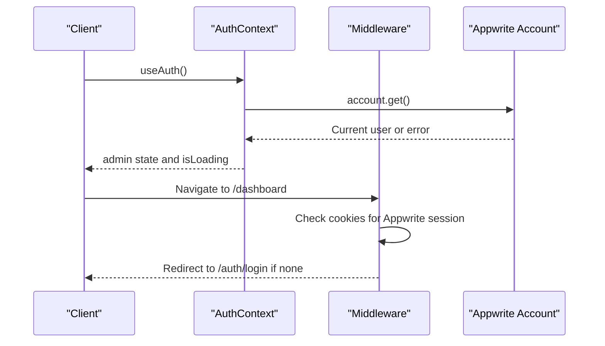
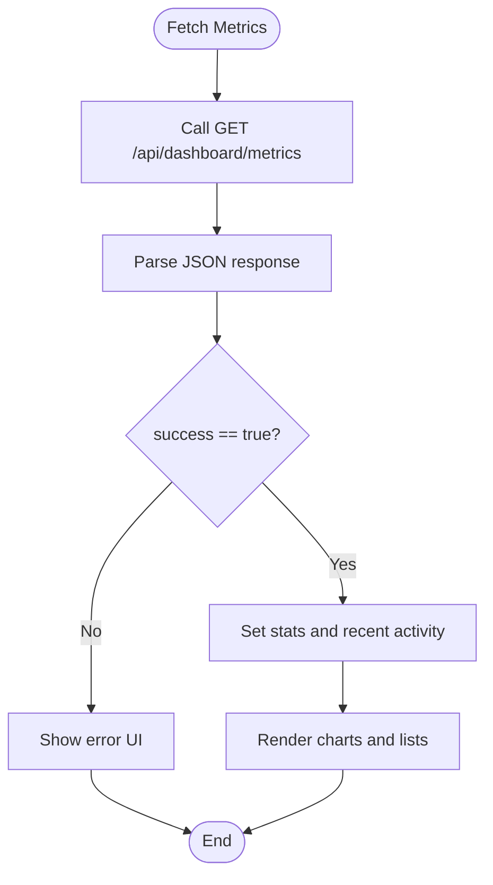
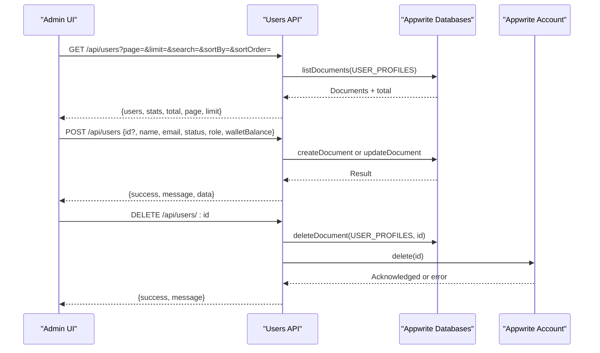
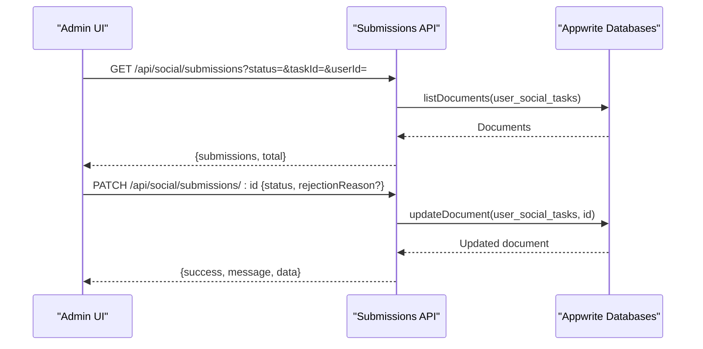
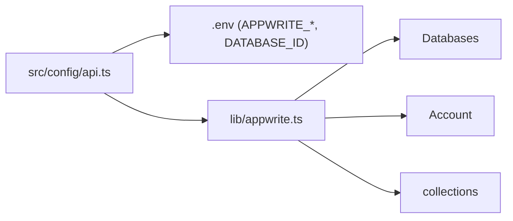
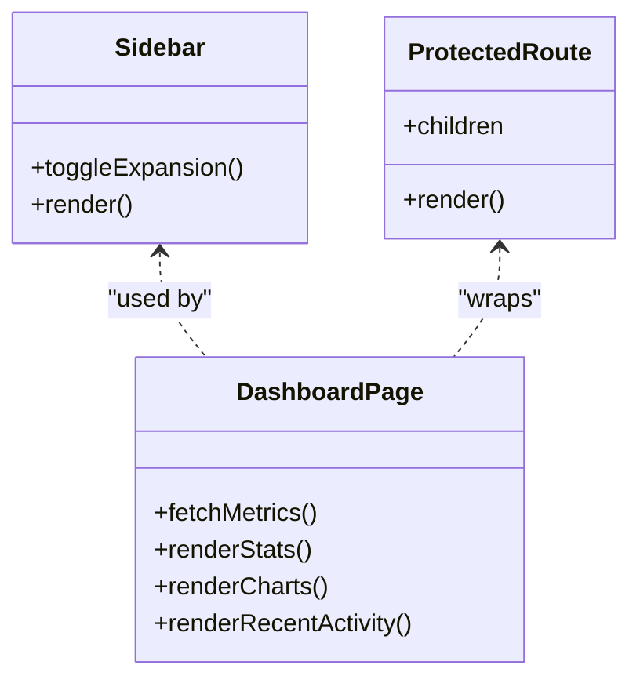
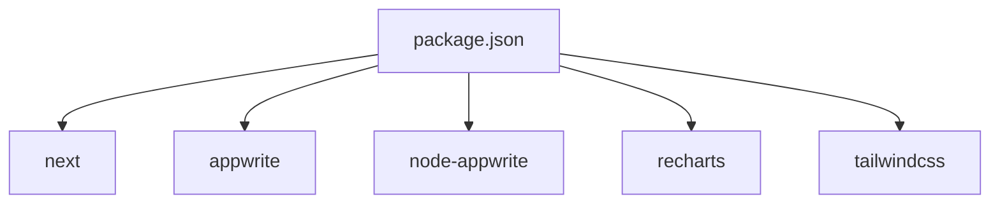

# Admin Dashboard (Next.js)

<cite>
**Referenced Files in This Document**
- [README.md](file://admin/README.md)
- [package.json](file://admin/package.json)
- [middleware.ts](file://admin/middleware.ts)
- [lib/appwrite.ts](file://admin/lib/appwrite.ts)
- [contexts/AuthContext.tsx](file://admin/contexts/AuthContext.tsx)
- [components/ProtectedRoute.tsx](file://admin/components/ProtectedRoute.tsx)
- [components/Sidebar.tsx](file://admin/components/Sidebar.tsx)
- [src/config/api.ts](file://admin/src/config/api.ts)
- [app/layout.tsx](file://admin/app/layout.tsx)
- [app/dashboard/page.tsx](file://admin/app/dashboard/page.tsx)
- [app/api/dashboard/metrics/route.ts](file://admin/app/api/dashboard/metrics/route.ts)
- [app/api/users/route.ts](file://admin/app/api/users/route.ts)
- [app/api/users/[id]/route.ts](file://admin/app/api/users/[id]/route.ts)
- [app/api/social/submissions/route.ts](file://admin/app/api/social/submissions/route.ts)
- [app/api/social/submissions/[id]/route.ts](file://admin/app/api/social/submissions/[id]/route.ts)
</cite>

## Table of Contents
1. [Introduction](#introduction)
2. [Project Structure](#project-structure)
3. [Core Components](#core-components)
4. [Architecture Overview](#architecture-overview)
5. [Detailed Component Analysis](#detailed-component-analysis)
6. [Dependency Analysis](#dependency-analysis)
7. [Performance Considerations](#performance-considerations)
8. [Troubleshooting Guide](#troubleshooting-guide)
9. [Conclusion](#conclusion)
10. [Appendices](#appendices)

## Introduction
This document explains the Next.js admin dashboard for the Ekehi Mobile application. It covers the server-side rendering architecture, client-side hydration, and the middleware-based authentication system. It documents dashboard components for metrics, user management, and social task moderation, along with the API endpoints used for user management, social task verification, and analytics reporting. It also details the integration with Appwrite backend services, database operations, admin authentication flow, role-based access control, security measures, real-time metrics display, user analytics, and system monitoring. Practical examples of API usage, dashboard customization, and administrative workflows are included, alongside deployment and monitoring considerations.

## Project Structure
The admin dashboard is a Next.js 14 application using the App Router. Key areas:
- app/: Pages, API routes, and shared layout
- components/: Reusable UI components (ProtectedRoute, Sidebar, etc.)
- contexts/: React context providers (AuthContext)
- lib/: Appwrite client initialization and service exports
- src/config/: Environment-driven configuration for Appwrite
- middleware.ts: Path-based authentication guard
- package.json: Dependencies and scripts

**Diagram sources**
- [app/layout.tsx](file://admin/app/layout.tsx#L1-L28)
- [app/dashboard/page.tsx](file://admin/app/dashboard/page.tsx#L1-L706)
- [app/api/users/route.ts](file://admin/app/api/users/route.ts#L1-L315)
- [app/api/users/[id]/route.ts](file://admin/app/api/users/[id]/route.ts#L1-L75)
- [app/api/social/submissions/route.ts](file://admin/app/api/social/submissions/route.ts#L1-L142)
- [app/api/social/submissions/[id]/route.ts](file://admin/app/api/social/submissions/[id]/route.ts#L1-L108)
- [app/api/dashboard/metrics/route.ts](file://admin/app/api/dashboard/metrics/route.ts#L1-L111)
- [middleware.ts](file://admin/middleware.ts#L1-L70)
- [contexts/AuthContext.tsx](file://admin/contexts/AuthContext.tsx#L1-L167)
- [components/ProtectedRoute.tsx](file://admin/components/ProtectedRoute.tsx#L1-L30)
- [components/Sidebar.tsx](file://admin/components/Sidebar.tsx#L1-L195)
- [src/config/api.ts](file://admin/src/config/api.ts#L1-L35)
- [lib/appwrite.ts](file://admin/lib/appwrite.ts#L1-L33)

**Section sources**
- [README.md](file://admin/README.md#L1-L109)
- [package.json](file://admin/package.json#L1-L52)
- [app/layout.tsx](file://admin/app/layout.tsx#L1-L28)

## Core Components
- Authentication and Authorization:
  - Middleware enforces authentication for protected paths and allows API routes to self-manage auth.
  - Client-side AuthContext integrates with Appwrite sessions and exposes login/logout/useAuth.
  - ProtectedRoute wrapper guards page-level routes during client-side navigation.
- Dashboard:
  - Dashboard page fetches metrics from a dedicated API endpoint and renders charts and recent activity.
- User Management:
  - API endpoints list/create/update/delete users and compute user statistics.
- Social Task Moderation:
  - API endpoints list submissions and update submission status with optional rejection reason.
- Appwrite Integration:
  - Centralized configuration via environment variables and typed collection IDs.
  - Appwrite client initialized with endpoint, project, and API key.

**Section sources**
- [middleware.ts](file://admin/middleware.ts#L1-L70)
- [contexts/AuthContext.tsx](file://admin/contexts/AuthContext.tsx#L1-L167)
- [components/ProtectedRoute.tsx](file://admin/components/ProtectedRoute.tsx#L1-L30)
- [app/dashboard/page.tsx](file://admin/app/dashboard/page.tsx#L1-L706)
- [app/api/users/route.ts](file://admin/app/api/users/route.ts#L1-L315)
- [app/api/social/submissions/route.ts](file://admin/app/api/social/submissions/route.ts#L1-L142)
- [src/config/api.ts](file://admin/src/config/api.ts#L1-L35)
- [lib/appwrite.ts](file://admin/lib/appwrite.ts#L1-L33)

## Architecture Overview
High-level flow:
- Client requests a protected page; middleware checks Appwrite session cookies and redirects unauthenticated users.
- Client-side AuthContext hydrates admin state using Appwrite Account API.
- Dashboard page fetches metrics from the server-side metrics API and renders charts.
- API routes use a server-side Appwrite client with admin credentials to access databases and users.

**Diagram sources**
- [middleware.ts](file://admin/middleware.ts#L1-L70)
- [app/layout.tsx](file://admin/app/layout.tsx#L1-L28)
- [app/dashboard/page.tsx](file://admin/app/dashboard/page.tsx#L1-L706)
- [app/api/dashboard/metrics/route.ts](file://admin/app/api/dashboard/metrics/route.ts#L1-L111)

## Detailed Component Analysis

### Authentication and Middleware
- Middleware:
  - Protects paths under /dashboard.
  - Allows public paths and API routes.
  - Detects Appwrite session cookies and redirects if absent.
- AuthContext:
  - Initializes on the client, checks current session, and exposes login/logout.
  - Provides a loading state to avoid hydration mismatches.
- ProtectedRoute:
  - Wrapper that redirects to login when not authenticated.

**Diagram sources**
- [contexts/AuthContext.tsx](file://admin/contexts/AuthContext.tsx#L1-L167)
- [middleware.ts](file://admin/middleware.ts#L1-L70)

**Section sources**
- [middleware.ts](file://admin/middleware.ts#L1-L70)
- [contexts/AuthContext.tsx](file://admin/contexts/AuthContext.tsx#L1-L167)
- [components/ProtectedRoute.tsx](file://admin/components/ProtectedRoute.tsx#L1-L30)

### Dashboard Metrics and Real-Time Display
- Metrics API:
  - Returns total users, submissions, verified/rejected counts, and recent activity.
  - Uses Appwrite queries to filter and order submissions.
- Dashboard page:
  - Fetches metrics on mount, sets stats, and renders charts and recent activity.
  - Implements skeleton loaders and error handling.

**Diagram sources**
- [app/api/dashboard/metrics/route.ts](file://admin/app/api/dashboard/metrics/route.ts#L1-L111)
- [app/dashboard/page.tsx](file://admin/app/dashboard/page.tsx#L1-L706)

**Section sources**
- [app/api/dashboard/metrics/route.ts](file://admin/app/api/dashboard/metrics/route.ts#L1-L111)
- [app/dashboard/page.tsx](file://admin/app/dashboard/page.tsx#L1-L706)

### User Management API
- GET /api/users:
  - Paginates, sorts, and optionally filters user profiles.
  - Computes statistics (total, active/inactive, admin count) and registration trends.
  - Transforms data to a normalized shape for the frontend.
- POST /api/users:
  - Creates or updates a user profile document.
  - Validates required fields and maps roles/status.
- DELETE /api/users/[id]:
  - Removes a user from both the user profiles collection and the Appwrite authentication system.

**Diagram sources**
- [app/api/users/route.ts](file://admin/app/api/users/route.ts#L1-L315)
- [app/api/users/[id]/route.ts](file://admin/app/api/users/[id]/route.ts#L1-L75)

**Section sources**
- [app/api/users/route.ts](file://admin/app/api/users/route.ts#L1-L315)
- [app/api/users/[id]/route.ts](file://admin/app/api/users/[id]/route.ts#L1-L75)

### Social Task Moderation API
- GET /api/social/submissions:
  - Filters by status/taskId/userId, orders by creation date, and enriches with task and user details.
- PATCH /api/social/submissions/[id]:
  - Updates submission status; records verification timestamp on verify; stores rejection reason on reject.
  - Optionally awards coins upon verification (logging placeholder).

**Diagram sources**
- [app/api/social/submissions/route.ts](file://admin/app/api/social/submissions/route.ts#L1-L142)
- [app/api/social/submissions/[id]/route.ts](file://admin/app/api/social/submissions/[id]/route.ts#L1-L108)

**Section sources**
- [app/api/social/submissions/route.ts](file://admin/app/api/social/submissions/route.ts#L1-L142)
- [app/api/social/submissions/[id]/route.ts](file://admin/app/api/social/submissions/[id]/route.ts#L1-L108)

### Appwrite Integration and Configuration
- Configuration:
  - Endpoint, project, API key, database ID, and collection IDs are loaded from environment variables.
- Client Initialization:
  - A server-side client is created with admin credentials for privileged operations.
  - A shared client/service export centralizes Appwrite usage across API routes.

**Diagram sources**
- [src/config/api.ts](file://admin/src/config/api.ts#L1-L35)
- [lib/appwrite.ts](file://admin/lib/appwrite.ts#L1-L33)

**Section sources**
- [src/config/api.ts](file://admin/src/config/api.ts#L1-L35)
- [lib/appwrite.ts](file://admin/lib/appwrite.ts#L1-L33)

### Dashboard Components and Navigation
- Sidebar:
  - Desktop collapsible navigation with icons and active-state highlighting.
- ProtectedRoute:
  - Guards pages and redirects to login when unauthenticated.
- Dashboard page:
  - Fetches metrics, renders stats cards, charts, recent activity, and quick action buttons.

**Diagram sources**
- [components/Sidebar.tsx](file://admin/components/Sidebar.tsx#L1-L195)
- [components/ProtectedRoute.tsx](file://admin/components/ProtectedRoute.tsx#L1-L30)
- [app/dashboard/page.tsx](file://admin/app/dashboard/page.tsx#L1-L706)

**Section sources**
- [components/Sidebar.tsx](file://admin/components/Sidebar.tsx#L1-L195)
- [components/ProtectedRoute.tsx](file://admin/components/ProtectedRoute.tsx#L1-L30)
- [app/dashboard/page.tsx](file://admin/app/dashboard/page.tsx#L1-L706)

## Dependency Analysis
- Runtime dependencies include Next.js, Appwrite SDKs, Recharts, Tailwind, and Radix UI.
- Scripts define development, build, start, lint, and test commands.
- Middleware applies to non-static assets and matches most routes except excluded paths.

**Diagram sources**
- [package.json](file://admin/package.json#L1-L52)

**Section sources**
- [package.json](file://admin/package.json#L1-L52)
- [middleware.ts](file://admin/middleware.ts#L59-L70)

## Performance Considerations
- API pagination and filtering reduce payload sizes for user listings.
- Batch queries for enrichment of submissions with task/user details help manage query limits.
- Client-side caching and skeleton loaders improve perceived performance.
- Prefer server-side metrics aggregation to minimize client computation.
- Monitor Appwrite query costs and consider indexing frequently filtered fields.

[No sources needed since this section provides general guidance]

## Troubleshooting Guide
- Authentication failures:
  - Verify Appwrite session cookies are present and not expired.
  - Check environment variables for Appwrite endpoint, project, and API key.
- API errors:
  - Inspect server logs for thrown errors and ensure API key is configured.
  - Validate collection IDs and database ID in environment variables.
- Hydration mismatches:
  - Ensure AuthContext initializes before rendering child components.
- Rate limiting:
  - Appwrite may throttle login attempts; handle rate_limit_exceeded gracefully.

**Section sources**
- [contexts/AuthContext.tsx](file://admin/contexts/AuthContext.tsx#L55-L123)
- [src/config/api.ts](file://admin/src/config/api.ts#L1-L35)
- [app/api/users/route.ts](file://admin/app/api/users/route.ts#L205-L209)
- [app/api/social/submissions/route.ts](file://admin/app/api/social/submissions/route.ts#L132-L141)

## Conclusion
The admin dashboard leverages Next.js App Router for structured routing, middleware for authentication enforcement, and Appwrite for backend services. The dashboard aggregates real-time metrics, manages users, and moderates social tasks through dedicated APIs. The modular architecture enables easy customization and extension, while environment-driven configuration ensures portability across environments.

[No sources needed since this section summarizes without analyzing specific files]

## Appendices

### API Reference Summary
- GET /api/dashboard/metrics
  - Purpose: Retrieve total users, submissions, verified/rejected counts, and recent activity.
  - Query parameters: None.
  - Response: success flag, data object with aggregated metrics and timestamp.
- GET /api/users
  - Purpose: List user profiles with pagination, search, and sorting.
  - Query parameters: page, limit, search, sortBy, sortOrder.
  - Response: success flag, data with users array, stats, total, page, limit.
- POST /api/users
  - Purpose: Create or update a user profile.
  - Body: id (optional), name, email, status, role, walletBalance.
  - Response: success flag, message, normalized data.
- DELETE /api/users/[id]
  - Purpose: Remove a user from database and authentication.
  - Path parameters: id.
  - Response: success flag, message.
- GET /api/social/submissions
  - Purpose: List social task submissions with optional filters.
  - Query parameters: status, taskId, userId.
  - Response: success flag, data with submissions array and total.
- PATCH /api/social/submissions/[id]
  - Purpose: Update submission status; optionally set rejection reason.
  - Path parameters: id.
  - Body: status, rejectionReason (required when rejecting).
  - Response: success flag, message, normalized data.

**Section sources**
- [app/api/dashboard/metrics/route.ts](file://admin/app/api/dashboard/metrics/route.ts#L1-L111)
- [app/api/users/route.ts](file://admin/app/api/users/route.ts#L1-L315)
- [app/api/users/[id]/route.ts](file://admin/app/api/users/[id]/route.ts#L1-L75)
- [app/api/social/submissions/route.ts](file://admin/app/api/social/submissions/route.ts#L1-L142)
- [app/api/social/submissions/[id]/route.ts](file://admin/app/api/social/submissions/[id]/route.ts#L1-L108)

### Deployment and Monitoring Setup
- Environment variables:
  - APPWRITE_ENDPOINT, APPWRITE_PROJECT_ID, APPWRITE_API_KEY, DATABASE_ID, and collection IDs.
- Build and run:
  - Use scripts defined in package.json for dev, build, and start.
- Monitoring:
  - Enable logging in API routes and dashboard page.
  - Track Appwrite query performance and adjust indexing.
  - Consider adding health checks for Appwrite connectivity.

**Section sources**
- [src/config/api.ts](file://admin/src/config/api.ts#L1-L35)
- [package.json](file://admin/package.json#L1-L52)
- [app/dashboard/page.tsx](file://admin/app/dashboard/page.tsx#L90-L144)