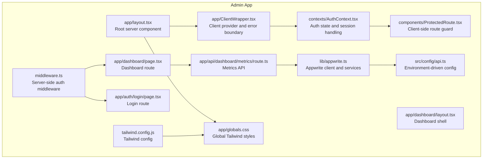
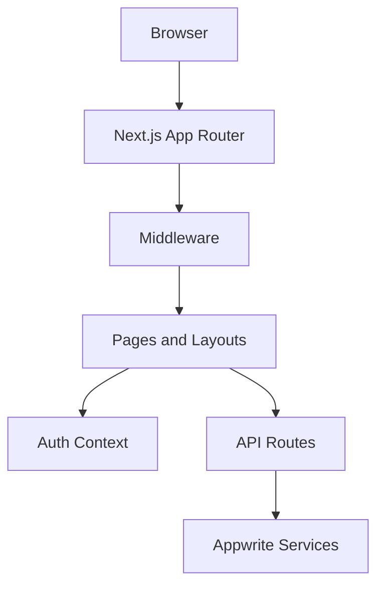
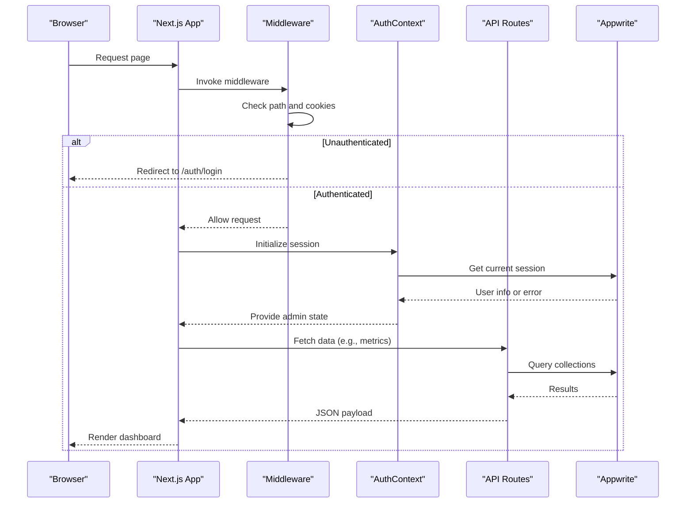
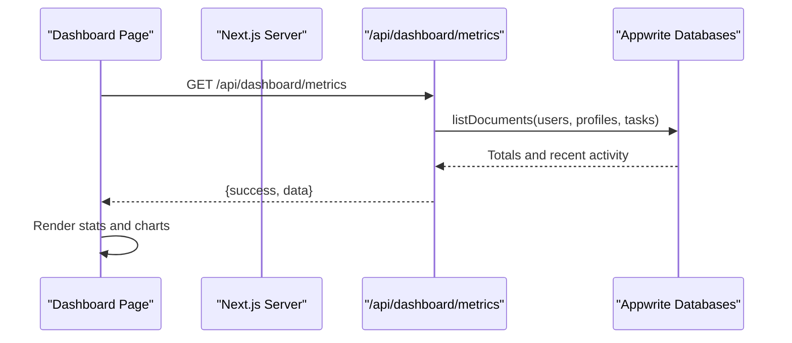
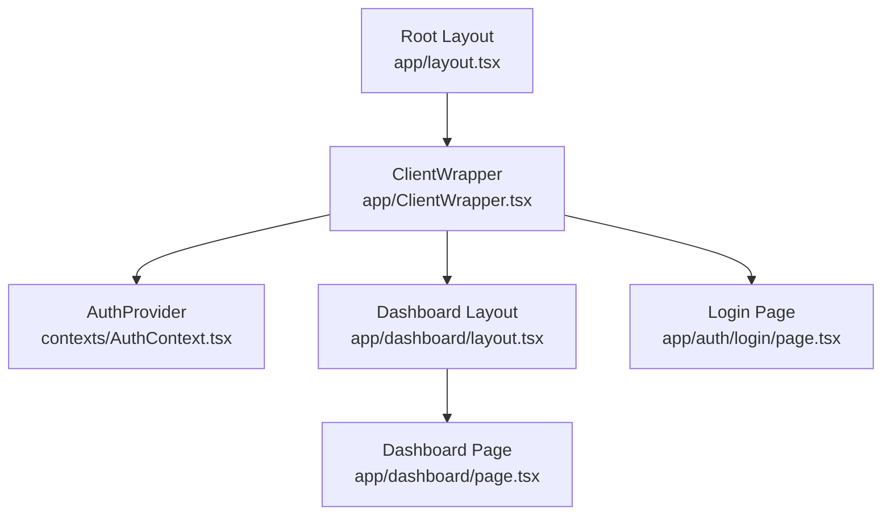
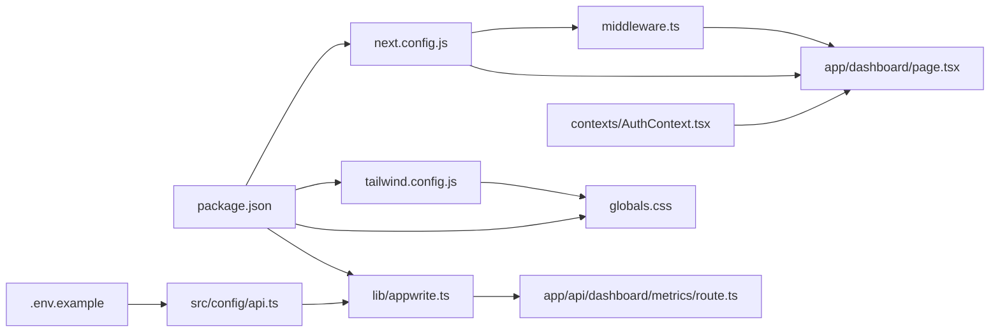
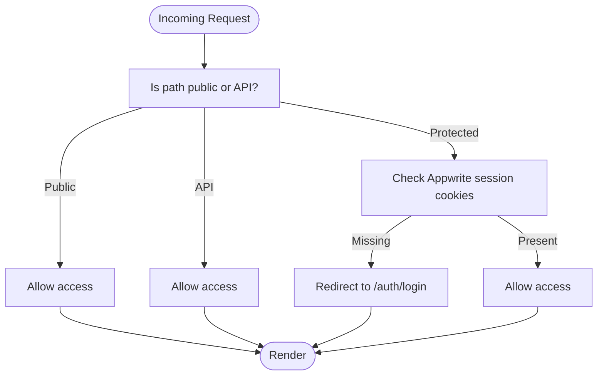
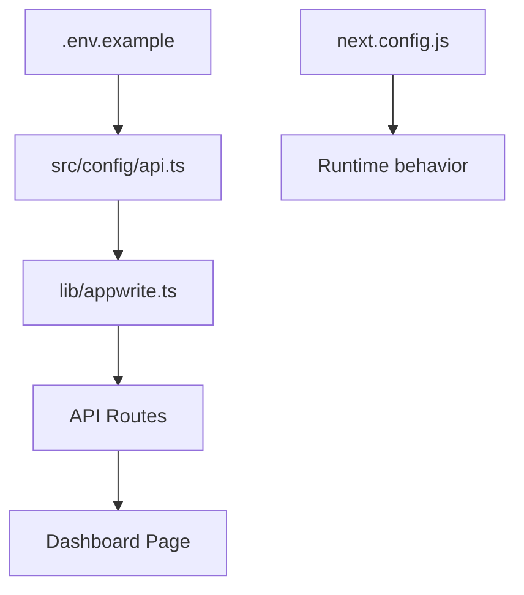

# Admin Dashboard Overview

<cite>
**Referenced Files in This Document**
- [package.json](file://admin/package.json)
- [next.config.js](file://admin/next.config.js)
- [middleware.ts](file://admin/middleware.ts)
- [layout.tsx](file://admin/app/layout.tsx)
- [dashboard/layout.tsx](file://admin/app/dashboard/layout.tsx)
- [ClientWrapper.tsx](file://admin/app/ClientWrapper.tsx)
- [AuthContext.tsx](file://admin/contexts/AuthContext.tsx)
- [ProtectedRoute.tsx](file://admin/components/ProtectedRoute.tsx)
- [login/page.tsx](file://admin/app/auth/login/page.tsx)
- [dashboard/page.tsx](file://admin/app/dashboard/page.tsx)
- [appwrite.ts](file://admin/lib/appwrite.ts)
- [api.ts](file://admin/src/config/api.ts)
- [dashboard/metrics/route.ts](file://admin/app/api/dashboard/metrics/route.ts)
- [globals.css](file://admin/app/globals.css)
- [tailwind.config.js](file://admin/tailwind.config.js)
- [.env.example](file://admin/.env.example)
- [APPWRITE_SETUP.md](file://admin/APPWRITE_SETUP.md)
</cite>

## Table of Contents
1. [Introduction](#introduction)
2. [Project Structure](#project-structure)
3. [Core Components](#core-components)
4. [Architecture Overview](#architecture-overview)
5. [Detailed Component Analysis](#detailed-component-analysis)
6. [Dependency Analysis](#dependency-analysis)
7. [Performance Considerations](#performance-considerations)
8. [Security Model](#security-model)
9. [Deployment and Environment Configuration](#deployment-and-environment-configuration)
10. [Troubleshooting Guide](#troubleshooting-guide)
11. [Conclusion](#conclusion)

## Introduction
This document provides a comprehensive overview of the Next.js admin dashboard system. It explains the server-side rendering architecture with root layout configuration, the client-side wrapper and authentication context, and the middleware-based authentication flow. It also documents the project structure, routing patterns, component hierarchy, integration with Appwrite backend services, and global styling approach using Tailwind CSS. Finally, it covers the security model with protected routes, authentication middleware, and deployment considerations with environment configuration.

## Project Structure
The admin dashboard is a Next.js application organized under the admin directory. Key areas include:
- app: Next.js App Router pages, layouts, and API routes
- components: Reusable UI components and route protection wrappers
- contexts: Global authentication state management
- lib: Backend integrations (Appwrite client initialization)
- src/config: Environment-driven configuration for Appwrite
- Styles: Tailwind CSS configuration and global styles

**Diagram sources**
- [layout.tsx](file://admin/app/layout.tsx#L1-L28)
- [ClientWrapper.tsx](file://admin/app/ClientWrapper.tsx#L1-L68)
- [AuthContext.tsx](file://admin/contexts/AuthContext.tsx#L1-L167)
- [ProtectedRoute.tsx](file://admin/components/ProtectedRoute.tsx#L1-L30)
- [middleware.ts](file://admin/middleware.ts#L1-L70)
- [dashboard/layout.tsx](file://admin/app/dashboard/layout.tsx#L1-L31)
- [dashboard/page.tsx](file://admin/app/dashboard/page.tsx#L1-L706)
- [login/page.tsx](file://admin/app/auth/login/page.tsx#L1-L223)
- [dashboard/metrics/route.ts](file://admin/app/api/dashboard/metrics/route.ts#L1-L111)
- [appwrite.ts](file://admin/lib/appwrite.ts#L1-L33)
- [api.ts](file://admin/src/config/api.ts#L1-L35)
- [globals.css](file://admin/app/globals.css#L1-L216)
- [tailwind.config.js](file://admin/tailwind.config.js#L1-L67)

**Section sources**
- [layout.tsx](file://admin/app/layout.tsx#L1-L28)
- [ClientWrapper.tsx](file://admin/app/ClientWrapper.tsx#L1-L68)
- [AuthContext.tsx](file://admin/contexts/AuthContext.tsx#L1-L167)
- [ProtectedRoute.tsx](file://admin/components/ProtectedRoute.tsx#L1-L30)
- [middleware.ts](file://admin/middleware.ts#L1-L70)
- [dashboard/layout.tsx](file://admin/app/dashboard/layout.tsx#L1-L31)
- [dashboard/page.tsx](file://admin/app/dashboard/page.tsx#L1-L706)
- [login/page.tsx](file://admin/app/auth/login/page.tsx#L1-L223)
- [dashboard/metrics/route.ts](file://admin/app/api/dashboard/metrics/route.ts#L1-L111)
- [appwrite.ts](file://admin/lib/appwrite.ts#L1-L33)
- [api.ts](file://admin/src/config/api.ts#L1-L35)
- [globals.css](file://admin/app/globals.css#L1-L216)
- [tailwind.config.js](file://admin/tailwind.config.js#L1-L67)

## Core Components
- Root layout: Defines the HTML document and wraps children with a client-side provider and error boundary.
- Client wrapper: Provides Suspense fallback, error boundary, and AuthProvider context.
- Authentication context: Manages admin session state, login/logout, and initial session checks.
- Protected route guard: Redirects unauthenticated clients to the login page.
- Middleware: Enforces server-side authentication for protected paths and allows public paths and API routes.
- Dashboard layout: Provides sidebar, header, and main content area for dashboard pages.
- Login page: Handles form submission, redirects, and error messaging.
- Metrics API: Aggregates dashboard statistics from Appwrite collections.
- Appwrite integration: Initializes client and services using environment variables.
- Global styles: Tailwind-based dark theme, glass effects, gradients, and animations.

**Section sources**
- [layout.tsx](file://admin/app/layout.tsx#L1-L28)
- [ClientWrapper.tsx](file://admin/app/ClientWrapper.tsx#L1-L68)
- [AuthContext.tsx](file://admin/contexts/AuthContext.tsx#L1-L167)
- [ProtectedRoute.tsx](file://admin/components/ProtectedRoute.tsx#L1-L30)
- [middleware.ts](file://admin/middleware.ts#L1-L70)
- [dashboard/layout.tsx](file://admin/app/dashboard/layout.tsx#L1-L31)
- [login/page.tsx](file://admin/app/auth/login/page.tsx#L1-L223)
- [dashboard/metrics/route.ts](file://admin/app/api/dashboard/metrics/route.ts#L1-L111)
- [appwrite.ts](file://admin/lib/appwrite.ts#L1-L33)
- [globals.css](file://admin/app/globals.css#L1-L216)

## Architecture Overview
The system follows a layered architecture:
- Presentation layer: Next.js App Router pages and components
- Client provider layer: ClientWrapper and AuthProvider
- Route protection layer: ProtectedRoute and middleware
- Backend integration layer: Appwrite client and API routes
- Styling layer: Tailwind CSS and global styles

**Diagram sources**
- [middleware.ts](file://admin/middleware.ts#L1-L70)
- [layout.tsx](file://admin/app/layout.tsx#L1-L28)
- [ClientWrapper.tsx](file://admin/app/ClientWrapper.tsx#L1-L68)
- [AuthContext.tsx](file://admin/contexts/AuthContext.tsx#L1-L167)
- [dashboard/metrics/route.ts](file://admin/app/api/dashboard/metrics/route.ts#L1-L111)
- [appwrite.ts](file://admin/lib/appwrite.ts#L1-L33)

## Detailed Component Analysis

### Authentication Flow
The authentication flow combines server-side middleware and client-side context:
- Middleware checks for protected paths and validates Appwrite session cookies, redirecting to login when missing.
- Client-side AuthProvider initializes session state by querying Appwrite and exposes login/logout to components.
- ProtectedRoute enforces client-side redirection if the user is not authenticated.

**Diagram sources**
- [middleware.ts](file://admin/middleware.ts#L1-L70)
- [AuthContext.tsx](file://admin/contexts/AuthContext.tsx#L1-L167)
- [dashboard/metrics/route.ts](file://admin/app/api/dashboard/metrics/route.ts#L1-L111)
- [appwrite.ts](file://admin/lib/appwrite.ts#L1-L33)

**Section sources**
- [middleware.ts](file://admin/middleware.ts#L1-L70)
- [AuthContext.tsx](file://admin/contexts/AuthContext.tsx#L1-L167)
- [ProtectedRoute.tsx](file://admin/components/ProtectedRoute.tsx#L1-L30)
- [login/page.tsx](file://admin/app/auth/login/page.tsx#L1-L223)

### Dashboard Data Pipeline
The dashboard fetches metrics from a dedicated API route that queries Appwrite collections and returns aggregated data.

**Diagram sources**
- [dashboard/page.tsx](file://admin/app/dashboard/page.tsx#L1-L706)
- [dashboard/metrics/route.ts](file://admin/app/api/dashboard/metrics/route.ts#L1-L111)
- [appwrite.ts](file://admin/lib/appwrite.ts#L1-L33)

**Section sources**
- [dashboard/page.tsx](file://admin/app/dashboard/page.tsx#L1-L706)
- [dashboard/metrics/route.ts](file://admin/app/api/dashboard/metrics/route.ts#L1-L111)

### Component Hierarchy
The dashboard layout composes sidebar, header, and main content area. The root layout ensures all pages render within the client provider and error boundary.

**Diagram sources**
- [layout.tsx](file://admin/app/layout.tsx#L1-L28)
- [ClientWrapper.tsx](file://admin/app/ClientWrapper.tsx#L1-L68)
- [AuthContext.tsx](file://admin/contexts/AuthContext.tsx#L1-L167)
- [dashboard/layout.tsx](file://admin/app/dashboard/layout.tsx#L1-L31)
- [dashboard/page.tsx](file://admin/app/dashboard/page.tsx#L1-L706)
- [login/page.tsx](file://admin/app/auth/login/page.tsx#L1-L223)

**Section sources**
- [layout.tsx](file://admin/app/layout.tsx#L1-L28)
- [ClientWrapper.tsx](file://admin/app/ClientWrapper.tsx#L1-L68)
- [dashboard/layout.tsx](file://admin/app/dashboard/layout.tsx#L1-L31)

### Routing Patterns
- Public routes: home and auth/login are publicly accessible.
- Protected routes: dashboard and its subpages require authentication.
- API routes: server-side endpoints under /api handle backend operations independently.

**Section sources**
- [middleware.ts](file://admin/middleware.ts#L1-L70)
- [login/page.tsx](file://admin/app/auth/login/page.tsx#L1-L223)
- [dashboard/page.tsx](file://admin/app/dashboard/page.tsx#L1-L706)

## Dependency Analysis
- Next.js runtime and configuration define build behavior and image domains.
- Appwrite SDK is used for authentication and database operations.
- Tailwind CSS and PostCSS enable global styling and responsive design.
- Environment variables drive Appwrite endpoint, project, API key, and collection IDs.

**Diagram sources**
- [package.json](file://admin/package.json#L1-L52)
- [next.config.js](file://admin/next.config.js#L1-L46)
- [tailwind.config.js](file://admin/tailwind.config.js#L1-L67)
- [globals.css](file://admin/app/globals.css#L1-L216)
- [.env.example](file://admin/.env.example#L1-L16)
- [api.ts](file://admin/src/config/api.ts#L1-L35)
- [appwrite.ts](file://admin/lib/appwrite.ts#L1-L33)
- [middleware.ts](file://admin/middleware.ts#L1-L70)
- [AuthContext.tsx](file://admin/contexts/AuthContext.tsx#L1-L167)
- [dashboard/page.tsx](file://admin/app/dashboard/page.tsx#L1-L706)
- [dashboard/metrics/route.ts](file://admin/app/api/dashboard/metrics/route.ts#L1-L111)

**Section sources**
- [package.json](file://admin/package.json#L1-L52)
- [next.config.js](file://admin/next.config.js#L1-L46)
- [tailwind.config.js](file://admin/tailwind.config.js#L1-L67)
- [globals.css](file://admin/app/globals.css#L1-L216)
- [.env.example](file://admin/.env.example#L1-L16)
- [api.ts](file://admin/src/config/api.ts#L1-L35)
- [appwrite.ts](file://admin/lib/appwrite.ts#L1-L33)
- [middleware.ts](file://admin/middleware.ts#L1-L70)
- [AuthContext.tsx](file://admin/contexts/AuthContext.tsx#L1-L167)
- [dashboard/page.tsx](file://admin/app/dashboard/page.tsx#L1-L706)
- [dashboard/metrics/route.ts](file://admin/app/api/dashboard/metrics/route.ts#L1-L111)

## Performance Considerations
- Chunk loading and timeouts: Webpack timeout increased for development; runtime chunk behavior configured for appDir.
- Suspense fallback: ClientWrapper provides a loading spinner during chunk loads.
- Error boundaries: ClientWrapper catches and displays recoverable errors.
- Images: Allowed external domains configured in next.config.js.
- Tailwind purging: Content paths configured to minimize CSS size.

**Section sources**
- [next.config.js](file://admin/next.config.js#L1-L46)
- [ClientWrapper.tsx](file://admin/app/ClientWrapper.tsx#L1-L68)
- [globals.css](file://admin/app/globals.css#L1-L216)
- [tailwind.config.js](file://admin/tailwind.config.js#L1-L67)

## Security Model
- Middleware-based enforcement: Protects dashboard routes by validating Appwrite session cookies and redirecting unauthorized users to login.
- Client-side guard: ProtectedRoute ensures client-side redirect when session state indicates no admin.
- Authentication context: Uses Appwrite Account service to create sessions and retrieve current user.
- API routes: Perform server-side operations with Appwrite SDK; sensitive configuration loaded from environment variables.

**Diagram sources**
- [middleware.ts](file://admin/middleware.ts#L1-L70)
- [ProtectedRoute.tsx](file://admin/components/ProtectedRoute.tsx#L1-L30)
- [AuthContext.tsx](file://admin/contexts/AuthContext.tsx#L1-L167)

**Section sources**
- [middleware.ts](file://admin/middleware.ts#L1-L70)
- [ProtectedRoute.tsx](file://admin/components/ProtectedRoute.tsx#L1-L30)
- [AuthContext.tsx](file://admin/contexts/AuthContext.tsx#L1-L167)

## Deployment and Environment Configuration
- Environment variables: Endpoint, project ID, API key, database ID, and collection IDs are configured via .env.example and consumed by src/config/api.ts.
- Appwrite setup guide: Provides steps to obtain an API key with proper scopes and verify configuration.
- Next.js configuration: Ensures correct runtime behavior and caching headers.

**Diagram sources**
- [.env.example](file://admin/.env.example#L1-L16)
- [api.ts](file://admin/src/config/api.ts#L1-L35)
- [appwrite.ts](file://admin/lib/appwrite.ts#L1-L33)
- [dashboard/metrics/route.ts](file://admin/app/api/dashboard/metrics/route.ts#L1-L111)
- [dashboard/page.tsx](file://admin/app/dashboard/page.tsx#L1-L706)
- [next.config.js](file://admin/next.config.js#L1-L46)

**Section sources**
- [.env.example](file://admin/.env.example#L1-L16)
- [api.ts](file://admin/src/config/api.ts#L1-L35)
- [APPWRITE_SETUP.md](file://admin/APPWRITE_SETUP.md#L1-L77)
- [next.config.js](file://admin/next.config.js#L1-L46)

## Troubleshooting Guide
- Missing API key: API routes return explicit errors when APPWRITE_API_KEY is not configured; ensure environment variables are set and server restarted.
- Authentication failures: Review Appwrite error types handled by AuthContext and confirm credentials and rate limits.
- Redirect loops: Verify middleware protected/public paths and client-side ProtectedRoute logic.
- Styling issues: Confirm Tailwind content paths and that globals.css is imported in the root layout.

**Section sources**
- [dashboard/metrics/route.ts](file://admin/app/api/dashboard/metrics/route.ts#L1-L111)
- [AuthContext.tsx](file://admin/contexts/AuthContext.tsx#L1-L167)
- [middleware.ts](file://admin/middleware.ts#L1-L70)
- [globals.css](file://admin/app/globals.css#L1-L216)

## Conclusion
The admin dashboard leverages Next.js App Router for server-rendered pages, a robust client-side authentication context, and middleware-based route protection. It integrates with Appwrite for user sessions and data aggregation, and applies a cohesive Tailwind-based styling approach. The documented configuration and troubleshooting steps support reliable deployment and maintenance.