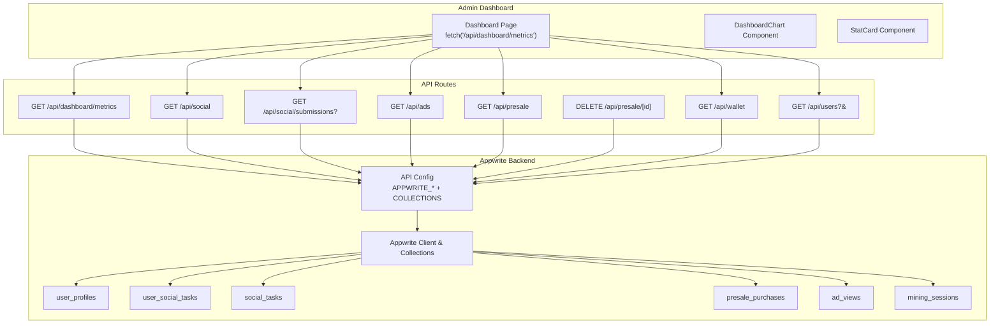
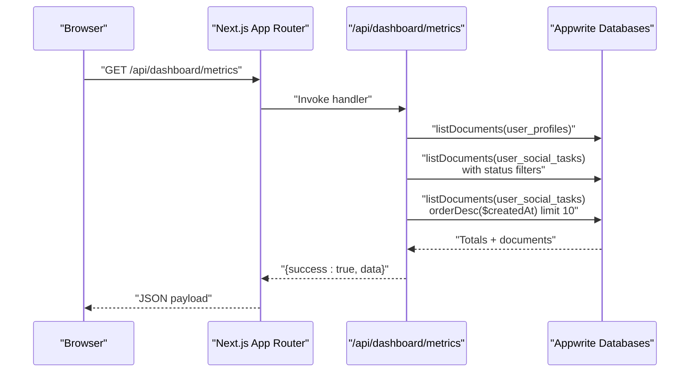
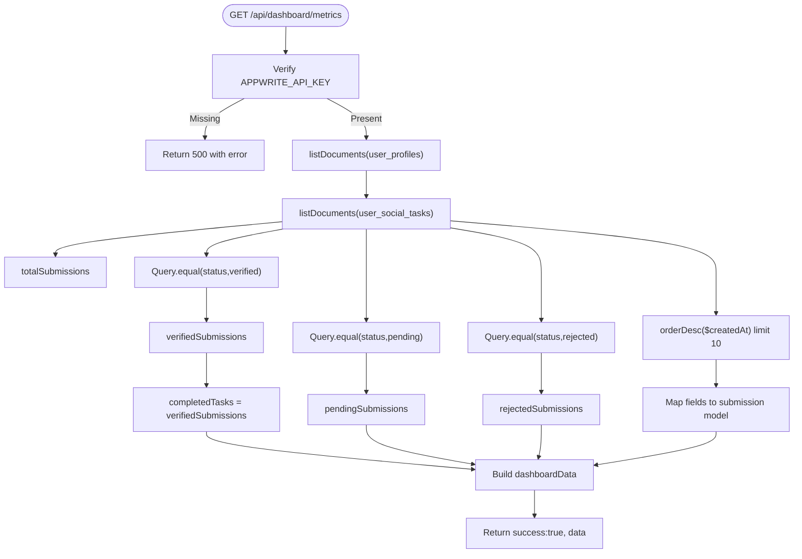
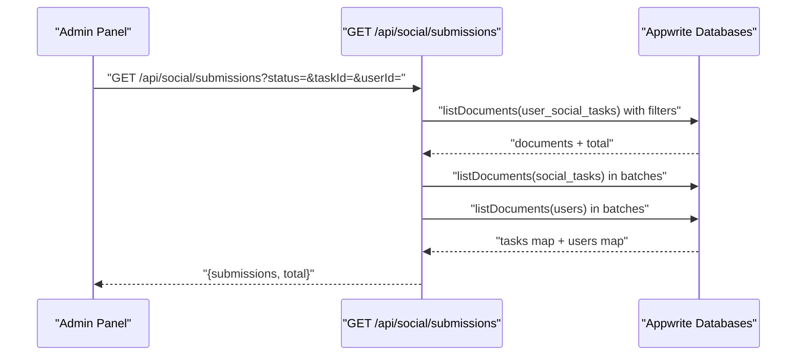
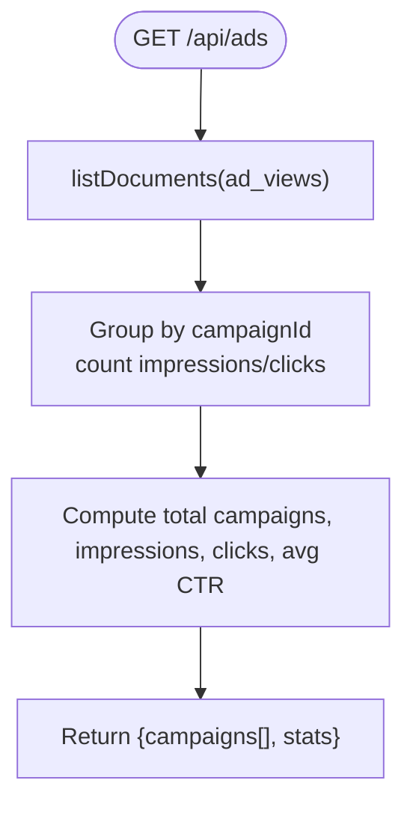
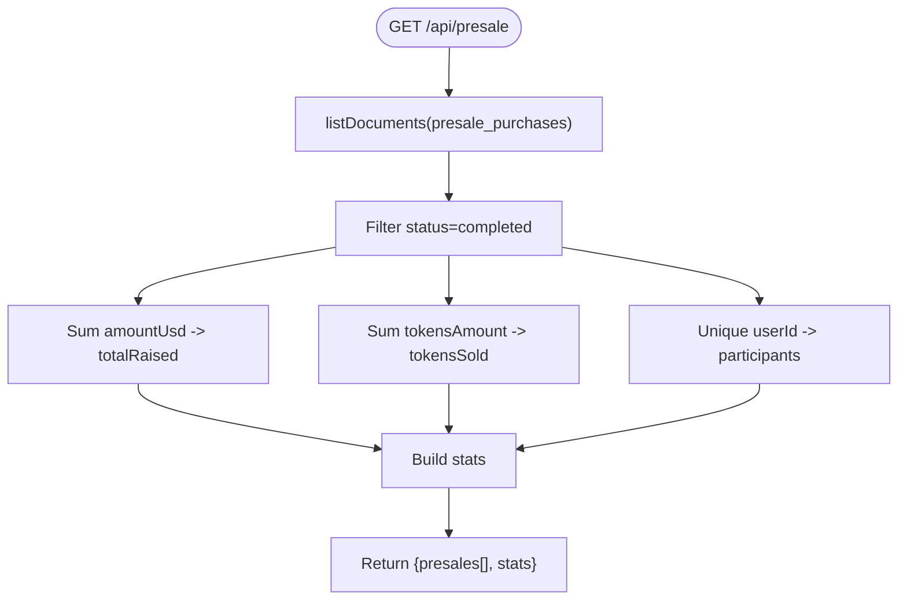
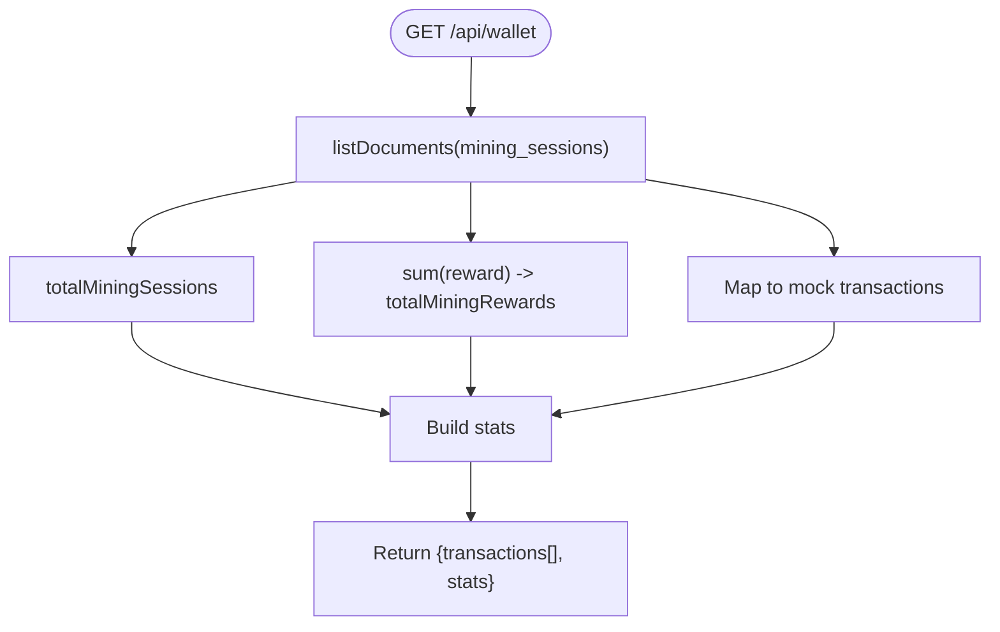
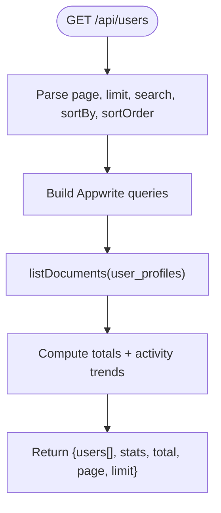
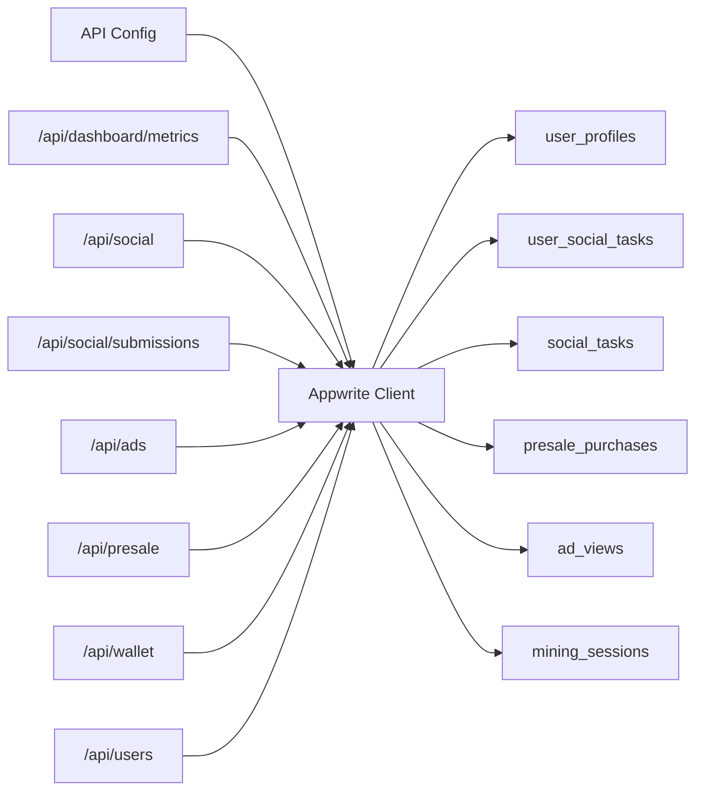

# Analytics and Metrics API

<cite>
**Referenced Files in This Document**
- [route.ts](file://admin/app/api/dashboard/metrics/route.ts)
- [route.ts](file://admin/app/api/ads/route.ts)
- [route.ts](file://admin/app/api/presale/route.ts)
- [route.ts](file://admin/app/api/presale/[id]/route.ts)
- [route.ts](file://admin/app/api/social/route.ts)
- [route.ts](file://admin/app/api/social/submissions/route.ts)
- [route.ts](file://admin/app/api/users/route.ts)
- [route.ts](file://admin/app/api/wallet/route.ts)
- [api.ts](file://admin/src/config/api.ts)
- [appwrite.ts](file://admin/lib/appwrite.ts)
- [middleware.ts](file://admin/middleware.ts)
- [page.tsx](file://admin/app/dashboard/page.tsx)
- [DashboardChart.tsx](file://admin/components/DashboardChart.tsx)
- [StatCard.tsx](file://admin/components/StatCard.tsx)
</cite>

## Table of Contents
1. [Introduction](#introduction)
2. [Project Structure](#project-structure)
3. [Core Components](#core-components)
4. [Architecture Overview](#architecture-overview)
5. [Detailed Component Analysis](#detailed-component-analysis)
6. [Dependency Analysis](#dependency-analysis)
7. [Performance Considerations](#performance-considerations)
8. [Troubleshooting Guide](#troubleshooting-guide)
9. [Conclusion](#conclusion)
10. [Appendices](#appendices)

## Introduction
This document provides comprehensive API documentation for the analytics and metrics system powering the admin dashboard. It covers endpoints for:
- Dashboard metrics including user growth indicators, social task completion rates, and recent activity
- Advertising performance tracking (mock campaigns and CTR)
- Presale analytics for token sales monitoring
- Wallet/revenue tracking (mock mining rewards)
- Filtering and pagination patterns used across endpoints
- Data visualization requirements and chart data structures
- Real-time update considerations and historical data access
- Examples of metric calculations, trend analysis, and performance reporting
- Data privacy considerations and access controls for sensitive analytics data

## Project Structure
The analytics APIs are implemented as Next.js App Router API routes under the admin application. They connect to an Appwrite backend using a shared configuration and collection mapping. The admin dashboard page consumes these endpoints to render charts and tables.

**Diagram sources**
- [page.tsx](file://admin/app/dashboard/page.tsx#L90-L144)
- [route.ts](file://admin/app/api/dashboard/metrics/route.ts#L1-L111)
- [route.ts](file://admin/app/api/social/route.ts#L1-L167)
- [route.ts](file://admin/app/api/social/submissions/route.ts#L1-L142)
- [route.ts](file://admin/app/api/ads/route.ts#L1-L99)
- [route.ts](file://admin/app/api/presale/route.ts#L1-L75)
- [route.ts](file://admin/app/api/presale/[id]/route.ts#L1-L29)
- [route.ts](file://admin/app/api/wallet/route.ts#L1-L66)
- [route.ts](file://admin/app/api/users/route.ts#L54-L209)
- [api.ts](file://admin/src/config/api.ts#L1-L35)
- [appwrite.ts](file://admin/lib/appwrite.ts#L1-L33)

**Section sources**
- [page.tsx](file://admin/app/dashboard/page.tsx#L90-L144)
- [api.ts](file://admin/src/config/api.ts#L1-L35)
- [appwrite.ts](file://admin/lib/appwrite.ts#L1-L33)

## Core Components
- Dashboard metrics endpoint: aggregates totals, submission statuses, and recent activity
- Social tasks endpoint: lists tasks and calculates counts; submissions endpoint supports filtering
- Advertising endpoint: groups ad views into mock campaigns and computes CTR
- Presale endpoint: aggregates raised funds, tokens sold, and participant counts
- Wallet endpoint: mocks transactions and revenue stats from mining sessions
- Users endpoint: paginated, searchable, sortable user listing with registration trends
- Middleware: protects dashboard routes and allows API routes unauthenticated access

**Section sources**
- [route.ts](file://admin/app/api/dashboard/metrics/route.ts#L1-L111)
- [route.ts](file://admin/app/api/social/route.ts#L1-L167)
- [route.ts](file://admin/app/api/social/submissions/route.ts#L1-L142)
- [route.ts](file://admin/app/api/ads/route.ts#L1-L99)
- [route.ts](file://admin/app/api/presale/route.ts#L1-L75)
- [route.ts](file://admin/app/api/wallet/route.ts#L1-L66)
- [route.ts](file://admin/app/api/users/route.ts#L54-L209)
- [middleware.ts](file://admin/middleware.ts#L1-L70)

## Architecture Overview
The admin dashboard communicates with Appwrite via typed API routes. Configuration is centralized in a shared config module, and Appwrite clients are initialized once. The dashboard page orchestrates multiple fetches to present charts and tables.

**Diagram sources**
- [route.ts](file://admin/app/api/dashboard/metrics/route.ts#L1-L111)
- [api.ts](file://admin/src/config/api.ts#L1-L35)
- [appwrite.ts](file://admin/lib/appwrite.ts#L1-L33)

## Detailed Component Analysis

### Dashboard Metrics Endpoint
- Path: GET /api/dashboard/metrics
- Purpose: Provide aggregated metrics for the admin dashboard
- Data returned:
  - Totals: total users, total submissions, completed tasks, pending, verified, rejected
  - Recent activity: last 10 submissions with user/task metadata
  - Timestamp: ISO timestamp of response generation
- Filters and aggregation:
  - Uses Appwrite queries to filter by status and order by creation date
  - Computes counts via total fields from list responses
- Frontend consumption:
  - Dashboard page fetches this endpoint and renders stats and charts

**Diagram sources**
- [route.ts](file://admin/app/api/dashboard/metrics/route.ts#L1-L111)

**Section sources**
- [route.ts](file://admin/app/api/dashboard/metrics/route.ts#L1-L111)
- [page.tsx](file://admin/app/dashboard/page.tsx#L90-L144)
- [DashboardChart.tsx](file://admin/components/DashboardChart.tsx#L1-L35)
- [StatCard.tsx](file://admin/components/StatCard.tsx#L1-L53)

### Social Task Management
- GET /api/social
  - Lists tasks ordered by sort order
  - Calculates total and active task counts
  - Transforms to a normalized model for the mobile app
- POST /api/social
  - Creates or updates a task; transforms to Appwrite-compatible structure
- DELETE /api/social/[id]
  - Removes a task by ID
- GET /api/social/submissions
  - Filters submissions by status, taskId, and userId
  - Enriches with task and user details by batching Appwrite queries
  - Returns paginated submissions with total count

**Diagram sources**
- [route.ts](file://admin/app/api/social/submissions/route.ts#L1-L142)
- [route.ts](file://admin/app/api/social/route.ts#L1-L167)
- [appwrite.ts](file://admin/lib/appwrite.ts#L1-L33)

**Section sources**
- [route.ts](file://admin/app/api/social/route.ts#L1-L167)
- [route.ts](file://admin/app/api/social/submissions/route.ts#L1-L142)

### Advertising Metrics Endpoint
- GET /api/ads
  - Reads ad views and groups by campaign to compute impressions and clicks
  - Calculates average CTR from total impressions and clicks
  - Returns campaigns array and stats
- POST /api/ads
  - Saves campaign data (placeholder)
- DELETE /api/ads/[id]
  - Deletes a campaign (placeholder)

**Diagram sources**
- [route.ts](file://admin/app/api/ads/route.ts#L1-L99)

**Section sources**
- [route.ts](file://admin/app/api/ads/route.ts#L1-L99)

### Presale Analytics
- GET /api/presale
  - Lists presale purchases ordered by creation date
  - Computes:
    - totalRaised: sum of completed purchases’ USD amounts
    - tokensSold: sum of completed purchases’ token amounts
    - participants: distinct user count among completed purchases
- POST /api/presale
  - Creates or updates a presale purchase
- DELETE /api/presale/[id]
  - Removes a presale purchase by ID

**Diagram sources**
- [route.ts](file://admin/app/api/presale/route.ts#L1-L75)
- [route.ts](file://admin/app/api/presale/[id]/route.ts#L1-L29)

**Section sources**
- [route.ts](file://admin/app/api/presale/route.ts#L1-L75)
- [route.ts](file://admin/app/api/presale/[id]/route.ts#L1-L29)

### Wallet/Revenue Tracking
- GET /api/wallet
  - Lists mining sessions ordered by creation date
  - Computes:
    - totalMiningSessions
    - totalMiningRewards
  - Builds mock transactions and stats (placeholder for a dedicated wallet_transactions collection)
- POST /api/wallet/transaction
  - Processes a transaction (placeholder)

**Diagram sources**
- [route.ts](file://admin/app/api/wallet/route.ts#L1-L66)

**Section sources**
- [route.ts](file://admin/app/api/wallet/route.ts#L1-L66)

### Users Management and Trends
- GET /api/users
  - Pagination via limit/offset
  - Sorting by name, email, total coins, last login, created at
  - Search via contains on name and email
  - Computes:
    - totalUsers, active/inactive/admin counts
    - userActivityStats: monthly registration trends
  - Returns users array, stats, total, page, limit

**Diagram sources**
- [route.ts](file://admin/app/api/users/route.ts#L54-L209)

**Section sources**
- [route.ts](file://admin/app/api/users/route.ts#L54-L209)

## Dependency Analysis
- Configuration
  - API configuration centralizes Appwrite endpoint, project, API key, database ID, and collection IDs
  - Appwrite client initialization and collection aliases are shared across routes
- Route dependencies
  - All analytics routes depend on the configuration and Appwrite client
  - Social submissions enrich data by joining with social tasks and users collections
- Frontend dependencies
  - Dashboard page composes multiple API calls and renders charts and stat cards

**Diagram sources**
- [api.ts](file://admin/src/config/api.ts#L1-L35)
- [appwrite.ts](file://admin/lib/appwrite.ts#L1-L33)
- [route.ts](file://admin/app/api/dashboard/metrics/route.ts#L1-L111)
- [route.ts](file://admin/app/api/social/route.ts#L1-L167)
- [route.ts](file://admin/app/api/social/submissions/route.ts#L1-L142)
- [route.ts](file://admin/app/api/ads/route.ts#L1-L99)
- [route.ts](file://admin/app/api/presale/route.ts#L1-L75)
- [route.ts](file://admin/app/api/wallet/route.ts#L1-L66)
- [route.ts](file://admin/app/api/users/route.ts#L54-L209)

**Section sources**
- [api.ts](file://admin/src/config/api.ts#L1-L35)
- [appwrite.ts](file://admin/lib/appwrite.ts#L1-L33)

## Performance Considerations
- Query optimization
  - Use Appwrite’s built-in query operators (equal, orderAsc/desc, limit) to minimize payload sizes
  - Batch reads for related entities (e.g., tasks and users for submissions) to reduce round-trips
- Pagination and sorting
  - Apply limit/offset and explicit sort orders to keep responses bounded
- Aggregation strategies
  - Prefer server-side counting and minimal transformations to reduce client work
- Caching
  - Consider caching frequently accessed dashboard metrics for short TTLs to improve responsiveness
- Network efficiency
  - Avoid unnecessary fields in projections; rely on list totals where possible

[No sources needed since this section provides general guidance]

## Troubleshooting Guide
- API key missing
  - Symptom: 500 response indicating Appwrite API key not configured
  - Resolution: Set APPWRITE_API_KEY in environment variables
- Appwrite connection errors
  - Symptom: Generic error messages from endpoints
  - Resolution: Verify APPWRITE_ENDPOINT, APPWRITE_PROJECT_ID, DATABASE_ID, and collection IDs
- Rate limiting and query limits
  - Symptom: Partial batches or truncated results
  - Resolution: Implement pagination and batched queries as shown in submissions enrichment
- Authentication redirects
  - Symptom: Redirects to login for protected pages
  - Resolution: Ensure valid Appwrite session cookies; API routes bypass middleware

**Section sources**
- [route.ts](file://admin/app/api/dashboard/metrics/route.ts#L1-L111)
- [route.ts](file://admin/app/api/social/route.ts#L51-L62)
- [route.ts](file://admin/app/api/social/submissions/route.ts#L132-L141)
- [middleware.ts](file://admin/middleware.ts#L1-L70)

## Conclusion
The analytics and metrics system provides a cohesive set of API endpoints for monitoring user growth, social task completion, advertising performance, presale sales, and wallet/revenue metrics. The endpoints leverage Appwrite’s query capabilities, support filtering and pagination, and return structured data suitable for charts and tables. The admin dashboard composes these endpoints to deliver actionable insights, with room for enhancements such as caching, advanced time-range filters, and stricter access controls.

[No sources needed since this section summarizes without analyzing specific files]

## Appendices

### API Reference

- GET /api/dashboard/metrics
  - Description: Aggregated dashboard metrics including totals, submission statuses, and recent activity
  - Response fields: totalUsers, totalSubmissions, completedTasks, pendingSubmissions, verifiedSubmissions, rejectedSubmissions, recentActivity[], timestamp
  - Notes: recentActivity is limited to last 10 items

- GET /api/social
  - Description: Lists social tasks with counts and normalized model
  - Response fields: tasks[], stats{totalTasks, activeTasks, inactiveTasks}

- POST /api/social
  - Description: Create or update a social task
  - Body: Normalized task fields mapped to Appwrite structure

- DELETE /api/social/[id]
  - Description: Delete a social task by ID

- GET /api/social/submissions
  - Query parameters:
    - status: filter by submission status
    - taskId: filter by task ID
    - userId: filter by user ID
  - Response fields: submissions[], total

- GET /api/ads
  - Description: Mock ad campaigns derived from ad views; computes impressions, clicks, and CTR
  - Response fields: campaigns[], stats{totalCampaigns, totalImpressions, totalClicks, avgCTR}

- POST /api/ads
  - Description: Save campaign data (placeholder)

- DELETE /api/ads/[id]
  - Description: Delete campaign (placeholder)

- GET /api/presale
  - Description: Lists presale purchases and computes raised funds, tokens sold, and participants
  - Response fields: presales[], stats{totalRaised, tokensSold, participants}

- POST /api/presale
  - Description: Create or update a presale purchase

- DELETE /api/presale/[id]
  - Description: Delete a presale purchase

- GET /api/wallet
  - Description: Mock wallet transactions and revenue stats from mining sessions
  - Response fields: transactions[], stats{totalBalance, totalDeposits, totalWithdrawals, rewardsDistributed}

- POST /api/wallet/transaction
  - Description: Process a transaction (placeholder)

- GET /api/users
  - Query parameters:
    - page: integer page number (default: 1)
    - limit: items per page (default: 10)
    - search: term for name/email
    - sortBy: field to sort by
    - sortOrder: asc or desc (default: desc)
  - Response fields: users[], stats{totalUsers, activeUsers, inactiveUsers, adminUsers, userActivityStats}, total, page, limit

### Data Visualization Requirements
- User Growth Chart
  - Data shape: array of { name: string, users: number }
  - Example: Monthly registration trends derived from user creation timestamps
- Submission Status Pie
  - Data shape: array of { name: string, value: number }
  - Values: pendingSubmissions, verifiedSubmissions, rejectedSubmissions
- Revenue Tracking
  - Data shape: array of { name: string, value: number }
  - Example: Mining rewards over time (mocked from mining sessions)

**Section sources**
- [page.tsx](file://admin/app/dashboard/page.tsx#L120-L132)
- [DashboardChart.tsx](file://admin/components/DashboardChart.tsx#L1-L35)

### Time Range Filters and Trend Analysis
- Current implementation
  - Dashboard metrics endpoint does not accept date range parameters
  - User registration trends are computed from raw user creation timestamps
- Recommendations
  - Extend endpoints to accept start/end date parameters
  - Add grouping by day/week/month for richer trend analysis
  - Support rolling windows (e.g., last 7 days, last 30 days)

**Section sources**
- [route.ts](file://admin/app/api/dashboard/metrics/route.ts#L1-L111)
- [route.ts](file://admin/app/api/users/route.ts#L148-L164)

### Real-Time Updates and Historical Access
- Real-time updates
  - No WebSocket or server-sent events are implemented in current routes
  - Suggested approach: introduce polling intervals for critical metrics or integrate push notifications
- Historical access
  - All endpoints return historical snapshots; no streaming historical streams are exposed
  - Suggested approach: add pagination and cursor-based pagination for large datasets

**Section sources**
- [route.ts](file://admin/app/api/dashboard/metrics/route.ts#L1-L111)
- [route.ts](file://admin/app/api/social/submissions/route.ts#L1-L142)

### Metric Calculations and Examples
- Submission completion rate
  - Formula: completedTasks / totalSubmissions (when available)
- Average Click-Through Rate (CTR)
  - Formula: (totalClicks / totalImpressions) * 100
- Revenue tracking
  - totalRaised: sum of completed presale purchases’ USD amounts
  - tokensSold: sum of completed presale purchases’ token amounts
- User growth
  - Registration trends grouped by month-year from user creation timestamps

**Section sources**
- [route.ts](file://admin/app/api/ads/route.ts#L43-L52)
- [route.ts](file://admin/app/api/presale/route.ts#L16-L31)
- [route.ts](file://admin/app/api/users/route.ts#L148-L164)

### Data Privacy and Access Controls
- Authentication
  - Dashboard pages are protected by middleware requiring Appwrite session cookies
  - API routes are currently public; consider adding API key-based authentication or session validation
- Sensitive data handling
  - Avoid returning personally identifiable information (PII) in analytics responses
  - Aggregate data where possible (e.g., counts, sums, averages)
- Recommendations
  - Enforce RBAC for analytics endpoints
  - Add audit logging for analytics access
  - Implement data retention policies for raw event data

**Section sources**
- [middleware.ts](file://admin/middleware.ts#L1-L70)
- [route.ts](file://admin/app/api/dashboard/metrics/route.ts#L1-L111)