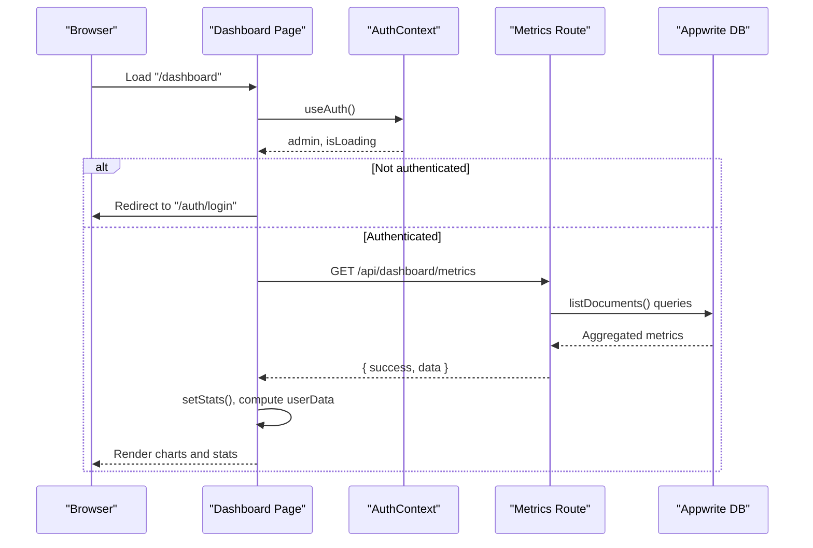
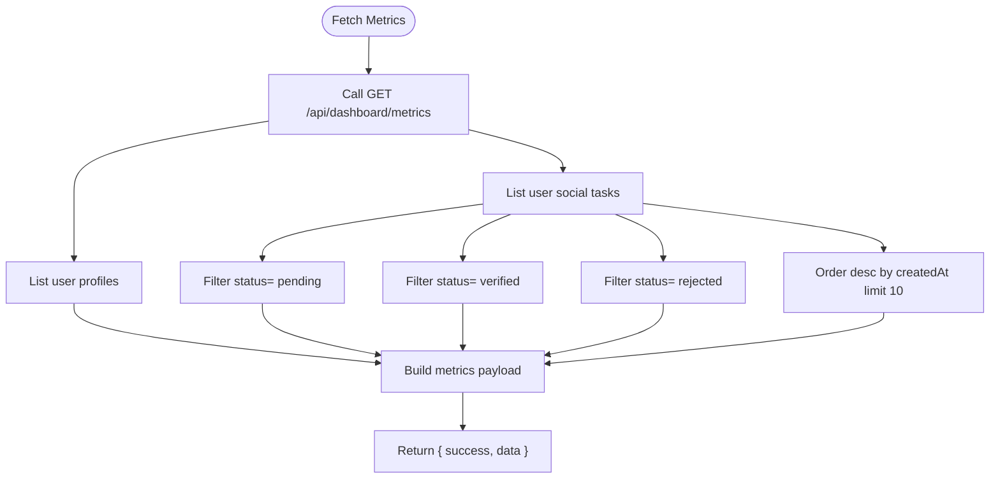
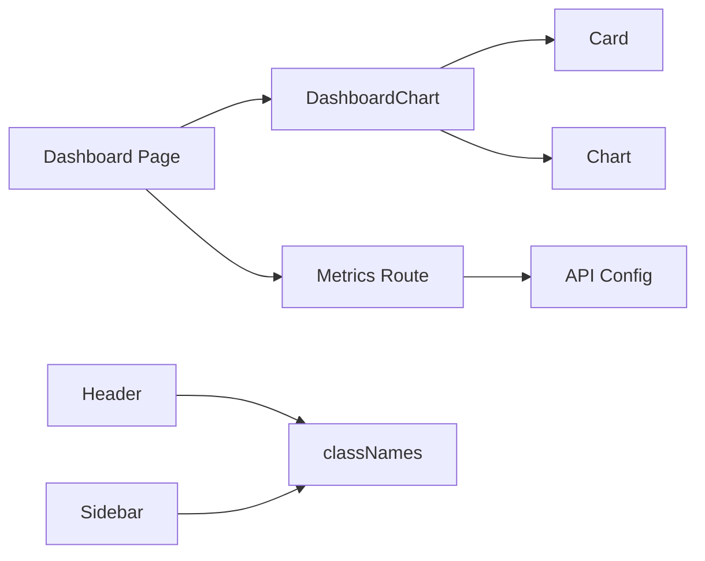

# Dashboard Components

<cite>
**Referenced Files in This Document**
- [admin/app/dashboard/page.tsx](file://admin/app/dashboard/page.tsx)
- [admin/components/DashboardChart.tsx](file://admin/components/DashboardChart.tsx)
- [admin/components/Chart.tsx](file://admin/components/Chart.tsx)
- [admin/components/Card.tsx](file://admin/components/Card.tsx)
- [admin/components/Table.tsx](file://admin/components/Table.tsx)
- [admin/app/api/dashboard/metrics/route.ts](file://admin/app/api/dashboard/metrics/route.ts)
- [admin/app/dashboard/layout.tsx](file://admin/app/dashboard/layout.tsx)
- [admin/components/Header.tsx](file://admin/components/Header.tsx)
- [admin/components/Sidebar.tsx](file://admin/components/Sidebar.tsx)
- [admin/lib/utils.ts](file://admin/lib/utils.ts)
- [admin/src/config/api.ts](file://admin/src/config/api.ts)
- [admin/app/dashboard/users/page.tsx](file://admin/app/dashboard/users/page.tsx)
- [admin/app/dashboard/social/page.tsx](file://admin/app/dashboard/social/page.tsx)
</cite>

## Table of Contents
1. [Introduction](#introduction)
2. [Project Structure](#project-structure)
3. [Core Components](#core-components)
4. [Architecture Overview](#architecture-overview)
5. [Detailed Component Analysis](#detailed-component-analysis)
6. [Dependency Analysis](#dependency-analysis)
7. [Performance Considerations](#performance-considerations)
8. [Troubleshooting Guide](#troubleshooting-guide)
9. [Conclusion](#conclusion)
10. [Appendices](#appendices)

## Introduction
This document describes the admin dashboard components and UI elements, focusing on the main dashboard page layout, chart visualization components, statistical cards, and data tables. It explains the component hierarchy, prop interfaces, and data binding patterns, and covers metrics display, real-time data considerations, interactive elements, responsive design, accessibility, and integration with the data layer.

## Project Structure
The admin dashboard is built as a Next.js app under admin/. The dashboard page composes reusable UI components and integrates with backend APIs for metrics and data operations. The layout provides a shared header and sidebar across dashboard pages.

```mermaid
graph TB
subgraph "Dashboard Page"
DPage["admin/app/dashboard/page.tsx"]
end
subgraph "UI Components"
DC["admin/components/DashboardChart.tsx"]
Chart["admin/components/Chart.tsx"]
Card["admin/components/Card.tsx"]
Table["admin/components/Table.tsx"]
end
subgraph "Layout"
Layout["admin/app/dashboard/layout.tsx"]
Header["admin/components/Header.tsx"]
Sidebar["admin/components/Sidebar.tsx"]
end
subgraph "Data Layer"
MetricsAPI["admin/app/api/dashboard/metrics/route.ts"]
Config["admin/src/config/api.ts"]
Utils["admin/lib/utils.ts"]
end
DPage --> DC
DC --> Chart
DC --> Card
DPage --> Layout
Layout --> Header
Layout --> Sidebar
DPage --> MetricsAPI
MetricsAPI --> Config
Header --> Utils
```

**Diagram sources**
- [admin/app/dashboard/page.tsx](file://admin/app/dashboard/page.tsx#L1-L706)
- [admin/components/DashboardChart.tsx](file://admin/components/DashboardChart.tsx#L1-L35)
- [admin/components/Chart.tsx](file://admin/components/Chart.tsx#L1-L128)
- [admin/components/Card.tsx](file://admin/components/Card.tsx#L1-L38)
- [admin/components/Table.tsx](file://admin/components/Table.tsx#L1-L60)
- [admin/app/dashboard/layout.tsx](file://admin/app/dashboard/layout.tsx#L1-L31)
- [admin/components/Header.tsx](file://admin/components/Header.tsx#L1-L155)
- [admin/components/Sidebar.tsx](file://admin/components/Sidebar.tsx#L1-L195)
- [admin/app/api/dashboard/metrics/route.ts](file://admin/app/api/dashboard/metrics/route.ts#L1-L111)
- [admin/src/config/api.ts](file://admin/src/config/api.ts#L1-L35)
- [admin/lib/utils.ts](file://admin/lib/utils.ts#L1-L3)

**Section sources**
- [admin/app/dashboard/page.tsx](file://admin/app/dashboard/page.tsx#L1-L706)
- [admin/app/dashboard/layout.tsx](file://admin/app/dashboard/layout.tsx#L1-L31)

## Core Components
- Dashboard page orchestrates authentication checks, metrics fetching, and renders statistics, charts, recent activity, and quick actions.
- DashboardChart wraps a Card and Chart to render bar/pie/line/area charts with configurable data keys and heights.
- Chart renders Recharts-based visualizations with tooltips, legends, and responsive containers.
- Card provides a consistent card shell with optional title/subtitle/actions.
- Table renders tabular data with optional loading state, click handlers, and custom cell rendering.

**Section sources**
- [admin/app/dashboard/page.tsx](file://admin/app/dashboard/page.tsx#L1-L706)
- [admin/components/DashboardChart.tsx](file://admin/components/DashboardChart.tsx#L1-L35)
- [admin/components/Chart.tsx](file://admin/components/Chart.tsx#L1-L128)
- [admin/components/Card.tsx](file://admin/components/Card.tsx#L1-L38)
- [admin/components/Table.tsx](file://admin/components/Table.tsx#L1-L60)

## Architecture Overview
The dashboard follows a layered architecture:
- Presentation layer: Dashboard page and reusable components.
- Data layer: Next.js route handler aggregates metrics from Appwrite.
- Configuration: Environment-driven API configuration for Appwrite collections and credentials.
- Utilities: Helper for conditional class names.



**Diagram sources**
- [admin/app/dashboard/page.tsx](file://admin/app/dashboard/page.tsx#L54-L144)
- [admin/app/api/dashboard/metrics/route.ts](file://admin/app/api/dashboard/metrics/route.ts#L1-L111)

## Detailed Component Analysis

### Dashboard Page
Responsibilities:
- Authentication guard and redirect.
- Fetch dashboard metrics from a single API endpoint.
- Compute derived datasets (e.g., user growth).
- Render statistics cards, charts, recent activity list, and quick actions.
- Provide skeleton loaders during initial load.

Key props and data binding:
- Uses a typed stats object for totals and recent activity.
- Accepts arrays for user growth and revenue-like series.
- Renders charts via DashboardChart with type, data, and dataKey props.

Interactive elements:
- Quick actions buttons navigate to users, social tasks, wallet, and ads pages.
- Recent activity list displays status badges with color-coded text.

Real-time considerations:
- No polling is implemented in the current code; metrics refresh on mount and via manual reload.

Accessibility:
- Uses semantic headings and lists.
- Buttons and links include aria labels where applicable.

Responsive design:
- Grid layouts adapt from 1 to 4 columns on small screens.
- Charts and tables use responsive containers.

**Section sources**
- [admin/app/dashboard/page.tsx](file://admin/app/dashboard/page.tsx#L1-L706)

### DashboardChart Component
Purpose:
- Wraps a Card and Chart to render a chart with a configurable title and height.

Props interface:
- title: string
- type: 'line' | 'bar' | 'pie' | 'area'
- data: any[]
- dataKey: string
- nameKey?: string (default 'name')
- height?: number (default 300)

Composition pattern:
- Delegates rendering to Chart and applies Card wrapper for consistent styling.

**Section sources**
- [admin/components/DashboardChart.tsx](file://admin/components/DashboardChart.tsx#L1-L35)

### Chart Component
Purpose:
- Renders Recharts visualizations (line, bar, pie, area) with tooltips, legends, and responsive container.

Props interface:
- type: 'line' | 'bar' | 'pie' | 'area'
- data: any[]
- dataKey: string
- nameKey?: string (default 'name')
- height?: number (default 300)
- colors?: string[] (default palette)
- className?: string

Rendering logic:
- Switches on type to render appropriate Recharts component.
- Uses ResponsiveContainer to adapt to parent width/height.

**Section sources**
- [admin/components/Chart.tsx](file://admin/components/Chart.tsx#L1-L128)

### Card Component
Purpose:
- Provides a consistent card layout with optional title, subtitle, actions, and custom classes.

Props interface:
- title?: string
- subtitle?: string
- children: ReactNode
- actions?: ReactNode
- className?: string

**Section sources**
- [admin/components/Card.tsx](file://admin/components/Card.tsx#L1-L38)

### Table Component
Purpose:
- Renders tabular data with optional loading spinner, click handlers, and custom cell renderers.

Props interface:
- columns: TableColumn[]
- data: any[]
- loading?: boolean
- onRowClick?: (row: any) => void
- className?: string

Column interface:
- key: string
- title: string
- render?: (value: any, row: any) => ReactNode

Behavior:
- Displays a centered spinner when loading.
- Applies hover and pointer cursor when onRowClick is provided.

**Section sources**
- [admin/components/Table.tsx](file://admin/components/Table.tsx#L1-L60)

### Layout, Header, and Sidebar
- Layout composes Sidebar and Header and hosts page content.
- Header includes search, notifications, theme toggle, and user profile menu.
- Sidebar provides navigation, mobile drawer, and desktop collapsible state.

Accessibility:
- Uses Headless UI Menu for accessible dropdowns.
- Buttons include aria-labels and roles where appropriate.

Responsive design:
- Mobile-first with a Drawer dialog and collapsible desktop sidebar.

**Section sources**
- [admin/app/dashboard/layout.tsx](file://admin/app/dashboard/layout.tsx#L1-L31)
- [admin/components/Header.tsx](file://admin/components/Header.tsx#L1-L155)
- [admin/components/Sidebar.tsx](file://admin/components/Sidebar.tsx#L1-L195)

### Data Layer and API Integration
- The dashboard page fetches metrics from /api/dashboard/metrics.
- The route handler queries Appwrite collections for counts and recent documents.
- API configuration is environment-driven and centralized.



**Diagram sources**
- [admin/app/api/dashboard/metrics/route.ts](file://admin/app/api/dashboard/metrics/route.ts#L1-L111)
- [admin/src/config/api.ts](file://admin/src/config/api.ts#L1-L35)

**Section sources**
- [admin/app/api/dashboard/metrics/route.ts](file://admin/app/api/dashboard/metrics/route.ts#L1-L111)
- [admin/src/config/api.ts](file://admin/src/config/api.ts#L1-L35)

### Example Usage Scenarios
- Rendering statistics cards:
  - Total users, completed tasks, pending submissions, verified submissions.
  - Props: title, value, optional description and icon.
- Rendering charts:
  - User growth bar chart using DashboardChart with type="bar".
  - Submission status pie chart using DashboardChart with type="pie".
- Data tables:
  - Users page table with search, filter, sort, and row click handlers.
  - Social tasks page table with toggles and modals.

Customization options:
- Chart colors array, height, and dataKey/nameKey.
- Card title/subtitle/actions.
- Table columns with custom renderers.

Styling approaches:
- Tailwind utility classes for glass effects, gradients, borders, and shadows.
- Responsive grid and container classes.

**Section sources**
- [admin/app/dashboard/page.tsx](file://admin/app/dashboard/page.tsx#L334-L705)
- [admin/components/DashboardChart.tsx](file://admin/components/DashboardChart.tsx#L1-L35)
- [admin/components/Table.tsx](file://admin/components/Table.tsx#L1-L60)
- [admin/app/dashboard/users/page.tsx](file://admin/app/dashboard/users/page.tsx#L1-L764)
- [admin/app/dashboard/social/page.tsx](file://admin/app/dashboard/social/page.tsx#L1-L851)

## Dependency Analysis
Component and module dependencies:



**Diagram sources**
- [admin/app/dashboard/page.tsx](file://admin/app/dashboard/page.tsx#L1-L706)
- [admin/components/DashboardChart.tsx](file://admin/components/DashboardChart.tsx#L1-L35)
- [admin/components/Chart.tsx](file://admin/components/Chart.tsx#L1-L128)
- [admin/components/Card.tsx](file://admin/components/Card.tsx#L1-L38)
- [admin/app/api/dashboard/metrics/route.ts](file://admin/app/api/dashboard/metrics/route.ts#L1-L111)
- [admin/src/config/api.ts](file://admin/src/config/api.ts#L1-L35)
- [admin/components/Header.tsx](file://admin/components/Header.tsx#L1-L155)
- [admin/components/Sidebar.tsx](file://admin/components/Sidebar.tsx#L1-L195)
- [admin/lib/utils.ts](file://admin/lib/utils.ts#L1-L3)

**Section sources**
- [admin/app/dashboard/page.tsx](file://admin/app/dashboard/page.tsx#L1-L706)
- [admin/components/DashboardChart.tsx](file://admin/components/DashboardChart.tsx#L1-L35)
- [admin/components/Chart.tsx](file://admin/components/Chart.tsx#L1-L128)
- [admin/components/Card.tsx](file://admin/components/Card.tsx#L1-L38)
- [admin/app/api/dashboard/metrics/route.ts](file://admin/app/api/dashboard/metrics/route.ts#L1-L111)
- [admin/src/config/api.ts](file://admin/src/config/api.ts#L1-L35)
- [admin/components/Header.tsx](file://admin/components/Header.tsx#L1-L155)
- [admin/components/Sidebar.tsx](file://admin/components/Sidebar.tsx#L1-L195)
- [admin/lib/utils.ts](file://admin/lib/utils.ts#L1-L3)

## Performance Considerations
- Initial load uses skeleton loaders to improve perceived performance while data is fetched.
- Chart rendering leverages responsive containers; avoid excessive re-renders by memoizing computed datasets.
- API calls are made once per dashboard mount; consider implementing polling or SSE if real-time updates are required.
- Keep chart data minimal and avoid unnecessary transformations in render paths.

## Troubleshooting Guide
Common issues and resolutions:
- Missing API key:
  - Symptom: Server returns configuration error.
  - Resolution: Set APPWRITE_API_KEY in environment variables.
- Authentication redirect loop:
  - Symptom: Redirects to login when not authenticated.
  - Resolution: Ensure AuthContext provides admin and isLoading transitions to false.
- Empty or stale metrics:
  - Symptom: Stats show zeros or outdated values.
  - Resolution: Trigger manual refresh or implement periodic polling.
- Chart not resizing:
  - Symptom: Chart appears clipped on small screens.
  - Resolution: Ensure parent container has explicit height and width; Chart uses ResponsiveContainer.

**Section sources**
- [admin/app/api/dashboard/metrics/route.ts](file://admin/app/api/dashboard/metrics/route.ts#L1-L20)
- [admin/app/dashboard/page.tsx](file://admin/app/dashboard/page.tsx#L78-L87)

## Conclusion
The admin dashboard composes reusable UI components with a clean separation of concerns. The dashboard page orchestrates data fetching, transforms metrics into visualizations, and provides interactive controls. The layout ensures consistent navigation and responsiveness. Extending the dashboard involves adding new metrics endpoints, composing additional charts or tables, and integrating with the existing data-fetching and authentication patterns.

## Appendices

### Component Prop Interfaces Summary
- DashboardChart
  - title: string
  - type: 'line' | 'bar' | 'pie' | 'area'
  - data: any[]
  - dataKey: string
  - nameKey?: string
  - height?: number
- Chart
  - type: 'line' | 'bar' | 'pie' | 'area'
  - data: any[]
  - dataKey: string
  - nameKey?: string
  - height?: number
  - colors?: string[]
  - className?: string
- Card
  - title?: string
  - subtitle?: string
  - children: ReactNode
  - actions?: ReactNode
  - className?: string
- Table
  - columns: TableColumn[]
  - data: any[]
  - loading?: boolean
  - onRowClick?: (row: any) => void
  - className?: string
- TableColumn
  - key: string
  - title: string
  - render?: (value: any, row: any) => ReactNode

**Section sources**
- [admin/components/DashboardChart.tsx](file://admin/components/DashboardChart.tsx#L1-L35)
- [admin/components/Chart.tsx](file://admin/components/Chart.tsx#L1-L128)
- [admin/components/Card.tsx](file://admin/components/Card.tsx#L1-L38)
- [admin/components/Table.tsx](file://admin/components/Table.tsx#L1-L60)