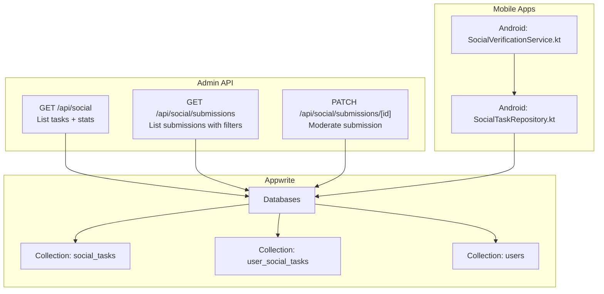
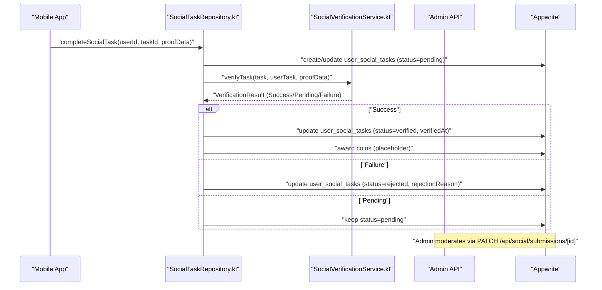
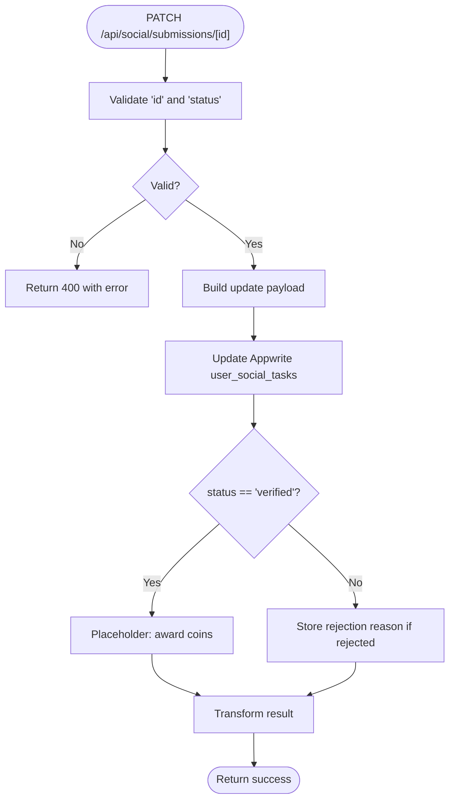
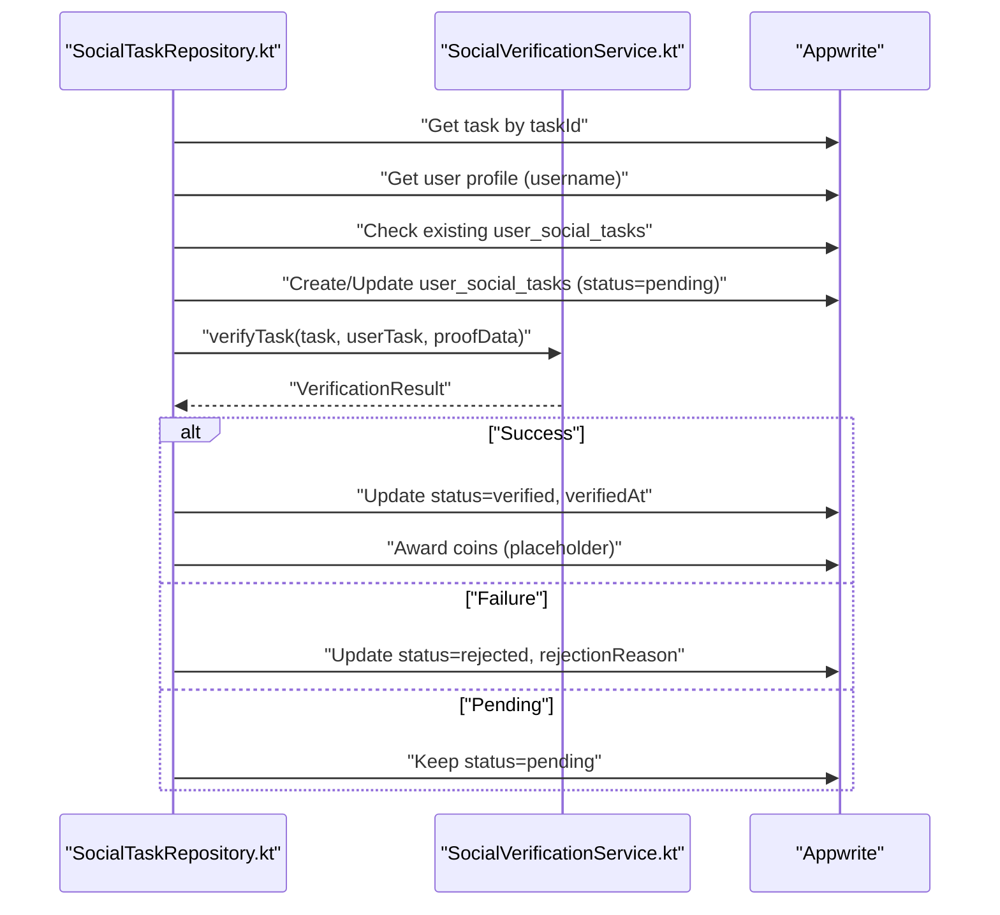
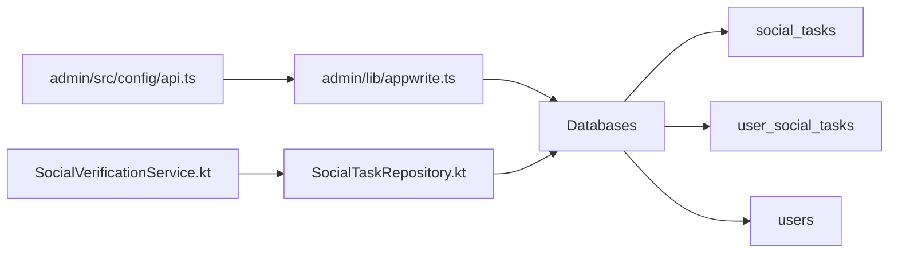
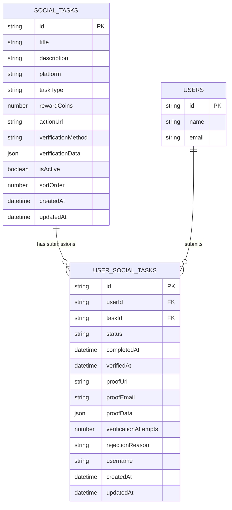

# Social Tasks API

<cite>
**Referenced Files in This Document**
- [admin/app/api/social/route.ts](file://admin/app/api/social/route.ts)
- [admin/app/api/social/submissions/route.ts](file://admin/app/api/social/submissions/route.ts)
- [admin/app/api/social/submissions/[id]/route.ts](file://admin/app/api/social/submissions/[id]/route.ts)
- [admin/src/config/api.ts](file://admin/src/config/api.ts)
- [admin/lib/appwrite.ts](file://admin/lib/appwrite.ts)
- [mobileApp/src/config/api.ts](file://mobileApp/src/config/api.ts)
- [ktMobileApp/app/src/main/java/com/ekehi/network/data/repository/SocialTaskRepository.kt](file://ktMobileApp/app/src/main/java/com/ekehi/network/data/repository/SocialTaskRepository.kt)
- [ktMobileApp/app/src/main/java/com/ekehi/network/domain/verification/SocialVerificationService.kt](file://ktMobileApp/app/src/main/java/com/ekehi/network/domain/verification/SocialVerificationService.kt)
- [admin/app/api/dashboard/metrics/route.ts](file://admin/app/api/dashboard/metrics/route.ts)
- [admin/scripts/verify-social-tasks-integration.ts](file://admin/scripts/verify-social-tasks-integration.ts)
</cite>

## Table of Contents
1. [Introduction](#introduction)
2. [Project Structure](#project-structure)
3. [Core Components](#core-components)
4. [Architecture Overview](#architecture-overview)
5. [Detailed Component Analysis](#detailed-component-analysis)
6. [Dependency Analysis](#dependency-analysis)
7. [Performance Considerations](#performance-considerations)
8. [Troubleshooting Guide](#troubleshooting-guide)
9. [Conclusion](#conclusion)
10. [Appendices](#appendices)

## Introduction
This document describes the Social Tasks API for the ekehi-mobile project. It covers:
- Social task categories endpoint: GET /api/social
- Submission listing endpoint: GET /api/social/submissions
- Individual submission moderation endpoint: PATCH /api/social/submissions/[id]
- Submission creation workflow via the mobile app and backend verification
- Status tracking, verification workflow, approval/rejection processes
- Request/response schemas, validation rules, and error handling
- Frontend integration for moderation interfaces and real-time updates
- Quality assurance checks and platform-specific verification requirements

## Project Structure
The Social Tasks API is implemented in the admin Next.js application under app/api/social. It integrates with Appwrite for data persistence and is consumed by both the admin dashboard and the mobile apps.

**Diagram sources**
- [admin/app/api/social/route.ts](file://admin/app/api/social/route.ts#L1-L167)
- [admin/app/api/social/submissions/route.ts](file://admin/app/api/social/submissions/route.ts#L1-L142)
- [admin/app/api/social/submissions/[id]/route.ts](file://admin/app/api/social/submissions/[id]/route.ts#L1-L108)
- [admin/lib/appwrite.ts](file://admin/lib/appwrite.ts#L1-L33)
- [ktMobileApp/app/src/main/java/com/ekehi/network/data/repository/SocialTaskRepository.kt](file://ktMobileApp/app/src/main/java/com/ekehi/network/data/repository/SocialTaskRepository.kt#L1-L200)
- [ktMobileApp/app/src/main/java/com/ekehi/network/domain/verification/SocialVerificationService.kt](file://ktMobileApp/app/src/main/java/com/ekehi/network/domain/verification/SocialVerificationService.kt)

**Section sources**
- [admin/app/api/social/route.ts](file://admin/app/api/social/route.ts#L1-L167)
- [admin/app/api/social/submissions/route.ts](file://admin/app/api/social/submissions/route.ts#L1-L142)
- [admin/app/api/social/submissions/[id]/route.ts](file://admin/app/api/social/submissions/[id]/route.ts#L1-L108)
- [admin/lib/appwrite.ts](file://admin/lib/appwrite.ts#L1-L33)

## Core Components
- Social tasks categories endpoint: GET /api/social
  - Returns task list with statistics and transforms fields to align with the mobile app’s data model.
- Submissions endpoint: GET /api/social/submissions
  - Lists submissions with optional filters: status, taskId, userId.
  - Enriches submissions with related task and user details.
- Submission moderation endpoint: PATCH /api/social/submissions/[id]
  - Updates submission status to pending, verified, or rejected.
  - On verified, records verification timestamp and optionally awards coins (backend placeholder).
- Appwrite configuration and collections:
  - Centralized configuration for Appwrite endpoint, project, API key, database ID, and collection IDs.
  - Shared collections for users, social tasks, and user social tasks.

**Section sources**
- [admin/app/api/social/route.ts](file://admin/app/api/social/route.ts#L1-L167)
- [admin/app/api/social/submissions/route.ts](file://admin/app/api/social/submissions/route.ts#L1-L142)
- [admin/app/api/social/submissions/[id]/route.ts](file://admin/app/api/social/submissions/[id]/route.ts#L1-L108)
- [admin/src/config/api.ts](file://admin/src/config/api.ts#L1-L35)
- [admin/lib/appwrite.ts](file://admin/lib/appwrite.ts#L1-L33)

## Architecture Overview
The Social Tasks API is a thin orchestration layer over Appwrite. Mobile clients submit task completions; backend verification determines outcome; admin APIs surface moderation controls and metrics.

**Diagram sources**
- [ktMobileApp/app/src/main/java/com/ekehi/network/data/repository/SocialTaskRepository.kt](file://ktMobileApp/app/src/main/java/com/ekehi/network/data/repository/SocialTaskRepository.kt#L103-L200)
- [ktMobileApp/app/src/main/java/com/ekehi/network/domain/verification/SocialVerificationService.kt](file://ktMobileApp/app/src/main/java/com/ekehi/network/domain/verification/SocialVerificationService.kt)
- [admin/app/api/social/submissions/[id]/route.ts](file://admin/app/api/social/submissions/[id]/route.ts#L1-L108)

## Detailed Component Analysis

### Endpoint: GET /api/social
- Purpose: Retrieve social task categories and basic statistics.
- Query parameters: None.
- Response shape:
  - success: boolean
  - data.tasks: array of task objects
  - data.stats: object with totalTasks, activeTasks, inactiveTasks
- Task object fields:
  - id, title, description, platform, taskType, rewardCoins, actionUrl, verificationMethod, verificationData, isActive, sortOrder, createdAt, updatedAt
- Ordering: tasks are ordered ascending by sortOrder.
- Error handling:
  - If Appwrite API key is missing, returns 500 with a configuration error message.
  - Otherwise returns 500 with a generic error message.

Validation and constraints:
- No explicit input validation; relies on Appwrite query and transform logic.

**Section sources**
- [admin/app/api/social/route.ts](file://admin/app/api/social/route.ts#L1-L63)
- [admin/src/config/api.ts](file://admin/src/config/api.ts#L1-L35)
- [admin/lib/appwrite.ts](file://admin/lib/appwrite.ts#L1-L33)

### Endpoint: GET /api/social/submissions
- Purpose: List task submissions with optional filtering and enrichment.
- Query parameters:
  - status: filter by submission status
  - taskId: filter by task identifier
  - userId: filter by user identifier
- Response shape:
  - success: boolean
  - data.submissions: array of submission objects
  - data.total: integer count of submissions
- Submission object fields:
  - id, userId, taskId, status, completedAt, verifiedAt, proofUrl, proofEmail, proofData, verificationAttempts, rejectionReason, username, createdAt, updatedAt
  - Enriched fields:
    - task: { id, title, description, platform, rewardCoins, taskType }
    - user: { id, name, email }
- Pagination and batching:
  - Uses batched queries to fetch related tasks and users (batch size 100) to avoid query limits.
- Ordering: submissions ordered descending by creation time.

Validation and constraints:
- Missing ID or invalid filters return appropriate errors.
- Enrichment requires presence of related documents.

**Section sources**
- [admin/app/api/social/submissions/route.ts](file://admin/app/api/social/submissions/route.ts#L1-L142)
- [admin/src/config/api.ts](file://admin/src/config/api.ts#L1-L35)
- [admin/lib/appwrite.ts](file://admin/lib/appwrite.ts#L1-L33)

### Endpoint: PATCH /api/social/submissions/[id]
- Purpose: Moderate a submission by changing its status.
- Path parameters:
  - id: submission identifier (required)
- Request body:
  - status: required ("pending", "verified", "rejected")
  - rejectionReason: required when status is "rejected"
- Response shape:
  - success: boolean
  - message: string
  - data: submission object (same fields as GET /api/social/submissions)
- Behavior:
  - On status "verified": sets verifiedAt timestamp.
  - On status "rejected": stores rejectionReason.
  - On successful moderation, backend attempts to award coins (placeholder).
- Error handling:
  - Missing id or status returns 400.
  - Missing API key returns 500 with configuration error.
  - General failures return 500 with error message.

**Diagram sources**
- [admin/app/api/social/submissions/[id]/route.ts](file://admin/app/api/social/submissions/[id]/route.ts#L1-L108)

**Section sources**
- [admin/app/api/social/submissions/[id]/route.ts](file://admin/app/api/social/submissions/[id]/route.ts#L1-L108)

### Submission Creation Workflow (Mobile App)
- Steps:
  1. Fetch available tasks from GET /api/social (aligned with mobile data model).
  2. Submit completion with proof data via repository logic.
  3. Repository creates/updates user_social_tasks with status "pending".
  4. Verification service evaluates platform-specific rules and returns result.
  5. Repository updates status to "verified" (and awards coins) or "rejected" with reason.
- Platform-specific verification:
  - Repository logs task platform and verification data for debugging.
  - Verification service performs platform-specific checks (implementation in repository).
- Duplicate prevention:
  - Repository prevents re-completing the same task if already verified.
  - Error handling detects uniqueness constraints for platform identifiers.

**Diagram sources**
- [ktMobileApp/app/src/main/java/com/ekehi/network/data/repository/SocialTaskRepository.kt](file://ktMobileApp/app/src/main/java/com/ekehi/network/data/repository/SocialTaskRepository.kt#L103-L200)
- [ktMobileApp/app/src/main/java/com/ekehi/network/domain/verification/SocialVerificationService.kt](file://ktMobileApp/app/src/main/java/com/ekehi/network/domain/verification/SocialVerificationService.kt)

**Section sources**
- [ktMobileApp/app/src/main/java/com/ekehi/network/data/repository/SocialTaskRepository.kt](file://ktMobileApp/app/src/main/java/com/ekehi/network/data/repository/SocialTaskRepository.kt#L103-L200)

### Moderation UI Integration (Admin Dashboard)
- Submission listing supports filtering by status, taskId, and userId.
- Each submission includes enriched task and user details for context.
- Metrics endpoint aggregates counts for pending, verified, and rejected submissions and recent activity.

**Section sources**
- [admin/app/api/social/submissions/route.ts](file://admin/app/api/social/submissions/route.ts#L1-L142)
- [admin/app/api/dashboard/metrics/route.ts](file://admin/app/api/dashboard/metrics/route.ts#L38-L75)

## Dependency Analysis
- Configuration:
  - API configuration defines Appwrite endpoint, project, API key, database ID, and collection IDs.
  - Appwrite client initialization sets endpoint/project and conditionally API key.
- Collections:
  - social_tasks: task definitions and metadata.
  - user_social_tasks: per-user task submissions and moderation state.
  - users: user profiles for display in admin.
- Mobile app:
  - Android repository coordinates task retrieval, submission, verification, and status updates.
  - Verification service encapsulates platform-specific checks.

**Diagram sources**
- [admin/src/config/api.ts](file://admin/src/config/api.ts#L1-L35)
- [admin/lib/appwrite.ts](file://admin/lib/appwrite.ts#L1-L33)
- [ktMobileApp/app/src/main/java/com/ekehi/network/data/repository/SocialTaskRepository.kt](file://ktMobileApp/app/src/main/java/com/ekehi/network/data/repository/SocialTaskRepository.kt#L1-L200)
- [ktMobileApp/app/src/main/java/com/ekehi/network/domain/verification/SocialVerificationService.kt](file://ktMobileApp/app/src/main/java/com/ekehi/network/domain/verification/SocialVerificationService.kt)

**Section sources**
- [admin/src/config/api.ts](file://admin/src/config/api.ts#L1-L35)
- [admin/lib/appwrite.ts](file://admin/lib/appwrite.ts#L1-L33)
- [ktMobileApp/app/src/main/java/com/ekehi/network/data/repository/SocialTaskRepository.kt](file://ktMobileApp/app/src/main/java/com/ekehi/network/data/repository/SocialTaskRepository.kt#L1-L200)

## Performance Considerations
- Batched reads for enrichment:
  - Submissions listing fetches related tasks and users in batches of 100 to avoid query limits.
- Sorting and indexing:
  - Tasks are ordered by sortOrder; submissions are ordered by creation time.
- Minimal transformation:
  - Endpoints transform only required fields to align with data models.
- Recommendations:
  - Add pagination for submissions listing when volume grows.
  - Consider adding Appwrite indices for frequent filters (status, taskId, userId).

**Section sources**
- [admin/app/api/social/submissions/route.ts](file://admin/app/api/social/submissions/route.ts#L60-L113)

## Troubleshooting Guide
Common issues and resolutions:
- Missing Appwrite API key:
  - Symptom: 500 error indicating API key not configured.
  - Resolution: Set APPWRITE_API_KEY in environment variables.
- Missing submission ID or status:
  - Symptom: 400 error for PATCH /api/social/submissions/[id].
  - Resolution: Ensure id and status are provided; rejectionReason is required when status is rejected.
- Duplicate task completion:
  - Symptom: Error indicating platform-specific uniqueness (e.g., Telegram ID already used).
  - Resolution: Prevent submitting the same task again; contact support if attempting different tasks.
- Verification failures:
  - Symptom: Submission remains pending or is rejected.
  - Resolution: Review platform-specific verification rules and provide required proof data.

**Section sources**
- [admin/app/api/social/route.ts](file://admin/app/api/social/route.ts#L50-L63)
- [admin/app/api/social/submissions/[id]/route.ts](file://admin/app/api/social/submissions/[id]/route.ts#L12-L23)
- [ktMobileApp/app/src/main/java/com/ekehi/network/data/repository/SocialTaskRepository.kt](file://ktMobileApp/app/src/main/java/com/ekehi/network/data/repository/SocialTaskRepository.kt#L197-L224)

## Conclusion
The Social Tasks API provides a clean abstraction over Appwrite for managing social task categories and submissions. It supports moderation, enrichment, and statistics while the mobile app enforces platform-specific verification and status transitions. The design emphasizes separation of concerns, with verification logic centralized in the mobile repository and moderation in the admin API.

## Appendices

### API Definitions

- GET /api/social
  - Description: List social tasks and compute statistics.
  - Response fields: success, data.tasks[], data.stats
  - Error codes: 500 (configuration or internal error)

- GET /api/social/submissions
  - Description: List submissions with optional filters and enrichments.
  - Query parameters: status, taskId, userId
  - Response fields: success, data.submissions[], data.total
  - Error codes: 500 (configuration or internal error)

- PATCH /api/social/submissions/[id]
  - Description: Moderate a submission by setting status.
  - Path parameters: id
  - Request body: status, rejectionReason (when rejected)
  - Response fields: success, message, data
  - Error codes: 400 (missing id/status), 500 (configuration or internal error)

**Section sources**
- [admin/app/api/social/route.ts](file://admin/app/api/social/route.ts#L1-L167)
- [admin/app/api/social/submissions/route.ts](file://admin/app/api/social/submissions/route.ts#L1-L142)
- [admin/app/api/social/submissions/[id]/route.ts](file://admin/app/api/social/submissions/[id]/route.ts#L1-L108)

### Data Models

**Diagram sources**
- [admin/app/api/social/route.ts](file://admin/app/api/social/route.ts#L26-L41)
- [admin/app/api/social/submissions/route.ts](file://admin/app/api/social/submissions/route.ts#L40-L57)
- [admin/lib/appwrite.ts](file://admin/lib/appwrite.ts#L21-L31)

### Quality Assurance and Verification Checks
- Integration verification script validates presence of extended fields and confirms integration readiness.
- Metrics endpoint provides visibility into moderation pipeline health.

**Section sources**
- [admin/scripts/verify-social-tasks-integration.ts](file://admin/scripts/verify-social-tasks-integration.ts#L55-L69)
- [admin/app/api/dashboard/metrics/route.ts](file://admin/app/api/dashboard/metrics/route.ts#L38-L75)