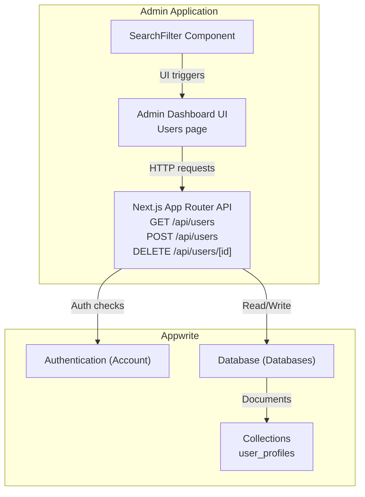
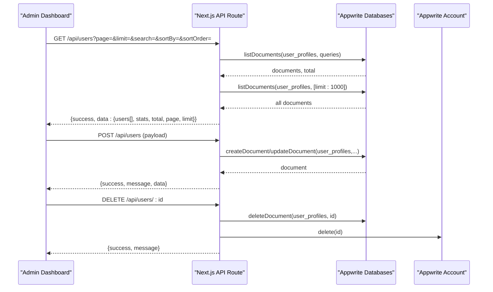
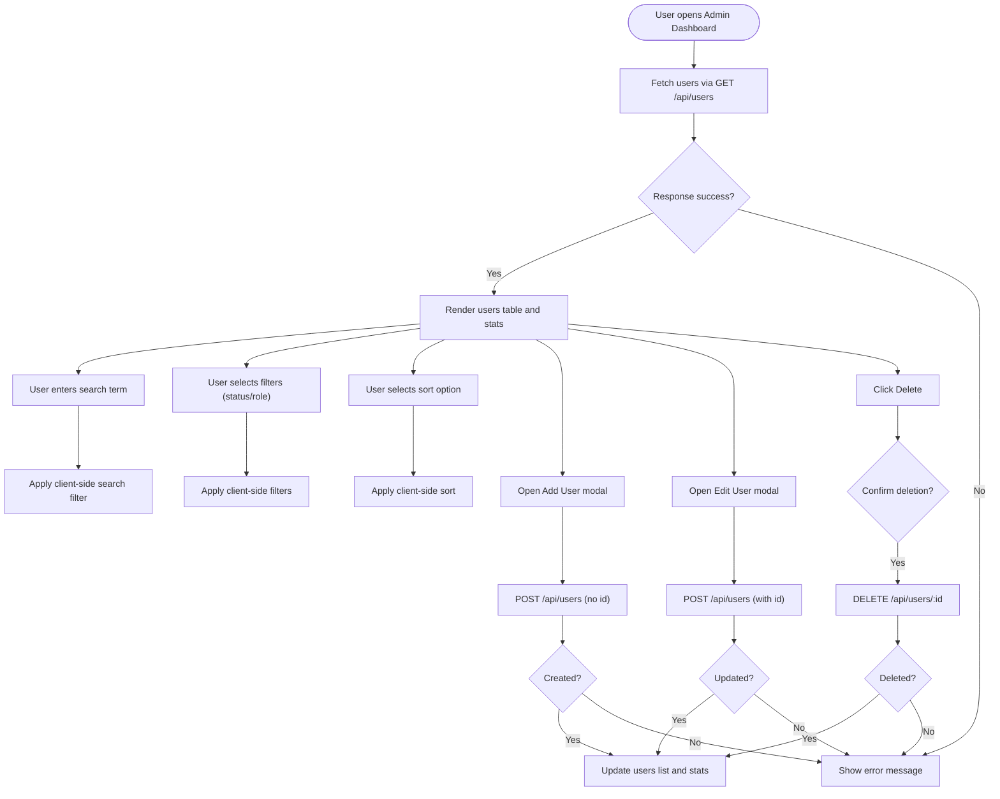
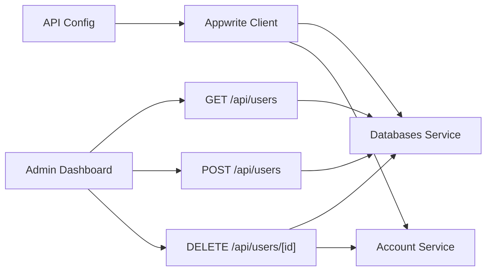

# User Management API

<cite>
**Referenced Files in This Document**
- [users route.ts](file://admin/app/api/users/route.ts)
- [users [id] route.ts](file://admin/app/api/users/[id]/route.ts)
- [API config](file://admin/src/config/api.ts)
- [Appwrite client](file://admin/lib/appwrite.ts)
- [Admin dashboard users page](file://admin/app/dashboard/users/page.tsx)
- [SearchFilter component](file://admin/components/SearchFilter.tsx)
- [Auth middleware](file://admin/middleware.ts)
- [Auth context](file://admin/contexts/AuthContext.tsx)
- [Mobile API config](file://mobileApp/src/config/api.ts)
</cite>

## Table of Contents
1. [Introduction](#introduction)
2. [Project Structure](#project-structure)
3. [Core Components](#core-components)
4. [Architecture Overview](#architecture-overview)
5. [Detailed Component Analysis](#detailed-component-analysis)
6. [Dependency Analysis](#dependency-analysis)
7. [Performance Considerations](#performance-considerations)
8. [Troubleshooting Guide](#troubleshooting-guide)
9. [Conclusion](#conclusion)
10. [Appendices](#appendices)

## Introduction
This document provides comprehensive API documentation for the user management system. It covers RESTful endpoints for listing users, retrieving individual user details, creating users, updating users, and deleting users. It explains request/response schemas, authentication and authorization requirements, pagination, filtering, and search capabilities. It also includes practical usage examples, error handling, status codes, frontend integration patterns, and security considerations.

## Project Structure
The user management API is implemented as Next.js App Router API routes under the admin application. The backend integrates with Appwrite for authentication and database operations. The admin dashboard frontend consumes these endpoints to present user data and manage user records.

**Diagram sources**
- [users route.ts](file://admin/app/api/users/route.ts#L1-L209)
- [users [id] route.ts](file://admin/app/api/users/[id]/route.ts#L1-L75)
- [Admin dashboard users page](file://admin/app/dashboard/users/page.tsx#L1-L200)
- [SearchFilter component](file://admin/components/SearchFilter.tsx#L1-L137)
- [Appwrite client](file://admin/lib/appwrite.ts#L1-L33)

**Section sources**
- [users route.ts](file://admin/app/api/users/route.ts#L1-L209)
- [users [id] route.ts](file://admin/app/api/users/[id]/route.ts#L1-L75)
- [Admin dashboard users page](file://admin/app/dashboard/users/page.tsx#L1-L200)
- [SearchFilter component](file://admin/components/SearchFilter.tsx#L1-L137)
- [Appwrite client](file://admin/lib/appwrite.ts#L1-L33)

## Core Components
- API Routes
  - GET /api/users: Lists users with pagination, search, and sorting; returns aggregated statistics.
  - POST /api/users: Creates or updates a user; accepts a user payload and persists to the database.
  - DELETE /api/users/[id]: Deletes a user from both the database and the authentication system.
- Frontend Integration
  - Admin dashboard page fetches users, displays them in a table, and supports client-side filtering/sorting.
  - SearchFilter component emits search, filter, and sort events to the page.
- Authentication and Authorization
  - Middleware enforces session-based authentication for protected paths; API routes are excluded from middleware protection.
  - Auth context manages admin login/logout and session state.

**Section sources**
- [users route.ts](file://admin/app/api/users/route.ts#L1-L209)
- [users [id] route.ts](file://admin/app/api/users/[id]/route.ts#L1-L75)
- [Admin dashboard users page](file://admin/app/dashboard/users/page.tsx#L1-L200)
- [SearchFilter component](file://admin/components/SearchFilter.tsx#L1-L137)
- [Auth middleware](file://admin/middleware.ts#L1-L70)
- [Auth context](file://admin/contexts/AuthContext.tsx#L1-L167)

## Architecture Overview
The system uses Appwrite for identity and database operations. The admin API routes act as server-side proxies to Appwrite, transforming data to a normalized shape expected by the frontend. The frontend performs client-side filtering/sorting while the API handles server-side pagination and search.

**Diagram sources**
- [users route.ts](file://admin/app/api/users/route.ts#L54-L209)
- [users [id] route.ts](file://admin/app/api/users/[id]/route.ts#L41-L75)
- [Admin dashboard users page](file://admin/app/dashboard/users/page.tsx#L120-L200)

## Detailed Component Analysis

### GET /api/users
- Purpose: Retrieve paginated, searchable, and sortable user listings with statistics.
- Query Parameters:
  - page: integer, default 1
  - limit: integer, default 10
  - search: string, full-text search across name and email
  - sortBy: string, supports name, email, walletBalance, lastLogin, createdAt
  - sortOrder: string, asc or desc, default desc
- Response Schema:
  - success: boolean
  - data:
    - users: array of user objects with id, name, email, status, role, createdAt, lastLogin, walletBalance
    - stats: object with totalUsers, activeUsers, inactiveUsers, adminUsers, userActivityStats
    - total: integer
    - page: integer
    - limit: integer
- Behavior:
  - Builds Appwrite queries for limit/offset, optional sorting, and optional search.
  - Calculates statistics by retrieving a subset of users and deriving counts and trends.
  - Normalizes user fields to a consistent shape for the frontend.
- Example Requests:
  - GET /api/users?page=1&limit=10&search=john&sortBy=name&sortOrder=asc
- Example Response:
  - {
      "success": true,
      "data": {
        "users": [{ "id": "...", "name": "John Doe", "email": "john@example.com", "status": "active", "role": "user", "createdAt": "...", "lastLogin": "...", "walletBalance": 0 }],
        "stats": { "totalUsers": 150, "activeUsers": 120, "inactiveUsers": 30, "adminUsers": 2, "userActivityStats": [] },
        "total": 150,
        "page": 1,
        "limit": 10
      }
    }

**Section sources**
- [users route.ts](file://admin/app/api/users/route.ts#L54-L209)

### POST /api/users
- Purpose: Create a new user or update an existing user.
- Request Body:
  - Optional id: string (when provided, updates existing user)
  - name: string (required)
  - email: string (required)
  - status: "active" | "inactive", default "active"
  - role: "admin" | "user", default "user"
  - walletBalance: number, default 0
- Response Schema:
  - success: boolean
  - message: string
  - data: normalized user object
- Behavior:
  - Validates presence of name and email.
  - If id is present, updates the existing document; otherwise creates a new document with a unique ID.
  - Persists email in both email and userEmail fields for compatibility.
  - Transforms the persisted result to the frontend schema.
- Example Requests:
  - POST /api/users with body: { "name": "John Doe", "email": "john@example.com" }
  - POST /api/users with body: { "id": "existing-id", "name": "Jane Doe", "email": "jane@example.com", "status": "inactive" }
- Example Response:
  - {
      "success": true,
      "message": "User created successfully",
      "data": { "id": "...", "name": "John Doe", "email": "john@example.com", "status": "active", "role": "user", "createdAt": "...", "lastLogin": "...", "walletBalance": 0 }
    }

**Section sources**
- [users route.ts](file://admin/app/api/users/route.ts#L211-L315)

### DELETE /api/users/[id]
- Purpose: Remove a user from both the database and the authentication system.
- Path Parameters:
  - id: string (required)
- Response Schema:
  - success: boolean
  - message: string
- Behavior:
  - Attempts to delete the user from the database collection first.
  - Attempts to delete the user from the authentication system second.
  - Resilient design: if one operation fails, the other is still attempted.
- Example Requests:
  - DELETE /api/users/69296cc623e1d71713e9
- Example Response:
  - {
      "success": true,
      "message": "User deleted successfully"
    }

**Section sources**
- [users [id] route.ts](file://admin/app/api/users/[id]/route.ts#L41-L75)

### Frontend Integration Patterns
- Data Fetching:
  - The admin dashboard page fetches users from GET /api/users and sets users and stats.
  - It performs client-side filtering and sorting on the returned dataset.
- Filtering and Sorting:
  - SearchFilter component emits search, filter, and sort events to the parent page.
  - The page applies search (name/email), filters (status, role), and sorts (name, email, walletBalance, lastLogin) in-memory.
- Modals and Forms:
  - Add/Edit modals submit POST /api/users with the appropriate payload.
  - The page updates the local state and stats upon success.
- Deletion:
  - Clicking Delete triggers DELETE /api/users/[id] and updates the UI accordingly.

**Diagram sources**
- [Admin dashboard users page](file://admin/app/dashboard/users/page.tsx#L1-L200)
- [SearchFilter component](file://admin/components/SearchFilter.tsx#L1-L137)
- [users route.ts](file://admin/app/api/users/route.ts#L211-L315)
- [users [id] route.ts](file://admin/app/api/users/[id]/route.ts#L41-L75)

**Section sources**
- [Admin dashboard users page](file://admin/app/dashboard/users/page.tsx#L1-L200)
- [SearchFilter component](file://admin/components/SearchFilter.tsx#L1-L137)

## Dependency Analysis
- Configuration
  - API configuration constants define Appwrite endpoint, project ID, database ID, and collection IDs.
  - Appwrite client initializes Account and Databases services with endpoint, project, and optional API key.
- API Routes
  - Both GET and POST /api/users use Appwrite Databases to list/create/update documents in the user_profiles collection.
  - DELETE /api/users/[id] uses Appwrite Databases to delete a document and Appwrite Account to delete the user.
- Frontend
  - The admin dashboard page consumes the API endpoints and uses the SearchFilter component for UI-driven filtering/sorting.

**Diagram sources**
- [API config](file://admin/src/config/api.ts#L1-L35)
- [Appwrite client](file://admin/lib/appwrite.ts#L1-L33)
- [users route.ts](file://admin/app/api/users/route.ts#L1-L209)
- [users [id] route.ts](file://admin/app/api/users/[id]/route.ts#L1-L75)
- [Admin dashboard users page](file://admin/app/dashboard/users/page.tsx#L1-L200)

**Section sources**
- [API config](file://admin/src/config/api.ts#L1-L35)
- [Appwrite client](file://admin/lib/appwrite.ts#L1-L33)
- [users route.ts](file://admin/app/api/users/route.ts#L1-L209)
- [users [id] route.ts](file://admin/app/api/users/[id]/route.ts#L1-L75)
- [Admin dashboard users page](file://admin/app/dashboard/users/page.tsx#L1-L200)

## Performance Considerations
- Pagination and Sorting
  - The API applies limit/offset and optional server-side sorting; however, the frontend also performs client-side filtering/sorting. For large datasets, prefer server-side filtering/sorting to reduce payload size.
- Search
  - The API constructs OR queries for name and email; ensure these fields are indexed in Appwrite for efficient search. Otherwise, consider moving search to the database level or using Appwrite’s indexing features.
- Statistics
  - The statistics computation retrieves a limited subset of documents; for very large user bases, consider caching or precomputing statistics to avoid repeated heavy queries.
- Network Efficiency
  - Minimize redundant fetches by debouncing search/filter actions and combining updates to the UI.

[No sources needed since this section provides general guidance]

## Troubleshooting Guide
- Authentication and Authorization
  - API routes are not protected by middleware; authentication is enforced for protected UI routes via middleware and session cookies. Ensure the admin is logged in and a valid Appwrite session exists when accessing API routes.
- Error Responses
  - The API returns structured JSON with success and error fields. Inspect the error message for details on failures during user creation, updates, or deletions.
- Rate Limiting
  - Appwrite may enforce rate limits on authentication operations. If login attempts fail with rate-limit-related messages, retry after the cooldown period.
- Validation
  - Creation/updates require name and email. Missing these fields results in a 400 error with a descriptive message.
- Resilient Deletion
  - Deletion attempts both database removal and authentication removal. If one fails, the other is still attempted; verify both systems to ensure complete cleanup.

**Section sources**
- [Auth middleware](file://admin/middleware.ts#L1-L70)
- [users route.ts](file://admin/app/api/users/route.ts#L250-L315)
- [users [id] route.ts](file://admin/app/api/users/[id]/route.ts#L41-L75)
- [Auth context](file://admin/contexts/AuthContext.tsx#L1-L167)

## Conclusion
The user management API provides robust CRUD operations for users, integrated with Appwrite for authentication and persistence. The admin dashboard offers a responsive interface with client-side filtering and sorting, while the API handles pagination, search, and statistics. Proper configuration of Appwrite collections and indexes, combined with careful error handling and security practices, ensures a reliable and scalable user management experience.

[No sources needed since this section summarizes without analyzing specific files]

## Appendices

### Endpoint Reference
- GET /api/users
  - Query parameters: page, limit, search, sortBy, sortOrder
  - Response: success flag, data with users, stats, total, page, limit
- POST /api/users
  - Request body: id (optional), name, email, status, role, walletBalance
  - Response: success flag, message, normalized user data
- DELETE /api/users/[id]
  - Path parameter: id
  - Response: success flag, message

**Section sources**
- [users route.ts](file://admin/app/api/users/route.ts#L54-L209)
- [users route.ts](file://admin/app/api/users/route.ts#L211-L315)
- [users [id] route.ts](file://admin/app/api/users/[id]/route.ts#L41-L75)

### Request/Response Schemas
- GET /api/users
  - Response data.users[]: id, name, email, status, role, createdAt, lastLogin, walletBalance
  - Response data.stats: totalUsers, activeUsers, inactiveUsers, adminUsers, userActivityStats
- POST /api/users
  - Request body: id (optional), name, email, status, role, walletBalance
  - Response data: normalized user object
- DELETE /api/users/[id]
  - Response: success, message

**Section sources**
- [users route.ts](file://admin/app/api/users/route.ts#L173-L209)
- [users route.ts](file://admin/app/api/users/route.ts#L250-L315)
- [users [id] route.ts](file://admin/app/api/users/[id]/route.ts#L41-L75)

### Authentication and Authorization
- Authentication
  - Admin login/logout handled via Appwrite Account service; session cookies are used for authentication.
- Authorization
  - API routes themselves do not enforce authorization; UI routes are protected by middleware requiring a valid session.

**Section sources**
- [Auth context](file://admin/contexts/AuthContext.tsx#L1-L167)
- [Auth middleware](file://admin/middleware.ts#L1-L70)

### Frontend Integration Notes
- The admin dashboard page demonstrates:
  - Fetching users from GET /api/users
  - Applying client-side search, filter, and sort
  - Submitting POST /api/users for create/update
  - Performing DELETE /api/users/[id] for removal
- The SearchFilter component emits events that the page uses to update the UI state.

**Section sources**
- [Admin dashboard users page](file://admin/app/dashboard/users/page.tsx#L1-L200)
- [SearchFilter component](file://admin/components/SearchFilter.tsx#L1-L137)

### Configuration References
- Appwrite endpoint, project ID, database ID, and collection IDs are configured centrally and consumed by API routes and client services.

**Section sources**
- [API config](file://admin/src/config/api.ts#L1-L35)
- [Appwrite client](file://admin/lib/appwrite.ts#L1-L33)
- [Mobile API config](file://mobileApp/src/config/api.ts#L1-L44)