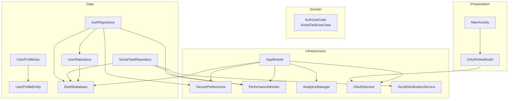
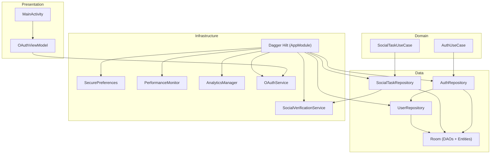
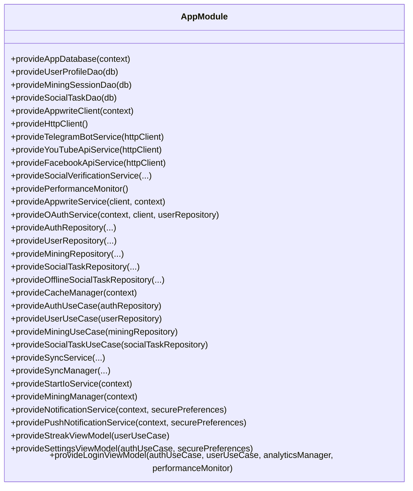
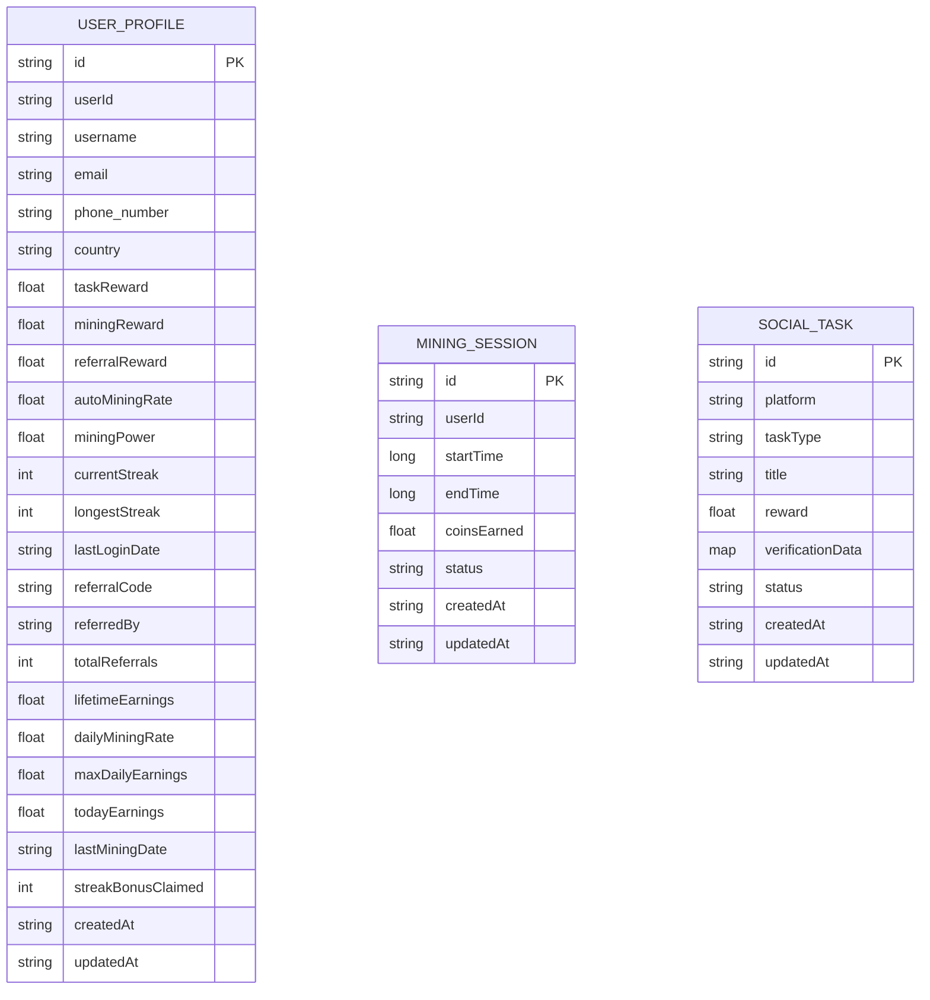
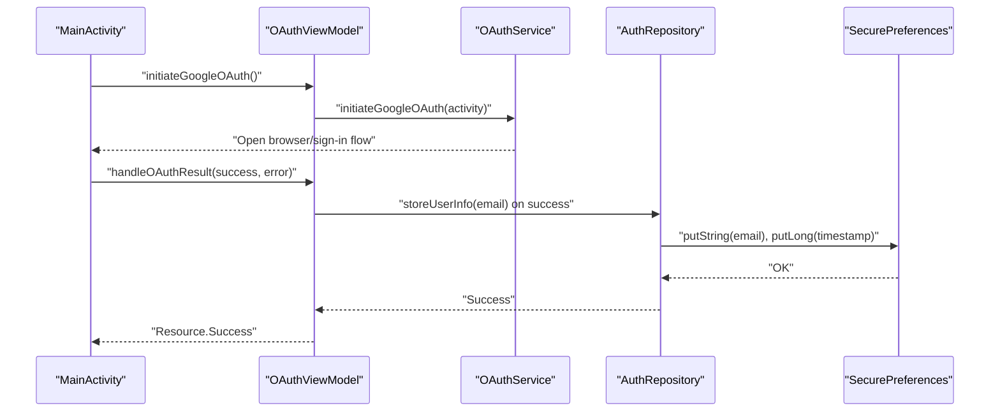
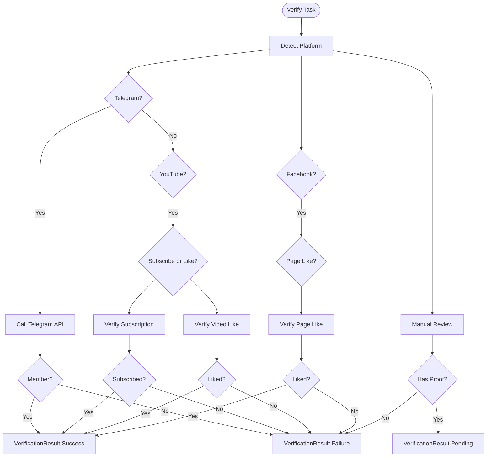
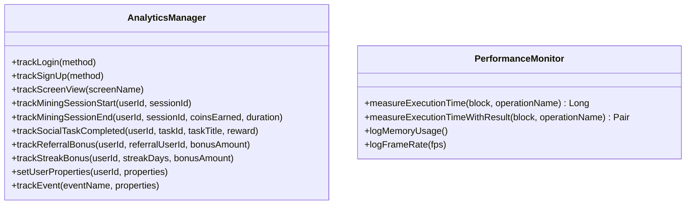
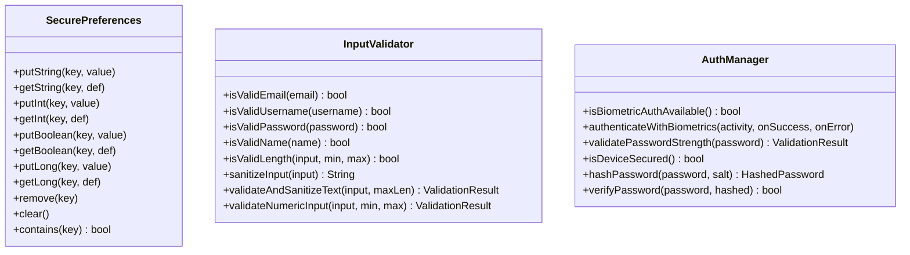
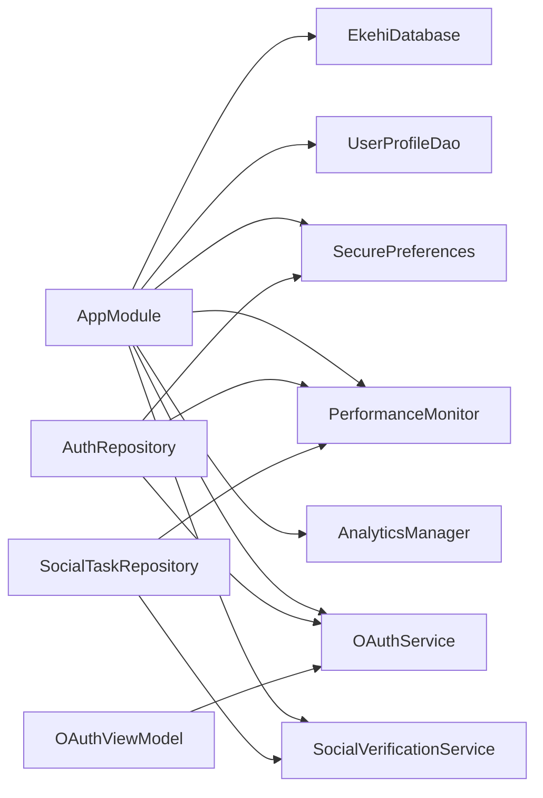

# Android Application (Kotlin)

<cite>
**Referenced Files in This Document**
- [MainApplication.kt](file://ktMobileApp/app/src/main/java/com/ekehi/network/MainApplication.kt)
- [MainActivity.kt](file://ktMobileApp/app/src/main/java/com/ekehi/network/MainActivity.kt)
- [AppModule.kt](file://ktMobileApp/app/src/main/java/com/ekehi/network/di/AppModule.kt)
- [EkehiDatabase.kt](file://ktMobileApp/app/src/main/java/com/ekehi/network/data/local/EkehiDatabase.kt)
- [UserProfileEntity.kt](file://ktMobileApp/app/src/main/java/com/ekehi/network/data/local/entities/UserProfileEntity.kt)
- [UserProfileDao.kt](file://ktMobileApp/app/src/main/java/com/ekehi/network/data/local/dao/UserProfileDao.kt)
- [SecurePreferences.kt](file://ktMobileApp/app/src/main/java/com/ekehi/network/security/SecurePreferences.kt)
- [AuthManager.kt](file://ktMobileApp/app/src/main/java/com/ekehi/network/security/AuthManager.kt)
- [InputValidator.kt](file://ktMobileApp/app/src/main/java/com/ekehi/network/security/InputValidator.kt)
- [OAuthService.kt](file://ktMobileApp/app/src/main/java/com/ekehi/network/service/OAuthService.kt)
- [AuthRepository.kt](file://ktMobileApp/app/src/main/java/com/ekehi/network/data/repository/AuthRepository.kt)
- [SocialVerificationService.kt](file://ktMobileApp/app/src/main/java/com/ekehi/network/domain/verification/SocialVerificationService.kt)
- [OAuthViewModel.kt](file://ktMobileApp/app/src/main/java/com/ekehi/network/presentation/viewmodel/OAuthViewModel.kt)
- [AnalyticsManager.kt](file://ktMobileApp/app/src/main/java/com/ekehi/network/analytics/AnalyticsManager.kt)
- [PerformanceMonitor.kt](file://ktMobileApp/app/src/main/java/com/ekehi/network/performance/PerformanceMonitor.kt)
</cite>

## Table of Contents
1. [Introduction](#introduction)
2. [Project Structure](#project-structure)
3. [Core Components](#core-components)
4. [Architecture Overview](#architecture-overview)
5. [Detailed Component Analysis](#detailed-component-analysis)
6. [Dependency Analysis](#dependency-analysis)
7. [Performance Considerations](#performance-considerations)
8. [Troubleshooting Guide](#troubleshooting-guide)
9. [Conclusion](#conclusion)
10. [Appendices](#appendices)

## Introduction
This document explains the Kotlin Android application component of the Ekehi Mobile ecosystem. It covers the multi-module architecture, Dagger Hilt dependency injection, Room database implementation, clean architecture patterns, and the data layer with offline-first strategies. It documents the authentication system with OAuth, secure preferences management, and input validation. It also details the social task verification system with platform-specific integrations, performance monitoring, analytics data collection, and error tracking. Security measures including encryption, malicious code protection, and secure storage are included, along with practical usage examples, DI patterns, Android-specific optimizations, testing strategies, and debugging approaches.

## Project Structure
The Android application module follows a layered clean architecture:
- Presentation layer: Activities, Compose UI, ViewModels
- Domain layer: Use cases and models
- Data layer: Repositories, DAOs, Entities, Services
- Infrastructure: DI with Hilt, Room, Analytics, Performance, Security

**Diagram sources**
- [MainActivity.kt](file://ktMobileApp/app/src/main/java/com/ekehi/network/MainActivity.kt#L1-L162)
- [OAuthViewModel.kt](file://ktMobileApp/app/src/main/java/com/ekehi/network/presentation/viewmodel/OAuthViewModel.kt#L1-L52)
- [AppModule.kt](file://ktMobileApp/app/src/main/java/com/ekehi/network/di/AppModule.kt#L1-L402)
- [EkehiDatabase.kt](file://ktMobileApp/app/src/main/java/com/ekehi/network/data/local/EkehiDatabase.kt#L1-L31)
- [UserProfileDao.kt](file://ktMobileApp/app/src/main/java/com/ekehi/network/data/local/dao/UserProfileDao.kt#L1-L26)
- [UserProfileEntity.kt](file://ktMobileApp/app/src/main/java/com/ekehi/network/data/local/entities/UserProfileEntity.kt#L1-L37)
- [AuthRepository.kt](file://ktMobileApp/app/src/main/java/com/ekehi/network/data/repository/AuthRepository.kt#L1-L663)
- [OAuthService.kt](file://ktMobileApp/app/src/main/java/com/ekehi/network/service/OAuthService.kt#L1-L111)
- [SocialVerificationService.kt](file://ktMobileApp/app/src/main/java/com/ekehi/network/domain/verification/SocialVerificationService.kt#L1-L161)
- [SecurePreferences.kt](file://ktMobileApp/app/src/main/java/com/ekehi/network/security/SecurePreferences.kt#L1-L132)
- [PerformanceMonitor.kt](file://ktMobileApp/app/src/main/java/com/ekehi/network/performance/PerformanceMonitor.kt#L1-L45)
- [AnalyticsManager.kt](file://ktMobileApp/app/src/main/java/com/ekehi/network/analytics/AnalyticsManager.kt#L1-L64)

**Section sources**
- [MainApplication.kt](file://ktMobileApp/app/src/main/java/com/ekehi/network/MainApplication.kt#L1-L39)
- [MainActivity.kt](file://ktMobileApp/app/src/main/java/com/ekehi/network/MainActivity.kt#L1-L162)
- [AppModule.kt](file://ktMobileApp/app/src/main/java/com/ekehi/network/di/AppModule.kt#L1-L402)

## Core Components
- Application bootstrap and lifecycle: [MainApplication.kt](file://ktMobileApp/app/src/main/java/com/ekehi/network/MainApplication.kt#L1-L39)
- Entry Activity and navigation: [MainActivity.kt](file://ktMobileApp/app/src/main/java/com/ekehi/network/MainActivity.kt#L1-L162)
- Dependency Injection: [AppModule.kt](file://ktMobileApp/app/src/main/java/com/ekehi/network/di/AppModule.kt#L1-L402)
- Room database and migrations: [EkehiDatabase.kt](file://ktMobileApp/app/src/main/java/com/ekehi/network/data/local/EkehiDatabase.kt#L1-L31)
- Local entities and DAOs: [UserProfileEntity.kt](file://ktMobileApp/app/src/main/java/com/ekehi/network/data/local/entities/UserProfileEntity.kt#L1-L37), [UserProfileDao.kt](file://ktMobileApp/app/src/main/java/com/ekehi/network/data/local/dao/UserProfileDao.kt#L1-L26)
- Secure preferences: [SecurePreferences.kt](file://ktMobileApp/app/src/main/java/com/ekehi/network/security/SecurePreferences.kt#L1-L132)
- Authentication utilities: [AuthManager.kt](file://ktMobileApp/app/src/main/java/com/ekehi/network/security/AuthManager.kt#L1-L190), [InputValidator.kt](file://ktMobileApp/app/src/main/java/com/ekehi/network/security/InputValidator.kt#L1-L146)
- OAuth service and repository: [OAuthService.kt](file://ktMobileApp/app/src/main/java/com/ekehi/network/service/OAuthService.kt#L1-L111), [AuthRepository.kt](file://ktMobileApp/app/src/main/java/com/ekehi/network/data/repository/AuthRepository.kt#L1-L663)
- Social verification: [SocialVerificationService.kt](file://ktMobileApp/app/src/main/java/com/ekehi/network/domain/verification/SocialVerificationService.kt#L1-L161)
- Analytics and performance: [AnalyticsManager.kt](file://ktMobileApp/app/src/main/java/com/ekehi/network/analytics/AnalyticsManager.kt#L1-L64), [PerformanceMonitor.kt](file://ktMobileApp/app/src/main/java/com/ekehi/network/performance/PerformanceMonitor.kt#L1-L45)

**Section sources**
- [MainApplication.kt](file://ktMobileApp/app/src/main/java/com/ekehi/network/MainApplication.kt#L1-L39)
- [MainActivity.kt](file://ktMobileApp/app/src/main/java/com/ekehi/network/MainActivity.kt#L1-L162)
- [AppModule.kt](file://ktMobileApp/app/src/main/java/com/ekehi/network/di/AppModule.kt#L1-L402)
- [EkehiDatabase.kt](file://ktMobileApp/app/src/main/java/com/ekehi/network/data/local/EkehiDatabase.kt#L1-L31)
- [UserProfileEntity.kt](file://ktMobileApp/app/src/main/java/com/ekehi/network/data/local/entities/UserProfileEntity.kt#L1-L37)
- [UserProfileDao.kt](file://ktMobileApp/app/src/main/java/com/ekehi/network/data/local/dao/UserProfileDao.kt#L1-L26)
- [SecurePreferences.kt](file://ktMobileApp/app/src/main/java/com/ekehi/network/security/SecurePreferences.kt#L1-L132)
- [AuthManager.kt](file://ktMobileApp/app/src/main/java/com/ekehi/network/security/AuthManager.kt#L1-L190)
- [InputValidator.kt](file://ktMobileApp/app/src/main/java/com/ekehi/network/security/InputValidator.kt#L1-L146)
- [OAuthService.kt](file://ktMobileApp/app/src/main/java/com/ekehi/network/service/OAuthService.kt#L1-L111)
- [AuthRepository.kt](file://ktMobileApp/app/src/main/java/com/ekehi/network/data/repository/AuthRepository.kt#L1-L663)
- [SocialVerificationService.kt](file://ktMobileApp/app/src/main/java/com/ekehi/network/domain/verification/SocialVerificationService.kt#L1-L161)
- [AnalyticsManager.kt](file://ktMobileApp/app/src/main/java/com/ekehi/network/analytics/AnalyticsManager.kt#L1-L64)
- [PerformanceMonitor.kt](file://ktMobileApp/app/src/main/java/com/ekehi/network/performance/PerformanceMonitor.kt#L1-L45)

## Architecture Overview
The application adheres to clean architecture with clear separation of concerns:
- Presentation: Activities and ViewModels orchestrate UI and state.
- Domain: Use cases encapsulate business logic and coordinate repositories.
- Data: Repositories implement offline-first strategies using Room and Appwrite.
- Infrastructure: DI binds abstractions to implementations, and services provide platform integrations.

**Diagram sources**
- [MainActivity.kt](file://ktMobileApp/app/src/main/java/com/ekehi/network/MainActivity.kt#L1-L162)
- [OAuthViewModel.kt](file://ktMobileApp/app/src/main/java/com/ekehi/network/presentation/viewmodel/OAuthViewModel.kt#L1-L52)
- [AppModule.kt](file://ktMobileApp/app/src/main/java/com/ekehi/network/di/AppModule.kt#L1-L402)
- [AuthRepository.kt](file://ktMobileApp/app/src/main/java/com/ekehi/network/data/repository/AuthRepository.kt#L1-L663)
- [SocialVerificationService.kt](file://ktMobileApp/app/src/main/java/com/ekehi/network/domain/verification/SocialVerificationService.kt#L1-L161)
- [SecurePreferences.kt](file://ktMobileApp/app/src/main/java/com/ekehi/network/security/SecurePreferences.kt#L1-L132)
- [PerformanceMonitor.kt](file://ktMobileApp/app/src/main/java/com/ekehi/network/performance/PerformanceMonitor.kt#L1-L45)
- [AnalyticsManager.kt](file://ktMobileApp/app/src/main/java/com/ekehi/network/analytics/AnalyticsManager.kt#L1-L64)
- [OAuthService.kt](file://ktMobileApp/app/src/main/java/com/ekehi/network/service/OAuthService.kt#L1-L111)

## Detailed Component Analysis

### Dependency Injection with Dagger Hilt
- Application-level DI module defines singletons for database, DAOs, repositories, services, and monitors.
- Provides Room database with migrations, HTTP client, Appwrite client, OAuth service, repositories, use cases, sync services, and performance/analytics components.
- Ensures consistent lifecycle-scoped instances and injectable dependencies across the app.

**Diagram sources**
- [AppModule.kt](file://ktMobileApp/app/src/main/java/com/ekehi/network/di/AppModule.kt#L1-L402)

**Section sources**
- [AppModule.kt](file://ktMobileApp/app/src/main/java/com/ekehi/network/di/AppModule.kt#L1-L402)

### Room Database and Offline-First Strategy
- Database definition includes entities for user profiles, mining sessions, and social tasks.
- DAOs expose Flow-based queries and suspend write operations for reactive UI updates.
- Migrations evolve schema safely across versions.
- Offline-first: repositories coordinate local Room data and cache alongside remote Appwrite calls.

**Diagram sources**
- [EkehiDatabase.kt](file://ktMobileApp/app/src/main/java/com/ekehi/network/data/local/EkehiDatabase.kt#L1-L31)
- [UserProfileEntity.kt](file://ktMobileApp/app/src/main/java/com/ekehi/network/data/local/entities/UserProfileEntity.kt#L1-L37)

**Section sources**
- [EkehiDatabase.kt](file://ktMobileApp/app/src/main/java/com/ekehi/network/data/local/EkehiDatabase.kt#L1-L31)
- [UserProfileEntity.kt](file://ktMobileApp/app/src/main/java/com/ekehi/network/data/local/entities/UserProfileEntity.kt#L1-L37)
- [UserProfileDao.kt](file://ktMobileApp/app/src/main/java/com/ekehi/network/data/local/dao/UserProfileDao.kt#L1-L26)

### Authentication System (OAuth and Secure Preferences)
- OAuth initiation and callback handling via [OAuthService.kt](file://ktMobileApp/app/src/main/java/com/ekehi/network/service/OAuthService.kt#L1-L111).
- ViewModel coordinates OAuth state transitions: [OAuthViewModel.kt](file://ktMobileApp/app/src/main/java/com/ekehi/network/presentation/viewmodel/OAuthViewModel.kt#L1-L52).
- Repository manages login, registration, logout, session checks, and secure credential storage: [AuthRepository.kt](file://ktMobileApp/app/src/main/java/com/ekehi/network/data/repository/AuthRepository.kt#L1-L663).
- Secure preferences store sensitive data encrypted: [SecurePreferences.kt](file://ktMobileApp/app/src/main/java/com/ekehi/network/security/SecurePreferences.kt#L1-L132).
- Additional security utilities: biometric auth and password validation: [AuthManager.kt](file://ktMobileApp/app/src/main/java/com/ekehi/network/security/AuthManager.kt#L1-L190), [InputValidator.kt](file://ktMobileApp/app/src/main/java/com/ekehi/network/security/InputValidator.kt#L1-L146).

**Diagram sources**
- [MainActivity.kt](file://ktMobileApp/app/src/main/java/com/ekehi/network/MainActivity.kt#L1-L162)
- [OAuthViewModel.kt](file://ktMobileApp/app/src/main/java/com/ekehi/network/presentation/viewmodel/OAuthViewModel.kt#L1-L52)
- [OAuthService.kt](file://ktMobileApp/app/src/main/java/com/ekehi/network/service/OAuthService.kt#L1-L111)
- [AuthRepository.kt](file://ktMobileApp/app/src/main/java/com/ekehi/network/data/repository/AuthRepository.kt#L1-L663)
- [SecurePreferences.kt](file://ktMobileApp/app/src/main/java/com/ekehi/network/security/SecurePreferences.kt#L1-L132)

**Section sources**
- [OAuthService.kt](file://ktMobileApp/app/src/main/java/com/ekehi/network/service/OAuthService.kt#L1-L111)
- [OAuthViewModel.kt](file://ktMobileApp/app/src/main/java/com/ekehi/network/presentation/viewmodel/OAuthViewModel.kt#L1-L52)
- [AuthRepository.kt](file://ktMobileApp/app/src/main/java/com/ekehi/network/data/repository/AuthRepository.kt#L1-L663)
- [SecurePreferences.kt](file://ktMobileApp/app/src/main/java/com/ekehi/network/security/SecurePreferences.kt#L1-L132)
- [AuthManager.kt](file://ktMobileApp/app/src/main/java/com/ekehi/network/security/AuthManager.kt#L1-L190)
- [InputValidator.kt](file://ktMobileApp/app/src/main/java/com/ekehi/network/security/InputValidator.kt#L1-L146)

### Social Task Verification System
- Platform-specific verification via [SocialVerificationService.kt](file://ktMobileApp/app/src/main/java/com/ekehi/network/domain/verification/SocialVerificationService.kt#L1-L161).
- Supports Telegram, YouTube, Facebook, and manual verification pathways.
- Returns sealed-class verification results for UI handling.

**Diagram sources**
- [SocialVerificationService.kt](file://ktMobileApp/app/src/main/java/com/ekehi/network/domain/verification/SocialVerificationService.kt#L1-L161)

**Section sources**
- [SocialVerificationService.kt](file://ktMobileApp/app/src/main/java/com/ekehi/network/domain/verification/SocialVerificationService.kt#L1-L161)

### Analytics and Performance Monitoring
- Analytics manager exposes typed events for login, sign-up, screen views, mining sessions, social task completion, referrals, streak bonuses, and custom events.
- Performance monitor measures execution time and logs memory usage and frame rates.

**Diagram sources**
- [AnalyticsManager.kt](file://ktMobileApp/app/src/main/java/com/ekehi/network/analytics/AnalyticsManager.kt#L1-L64)
- [PerformanceMonitor.kt](file://ktMobileApp/app/src/main/java/com/ekehi/network/performance/PerformanceMonitor.kt#L1-L45)

**Section sources**
- [AnalyticsManager.kt](file://ktMobileApp/app/src/main/java/com/ekehi/network/analytics/AnalyticsManager.kt#L1-L64)
- [PerformanceMonitor.kt](file://ktMobileApp/app/src/main/java/com/ekehi/network/performance/PerformanceMonitor.kt#L1-L45)

### Security Implementation
- EncryptedSharedPreferences for secure storage of sensitive preferences.
- Input validation utilities for emails, usernames, passwords, names, and numeric ranges.
- Biometric authentication support and password hashing helpers.
- Security interceptor and logging utilities are provided in DI module comments for extensibility.

**Diagram sources**
- [SecurePreferences.kt](file://ktMobileApp/app/src/main/java/com/ekehi/network/security/SecurePreferences.kt#L1-L132)
- [InputValidator.kt](file://ktMobileApp/app/src/main/java/com/ekehi/network/security/InputValidator.kt#L1-L146)
- [AuthManager.kt](file://ktMobileApp/app/src/main/java/com/ekehi/network/security/AuthManager.kt#L1-L190)

**Section sources**
- [SecurePreferences.kt](file://ktMobileApp/app/src/main/java/com/ekehi/network/security/SecurePreferences.kt#L1-L132)
- [InputValidator.kt](file://ktMobileApp/app/src/main/java/com/ekehi/network/security/InputValidator.kt#L1-L146)
- [AuthManager.kt](file://ktMobileApp/app/src/main/java/com/ekehi/network/security/AuthManager.kt#L1-L190)

## Dependency Analysis
- Hilt module centralizes bindings for database, repositories, services, and monitors.
- Repositories depend on Appwrite service, performance monitor, and secure preferences.
- Social verification depends on platform-specific services (Telegram, YouTube, Facebook).
- ViewModels depend on use cases and services; activities depend on ViewModels and navigation.

**Diagram sources**
- [AppModule.kt](file://ktMobileApp/app/src/main/java/com/ekehi/network/di/AppModule.kt#L1-L402)
- [AuthRepository.kt](file://ktMobileApp/app/src/main/java/com/ekehi/network/data/repository/AuthRepository.kt#L1-L663)
- [SocialVerificationService.kt](file://ktMobileApp/app/src/main/java/com/ekehi/network/domain/verification/SocialVerificationService.kt#L1-L161)
- [OAuthViewModel.kt](file://ktMobileApp/app/src/main/java/com/ekehi/network/presentation/viewmodel/OAuthViewModel.kt#L1-L52)

**Section sources**
- [AppModule.kt](file://ktMobileApp/app/src/main/java/com/ekehi/network/di/AppModule.kt#L1-L402)

## Performance Considerations
- Use the performance monitor to measure critical operations and log execution times.
- Prefer Flow-based DAO queries for reactive UI updates and avoid blocking the main thread.
- Batch writes and minimize redundant network calls; leverage caching and offline repositories.
- Monitor memory usage and frame rates during animations and heavy computations.

[No sources needed since this section provides general guidance]

## Troubleshooting Guide
- OAuth callback handling: Ensure the activity receives the OAuth extras and updates ViewModel state accordingly.
- Session cleanup on logout: Confirm that mining preferences and session data are cleared and the Appwrite session is deleted.
- Validation failures: Use input validator utilities to sanitize and validate user inputs before submission.
- Secure storage: Verify encrypted preferences keys and values; ensure master key availability.

**Section sources**
- [MainActivity.kt](file://ktMobileApp/app/src/main/java/com/ekehi/network/MainActivity.kt#L1-L162)
- [AuthRepository.kt](file://ktMobileApp/app/src/main/java/com/ekehi/network/data/repository/AuthRepository.kt#L1-L663)
- [InputValidator.kt](file://ktMobileApp/app/src/main/java/com/ekehi/network/security/InputValidator.kt#L1-L146)
- [SecurePreferences.kt](file://ktMobileApp/app/src/main/java/com/ekehi/network/security/SecurePreferences.kt#L1-L132)

## Conclusion
The application implements a robust, layered architecture with strong DI, Room-based offline-first data management, comprehensive OAuth authentication, and platform-specific social task verification. Security is enforced through encrypted storage, input validation, and biometric authentication. Analytics and performance monitoring enable observability and optimization. The modular design supports maintainability, testability, and scalability.

[No sources needed since this section summarizes without analyzing specific files]

## Appendices

### Practical Examples and Android-Specific Optimizations
- Initialize SDKs and services in the application class for global availability.
- Use lifecycle-aware components and coroutines for asynchronous operations.
- Employ Flow and StateFlow for reactive UI updates and state management.
- Apply Room transactions and migrations carefully to preserve data integrity.

**Section sources**
- [MainApplication.kt](file://ktMobileApp/app/src/main/java/com/ekehi/network/MainApplication.kt#L1-L39)
- [MainActivity.kt](file://ktMobileApp/app/src/main/java/com/ekehi/network/MainActivity.kt#L1-L162)
- [AppModule.kt](file://ktMobileApp/app/src/main/java/com/ekehi/network/di/AppModule.kt#L1-L402)

### Testing Strategies and Debugging Approaches
- Unit tests for validators, managers, and repositories using mocked dependencies.
- Instrumented tests for UI flows and OAuth callbacks.
- Logging and performance metrics for diagnosing slow operations and memory leaks.
- Use ViewModel testing utilities and coroutine dispatchers for deterministic tests.

[No sources needed since this section provides general guidance]