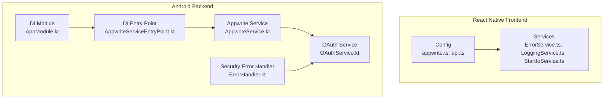
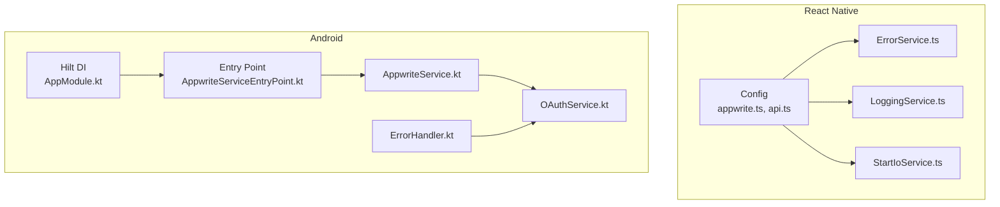
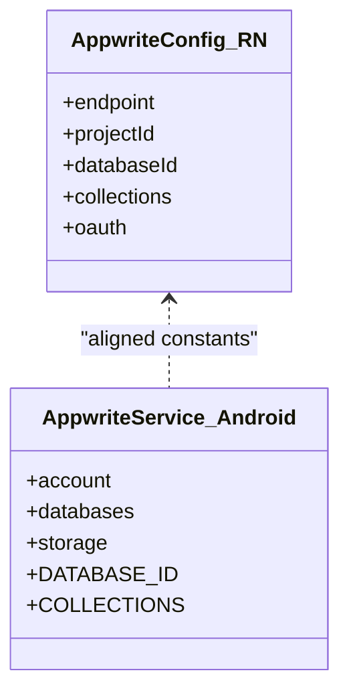
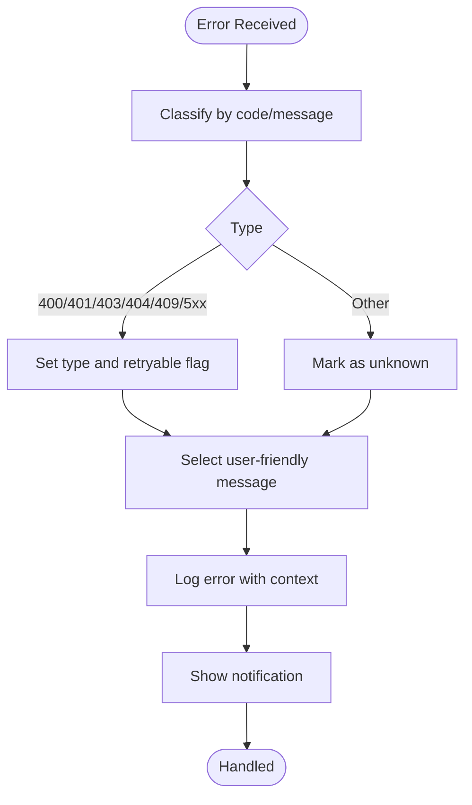
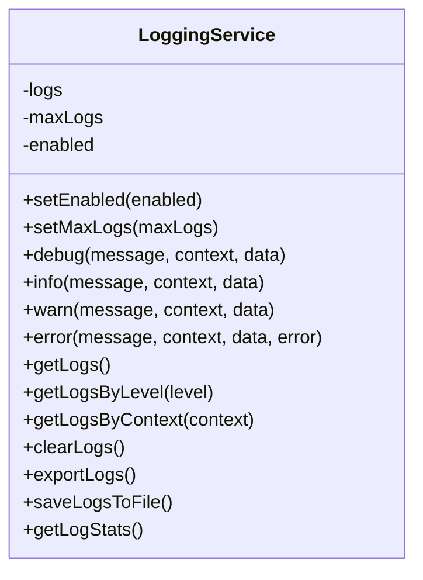
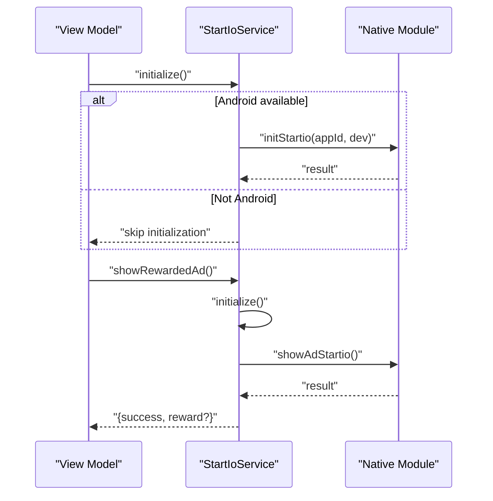
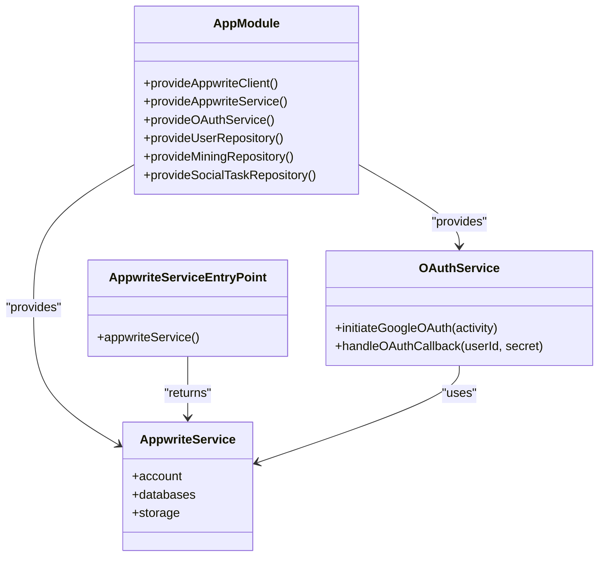
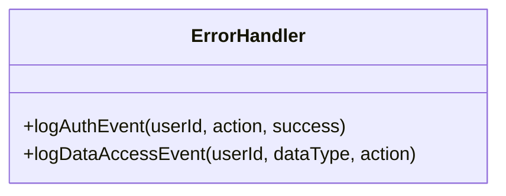
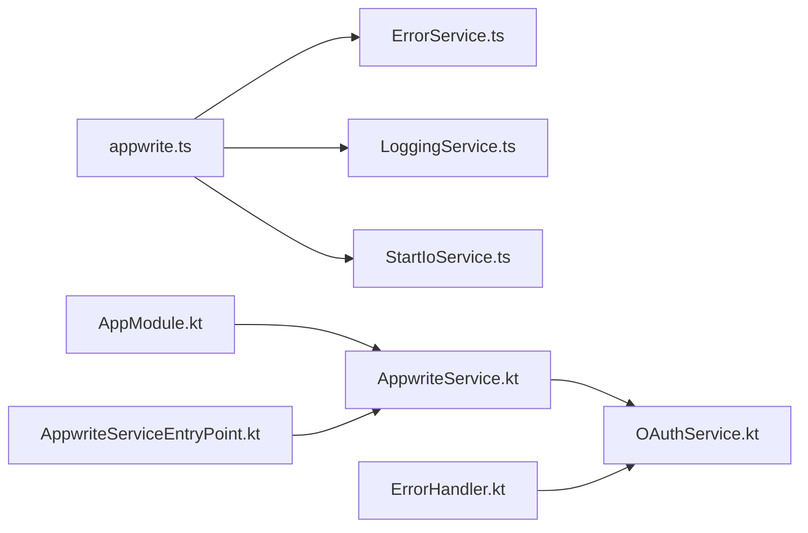

# API Abstraction Layer

<cite>
**Referenced Files in This Document**
- [appwrite.ts](file://mobileApp/src/config/appwrite.ts)
- [api.ts](file://mobileApp/src/config/api.ts)
- [ErrorService.ts](file://mobileApp/src/services/ErrorService.ts)
- [LoggingService.ts](file://mobileApp/src/services/LoggingService.ts)
- [StartIoService.ts](file://mobileApp/src/services/StartIoService.ts)
- [AppwriteService.kt](file://ktMobileApp/app/src/main/java/com/ekehi/network/service/AppwriteService.kt)
- [OAuthService.kt](file://ktMobileApp/app/src/main/java/com/ekehi/network/service/OAuthService.kt)
- [AppwriteServiceEntryPoint.kt](file://ktMobileApp/app/src/main/java/com/ekehi/network/di/AppwriteServiceEntryPoint.kt)
- [AppModule.kt](file://ktMobileApp/app/src/main/java/com/ekehi/network/di/AppModule.kt)
- [ErrorHandler.kt](file://ktMobileApp/app/src/main/java/com/ekehi/network/security/ErrorHandler.kt)
</cite>

## Table of Contents
1. [Introduction](#introduction)
2. [Project Structure](#project-structure)
3. [Core Components](#core-components)
4. [Architecture Overview](#architecture-overview)
5. [Detailed Component Analysis](#detailed-component-analysis)
6. [Dependency Analysis](#dependency-analysis)
7. [Performance Considerations](#performance-considerations)
8. [Troubleshooting Guide](#troubleshooting-guide)
9. [Conclusion](#conclusion)
10. [Appendices](#appendices)

## Introduction
This document describes the API abstraction layer and service architecture for the Ekehi Mobile project. It focuses on how the React Native frontend and Kotlin Android backend abstract Appwrite SDK calls, manage authentication, integrate external APIs, and implement robust error handling, logging, caching, and offline-aware workflows. It also covers dependency injection patterns, testing approaches, performance optimization, rate limiting, and graceful degradation strategies.

## Project Structure
The API abstraction layer spans two primary platforms:
- React Native mobile app: configuration, error/logging services, and optional third-party integrations.
- Android app: Dagger/Hilt-based dependency injection, Appwrite service abstractions, OAuth orchestration, and security utilities.

**Diagram sources**
- [appwrite.ts](file://mobileApp/src/config/appwrite.ts#L1-L51)
- [api.ts](file://mobileApp/src/config/api.ts#L1-L44)
- [ErrorService.ts](file://mobileApp/src/services/ErrorService.ts#L1-L120)
- [LoggingService.ts](file://mobileApp/src/services/LoggingService.ts#L1-L154)
- [StartIoService.ts](file://mobileApp/src/services/StartIoService.ts#L1-L261)
- [AppModule.kt](file://ktMobileApp/app/src/main/java/com/ekehi/network/di/AppModule.kt#L107-L248)
- [AppwriteServiceEntryPoint.kt](file://ktMobileApp/app/src/main/java/com/ekehi/network/di/AppwriteServiceEntryPoint.kt#L1-L12)
- [AppwriteService.kt](file://ktMobileApp/app/src/main/java/com/ekehi/network/service/AppwriteService.kt#L1-L43)
- [OAuthService.kt](file://ktMobileApp/app/src/main/java/com/ekehi/network/service/OAuthService.kt#L1-L111)
- [ErrorHandler.kt](file://ktMobileApp/app/src/main/java/com/ekehi/network/security/ErrorHandler.kt#L144-L176)

**Section sources**
- [appwrite.ts](file://mobileApp/src/config/appwrite.ts#L1-L51)
- [api.ts](file://mobileApp/src/config/api.ts#L1-L44)
- [AppModule.kt](file://ktMobileApp/app/src/main/java/com/ekehi/network/di/AppModule.kt#L107-L248)
- [AppwriteServiceEntryPoint.kt](file://ktMobileApp/app/src/main/java/com/ekehi/network/di/AppwriteServiceEntryPoint.kt#L1-L12)
- [AppwriteService.kt](file://ktMobileApp/app/src/main/java/com/ekehi/network/service/AppwriteService.kt#L1-L43)
- [OAuthService.kt](file://ktMobileApp/app/src/main/java/com/ekehi/network/service/OAuthService.kt#L1-L111)
- [ErrorHandler.kt](file://ktMobileApp/app/src/main/java/com/ekehi/network/security/ErrorHandler.kt#L144-L176)

## Core Components
- Appwrite configuration and client initialization for both environments.
- Error handling and logging services for unified diagnostics.
- External API integrations (e.g., Start.io rewarded/exit ads) with graceful fallbacks.
- Android dependency injection for Appwrite service, repositories, and OAuth orchestration.
- Security-focused error logging and event tracking.

Key responsibilities:
- Centralize Appwrite endpoints, project IDs, and collection IDs.
- Provide typed error categorization and user-friendly messages.
- Offer structured logging with filtering and export capabilities.
- Abstract OAuth flows and session management.
- Encapsulate external SDKs and platform-specific integrations.

**Section sources**
- [appwrite.ts](file://mobileApp/src/config/appwrite.ts#L1-L51)
- [api.ts](file://mobileApp/src/config/api.ts#L1-L44)
- [ErrorService.ts](file://mobileApp/src/services/ErrorService.ts#L1-L120)
- [LoggingService.ts](file://mobileApp/src/services/LoggingService.ts#L1-L154)
- [StartIoService.ts](file://mobileApp/src/services/StartIoService.ts#L1-L261)
- [AppwriteService.kt](file://ktMobileApp/app/src/main/java/com/ekehi/network/service/AppwriteService.kt#L1-L43)
- [OAuthService.kt](file://ktMobileApp/app/src/main/java/com/ekehi/network/service/OAuthService.kt#L1-L111)
- [ErrorHandler.kt](file://ktMobileApp/app/src/main/java/com/ekehi/network/security/ErrorHandler.kt#L144-L176)

## Architecture Overview
The architecture separates concerns across configuration, services, repositories, and platform-specific modules. The Android app uses Hilt for DI, while the React Native app centralizes configuration and service logic in TypeScript.

**Diagram sources**
- [appwrite.ts](file://mobileApp/src/config/appwrite.ts#L1-L51)
- [api.ts](file://mobileApp/src/config/api.ts#L1-L44)
- [ErrorService.ts](file://mobileApp/src/services/ErrorService.ts#L1-L120)
- [LoggingService.ts](file://mobileApp/src/services/LoggingService.ts#L1-L154)
- [StartIoService.ts](file://mobileApp/src/services/StartIoService.ts#L1-L261)
- [AppModule.kt](file://ktMobileApp/app/src/main/java/com/ekehi/network/di/AppModule.kt#L107-L248)
- [AppwriteServiceEntryPoint.kt](file://ktMobileApp/app/src/main/java/com/ekehi/network/di/AppwriteServiceEntryPoint.kt#L1-L12)
- [AppwriteService.kt](file://ktMobileApp/app/src/main/java/com/ekehi/network/service/AppwriteService.kt#L1-L43)
- [OAuthService.kt](file://ktMobileApp/app/src/main/java/com/ekehi/network/service/OAuthService.kt#L1-L111)
- [ErrorHandler.kt](file://ktMobileApp/app/src/main/java/com/ekehi/network/security/ErrorHandler.kt#L144-L176)

## Detailed Component Analysis

### Appwrite Configuration and Client Initialization
- React Native: Initializes Appwrite client with endpoint and project ID, exposes Account and Databases clients, and defines collection IDs and OAuth redirect URLs.
- Android: Provides a singleton Appwrite service exposing Account, Databases, and Storage clients, along with collection constants aligned with the React Native app.

**Diagram sources**
- [appwrite.ts](file://mobileApp/src/config/appwrite.ts#L1-L51)
- [AppwriteService.kt](file://ktMobileApp/app/src/main/java/com/ekehi/network/service/AppwriteService.kt#L1-L43)

**Section sources**
- [appwrite.ts](file://mobileApp/src/config/appwrite.ts#L1-L51)
- [AppwriteService.kt](file://ktMobileApp/app/src/main/java/com/ekehi/network/service/AppwriteService.kt#L1-L43)

### Error Handling Patterns
- Categorizes errors by type (network, auth, validation, server, unknown) and determines retryability.
- Provides user-friendly messages and logs technical details for debugging.
- Integrates with security logging for auth/data access events.

**Diagram sources**
- [ErrorService.ts](file://mobileApp/src/services/ErrorService.ts#L1-L120)
- [ErrorHandler.kt](file://ktMobileApp/app/src/main/java/com/ekehi/network/security/ErrorHandler.kt#L144-L176)

**Section sources**
- [ErrorService.ts](file://mobileApp/src/services/ErrorService.ts#L1-L120)
- [ErrorHandler.kt](file://ktMobileApp/app/src/main/java/com/ekehi/network/security/ErrorHandler.kt#L144-L176)

### Logging and Monitoring
- In-memory log buffer with configurable capacity and filtering by level/context.
- Exports logs and supports saving to file in a real app.
- Useful for debugging and monitoring service health.

**Diagram sources**
- [LoggingService.ts](file://mobileApp/src/services/LoggingService.ts#L1-L154)

**Section sources**
- [LoggingService.ts](file://mobileApp/src/services/LoggingService.ts#L1-L154)

### External API Integrations (Start.io)
- Android-only integration for rewarded and exit ads with safe native module access.
- Attempts to resolve native module by multiple names and falls back gracefully.
- Provides initialization, ad display, and availability checks.

**Diagram sources**
- [StartIoService.ts](file://mobileApp/src/services/StartIoService.ts#L1-L261)

**Section sources**
- [StartIoService.ts](file://mobileApp/src/services/StartIoService.ts#L1-L261)

### Android Dependency Injection and Service Composition
- Hilt entry point and module provide Appwrite service, repositories, and OAuth service singletons.
- Appwrite service encapsulates Appwrite clients and collection constants.
- OAuth service orchestrates Appwrite OAuth flow, session creation, and user profile provisioning.

**Diagram sources**
- [AppModule.kt](file://ktMobileApp/app/src/main/java/com/ekehi/network/di/AppModule.kt#L107-L248)
- [AppwriteServiceEntryPoint.kt](file://ktMobileApp/app/src/main/java/com/ekehi/network/di/AppwriteServiceEntryPoint.kt#L1-L12)
- [AppwriteService.kt](file://ktMobileApp/app/src/main/java/com/ekehi/network/service/AppwriteService.kt#L1-L43)
- [OAuthService.kt](file://ktMobileApp/app/src/main/java/com/ekehi/network/service/OAuthService.kt#L1-L111)

**Section sources**
- [AppModule.kt](file://ktMobileApp/app/src/main/java/com/ekehi/network/di/AppModule.kt#L107-L248)
- [AppwriteServiceEntryPoint.kt](file://ktMobileApp/app/src/main/java/com/ekehi/network/di/AppwriteServiceEntryPoint.kt#L1-L12)
- [AppwriteService.kt](file://ktMobileApp/app/src/main/java/com/ekehi/network/service/AppwriteService.kt#L1-L43)
- [OAuthService.kt](file://ktMobileApp/app/src/main/java/com/ekehi/network/service/OAuthService.kt#L1-L111)

### Security Logging and Event Tracking
- Dedicated error handler provides methods to log authentication and data access events.
- Supports audit trails for security-sensitive operations.

**Diagram sources**
- [ErrorHandler.kt](file://ktMobileApp/app/src/main/java/com/ekehi/network/security/ErrorHandler.kt#L144-L176)

**Section sources**
- [ErrorHandler.kt](file://ktMobileApp/app/src/main/java/com/ekehi/network/security/ErrorHandler.kt#L144-L176)

## Dependency Analysis
- React Native configuration depends on environment variables for endpoints and OAuth client IDs.
- Android DI module binds Appwrite client, service, repositories, and OAuth service.
- OAuth service depends on Appwrite service and user repository to finalize user onboarding after OAuth.

**Diagram sources**
- [appwrite.ts](file://mobileApp/src/config/appwrite.ts#L1-L51)
- [ErrorService.ts](file://mobileApp/src/services/ErrorService.ts#L1-L120)
- [LoggingService.ts](file://mobileApp/src/services/LoggingService.ts#L1-L154)
- [StartIoService.ts](file://mobileApp/src/services/StartIoService.ts#L1-L261)
- [AppModule.kt](file://ktMobileApp/app/src/main/java/com/ekehi/network/di/AppModule.kt#L107-L248)
- [AppwriteServiceEntryPoint.kt](file://ktMobileApp/app/src/main/java/com/ekehi/network/di/AppwriteServiceEntryPoint.kt#L1-L12)
- [AppwriteService.kt](file://ktMobileApp/app/src/main/java/com/ekehi/network/service/AppwriteService.kt#L1-L43)
- [OAuthService.kt](file://ktMobileApp/app/src/main/java/com/ekehi/network/service/OAuthService.kt#L1-L111)
- [ErrorHandler.kt](file://ktMobileApp/app/src/main/java/com/ekehi/network/security/ErrorHandler.kt#L144-L176)

**Section sources**
- [appwrite.ts](file://mobileApp/src/config/appwrite.ts#L1-L51)
- [AppModule.kt](file://ktMobileApp/app/src/main/java/com/ekehi/network/di/AppModule.kt#L107-L248)
- [OAuthService.kt](file://ktMobileApp/app/src/main/java/com/ekehi/network/service/OAuthService.kt#L1-L111)

## Performance Considerations
- Centralized configuration reduces duplication and improves maintainability.
- Logging buffer limits prevent excessive memory usage; consider exporting logs periodically for production.
- External SDKs should be initialized lazily and guarded by availability checks to avoid blocking startup.
- Use retryable error classification to implement exponential backoff for transient failures.
- Cache frequently accessed data locally and invalidate on Appwrite updates to minimize network calls.

[No sources needed since this section provides general guidance]

## Troubleshooting Guide
Common issues and resolutions:
- Appwrite connectivity: Verify endpoint and project ID in configuration; confirm environment variables are set.
- OAuth flow: Ensure success and failure redirect URLs match Appwrite OAuth settings; clear existing sessions before initiating OAuth.
- External SDKs: Confirm native module availability; check platform support and initialization logs.
- Logging: Enable/disable logging and export logs for analysis; filter by level/context for targeted debugging.

**Section sources**
- [appwrite.ts](file://mobileApp/src/config/appwrite.ts#L1-L51)
- [OAuthService.kt](file://ktMobileApp/app/src/main/java/com/ekehi/network/service/OAuthService.kt#L1-L111)
- [StartIoService.ts](file://mobileApp/src/services/StartIoService.ts#L1-L261)
- [LoggingService.ts](file://mobileApp/src/services/LoggingService.ts#L1-L154)

## Conclusion
The API abstraction layer combines centralized configuration, robust error handling, and platform-specific integrations to deliver a reliable and maintainable service architecture. The Android app leverages Hilt for clean dependency injection, while the React Native app consolidates configuration and service logic. Together, these components support graceful degradation, performance optimization, and strong observability.

[No sources needed since this section summarizes without analyzing specific files]

## Appendices

### Practical Examples and Testing Approaches
- Service composition: Compose repositories and services via DI entry points to isolate Appwrite dependencies.
- Testing: Mock Appwrite service and OAuth service in unit tests; assert error handling paths and logging behavior.
- Environment-driven configuration: Use environment variables for endpoints and OAuth client IDs; validate at startup.

**Section sources**
- [AppwriteServiceEntryPoint.kt](file://ktMobileApp/app/src/main/java/com/ekehi/network/di/AppwriteServiceEntryPoint.kt#L1-L12)
- [AppwriteService.kt](file://ktMobileApp/app/src/main/java/com/ekehi/network/service/AppwriteService.kt#L1-L43)
- [OAuthService.kt](file://ktMobileApp/app/src/main/java/com/ekehi/network/service/OAuthService.kt#L1-L111)
- [ErrorService.ts](file://mobileApp/src/services/ErrorService.ts#L1-L120)
- [LoggingService.ts](file://mobileApp/src/services/LoggingService.ts#L1-L154)