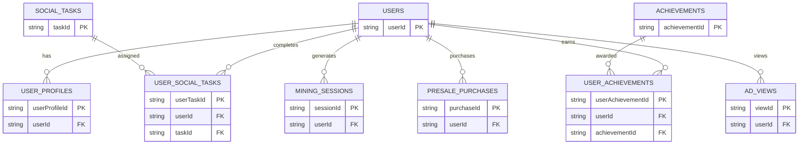

# Appwrite Configuration

<cite>
**Referenced Files in This Document**
- [mobileApp/src/config/appwrite.ts](file://mobileApp/src/config/appwrite.ts)
- [admin/lib/appwrite.ts](file://admin/lib/appwrite.ts)
- [mobileApp/src/config/api.ts](file://mobileApp/src/config/api.ts)
- [admin/src/config/api.ts](file://admin/src/config/api.ts)
- [mobileApp/.env.example](file://mobileApp/.env.example)
- [admin/.env.example](file://admin/.env.example)
- [mobileApp/Documentations/APPWRITE_OAUTH_CONFIGURATION.md](file://mobileApp/Documentations/APPWRITE_OAUTH_CONFIGURATION.md)
- [mobileApp/Documentations/MOBILE_OAUTH_SETUP.md](file://mobileApp/Documentations/MOBILE_OAUTH_SETUP.md)
- [mobileApp/Documentations/HOSTED_OAUTH_SETUP.md](file://mobileApp/Documentations/HOSTED_OAUTH_SETUP.md)
- [mobileApp/Documentations/COLLECTION_ID_TEMPLATE.md](file://mobileApp/Documentations/COLLECTION_ID_TEMPLATE.md)
- [mobileApp/src/services/ErrorService.ts](file://mobileApp/src/services/ErrorService.ts)
- [mobileApp/src/utils/validation.ts](file://mobileApp/src/utils/validation.ts)
- [ktMobileApp/app/src/main/java/com/ekehi/network/security/SecurePreferences.kt](file://ktMobileApp/app/src/main/java/com/ekehi/network/security/SecurePreferences.kt)
- [ktMobileApp/app/src/main/java/com/ekehi/network/security/SecurityConfig.kt](file://ktMobileApp/app/src/main/java/com/ekehi/network/security/SecurityConfig.kt)
- [mobileApp/Scripts/test-appwrite-connection.js](file://mobileApp/Scripts/test-appwrite-connection.js)
</cite>

## Table of Contents
1. [Introduction](#introduction)
2. [Project Structure](#project-structure)
3. [Core Components](#core-components)
4. [Architecture Overview](#architecture-overview)
5. [Detailed Component Analysis](#detailed-component-analysis)
6. [Dependency Analysis](#dependency-analysis)
7. [Performance Considerations](#performance-considerations)
8. [Troubleshooting Guide](#troubleshooting-guide)
9. [Conclusion](#conclusion)
10. [Appendices](#appendices)

## Introduction
This document explains how Appwrite is configured and initialized across the project’s frontend (React Native), backend/admin (Next.js), and Android app. It covers client initialization, endpoint and project ID configuration, environment variables for different environments, OAuth setup for Google and native Appwrite providers, collection ID mapping, and security considerations for client-side configuration. Practical examples demonstrate configuration loading, environment-specific overrides, and error handling for missing credentials.

## Project Structure
The configuration spans three primary areas:
- Frontend (React Native mobile app): centralized Appwrite configuration and OAuth settings
- Admin dashboard (Next.js): server-side Appwrite client with API key and collection mapping
- Android app: security-related configuration and secure preferences for sensitive data

**Diagram sources**
- [mobileApp/src/config/appwrite.ts](file://mobileApp/src/config/appwrite.ts#L1-L51)
- [admin/lib/appwrite.ts](file://admin/lib/appwrite.ts#L1-L33)
- [admin/src/config/api.ts](file://admin/src/config/api.ts#L1-L35)
- [mobileApp/.env.example](file://mobileApp/.env.example#L1-L18)
- [admin/.env.example](file://admin/.env.example#L1-L16)
- [mobileApp/Documentations/APPWRITE_OAUTH_CONFIGURATION.md](file://mobileApp/Documentations/APPWRITE_OAUTH_CONFIGURATION.md#L1-L84)
- [mobileApp/Documentations/MOBILE_OAUTH_SETUP.md](file://mobileApp/Documentations/MOBILE_OAUTH_SETUP.md#L1-L108)
- [mobileApp/Documentations/HOSTED_OAUTH_SETUP.md](file://mobileApp/Documentations/HOSTED_OAUTH_SETUP.md#L1-L107)
- [mobileApp/Documentations/COLLECTION_ID_TEMPLATE.md](file://mobileApp/Documentations/COLLECTION_ID_TEMPLATE.md#L1-L40)
- [ktMobileApp/app/src/main/java/com/ekehi/network/security/SecurePreferences.kt](file://ktMobileApp/app/src/main/java/com/ekehi/network/security/SecurePreferences.kt#L1-L132)
- [ktMobileApp/app/src/main/java/com/ekehi/network/security/SecurityConfig.kt](file://ktMobileApp/app/src/main/java/com/ekehi/network/security/SecurityConfig.kt#L1-L152)

**Section sources**
- [mobileApp/src/config/appwrite.ts](file://mobileApp/src/config/appwrite.ts#L1-L51)
- [admin/lib/appwrite.ts](file://admin/lib/appwrite.ts#L1-L33)
- [admin/src/config/api.ts](file://admin/src/config/api.ts#L1-L35)
- [mobileApp/.env.example](file://mobileApp/.env.example#L1-L18)
- [admin/.env.example](file://admin/.env.example#L1-L16)

## Core Components
- Mobile App Appwrite configuration: initializes the Appwrite Client with endpoint and project ID, exposes Account and Databases SDK instances, defines collection IDs, and sets OAuth client IDs and redirect URLs via environment variables with sensible defaults.
- Admin Appwrite configuration: constructs a server-side client with endpoint and project ID, conditionally sets an API key, and mirrors collection IDs from the mobile app configuration.
- API configuration: provides a hybrid approach where Appwrite handles authentication and database operations, while other services rely on external APIs.
- Environment variables: define runtime overrides for endpoints, project IDs, database IDs, collection IDs, and OAuth client IDs. Examples are provided in .env.example files.
- OAuth documentation: explains platform configuration for Flutter/React Native and Web, Google provider setup, and redirect URL requirements.

**Section sources**
- [mobileApp/src/config/appwrite.ts](file://mobileApp/src/config/appwrite.ts#L1-L51)
- [admin/lib/appwrite.ts](file://admin/lib/appwrite.ts#L1-L33)
- [mobileApp/src/config/api.ts](file://mobileApp/src/config/api.ts#L1-L44)
- [admin/src/config/api.ts](file://admin/src/config/api.ts#L1-L35)
- [mobileApp/.env.example](file://mobileApp/.env.example#L1-L18)
- [admin/.env.example](file://admin/.env.example#L1-L16)
- [mobileApp/Documentations/APPWRITE_OAUTH_CONFIGURATION.md](file://mobileApp/Documentations/APPWRITE_OAUTH_CONFIGURATION.md#L1-L84)

## Architecture Overview
The system uses a centralized Appwrite instance accessed by:
- Mobile app: client SDK with environment-driven configuration and OAuth
- Admin dashboard: server SDK with API key and shared collection mapping
- Android app: secure storage and security configuration for sensitive data

**Diagram sources**
- [mobileApp/src/config/appwrite.ts](file://mobileApp/src/config/appwrite.ts#L1-L51)
- [admin/lib/appwrite.ts](file://admin/lib/appwrite.ts#L1-L33)
- [admin/src/config/api.ts](file://admin/src/config/api.ts#L1-L35)

## Detailed Component Analysis

### Mobile App Appwrite Configuration
- Client initialization: sets endpoint and project ID, then exports Account and Databases SDK instances.
- Environment overrides: reads from public environment variables with built-in defaults for development.
- Database and collections: defines database ID and a collections object with keys mapped to collection identifiers.
- OAuth configuration: includes Google web, Android, and iOS client IDs, plus success/failure redirect URLs.

**Diagram sources**
- [mobileApp/src/config/appwrite.ts](file://mobileApp/src/config/appwrite.ts#L1-L51)

**Section sources**
- [mobileApp/src/config/appwrite.ts](file://mobileApp/src/config/appwrite.ts#L1-L51)
- [mobileApp/.env.example](file://mobileApp/.env.example#L1-L18)

### Admin Appwrite Configuration
- Server-side client: constructs a Client with endpoint and project ID.
- API key: conditionally sets an API key when present.
- Collections mapping: mirrors collection IDs from the API configuration module.

**Diagram sources**
- [admin/lib/appwrite.ts](file://admin/lib/appwrite.ts#L1-L33)
- [admin/.env.example](file://admin/.env.example#L1-L16)

**Section sources**
- [admin/lib/appwrite.ts](file://admin/lib/appwrite.ts#L1-L33)
- [admin/src/config/api.ts](file://admin/src/config/api.ts#L1-L35)
- [admin/.env.example](file://admin/.env.example#L1-L16)

### API Configuration (Hybrid Approach)
- Appwrite configuration: endpoint, project ID, and database ID are defined.
- External blockchain API: includes base URL, API key placeholder, chain ID, and token contract address.
- Collections mapping: mirrors the collection IDs used by the mobile app.

**Diagram sources**
- [mobileApp/src/config/api.ts](file://mobileApp/src/config/api.ts#L1-L44)

**Section sources**
- [mobileApp/src/config/api.ts](file://mobileApp/src/config/api.ts#L1-L44)

### OAuth Configuration and Redirect URLs
- Platform configuration: Flutter/React Native and Web platforms must be registered in Appwrite with correct redirect URLs.
- Google provider: enabled with client credentials; hosted OAuth requires Web platform and matching redirect URIs.
- Redirect URLs: success and failure deep links are configurable via environment variables.

**Diagram sources**
- [mobileApp/Documentations/APPWRITE_OAUTH_CONFIGURATION.md](file://mobileApp/Documentations/APPWRITE_OAUTH_CONFIGURATION.md#L1-L84)
- [mobileApp/Documentations/MOBILE_OAUTH_SETUP.md](file://mobileApp/Documentations/MOBILE_OAUTH_SETUP.md#L1-L108)
- [mobileApp/Documentations/HOSTED_OAUTH_SETUP.md](file://mobileApp/Documentations/HOSTED_OAUTH_SETUP.md#L1-L107)

**Section sources**
- [mobileApp/Documentations/APPWRITE_OAUTH_CONFIGURATION.md](file://mobileApp/Documentations/APPWRITE_OAUTH_CONFIGURATION.md#L1-L84)
- [mobileApp/Documentations/MOBILE_OAUTH_SETUP.md](file://mobileApp/Documentations/MOBILE_OAUTH_SETUP.md#L1-L108)
- [mobileApp/Documentations/HOSTED_OAUTH_SETUP.md](file://mobileApp/Documentations/HOSTED_OAUTH_SETUP.md#L1-L107)
- [mobileApp/src/config/appwrite.ts](file://mobileApp/src/config/appwrite.ts#L1-L51)

### Collection ID Mapping and Schema Relationships
- Mapping template: collection IDs are defined centrally and should be updated after creating collections in the Appwrite console.
- Relationship overview: users and profiles, mining sessions, social tasks, user-social tasks, achievements, purchases, and ad views form the core schema.

**Diagram sources**
- [mobileApp/Documentations/COLLECTION_ID_TEMPLATE.md](file://mobileApp/Documentations/COLLECTION_ID_TEMPLATE.md#L1-L40)
- [mobileApp/src/config/appwrite.ts](file://mobileApp/src/config/appwrite.ts#L1-L51)
- [admin/src/config/api.ts](file://admin/src/config/api.ts#L1-L35)

**Section sources**
- [mobileApp/Documentations/COLLECTION_ID_TEMPLATE.md](file://mobileApp/Documentations/COLLECTION_ID_TEMPLATE.md#L1-L40)
- [mobileApp/src/config/appwrite.ts](file://mobileApp/src/config/appwrite.ts#L1-L51)
- [admin/src/config/api.ts](file://admin/src/config/api.ts#L1-L35)

### Environment Variable System and Overrides
- Mobile app: uses public environment variables with defaults for endpoint, project ID, database ID, collection IDs, and Google OAuth client IDs.
- Admin dashboard: uses private environment variables with defaults for endpoint, project ID, API key, database ID, and collection IDs.
- Example templates: .env.example files provide placeholders and default values for easy setup.

**Diagram sources**
- [mobileApp/.env.example](file://mobileApp/.env.example#L1-L18)
- [admin/.env.example](file://admin/.env.example#L1-L16)
- [mobileApp/src/config/appwrite.ts](file://mobileApp/src/config/appwrite.ts#L1-L51)
- [admin/src/config/api.ts](file://admin/src/config/api.ts#L1-L35)

**Section sources**
- [mobileApp/.env.example](file://mobileApp/.env.example#L1-L18)
- [admin/.env.example](file://admin/.env.example#L1-L16)
- [mobileApp/src/config/appwrite.ts](file://mobileApp/src/config/appwrite.ts#L1-L51)
- [admin/src/config/api.ts](file://admin/src/config/api.ts#L1-L35)

### Security Considerations and Best Practices
- Client-side configuration: keep OAuth client secrets on the server or in secure backend services; avoid embedding secrets in client apps.
- Sensitive data storage: Android app uses encrypted shared preferences for secure storage of tokens and sensitive settings.
- Network security: enforce TLS, consider certificate pinning, and apply strict security headers where applicable.
- Validation: validate inputs on the client and server to prevent injection and malformed requests.

**Diagram sources**
- [ktMobileApp/app/src/main/java/com/ekehi/network/security/SecurePreferences.kt](file://ktMobileApp/app/src/main/java/com/ekehi/network/security/SecurePreferences.kt#L1-L132)
- [ktMobileApp/app/src/main/java/com/ekehi/network/security/SecurityConfig.kt](file://ktMobileApp/app/src/main/java/com/ekehi/network/security/SecurityConfig.kt#L1-L152)
- [mobileApp/src/utils/validation.ts](file://mobileApp/src/utils/validation.ts#L1-L32)

**Section sources**
- [ktMobileApp/app/src/main/java/com/ekehi/network/security/SecurePreferences.kt](file://ktMobileApp/app/src/main/java/com/ekehi/network/security/SecurePreferences.kt#L1-L132)
- [ktMobileApp/app/src/main/java/com/ekehi/network/security/SecurityConfig.kt](file://ktMobileApp/app/src/main/java/com/ekehi/network/security/SecurityConfig.kt#L1-L152)
- [mobileApp/src/utils/validation.ts](file://mobileApp/src/utils/validation.ts#L1-L32)

## Dependency Analysis
- Mobile app depends on environment variables and the Appwrite SDK to initialize the client and expose services.
- Admin dashboard depends on environment variables and the server SDK, optionally using an API key for privileged operations.
- Both sides share collection ID mappings to maintain consistency across the stack.

**Diagram sources**
- [mobileApp/src/config/appwrite.ts](file://mobileApp/src/config/appwrite.ts#L1-L51)
- [admin/lib/appwrite.ts](file://admin/lib/appwrite.ts#L1-L33)
- [admin/src/config/api.ts](file://admin/src/config/api.ts#L1-L35)

**Section sources**
- [mobileApp/src/config/appwrite.ts](file://mobileApp/src/config/appwrite.ts#L1-L51)
- [admin/lib/appwrite.ts](file://admin/lib/appwrite.ts#L1-L33)
- [admin/src/config/api.ts](file://admin/src/config/api.ts#L1-L35)

## Performance Considerations
- Prefer environment-driven configuration to minimize recompiles and support hot switching across environments.
- Centralize collection ID mapping to reduce duplication and improve maintainability.
- Use server-side SDK with API keys for heavy operations to offload processing and reduce client overhead.

## Troubleshooting Guide
- Missing credentials or incorrect values:
  - Verify environment variables in .env.example and ensure they are loaded at runtime.
  - Use the provided test script to validate connectivity and session state.
- OAuth “Invalid URL” errors:
  - Confirm platform registrations in Appwrite Console for Flutter/React Native and Web.
  - Ensure redirect URLs match exactly what the app expects and what is configured in Google Cloud Console.
- Deep link handling:
  - Validate deep link configuration and ensure the hosted OAuth system redirects with the correct parameters.
- Error handling:
  - Use the error service to categorize and display user-friendly messages for network, auth, validation, and server errors.

**Section sources**
- [mobileApp/Scripts/test-appwrite-connection.js](file://mobileApp/Scripts/test-appwrite-connection.js#L1-L22)
- [mobileApp/Documentations/APPWRITE_OAUTH_CONFIGURATION.md](file://mobileApp/Documentations/APPWRITE_OAUTH_CONFIGURATION.md#L1-L84)
- [mobileApp/src/services/ErrorService.ts](file://mobileApp/src/services/ErrorService.ts#L1-L120)

## Conclusion
The project employs a clean separation of concerns: the mobile app initializes Appwrite with environment-driven configuration and handles OAuth and database operations client-side, while the admin dashboard uses a server-side client with optional API key for privileged actions. Collection IDs are centrally managed to ensure consistency across the stack. Robust OAuth configuration and environment variable handling enable smooth operation across development, staging, and production environments. Security best practices, including encrypted storage and input validation, protect sensitive data and improve resilience.

## Appendices
- Practical examples:
  - Environment-specific overrides: adjust environment variables per deployment stage to change endpoint, project ID, and OAuth client IDs.
  - OAuth setup: follow the documented steps to register platforms and providers in Appwrite and Google Cloud Console.
  - Collection ID updates: after creating collections, update the mapping template and confirm IDs in the Appwrite console.

**Section sources**
- [mobileApp/.env.example](file://mobileApp/.env.example#L1-L18)
- [admin/.env.example](file://admin/.env.example#L1-L16)
- [mobileApp/Documentations/APPWRITE_OAUTH_CONFIGURATION.md](file://mobileApp/Documentations/APPWRITE_OAUTH_CONFIGURATION.md#L1-L84)
- [mobileApp/Documentations/COLLECTION_ID_TEMPLATE.md](file://mobileApp/Documentations/COLLECTION_ID_TEMPLATE.md#L1-L40)