# Authentication and Security

<cite>
**Referenced Files in This Document**
- [AuthContext.tsx](file://mobileApp/src/contexts/AuthContext.tsx)
- [OAuthCallback.tsx](file://LandPage/src/react-app/pages/OAuthCallback.tsx)
- [OAuthRedirect.tsx](file://LandPage/src/react-app/pages/OAuthRedirect.tsx)
- [OAuthService.kt](file://ktMobileApp/app/src/main/java/com/ekehi/network/service/OAuthService.kt)
- [SocialAuthManager.kt](file://ktMobileApp/app/src/main/java/com/ekehi/network/auth/SocialAuthManager.kt)
- [AuthManager.kt](file://ktMobileApp/app/src/main/java/com/ekehi/network/security/AuthManager.kt)
- [SessionManager.kt](file://ktMobileApp/app/src/main/java/com/ekehi/network/security/SessionManager.kt)
- [CryptoManager.kt](file://ktMobileApp/app/src/main/java/com/ekehi/network/security/CryptoManager.kt)
- [SecurePreferences.kt](file://ktMobileApp/app/src/main/java/com/ekehi/network/security/SecurePreferences.kt)
- [InputValidator.kt](file://ktMobileApp/app/src/main/java/com/ekehi/network/security/InputValidator.kt)
- [OutputEncoder.kt](file://ktMobileApp/app/src/main/java/com/ekehi/network/security/OutputEncoder.kt)
- [MaliciousCodeProtection.kt](file://ktMobileApp/app/src/main/java/com/ekehi/network/security/MaliciousCodeProtection.kt)
- [SecurityLogger.kt](file://ktMobileApp/app/src/main/java/com/ekehi/network/security/SecurityLogger.kt)
- [SecurityMonitor.kt](file://ktMobileApp/app/src/main/java/com/ekehi/network/security/SecurityMonitor.kt)
- [AccessControlManager.kt](file://ktMobileApp/app/src/main/java/com/ekehi/network/security/AccessControlManager.kt)
- [SecurityConfig.kt](file://ktMobileApp/app/src/main/java/com/ekehi/network/security/SecurityConfig.kt)
- [SecurityInterceptor.kt](file://ktMobileApp/app/src/main/java/com/ekehi/network/security/SecurityInterceptor.kt)
- [network_security_config.xml](file://ktMobileApp/app/src/main/res/xml/network_security_config.xml)
</cite>

## Table of Contents
1. [Introduction](#introduction)
2. [Project Structure](#project-structure)
3. [Core Components](#core-components)
4. [Architecture Overview](#architecture-overview)
5. [Detailed Component Analysis](#detailed-component-analysis)
6. [Dependency Analysis](#dependency-analysis)
7. [Performance Considerations](#performance-considerations)
8. [Troubleshooting Guide](#troubleshooting-guide)
9. [Conclusion](#conclusion)
10. [Appendices](#appendices)

## Introduction
This document provides a comprehensive guide to the authentication and security implementation across the ekehi-mobile project. It covers OAuth flows for Google, Facebook, and Appwrite’s native authentication, session and token lifecycle management, input validation and output encoding, malicious code protection, secure preferences, encryption, and security monitoring. It also includes practical examples for secure credential storage, encryption implementations, and security monitoring, along with mitigation strategies for common vulnerabilities and compliance considerations for mobile applications.

## Project Structure
The authentication and security logic spans three primary areas:
- React Native front-end authentication context and OAuth redirection handling
- Android Kotlin security utilities and OAuth service integrations
- Shared security policies, configuration, and monitoring

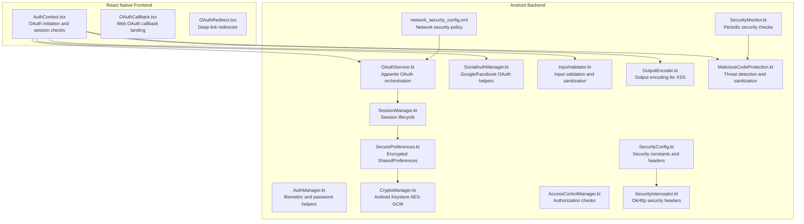

**Diagram sources**
- [AuthContext.tsx](file://mobileApp/src/contexts/AuthContext.tsx#L1-L724)
- [OAuthCallback.tsx](file://LandPage/src/react-app/pages/OAuthCallback.tsx#L1-L107)
- [OAuthRedirect.tsx](file://LandPage/src/react-app/pages/OAuthRedirect.tsx#L1-L32)
- [OAuthService.kt](file://ktMobileApp/app/src/main/java/com/ekehi/network/service/OAuthService.kt#L1-L111)
- [SocialAuthManager.kt](file://ktMobileApp/app/src/main/java/com/ekehi/network/auth/SocialAuthManager.kt#L1-L324)
- [AuthManager.kt](file://ktMobileApp/app/src/main/java/com/ekehi/network/security/AuthManager.kt#L1-L190)
- [SessionManager.kt](file://ktMobileApp/app/src/main/java/com/ekehi/network/security/SessionManager.kt#L1-L124)
- [SecurePreferences.kt](file://ktMobileApp/app/src/main/java/com/ekehi/network/security/SecurePreferences.kt#L1-L132)
- [CryptoManager.kt](file://ktMobileApp/app/src/main/java/com/ekehi/network/security/CryptoManager.kt#L1-L115)
- [InputValidator.kt](file://ktMobileApp/app/src/main/java/com/ekehi/network/security/InputValidator.kt#L1-L146)
- [OutputEncoder.kt](file://ktMobileApp/app/src/main/java/com/ekehi/network/security/OutputEncoder.kt#L1-L142)
- [MaliciousCodeProtection.kt](file://ktMobileApp/app/src/main/java/com/ekehi/network/security/MaliciousCodeProtection.kt#L1-L332)
- [SecurityMonitor.kt](file://ktMobileApp/app/src/main/java/com/ekehi/network/security/SecurityMonitor.kt#L1-L222)
- [AccessControlManager.kt](file://ktMobileApp/app/src/main/java/com/ekehi/network/security/AccessControlManager.kt#L1-L148)
- [SecurityConfig.kt](file://ktMobileApp/app/src/main/java/com/ekehi/network/security/SecurityConfig.kt#L1-L152)
- [SecurityInterceptor.kt](file://ktMobileApp/app/src/main/java/com/ekehi/network/security/SecurityInterceptor.kt#L1-L77)
- [network_security_config.xml](file://ktMobileApp/app/src/main/res/xml/network_security_config.xml#L1-L15)

**Section sources**
- [AuthContext.tsx](file://mobileApp/src/contexts/AuthContext.tsx#L1-L724)
- [OAuthService.kt](file://ktMobileApp/app/src/main/java/com/ekehi/network/service/OAuthService.kt#L1-L111)

## Core Components
- Authentication context and OAuth orchestration in React Native
- OAuth service and social auth manager in Android
- Session management and secure preferences
- Encryption and secure storage
- Input validation and output encoding
- Malicious code protection and security monitoring
- Access control and security configuration

**Section sources**
- [AuthContext.tsx](file://mobileApp/src/contexts/AuthContext.tsx#L1-L724)
- [OAuthService.kt](file://ktMobileApp/app/src/main/java/com/ekehi/network/service/OAuthService.kt#L1-L111)
- [SocialAuthManager.kt](file://ktMobileApp/app/src/main/java/com/ekehi/network/auth/SocialAuthManager.kt#L1-L324)
- [SessionManager.kt](file://ktMobileApp/app/src/main/java/com/ekehi/network/security/SessionManager.kt#L1-L124)
- [SecurePreferences.kt](file://ktMobileApp/app/src/main/java/com/ekehi/network/security/SecurePreferences.kt#L1-L132)
- [CryptoManager.kt](file://ktMobileApp/app/src/main/java/com/ekehi/network/security/CryptoManager.kt#L1-L115)
- [InputValidator.kt](file://ktMobileApp/app/src/main/java/com/ekehi/network/security/InputValidator.kt#L1-L146)
- [OutputEncoder.kt](file://ktMobileApp/app/src/main/java/com/ekehi/network/security/OutputEncoder.kt#L1-L142)
- [MaliciousCodeProtection.kt](file://ktMobileApp/app/src/main/java/com/ekehi/network/security/MaliciousCodeProtection.kt#L1-L332)
- [SecurityMonitor.kt](file://ktMobileApp/app/src/main/java/com/ekehi/network/security/SecurityMonitor.kt#L1-L222)
- [AccessControlManager.kt](file://ktMobileApp/app/src/main/java/com/ekehi/network/security/AccessControlManager.kt#L1-L148)
- [SecurityConfig.kt](file://ktMobileApp/app/src/main/java/com/ekehi/network/security/SecurityConfig.kt#L1-L152)
- [SecurityInterceptor.kt](file://ktMobileApp/app/src/main/java/com/ekehi/network/security/SecurityInterceptor.kt#L1-L77)
- [network_security_config.xml](file://ktMobileApp/app/src/main/res/xml/network_security_config.xml#L1-L15)

## Architecture Overview
The authentication flow integrates React Native and Android components with Appwrite for OAuth and session management. The React Native layer initiates OAuth, handles redirects, and maintains authentication state. The Android layer coordinates OAuth providers, manages sessions, and enforces security policies.

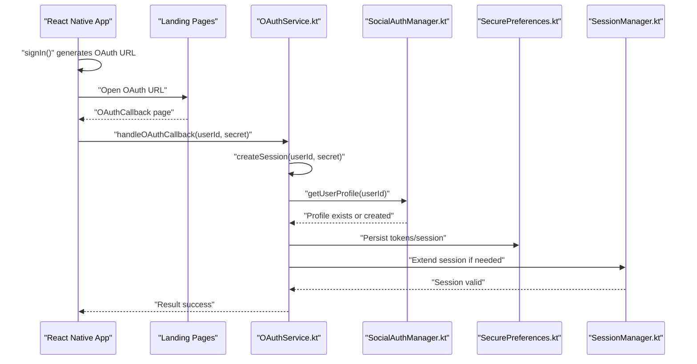

**Diagram sources**
- [AuthContext.tsx](file://mobileApp/src/contexts/AuthContext.tsx#L442-L564)
- [OAuthCallback.tsx](file://LandPage/src/react-app/pages/OAuthCallback.tsx#L1-L107)
- [OAuthService.kt](file://ktMobileApp/app/src/main/java/com/ekehi/network/service/OAuthService.kt#L60-L111)
- [SocialAuthManager.kt](file://ktMobileApp/app/src/main/java/com/ekehi/network/auth/SocialAuthManager.kt#L1-L324)
- [SecurePreferences.kt](file://ktMobileApp/app/src/main/java/com/ekehi/network/security/SecurePreferences.kt#L1-L132)
- [SessionManager.kt](file://ktMobileApp/app/src/main/java/com/ekehi/network/security/SessionManager.kt#L1-L124)

## Detailed Component Analysis

### React Native Authentication Context
- Initializes and manages authentication state
- Initiates OAuth with Google via Appwrite
- Handles email/password sessions
- Manages user profile creation and updates
- Implements retry and timeout logic for robustness

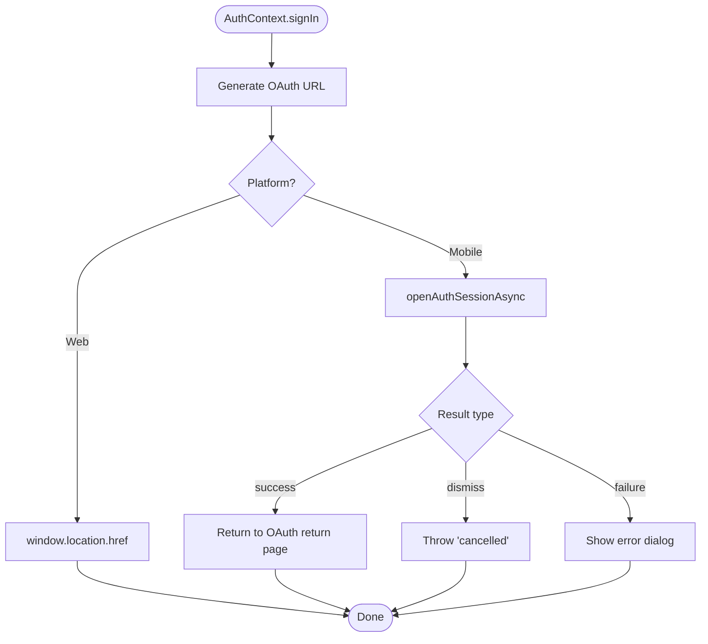

**Diagram sources**
- [AuthContext.tsx](file://mobileApp/src/contexts/AuthContext.tsx#L442-L564)

**Section sources**
- [AuthContext.tsx](file://mobileApp/src/contexts/AuthContext.tsx#L1-L724)

### OAuth Callback and Redirect Handling
- Web OAuth callback page parses parameters and attempts to deep link back to the mobile app
- Redirect page constructs a deep link with query parameters and forwards the user

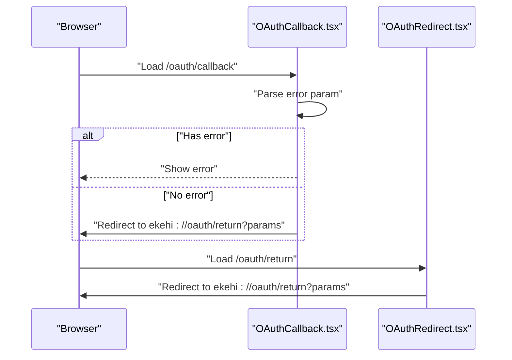

**Diagram sources**
- [OAuthCallback.tsx](file://LandPage/src/react-app/pages/OAuthCallback.tsx#L1-L107)
- [OAuthRedirect.tsx](file://LandPage/src/react-app/pages/OAuthRedirect.tsx#L1-L32)

**Section sources**
- [OAuthCallback.tsx](file://LandPage/src/react-app/pages/OAuthCallback.tsx#L1-L107)
- [OAuthRedirect.tsx](file://LandPage/src/react-app/pages/OAuthRedirect.tsx#L1-L32)

### Android OAuth Service and Social Auth Manager
- Orchestrates Appwrite OAuth with Google, deletes existing sessions before initiating, and creates sessions upon callback
- Coordinates Google and Facebook OAuth flows, including YouTube scope handling and permission checks

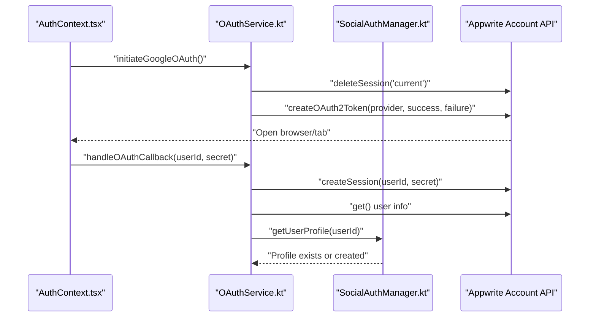

**Diagram sources**
- [OAuthService.kt](file://ktMobileApp/app/src/main/java/com/ekehi/network/service/OAuthService.kt#L31-L111)
- [SocialAuthManager.kt](file://ktMobileApp/app/src/main/java/com/ekehi/network/auth/SocialAuthManager.kt#L1-L324)

**Section sources**
- [OAuthService.kt](file://ktMobileApp/app/src/main/java/com/ekehi/network/service/OAuthService.kt#L1-L111)
- [SocialAuthManager.kt](file://ktMobileApp/app/src/main/java/com/ekehi/network/auth/SocialAuthManager.kt#L1-L324)

### Session Management and Token Handling
- Creates and validates sessions with expiration and regeneration
- Persists session identifiers and expiry in secure preferences
- Uses cryptographic randomness for session IDs

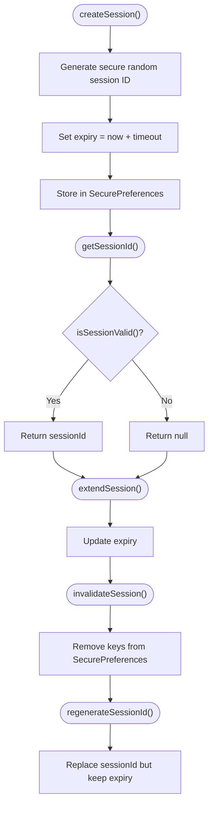

**Diagram sources**
- [SessionManager.kt](file://ktMobileApp/app/src/main/java/com/ekehi/network/security/SessionManager.kt#L1-L124)
- [SecurePreferences.kt](file://ktMobileApp/app/src/main/java/com/ekehi/network/security/SecurePreferences.kt#L1-L132)

**Section sources**
- [SessionManager.kt](file://ktMobileApp/app/src/main/java/com/ekehi/network/security/SessionManager.kt#L1-L124)
- [SecurePreferences.kt](file://ktMobileApp/app/src/main/java/com/ekehi/network/security/SecurePreferences.kt#L1-L132)

### Secure Preferences and Encryption
- Uses EncryptedSharedPreferences with AES256_SIV/AES256_GCM for secure storage
- Uses Android Keystore with AES-GCM for encryption/decryption of sensitive data

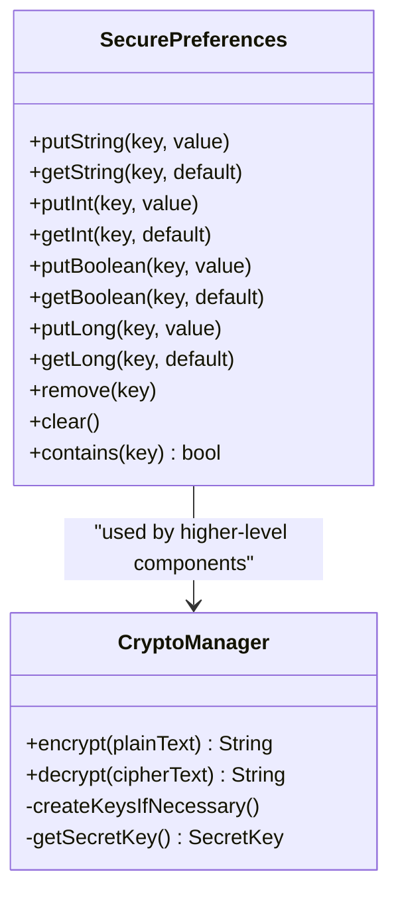

**Diagram sources**
- [SecurePreferences.kt](file://ktMobileApp/app/src/main/java/com/ekehi/network/security/SecurePreferences.kt#L1-L132)
- [CryptoManager.kt](file://ktMobileApp/app/src/main/java/com/ekehi/network/security/CryptoManager.kt#L1-L115)

**Section sources**
- [SecurePreferences.kt](file://ktMobileApp/app/src/main/java/com/ekehi/network/security/SecurePreferences.kt#L1-L132)
- [CryptoManager.kt](file://ktMobileApp/app/src/main/java/com/ekehi/network/security/CryptoManager.kt#L1-L115)

### Input Validation and Output Encoding
- Centralized input validator with patterns for emails, usernames, passwords, and names
- Output encoder for HTML, URL, JavaScript, CSS, XML, and JSON contexts
- Sanitization to mitigate injection risks

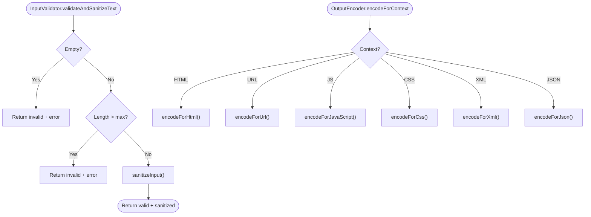

**Diagram sources**
- [InputValidator.kt](file://ktMobileApp/app/src/main/java/com/ekehi/network/security/InputValidator.kt#L1-L146)
- [OutputEncoder.kt](file://ktMobileApp/app/src/main/java/com/ekehi/network/security/OutputEncoder.kt#L1-L142)

**Section sources**
- [InputValidator.kt](file://ktMobileApp/app/src/main/java/com/ekehi/network/security/InputValidator.kt#L1-L146)
- [OutputEncoder.kt](file://ktMobileApp/app/src/main/java/com/ekehi/network/security/OutputEncoder.kt#L1-L142)

### Malicious Code Protection and Security Monitoring
- Detects malicious packages, suspicious permissions, emulator, debuggable builds, root access, and hooking frameworks
- Periodic monitoring of root status, emulator, debuggable flag, tampering, and memory usage
- Logs security events and threats with severity levels

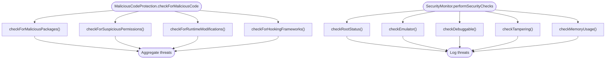

**Diagram sources**
- [MaliciousCodeProtection.kt](file://ktMobileApp/app/src/main/java/com/ekehi/network/security/MaliciousCodeProtection.kt#L1-L332)
- [SecurityMonitor.kt](file://ktMobileApp/app/src/main/java/com/ekehi/network/security/SecurityMonitor.kt#L1-L222)

**Section sources**
- [MaliciousCodeProtection.kt](file://ktMobileApp/app/src/main/java/com/ekehi/network/security/MaliciousCodeProtection.kt#L1-L332)
- [SecurityMonitor.kt](file://ktMobileApp/app/src/main/java/com/ekehi/network/security/SecurityMonitor.kt#L1-L222)

### Access Control and Authorization
- Role-based and permission-based access checks
- Resource ownership validation for profiles, mining data, and social tasks
- Access decisions logged for auditability

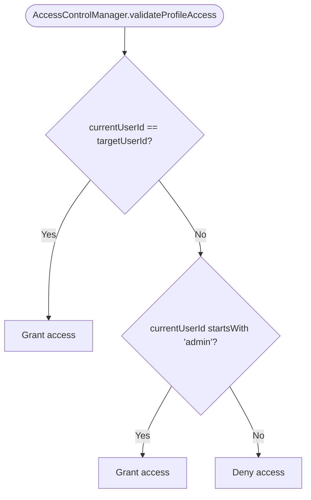

**Diagram sources**
- [AccessControlManager.kt](file://ktMobileApp/app/src/main/java/com/ekehi/network/security/AccessControlManager.kt#L1-L148)

**Section sources**
- [AccessControlManager.kt](file://ktMobileApp/app/src/main/java/com/ekehi/network/security/AccessControlManager.kt#L1-L148)

### Security Configuration and HTTP Security Headers
- Centralized security constants and configuration
- OkHttp interceptor adds security headers and validates response headers
- Network security config allows controlled cleartext for specific domains

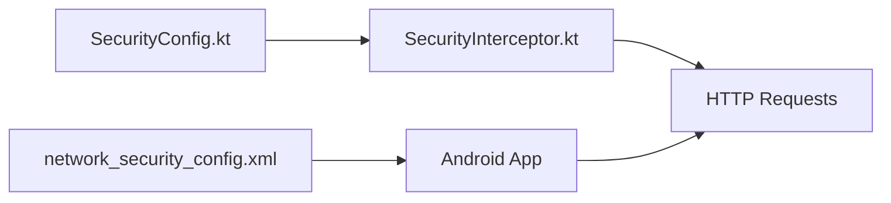

**Diagram sources**
- [SecurityConfig.kt](file://ktMobileApp/app/src/main/java/com/ekehi/network/security/SecurityConfig.kt#L1-L152)
- [SecurityInterceptor.kt](file://ktMobileApp/app/src/main/java/com/ekehi/network/security/SecurityInterceptor.kt#L1-L77)
- [network_security_config.xml](file://ktMobileApp/app/src/main/res/xml/network_security_config.xml#L1-L15)

**Section sources**
- [SecurityConfig.kt](file://ktMobileApp/app/src/main/java/com/ekehi/network/security/SecurityConfig.kt#L1-L152)
- [SecurityInterceptor.kt](file://ktMobileApp/app/src/main/java/com/ekehi/network/security/SecurityInterceptor.kt#L1-L77)
- [network_security_config.xml](file://ktMobileApp/app/src/main/res/xml/network_security_config.xml#L1-L15)

## Dependency Analysis
The authentication and security subsystems exhibit low coupling and high cohesion:
- React Native AuthContext depends on Appwrite SDK and Expo WebBrowser
- Android OAuthService depends on Appwrite Client and Account APIs
- Security utilities are cohesive and reusable across modules
- SecurePreferences and CryptoManager are foundational dependencies for sensitive data handling

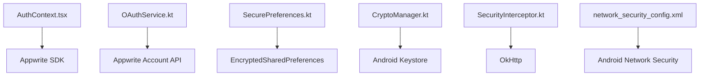

**Diagram sources**
- [AuthContext.tsx](file://mobileApp/src/contexts/AuthContext.tsx#L1-L724)
- [OAuthService.kt](file://ktMobileApp/app/src/main/java/com/ekehi/network/service/OAuthService.kt#L1-L111)
- [SecurePreferences.kt](file://ktMobileApp/app/src/main/java/com/ekehi/network/security/SecurePreferences.kt#L1-L132)
- [CryptoManager.kt](file://ktMobileApp/app/src/main/java/com/ekehi/network/security/CryptoManager.kt#L1-L115)
- [SecurityInterceptor.kt](file://ktMobileApp/app/src/main/java/com/ekehi/network/security/SecurityInterceptor.kt#L1-L77)
- [network_security_config.xml](file://ktMobileApp/app/src/main/res/xml/network_security_config.xml#L1-L15)

**Section sources**
- [AuthContext.tsx](file://mobileApp/src/contexts/AuthContext.tsx#L1-L724)
- [OAuthService.kt](file://ktMobileApp/app/src/main/java/com/ekehi/network/service/OAuthService.kt#L1-L111)
- [SecurePreferences.kt](file://ktMobileApp/app/src/main/java/com/ekehi/network/security/SecurePreferences.kt#L1-L132)
- [CryptoManager.kt](file://ktMobileApp/app/src/main/java/com/ekehi/network/security/CryptoManager.kt#L1-L115)
- [SecurityInterceptor.kt](file://ktMobileApp/app/src/main/java/com/ekehi/network/security/SecurityInterceptor.kt#L1-L77)
- [network_security_config.xml](file://ktMobileApp/app/src/main/res/xml/network_security_config.xml#L1-L15)

## Performance Considerations
- Debounce frequent auth checks to avoid redundant network calls
- Use exponential backoff for retries on network operations
- Minimize synchronous heavy operations on the main thread
- Prefer asynchronous operations for encryption/decryption and validation
- Monitor memory usage and terminate or warn on high usage thresholds

[No sources needed since this section provides general guidance]

## Troubleshooting Guide
Common issues and mitigation strategies:
- OAuth redirect URL misconfiguration: Validate redirect URLs in Appwrite console and ensure platform settings match the app’s scheme
- Authentication cancellation: Handle dismissal gracefully and inform the user
- Session invalidation: Ensure sessions are regenerated after login and extended on activity
- Device security checks: Rooted/emulator detection should trigger warnings; consider lockout policies
- Input validation failures: Sanitize and enforce strict patterns for all user inputs
- Output encoding: Always encode data for the appropriate context to prevent XSS

**Section sources**
- [AuthContext.tsx](file://mobileApp/src/contexts/AuthContext.tsx#L532-L564)
- [OAuthService.kt](file://ktMobileApp/app/src/main/java/com/ekehi/network/service/OAuthService.kt#L31-L58)
- [SessionManager.kt](file://ktMobileApp/app/src/main/java/com/ekehi/network/security/SessionManager.kt#L109-L124)
- [MaliciousCodeProtection.kt](file://ktMobileApp/app/src/main/java/com/ekehi/network/security/MaliciousCodeProtection.kt#L138-L201)
- [InputValidator.kt](file://ktMobileApp/app/src/main/java/com/ekehi/network/security/InputValidator.kt#L71-L113)
- [OutputEncoder.kt](file://ktMobileApp/app/src/main/java/com/ekehi/network/security/OutputEncoder.kt#L120-L135)

## Conclusion
The ekehi-mobile project implements a layered security model combining React Native authentication context, Android OAuth orchestration, secure session management, encrypted storage, input validation, output encoding, malicious code protection, and continuous security monitoring. By adhering to the documented patterns and leveraging the provided components, developers can maintain a robust and secure authentication pipeline across platforms.

[No sources needed since this section summarizes without analyzing specific files]

## Appendices

### Practical Examples and Best Practices
- Secure credential storage
  - Use SecurePreferences for sensitive keys and tokens
  - Use CryptoManager for encrypting secrets at rest
  - Example paths:
    - [SecurePreferences.kt](file://ktMobileApp/app/src/main/java/com/ekehi/network/security/SecurePreferences.kt#L1-L132)
    - [CryptoManager.kt](file://ktMobileApp/app/src/main/java/com/ekehi/network/security/CryptoManager.kt#L1-L115)
- Encryption implementations
  - AES-GCM with Android Keystore for confidentiality and integrity
  - Example paths:
    - [CryptoManager.kt](file://ktMobileApp/app/src/main/java/com/ekehi/network/security/CryptoManager.kt#L1-L115)
- Security monitoring
  - Periodic checks for root, emulator, debuggable state, and memory anomalies
  - Example paths:
    - [SecurityMonitor.kt](file://ktMobileApp/app/src/main/java/com/ekehi/network/security/SecurityMonitor.kt#L1-L222)
    - [MaliciousCodeProtection.kt](file://ktMobileApp/app/src/main/java/com/ekehi/network/security/MaliciousCodeProtection.kt#L1-L332)
- Compliance considerations
  - Enforce TLS 1.2+, use security headers, and restrict cleartext traffic to trusted domains
  - Example paths:
    - [SecurityConfig.kt](file://ktMobileApp/app/src/main/java/com/ekehi/network/security/SecurityConfig.kt#L1-L152)
    - [SecurityInterceptor.kt](file://ktMobileApp/app/src/main/java/com/ekehi/network/security/SecurityInterceptor.kt#L1-L77)
    - [network_security_config.xml](file://ktMobileApp/app/src/main/res/xml/network_security_config.xml#L1-L15)

**Section sources**
- [SecurePreferences.kt](file://ktMobileApp/app/src/main/java/com/ekehi/network/security/SecurePreferences.kt#L1-L132)
- [CryptoManager.kt](file://ktMobileApp/app/src/main/java/com/ekehi/network/security/CryptoManager.kt#L1-L115)
- [SecurityMonitor.kt](file://ktMobileApp/app/src/main/java/com/ekehi/network/security/SecurityMonitor.kt#L1-L222)
- [MaliciousCodeProtection.kt](file://ktMobileApp/app/src/main/java/com/ekehi/network/security/MaliciousCodeProtection.kt#L1-L332)
- [SecurityConfig.kt](file://ktMobileApp/app/src/main/java/com/ekehi/network/security/SecurityConfig.kt#L1-L152)
- [SecurityInterceptor.kt](file://ktMobileApp/app/src/main/java/com/ekehi/network/security/SecurityInterceptor.kt#L1-L77)
- [network_security_config.xml](file://ktMobileApp/app/src/main/res/xml/network_security_config.xml#L1-L15)