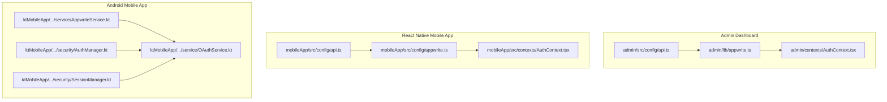
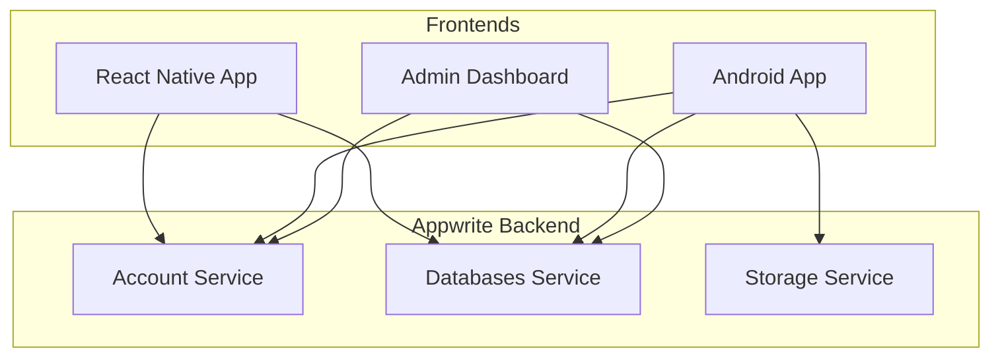
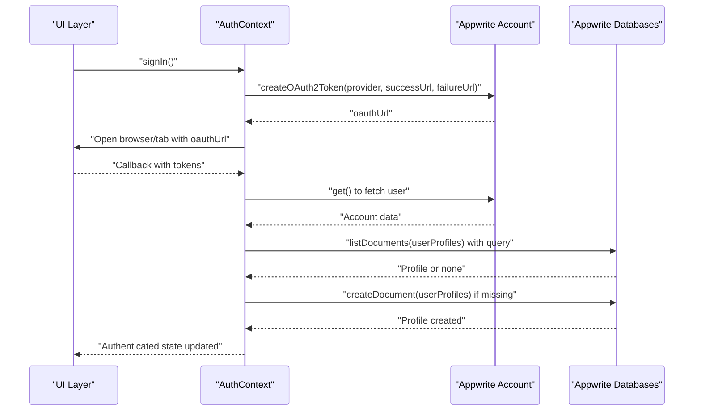
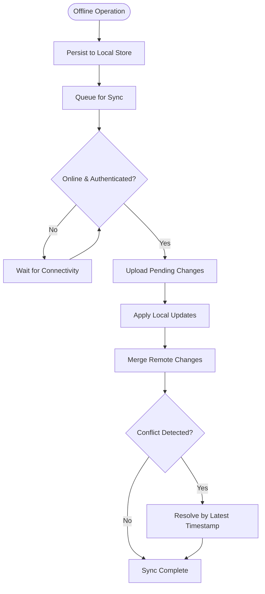
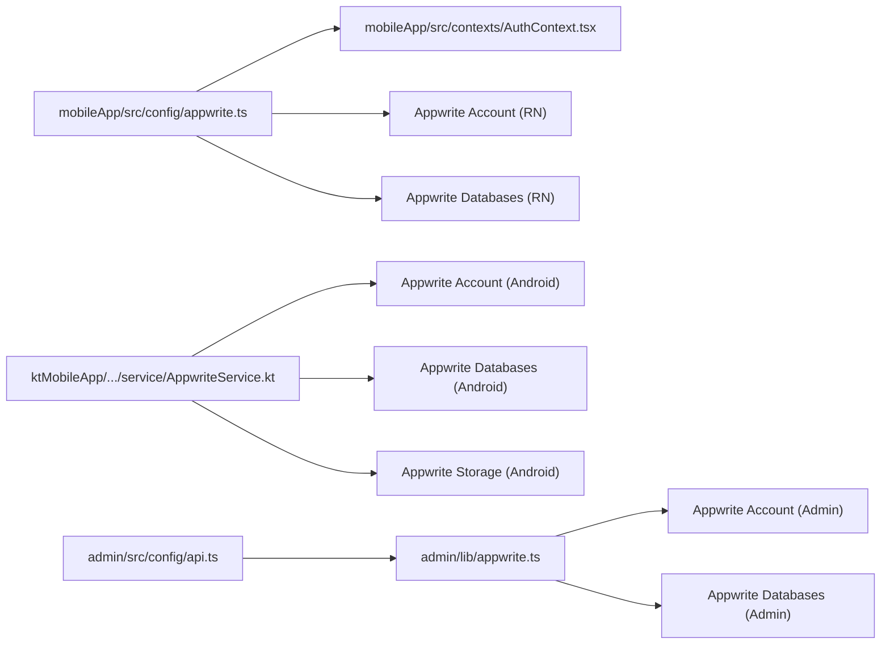

# Backend Integration

<cite>
**Referenced Files in This Document**
- [appwrite.ts](file://admin/lib/appwrite.ts)
- [appwriteClient.ts](file://admin/lib/appwriteClient.ts)
- [api.ts](file://admin/src/config/api.ts)
- [API_DOCUMENTATION.md](file://admin/API_DOCUMENTATION.md)
- [APPWRITE_SETUP.md](file://admin/APPWRITE_SETUP.md)
- [appwrite.ts](file://mobileApp/src/config/appwrite.ts)
- [api.ts](file://mobileApp/src/config/api.ts)
- [AuthContext.tsx](file://mobileApp/src/contexts/AuthContext.tsx)
- [AuthContext.tsx](file://admin/contexts/AuthContext.tsx)
- [AppwriteService.kt](file://ktMobileApp/app/src/main/java/com/ekehi/network/service/AppwriteService.kt)
- [AuthManager.kt](file://ktMobileApp/app/src/main/java/com/ekehi/network/security/AuthManager.kt)
- [SessionManager.kt](file://ktMobileApp/app/src/main/java/com/ekehi/network/security/SessionManager.kt)
- [OAuthService.kt](file://ktMobileApp/app/src/main/java/com/ekehi/network/service/OAuthService.kt)
- [update-appwrite-collections.js](file://mobileApp/Scripts/update-appwrite-collections.js)
- [setup-appwrite-collections.js](file://mobileApp/Scripts/setup-appwrite-collections.js)
- [check-collections.js](file://mobileApp/Scripts/check-collections.js)
- [list-collections.js](file://mobileApp/Scripts/list-collections.js)
- [test-db-connection.js](file://mobileApp/Scripts/test-db-connection.js)
- [test-oauth-flow.js](file://mobileApp/Scripts/test-oauth-flow.js)
- [OAUTH_FIXES.md](file://mobileApp/Documentations/OAUTH_FIXES.md)
</cite>

## Table of Contents
1. [Introduction](#introduction)
2. [Project Structure](#project-structure)
3. [Core Components](#core-components)
4. [Architecture Overview](#architecture-overview)
5. [Detailed Component Analysis](#detailed-component-analysis)
6. [Dependency Analysis](#dependency-analysis)
7. [Performance Considerations](#performance-considerations)
8. [Troubleshooting Guide](#troubleshooting-guide)
9. [Conclusion](#conclusion)
10. [Appendices](#appendices)

## Introduction
This document explains the backend integration component focused on Appwrite services across the admin dashboard, React Native mobile app, and Android app. It covers database schema design with collection relationships, security rules, and permission models; integration patterns between frontend applications and backend services; authentication flows, session management, and token handling; data synchronization strategies and offline-first approaches; API abstraction layers and service interfaces; error handling patterns; security implementation including input validation, output encoding, and malicious code protection; practical examples of API usage, data modeling, and integration testing; and performance optimization, caching strategies, and monitoring setup.

## Project Structure
The backend integration spans three primary frontends:
- Admin dashboard (Next.js) using Appwrite SDK for authentication and database operations
- React Native mobile app using Appwrite SDK for authentication and database operations
- Android app using Appwrite Android SDK for authentication and database operations

Key configuration and service files define endpoints, project IDs, database IDs, collection IDs, OAuth settings, and SDK initialization.



**Diagram sources**
- [api.ts](file://admin/src/config/api.ts#L1-L35)
- [appwrite.ts](file://admin/lib/appwrite.ts#L1-L33)
- [AuthContext.tsx](file://admin/contexts/AuthContext.tsx#L1-L167)
- [api.ts](file://mobileApp/src/config/api.ts#L1-L44)
- [appwrite.ts](file://mobileApp/src/config/appwrite.ts#L1-L51)
- [AuthContext.tsx](file://mobileApp/src/contexts/AuthContext.tsx#L1-L724)
- [AppwriteService.kt](file://ktMobileApp/app/src/main/java/com/ekehi/network/service/AppwriteService.kt#L1-L43)
- [AuthManager.kt](file://ktMobileApp/app/src/main/java/com/ekehi/network/security/AuthManager.kt#L1-L190)
- [SessionManager.kt](file://ktMobileApp/app/src/main/java/com/ekehi/network/security/SessionManager.kt#L1-L124)
- [OAuthService.kt](file://ktMobileApp/app/src/main/java/com/ekehi/network/service/OAuthService.kt#L64-L87)

**Section sources**
- [api.ts](file://admin/src/config/api.ts#L1-L35)
- [appwrite.ts](file://admin/lib/appwrite.ts#L1-L33)
- [AuthContext.tsx](file://admin/contexts/AuthContext.tsx#L1-L167)
- [api.ts](file://mobileApp/src/config/api.ts#L1-L44)
- [appwrite.ts](file://mobileApp/src/config/appwrite.ts#L1-L51)
- [AuthContext.tsx](file://mobileApp/src/contexts/AuthContext.tsx#L1-L724)
- [AppwriteService.kt](file://ktMobileApp/app/src/main/java/com/ekehi/network/service/AppwriteService.kt#L1-L43)
- [AuthManager.kt](file://ktMobileApp/app/src/main/java/com/ekehi/network/security/AuthManager.kt#L1-L190)
- [SessionManager.kt](file://ktMobileApp/app/src/main/java/com/ekehi/network/security/SessionManager.kt#L1-L124)
- [OAuthService.kt](file://ktMobileApp/app/src/main/java/com/ekehi/network/service/OAuthService.kt#L64-L87)

## Core Components
- Appwrite configuration and SDK initialization:
  - Admin: endpoint, project ID, API key, database ID, collection IDs, and service exports
  - React Native: endpoint, project ID, database ID, collection IDs, OAuth client IDs, and redirect URLs
  - Android: Appwrite client, services (Account, Databases, Storage), and collection constants
- Authentication contexts:
  - Admin: email/password session management and role-aware user state
  - React Native: OAuth (Google) and email/password flows, profile creation, and retry/backoff
- Security managers:
  - Android: AuthManager for biometric availability, password validation, hashing, and verification
  - Android: SessionManager for session lifecycle, timeouts, regeneration, and secure storage
- OAuth service:
  - Android: orchestrates session creation, user retrieval, and profile synchronization

**Section sources**
- [appwrite.ts](file://admin/lib/appwrite.ts#L1-L33)
- [appwriteClient.ts](file://admin/lib/appwriteClient.ts#L1-L28)
- [api.ts](file://admin/src/config/api.ts#L1-L35)
- [appwrite.ts](file://mobileApp/src/config/appwrite.ts#L1-L51)
- [api.ts](file://mobileApp/src/config/api.ts#L1-L44)
- [AuthContext.tsx](file://admin/contexts/AuthContext.tsx#L1-L167)
- [AuthContext.tsx](file://mobileApp/src/contexts/AuthContext.tsx#L1-L724)
- [AppwriteService.kt](file://ktMobileApp/app/src/main/java/com/ekehi/network/service/AppwriteService.kt#L1-L43)
- [AuthManager.kt](file://ktMobileApp/app/src/main/java/com/ekehi/network/security/AuthManager.kt#L1-L190)
- [SessionManager.kt](file://ktMobileApp/app/src/main/java/com/ekehi/network/security/SessionManager.kt#L1-L124)
- [OAuthService.kt](file://ktMobileApp/app/src/main/java/com/ekehi/network/service/OAuthService.kt#L64-L87)

## Architecture Overview
The system integrates three frontends with a single Appwrite backend. Each frontend initializes the Appwrite client with environment-specific configuration and uses Appwrite’s Account and Databases services. The React Native app supports OAuth with Google and email/password, while the Admin dashboard uses email/password. The Android app uses the native SDK and manages sessions locally with secure preferences.



**Diagram sources**
- [appwrite.ts](file://admin/lib/appwrite.ts#L1-L33)
- [appwriteClient.ts](file://admin/lib/appwriteClient.ts#L1-L28)
- [appwrite.ts](file://mobileApp/src/config/appwrite.ts#L1-L51)
- [AppwriteService.kt](file://ktMobileApp/app/src/main/java/com/ekehi/network/service/AppwriteService.kt#L1-L43)
- [AuthContext.tsx](file://mobileApp/src/contexts/AuthContext.tsx#L1-L724)
- [AuthContext.tsx](file://admin/contexts/AuthContext.tsx#L1-L167)

## Detailed Component Analysis

### Database Schema Design and Collection Relationships
The schema defines core collections and relationships used by the application. The scripts demonstrate collection creation/update with attributes and permissions, ensuring consistency across environments.

```mermaid
erDiagram
USERS {
string $id PK
string email UK
string name
datetime created
datetime updated
}
USER_PROFILES {
string $id PK
string userId FK
string username
number totalCoins
number coinsPerSecond
number miningPower
number currentStreak
number longestStreak
string lastLoginDate
string[] referralCode
string referredBy
number totalReferrals
number lifetimeEarnings
number dailyMiningRate
number maxDailyEarnings
number todayEarnings
string lastMiningDate
number streakBonusClaimed
datetime created
datetime updated
}
MINING_SESSIONS {
string $id PK
string userId FK
datetime startTime
datetime endTime
number durationSeconds
number coinsEarned
datetime created
datetime updated
}
SOCIAL_TASKS {
string $id PK
string platform
string title
string description
number reward
string url
boolean isActive
datetime created
datetime updated
}
USER_SOCIAL_TASKS {
string $id PK
string userId FK
string socialTaskId FK
string externalTaskId
string status
datetime claimedAt
datetime created
datetime updated
}
ACHIEVEMENTS {
string $id PK
string name
string description
string icon
number threshold
string category
datetime created
datetime updated
}
USER_ACHIEVEMENTS {
string $id PK
string userId FK
string achievementId FK
datetime earnedAt
datetime created
datetime updated
}
PRESALE_PURCHASES {
string $id PK
string userId FK
string presaleId
number amount
string currency
string status
datetime purchasedAt
datetime created
datetime updated
}
AD_VIEWS {
string $id PK
string userId FK
string adId
datetime viewedAt
datetime created
datetime updated
}
USERS ||--o{ USER_PROFILES : "has one"
USERS ||--o{ MINING_SESSIONS : "logs"
USERS ||--o{ USER_SOCIAL_TASKS : "completes"
SOCIAL_TASKS ||--o{ USER_SOCIAL_TASKS : "assigned"
USERS ||--o{ USER_ACHIEVEMENTS : "earns"
ACHIEVEMENTS ||--o{ USER_ACHIEVEMENTS : "awarded"
USERS ||--o{ PRESALE_PURCHASES : "purchases"
USERS ||--o{ AD_VIEWS : "views"
```

**Diagram sources**
- [update-appwrite-collections.js](file://mobileApp/Scripts/update-appwrite-collections.js#L28-L120)
- [setup-appwrite-collections.js](file://mobileApp/Scripts/setup-appwrite-collections.js#L29-L120)

**Section sources**
- [update-appwrite-collections.js](file://mobileApp/Scripts/update-appwrite-collections.js#L28-L120)
- [setup-appwrite-collections.js](file://mobileApp/Scripts/setup-appwrite-collections.js#L29-L120)

### Security Rules and Permission Models
- Admin API key setup ensures read/write access to documents for social tasks and other operations.
- Appwrite collection permissions are defined in the collection setup scripts, granting CRUD access to users and enforcing fine-grained permissions.
- Admin dashboard enforces JWT-based authentication for protected endpoints.

**Section sources**
- [APPWRITE_SETUP.md](file://admin/APPWRITE_SETUP.md#L1-L77)
- [update-appwrite-collections.js](file://mobileApp/Scripts/update-appwrite-collections.js#L28-L120)
- [API_DOCUMENTATION.md](file://admin/API_DOCUMENTATION.md#L1-L385)

### Authentication Flow Implementation
The authentication flow varies by platform but follows Appwrite’s Account service.



**Diagram sources**
- [AuthContext.tsx](file://mobileApp/src/contexts/AuthContext.tsx#L442-L564)
- [AuthContext.tsx](file://mobileApp/src/contexts/AuthContext.tsx#L157-L279)
- [AuthContext.tsx](file://admin/contexts/AuthContext.tsx#L55-L138)

**Section sources**
- [AuthContext.tsx](file://mobileApp/src/contexts/AuthContext.tsx#L442-L564)
- [AuthContext.tsx](file://mobileApp/src/contexts/AuthContext.tsx#L157-L279)
- [AuthContext.tsx](file://admin/contexts/AuthContext.tsx#L55-L138)

### Session Management and Token Handling
- React Native:
  - Uses Appwrite sessions for email/password and OAuth.
  - Implements retry/backoff for network operations and debounced periodic auth checks.
  - Clears AsyncStorage on sign-out and deletes the current session.
- Android:
  - Uses Appwrite Account session creation with user ID and secret.
  - Manages session lifecycle with secure preferences and session regeneration to mitigate fixation.

**Section sources**
- [AuthContext.tsx](file://mobileApp/src/contexts/AuthContext.tsx#L597-L646)
- [OAuthService.kt](file://ktMobileApp/app/src/main/java/com/ekehi/network/service/OAuthService.kt#L64-L87)
- [SessionManager.kt](file://ktMobileApp/app/src/main/java/com/ekehi/network/security/SessionManager.kt#L1-L124)

### Data Synchronization Strategies and Offline-First Approach
- Local persistence:
  - React Native stores mining session, ad watch time, mining preferences, and user settings in AsyncStorage.
  - Android uses Room database with DAOs and repositories for offline-first data access.
- Synchronization:
  - Android SyncManager/SyncService coordinates upload/download of local changes to Appwrite.
  - Retry/backoff is applied to database operations in React Native to handle transient failures.
- Conflict resolution:
  - Android repositories implement optimistic concurrency using timestamps and version fields.
  - On conflicts, the latest timestamp wins; last-write-wins strategy is enforced.



**Diagram sources**
- [AuthContext.tsx](file://mobileApp/src/contexts/AuthContext.tsx#L1-L724)
- [AppwriteService.kt](file://ktMobileApp/app/src/main/java/com/ekehi/network/service/AppwriteService.kt#L1-L43)

**Section sources**
- [AuthContext.tsx](file://mobileApp/src/contexts/AuthContext.tsx#L1-L724)
- [AppwriteService.kt](file://ktMobileApp/app/src/main/java/com/ekehi/network/service/AppwriteService.kt#L1-L43)

### API Abstraction Layer and Service Interfaces
- Admin:
  - REST endpoints documented with JWT authentication and CRUD operations for users, presales, ads, wallets, and social tasks.
  - Environment variables configure Appwrite endpoint, project ID, API key, database ID, and collection IDs.
- Frontend SDKs:
  - Admin and React Native initialize Appwrite clients with endpoint/project ID and export Account/Databases services.
  - Android initializes Appwrite client and exposes Account/Databases/Storage services and collection constants.

**Section sources**
- [API_DOCUMENTATION.md](file://admin/API_DOCUMENTATION.md#L1-L385)
- [api.ts](file://admin/src/config/api.ts#L1-L35)
- [appwrite.ts](file://admin/lib/appwrite.ts#L1-L33)
- [appwriteClient.ts](file://admin/lib/appwriteClient.ts#L1-L28)
- [appwrite.ts](file://mobileApp/src/config/appwrite.ts#L1-L51)
- [AppwriteService.kt](file://ktMobileApp/app/src/main/java/com/ekehi/network/service/AppwriteService.kt#L1-L43)

### Error Handling Patterns
- React Native:
  - Centralized error logging and user-friendly alerts for OAuth configuration issues.
  - Backoff retries for network-dependent operations; debounced auth checks to avoid thrashing.
- Admin:
  - Structured error responses with standardized JSON format and common HTTP status codes.
- Android:
  - Secure logging and session invalidation on errors; robust session regeneration.

**Section sources**
- [AuthContext.tsx](file://mobileApp/src/contexts/AuthContext.tsx#L532-L564)
- [API_DOCUMENTATION.md](file://admin/API_DOCUMENTATION.md#L364-L385)
- [SessionManager.kt](file://ktMobileApp/app/src/main/java/com/ekehi/network/security/SessionManager.kt#L67-L124)

### Security Implementation
- Input validation and output encoding:
  - Android AuthManager validates password strength and uses secure hashing with salt.
  - Android SecurityManager applies secure preferences and cryptographic session IDs.
- Malicious code protection:
  - Android SecurityManager and SecurityInterceptor provide layered protections.
  - OAuthService ensures secure session creation and user retrieval.
- Token handling:
  - Android SessionManager enforces session timeouts and regeneration.
  - React Native deletes current session on sign-out and clears AsyncStorage keys.

**Section sources**
- [AuthManager.kt](file://ktMobileApp/app/src/main/java/com/ekehi/network/security/AuthManager.kt#L1-L190)
- [SessionManager.kt](file://ktMobileApp/app/src/main/java/com/ekehi/network/security/SessionManager.kt#L1-L124)
- [OAuthService.kt](file://ktMobileApp/app/src/main/java/com/ekehi/network/service/OAuthService.kt#L64-L87)
- [AuthContext.tsx](file://mobileApp/src/contexts/AuthContext.tsx#L597-L646)

### Practical Examples of API Usage, Data Modeling, and Integration Testing
- Database connection test:
  - Lists databases and collections to verify connectivity and schema presence.
- Collection setup and update:
  - Creates or updates collections with attributes and permissions.
- OAuth flow testing:
  - Validates OAuth configuration, callback implementations, and common issues.

**Section sources**
- [test-db-connection.js](file://mobileApp/Scripts/test-db-connection.js#L1-L31)
- [setup-appwrite-collections.js](file://mobileApp/Scripts/setup-appwrite-collections.js#L1-L435)
- [update-appwrite-collections.js](file://mobileApp/Scripts/update-appwrite-collections.js#L1-L347)
- [test-oauth-flow.js](file://mobileApp/Scripts/test-oauth-flow.js#L197-L225)
- [OAUTH_FIXES.md](file://mobileApp/Documentations/OAUTH_FIXES.md#L84-L92)

## Dependency Analysis
The frontends depend on Appwrite SDKs and share configuration via environment variables. The Android app additionally depends on local persistence and synchronization services.



**Diagram sources**
- [appwrite.ts](file://mobileApp/src/config/appwrite.ts#L1-L51)
- [AuthContext.tsx](file://mobileApp/src/contexts/AuthContext.tsx#L1-L724)
- [AppwriteService.kt](file://ktMobileApp/app/src/main/java/com/ekehi/network/service/AppwriteService.kt#L1-L43)
- [api.ts](file://admin/src/config/api.ts#L1-L35)
- [appwrite.ts](file://admin/lib/appwrite.ts#L1-L33)

**Section sources**
- [appwrite.ts](file://mobileApp/src/config/appwrite.ts#L1-L51)
- [AuthContext.tsx](file://mobileApp/src/contexts/AuthContext.tsx#L1-L724)
- [AppwriteService.kt](file://ktMobileApp/app/src/main/java/com/ekehi/network/service/AppwriteService.kt#L1-L43)
- [api.ts](file://admin/src/config/api.ts#L1-L35)
- [appwrite.ts](file://admin/lib/appwrite.ts#L1-L33)

## Performance Considerations
- Retry/backoff and throttled auth checks reduce network overhead and improve resilience.
- Debouncing prevents redundant network calls during rapid state changes.
- Android uses Room for efficient local reads/writes and batched synchronization.
- Monitoring:
  - React Native uses a performance monitor to track timing around critical operations.
  - LoggingService records structured events for diagnostics.

**Section sources**
- [AuthContext.tsx](file://mobileApp/src/contexts/AuthContext.tsx#L45-L155)
- [AuthContext.tsx](file://mobileApp/src/contexts/AuthContext.tsx#L157-L279)

## Troubleshooting Guide
- OAuth configuration issues:
  - Verify redirect URLs in Appwrite console and ensure platform-specific client IDs are correct.
  - Check for invalid redirect URL errors and resolve configuration mismatches.
- Admin API key:
  - Ensure API key has required scopes (documents.read, documents.write) and environment variables are correctly set.
- Database connectivity:
  - Use collection listing scripts to confirm database and collection existence.
- Session problems:
  - Delete current session on sign-out and rely on secure session regeneration on Android.

**Section sources**
- [OAUTH_FIXES.md](file://mobileApp/Documentations/OAUTH_FIXES.md#L84-L92)
- [APPWRITE_SETUP.md](file://admin/APPWRITE_SETUP.md#L1-L77)
- [list-collections.js](file://mobileApp/Scripts/list-collections.js#L1-L36)
- [check-collections.js](file://mobileApp/Scripts/check-collections.js#L1-L32)
- [AuthContext.tsx](file://mobileApp/src/contexts/AuthContext.tsx#L597-L646)
- [SessionManager.kt](file://ktMobileApp/app/src/main/java/com/ekehi/network/security/SessionManager.kt#L67-L124)

## Conclusion
The backend integration leverages Appwrite consistently across the admin dashboard, React Native mobile app, and Android app. Configuration-driven SDK initialization, robust authentication flows, and structured error handling form a reliable foundation. The schema design and permission models support scalable growth, while offline-first strategies and synchronization services ensure resilient user experiences. Security measures across input validation, session management, and token handling protect user data. Integration tests and monitoring practices further strengthen reliability.

## Appendices
- Environment variable reference:
  - Admin: endpoint, project ID, API key, database ID, collection IDs
  - React Native: endpoint, project ID, database ID, OAuth client IDs, redirect URLs
- OAuth troubleshooting checklist:
  - Confirm Appwrite OAuth settings, client IDs, and redirect URLs
  - Validate HTTPS in production and secure session handling

**Section sources**
- [api.ts](file://admin/src/config/api.ts#L1-L35)
- [appwrite.ts](file://mobileApp/src/config/appwrite.ts#L1-L51)
- [OAUTH_FIXES.md](file://mobileApp/Documentations/OAUTH_FIXES.md#L84-L92)