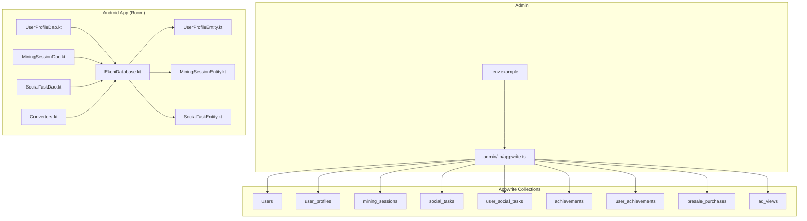
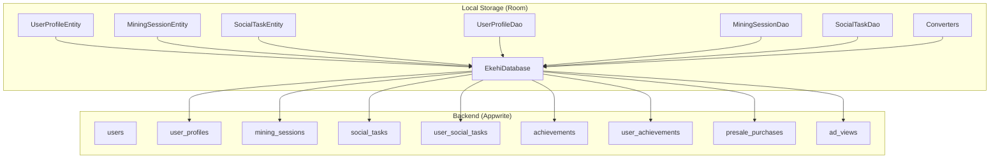
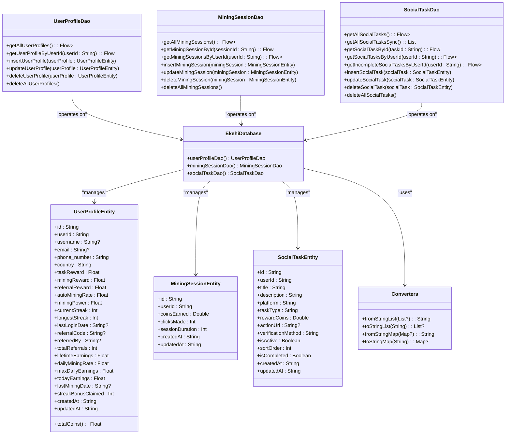
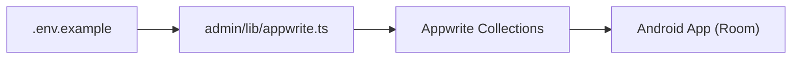

# Database Schema and Collections

<cite>
**Referenced Files in This Document**
- [.env.example](file://admin/.env.example)
- [appwrite.ts](file://admin/lib/appwrite.ts)
- [setup-appwrite-manual.md](file://mobileApp/Documentations/setup-appwrite-manual.md)
- [UPDATED_APPWRITE_SETUP.md](file://mobileApp/Documentations/UPDATED_APPWRITE_SETUP.md)
- [APPWRITE_DATA_MIGRATION.md](file://mobileApp/Documentations/APPWRITE_DATA_MIGRATION.md)
- [update-appwrite-collections.js](file://mobileApp/Scripts/update-appwrite-collections.js)
- [setup-appwrite-collections.js](file://mobileApp/Scripts/setup-appwrite-collections.js)
- [ekehi-network-db.sql](file://mobileApp/cloudflare-data/ekehi-network-db.sql)
- [EkehiDatabase.kt](file://ktMobileApp/app/src/main/java/com/ekehi/network/data/local/EkehiDatabase.kt)
- [UserProfileEntity.kt](file://ktMobileApp/app/src/main/java/com/ekehi/network/data/local/entities/UserProfileEntity.kt)
- [MiningSessionEntity.kt](file://ktMobileApp/app/src/main/java/com/ekehi/network/data/local/entities/MiningSessionEntity.kt)
- [SocialTaskEntity.kt](file://ktMobileApp/app/src/main/java/com/ekehi/network/data/local/entities/SocialTaskEntity.kt)
- [UserProfileDao.kt](file://ktMobileApp/app/src/main/java/com/ekehi/network/data/local/dao/UserProfileDao.kt)
- [MiningSessionDao.kt](file://ktMobileApp/app/src/main/java/com/ekehi/network/data/local/dao/MiningSessionDao.kt)
- [SocialTaskDao.kt](file://ktMobileApp/app/src/main/java/com/ekehi/network/data/local/dao/SocialTaskDao.kt)
- [Converters.kt](file://ktMobileApp/app/src/main/java/com/ekehi/network/data/local/Converters.kt)
</cite>

## Table of Contents
1. [Introduction](#introduction)
2. [Project Structure](#project-structure)
3. [Core Components](#core-components)
4. [Architecture Overview](#architecture-overview)
5. [Detailed Component Analysis](#detailed-component-analysis)
6. [Dependency Analysis](#dependency-analysis)
7. [Performance Considerations](#performance-considerations)
8. [Troubleshooting Guide](#troubleshooting-guide)
9. [Conclusion](#conclusion)
10. [Appendices](#appendices)

## Introduction
This document describes the database schema and collection design for the Ekehi Network mobile application. It covers the nine primary collections used by the system, including users, user_profiles, mining_sessions, social_tasks, user_social_tasks, achievements, user_achievements, presale_purchases, and ad_views. It also documents the offline-first approach using Room entities and DAOs, mapping them to Appwrite collections, and outlines data lifecycle management, retention, and archiving strategies. Finally, it provides examples of complex queries, aggregations, and transformations commonly used in the application.

## Project Structure
The database design spans three major areas:
- Appwrite backend collections and configuration
- Admin dashboard configuration and environment variables
- Android Room entities and DAOs for offline-first storage

**Diagram sources**
- [appwrite.ts](file://admin/lib/appwrite.ts#L1-L33)
- [setup-appwrite-manual.md](file://mobileApp/Documentations/setup-appwrite-manual.md#L1-L192)
- [UPDATED_APPWRITE_SETUP.md](file://mobileApp/Documentations/UPDATED_APPWRITE_SETUP.md#L1-L206)
- [EkehiDatabase.kt](file://ktMobileApp/app/src/main/java/com/ekehi/network/data/local/EkehiDatabase.kt#L1-L31)
- [UserProfileEntity.kt](file://ktMobileApp/app/src/main/java/com/ekehi/network/data/local/entities/UserProfileEntity.kt#L1-L37)
- [MiningSessionEntity.kt](file://ktMobileApp/app/src/main/java/com/ekehi/network/data/local/entities/MiningSessionEntity.kt#L1-L16)
- [SocialTaskEntity.kt](file://ktMobileApp/app/src/main/java/com/ekehi/network/data/local/entities/SocialTaskEntity.kt#L1-L23)
- [UserProfileDao.kt](file://ktMobileApp/app/src/main/java/com/ekehi/network/data/local/dao/UserProfileDao.kt#L1-L26)
- [MiningSessionDao.kt](file://ktMobileApp/app/src/main/java/com/ekehi/network/data/local/dao/MiningSessionDao.kt#L1-L29)
- [SocialTaskDao.kt](file://ktMobileApp/app/src/main/java/com/ekehi/network/data/local/dao/SocialTaskDao.kt#L1-L35)

**Section sources**
- [appwrite.ts](file://admin/lib/appwrite.ts#L1-L33)
- [setup-appwrite-manual.md](file://mobileApp/Documentations/setup-appwrite-manual.md#L1-L192)
- [UPDATED_APPWRITE_SETUP.md](file://mobileApp/Documentations/UPDATED_APPWRITE_SETUP.md#L1-L206)
- [EkehiDatabase.kt](file://ktMobileApp/app/src/main/java/com/ekehi/network/data/local/EkehiDatabase.kt#L1-L31)

## Core Components
This section defines each collection, its attributes, validation rules, defaults, and relationships. It also highlights differences between the Appwrite schema and the legacy Cloudflare D1 schema.

- users
  - Purpose: Authentication and identity
  - Attributes: email (string, unique), name (string), createdAt (datetime), lastLogin (datetime)
  - Defaults: none
  - Validation: required fields as indicated
  - Indexing: unique on email (as defined in schema)
  - Notes: Used as the anchor for user identity across other collections

- user_profiles
  - Purpose: Player statistics, rewards, and mining metrics
  - Attributes:
    - userId (string, unique)
    - username (string)
    - totalCoins (float, default 0)
    - coinsPerSecond (float, default 0) — deprecated but retained
    - autoMiningRate (float, default 0) — new
    - miningPower (float, default 1)
    - referralBonusRate (float, default 0) — new
    - currentStreak (int, default 0)
    - longestStreak (int, default 0)
    - lastLoginDate (datetime)
    - referralCode (string, unique)
    - referredBy (string)
    - totalReferrals (int, default 0)
    - lifetimeEarnings (float, default 0)
    - dailyMiningRate (float, default 2) — updated to represent 2 EKH per 24-hour session
    - maxDailyEarnings (float, default 10000)
    - todayEarnings (float, default 0)
    - lastMiningDate (datetime)
    - streakBonusClaimed (int, default 0)
    - createdAt (datetime), updatedAt (datetime)
  - Defaults: see above
  - Validation: required fields as indicated
  - Indexing: unique on userId and referralCode; additional indexes recommended for leaderboards and filters
  - Notes: Includes computed totalCoins derived from task/mining/referral rewards

- mining_sessions
  - Purpose: Track individual mining sessions
  - Attributes:
    - userId (string)
    - coinsEarned (float)
    - clicksMade (int)
    - sessionDuration (int)
    - createdAt (datetime), updatedAt (datetime)
  - Defaults: none
  - Validation: required fields as indicated
  - Indexing: recommended index on userId for session history

- social_tasks
  - Purpose: Available tasks for users to complete
  - Attributes:
    - title (string)
    - description (string)
    - platform (string)
    - taskType (string)
    - rewardCoins (float)
    - actionUrl (string)
    - verificationMethod (string)
    - isActive (boolean, default true)
    - sortOrder (int, default 0)
    - createdAt (datetime), updatedAt (datetime)
  - Defaults: isActive=true, sortOrder=0
  - Validation: required fields as indicated
  - Indexing: recommended index on isActive for filtering active tasks

- user_social_tasks
  - Purpose: Log of completed tasks per user
  - Attributes:
    - userId (string)
    - taskId (string)
    - completedAt (datetime)
    - createdAt (datetime), updatedAt (datetime)
  - Defaults: none
  - Validation: required fields as indicated
  - Indexing: composite index on (userId, taskId) for uniqueness and lookup

- achievements
  - Purpose: Define unlockable achievements
  - Attributes:
    - achievementId (string, unique)
    - title (string)
    - description (string)
    - type (string)
    - target (float)
    - reward (float)
    - rarity (string)
    - isActive (boolean, default true)
    - createdAt (datetime), updatedAt (datetime)
  - Defaults: isActive=true
  - Validation: required fields as indicated
  - Indexing: recommended index on isActive for filtering active achievements

- user_achievements
  - Purpose: Track which achievements a user has unlocked
  - Attributes:
    - userId (string)
    - achievementId (string)
    - claimedAt (datetime)
    - createdAt (datetime), updatedAt (datetime)
  - Defaults: none
  - Validation: required fields as indicated
  - Indexing: composite index on (userId, achievementId) for uniqueness and lookup

- presale_purchases
  - Purpose: Record presale transactions
  - Attributes:
    - userId (string)
    - amountUsd (float)
    - tokensAmount (float)
    - transactionHash (string)
    - status (string)
    - paymentMethod (string)
    - createdAt (datetime), updatedAt (datetime)
  - Defaults: none
  - Validation: required fields as indicated
  - Indexing: recommended index on userId for transaction history

- ad_views
  - Purpose: Track rewarded ad views
  - Attributes:
    - userId (string)
    - adType (string)
    - reward (float)
    - createdAt (datetime), updatedAt (datetime)
  - Defaults: none
  - Validation: required fields as indicated
  - Indexing: recommended index on userId for analytics

Relationships and constraints:
- One-to-many: users → user_profiles (one user has one profile)
- One-to-many: users → mining_sessions (user authored many sessions)
- Many-to-one: mining_sessions → users (each session belongs to a user)
- Many-to-one: social_tasks → users (tasks may be associated with a user context)
- Many-to-many via junction: users ↔ achievements through user_achievements
- One-to-many: users → user_social_tasks (user authored many completions)
- One-to-many: users → presale_purchases (user made many purchases)
- One-to-many: users → ad_views (user viewed many ads)

Foreign keys:
- Cloudflare D1 schema defines foreign keys between user_profiles.user_id → users.id, user_social_tasks.task_id → social_tasks.id, and user_social_tasks.user_id → users.id, among others. These are enforced at the SQLite level in the legacy schema.

Indexing strategies:
- Recommended indexes (derived from usage patterns):
  - user_profiles: unique(userId), unique(referralCode), index(totalCoins desc)
  - mining_sessions: index(userId)
  - social_tasks: index(isActive)
  - user_social_tasks: index(userId), index(taskId), composite(unique pair)
  - achievements: index(isActive)
  - user_achievements: index(userId), composite(unique pair)
  - presale_purchases: index(userId)
  - ad_views: index(userId)

**Section sources**
- [setup-appwrite-manual.md](file://mobileApp/Documentations/setup-appwrite-manual.md#L1-L192)
- [UPDATED_APPWRITE_SETUP.md](file://mobileApp/Documentations/UPDATED_APPWRITE_SETUP.md#L1-L206)
- [ekehi-network-db.sql](file://mobileApp/cloudflare-data/ekehi-network-db.sql#L1-L145)

## Architecture Overview
The system follows an offline-first architecture:
- Android app stores frequently accessed data locally in Room (user profiles, mining sessions, social tasks).
- Appwrite serves as the authoritative backend for global data and cross-device synchronization.
- Sync manager coordinates upload/download of local changes to Appwrite collections.

**Diagram sources**
- [EkehiDatabase.kt](file://ktMobileApp/app/src/main/java/com/ekehi/network/data/local/EkehiDatabase.kt#L1-L31)
- [UserProfileEntity.kt](file://ktMobileApp/app/src/main/java/com/ekehi/network/data/local/entities/UserProfileEntity.kt#L1-L37)
- [MiningSessionEntity.kt](file://ktMobileApp/app/src/main/java/com/ekehi/network/data/local/entities/MiningSessionEntity.kt#L1-L16)
- [SocialTaskEntity.kt](file://ktMobileApp/app/src/main/java/com/ekehi/network/data/local/entities/SocialTaskEntity.kt#L1-L23)
- [UserProfileDao.kt](file://ktMobileApp/app/src/main/java/com/ekehi/network/data/local/dao/UserProfileDao.kt#L1-L26)
- [MiningSessionDao.kt](file://ktMobileApp/app/src/main/java/com/ekehi/network/data/local/dao/MiningSessionDao.kt#L1-L29)
- [SocialTaskDao.kt](file://ktMobileApp/app/src/main/java/com/ekehi/network/data/local/dao/SocialTaskDao.kt#L1-L35)
- [Converters.kt](file://ktMobileApp/app/src/main/java/com/ekehi/network/data/local/Converters.kt#L1-L31)
- [appwrite.ts](file://admin/lib/appwrite.ts#L1-L33)

## Detailed Component Analysis

### Appwrite Collections and Attributes
- Collection IDs and mapping are configured centrally and used by the admin and mobile apps.
- The collection definitions include permissions and attributes with required/optional flags and defaults.
- The migration documentation lists the nine collections and outlines recent updates (e.g., removal of coinsPerClick, addition of autoMiningRate and referralBonusRate).

**Section sources**
- [.env.example](file://admin/.env.example#L1-L16)
- [appwrite.ts](file://admin/lib/appwrite.ts#L1-L33)
- [APPWRITE_DATA_MIGRATION.md](file://mobileApp/Documentations/APPWRITE_DATA_MIGRATION.md#L90-L146)
- [update-appwrite-collections.js](file://mobileApp/Scripts/update-appwrite-collections.js#L1-L347)
- [setup-appwrite-collections.js](file://mobileApp/Scripts/setup-appwrite-collections.js#L1-L450)

### Room Entities and DAOs (Offline-First)
- Room database definition registers entities for user profiles, mining sessions, and social tasks.
- DAOs expose typed queries for fetching, inserting, updating, and deleting entities.
- Type converters support serializing complex types (lists/maps) stored as strings.

**Diagram sources**
- [EkehiDatabase.kt](file://ktMobileApp/app/src/main/java/com/ekehi/network/data/local/EkehiDatabase.kt#L1-L31)
- [UserProfileEntity.kt](file://ktMobileApp/app/src/main/java/com/ekehi/network/data/local/entities/UserProfileEntity.kt#L1-L37)
- [MiningSessionEntity.kt](file://ktMobileApp/app/src/main/java/com/ekehi/network/data/local/entities/MiningSessionEntity.kt#L1-L16)
- [SocialTaskEntity.kt](file://ktMobileApp/app/src/main/java/com/ekehi/network/data/local/entities/SocialTaskEntity.kt#L1-L23)
- [UserProfileDao.kt](file://ktMobileApp/app/src/main/java/com/ekehi/network/data/local/dao/UserProfileDao.kt#L1-L26)
- [MiningSessionDao.kt](file://ktMobileApp/app/src/main/java/com/ekehi/network/data/local/dao/MiningSessionDao.kt#L1-L29)
- [SocialTaskDao.kt](file://ktMobileApp/app/src/main/java/com/ekehi/network/data/local/dao/SocialTaskDao.kt#L1-L35)
- [Converters.kt](file://ktMobileApp/app/src/main/java/com/ekehi/network/data/local/Converters.kt#L1-L31)

**Section sources**
- [EkehiDatabase.kt](file://ktMobileApp/app/src/main/java/com/ekehi/network/data/local/EkehiDatabase.kt#L1-L31)
- [UserProfileEntity.kt](file://ktMobileApp/app/src/main/java/com/ekehi/network/data/local/entities/UserProfileEntity.kt#L1-L37)
- [MiningSessionEntity.kt](file://ktMobileApp/app/src/main/java/com/ekehi/network/data/local/entities/MiningSessionEntity.kt#L1-L16)
- [SocialTaskEntity.kt](file://ktMobileApp/app/src/main/java/com/ekehi/network/data/local/entities/SocialTaskEntity.kt#L1-L23)
- [UserProfileDao.kt](file://ktMobileApp/app/src/main/java/com/ekehi/network/data/local/dao/UserProfileDao.kt#L1-L26)
- [MiningSessionDao.kt](file://ktMobileApp/app/src/main/java/com/ekehi/network/data/local/dao/MiningSessionDao.kt#L1-L29)
- [SocialTaskDao.kt](file://ktMobileApp/app/src/main/java/com/ekehi/network/data/local/dao/SocialTaskDao.kt#L1-L35)
- [Converters.kt](file://ktMobileApp/app/src/main/java/com/ekehi/network/data/local/Converters.kt#L1-L31)

### Data Lifecycle Management
- Local cache refresh: DAOs expose queries to load latest data for user profiles, mining sessions, and social tasks.
- Insert/update/delete operations are provided for each entity.
- Type converters enable storing structured data in Room.

**Section sources**
- [UserProfileDao.kt](file://ktMobileApp/app/src/main/java/com/ekehi/network/data/local/dao/UserProfileDao.kt#L1-L26)
- [MiningSessionDao.kt](file://ktMobileApp/app/src/main/java/com/ekehi/network/data/local/dao/MiningSessionDao.kt#L1-L29)
- [SocialTaskDao.kt](file://ktMobileApp/app/src/main/java/com/ekehi/network/data/local/dao/SocialTaskDao.kt#L1-L35)
- [Converters.kt](file://ktMobileApp/app/src/main/java/com/ekehi/network/data/local/Converters.kt#L1-L31)

### Retention and Archiving Strategies
- Retention policy: Not explicitly defined in the schema. Consider implementing:
  - Mining sessions: retain last N sessions per user for analytics and leaderboard fairness.
  - Social task completions: keep recent activity for a rolling window (e.g., last 30 days).
  - User profiles: keep indefinitely with periodic pruning of inactive accounts after notice.
- Archiving:
  - Older mining sessions and ad views could be moved to historical partitions or aggregated summaries.
  - Consider partitioning by date ranges for scalability.
- Compliance:
  - Respect user data deletion requests by removing personal identifiers while preserving anonymized aggregates.

[No sources needed since this section provides general guidance]

### Complex Queries, Aggregations, and Transformations
Below are typical operations used across the application. These are described conceptually to avoid reproducing code.

- Mining analytics
  - Compute total earnings per user from mining_sessions and user_profiles.
  - Aggregate session durations and coin earnings per day/week/month.
  - Identify top miners by totalCoins or lifetimeEarnings.

- Social task completion tracking
  - Count completed tasks per user and compare against targets.
  - Filter active tasks by platform and taskType for personalized feeds.

- Achievement progress
  - Join user_achievements with achievements to display unlocked badges.
  - Compute progress toward next-tier achievements using user_profiles totals.

- Presale analytics
  - Sum presale_purchases by status and paymentMethod for revenue tracking.
  - Correlate presale participation with referralCode usage.

- Ad reward tracking
  - Sum ad_views rewards per user and adType for monetization reports.

[No sources needed since this section doesn't analyze specific files]

## Dependency Analysis
- Admin configuration depends on environment variables for endpoints and collection IDs.
- Appwrite client initialization maps collection IDs to backend collections.
- Android app depends on Room entities and DAOs for offline access and Appwrite for synchronization.

**Diagram sources**
- [.env.example](file://admin/.env.example#L1-L16)
- [appwrite.ts](file://admin/lib/appwrite.ts#L1-L33)

**Section sources**
- [.env.example](file://admin/.env.example#L1-L16)
- [appwrite.ts](file://admin/lib/appwrite.ts#L1-L33)

## Performance Considerations
- Indexing: Create indexes on frequently filtered/sorted fields (userId, isActive, referralCode, totalCoins).
- Query patterns: Prefer DAO queries that leverage indexes (e.g., getByUserId).
- Data size: Limit returned documents to recent windows for leaderboard and analytics views.
- Background sync: Batch uploads and downloads to reduce network overhead.

[No sources needed since this section provides general guidance]

## Troubleshooting Guide
- Collection creation failures
  - Verify API key permissions and endpoint/project/database IDs.
  - Ensure collection IDs match between configuration and Appwrite.
- Migration issues
  - Confirm JSON data structure aligns with collection attributes.
  - Check that required fields are present and types match.
- Connection issues
  - Validate endpoint URL and network connectivity.
  - Re-check project ID and database ID.

**Section sources**
- [APPWRITE_DATA_MIGRATION.md](file://mobileApp/Documentations/APPWRITE_DATA_MIGRATION.md#L118-L141)

## Conclusion
The Ekehi Network database schema combines a robust Appwrite backend with an efficient offline-first Android client using Room. The nine primary collections capture user identity, mining, social tasks, achievements, presales, and ad views. Proper indexing, retention, and archiving strategies will ensure performance and compliance. The provided DAOs and entities offer a clean foundation for building scalable features while maintaining data consistency across devices.

## Appendices

### Appendix A: Collection Attributes Reference
- users: email (unique), name, createdAt, lastLogin
- user_profiles: userId (unique), username, totalCoins, coinsPerSecond, autoMiningRate, miningPower, referralBonusRate, currentStreak, longestStreak, lastLoginDate, referralCode (unique), referredBy, totalReferrals, lifetimeEarnings, dailyMiningRate, maxDailyEarnings, todayEarnings, lastMiningDate, streakBonusClaimed, createdAt, updatedAt
- mining_sessions: userId, coinsEarned, clicksMade, sessionDuration, createdAt, updatedAt
- social_tasks: title, description, platform, taskType, rewardCoins, actionUrl, verificationMethod, isActive (default true), sortOrder (default 0), createdAt, updatedAt
- user_social_tasks: userId, taskId, completedAt, createdAt, updatedAt
- achievements: achievementId (unique), title, description, type, target, reward, rarity, isActive (default true), createdAt, updatedAt
- user_achievements: userId, achievementId, claimedAt, createdAt, updatedAt
- presale_purchases: userId, amountUsd, tokensAmount, transactionHash, status, paymentMethod, createdAt, updatedAt
- ad_views: userId, adType, reward, createdAt, updatedAt

**Section sources**
- [setup-appwrite-manual.md](file://mobileApp/Documentations/setup-appwrite-manual.md#L28-L149)
- [UPDATED_APPWRITE_SETUP.md](file://mobileApp/Documentations/UPDATED_APPWRITE_SETUP.md#L16-L206)

### Appendix B: Legacy Cloudflare D1 Schema Highlights
- Foreign keys link user_profiles.user_id to users.id, user_social_tasks.task_id to social_tasks.id, and user_social_tasks.user_id to users.id.
- Indexes include unique and composite indexes for performance.

**Section sources**
- [ekehi-network-db.sql](file://mobileApp/cloudflare-data/ekehi-network-db.sql#L1-L145)