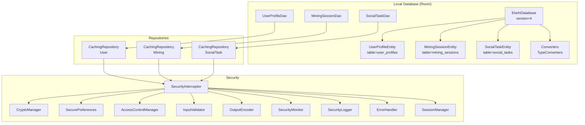
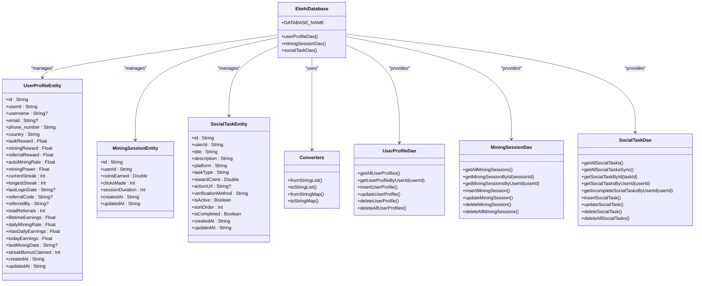
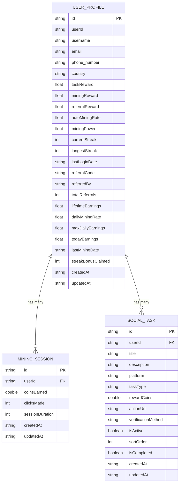
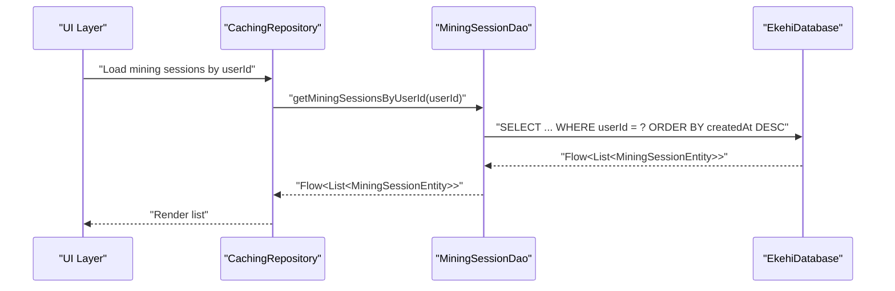
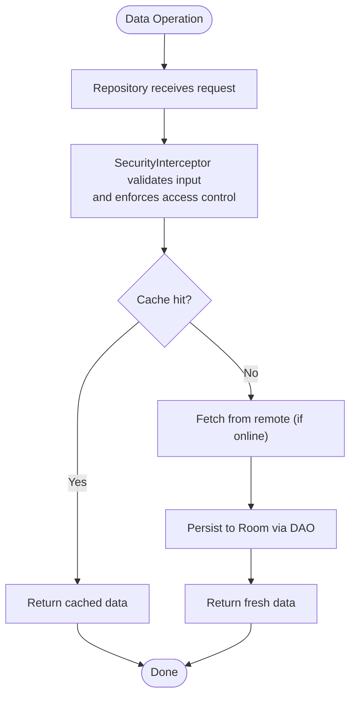
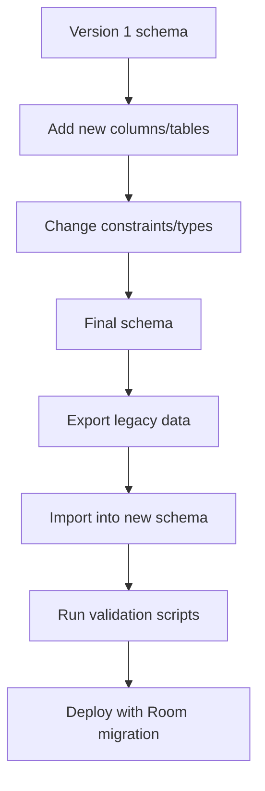
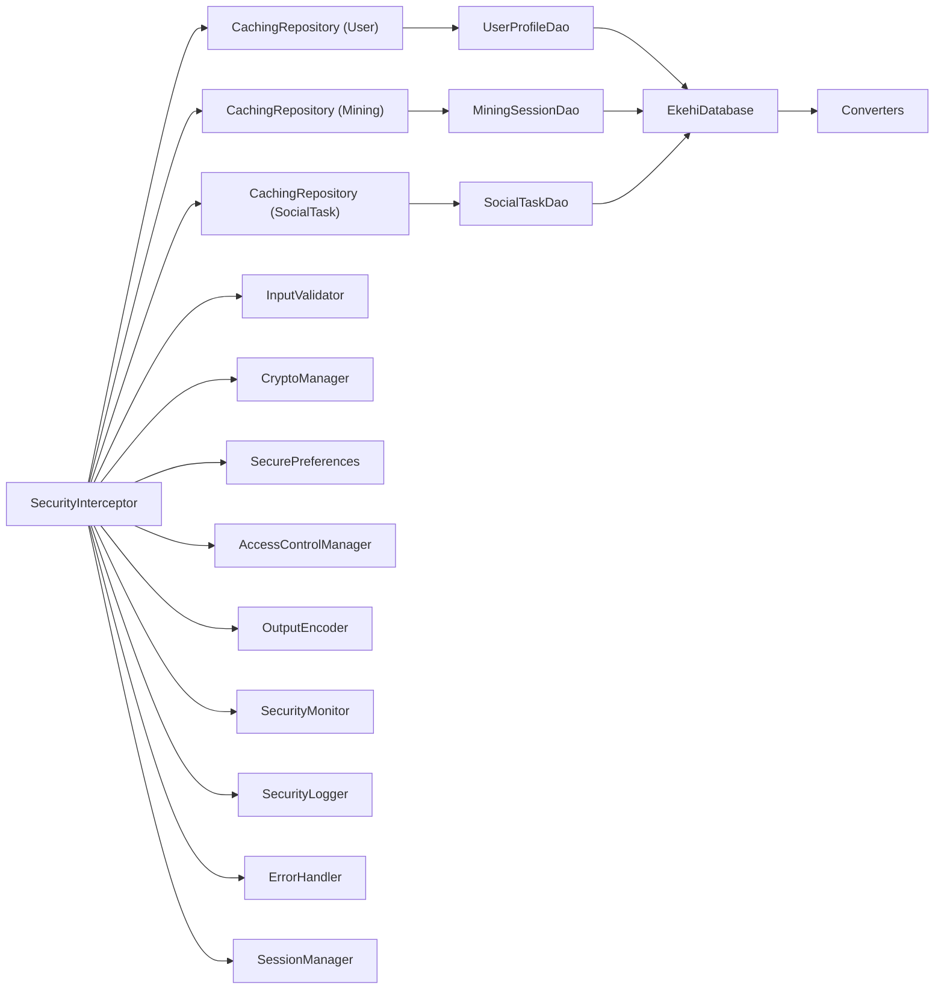

# Data Models and Database Schema

<cite>
**Referenced Files in This Document**
- [EkehiDatabase.kt](file://ktMobileApp/app/src/main/java/com/ekehi/network/data/local/EkehiDatabase.kt)
- [Converters.kt](file://ktMobileApp/app/src/main/java/com/ekehi/network/data/local/Converters.kt)
- [UserProfileEntity.kt](file://ktMobileApp/app/src/main/java/com/ekehi/network/data/local/entities/UserProfileEntity.kt)
- [MiningSessionEntity.kt](file://ktMobileApp/app/src/main/java/com/ekehi/network/data/local/entities/MiningSessionEntity.kt)
- [SocialTaskEntity.kt](file://ktMobileApp/app/src/main/java/com/ekehi/network/data/local/entities/SocialTaskEntity.kt)
- [UserProfileDao.kt](file://ktMobileApp/app/src/main/java/com/ekehi/network/data/local/dao/UserProfileDao.kt)
- [MiningSessionDao.kt](file://ktMobileApp/app/src/main/java/com/ekehi/network/data/local/dao/MiningSessionDao.kt)
- [SocialTaskDao.kt](file://ktMobileApp/app/src/main/java/com/ekehi/network/data/local/dao/SocialTaskDao.kt)
- [UserProfile.kt](file://ktMobileApp/app/src/main/java/com/ekehi/network/data/model/UserProfile.kt)
- [MiningSession.kt](file://ktMobileApp/app/src/main/java/com/ekehi/network/data/model/MiningSession.kt)
- [SocialTask.kt](file://ktMobileApp/app/src/main/java/com/ekehi/network/data/model/SocialTask.kt)
- [UserSocialTask.kt](file://ktMobileApp/app/src/main/java/com/ekehi/network/data/model/UserSocialTask.kt)
- [CacheManager.kt](file://ktMobileApp/app/src/main/java/com/ekehi/network/data/local/CacheManager.kt)
- [CachingRepository.kt](file://ktMobileApp/app/src/main/java/com/ekehi/network/data/repository/CachingRepository.kt)
- [SyncManager.kt](file://ktMobileApp/app/src/main/java/com/ekehi/network/data/sync/SyncManager.kt)
- [SyncService.kt](file://ktMobileApp/app/src/main/java/com/ekehi/network/data/sync/SyncService.kt)
- [SecurityInterceptor.kt](file://ktMobileApp/app/src/main/java/com/ekehi/network/security/SecurityInterceptor.kt)
- [CryptoManager.kt](file://ktMobileApp/app/src/main/java/com/ekehi/network/security/CryptoManager.kt)
- [SecurePreferences.kt](file://ktMobileApp/app/src/main/java/com/ekehi/network/security/SecurePreferences.kt)
- [AccessControlManager.kt](file://ktMobileApp/app/src/main/java/com/ekehi/network/security/AccessControlManager.kt)
- [InputValidator.kt](file://ktMobileApp/app/src/main/java/com/ekehi/network/security/InputValidator.kt)
- [OutputEncoder.kt](file://ktMobileApp/app/src/main/java/com/ekehi/network/security/OutputEncoder.kt)
- [SecurityMonitor.kt](file://ktMobileApp/app/src/main/java/com/ekehi/network/security/SecurityMonitor.kt)
- [SecurityLogger.kt](file://ktMobileApp/app/src/main/java/com/ekehi/network/security/SecurityLogger.kt)
- [ErrorHandler.kt](file://ktMobileApp/app/src/main/java/com/ekehi/network/security/ErrorHandler.kt)
- [SessionManager.kt](file://ktMobileApp/app/src/main/java/com/ekehi/network/security/SessionManager.kt)
- [ekehi-network-db.sql](file://mobileApp/cloudflare-data/ekehi-network-db.sql)
- [APPWRITE_MIGRATION_GUIDE.md](file://mobileApp/Documentations/APPWRITE_MIGRATION_GUIDE.md)
- [APPWRITE_DATA_MIGRATION.md](file://mobileApp/Documentations/APPWRITE_DATA_MIGRATION.md)
- [MIGRATION_PLAN.md](file://ktMobileApp/MIGRATION_PLAN.md)
- [KT_MIGRATION_GUIDE.md](file://ktMobileApp/KT_MIGRATION_GUIDE.md)
- [APPWRITE_INTEGRATION_FIXES.md](file://ktMobileApp/APPWRITE_INTEGRATION_FIXES.md)
- [APPWRITE_OAUTH_CONFIGURATION.md](file://mobileApp/Documentations/APPWRITE_OAUTH_CONFIGURATION.md)
- [MOBILE_OAUTH_SETUP.md](file://LandPage/src/react-app/docs/MOBILE_OAUTH_SETUP.md)
</cite>

## Table of Contents
1. [Introduction](#introduction)
2. [Project Structure](#project-structure)
3. [Core Components](#core-components)
4. [Architecture Overview](#architecture-overview)
5. [Detailed Component Analysis](#detailed-component-analysis)
6. [Dependency Analysis](#dependency-analysis)
7. [Performance Considerations](#performance-considerations)
8. [Troubleshooting Guide](#troubleshooting-guide)
9. [Conclusion](#conclusion)
10. [Appendices](#appendices)

## Introduction
This document provides comprehensive data model documentation for the Ekehi Mobile application. It covers the local Room database schema, entity relationships, field definitions, primary and foreign keys, constraints, validation rules, business logic constraints, data integrity measures, caching and synchronization patterns, performance considerations, data lifecycle management, migration paths, and security controls. The goal is to enable developers and stakeholders to understand how user profiles, mining sessions, and social tasks are modeled and persisted locally, and how they integrate with backend systems and security controls.

## Project Structure
The data model is implemented in the Android module using Room ORM. Entities are mapped to local tables, DAOs define typed queries and mutations, and repositories orchestrate data access with caching and synchronization. Security utilities protect sensitive data and enforce access control.

**Diagram sources**
- [EkehiDatabase.kt](file://ktMobileApp/app/src/main/java/com/ekehi/network/data/local/EkehiDatabase.kt#L1-L31)
- [Converters.kt](file://ktMobileApp/app/src/main/java/com/ekehi/network/data/local/Converters.kt#L1-L31)
- [UserProfileEntity.kt](file://ktMobileApp/app/src/main/java/com/ekehi/network/data/local/entities/UserProfileEntity.kt#L1-L37)
- [MiningSessionEntity.kt](file://ktMobileApp/app/src/main/java/com/ekehi/network/data/local/entities/MiningSessionEntity.kt#L1-L16)
- [SocialTaskEntity.kt](file://ktMobileApp/app/src/main/java/com/ekehi/network/data/local/entities/SocialTaskEntity.kt#L1-L23)
- [UserProfileDao.kt](file://ktMobileApp/app/src/main/java/com/ekehi/network/data/local/dao/UserProfileDao.kt#L1-L26)
- [MiningSessionDao.kt](file://ktMobileApp/app/src/main/java/com/ekehi/network/data/local/dao/MiningSessionDao.kt#L1-L29)
- [SocialTaskDao.kt](file://ktMobileApp/app/src/main/java/com/ekehi/network/data/local/dao/SocialTaskDao.kt#L1-L35)
- [CachingRepository.kt](file://ktMobileApp/app/src/main/java/com/ekehi/network/data/repository/CachingRepository.kt)
- [SecurityInterceptor.kt](file://ktMobileApp/app/src/main/java/com/ekehi/network/security/SecurityInterceptor.kt)
- [CryptoManager.kt](file://ktMobileApp/app/src/main/java/com/ekehi/network/security/CryptoManager.kt)
- [SecurePreferences.kt](file://ktMobileApp/app/src/main/java/com/ekehi/network/security/SecurePreferences.kt)
- [AccessControlManager.kt](file://ktMobileApp/app/src/main/java/com/ekehi/network/security/AccessControlManager.kt)
- [InputValidator.kt](file://ktMobileApp/app/src/main/java/com/ekehi/network/security/InputValidator.kt)
- [OutputEncoder.kt](file://ktMobileApp/app/src/main/java/com/ekehi/network/security/OutputEncoder.kt)
- [SecurityMonitor.kt](file://ktMobileApp/app/src/main/java/com/ekehi/network/security/SecurityMonitor.kt)
- [SecurityLogger.kt](file://ktMobileApp/app/src/main/java/com/ekehi/network/security/SecurityLogger.kt)
- [ErrorHandler.kt](file://ktMobileApp/app/src/main/java/com/ekehi/network/security/ErrorHandler.kt)
- [SessionManager.kt](file://ktMobileApp/app/src/main/java/com/ekehi/network/security/SessionManager.kt)

**Section sources**
- [EkehiDatabase.kt](file://ktMobileApp/app/src/main/java/com/ekehi/network/data/local/EkehiDatabase.kt#L1-L31)
- [Converters.kt](file://ktMobileApp/app/src/main/java/com/ekehi/network/data/local/Converters.kt#L1-L31)

## Core Components
- Local database: Room database with three entities and type converters.
- Entities: user_profiles, mining_sessions, social_tasks.
- DAOs: typed queries for CRUD and filtering.
- Repositories: caching and synchronization orchestration.
- Security: input validation, encryption, secure preferences, access control, logging, error handling, session management.

Key implementation references:
- Database definition and versioning: [EkehiDatabase.kt](file://ktMobileApp/app/src/main/java/com/ekehi/network/data/local/EkehiDatabase.kt#L1-L31)
- Type converters for complex fields: [Converters.kt](file://ktMobileApp/app/src/main/java/com/ekehi/network/data/local/Converters.kt#L1-L31)
- Entity definitions: [UserProfileEntity.kt](file://ktMobileApp/app/src/main/java/com/ekehi/network/data/local/entities/UserProfileEntity.kt#L1-L37), [MiningSessionEntity.kt](file://ktMobileApp/app/src/main/java/com/ekehi/network/data/local/entities/MiningSessionEntity.kt#L1-L16), [SocialTaskEntity.kt](file://ktMobileApp/app/src/main/java/com/ekehi/network/data/local/entities/SocialTaskEntity.kt#L1-L23)
- DAO interfaces: [UserProfileDao.kt](file://ktMobileApp/app/src/main/java/com/ekehi/network/data/local/dao/UserProfileDao.kt#L1-L26), [MiningSessionDao.kt](file://ktMobileApp/app/src/main/java/com/ekehi/network/data/local/dao/MiningSessionDao.kt#L1-L29), [SocialTaskDao.kt](file://ktMobileApp/app/src/main/java/com/ekehi/network/data/local/dao/SocialTaskDao.kt#L1-L35)
- Model classes (DTOs): [UserProfile.kt](file://ktMobileApp/app/src/main/java/com/ekehi/network/data/model/UserProfile.kt#L1-L32), [MiningSession.kt](file://ktMobileApp/app/src/main/java/com/ekehi/network/data/model/MiningSession.kt#L1-L30), [SocialTask.kt](file://ktMobileApp/app/src/main/java/com/ekehi/network/data/model/SocialTask.kt#L1-L22), [UserSocialTask.kt](file://ktMobileApp/app/src/main/java/com/ekehi/network/data/model/UserSocialTask.kt#L1-L15)

**Section sources**
- [EkehiDatabase.kt](file://ktMobileApp/app/src/main/java/com/ekehi/network/data/local/EkehiDatabase.kt#L1-L31)
- [Converters.kt](file://ktMobileApp/app/src/main/java/com/ekehi/network/data/local/Converters.kt#L1-L31)
- [UserProfileEntity.kt](file://ktMobileApp/app/src/main/java/com/ekehi/network/data/local/entities/UserProfileEntity.kt#L1-L37)
- [MiningSessionEntity.kt](file://ktMobileApp/app/src/main/java/com/ekehi/network/data/local/entities/MiningSessionEntity.kt#L1-L16)
- [SocialTaskEntity.kt](file://ktMobileApp/app/src/main/java/com/ekehi/network/data/local/entities/SocialTaskEntity.kt#L1-L23)
- [UserProfileDao.kt](file://ktMobileApp/app/src/main/java/com/ekehi/network/data/local/dao/UserProfileDao.kt#L1-L26)
- [MiningSessionDao.kt](file://ktMobileApp/app/src/main/java/com/ekehi/network/data/local/dao/MiningSessionDao.kt#L1-L29)
- [SocialTaskDao.kt](file://ktMobileApp/app/src/main/java/com/ekehi/network/data/local/dao/SocialTaskDao.kt#L1-L35)
- [UserProfile.kt](file://ktMobileApp/app/src/main/java/com/ekehi/network/data/model/UserProfile.kt#L1-L32)
- [MiningSession.kt](file://ktMobileApp/app/src/main/java/com/ekehi/network/data/model/MiningSession.kt#L1-L30)
- [SocialTask.kt](file://ktMobileApp/app/src/main/java/com/ekehi/network/data/model/SocialTask.kt#L1-L22)
- [UserSocialTask.kt](file://ktMobileApp/app/src/main/java/com/ekehi/network/data/model/UserSocialTask.kt#L1-L15)

## Architecture Overview
The data layer follows a layered architecture:
- Entities represent persisted data structures.
- DAOs encapsulate SQL queries and Rx-style reactive streams via Kotlin Flow.
- Repositories coordinate caching and synchronization.
- Security utilities intercept and protect data access and transformations.
- Synchronization managers coordinate offline-first workflows with remote systems.

**Diagram sources**
- [EkehiDatabase.kt](file://ktMobileApp/app/src/main/java/com/ekehi/network/data/local/EkehiDatabase.kt#L1-L31)
- [Converters.kt](file://ktMobileApp/app/src/main/java/com/ekehi/network/data/local/Converters.kt#L1-L31)
- [UserProfileEntity.kt](file://ktMobileApp/app/src/main/java/com/ekehi/network/data/local/entities/UserProfileEntity.kt#L1-L37)
- [MiningSessionEntity.kt](file://ktMobileApp/app/src/main/java/com/ekehi/network/data/local/entities/MiningSessionEntity.kt#L1-L16)
- [SocialTaskEntity.kt](file://ktMobileApp/app/src/main/java/com/ekehi/network/data/local/entities/SocialTaskEntity.kt#L1-L23)
- [UserProfileDao.kt](file://ktMobileApp/app/src/main/java/com/ekehi/network/data/local/dao/UserProfileDao.kt#L1-L26)
- [MiningSessionDao.kt](file://ktMobileApp/app/src/main/java/com/ekehi/network/data/local/dao/MiningSessionDao.kt#L1-L29)
- [SocialTaskDao.kt](file://ktMobileApp/app/src/main/java/com/ekehi/network/data/local/dao/SocialTaskDao.kt#L1-L35)

## Detailed Component Analysis

### Database Schema and Constraints
- Database name: ekehi_database
- Version: 4
- Entities:
  - user_profiles: stores user profile metrics and metadata.
  - mining_sessions: stores per-session mining statistics.
  - social_tasks: stores available social tasks for users.
- Type converters:
  - List<String> and Map<String, String> are serialized to JSON strings for persistence.

Constraints and defaults:
- Primary keys: id (String) for all entities.
- Foreign keys: userId present in user_profiles and mining_sessions; userId also present in social_tasks.
- Defaults: numeric fields initialized to zero; booleans initialized to false where applicable; optional strings initialized to empty or null as defined.
- Indexing: No explicit indices are declared in the provided DAOs; consider adding indices for frequently queried columns (e.g., user_profiles.userId, mining_sessions.userId, social_tasks.userId).

**Section sources**
- [EkehiDatabase.kt](file://ktMobileApp/app/src/main/java/com/ekehi/network/data/local/EkehiDatabase.kt#L1-L31)
- [Converters.kt](file://ktMobileApp/app/src/main/java/com/ekehi/network/data/local/Converters.kt#L1-L31)
- [UserProfileEntity.kt](file://ktMobileApp/app/src/main/java/com/ekehi/network/data/local/entities/UserProfileEntity.kt#L1-L37)
- [MiningSessionEntity.kt](file://ktMobileApp/app/src/main/java/com/ekehi/network/data/local/entities/MiningSessionEntity.kt#L1-L16)
- [SocialTaskEntity.kt](file://ktMobileApp/app/src/main/java/com/ekehi/network/data/local/entities/SocialTaskEntity.kt#L1-L23)

### Entity Relationships
- One user has one profile record.
- One user can have many mining sessions.
- One user can have many social tasks (per user-specific records).
- The model classes for remote/backend DTOs include a separate UserSocialTask entity that tracks per-user task submissions and statuses.

**Diagram sources**
- [UserProfileEntity.kt](file://ktMobileApp/app/src/main/java/com/ekehi/network/data/local/entities/UserProfileEntity.kt#L1-L37)
- [MiningSessionEntity.kt](file://ktMobileApp/app/src/main/java/com/ekehi/network/data/local/entities/MiningSessionEntity.kt#L1-L16)
- [SocialTaskEntity.kt](file://ktMobileApp/app/src/main/java/com/ekehi/network/data/local/entities/SocialTaskEntity.kt#L1-L23)

### Data Validation Rules and Business Logic Constraints
- Numeric fields:
  - Coins and rewards are positive quantities; negative values should be prevented by validation before insertion/update.
  - Duration and counts should be non-negative integers.
- Strings:
  - Platform and taskType should belong to predefined enumerations; validation should enforce allowed values.
  - VerificationMethod should match supported verification modes.
- Status transitions:
  - Social tasks progress through pending -> verified/rejected; transitions should be validated and audited.
- Streaks:
  - Current and longest streaks should increment based on consecutive login dates and reset appropriately.
- Earnings caps:
  - Daily and lifetime earnings should respect configured limits.
- Identity:
  - userId must be consistent across user_profiles, mining_sessions, and social_tasks.

**Section sources**
- [UserProfileEntity.kt](file://ktMobileApp/app/src/main/java/com/ekehi/network/data/local/entities/UserProfileEntity.kt#L1-L37)
- [MiningSessionEntity.kt](file://ktMobileApp/app/src/main/java/com/ekehi/network/data/local/entities/MiningSessionEntity.kt#L1-L16)
- [SocialTaskEntity.kt](file://ktMobileApp/app/src/main/java/com/ekehi/network/data/local/entities/SocialTaskEntity.kt#L1-L23)
- [SocialTask.kt](file://ktMobileApp/app/src/main/java/com/ekehi/network/data/model/SocialTask.kt#L1-L22)
- [UserSocialTask.kt](file://ktMobileApp/app/src/main/java/com/ekehi/network/data/model/UserSocialTask.kt#L1-L15)

### Data Integrity Measures
- Primary keys: enforced by Room.
- Foreign keys: userId linkage maintained across entities.
- Atomic updates: DAO methods operate transactionally at the Room level.
- Conflict resolution: REPLACE strategy on insert ensures deduplication by id.
- Type safety: TypeConverters serialize complex fields consistently.

**Section sources**
- [EkehiDatabase.kt](file://ktMobileApp/app/src/main/java/com/ekehi/network/data/local/EkehiDatabase.kt#L1-L31)
- [Converters.kt](file://ktMobileApp/app/src/main/java/com/ekehi/network/data/local/Converters.kt#L1-L31)
- [UserProfileDao.kt](file://ktMobileApp/app/src/main/java/com/ekehi/network/data/local/dao/UserProfileDao.kt#L1-L26)
- [MiningSessionDao.kt](file://ktMobileApp/app/src/main/java/com/ekehi/network/data/local/dao/MiningSessionDao.kt#L1-L29)
- [SocialTaskDao.kt](file://ktMobileApp/app/src/main/java/com/ekehi/network/data/local/dao/SocialTaskDao.kt#L1-L35)

### Data Access Patterns
- Reactive queries: DAOs expose Flow-based queries for real-time UI updates.
- Filtering:
  - By userId for user-specific views.
  - By completion status for social tasks.
- Bulk operations: deleteAll variants for cache resets.
- Insert/update/delete: atomic operations with conflict handling.

**Diagram sources**
- [MiningSessionDao.kt](file://ktMobileApp/app/src/main/java/com/ekehi/network/data/local/dao/MiningSessionDao.kt#L1-L29)
- [EkehiDatabase.kt](file://ktMobileApp/app/src/main/java/com/ekehi/network/data/local/EkehiDatabase.kt#L1-L31)

**Section sources**
- [MiningSessionDao.kt](file://ktMobileApp/app/src/main/java/com/ekehi/network/data/local/dao/MiningSessionDao.kt#L1-L29)
- [UserProfileDao.kt](file://ktMobileApp/app/src/main/java/com/ekehi/network/data/local/dao/UserProfileDao.kt#L1-L26)
- [SocialTaskDao.kt](file://ktMobileApp/app/src/main/java/com/ekehi/network/data/local/dao/SocialTaskDao.kt#L1-L35)

### Caching Mechanisms and Synchronization
- Cache manager and caching repository coordinate local caching strategies.
- Sync manager and sync service handle offline-first workflows and eventual consistency with remote systems.
- Security interceptor wraps repository calls to enforce validation, encryption, and access control.

**Diagram sources**
- [CachingRepository.kt](file://ktMobileApp/app/src/main/java/com/ekehi/network/data/repository/CachingRepository.kt)
- [CacheManager.kt](file://ktMobileApp/app/src/main/java/com/ekehi/network/data/local/CacheManager.kt)
- [SyncManager.kt](file://ktMobileApp/app/src/main/java/com/ekehi/network/data/sync/SyncManager.kt)
- [SyncService.kt](file://ktMobileApp/app/src/main/java/com/ekehi/network/data/sync/SyncService.kt)
- [SecurityInterceptor.kt](file://ktMobileApp/app/src/main/java/com/ekehi/network/security/SecurityInterceptor.kt)

**Section sources**
- [CacheManager.kt](file://ktMobileApp/app/src/main/java/com/ekehi/network/data/local/CacheManager.kt)
- [CachingRepository.kt](file://ktMobileApp/app/src/main/java/com/ekehi/network/data/repository/CachingRepository.kt)
- [SyncManager.kt](file://ktMobileApp/app/src/main/java/com/ekehi/network/data/sync/SyncManager.kt)
- [SyncService.kt](file://ktMobileApp/app/src/main/java/com/ekehi/network/data/sync/SyncService.kt)
- [SecurityInterceptor.kt](file://ktMobileApp/app/src/main/java/com/ekehi/network/security/SecurityInterceptor.kt)

### Data Lifecycle Management, Retention, and Archival
- Lifecycle stages: creation, updates, deletion, and bulk cleanup.
- Retention: consider pruning old mining sessions and archiving historical data after configurable periods.
- Archival: batch export of user data for compliance upon request.
- Deletion: DAO deleteAll methods support cache resets and account deletion flows.

**Section sources**
- [MiningSessionDao.kt](file://ktMobileApp/app/src/main/java/com/ekehi/network/data/local/dao/MiningSessionDao.kt#L1-L29)
- [UserProfileDao.kt](file://ktMobileApp/app/src/main/java/com/ekehi/network/data/local/dao/UserProfileDao.kt#L1-L26)
- [SocialTaskDao.kt](file://ktMobileApp/app/src/main/java/com/ekehi/network/data/local/dao/SocialTaskDao.kt#L1-L35)

### Data Migration Paths, Version Management, and Backward Compatibility
- Room version: 4; migrations should be added when altering schemas.
- Backend migration artifacts:
  - Cloudflare SQL dump for legacy data.
  - Appwrite migration guides and scripts.
  - Kotlin migration guide and plan.
- OAuth and backend integration notes for redirect URLs and configurations.

**Diagram sources**
- [EkehiDatabase.kt](file://ktMobileApp/app/src/main/java/com/ekehi/network/data/local/EkehiDatabase.kt#L1-L31)
- [ekehi-network-db.sql](file://mobileApp/cloudflare-data/ekehi-network-db.sql)
- [APPWRITE_MIGRATION_GUIDE.md](file://mobileApp/Documentations/APPWRITE_MIGRATION_GUIDE.md)
- [APPWRITE_DATA_MIGRATION.md](file://mobileApp/Documentations/APPWRITE_DATA_MIGRATION.md)
- [MIGRATION_PLAN.md](file://ktMobileApp/MIGRATION_PLAN.md)
- [KT_MIGRATION_GUIDE.md](file://ktMobileApp/KT_MIGRATION_GUIDE.md)
- [APPWRITE_INTEGRATION_FIXES.md](file://ktMobileApp/APPWRITE_INTEGRATION_FIXES.md)

**Section sources**
- [EkehiDatabase.kt](file://ktMobileApp/app/src/main/java/com/ekehi/network/data/local/EkehiDatabase.kt#L1-L31)
- [ekehi-network-db.sql](file://mobileApp/cloudflare-data/ekehi-network-db.sql)
- [APPWRITE_MIGRATION_GUIDE.md](file://mobileApp/Documentations/APPWRITE_MIGRATION_GUIDE.md)
- [APPWRITE_DATA_MIGRATION.md](file://mobileApp/Documentations/APPWRITE_DATA_MIGRATION.md)
- [MIGRATION_PLAN.md](file://ktMobileApp/MIGRATION_PLAN.md)
- [KT_MIGRATION_GUIDE.md](file://ktMobileApp/KT_MIGRATION_GUIDE.md)
- [APPWRITE_INTEGRATION_FIXES.md](file://ktMobileApp/APPWRITE_INTEGRATION_FIXES.md)

### Data Security, Privacy, and Access Control
- Input validation and sanitization before persistence.
- Encryption for sensitive fields.
- Secure storage for tokens and secrets.
- Access control checks per operation.
- Output encoding for UI rendering.
- Security monitoring and logging.
- Error handling without leaking sensitive details.
- Session management for authentication state.

**Section sources**
- [InputValidator.kt](file://ktMobileApp/app/src/main/java/com/ekehi/network/security/InputValidator.kt)
- [CryptoManager.kt](file://ktMobileApp/app/src/main/java/com/ekehi/network/security/CryptoManager.kt)
- [SecurePreferences.kt](file://ktMobileApp/app/src/main/java/com/ekehi/network/security/SecurePreferences.kt)
- [AccessControlManager.kt](file://ktMobileApp/app/src/main/java/com/ekehi/network/security/AccessControlManager.kt)
- [OutputEncoder.kt](file://ktMobileApp/app/src/main/java/com/ekehi/network/security/OutputEncoder.kt)
- [SecurityMonitor.kt](file://ktMobileApp/app/src/main/java/com/ekehi/network/security/SecurityMonitor.kt)
- [SecurityLogger.kt](file://ktMobileApp/app/src/main/java/com/ekehi/network/security/SecurityLogger.kt)
- [ErrorHandler.kt](file://ktMobileApp/app/src/main/java/com/ekehi/network/security/ErrorHandler.kt)
- [SessionManager.kt](file://ktMobileApp/app/src/main/java/com/ekehi/network/security/SessionManager.kt)

### Sample Data Examples and Query Patterns
- Example entities:
  - UserProfile: fields include identity, rewards, streaks, referral metrics, and timestamps.
  - MiningSession: fields include session totals, duration, and timestamps.
  - SocialTask: fields include platform, type, reward, verification method, and flags.
- Example queries:
  - Get all mining sessions for a user ordered by creation date.
  - Get incomplete social tasks for a user.
  - Insert or replace a user profile.
  - Delete all social tasks for cache reset.

Note: Specific code content is omitted; see the referenced files for implementation details.

**Section sources**
- [UserProfile.kt](file://ktMobileApp/app/src/main/java/com/ekehi/network/data/model/UserProfile.kt#L1-L32)
- [MiningSession.kt](file://ktMobileApp/app/src/main/java/com/ekehi/network/data/model/MiningSession.kt#L1-L30)
- [SocialTask.kt](file://ktMobileApp/app/src/main/java/com/ekehi/network/data/model/SocialTask.kt#L1-L22)
- [MiningSessionDao.kt](file://ktMobileApp/app/src/main/java/com/ekehi/network/data/local/dao/MiningSessionDao.kt#L1-L29)
- [SocialTaskDao.kt](file://ktMobileApp/app/src/main/java/com/ekehi/network/data/local/dao/SocialTaskDao.kt#L1-L35)
- [UserProfileDao.kt](file://ktMobileApp/app/src/main/java/com/ekehi/network/data/local/dao/UserProfileDao.kt#L1-L26)

## Dependency Analysis
The following diagram shows dependencies among core components involved in data access and security.

**Diagram sources**
- [EkehiDatabase.kt](file://ktMobileApp/app/src/main/java/com/ekehi/network/data/local/EkehiDatabase.kt#L1-L31)
- [Converters.kt](file://ktMobileApp/app/src/main/java/com/ekehi/network/data/local/Converters.kt#L1-L31)
- [UserProfileDao.kt](file://ktMobileApp/app/src/main/java/com/ekehi/network/data/local/dao/UserProfileDao.kt#L1-L26)
- [MiningSessionDao.kt](file://ktMobileApp/app/src/main/java/com/ekehi/network/data/local/dao/MiningSessionDao.kt#L1-L29)
- [SocialTaskDao.kt](file://ktMobileApp/app/src/main/java/com/ekehi/network/data/local/dao/SocialTaskDao.kt#L1-L35)
- [CachingRepository.kt](file://ktMobileApp/app/src/main/java/com/ekehi/network/data/repository/CachingRepository.kt)
- [SecurityInterceptor.kt](file://ktMobileApp/app/src/main/java/com/ekehi/network/security/SecurityInterceptor.kt)
- [InputValidator.kt](file://ktMobileApp/app/src/main/java/com/ekehi/network/security/InputValidator.kt)
- [CryptoManager.kt](file://ktMobileApp/app/src/main/java/com/ekehi/network/security/CryptoManager.kt)
- [SecurePreferences.kt](file://ktMobileApp/app/src/main/java/com/ekehi/network/security/SecurePreferences.kt)
- [AccessControlManager.kt](file://ktMobileApp/app/src/main/java/com/ekehi/network/security/AccessControlManager.kt)
- [OutputEncoder.kt](file://ktMobileApp/app/src/main/java/com/ekehi/network/security/OutputEncoder.kt)
- [SecurityMonitor.kt](file://ktMobileApp/app/src/main/java/com/ekehi/network/security/SecurityMonitor.kt)
- [SecurityLogger.kt](file://ktMobileApp/app/src/main/java/com/ekehi/network/security/SecurityLogger.kt)
- [ErrorHandler.kt](file://ktMobileApp/app/src/main/java/com/ekehi/network/security/ErrorHandler.kt)
- [SessionManager.kt](file://ktMobileApp/app/src/main/java/com/ekehi/network/security/SessionManager.kt)

**Section sources**
- [EkehiDatabase.kt](file://ktMobileApp/app/src/main/java/com/ekehi/network/data/local/EkehiDatabase.kt#L1-L31)
- [Converters.kt](file://ktMobileApp/app/src/main/java/com/ekehi/network/data/local/Converters.kt#L1-L31)
- [UserProfileDao.kt](file://ktMobileApp/app/src/main/java/com/ekehi/network/data/local/dao/UserProfileDao.kt#L1-L26)
- [MiningSessionDao.kt](file://ktMobileApp/app/src/main/java/com/ekehi/network/data/local/dao/MiningSessionDao.kt#L1-L29)
- [SocialTaskDao.kt](file://ktMobileApp/app/src/main/java/com/ekehi/network/data/local/dao/SocialTaskDao.kt#L1-L35)
- [CachingRepository.kt](file://ktMobileApp/app/src/main/java/com/ekehi/network/data/repository/CachingRepository.kt)
- [SecurityInterceptor.kt](file://ktMobileApp/app/src/main/java/com/ekehi/network/security/SecurityInterceptor.kt)

## Performance Considerations
- Indexing: Add indices for frequently filtered columns (e.g., user_profiles.userId, mining_sessions.userId, social_tasks.userId).
- Queries: Prefer indexed filters and limit result sets for large histories.
- Caching: Use reactive flows for efficient UI updates; avoid unnecessary recomputation.
- Batch operations: Use DAO deleteAll methods for cache resets to minimize overhead.
- Serialization: Keep JSON-serialized lists/maps small; consider pagination for long lists.
- Concurrency: Room operations are asynchronous; ensure proper coroutine scopes to prevent leaks.

[No sources needed since this section provides general guidance]

## Troubleshooting Guide
- Room migration errors: Increment version and implement appropriate migrations.
- Data deserialization failures: Verify TypeConverters and JSON shapes.
- Permission/access denials: Check AccessControlManager and SessionManager states.
- Validation failures: Review InputValidator rules and error messages.
- Security logs: Consult SecurityLogger entries for anomalies.

**Section sources**
- [EkehiDatabase.kt](file://ktMobileApp/app/src/main/java/com/ekehi/network/data/local/EkehiDatabase.kt#L1-L31)
- [Converters.kt](file://ktMobileApp/app/src/main/java/com/ekehi/network/data/local/Converters.kt#L1-L31)
- [AccessControlManager.kt](file://ktMobileApp/app/src/main/java/com/ekehi/network/security/AccessControlManager.kt)
- [InputValidator.kt](file://ktMobileApp/app/src/main/java/com/ekehi/network/security/InputValidator.kt)
- [SecurityLogger.kt](file://ktMobileApp/app/src/main/java/com/ekehi/network/security/SecurityLogger.kt)

## Conclusion
The Ekehi Mobile data model centers on three core entities persisted via Room, with robust DAOs, reactive queries, and integrated security controls. The schema supports user profiles, mining sessions, and social tasks, with clear relationships and constraints. For production readiness, add targeted indices, implement Room migrations, and refine caching and synchronization strategies. Security utilities provide strong safeguards for data integrity and access control.

[No sources needed since this section summarizes without analyzing specific files]

## Appendices
- OAuth setup references for backend integration and redirect URL configuration.
- Migration artifacts and scripts for legacy data handling.

**Section sources**
- [APPWRITE_OAUTH_CONFIGURATION.md](file://mobileApp/Documentations/APPWRITE_OAUTH_CONFIGURATION.md)
- [MOBILE_OAUTH_SETUP.md](file://LandPage/src/react-app/docs/MOBILE_OAUTH_SETUP.md)
- [APPWRITE_MIGRATION_GUIDE.md](file://mobileApp/Documentations/APPWRITE_MIGRATION_GUIDE.md)
- [APPWRITE_DATA_MIGRATION.md](file://mobileApp/Documentations/APPWRITE_DATA_MIGRATION.md)
- [MIGRATION_PLAN.md](file://ktMobileApp/MIGRATION_PLAN.md)
- [KT_MIGRATION_GUIDE.md](file://ktMobileApp/KT_MIGRATION_GUIDE.md)
- [APPWRITE_INTEGRATION_FIXES.md](file://ktMobileApp/APPWRITE_INTEGRATION_FIXES.md)