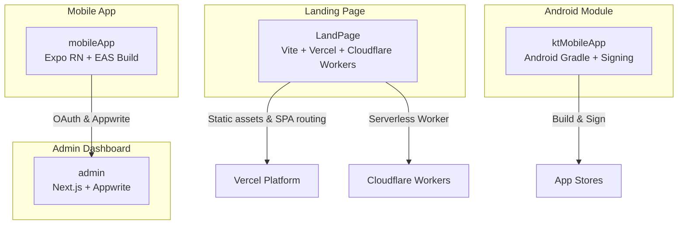
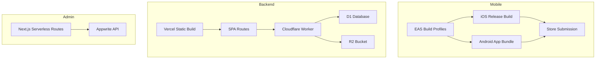
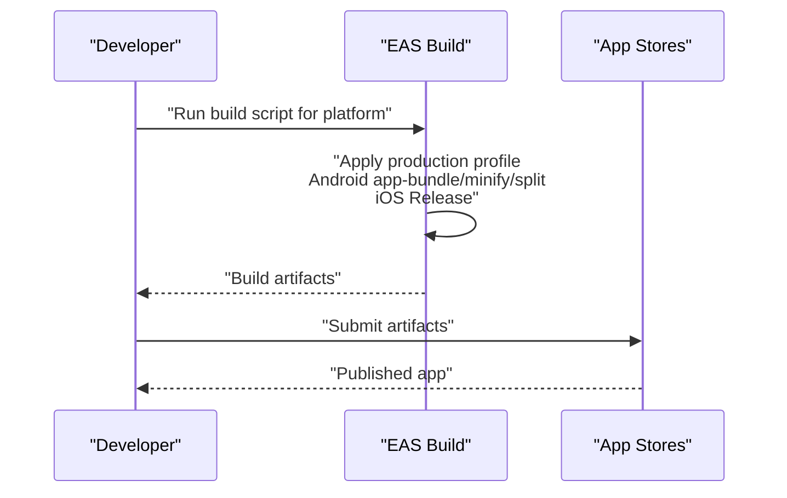
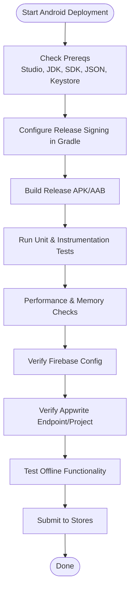
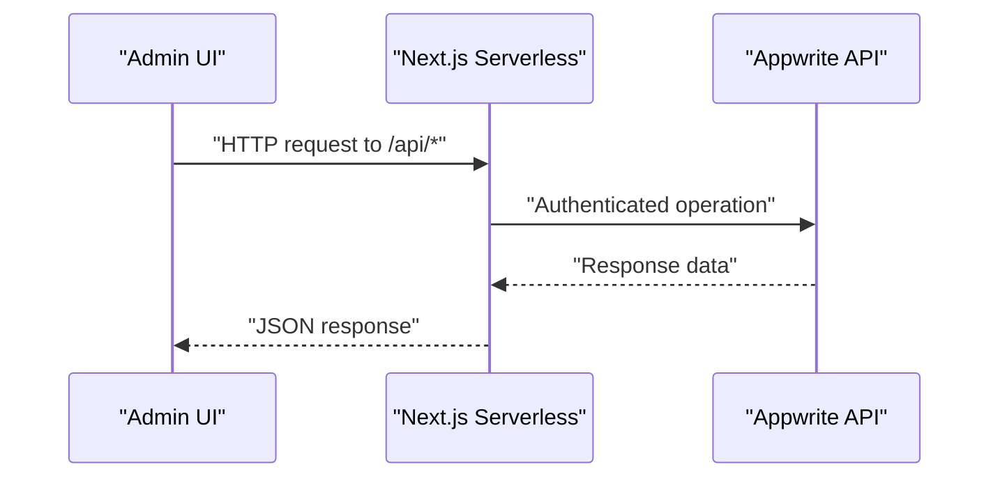
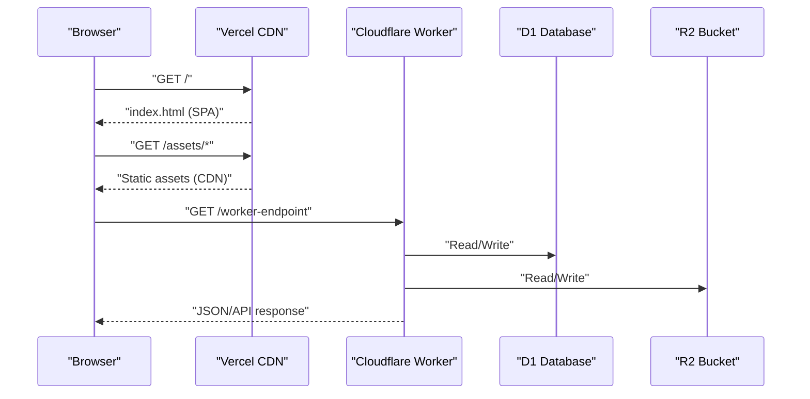
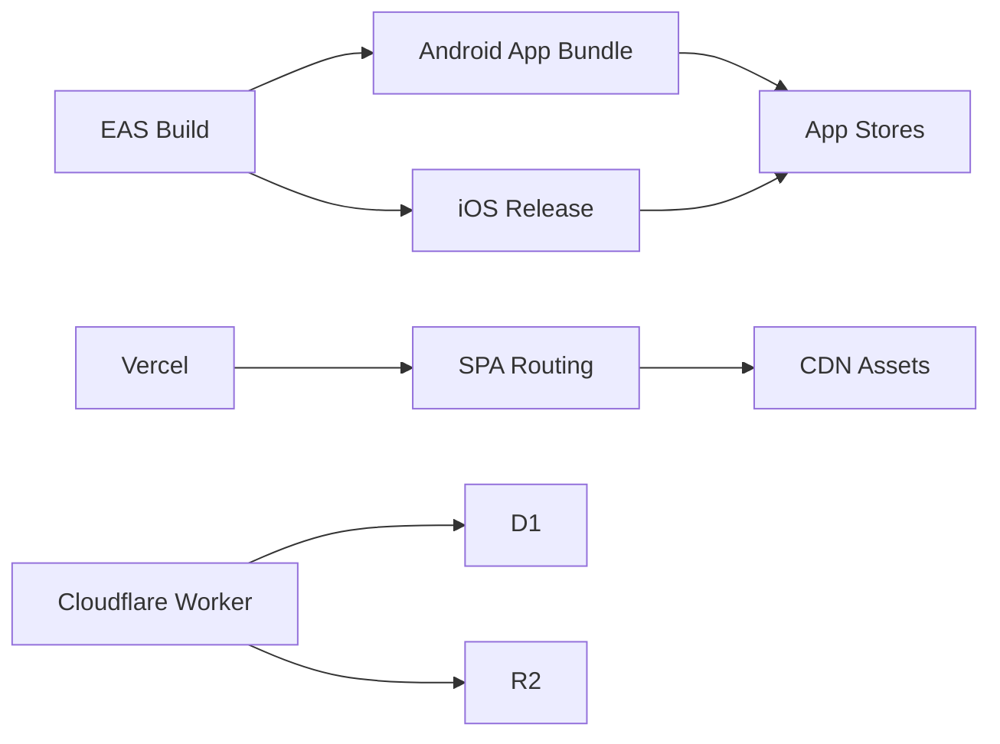

# Deployment and CI/CD

<cite>
**Referenced Files in This Document**
- [eas.json](file://mobileApp/eas.json)
- [package.json](file://mobileApp/package.json)
- [.env.example](file://mobileApp/.env.example)
- [app.json](file://mobileApp/app.json)
- [verify-production-build.js](file://mobileApp/Scripts/verify-production-build.js)
- [test-production-build.js](file://mobileApp/Scripts/test-production-build.js)
- [package.json](file://admin/package.json)
- [.env.example](file://admin/.env.example)
- [APPWRITE_SETUP.md](file://admin/APPWRITE_SETUP.md)
- [vercel.json](file://LandPage/vercel.json)
- [package.json](file://LandPage/package.json)
- [wrangler.json](file://LandPage/wrangler.json)
- [CDN_SETUP_GUIDE.md](file://LandPage/docs/CDN_SETUP_GUIDE.md)
- [VITE_OPTIMIZATION.md](file://LandPage/docs/VITE_OPTIMIZATION.md)
- [DEPLOYMENT.md](file://ktMobileApp/DEPLOYMENT.md)
</cite>

## Table of Contents
1. [Introduction](#introduction)
2. [Project Structure](#project-structure)
3. [Core Components](#core-components)
4. [Architecture Overview](#architecture-overview)
5. [Detailed Component Analysis](#detailed-component-analysis)
6. [Dependency Analysis](#dependency-analysis)
7. [Performance Considerations](#performance-considerations)
8. [Troubleshooting Guide](#troubleshooting-guide)
9. [Conclusion](#conclusion)
10. [Appendices](#appendices)

## Introduction
This document provides comprehensive deployment and CI/CD guidance for the Ekehi Mobile application across all platforms. It covers:
- Mobile app deployment using EAS Build for iOS and Android, including build configuration, code signing, and store submission.
- Backend deployment to Vercel and Cloudflare Workers, including environment configuration and domain setup.
- CI/CD pipeline configuration, automated testing integration, and release management.
- Admin dashboard deployment with Next.js optimization and serverless functions.
- Landing page deployment strategy with CDN configuration and SSL setup.
- Practical examples of deployment commands, environment variable management, and rollback procedures.
- Monitoring setup, health checks, and performance optimization for production environments.

## Project Structure
The repository is organized into four primary areas:
- mobileApp: Expo-based React Native mobile app with EAS Build configuration and environment variables.
- admin: Next.js admin dashboard with serverless API routes and Appwrite integration.
- LandPage: Static landing page with Vite build, Vercel deployment, and Cloudflare Worker integration.
- ktMobileApp: Android Kotlin module with deployment prerequisites and signing guidance.

**Diagram sources**
- [eas.json](file://mobileApp/eas.json#L1-L28)
- [package.json](file://mobileApp/package.json#L1-L41)
- [package.json](file://admin/package.json#L1-L52)
- [vercel.json](file://LandPage/vercel.json#L1-L43)
- [wrangler.json](file://LandPage/wrangler.json#L1-L28)
- [DEPLOYMENT.md](file://ktMobileApp/DEPLOYMENT.md#L1-L137)

**Section sources**
- [eas.json](file://mobileApp/eas.json#L1-L28)
- [package.json](file://mobileApp/package.json#L1-L41)
- [package.json](file://admin/package.json#L1-L52)
- [vercel.json](file://LandPage/vercel.json#L1-L43)
- [wrangler.json](file://LandPage/wrangler.json#L1-L28)
- [DEPLOYMENT.md](file://ktMobileApp/DEPLOYMENT.md#L1-L137)

## Core Components
- Mobile App (Expo RN): EAS Build profiles for production and development, platform-specific build settings, and environment variables for OAuth and Appwrite.
- Admin Dashboard (Next.js): Serverless API routes under app/api, environment variables for Appwrite, and testing with Jest.
- Landing Page (Vite + Vercel + Cloudflare Workers): Static build configuration, SPA routing, and a Cloudflare Worker with D1 and R2 bindings.
- Android Module (Kotlin): Signing configuration, Firebase integration, and release checklist.

**Section sources**
- [eas.json](file://mobileApp/eas.json#L1-L28)
- [package.json](file://mobileApp/package.json#L1-L41)
- [.env.example](file://mobileApp/.env.example#L1-L18)
- [package.json](file://admin/package.json#L1-L52)
- [.env.example](file://admin/.env.example#L1-L16)
- [vercel.json](file://LandPage/vercel.json#L1-L43)
- [wrangler.json](file://LandPage/wrangler.json#L1-L28)
- [DEPLOYMENT.md](file://ktMobileApp/DEPLOYMENT.md#L1-L137)

## Architecture Overview
The deployment architecture spans three major environments:
- Mobile: EAS Build orchestrates Android App Bundles and iOS Release builds, distributing artifacts to stores.
- Backend: Vercel hosts the landing page static assets and handles SPA routing; Cloudflare Workers provide serverless logic with D1/R2 storage.
- Admin: Next.js serverless routes connect to Appwrite for administrative operations.

**Diagram sources**
- [eas.json](file://mobileApp/eas.json#L1-L28)
- [vercel.json](file://LandPage/vercel.json#L1-L43)
- [wrangler.json](file://LandPage/wrangler.json#L1-L28)
- [package.json](file://admin/package.json#L1-L52)

## Detailed Component Analysis

### Mobile App Deployment (EAS Build)
- Build Profiles:
  - Production: Android app-bundle with minify and split; iOS Release configuration with resource class selection; environment variable ENV set to production.
  - Development: developmentClient enabled, internal distribution, platform-specific build types.
- Build Commands:
  - Android: run the script to trigger EAS build for Android.
  - iOS: run the script to trigger EAS build for iOS.
  - Submit to stores: submit scripts for Android and iOS.
- Environment Variables:
  - OAuth redirect URLs for both native deep links and hosted OAuth.
  - Appwrite endpoint, project ID, database ID.
  - Google OAuth client IDs for web, Android, and iOS.
- Verification and Testing:
  - Use verification script to confirm EAS, app, package, Metro, TypeScript, and Babel configurations.
  - Use test script to validate EAS CLI installation, authentication, project info, TypeScript, bundle creation, assets, environment variables, and Appwrite configuration.

**Diagram sources**
- [eas.json](file://mobileApp/eas.json#L1-L28)
- [package.json](file://mobileApp/package.json#L1-L41)

**Section sources**
- [eas.json](file://mobileApp/eas.json#L1-L28)
- [package.json](file://mobileApp/package.json#L1-L41)
- [.env.example](file://mobileApp/.env.example#L1-L18)
- [verify-production-build.js](file://mobileApp/Scripts/verify-production-build.js#L1-L234)
- [test-production-build.js](file://mobileApp/Scripts/test-production-build.js#L1-L180)

### Android Signing and Release (Kotlin Module)
- Prerequisites: Android Studio, JDK, Android SDK API level 34, google-services.json, Appwrite server, keystore for signing.
- Build Types:
  - Debug and Release builds supported.
- Signing Configuration:
  - Configure release signing in Gradle with keystore path, passwords, and aliases.
- Firebase:
  - Place google-services.json in the app directory and ensure package name matches com.ekehi.network.
- Appwrite Configuration:
  - Endpoint and Project ID are hardcoded; update the service initialization to change values.
- Testing and Performance:
  - Run unit and instrumentation tests before release.
  - Optimize ProGuard rules, test performance across devices, and verify offline functionality, push notifications, and analytics.

**Diagram sources**
- [DEPLOYMENT.md](file://ktMobileApp/DEPLOYMENT.md#L1-L137)

**Section sources**
- [DEPLOYMENT.md](file://ktMobileApp/DEPLOYMENT.md#L1-L137)

### Admin Dashboard Deployment (Next.js)
- Environment Variables:
  - Appwrite endpoint, project ID, API key, database ID.
  - Collection IDs for users, profiles, mining sessions, social tasks, achievements, presale purchases, ad views.
- API Routes:
  - Under app/api, serverless endpoints handle ads, metrics, presale, social submissions, users, and wallet operations.
- Appwrite API Key Setup:
  - Create and configure an API key with appropriate scopes in the Appwrite console and update .env accordingly.
- Testing:
  - Use Jest for unit/integration tests; verify social tasks integration via provided script.

**Diagram sources**
- [package.json](file://admin/package.json#L1-L52)
- [.env.example](file://admin/.env.example#L1-L16)
- [APPWRITE_SETUP.md](file://admin/APPWRITE_SETUP.md#L1-L77)

**Section sources**
- [package.json](file://admin/package.json#L1-L52)
- [.env.example](file://admin/.env.example#L1-L16)
- [APPWRITE_SETUP.md](file://admin/APPWRITE_SETUP.md#L1-L77)

### Landing Page Deployment (Vercel + Cloudflare Workers)
- Vercel:
  - Static build using @vercel/static-build with dist output directory.
  - SPA routing to serve index.html for all routes.
  - Asset passthrough for static and favicon.
- Cloudflare Workers:
  - Worker entry points to index.ts with observability and source maps enabled.
  - D1 database and R2 bucket bindings with nodejs_compat flag.
  - Single-page application not-found handling for assets.
- CDN and SSL:
  - Vite base URL switches to CDN in production; content-hashed assets for cache busting.
  - CDN setup guide outlines Cloudflare/AWS/Azure options with SSL and cache policies.

**Diagram sources**
- [vercel.json](file://LandPage/vercel.json#L1-L43)
- [wrangler.json](file://LandPage/wrangler.json#L1-L28)
- [CDN_SETUP_GUIDE.md](file://LandPage/docs/CDN_SETUP_GUIDE.md#L1-L260)
- [VITE_OPTIMIZATION.md](file://LandPage/docs/VITE_OPTIMIZATION.md#L1-L125)

**Section sources**
- [vercel.json](file://LandPage/vercel.json#L1-L43)
- [wrangler.json](file://LandPage/wrangler.json#L1-L28)
- [package.json](file://LandPage/package.json#L1-L45)
- [CDN_SETUP_GUIDE.md](file://LandPage/docs/CDN_SETUP_GUIDE.md#L1-L260)
- [VITE_OPTIMIZATION.md](file://LandPage/docs/VITE_OPTIMIZATION.md#L1-L125)

### CI/CD Pipeline Configuration and Release Management
- Recommended Workflow:
  - Build mobile apps with EAS Build on feature branches and main.
  - Run verification and test scripts prior to production builds.
  - Deploy landing page via Vercel with static build and SPA routing.
  - Deploy Cloudflare Worker with D1/R2 bindings using Wrangler.
  - Deploy admin dashboard with Next.js serverless routes.
- Automated Testing Integration:
  - Use test scripts for production build validation and environment checks.
  - Use Jest for admin dashboard tests.
- Rollback Procedures:
  - Mobile: Revert to previous EAS build artifacts or use store rollbacks.
  - Admin: Roll back Next.js deployment to previous Vercel version.
  - Landing Page: Revert Vercel deployment to previous commit.
  - Cloudflare Worker: Roll back Worker version or switch to previous script.

[No sources needed since this section provides general guidance]

## Dependency Analysis
- Mobile App depends on:
  - EAS Build configuration for platform-specific builds.
  - Environment variables for OAuth and Appwrite.
  - Expo Router and related plugins.
- Admin Dashboard depends on:
  - Next.js serverless routes and Appwrite API key.
  - Environment variables for collections and endpoints.
- Landing Page depends on:
  - Vercel for static hosting and SPA routing.
  - Cloudflare Worker for serverless logic with D1/R2.

**Diagram sources**
- [eas.json](file://mobileApp/eas.json#L1-L28)
- [vercel.json](file://LandPage/vercel.json#L1-L43)
- [wrangler.json](file://LandPage/wrangler.json#L1-L28)

**Section sources**
- [eas.json](file://mobileApp/eas.json#L1-L28)
- [package.json](file://mobileApp/package.json#L1-L41)
- [package.json](file://admin/package.json#L1-L52)
- [vercel.json](file://LandPage/vercel.json#L1-L43)
- [wrangler.json](file://LandPage/wrangler.json#L1-L28)

## Performance Considerations
- Mobile:
  - Use Android App Bundle with minify and split for smaller downloads.
  - Ensure Release build configuration for iOS.
  - Validate TypeScript strictness and Metro inline requires for performance.
- Landing Page:
  - Enable content-hashed assets and CDN base URL in production.
  - Apply code splitting and disable sourcemaps in production.
  - Configure cache policies and SSL for CDN providers.
- Admin Dashboard:
  - Optimize Next.js builds and leverage serverless cold start mitigation.
  - Use environment-specific settings and avoid unnecessary client-side logging.

[No sources needed since this section provides general guidance]

## Troubleshooting Guide
- Mobile:
  - Verify EAS configuration, app identifiers, deep linking scheme, and build scripts.
  - Ensure environment variables for OAuth and Appwrite are set.
  - Run verification and test scripts to detect misconfigurations early.
- Android:
  - Confirm keystore path/passwords and signing configuration.
  - Validate google-services.json placement and package name.
  - Re-run unit and instrumentation tests.
- Admin:
  - Confirm Appwrite API key permissions and collection IDs.
  - Restart development server after .env updates.
- Landing Page:
  - Ensure NODE_ENV=production for CDN base URL.
  - Verify asset uploads and cache headers; invalidate CDN cache when updating hashed assets.

**Section sources**
- [verify-production-build.js](file://mobileApp/Scripts/verify-production-build.js#L1-L234)
- [test-production-build.js](file://mobileApp/Scripts/test-production-build.js#L1-L180)
- [DEPLOYMENT.md](file://ktMobileApp/DEPLOYMENT.md#L1-L137)
- [APPWRITE_SETUP.md](file://admin/APPWRITE_SETUP.md#L1-L77)
- [CDN_SETUP_GUIDE.md](file://LandPage/docs/CDN_SETUP_GUIDE.md#L1-L260)

## Conclusion
This deployment guide consolidates production-grade practices for the Ekehi Mobile ecosystem. By leveraging EAS Build for mobile, Vercel for the landing page, Cloudflare Workers for backend logic, and Next.js for the admin dashboard, teams can achieve reliable, scalable, and secure deployments. Adhering to the verification and testing steps outlined here will minimize risks and streamline release management.

[No sources needed since this section summarizes without analyzing specific files]

## Appendices

### Practical Deployment Commands
- Mobile:
  - Android: run the script to trigger EAS build for Android.
  - iOS: run the script to trigger EAS build for iOS.
  - Submit: use submit scripts for Android and iOS.
- Admin:
  - Development: start Next.js dev server.
  - Build and Start: build and start Next.js production server.
  - Lint and Test: run linter and Jest tests.
- Landing Page:
  - Build: run Vite build.
  - Vercel: use vercel-build script for static builds.
  - Cloudflare: export D1 data and set up auth/list databases.

**Section sources**
- [package.json](file://mobileApp/package.json#L1-L41)
- [package.json](file://admin/package.json#L1-L52)
- [package.json](file://LandPage/package.json#L1-L45)

### Environment Variable Management
- Mobile:
  - OAuth success/failure URLs, Appwrite endpoint/project/database IDs, Google OAuth client IDs.
- Admin:
  - Appwrite endpoint, project ID, API key, database ID, and collection IDs.
- Landing Page:
  - Ensure NODE_ENV=production for CDN base URL and asset hashing.

**Section sources**
- [.env.example](file://mobileApp/.env.example#L1-L18)
- [.env.example](file://admin/.env.example#L1-L16)
- [CDN_SETUP_GUIDE.md](file://LandPage/docs/CDN_SETUP_GUIDE.md#L1-L260)

### Rollback Procedures
- Mobile: revert to previous EAS build artifacts or use store rollbacks.
- Admin: roll back Next.js deployment to previous Vercel version.
- Landing Page: revert Vercel deployment to previous commit.
- Cloudflare Worker: roll back Worker version or switch to previous script.

[No sources needed since this section provides general guidance]

### Monitoring Setup and Health Checks
- Observability:
  - Enable Cloudflare Worker observability and upload source maps.
- Health Checks:
  - Implement SPA fallback and serverless route health endpoints.
  - Monitor CDN cache hit rates and latency.

**Section sources**
- [wrangler.json](file://LandPage/wrangler.json#L1-L28)
- [vercel.json](file://LandPage/vercel.json#L1-L43)