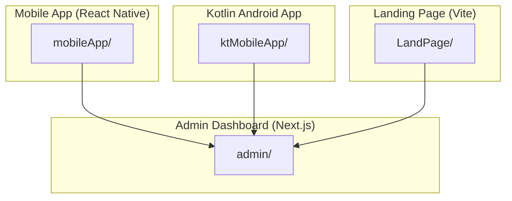
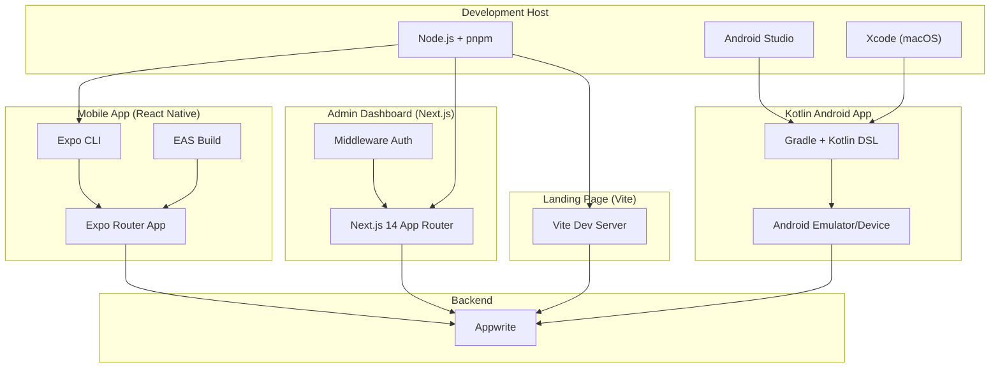
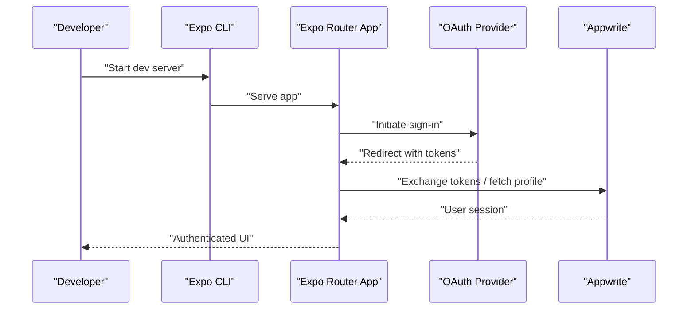
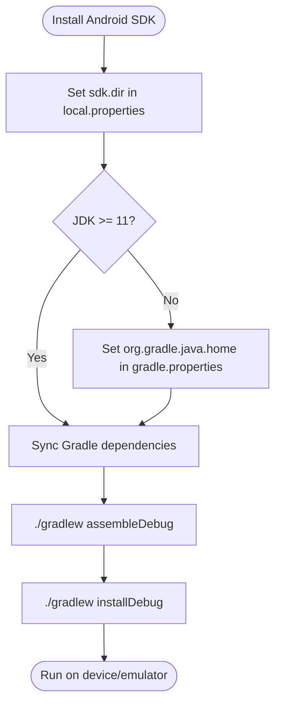
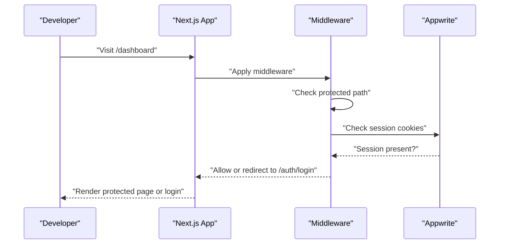
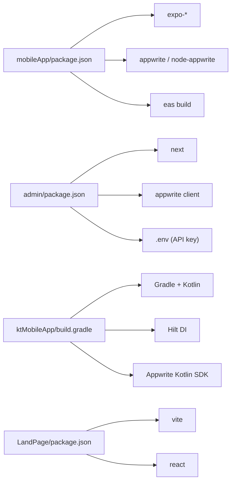

# Getting Started

<cite>
**Referenced Files in This Document**
- [mobileApp README.md](file://mobileApp/README.md)
- [mobileApp package.json](file://mobileApp/package.json)
- [mobileApp .env.example](file://mobileApp/.env.example)
- [mobileApp app.json](file://mobileApp/app.json)
- [mobileApp eas.json](file://mobileApp/eas.json)
- [admin README.md](file://admin/README.md)
- [admin APPWRITE_SETUP.md](file://admin/APPWRITE_SETUP.md)
- [admin .env.example](file://admin/.env.example)
- [admin middleware.ts](file://admin/middleware.ts)
- [LandPage README.md](file://LandPage/README.md)
- [LandPage package.json](file://LandPage/package.json)
- [ktMobileApp README.md](file://ktMobileApp/README.md)
- [ktMobileApp build.gradle](file://ktMobileApp/build.gradle)
- [ktMobileApp gradle.properties](file://ktMobileApp/gradle.properties)
- [ktMobileApp local.properties](file://ktMobileApp/local.properties)
</cite>

## Table of Contents
1. [Introduction](#introduction)
2. [Project Structure](#project-structure)
3. [Core Components](#core-components)
4. [Architecture Overview](#architecture-overview)
5. [Detailed Component Analysis](#detailed-component-analysis)
6. [Dependency Analysis](#dependency-analysis)
7. [Performance Considerations](#performance-considerations)
8. [Troubleshooting Guide](#troubleshooting-guide)
9. [Conclusion](#conclusion)
10. [Appendices](#appendices)

## Introduction
This guide helps first-time contributors set up the Ekehi Mobile project across all platforms: the React Native mobile app, the Kotlin Android app, the Next.js admin dashboard, and the landing page. It covers prerequisites, environment setup, dependency installation, environment variables, database configuration with Appwrite, and verification steps. Platform-specific notes for Windows, macOS, and Linux are included.

## Project Structure
The repository contains four primary projects:
- React Native mobile app (Expo Router)
- Kotlin Android app (Jetpack Compose)
- Next.js admin dashboard
- Landing page (React + Vite)

**Section sources**
- [mobileApp README.md](file://mobileApp/README.md#L38-L83)
- [admin README.md](file://admin/README.md#L58-L67)
- [LandPage README.md](file://LandPage/README.md#L24-L46)
- [ktMobileApp README.md](file://ktMobileApp/README.md#L31-L52)

## Core Components
- React Native mobile app with Expo Router, Appwrite integration, OAuth, and production builds via EAS.
- Kotlin Android app implementing Appwrite backend integration, MVVM with Hilt, and Start.io ads.
- Next.js admin dashboard with App Router, authentication middleware, and Appwrite API key configuration.
- Landing page built with React 19, Vite, Tailwind CSS, and TypeScript.

Key setup anchors:
- Mobile app environment variables and OAuth redirect URLs.
- Admin dashboard environment variables and API key setup.
- Android SDK and JVM configuration for Kotlin app.
- Node.js and pnpm requirements for web apps.

**Section sources**
- [mobileApp .env.example](file://mobileApp/.env.example#L1-L18)
- [admin .env.example](file://admin/.env.example#L1-L16)
- [admin APPWRITE_SETUP.md](file://admin/APPWRITE_SETUP.md#L1-L77)
- [ktMobileApp README.md](file://ktMobileApp/README.md#L55-L61)
- [LandPage package.json](file://LandPage/package.json#L41-L45)
- [admin README.md](file://admin/README.md#L30-L34)

## Architecture Overview
High-level runtime and build architecture across platforms:

**Diagram sources**
- [mobileApp README.md](file://mobileApp/README.md#L38-L83)
- [mobileApp package.json](file://mobileApp/package.json#L1-L108)
- [ktMobileApp build.gradle](file://ktMobileApp/build.gradle#L1-L9)
- [admin README.md](file://admin/README.md#L28-L56)
- [admin middleware.ts](file://admin/middleware.ts#L1-L70)
- [LandPage package.json](file://LandPage/package.json#L41-L45)

## Detailed Component Analysis

### React Native Mobile App (Expo)
- Prerequisites: Node.js v16+, pnpm, Expo CLI, Android Studio/Xcode.
- Installation: Install dependencies and start the dev server.
- OAuth configuration: Configure redirect URLs and Appwrite OAuth platforms.
- Production builds: Use EAS for Android/iOS bundles.

**Diagram sources**
- [mobileApp README.md](file://mobileApp/README.md#L38-L67)
- [mobileApp README.md](file://mobileApp/README.md#L84-L104)
- [mobileApp app.json](file://mobileApp/app.json#L18-L71)
- [mobileApp .env.example](file://mobileApp/.env.example#L1-L18)

Setup steps:
- Install dependencies using pnpm.
- Copy .env.example to .env and fill in Appwrite and OAuth placeholders.
- Start the dev server and run on Android/iOS/web.
- Configure OAuth redirect URLs in Appwrite Console.

Verification:
- Run OAuth config tests and production readiness scripts.
- Confirm environment variables are loaded.

Platform notes:
- Windows/macOS/Linux supported for development; Android Studio/Xcode required for device/emulator builds.

**Section sources**
- [mobileApp README.md](file://mobileApp/README.md#L38-L67)
- [mobileApp README.md](file://mobileApp/README.md#L84-L104)
- [mobileApp package.json](file://mobileApp/package.json#L1-L108)
- [mobileApp .env.example](file://mobileApp/.env.example#L1-L18)
- [mobileApp app.json](file://mobileApp/app.json#L18-L71)
- [mobileApp eas.json](file://mobileApp/eas.json#L1-L28)

### Kotlin Android App (Jetpack Compose)
- Prerequisites: Android Studio, Kotlin 1.9+, Android SDK API 34, JDK 11+ (JDK 17 recommended).
- Android SDK setup: Install via Android Studio or command-line tools and set sdk.dir.
- JVM configuration: Ensure gradle.properties points to a compatible JDK.
- Build and run: Use Gradle commands to assemble debug/release APKs.

**Diagram sources**
- [ktMobileApp README.md](file://ktMobileApp/README.md#L62-L98)
- [ktMobileApp README.md](file://ktMobileApp/README.md#L108-L130)
- [ktMobileApp local.properties](file://ktMobileApp/local.properties#L1-L9)
- [ktMobileApp gradle.properties](file://ktMobileApp/gradle.properties#L1-L12)
- [ktMobileApp build.gradle](file://ktMobileApp/build.gradle#L1-L9)

Setup steps:
- Install Android SDK and configure sdk.dir.
- Ensure JDK 11+ and set org.gradle.java.home.
- Open project in Android Studio and sync Gradle.
- Build and install debug APK.

Verification:
- Confirm successful Gradle sync and APK build.
- Test on a connected device or emulator.

Common issues:
- Unsupported class file major version: switch to JDK 17 and restart Gradle daemon.
- Resource merge errors: check XML files and line endings.

**Section sources**
- [ktMobileApp README.md](file://ktMobileApp/README.md#L55-L61)
- [ktMobileApp README.md](file://ktMobileApp/README.md#L108-L130)
- [ktMobileApp local.properties](file://ktMobileApp/local.properties#L1-L9)
- [ktMobileApp gradle.properties](file://ktMobileApp/gradle.properties#L1-L12)
- [ktMobileApp build.gradle](file://ktMobileApp/build.gradle#L1-L9)

### Next.js Admin Dashboard
- Prerequisites: Node.js 18+, pnpm.
- Installation: Install dependencies with pnpm.
- Development: Start dev server on port 3000.
- Production: Build and start with pnpm scripts.
- Authentication: Middleware checks Appwrite session cookies for protected routes.

**Diagram sources**
- [admin README.md](file://admin/README.md#L28-L56)
- [admin middleware.ts](file://admin/middleware.ts#L1-L70)

Setup steps:
- Install dependencies with pnpm.
- Copy .env.example to .env and set Appwrite endpoint, project ID, API key, and collection IDs.
- Start dev server and log in via Appwrite session cookies.

Verification:
- Access protected pages and confirm middleware redirects unauthenticated users.
- Validate API endpoints for social tasks and user management.

Common issues:
- Unauthorized errors: ensure API key has correct scopes and environment variables are correctly set.

**Section sources**
- [admin README.md](file://admin/README.md#L28-L56)
- [admin .env.example](file://admin/.env.example#L1-L16)
- [admin APPWRITE_SETUP.md](file://admin/APPWRITE_SETUP.md#L1-L77)
- [admin middleware.ts](file://admin/middleware.ts#L1-L70)

### Landing Page (React + Vite)
- Prerequisites: Node.js 18+, pnpm.
- Installation: Install dependencies with pnpm.
- Development: Start dev server and preview locally.
- Build: Produce optimized production bundle.

Setup steps:
- Install dependencies with pnpm.
- Start dev server and verify the landing page loads.

Verification:
- Confirm all sections render and navigation works.

**Section sources**
- [LandPage README.md](file://LandPage/README.md#L47-L67)
- [LandPage package.json](file://LandPage/package.json#L41-L45)

## Dependency Analysis
- Mobile app depends on Expo, Appwrite client libraries, and EAS for builds.
- Admin dashboard depends on Next.js App Router, Appwrite SDK, and environment variables for API key.
- Kotlin app depends on Gradle, Kotlin Android plugin, Hilt, and Appwrite/Kotlin SDK.
- Landing page depends on Vite, React 19, and Tailwind CSS.

**Diagram sources**
- [mobileApp package.json](file://mobileApp/package.json#L42-L86)
- [mobileApp package.json](file://mobileApp/package.json#L87-L108)
- [admin README.md](file://admin/README.md#L28-L56)
- [ktMobileApp build.gradle](file://ktMobileApp/build.gradle#L1-L9)
- [LandPage package.json](file://LandPage/package.json#L1-L45)

**Section sources**
- [mobileApp package.json](file://mobileApp/package.json#L42-L86)
- [ktMobileApp build.gradle](file://ktMobileApp/build.gradle#L1-L9)
- [LandPage package.json](file://LandPage/package.json#L1-L45)

## Performance Considerations
- Prefer pnpm for faster installs and smaller lockfiles.
- Keep Node.js versions aligned with project engines requirements.
- Use EAS for optimized production builds with minification and splitting.
- For Android, ensure JDK 17 for best Gradle compatibility and faster builds.

[No sources needed since this section provides general guidance]

## Troubleshooting Guide
Common setup issues and resolutions:

- Node.js and package manager
  - Ensure Node.js meets minimum versions for each project.
  - Use pnpm consistently to avoid dependency conflicts.

- Mobile app OAuth redirect errors
  - Verify redirect URLs in Appwrite Console match those in .env.example and app.json.
  - Confirm OAuth platforms configured for mobile and web.

- Admin dashboard unauthorized errors
  - Generate and paste a valid Appwrite API key with required scopes.
  - Restart the dev server after updating .env.

- Android SDK and JVM issues
  - Set sdk.dir in local.properties to your Android SDK path.
  - Set org.gradle.java.home to a JDK 11+ installation (prefer JDK 17).
  - Stop Gradle daemons and clean the project if encountering class file version errors.

- Windows/macOS/Linux specifics
  - Windows: ensure paths use proper separators and avoid spaces in SDK path.
  - macOS: use Android Studio’s bundled SDK or set sdk.dir to a non-root location.
  - Linux: ensure JDK and Android SDK permissions are correct.

**Section sources**
- [mobileApp README.md](file://mobileApp/README.md#L152-L167)
- [mobileApp app.json](file://mobileApp/app.json#L18-L71)
- [admin APPWRITE_SETUP.md](file://admin/APPWRITE_SETUP.md#L40-L77)
- [ktMobileApp README.md](file://ktMobileApp/README.md#L108-L130)
- [ktMobileApp README.md](file://ktMobileApp/README.md#L121-L130)
- [ktMobileApp local.properties](file://ktMobileApp/local.properties#L1-L9)
- [ktMobileApp gradle.properties](file://ktMobileApp/gradle.properties#L1-L12)

## Conclusion
You now have a complete, platform-specific guide to set up the Ekehi Mobile project. Follow the environment and dependency steps for each project, configure Appwrite and environment variables, and use the verification steps to ensure everything runs smoothly. Refer to platform-specific troubleshooting notes for Windows, macOS, and Linux.

[No sources needed since this section summarizes without analyzing specific files]

## Appendices

### Environment Variable Reference
- Mobile app (.env.example):
  - OAuth success/failure URLs
  - Appwrite project ID, endpoint, database ID
  - Google OAuth client IDs for Web/Android/iOS

- Admin dashboard (.env.example):
  - Appwrite endpoint, project ID, API key
  - Collection IDs for users, profiles, sessions, tasks, achievements, purchases, views

- Kotlin app:
  - Appwrite endpoint/project/database IDs are embedded in code per project documentation

**Section sources**
- [mobileApp .env.example](file://mobileApp/.env.example#L1-L18)
- [admin .env.example](file://admin/.env.example#L1-L16)
- [ktMobileApp README.md](file://ktMobileApp/README.md#L177-L185)

### Initial Contributor Workflow
- Fork and clone the repository.
- Install dependencies using pnpm for web projects and Gradle for Android.
- Copy .env.example to .env and fill in values.
- Start dev servers for the chosen platform(s).
- Run verification scripts (e.g., OAuth config tests, production readiness reports).
- Submit a pull request after testing.

**Section sources**
- [mobileApp README.md](file://mobileApp/README.md#L168-L178)
- [admin README.md](file://admin/README.md#L104-L109)
- [LandPage README.md](file://LandPage/README.md#L70-L82)
- [ktMobileApp README.md](file://ktMobileApp/README.md#L199-L209)