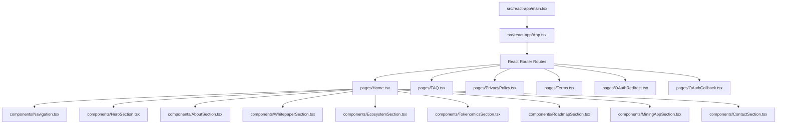
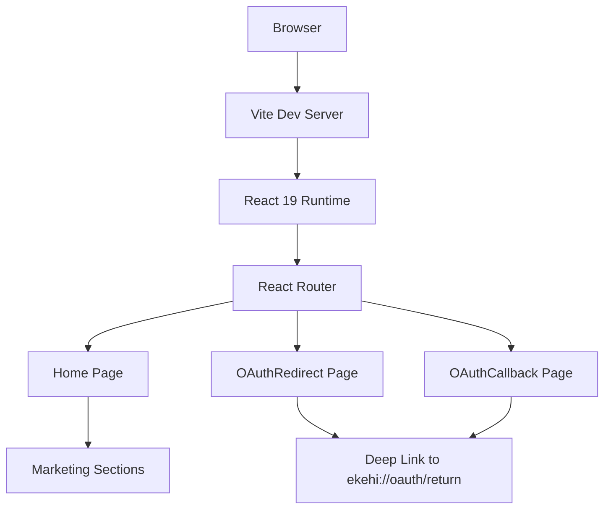
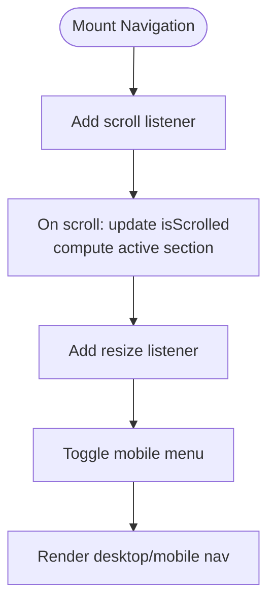
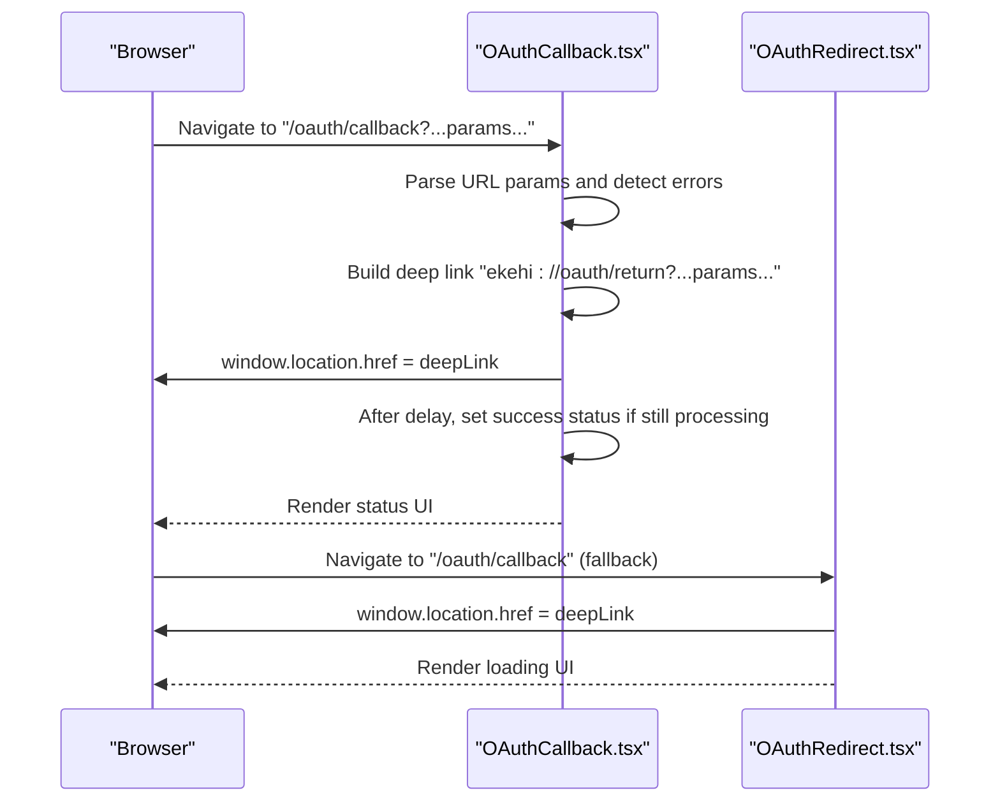
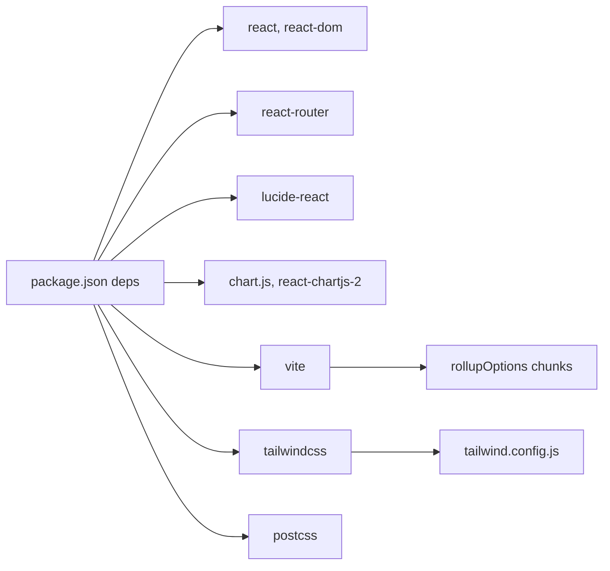

# Landing Page (Marketing Website)

<cite>
**Referenced Files in This Document**
- [README.md](file://LandPage/README.md)
- [package.json](file://LandPage/package.json)
- [vite.config.ts](file://LandPage/vite.config.ts)
- [tailwind.config.js](file://LandPage/tailwind.config.js)
- [src/react-app/main.tsx](file://LandPage/src/react-app/main.tsx)
- [src/react-app/App.tsx](file://LandPage/src/react-app/App.tsx)
- [src/react-app/pages/Home.tsx](file://LandPage/src/react-app/pages/Home.tsx)
- [src/react-app/pages/OAuthRedirect.tsx](file://LandPage/src/react-app/pages/OAuthRedirect.tsx)
- [src/react-app/pages/OAuthCallback.tsx](file://LandPage/src/react-app/pages/OAuthCallback.tsx)
- [src/react-app/components/Navigation.tsx](file://LandPage/src/react-app/components/Navigation.tsx)
- [src/react-app/components/HeroSection.tsx](file://LandPage/src/react-app/components/HeroSection.tsx)
- [src/react-app/components/AboutSection.tsx](file://LandPage/src/react-app/components/AboutSection.tsx)
- [src/react-app/components/WhitepaperSection.tsx](file://LandPage/src/react-app/components/WhitepaperSection.tsx)
- [src/react-app/components/EcosystemSection.tsx](file://LandPage/src/react-app/components/EcosystemSection.tsx)
- [src/react-app/components/TokenomicsSection.tsx](file://LandPage/src/react-app/components/TokenomicsSection.tsx)
- [src/react-app/components/RoadmapSection.tsx](file://LandPage/src/react-app/components/RoadmapSection.tsx)
- [src/react-app/components/MiningAppSection.tsx](file://LandPage/src/react-app/components/MiningAppSection.tsx)
- [src/react-app/components/ContactSection.tsx](file://LandPage/src/react-app/components/ContactSection.tsx)
</cite>

## Table of Contents
1. [Introduction](#introduction)
2. [Project Structure](#project-structure)
3. [Core Components](#core-components)
4. [Architecture Overview](#architecture-overview)
5. [Detailed Component Analysis](#detailed-component-analysis)
6. [Dependency Analysis](#dependency-analysis)
7. [Performance Considerations](#performance-considerations)
8. [Troubleshooting Guide](#troubleshooting-guide)
9. [Conclusion](#conclusion)
10. [Appendices](#appendices)

## Introduction
This document describes the marketing landing page for the Ekehi Network. Built with React 19, TypeScript, and Vite, the site emphasizes a responsive, visually rich experience powered by Tailwind CSS and Lucide React icons. It presents the brand story, tokenomics, roadmap, ecosystem, and contact information, and integrates a mobile OAuth redirection flow that sends users back to the native app after authentication.

Key capabilities:
- Modern, mobile-first UI with smooth animations and transitions
- Marketing sections for hero presentation, tokenomics, roadmap, ecosystem showcase, and contact
- Routing with React Router and lazy-loaded pages
- OAuth callback handling and deep-link redirection to the mobile app
- Tailwind-based theming and responsive breakpoints
- Optimized builds with Vite and CDN-friendly asset naming

**Section sources**
- [README.md](file://LandPage/README.md#L1-L82)

## Project Structure
The marketing site is organized around a small set of pages and reusable marketing components. Pages are lazy-loaded for performance, and the app uses a single route configuration with a PDF redirect route.

**Diagram sources**
- [src/react-app/main.tsx](file://LandPage/src/react-app/main.tsx#L1-L11)
- [src/react-app/App.tsx](file://LandPage/src/react-app/App.tsx#L1-L50)
- [src/react-app/pages/Home.tsx](file://LandPage/src/react-app/pages/Home.tsx#L1-L55)

**Section sources**
- [README.md](file://LandPage/README.md#L24-L46)
- [src/react-app/App.tsx](file://LandPage/src/react-app/App.tsx#L1-L50)

## Core Components
- Navigation: Sticky desktop and overlay mobile navigation with active-state detection and scroll-aware styling.
- HeroSection: Animated hero with floating particles, animated stats, and CTAs.
- AboutSection: Feature cards with expandable descriptions and community badges.
- WhitepaperSection: Interactive chapter navigator with desktop and mobile layouts.
- EcosystemSection: Centralized ecosystem visualization with product cards and status badges.
- TokenomicsSection: Interactive doughnut chart, burn mechanism, token stats, and utilities.
- RoadmapSection: Multi-phase timeline with progress bars and milestone indicators.
- MiningAppSection: App preview, stats, and download CTA with ready/coming-soon state.
- ContactSection: Contact methods, social links, and a contact form with submission feedback.

**Section sources**
- [src/react-app/components/Navigation.tsx](file://LandPage/src/react-app/components/Navigation.tsx#L1-L227)
- [src/react-app/components/HeroSection.tsx](file://LandPage/src/react-app/components/HeroSection.tsx#L1-L118)
- [src/react-app/components/AboutSection.tsx](file://LandPage/src/react-app/components/AboutSection.tsx#L1-L126)
- [src/react-app/components/WhitepaperSection.tsx](file://LandPage/src/react-app/components/WhitepaperSection.tsx#L1-L467)
- [src/react-app/components/EcosystemSection.tsx](file://LandPage/src/react-app/components/EcosystemSection.tsx#L1-L343)
- [src/react-app/components/TokenomicsSection.tsx](file://LandPage/src/react-app/components/TokenomicsSection.tsx#L1-L258)
- [src/react-app/components/RoadmapSection.tsx](file://LandPage/src/react-app/components/RoadmapSection.tsx#L1-L309)
- [src/react-app/components/MiningAppSection.tsx](file://LandPage/src/react-app/components/MiningAppSection.tsx#L1-L179)
- [src/react-app/components/ContactSection.tsx](file://LandPage/src/react-app/components/ContactSection.tsx#L1-L315)

## Architecture Overview
The runtime architecture centers on a React 19 app bootstrapped via Vite. Routing is handled by React Router with lazy-loaded pages. The homepage composes marketing sections that share common styling and interaction patterns. OAuth flows are handled by dedicated pages that redirect to the mobile app via a deep link.

**Diagram sources**
- [src/react-app/main.tsx](file://LandPage/src/react-app/main.tsx#L1-L11)
- [src/react-app/App.tsx](file://LandPage/src/react-app/App.tsx#L1-L50)
- [src/react-app/pages/OAuthRedirect.tsx](file://LandPage/src/react-app/pages/OAuthRedirect.tsx#L1-L32)
- [src/react-app/pages/OAuthCallback.tsx](file://LandPage/src/react-app/pages/OAuthCallback.tsx#L1-L107)

## Detailed Component Analysis

### Navigation Component
Responsibilities:
- Detects scroll position to adjust styling and backdrop blur
- Tracks active section via intersection-like logic
- Provides desktop and mobile navigation with overlay menu
- Removes wallet connect button as requested

Patterns:
- Scroll listener for sticky header and active section detection
- Conditional rendering for desktop vs mobile
- Controlled overlay menu state

**Diagram sources**
- [src/react-app/components/Navigation.tsx](file://LandPage/src/react-app/components/Navigation.tsx#L1-L227)

**Section sources**
- [src/react-app/components/Navigation.tsx](file://LandPage/src/react-app/components/Navigation.tsx#L1-L227)

### Hero Section
Responsibilities:
- Renders animated radial gradient background and floating particles
- Animates headline, tagline, and CTA buttons with staggered delays
- Displays key stats with fade-in and slide-up animations
- Provides a scroll indicator to subsequent sections

Patterns:
- Animation classes from Tailwind config
- Dynamic visibility state on mount
- Responsive grid for stats

**Section sources**
- [src/react-app/components/HeroSection.tsx](file://LandPage/src/react-app/components/HeroSection.tsx#L1-L118)

### Tokenomics Section
Responsibilities:
- Visualizes token distribution with a doughnut chart
- Provides interactive tooltips and click selection
- Displays burn mechanism, token stats, and utilities
- Supports hover and click interactions

Patterns:
- Chart.js integration with react-chartjs-2
- Local state for active distribution and expanded utilities
- Tailwind-based theming and responsive layout

**Section sources**
- [src/react-app/components/TokenomicsSection.tsx](file://LandPage/src/react-app/components/TokenomicsSection.tsx#L1-L258)

### Roadmap Section
Responsibilities:
- Presents multi-phase roadmap with dynamic progress calculation
- Visualizes completed and in-progress milestones
- Provides long-term vision cards and CTA actions

Patterns:
- Computed progress percentages per phase
- Gradient progress bars with animated in-progress segment
- Status-based icons and colors

**Section sources**
- [src/react-app/components/RoadmapSection.tsx](file://LandPage/src/react-app/components/RoadmapSection.tsx#L1-L309)

### Ecosystem Section
Responsibilities:
- Centralized ecosystem visualization with product cards
- Status badges and feature lists
- Mobile and desktop layouts with consistent interactions

Patterns:
- Expandable cards with chevron rotation
- Status mapping to badge text and border colors
- Responsive grid with sticky header on desktop

**Section sources**
- [src/react-app/components/EcosystemSection.tsx](file://LandPage/src/react-app/components/EcosystemSection.tsx#L1-L343)

### Whitepaper Section
Responsibilities:
- Interactive chapter navigation with desktop and mobile views
- Highlights and statistics for “Why Ekehi”
- CTA to download the whitepaper

Patterns:
- Active chapter state management
- Mobile expansion for chapter content
- Sticky TOC on desktop

**Section sources**
- [src/react-app/components/WhitepaperSection.tsx](file://LandPage/src/react-app/components/WhitepaperSection.tsx#L1-L467)

### Mining App Section
Responsibilities:
- App preview with stats and download CTA
- Feature cards with expandable descriptions
- Ready/coming-soon state persisted in localStorage

Patterns:
- Local storage persistence for app availability
- Conditional rendering based on readiness flag
- Responsive grid and card interactions

**Section sources**
- [src/react-app/components/MiningAppSection.tsx](file://LandPage/src/react-app/components/MiningAppSection.tsx#L1-L179)

### Contact Section
Responsibilities:
- Contact methods with expandable action buttons
- Social links to community channels
- Functional contact form with validation and submission feedback

Patterns:
- Form state management with controlled inputs
- Submission lifecycle with idle/success/error states
- External link handling with safe attributes

**Section sources**
- [src/react-app/components/ContactSection.tsx](file://LandPage/src/react-app/components/ContactSection.tsx#L1-L315)

### OAuth Integration and Redirection
The OAuth flow is designed to return users to the mobile app after authentication. Two pages handle the flow:
- OAuthCallback: Parses query parameters, detects errors, constructs a deep link, attempts redirection, and displays status messages with a timeout fallback.
- OAuthRedirect: Mirrors the callback behavior for simpler redirects.

**Diagram sources**
- [src/react-app/pages/OAuthCallback.tsx](file://LandPage/src/react-app/pages/OAuthCallback.tsx#L1-L107)
- [src/react-app/pages/OAuthRedirect.tsx](file://LandPage/src/react-app/pages/OAuthRedirect.tsx#L1-L32)

**Section sources**
- [src/react-app/pages/OAuthCallback.tsx](file://LandPage/src/react-app/pages/OAuthCallback.tsx#L1-L107)
- [src/react-app/pages/OAuthRedirect.tsx](file://LandPage/src/react-app/pages/OAuthRedirect.tsx#L1-L32)

## Dependency Analysis
The project relies on React 19, React Router for routing, Lucide React for icons, Chart.js with react-chartjs-2 for tokenomics visuals, and Tailwind CSS for styling. Vite handles bundling, dev server, and production builds.

**Diagram sources**
- [package.json](file://LandPage/package.json#L1-L45)
- [vite.config.ts](file://LandPage/vite.config.ts#L1-L52)
- [tailwind.config.js](file://LandPage/tailwind.config.js#L1-L72)

**Section sources**
- [package.json](file://LandPage/package.json#L1-L45)
- [vite.config.ts](file://LandPage/vite.config.ts#L1-L52)
- [tailwind.config.js](file://LandPage/tailwind.config.js#L1-L72)

## Performance Considerations
- Code splitting and lazy loading: Routes are lazy-loaded to reduce initial bundle size.
- Chunking strategy: Vite groups libraries into named chunks (vendor, ui, charts, routing, validation) for caching.
- Asset naming: Content-hashed filenames enable long-term caching and CDN-friendly delivery.
- CSS split and inlining limits: CSS is split and small assets are inlined to balance HTTP/2 multiplexing and payload size.
- Sourcemaps: Disabled in production to reduce bundle size.
- Mobile-first build: Define flags and base URL configured for optimal mobile delivery.

Recommendations:
- Keep icons scoped to pages/components to avoid importing entire icon libraries.
- Defer heavy chart rendering until visible or on demand.
- Use image optimization and appropriate formats for logos and previews.
- Monitor Largest Contentful Paint (LCP) and First Input Delay (FID) metrics in production.

**Section sources**
- [vite.config.ts](file://LandPage/vite.config.ts#L1-L52)

## Troubleshooting Guide
Common issues and resolutions:
- OAuth deep link not opening app:
  - Verify the deep link scheme and that the mobile app registers it.
  - Confirm query parameters are preserved and appended to the deep link.
  - Test fallback behavior by navigating to the redirect page.
- Redirect loop or missing parameters:
  - Ensure the OAuth provider returns valid parameters and no error is present.
  - Inspect the URL for unexpected fragments or malformed parameters.
- Chart rendering anomalies:
  - Ensure Chart.js is registered and the container has explicit dimensions.
  - Avoid rendering charts SSR; initialize in effects or client-only environments.
- Navigation active state not updating:
  - Confirm section IDs match navigation anchors and that scroll thresholds are appropriate.
- Tailwind utilities not applied:
  - Verify content paths in Tailwind config include component directories.
  - Rebuild after adding new Tailwind classes.

**Section sources**
- [src/react-app/pages/OAuthCallback.tsx](file://LandPage/src/react-app/pages/OAuthCallback.tsx#L1-L107)
- [src/react-app/pages/OAuthRedirect.tsx](file://LandPage/src/react-app/pages/OAuthRedirect.tsx#L1-L32)
- [src/react-app/components/TokenomicsSection.tsx](file://LandPage/src/react-app/components/TokenomicsSection.tsx#L1-L258)
- [src/react-app/components/Navigation.tsx](file://LandPage/src/react-app/components/Navigation.tsx#L1-L227)
- [tailwind.config.js](file://LandPage/tailwind.config.js#L1-L72)

## Conclusion
The marketing landing page is a cohesive, performance-conscious React application that communicates the Ekehi brand effectively. Its modular component design, responsive Tailwind-based styling, and optimized build pipeline deliver a strong user experience across devices. The OAuth redirection flow is streamlined and robust, ensuring users return to the mobile app seamlessly. With clear patterns for marketing sections, routing, and styling, the site is straightforward to extend and maintain.

[No sources needed since this section summarizes without analyzing specific files]

## Appendices

### SEO and Meta Tags
- Add canonical URLs and meta descriptions in the HTML head for each page.
- Ensure images have descriptive alt attributes and compressed formats.
- Use semantic headings and structured content for accessibility and SEO.

[No sources needed since this section provides general guidance]

### Static Assets and CDN
- Place images and logos under the public root to avoid bundling overhead.
- Configure base path and CDN headers in production deployments.
- Use hashed asset names for cache busting.

**Section sources**
- [vite.config.ts](file://LandPage/vite.config.ts#L1-L52)

### Deployment Checklist
- Build with Vite and serve the dist folder statically.
- Configure environment variables for production.
- Set up redirects for the whitepaper PDF route.
- Monitor performance metrics and error logs post-deploy.

**Section sources**
- [src/react-app/App.tsx](file://LandPage/src/react-app/App.tsx#L1-L50)
- [vite.config.ts](file://LandPage/vite.config.ts#L1-L52)