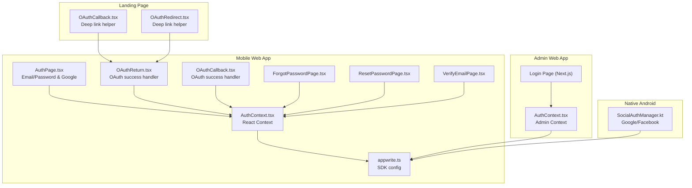
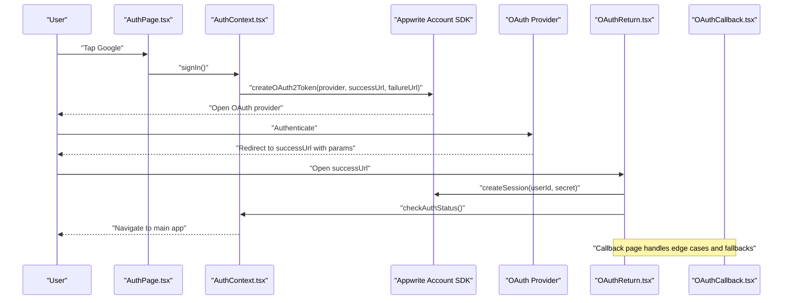
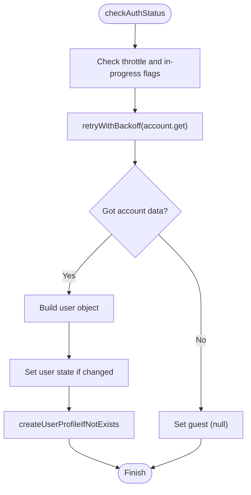
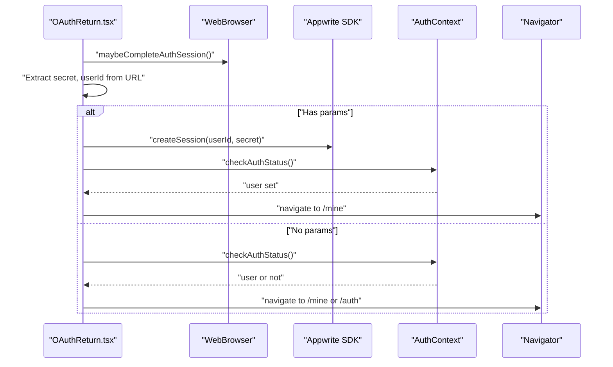
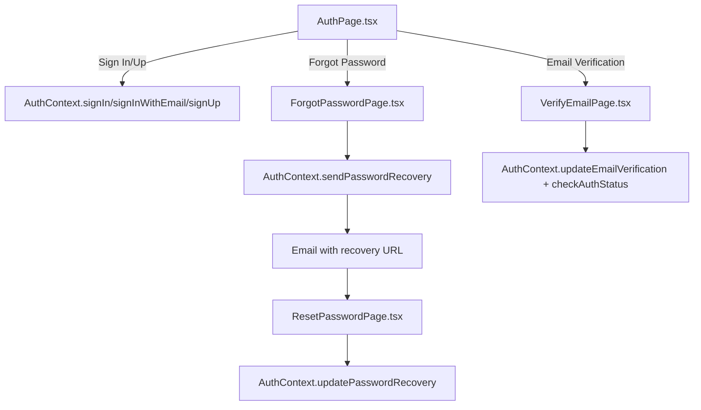
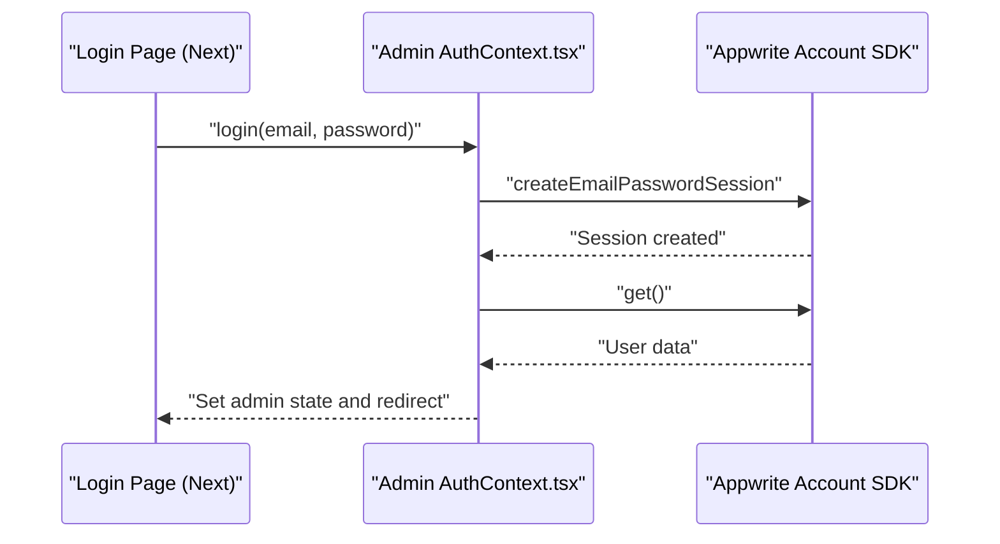
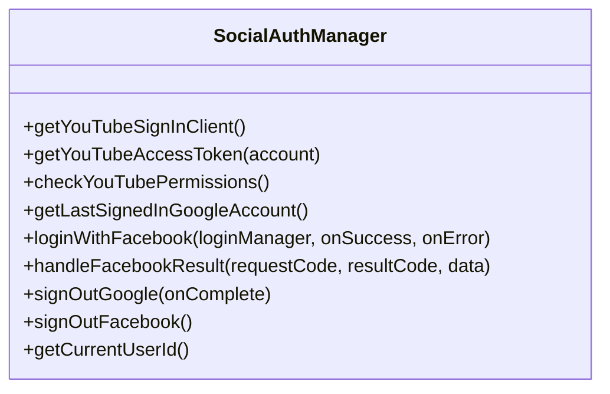
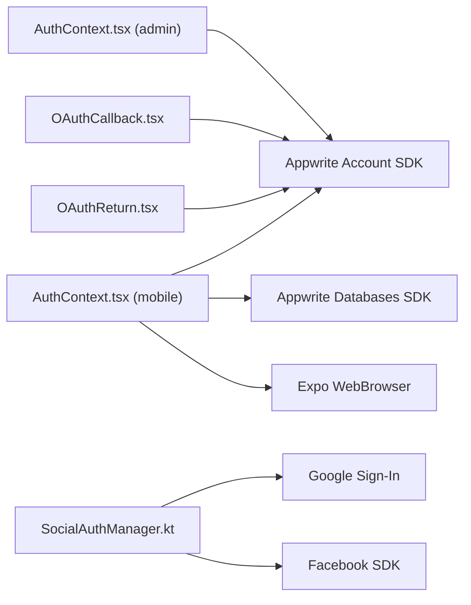

# Authentication System

<cite>
**Referenced Files in This Document**
- [AuthContext.tsx](file://mobileApp/src/contexts/AuthContext.tsx)
- [AuthContext.tsx](file://admin/contexts/AuthContext.tsx)
- [appwrite.ts](file://mobileApp/src/config/appwrite.ts)
- [OAuthReturn.tsx](file://mobileApp/app/oauth/return.tsx)
- [OAuthCallback.tsx](file://mobileApp/app/oauth/callback.tsx)
- [AuthPage.tsx](file://mobileApp/app/auth.tsx)
- [ForgotPasswordPage.tsx](file://mobileApp/app/forgot-password.tsx)
- [ResetPasswordPage.tsx](file://mobileApp/app/reset-password.tsx)
- [VerifyEmailPage.tsx](file://mobileApp/app/verify-email.tsx)
- [OAuthCallback.tsx](file://LandPage/src/react-app/pages/OAuthCallback.tsx)
- [OAuthRedirect.tsx](file://LandPage/src/react-app/pages/OAuthRedirect.tsx)
- [SocialAuthManager.kt](file://ktMobileApp/app/src/main/java/com/ekehi/network/auth/SocialAuthManager.kt)
</cite>

## Table of Contents
1. [Introduction](#introduction)
2. [Project Structure](#project-structure)
3. [Core Components](#core-components)
4. [Architecture Overview](#architecture-overview)
5. [Detailed Component Analysis](#detailed-component-analysis)
6. [Dependency Analysis](#dependency-analysis)
7. [Performance Considerations](#performance-considerations)
8. [Troubleshooting Guide](#troubleshooting-guide)
9. [Conclusion](#conclusion)

## Introduction
This document explains the authentication system across the ekehi-mobile project, focusing on:
- OAuth integration with Google, Facebook, and Appwrite-backed email/password flows
- AuthContext implementation for login/logout, session management, and token handling
- User registration, email verification, and password reset workflows
- Authentication state management, protected routing, and security considerations
- Concrete examples from the codebase for OAuth callback handling, user profile management, and authentication guards
- Configuration options for providers, error handling strategies, and security best practices

## Project Structure
The authentication system spans three primary areas:
- Mobile web app (Expo Router): email/password and Google OAuth flows, plus password recovery and email verification
- Admin Next.js app: email/password admin login
- Native Android app: Google and Facebook OAuth integration for task verification and social logins

**Diagram sources**
- [AuthPage.tsx](file://mobileApp/app/auth.tsx#L1-L444)
- [OAuthReturn.tsx](file://mobileApp/app/oauth/return.tsx#L1-L220)
- [OAuthCallback.tsx](file://mobileApp/app/oauth/callback.tsx#L1-L159)
- [ForgotPasswordPage.tsx](file://mobileApp/app/forgot-password.tsx#L1-L242)
- [ResetPasswordPage.tsx](file://mobileApp/app/reset-password.tsx#L1-L276)
- [VerifyEmailPage.tsx](file://mobileApp/app/verify-email.tsx#L1-L145)
- [AuthContext.tsx](file://mobileApp/src/contexts/AuthContext.tsx#L1-L724)
- [appwrite.ts](file://mobileApp/src/config/appwrite.ts#L1-L51)
- [AuthContext.tsx](file://admin/contexts/AuthContext.tsx#L1-L167)
- [OAuthCallback.tsx](file://LandPage/src/react-app/pages/OAuthCallback.tsx#L1-L107)
- [OAuthRedirect.tsx](file://LandPage/src/react-app/pages/OAuthRedirect.tsx#L1-L32)
- [SocialAuthManager.kt](file://ktMobileApp/app/src/main/java/com/ekehi/network/auth/SocialAuthManager.kt#L1-L324)

**Section sources**
- [AuthContext.tsx](file://mobileApp/src/contexts/AuthContext.tsx#L1-L724)
- [AuthContext.tsx](file://admin/contexts/AuthContext.tsx#L1-L167)
- [appwrite.ts](file://mobileApp/src/config/appwrite.ts#L1-L51)
- [OAuthReturn.tsx](file://mobileApp/app/oauth/return.tsx#L1-L220)
- [OAuthCallback.tsx](file://mobileApp/app/oauth/callback.tsx#L1-L159)
- [AuthPage.tsx](file://mobileApp/app/auth.tsx#L1-L444)
- [ForgotPasswordPage.tsx](file://mobileApp/app/forgot-password.tsx#L1-L242)
- [ResetPasswordPage.tsx](file://mobileApp/app/reset-password.tsx#L1-L276)
- [VerifyEmailPage.tsx](file://mobileApp/app/verify-email.tsx#L1-L145)
- [OAuthCallback.tsx](file://LandPage/src/react-app/pages/OAuthCallback.tsx#L1-L107)
- [OAuthRedirect.tsx](file://LandPage/src/react-app/pages/OAuthRedirect.tsx#L1-L32)
- [SocialAuthManager.kt](file://ktMobileApp/app/src/main/java/com/ekehi/network/auth/SocialAuthManager.kt#L1-L324)

## Core Components
- AuthContext (mobile web): Provides authentication state, login/logout, OAuth initiation, email/password, and recovery flows. Handles session creation, user profile creation, and retry/backoff for network operations.
- AuthContext (admin): Manages admin login/logout with email/password via Appwrite sessions.
- OAuth handlers: Two complementary pages handle OAuth success callbacks on mobile (return and callback), ensuring session creation and navigation.
- Email/password forms: Dedicated screens for sign-in, sign-up, forgot password, reset password, and email verification.
- Appwrite configuration: Centralized SDK initialization and provider/client IDs.
- Android social auth: Google/Facebook integration for native task verification and optional social login.

Key responsibilities:
- OAuth with Google (web and mobile)
- OAuth with Facebook (Android)
- Appwrite email/password sessions
- User profile creation and streak updates
- Password recovery and email verification
- Robust error handling and user feedback

**Section sources**
- [AuthContext.tsx](file://mobileApp/src/contexts/AuthContext.tsx#L1-L724)
- [AuthContext.tsx](file://admin/contexts/AuthContext.tsx#L1-L167)
- [OAuthReturn.tsx](file://mobileApp/app/oauth/return.tsx#L1-L220)
- [OAuthCallback.tsx](file://mobileApp/app/oauth/callback.tsx#L1-L159)
- [AuthPage.tsx](file://mobileApp/app/auth.tsx#L1-L444)
- [ForgotPasswordPage.tsx](file://mobileApp/app/forgot-password.tsx#L1-L242)
- [ResetPasswordPage.tsx](file://mobileApp/app/reset-password.tsx#L1-L276)
- [VerifyEmailPage.tsx](file://mobileApp/app/verify-email.tsx#L1-L145)
- [appwrite.ts](file://mobileApp/src/config/appwrite.ts#L1-L51)
- [SocialAuthManager.kt](file://ktMobileApp/app/src/main/java/com/ekehi/network/auth/SocialAuthManager.kt#L1-L324)

## Architecture Overview
The authentication system integrates multiple channels:
- Web/mobile OAuth via Appwrite’s OAuth2 token generation and browser session handling
- Email/password via Appwrite Account SDK
- Admin login via Next.js App Router with server-side-like client-side session checks
- Native Android OAuth for YouTube verification and optional social login

**Diagram sources**
- [AuthPage.tsx](file://mobileApp/app/auth.tsx#L1-L444)
- [AuthContext.tsx](file://mobileApp/src/contexts/AuthContext.tsx#L1-L724)
- [OAuthReturn.tsx](file://mobileApp/app/oauth/return.tsx#L1-L220)
- [OAuthCallback.tsx](file://mobileApp/app/oauth/callback.tsx#L1-L159)
- [appwrite.ts](file://mobileApp/src/config/appwrite.ts#L1-L51)

## Detailed Component Analysis

### AuthContext (Mobile Web)
Responsibilities:
- Exposes signIn, signInWithEmail, signUp, signOut, checkAuthStatus
- Creates user profiles on first login and updates streaks for returning users
- Implements retry/backoff for network calls and throttles auth checks
- Handles email verification and password recovery placeholders
- Manages loading states and error logging/alerts

OAuth initiation:
- Generates provider-specific OAuth URLs
- Uses WebBrowser.openAuthSessionAsync on native and direct window.location.href on web
- Provides robust error handling for invalid redirect URLs and cancellations

Email/password:
- Uses createEmailPasswordSession and get() to refresh user state
- Creates user profile documents in Appwrite database

Profile management:
- Creates user profiles with defaults and referral tracking
- Updates streaks and bonuses for returning users

Password recovery and email verification:
- Exposed methods for initiating and completing recovery/verification flows

**Diagram sources**
- [AuthContext.tsx](file://mobileApp/src/contexts/AuthContext.tsx#L45-L155)
- [AuthContext.tsx](file://mobileApp/src/contexts/AuthContext.tsx#L157-L279)

**Section sources**
- [AuthContext.tsx](file://mobileApp/src/contexts/AuthContext.tsx#L1-L724)

### OAuth Handlers (Mobile)
Two complementary pages ensure robust OAuth completion:
- OAuthReturn: Parses URL params, creates Appwrite session, triggers checkAuthStatus, navigates based on user state
- OAuthCallback: Handles edge cases, retries, and fallback navigation

**Diagram sources**
- [OAuthReturn.tsx](file://mobileApp/app/oauth/return.tsx#L1-L220)
- [OAuthCallback.tsx](file://mobileApp/app/oauth/callback.tsx#L1-L159)
- [AuthContext.tsx](file://mobileApp/src/contexts/AuthContext.tsx#L1-L724)

**Section sources**
- [OAuthReturn.tsx](file://mobileApp/app/oauth/return.tsx#L1-L220)
- [OAuthCallback.tsx](file://mobileApp/app/oauth/callback.tsx#L1-L159)

### Email/Password Forms
- AuthPage: Toggle between sign-in and sign-up, validate inputs, call AuthContext methods, handle auto-login on credential auto-fill
- ForgotPasswordPage: Build recovery URL (web vs mobile), call sendPasswordRecovery
- ResetPasswordPage: Validate passwords, call updatePasswordRecovery with userId and secret
- VerifyEmailPage: Validate and apply verification parameters, refresh auth, navigate to main app

**Diagram sources**
- [AuthPage.tsx](file://mobileApp/app/auth.tsx#L1-L444)
- [ForgotPasswordPage.tsx](file://mobileApp/app/forgot-password.tsx#L1-L242)
- [ResetPasswordPage.tsx](file://mobileApp/app/reset-password.tsx#L1-L276)
- [VerifyEmailPage.tsx](file://mobileApp/app/verify-email.tsx#L1-L145)
- [AuthContext.tsx](file://mobileApp/src/contexts/AuthContext.tsx#L1-L724)

**Section sources**
- [AuthPage.tsx](file://mobileApp/app/auth.tsx#L1-L444)
- [ForgotPasswordPage.tsx](file://mobileApp/app/forgot-password.tsx#L1-L242)
- [ResetPasswordPage.tsx](file://mobileApp/app/reset-password.tsx#L1-L276)
- [VerifyEmailPage.tsx](file://mobileApp/app/verify-email.tsx#L1-L145)

### Admin AuthContext (Next.js)
- Initializes from Appwrite session on load
- Provides login/logout with email/password
- Handles error mapping and rate limiting messages
- Guards against hydration mismatches during initialization

**Diagram sources**
- [AuthContext.tsx](file://admin/contexts/AuthContext.tsx#L1-L167)
- [Login Page](file://admin/app/auth/login/page.tsx#L1-L223)

**Section sources**
- [AuthContext.tsx](file://admin/contexts/AuthContext.tsx#L1-L167)
- [Login Page](file://admin/app/auth/login/page.tsx#L1-L223)

### Android OAuth Integration
- SocialAuthManager coordinates Google and Facebook OAuth
- Supports YouTube scope retrieval for task verification
- Provides sign-out helpers and permission checks
- Integrates with native GoogleSignIn and Facebook Login SDKs

**Diagram sources**
- [SocialAuthManager.kt](file://ktMobileApp/app/src/main/java/com/ekehi/network/auth/SocialAuthManager.kt#L1-L324)

**Section sources**
- [SocialAuthManager.kt](file://ktMobileApp/app/src/main/java/com/ekehi/network/auth/SocialAuthManager.kt#L1-L324)

## Dependency Analysis
- AuthContext depends on:
  - Appwrite Account SDK for sessions and user data
  - Appwrite Databases SDK for user profile creation and updates
  - Expo WebBrowser for OAuth flows on native
  - AsyncStorage for local cleanup on sign-out
- OAuth handlers depend on:
  - Appwrite Account SDK to finalize sessions
  - AuthContext to refresh state
- Admin AuthContext depends on:
  - Appwrite Account SDK for admin sessions
- Android SocialAuthManager depends on:
  - Google Sign-In and Facebook SDKs
  - Appwrite for backend token exchange (where applicable)

**Diagram sources**
- [AuthContext.tsx](file://mobileApp/src/contexts/AuthContext.tsx#L1-L724)
- [OAuthReturn.tsx](file://mobileApp/app/oauth/return.tsx#L1-L220)
- [OAuthCallback.tsx](file://mobileApp/app/oauth/callback.tsx#L1-L159)
- [AuthContext.tsx](file://admin/contexts/AuthContext.tsx#L1-L167)
- [SocialAuthManager.kt](file://ktMobileApp/app/src/main/java/com/ekehi/network/auth/SocialAuthManager.kt#L1-L324)

**Section sources**
- [AuthContext.tsx](file://mobileApp/src/contexts/AuthContext.tsx#L1-L724)
- [OAuthReturn.tsx](file://mobileApp/app/oauth/return.tsx#L1-L220)
- [OAuthCallback.tsx](file://mobileApp/app/oauth/callback.tsx#L1-L159)
- [AuthContext.tsx](file://admin/contexts/AuthContext.tsx#L1-L167)
- [SocialAuthManager.kt](file://ktMobileApp/app/src/main/java/com/ekehi/network/auth/SocialAuthManager.kt#L1-L324)

## Performance Considerations
- Auth checks are throttled to prevent excessive network calls and reduced via a backoff retry mechanism for transient failures.
- Profile creation and updates are performed asynchronously and retried on network errors.
- Loading states are managed to avoid redundant work and improve UX.
- Consider caching user data locally for offline resilience and faster rehydration.

[No sources needed since this section provides general guidance]

## Troubleshooting Guide
Common issues and resolutions:
- Invalid redirect URL during OAuth:
  - Symptom: Error indicating invalid redirect URL
  - Resolution: Verify OAuth redirect URLs in Appwrite console for the platform
  - Reference: [AuthPage.tsx](file://mobileApp/app/auth.tsx#L140-L167), [AuthContext.tsx](file://mobileApp/src/contexts/AuthContext.tsx#L532-L564)
- Authentication cancelled:
  - Symptom: User cancellation alerts
  - Resolution: Inform user and allow retry; do not spam alerts
  - Reference: [AuthContext.tsx](file://mobileApp/src/contexts/AuthContext.tsx#L526-L531)
- Timeout or network errors:
  - Symptom: Auth check timeout or network failures
  - Resolution: Use built-in retry/backoff; ensure stable connectivity
  - Reference: [AuthContext.tsx](file://mobileApp/src/contexts/AuthContext.tsx#L72-L155)
- Missing verification parameters:
  - Symptom: Verification page errors
  - Resolution: Ensure deep links include userId and secret; handle gracefully
  - Reference: [VerifyEmailPage.tsx](file://mobileApp/app/verify-email.tsx#L13-L56)
- Admin login errors:
  - Symptom: Rate limit or invalid credentials
  - Resolution: Map Appwrite error types to user-friendly messages
  - Reference: [AuthContext.tsx](file://admin/contexts/AuthContext.tsx#L90-L123)

**Section sources**
- [AuthPage.tsx](file://mobileApp/app/auth.tsx#L140-L167)
- [AuthContext.tsx](file://mobileApp/src/contexts/AuthContext.tsx#L526-L564)
- [AuthContext.tsx](file://mobileApp/src/contexts/AuthContext.tsx#L72-L155)
- [VerifyEmailPage.tsx](file://mobileApp/app/verify-email.tsx#L13-L56)
- [AuthContext.tsx](file://admin/contexts/AuthContext.tsx#L90-L123)

## Conclusion
The authentication system provides a cohesive, multi-platform solution:
- Unified AuthContext manages state and flows across web and admin
- Robust OAuth handlers ensure reliable session completion
- Email/password and recovery flows are integrated with Appwrite
- Android social auth supports both verification and optional login
- Strong error handling, retry/backoff, and throttling improve reliability and UX

[No sources needed since this section summarizes without analyzing specific files]