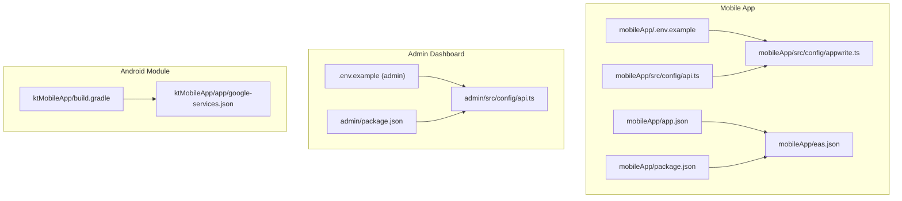
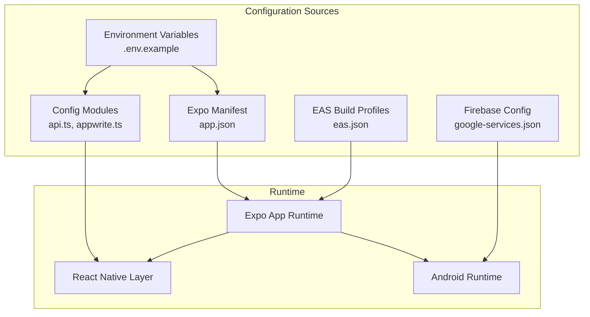
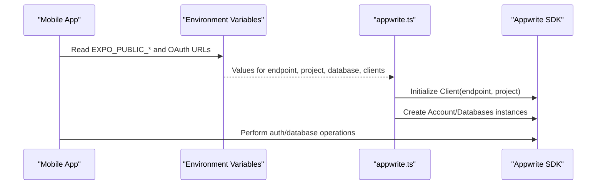
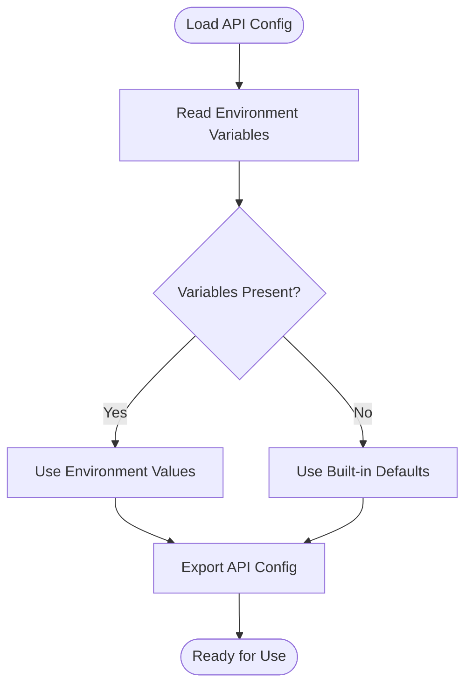
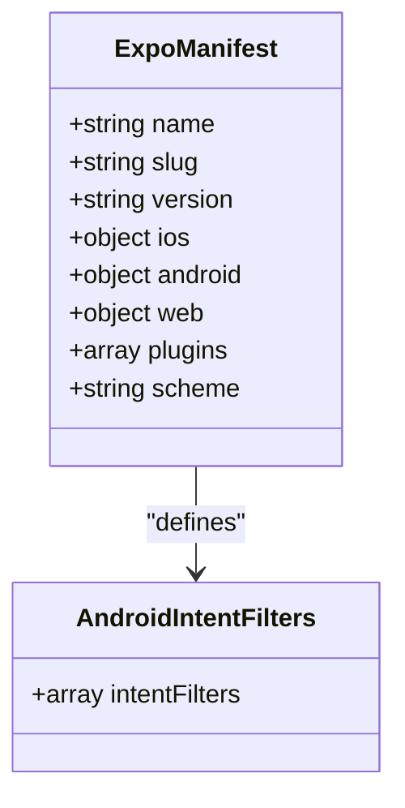
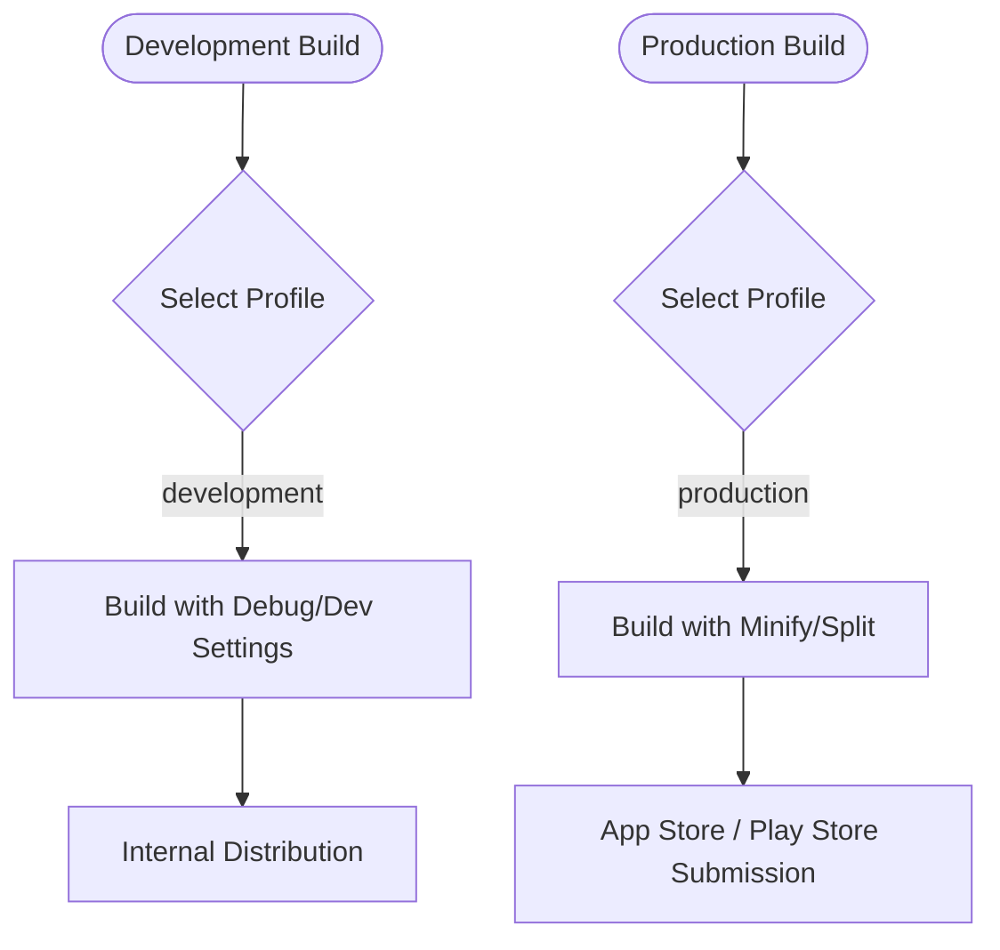
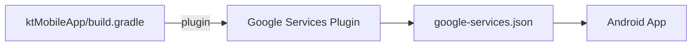
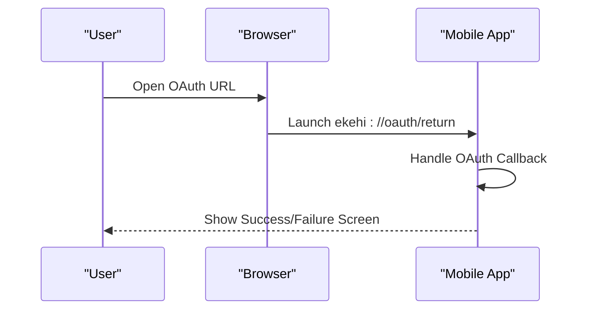
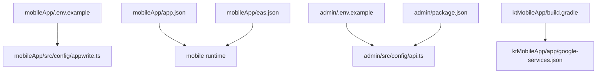

# Configuration & Environment

<cite>
**Referenced Files in This Document**
- [mobileApp/.env.example](file://mobileApp/.env.example)
- [admin/.env.example](file://admin/.env.example)
- [mobileApp/eas.json](file://mobileApp/eas.json)
- [mobileApp/app.json](file://mobileApp/app.json)
- [ktMobileApp/app/google-services.json](file://ktMobileApp/app/google-services.json)
- [ktMobileApp/build.gradle](file://ktMobileApp/build.gradle)
- [mobileApp/src/config/api.ts](file://mobileApp/src/config/api.ts)
- [mobileApp/src/config/appwrite.ts](file://mobileApp/src/config/appwrite.ts)
- [admin/src/config/api.ts](file://admin/src/config/api.ts)
- [mobileApp/package.json](file://mobileApp/package.json)
- [admin/package.json](file://admin/package.json)
- [mobileApp/test-env-variables.js](file://mobileApp/test-env-variables.js)
- [mobileApp/README.md](file://mobileApp/README.md)
- [admin/README.md](file://admin/README.md)
</cite>

## Table of Contents
1. [Introduction](#introduction)
2. [Project Structure](#project-structure)
3. [Core Components](#core-components)
4. [Architecture Overview](#architecture-overview)
5. [Detailed Component Analysis](#detailed-component-analysis)
6. [Dependency Analysis](#dependency-analysis)
7. [Performance Considerations](#performance-considerations)
8. [Troubleshooting Guide](#troubleshooting-guide)
9. [Conclusion](#conclusion)
10. [Appendices](#appendices)

## Introduction
This document explains how the application manages configuration and environments across the React Native mobile app, the Next.js admin dashboard, and the Kotlin Android module. It covers environment variables for Appwrite and Google OAuth, Firebase configuration, API settings, EAS Build profiles, Expo app metadata, and deployment preparation. It also outlines validation steps, security best practices, and environment segregation for development, staging, and production.

## Project Structure
The configuration surface spans three primary areas:
- Mobile app (Expo + React Native): environment variables, API configuration, Expo app manifest, EAS Build configuration, and Firebase credentials.
- Admin dashboard (Next.js): environment variables and API configuration for Appwrite.
- Android module (Kotlin): Gradle plugin configuration and Firebase google-services.json.

**Diagram sources**
- [mobileApp/.env.example](file://mobileApp/.env.example#L1-L18)
- [mobileApp/src/config/api.ts](file://mobileApp/src/config/api.ts#L1-L44)
- [mobileApp/src/config/appwrite.ts](file://mobileApp/src/config/appwrite.ts#L1-L51)
- [mobileApp/app.json](file://mobileApp/app.json#L1-L90)
- [mobileApp/eas.json](file://mobileApp/eas.json#L1-L28)
- [mobileApp/package.json](file://mobileApp/package.json#L1-L108)
- [admin/.env.example](file://admin/.env.example#L1-L16)
- [admin/src/config/api.ts](file://admin/src/config/api.ts#L1-L35)
- [admin/package.json](file://admin/package.json#L1-L52)
- [ktMobileApp/build.gradle](file://ktMobileApp/build.gradle#L1-L9)
- [ktMobileApp/app/google-services.json](file://ktMobileApp/app/google-services.json#L1-L29)

**Section sources**
- [mobileApp/.env.example](file://mobileApp/.env.example#L1-L18)
- [admin/.env.example](file://admin/.env.example#L1-L16)
- [mobileApp/src/config/api.ts](file://mobileApp/src/config/api.ts#L1-L44)
- [mobileApp/src/config/appwrite.ts](file://mobileApp/src/config/appwrite.ts#L1-L51)
- [mobileApp/app.json](file://mobileApp/app.json#L1-L90)
- [mobileApp/eas.json](file://mobileApp/eas.json#L1-L28)
- [mobileApp/package.json](file://mobileApp/package.json#L1-L108)
- [admin/src/config/api.ts](file://admin/src/config/api.ts#L1-L35)
- [admin/package.json](file://admin/package.json#L1-L52)
- [ktMobileApp/build.gradle](file://ktMobileApp/build.gradle#L1-L9)
- [ktMobileApp/app/google-services.json](file://ktMobileApp/app/google-services.json#L1-L29)

## Core Components
- Environment variables for OAuth and Appwrite:
  - Mobile app exposes public variables for OAuth success/failure URLs and Appwrite endpoints, plus Google OAuth client IDs.
  - Admin dashboard uses private variables for Appwrite endpoint, project ID, API key, and collection IDs.
- API configuration:
  - Mobile app centralizes Appwrite endpoints, database ID, collection IDs, and blockchain API settings.
  - Admin mirrors Appwrite configuration and uses environment variables for overrides.
- Expo configuration:
  - App metadata, intent filters, scheme, and Android/iOS identifiers are defined in the manifest.
- EAS Build configuration:
  - Profiles for production and development clients define build types, distribution, minification, and environment variables.
- Android/Firebase:
  - Gradle enables the Google Services plugin and google-services.json provides Firebase project configuration.

**Section sources**
- [mobileApp/.env.example](file://mobileApp/.env.example#L1-L18)
- [admin/.env.example](file://admin/.env.example#L1-L16)
- [mobileApp/src/config/api.ts](file://mobileApp/src/config/api.ts#L1-L44)
- [admin/src/config/api.ts](file://admin/src/config/api.ts#L1-L35)
- [mobileApp/app.json](file://mobileApp/app.json#L1-L90)
- [mobileApp/eas.json](file://mobileApp/eas.json#L1-L28)
- [ktMobileApp/build.gradle](file://ktMobileApp/build.gradle#L1-L9)
- [ktMobileApp/app/google-services.json](file://ktMobileApp/app/google-services.json#L1-L29)

## Architecture Overview
The configuration architecture separates concerns by environment and layer:
- Public configuration for the mobile app is exposed via environment variables and the Expo manifest.
- Private configuration for the admin is loaded from environment variables.
- Appwrite SDK initialization uses environment variables with safe defaults for development.
- EAS Build injects environment variables per profile to control runtime behavior.
- Android module integrates Firebase via google-services.json and Gradle plugin.

**Diagram sources**
- [mobileApp/.env.example](file://mobileApp/.env.example#L1-L18)
- [mobileApp/src/config/api.ts](file://mobileApp/src/config/api.ts#L1-L44)
- [mobileApp/src/config/appwrite.ts](file://mobileApp/src/config/appwrite.ts#L1-L51)
- [mobileApp/app.json](file://mobileApp/app.json#L1-L90)
- [mobileApp/eas.json](file://mobileApp/eas.json#L1-L28)
- [ktMobileApp/app/google-services.json](file://ktMobileApp/app/google-services.json#L1-L29)

## Detailed Component Analysis

### Environment Variables and Secrets Management
- Mobile app public variables:
  - OAuth success and failure URLs for both direct mobile and hosted OAuth modes.
  - Appwrite endpoint, project ID, database ID.
  - Google OAuth client IDs for web, Android, and iOS.
- Admin app private variables:
  - Appwrite endpoint, project ID, API key, database ID.
  - Collection IDs mapped to environment variables for flexibility across environments.
- Validation:
  - A script checks for the presence of .env.production and prints its contents for verification.

Recommended practices:
- Store secrets in CI/CD secure variables and inject them at build time.
- Keep .env.example in version control; never commit .env files.
- Use separate environment files per stage (e.g., .env.development, .env.staging, .env.production).
- Restrict access to API keys and client secrets.

**Section sources**
- [mobileApp/.env.example](file://mobileApp/.env.example#L1-L18)
- [admin/.env.example](file://admin/.env.example#L1-L16)
- [mobileApp/test-env-variables.js](file://mobileApp/test-env-variables.js#L1-L28)

### Appwrite Configuration and Initialization
- Mobile app:
  - Appwrite SDK client configured with endpoint and project ID from environment variables, with fallbacks for development.
  - OAuth client IDs and redirect URLs are configurable via environment variables.
  - Collection IDs are defined in a centralized configuration module.
- Admin app:
  - Mirrors Appwrite configuration and reads API key and collection IDs from environment variables.

**Diagram sources**
- [mobileApp/src/config/appwrite.ts](file://mobileApp/src/config/appwrite.ts#L1-L51)

**Section sources**
- [mobileApp/src/config/appwrite.ts](file://mobileApp/src/config/appwrite.ts#L1-L51)
- [admin/src/config/api.ts](file://admin/src/config/api.ts#L1-L35)

### API Configuration and External Integrations
- Mobile app API configuration:
  - Appwrite endpoints and database/collection IDs.
  - Blockchain API settings for Ekehi Network (base URL, API key placeholder, chain ID, token contract address).
- Admin API configuration:
  - Appwrite endpoint, project ID, API key, database ID, and collection IDs loaded from environment variables.

**Diagram sources**
- [mobileApp/src/config/api.ts](file://mobileApp/src/config/api.ts#L1-L44)
- [admin/src/config/api.ts](file://admin/src/config/api.ts#L1-L35)

**Section sources**
- [mobileApp/src/config/api.ts](file://mobileApp/src/config/api.ts#L1-L44)
- [admin/src/config/api.ts](file://admin/src/config/api.ts#L1-L35)

### Expo Configuration (Metadata, Permissions, Schemes)
- App metadata: name, slug, version, orientation, icons, and dark theme.
- Splash configuration and asset bundle patterns.
- iOS bundle identifier and Android package name.
- Intent filters for deep linking:
  - Generic scheme and host-specific paths for referral and OAuth callbacks.
- Plugins and build properties for Android SDK versions.
- Global scheme for universal links and deep linking.

**Diagram sources**
- [mobileApp/app.json](file://mobileApp/app.json#L1-L90)

**Section sources**
- [mobileApp/app.json](file://mobileApp/app.json#L1-L90)

### EAS Build Configuration (Production Deployments)
- Production profile:
  - Android: app-bundle build type, minify enabled, split enabled.
  - iOS: Release configuration, resource class specified.
  - Injects ENV=production.
- Development profile:
  - Internal distribution, development client enabled.
  - Android: APK build type.
  - iOS: Debug configuration.

**Diagram sources**
- [mobileApp/eas.json](file://mobileApp/eas.json#L1-L28)

**Section sources**
- [mobileApp/eas.json](file://mobileApp/eas.json#L1-L28)

### Android/Firebase Integration
- Gradle build file enables the Google Services Gradle plugin.
- google-services.json contains Firebase project info and API keys for the Android package.

**Diagram sources**
- [ktMobileApp/build.gradle](file://ktMobileApp/build.gradle#L1-L9)
- [ktMobileApp/app/google-services.json](file://ktMobileApp/app/google-services.json#L1-L29)

**Section sources**
- [ktMobileApp/build.gradle](file://ktMobileApp/build.gradle#L1-L9)
- [ktMobileApp/app/google-services.json](file://ktMobileApp/app/google-services.json#L1-L29)

### OAuth Redirect URLs and Deep Linking
- OAuth success and failure URLs are configurable for both direct mobile OAuth and hosted OAuth.
- Expo manifest defines intent filters for deep linking schemes used by OAuth callbacks and referral links.

**Diagram sources**
- [mobileApp/.env.example](file://mobileApp/.env.example#L1-L18)
- [mobileApp/app.json](file://mobileApp/app.json#L1-L90)

**Section sources**
- [mobileApp/.env.example](file://mobileApp/.env.example#L1-L18)
- [mobileApp/app.json](file://mobileApp/app.json#L1-L90)

## Dependency Analysis
- Mobile app depends on:
  - Environment variables for Appwrite and OAuth.
  - Expo manifest for app metadata and deep link schemes.
  - EAS build profiles for production builds.
- Admin dashboard depends on:
  - Environment variables for Appwrite credentials and collections.
- Android module depends on:
  - Google Services Gradle plugin and google-services.json.

**Diagram sources**
- [mobileApp/.env.example](file://mobileApp/.env.example#L1-L18)
- [mobileApp/src/config/appwrite.ts](file://mobileApp/src/config/appwrite.ts#L1-L51)
- [mobileApp/app.json](file://mobileApp/app.json#L1-L90)
- [mobileApp/eas.json](file://mobileApp/eas.json#L1-L28)
- [admin/.env.example](file://admin/.env.example#L1-L16)
- [admin/src/config/api.ts](file://admin/src/config/api.ts#L1-L35)
- [admin/package.json](file://admin/package.json#L1-L52)
- [ktMobileApp/build.gradle](file://ktMobileApp/build.gradle#L1-L9)
- [ktMobileApp/app/google-services.json](file://ktMobileApp/app/google-services.json#L1-L29)

**Section sources**
- [mobileApp/src/config/appwrite.ts](file://mobileApp/src/config/appwrite.ts#L1-L51)
- [admin/src/config/api.ts](file://admin/src/config/api.ts#L1-L35)
- [mobileApp/app.json](file://mobileApp/app.json#L1-L90)
- [mobileApp/eas.json](file://mobileApp/eas.json#L1-L28)
- [ktMobileApp/build.gradle](file://ktMobileApp/build.gradle#L1-L9)
- [ktMobileApp/app/google-services.json](file://ktMobileApp/app/google-services.json#L1-L29)

## Performance Considerations
- Prefer environment-driven configuration to avoid recompiling for minor changes.
- Use EAS Build caching and deterministic builds to reduce iteration time.
- Keep google-services.json minimal and scoped to required services.
- Centralize API endpoints and collection IDs to simplify maintenance and reduce errors.

[No sources needed since this section provides general guidance]

## Troubleshooting Guide
Common issues and remedies:
- OAuth redirect errors:
  - Ensure success and failure URLs match the manifest intent filters and Appwrite console registration.
- Missing environment variables:
  - Verify .env.production presence and contents; use the provided script to confirm.
- Appwrite connection failures:
  - Confirm endpoint, project ID, and database ID are correct; check API key permissions for admin.
- Android build issues:
  - Validate google-services.json matches the Android package name and that the Google Services plugin is enabled.

**Section sources**
- [mobileApp/test-env-variables.js](file://mobileApp/test-env-variables.js#L1-L28)
- [mobileApp/app.json](file://mobileApp/app.json#L1-L90)
- [admin/.env.example](file://admin/.env.example#L1-L16)
- [mobileApp/.env.example](file://mobileApp/.env.example#L1-L18)

## Conclusion
The project’s configuration is modular and environment-aware. By separating public and private variables, centralizing API configuration, and leveraging EAS Build profiles, teams can reliably deploy across development, staging, and production while maintaining strong security hygiene. Use the provided scripts and manifests to validate setup and keep configuration synchronized across the mobile app, admin dashboard, and Android module.

[No sources needed since this section summarizes without analyzing specific files]

## Appendices

### Environment Setup Examples
- Mobile app:
  - Set OAuth success and failure URLs, Appwrite endpoint/project/database, and Google OAuth client IDs in the environment file.
  - Reference: [mobileApp/.env.example](file://mobileApp/.env.example#L1-L18)
- Admin dashboard:
  - Provide Appwrite endpoint, project ID, API key, database ID, and collection IDs via environment variables.
  - Reference: [admin/.env.example](file://admin/.env.example#L1-L16)

### Configuration Validation Checklist
- Confirm environment variables are present and correct:
  - Mobile: [mobileApp/test-env-variables.js](file://mobileApp/test-env-variables.js#L1-L28)
- Verify OAuth redirect URLs in both manifest and Appwrite console:
  - [mobileApp/app.json](file://mobileApp/app.json#L1-L90)
  - [mobileApp/.env.example](file://mobileApp/.env.example#L1-L18)
- Validate Appwrite configuration in runtime:
  - [mobileApp/src/config/appwrite.ts](file://mobileApp/src/config/appwrite.ts#L1-L51)
  - [admin/src/config/api.ts](file://admin/src/config/api.ts#L1-L35)

### Deployment Preparation
- Production builds:
  - Select the production profile in EAS Build; ensure ENV=production is injected.
  - References: [mobileApp/eas.json](file://mobileApp/eas.json#L1-L28), [mobileApp/package.json](file://mobileApp/package.json#L1-L108)
- App store publishing:
  - Use EAS Submit commands for Android and iOS after successful builds.
  - References: [mobileApp/package.json](file://mobileApp/package.json#L1-L108)

### Security Best Practices
- Never commit secrets to version control; maintain .env.example separately.
- Use CI/CD secure variables for API keys and client IDs.
- Limit permissions of Appwrite API keys and restrict collection access.
- Regularly rotate secrets and audit environment variable usage.

[No sources needed since this section provides general guidance]