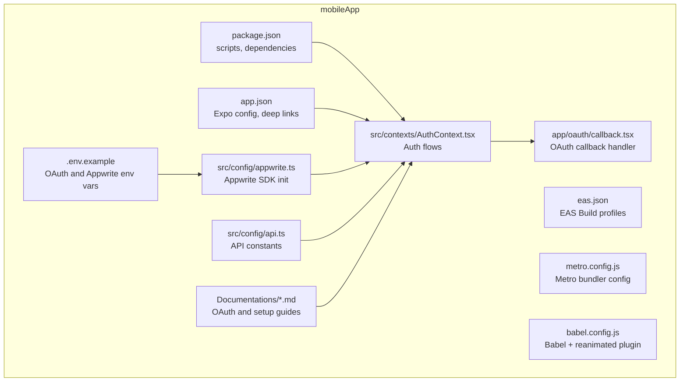
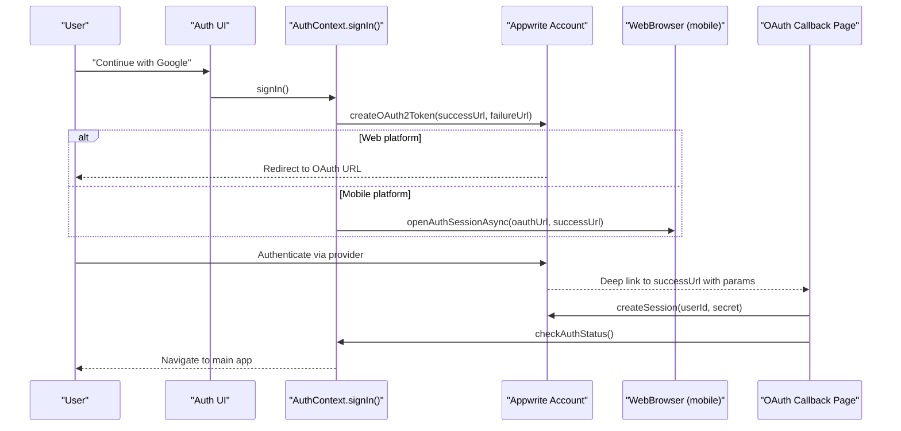
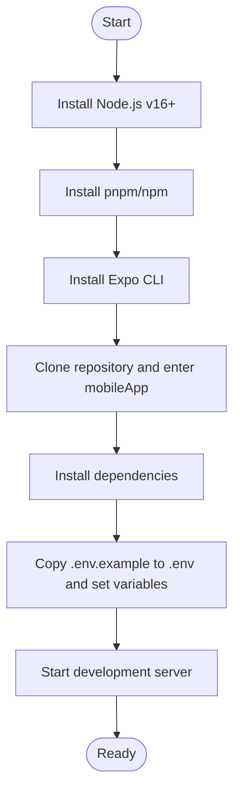
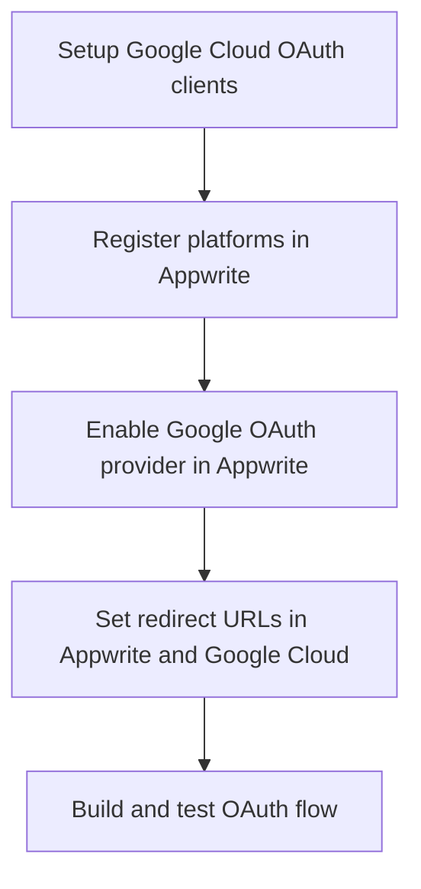
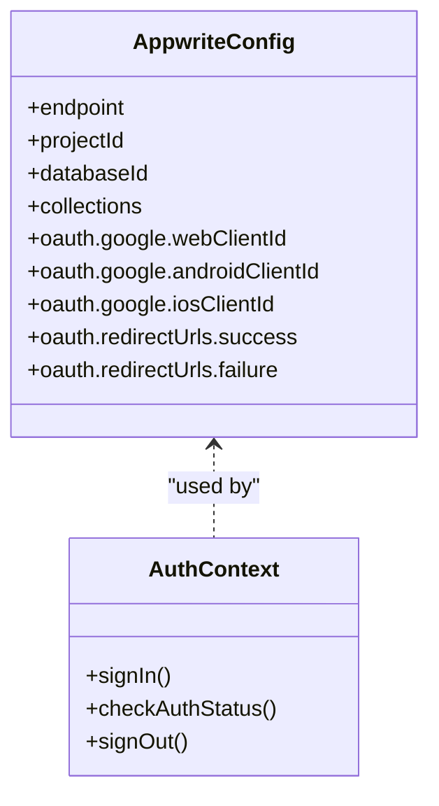
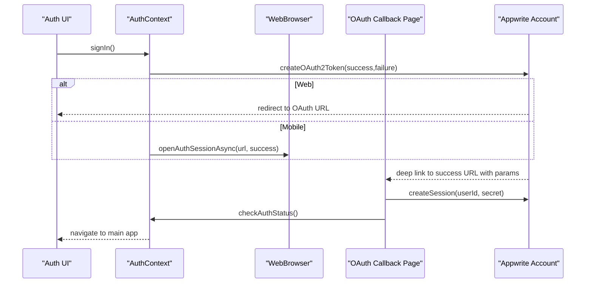
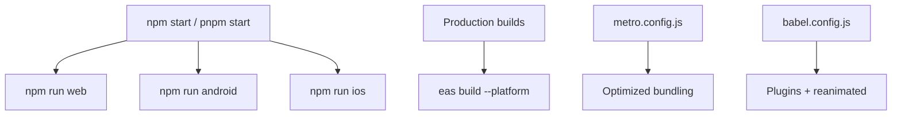
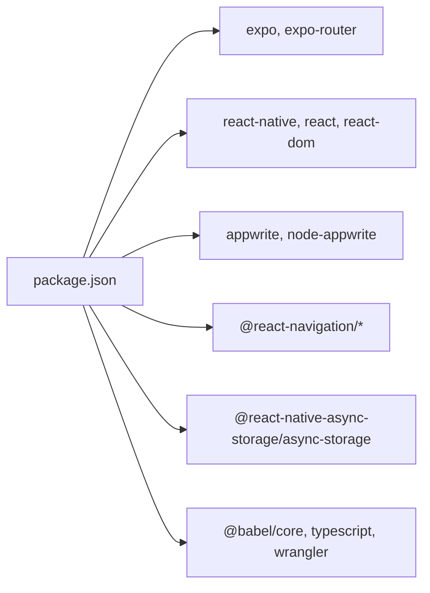

# Getting Started

<cite>
**Referenced Files in This Document**
- [package.json](file://mobileApp/package.json)
- [README.md](file://mobileApp/README.md)
- [app.json](file://mobileApp/app.json)
- [.env.example](file://mobileApp/.env.example)
- [eas.json](file://mobileApp/eas.json)
- [metro.config.js](file://mobileApp/metro.config.js)
- [babel.config.js](file://mobileApp/babel.config.js)
- [src/config/appwrite.ts](file://mobileApp/src/config/appwrite.ts)
- [src/config/api.ts](file://mobileApp/src/config/api.ts)
- [src/contexts/AuthContext.tsx](file://mobileApp/src/contexts/AuthContext.tsx)
- [app/oauth/callback.tsx](file://mobileApp/app/oauth/callback.tsx)
- [Documentations/OAUTH_SETUP_GUIDE.md](file://mobileApp/Documentations/OAUTH_SETUP_GUIDE.md)
- [Documentations/MOBILE_OAUTH_SETUP.md](file://mobileApp/Documentations/MOBILE_OAUTH_SETUP.md)
- [Documentations/APPWRITE_OAUTH_CONFIGURATION.md](file://mobileApp/Documentations/APPWRITE_OAUTH_CONFIGURATION.md)
</cite>

## Table of Contents
1. [Introduction](#introduction)
2. [Project Structure](#project-structure)
3. [Core Components](#core-components)
4. [Architecture Overview](#architecture-overview)
5. [Detailed Component Analysis](#detailed-component-analysis)
6. [Dependency Analysis](#dependency-analysis)
7. [Performance Considerations](#performance-considerations)
8. [Troubleshooting Guide](#troubleshooting-guide)
9. [Conclusion](#conclusion)
10. [Appendices](#appendices)

## Introduction
This guide helps you set up and run the React Native mobile application for development, configure OAuth authentication, and integrate Appwrite and related services. It covers environment setup, installing dependencies, configuring environment variables, running the development server, building for Android and iOS, and testing on iOS simulator, Android emulator, and physical devices.

## Project Structure
The mobile application is organized around Expo Router pages, shared configuration, contexts, services, and utilities. Key areas:
- app/: Expo Router pages and nested routes
- src/: Source code including components, contexts, services, types, and utilities
- assets/: Static assets (icons, splash, favicon)
- Documentations/: Project documentation for OAuth and integrations
- Scripts/: Utility scripts for testing and migrations

**Diagram sources**
- [package.json](file://mobileApp/package.json#L1-L108)
- [app.json](file://mobileApp/app.json#L1-L90)
- [.env.example](file://mobileApp/.env.example#L1-L18)
- [eas.json](file://mobileApp/eas.json#L1-L28)
- [metro.config.js](file://mobileApp/metro.config.js#L1-L22)
- [babel.config.js](file://mobileApp/babel.config.js#L1-L10)
- [src/config/appwrite.ts](file://mobileApp/src/config/appwrite.ts#L1-L51)
- [src/config/api.ts](file://mobileApp/src/config/api.ts#L1-L44)
- [src/contexts/AuthContext.tsx](file://mobileApp/src/contexts/AuthContext.tsx#L1-L724)
- [app/oauth/callback.tsx](file://mobileApp/app/oauth/callback.tsx#L1-L159)
- [Documentations/OAUTH_SETUP_GUIDE.md](file://mobileApp/Documentations/OAUTH_SETUP_GUIDE.md#L1-L751)

**Section sources**
- [README.md](file://mobileApp/README.md#L68-L178)
- [package.json](file://mobileApp/package.json#L1-L108)

## Core Components
- Environment variables: OAuth success/failure URLs, Appwrite project and endpoint, Google OAuth client IDs
- Appwrite configuration: SDK client initialization, database IDs, OAuth provider settings
- Authentication context: OAuth initiation, session handling, profile creation, sign-out
- OAuth callback page: Processes deep link parameters and finalizes session
- Build and runtime configuration: Expo Router, Metro, Babel, EAS Build

**Section sources**
- [.env.example](file://mobileApp/.env.example#L1-L18)
- [src/config/appwrite.ts](file://mobileApp/src/config/appwrite.ts#L1-L51)
- [src/contexts/AuthContext.tsx](file://mobileApp/src/contexts/AuthContext.tsx#L442-L564)
- [app/oauth/callback.tsx](file://mobileApp/app/oauth/callback.tsx#L1-L159)
- [eas.json](file://mobileApp/eas.json#L1-L28)
- [metro.config.js](file://mobileApp/metro.config.js#L1-L22)
- [babel.config.js](file://mobileApp/babel.config.js#L1-L10)

## Architecture Overview
The app uses Expo Router for routing, Appwrite for authentication and database, and optional hosted OAuth. OAuth flow uses deep links on mobile and web redirects on the web. The callback page finalizes sessions and navigates to the main app.

**Diagram sources**
- [src/contexts/AuthContext.tsx](file://mobileApp/src/contexts/AuthContext.tsx#L442-L564)
- [app/oauth/callback.tsx](file://mobileApp/app/oauth/callback.tsx#L1-L159)
- [src/config/appwrite.ts](file://mobileApp/src/config/appwrite.ts#L1-L51)
- [app.json](file://mobileApp/app.json#L1-L90)

## Detailed Component Analysis

### Environment Setup and Dependencies
- Prerequisites: Node.js v16+, npm or pnpm, Expo CLI, Android Studio/Xcode
- Install dependencies and start the dev server using the scripts defined in the package manifest
- Configure environment variables from the example file

**Section sources**
- [README.md](file://mobileApp/README.md#L38-L120)
- [package.json](file://mobileApp/package.json#L1-L41)
- [.env.example](file://mobileApp/.env.example#L1-L18)

### OAuth Configuration
- Configure Google Cloud OAuth clients (Android, iOS, Web)
- Register platforms in Appwrite Console (Android/iOS/Flutter/RN platform and Web)
- Ensure redirect URLs match exactly: success and failure deep links
- Use the hosted OAuth system or direct mobile OAuth depending on your setup

**Section sources**
- [Documentations/OAUTH_SETUP_GUIDE.md](file://mobileApp/Documentations/OAUTH_SETUP_GUIDE.md#L1-L751)
- [Documentations/MOBILE_OAUTH_SETUP.md](file://mobileApp/Documentations/MOBILE_OAUTH_SETUP.md#L1-L108)
- [Documentations/APPWRITE_OAUTH_CONFIGURATION.md](file://mobileApp/Documentations/APPWRITE_OAUTH_CONFIGURATION.md#L1-L84)
- [app.json](file://mobileApp/app.json#L1-L90)
- [.env.example](file://mobileApp/.env.example#L1-L18)

### Appwrite Integration
- Initialize Appwrite client with endpoint and project ID
- Configure database IDs and collection IDs
- OAuth provider settings and redirect URLs are loaded from environment variables

**Diagram sources**
- [src/config/appwrite.ts](file://mobileApp/src/config/appwrite.ts#L1-L51)
- [src/contexts/AuthContext.tsx](file://mobileApp/src/contexts/AuthContext.tsx#L442-L564)

**Section sources**
- [src/config/appwrite.ts](file://mobileApp/src/config/appwrite.ts#L1-L51)
- [src/config/api.ts](file://mobileApp/src/config/api.ts#L1-L44)

### Authentication Flow and Callback Handling
- The sign-in method generates an OAuth URL and either redirects on web or opens an auth session on mobile
- The callback page creates a session using the received parameters and triggers an auth status check
- Deep link schemes and intent filters are declared in the app manifest

**Diagram sources**
- [src/contexts/AuthContext.tsx](file://mobileApp/src/contexts/AuthContext.tsx#L442-L564)
- [app/oauth/callback.tsx](file://mobileApp/app/oauth/callback.tsx#L1-L159)
- [app.json](file://mobileApp/app.json#L1-L90)

**Section sources**
- [src/contexts/AuthContext.tsx](file://mobileApp/src/contexts/AuthContext.tsx#L442-L564)
- [app/oauth/callback.tsx](file://mobileApp/app/oauth/callback.tsx#L1-L159)

### Building and Running
- Development: start the dev server and run on web, Android, or iOS using the scripts
- Production builds: use EAS Build for Android and iOS
- Metro and Babel are configured for optimal bundling and reanimated support

**Section sources**
- [README.md](file://mobileApp/README.md#L107-L137)
- [package.json](file://mobileApp/package.json#L1-L41)
- [eas.json](file://mobileApp/eas.json#L1-L28)
- [metro.config.js](file://mobileApp/metro.config.js#L1-L22)
- [babel.config.js](file://mobileApp/babel.config.js#L1-L10)

### Practical Examples: Running on Different Platforms
- iOS Simulator: use the iOS script to launch the app on a simulator
- Android Emulator: use the Android script to launch on an emulator
- Physical Devices: connect devices, enable developer options, and run the respective scripts
- Web: use the web script to run in a browser

**Section sources**
- [README.md](file://mobileApp/README.md#L107-L120)
- [package.json](file://mobileApp/package.json#L1-L41)

## Dependency Analysis
- Runtime dependencies include Expo, React Navigation, Appwrite SDKs, AsyncStorage, Notifications, and others
- Development dependencies include Babel, TypeScript, and crypto polyfills for web compatibility
- Build-time dependencies include Expo Router, build properties, and EAS CLI

**Diagram sources**
- [package.json](file://mobileApp/package.json#L1-L108)

**Section sources**
- [package.json](file://mobileApp/package.json#L1-L108)

## Performance Considerations
- Metro configuration enables inline requires and adjusts asset/source extensions for performance
- Babel preset and plugin configuration support reanimated and modern transforms
- Use EAS Build profiles optimized for production (minification, splits, resource class)

**Section sources**
- [metro.config.js](file://mobileApp/metro.config.js#L1-L22)
- [babel.config.js](file://mobileApp/babel.config.js#L1-L10)
- [eas.json](file://mobileApp/eas.json#L1-L28)

## Troubleshooting Guide
Common issues and resolutions:
- OAuth redirect errors: ensure redirect URLs are registered in Appwrite and match exactly
- Auto mining not updating: verify purchase thresholds and limits
- Profile refresh issues: confirm network connectivity and Appwrite configuration
- Invalid URL errors: verify Appwrite platform registration and Google OAuth client settings
- Deep links not working: confirm intent filters and scheme in app.json

**Section sources**
- [README.md](file://mobileApp/README.md#L152-L167)
- [Documentations/OAUTH_SETUP_GUIDE.md](file://mobileApp/Documentations/OAUTH_SETUP_GUIDE.md#L451-L523)
- [Documentations/APPWRITE_OAUTH_CONFIGURATION.md](file://mobileApp/Documentations/APPWRITE_OAUTH_CONFIGURATION.md#L1-L84)
- [app.json](file://mobileApp/app.json#L1-L90)

## Conclusion
You now have the essentials to set up the React Native mobile app, configure OAuth with Appwrite, and run the app across iOS, Android, and web. Use the provided scripts, environment variables, and documentation to streamline development and deployment.

## Appendices

### Environment Variables Reference
- OAuth redirect URLs: success and failure deep links
- Appwrite configuration: project ID, endpoint, database ID
- Google OAuth client IDs: web, Android, iOS

**Section sources**
- [.env.example](file://mobileApp/.env.example#L1-L18)
- [src/config/appwrite.ts](file://mobileApp/src/config/appwrite.ts#L1-L51)

### OAuth Setup References
- Complete OAuth setup guide covering Google Cloud and Appwrite
- Mobile OAuth setup with deep link expectations
- Appwrite OAuth configuration to resolve “Invalid URL” errors

**Section sources**
- [Documentations/OAUTH_SETUP_GUIDE.md](file://mobileApp/Documentations/OAUTH_SETUP_GUIDE.md#L1-L751)
- [Documentations/MOBILE_OAUTH_SETUP.md](file://mobileApp/Documentations/MOBILE_OAUTH_SETUP.md#L1-L108)
- [Documentations/APPWRITE_OAUTH_CONFIGURATION.md](file://mobileApp/Documentations/APPWRITE_OAUTH_CONFIGURATION.md#L1-L84)