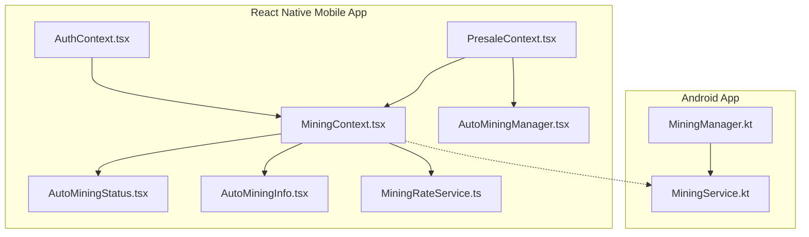
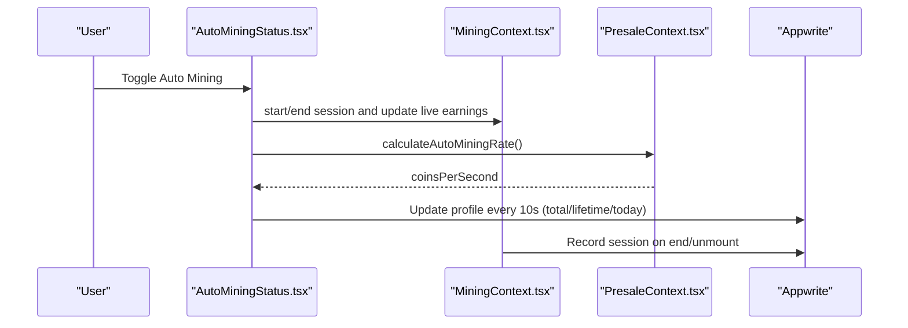
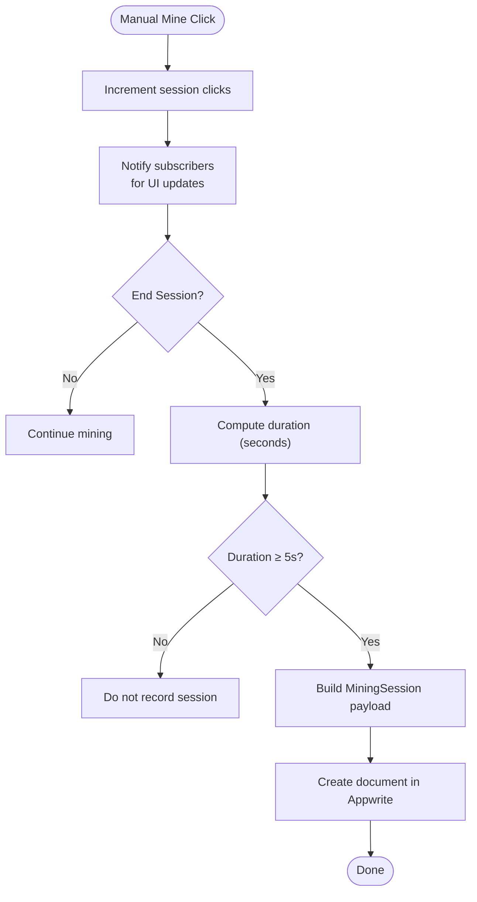
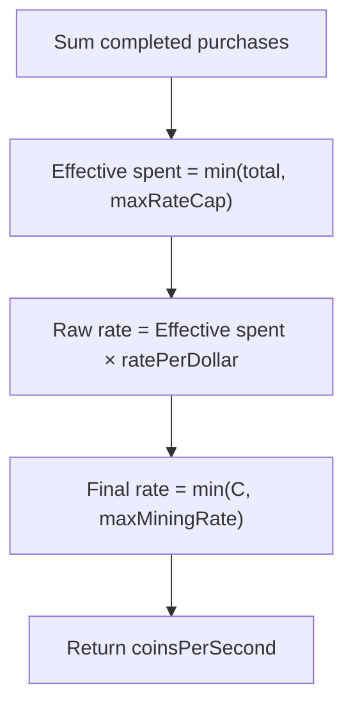
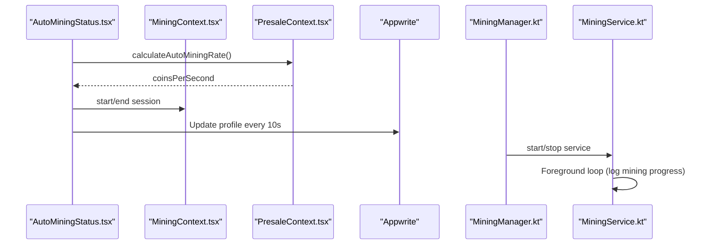
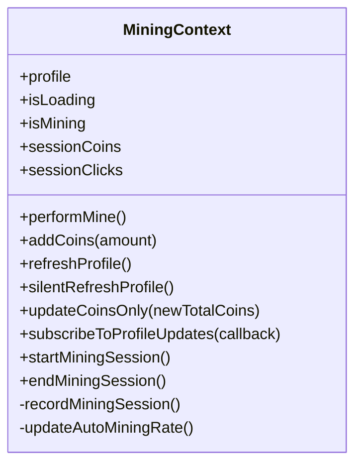
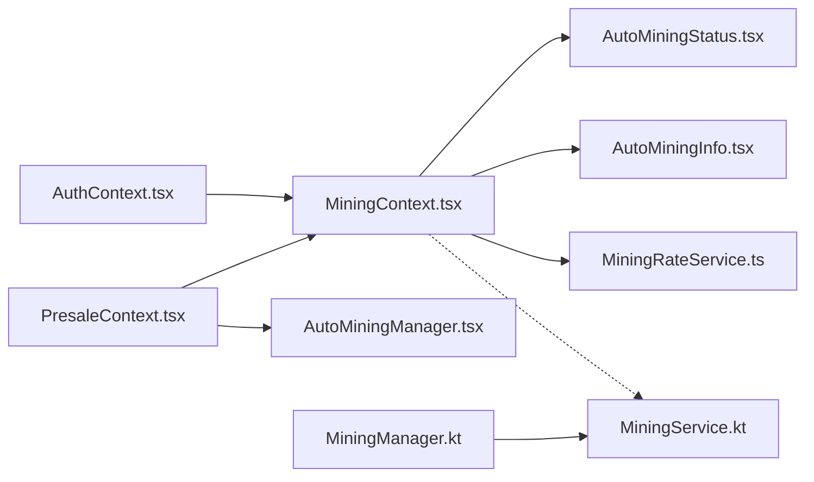

# Mining System

<cite>
**Referenced Files in This Document**
- [MiningContext.tsx](file://mobileApp/src/contexts/MiningContext.tsx)
- [AutoMiningManager.tsx](file://mobileApp/src/components/AutoMiningManager.tsx)
- [AutoMiningStatus.tsx](file://mobileApp/src/components/AutoMiningStatus.tsx)
- [AutoMiningInfo.tsx](file://mobileApp/src/components/AutoMiningInfo.tsx)
- [MiningRateService.ts](file://mobileApp/src/services/MiningRateService.ts)
- [PresaleContext.tsx](file://mobileApp/src/contexts/PresaleContext.tsx)
- [AuthContext.tsx](file://mobileApp/src/contexts/AuthContext.tsx)
- [MiningManager.kt](file://ktMobileApp/app/src/main/java/com/ekehi/network/service/MiningManager.kt)
- [MiningService.kt](file://ktMobileApp/app/src/main/java/com/ekehi/network/service/MiningService.kt)
- [MINING_SESSION_RECORDING.md](file://mobileApp/docs/MINING_SESSION_RECORDING.md)
</cite>

## Table of Contents
1. [Introduction](#introduction)
2. [Project Structure](#project-structure)
3. [Core Components](#core-components)
4. [Architecture Overview](#architecture-overview)
5. [Detailed Component Analysis](#detailed-component-analysis)
6. [Dependency Analysis](#dependency-analysis)
7. [Performance Considerations](#performance-considerations)
8. [Troubleshooting Guide](#troubleshooting-guide)
9. [Conclusion](#conclusion)

## Introduction
This document explains the mining system across the mobile app and Android app. It covers manual mining mechanics, reward calculation algorithms, session tracking, auto-mining mechanics driven by purchase tiers, background processing, and battery-aware behavior. It also details the MiningContext implementation for state management, reward accumulation, and statistics, along with AutoMiningManager’s role in background mining operations and session recording. Practical examples demonstrate mining calculations, rate limiting, and performance optimizations. Finally, it addresses mining limits, cooldown considerations, and user experience enhancements.

## Project Structure
The mining system spans:
- React Native mobile app (TypeScript/React):
  - MiningContext for state and persistence
  - AutoMining components for UI and live updates
  - MiningRateService for rate computations and updates
  - PresaleContext for purchase-driven auto-mining rate calculation
  - AuthContext for user lifecycle and profile creation
- Android app (Kotlin):
  - MiningManager and MiningService for background mining orchestration and notification

**Diagram sources**
- [MiningContext.tsx](file://mobileApp/src/contexts/MiningContext.tsx#L1-L619)
- [AutoMiningManager.tsx](file://mobileApp/src/components/AutoMiningManager.tsx#L1-L54)
- [AutoMiningStatus.tsx](file://mobileApp/src/components/AutoMiningStatus.tsx#L1-L533)
- [AutoMiningInfo.tsx](file://mobileApp/src/components/AutoMiningInfo.tsx#L1-L266)
- [MiningRateService.ts](file://mobileApp/src/services/MiningRateService.ts#L1-L231)
- [PresaleContext.tsx](file://mobileApp/src/contexts/PresaleContext.tsx#L1-L414)
- [AuthContext.tsx](file://mobileApp/src/contexts/AuthContext.tsx#L1-L724)
- [MiningManager.kt](file://ktMobileApp/app/src/main/java/com/ekehi/network/service/MiningManager.kt#L1-L68)
- [MiningService.kt](file://ktMobileApp/app/src/main/java/com/ekehi/network/service/MiningService.kt#L1-L94)

**Section sources**
- [MiningContext.tsx](file://mobileApp/src/contexts/MiningContext.tsx#L1-L619)
- [PresaleContext.tsx](file://mobileApp/src/contexts/PresaleContext.tsx#L1-L414)
- [MiningRateService.ts](file://mobileApp/src/services/MiningRateService.ts#L1-L231)
- [AutoMiningStatus.tsx](file://mobileApp/src/components/AutoMiningStatus.tsx#L1-L533)
- [AutoMiningManager.tsx](file://mobileApp/src/components/AutoMiningManager.tsx#L1-L54)
- [MiningManager.kt](file://ktMobileApp/app/src/main/java/com/ekehi/network/service/MiningManager.kt#L1-L68)
- [MiningService.kt](file://ktMobileApp/app/src/main/java/com/ekehi/network/service/MiningService.kt#L1-L94)

## Core Components
- MiningContext: Central state for user profile, manual mining tracking, session lifecycle, and persistence to Appwrite. Provides functions to refresh profile, add coins, start/end sessions, and record sessions.
- AutoMiningManager: Synchronizes auto-mining rate with purchases and persists updates to Appwrite.
- AutoMiningStatus: UI component that toggles auto mining, computes live earnings, and periodically persists backend totals.
- AutoMiningInfo: Displays auto mining eligibility, current/potential rates, and purchase limits.
- MiningRateService: Computes total mining rate (manual + auto + referral bonus) and updates rates in the database.
- PresaleContext: Defines purchase tiers, calculates auto mining rate, enforces caps and limits, and exposes eligibility helpers.
- AuthContext: Ensures user profile exists and initializes defaults, including daily mining rate and limits.
- Android MiningManager/MiningService: Starts/stops a foreground service for background mining and posts a low-importance notification.

**Section sources**
- [MiningContext.tsx](file://mobileApp/src/contexts/MiningContext.tsx#L1-L619)
- [AutoMiningManager.tsx](file://mobileApp/src/components/AutoMiningManager.tsx#L1-L54)
- [AutoMiningStatus.tsx](file://mobileApp/src/components/AutoMiningStatus.tsx#L1-L533)
- [AutoMiningInfo.tsx](file://mobileApp/src/components/AutoMiningInfo.tsx#L1-L266)
- [MiningRateService.ts](file://mobileApp/src/services/MiningRateService.ts#L1-L231)
- [PresaleContext.tsx](file://mobileApp/src/contexts/PresaleContext.tsx#L1-L414)
- [AuthContext.tsx](file://mobileApp/src/contexts/AuthContext.tsx#L1-L724)
- [MiningManager.kt](file://ktMobileApp/app/src/main/java/com/ekehi/network/service/MiningManager.kt#L1-L68)
- [MiningService.kt](file://ktMobileApp/app/src/main/java/com/ekehi/network/service/MiningService.kt#L1-L94)

## Architecture Overview
The mining system integrates user authentication, purchase history, and real-time state to compute and persist mining rewards. Auto mining is purchase-driven and capped by configurable limits. Manual mining tracks sessions and records them for analytics and potential rewards.

**Diagram sources**
- [AutoMiningStatus.tsx](file://mobileApp/src/components/AutoMiningStatus.tsx#L1-L533)
- [MiningContext.tsx](file://mobileApp/src/contexts/MiningContext.tsx#L1-L619)
- [PresaleContext.tsx](file://mobileApp/src/contexts/PresaleContext.tsx#L1-L414)

## Detailed Component Analysis

### Manual Mining Mechanics and Session Tracking
Manual mining uses lightweight local state to track clicks and session duration. The session is recorded when ending or unmounting, with a minimum duration threshold to prevent noise.

Key behaviors:
- Local counters for session clicks and coins (accumulated locally for responsiveness)
- Start/stop session lifecycle
- Session recording with duration filtering and document creation in Appwrite
- Silent refresh and profile update subscriptions for real-time updates

**Diagram sources**
- [MiningContext.tsx](file://mobileApp/src/contexts/MiningContext.tsx#L416-L503)
- [MINING_SESSION_RECORDING.md](file://mobileApp/docs/MINING_SESSION_RECORDING.md#L1-L88)

**Section sources**
- [MiningContext.tsx](file://mobileApp/src/contexts/MiningContext.tsx#L416-L503)
- [MINING_SESSION_RECORDING.md](file://mobileApp/docs/MINING_SESSION_RECORDING.md#L1-L88)

### Reward Calculation Algorithms
- Auto mining rate computation:
  - Sum completed purchases and cap at a maximum purchase amount for rate calculation
  - Apply a fixed rate-per-dollar factor and cap at a maximum EKH/second
  - Expose eligibility and remaining-to-cap helpers
- Total mining rate:
  - Manual rate derived from daily rate (converted from EKH/day to EKH/hour)
  - Auto rate stored in EKH/hour
  - Referral bonus rate stored in EKH/hour
  - Sum all components for total rate

**Diagram sources**
- [PresaleContext.tsx](file://mobileApp/src/contexts/PresaleContext.tsx#L315-L340)
- [MiningRateService.ts](file://mobileApp/src/services/MiningRateService.ts#L40-L52)

**Section sources**
- [PresaleContext.tsx](file://mobileApp/src/contexts/PresaleContext.tsx#L315-L340)
- [MiningRateService.ts](file://mobileApp/src/services/MiningRateService.ts#L40-L52)

### Auto-Mining System and Background Processing
- AutoMiningStatus:
  - Toggles active state based on coinsPerSecond
  - Live earnings computed per second and persisted every 10 seconds
  - Ends session on unmount and notifies backend
- AutoMiningManager:
  - Recomputes and persists auto mining rate whenever purchases change
- Android background:
  - MiningManager starts/stops MiningService
  - MiningService runs a coroutine loop and posts a foreground notification

**Diagram sources**
- [AutoMiningStatus.tsx](file://mobileApp/src/components/AutoMiningStatus.tsx#L1-L533)
- [MiningContext.tsx](file://mobileApp/src/contexts/MiningContext.tsx#L1-L619)
- [PresaleContext.tsx](file://mobileApp/src/contexts/PresaleContext.tsx#L1-L414)
- [MiningManager.kt](file://ktMobileApp/app/src/main/java/com/ekehi/network/service/MiningManager.kt#L1-L68)
- [MiningService.kt](file://ktMobileApp/app/src/main/java/com/ekehi/network/service/MiningService.kt#L1-L94)

**Section sources**
- [AutoMiningStatus.tsx](file://mobileApp/src/components/AutoMiningStatus.tsx#L1-L533)
- [AutoMiningManager.tsx](file://mobileApp/src/components/AutoMiningManager.tsx#L1-L54)
- [MiningManager.kt](file://ktMobileApp/app/src/main/java/com/ekehi/network/service/MiningManager.kt#L1-L68)
- [MiningService.kt](file://ktMobileApp/app/src/main/java/com/ekehi/network/service/MiningService.kt#L1-L94)

### MiningContext Implementation
Responsibilities:
- Load/create user profile, debounce refreshes, and deduplicate updates
- Provide addCoins, refreshProfile, silentRefreshProfile, and updateCoinsOnly
- Manage manual mining session state and record sessions
- Subscribe to profile updates and notify listeners
- Update auto mining rate based on purchases and persist to Appwrite

**Diagram sources**
- [MiningContext.tsx](file://mobileApp/src/contexts/MiningContext.tsx#L1-L619)

**Section sources**
- [MiningContext.tsx](file://mobileApp/src/contexts/MiningContext.tsx#L1-L619)

### AutoMiningManager Functionality
- Observes purchase changes and recomputes auto mining rate
- Persists rate to Appwrite and refreshes profile state
- Runs only when user and profile are present

**Section sources**
- [AutoMiningManager.tsx](file://mobileApp/src/components/AutoMiningManager.tsx#L1-L54)
- [PresaleContext.tsx](file://mobileApp/src/contexts/PresaleContext.tsx#L1-L414)

### Mining Session Recording System
- Minimum 5-second session duration filter prevents spam
- Records userId, coinsEarned, clicksMade, sessionDuration, and timestamps
- Triggered on end, unmount, navigation, and backgrounding

**Section sources**
- [MiningContext.tsx](file://mobileApp/src/contexts/MiningContext.tsx#L466-L503)
- [MINING_SESSION_RECORDING.md](file://mobileApp/docs/MINING_SESSION_RECORDING.md#L1-L88)

### Mining Limits, Cooldowns, and UX Enhancements
- Purchase-driven limits:
  - Minimum purchase for eligibility
  - Caps for rate calculation and maximum mining rate
  - General purchase cap and remaining-to-cap display
- UX:
  - AutoMiningInfo shows current/potential rates and limits
  - AutoMiningStatus shows live earnings, projected earnings, and start/stop controls
  - AutoMiningStatus locks UI when not eligible and navigates to presale

**Section sources**
- [PresaleContext.tsx](file://mobileApp/src/contexts/PresaleContext.tsx#L38-L48)
- [PresaleContext.tsx](file://mobileApp/src/contexts/PresaleContext.tsx#L315-L340)
- [AutoMiningInfo.tsx](file://mobileApp/src/components/AutoMiningInfo.tsx#L1-L266)
- [AutoMiningStatus.tsx](file://mobileApp/src/components/AutoMiningStatus.tsx#L1-L533)

## Dependency Analysis
- MiningContext depends on:
  - AuthContext for user identity
  - PresaleContext for auto mining rate calculation
  - Appwrite for profile and session persistence
- AutoMiningStatus depends on:
  - MiningContext for session state
  - PresaleContext for rate computation
  - Appwrite for backend updates
- AutoMiningManager depends on:
  - PresaleContext for rate calculation
  - Appwrite for persistence
- Android MiningManager/MiningService depend on:
  - Android lifecycle and foreground service APIs

**Diagram sources**
- [AuthContext.tsx](file://mobileApp/src/contexts/AuthContext.tsx#L1-L724)
- [MiningContext.tsx](file://mobileApp/src/contexts/MiningContext.tsx#L1-L619)
- [PresaleContext.tsx](file://mobileApp/src/contexts/PresaleContext.tsx#L1-L414)
- [AutoMiningManager.tsx](file://mobileApp/src/components/AutoMiningManager.tsx#L1-L54)
- [AutoMiningStatus.tsx](file://mobileApp/src/components/AutoMiningStatus.tsx#L1-L533)
- [AutoMiningInfo.tsx](file://mobileApp/src/components/AutoMiningInfo.tsx#L1-L266)
- [MiningRateService.ts](file://mobileApp/src/services/MiningRateService.ts#L1-L231)
- [MiningManager.kt](file://ktMobileApp/app/src/main/java/com/ekehi/network/service/MiningManager.kt#L1-L68)
- [MiningService.kt](file://ktMobileApp/app/src/main/java/com/ekehi/network/service/MiningService.kt#L1-L94)

**Section sources**
- [MiningContext.tsx](file://mobileApp/src/contexts/MiningContext.tsx#L1-L619)
- [PresaleContext.tsx](file://mobileApp/src/contexts/PresaleContext.tsx#L1-L414)
- [AutoMiningStatus.tsx](file://mobileApp/src/components/AutoMiningStatus.tsx#L1-L533)
- [AutoMiningManager.tsx](file://mobileApp/src/components/AutoMiningManager.tsx#L1-L54)
- [MiningManager.kt](file://ktMobileApp/app/src/main/java/com/ekehi/network/service/MiningManager.kt#L1-L68)
- [MiningService.kt](file://ktMobileApp/app/src/main/java/com/ekehi/network/service/MiningService.kt#L1-L94)

## Performance Considerations
- Debounce profile refreshes and silent refreshes to reduce network churn
- Deduplicate profile updates using deep comparison
- Batch backend writes for auto mining earnings (every 10 seconds)
- Use lightweight local state for manual mining to keep UI responsive
- Android foreground service with low importance notification to minimize battery impact
- Retry with backoff for all network operations to improve resilience

[No sources needed since this section provides general guidance]

## Troubleshooting Guide
Common issues and remedies:
- Frequent profile refreshes: The context already debounces refreshes; ensure intervals are respected and avoid calling refresh excessively
- Silent refresh conflicts: A pending fetch promise is reused; avoid overlapping requests manually
- Auto mining not updating: Verify purchases are completed and within caps; ensure AutoMiningManager effect runs and database updates succeed
- Backend earnings not saved: AutoMiningStatus persists every 10 seconds; confirm coinsPerSecond is positive and UI is active
- Session not recorded: Confirm session duration exceeds 5 seconds and Appwrite write succeeds
- Android background mining: Ensure service is started and notification channel is created

**Section sources**
- [MiningContext.tsx](file://mobileApp/src/contexts/MiningContext.tsx#L101-L228)
- [MiningContext.tsx](file://mobileApp/src/contexts/MiningContext.tsx#L231-L347)
- [AutoMiningStatus.tsx](file://mobileApp/src/components/AutoMiningStatus.tsx#L63-L95)
- [MiningContext.tsx](file://mobileApp/src/contexts/MiningContext.tsx#L466-L503)
- [MiningService.kt](file://ktMobileApp/app/src/main/java/com/ekehi/network/service/MiningService.kt#L1-L94)

## Conclusion
The mining system combines purchase-driven auto mining with manual session tracking and robust session recording. It emphasizes user experience with live feedback, clear limits, and resilient persistence. On Android, a foreground service enables background mining with minimal battery impact. Together, these components deliver a scalable, transparent, and user-friendly mining experience.