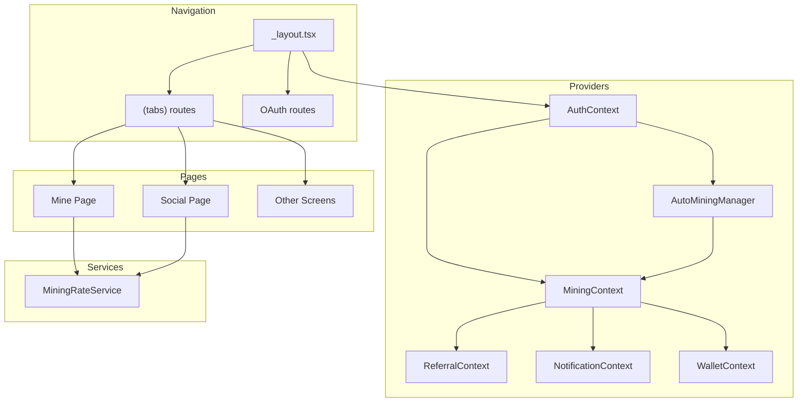
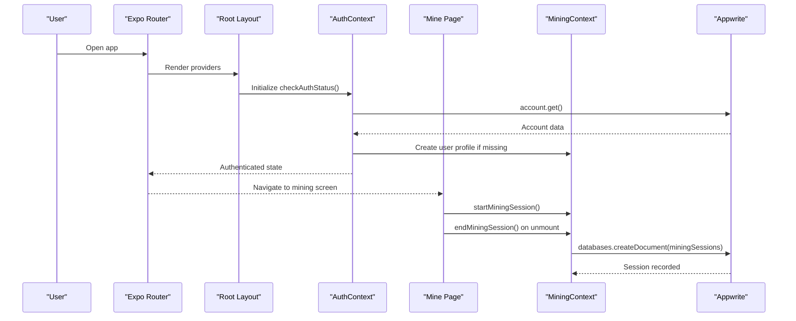
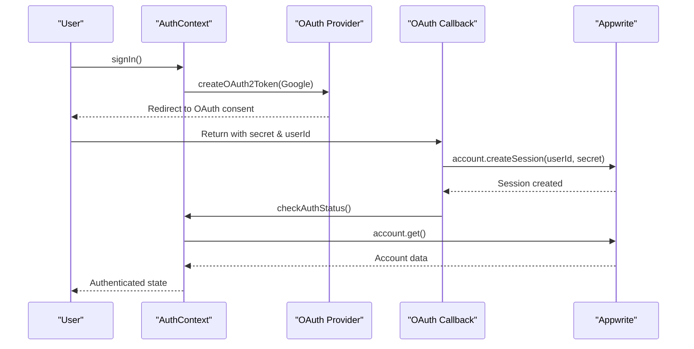
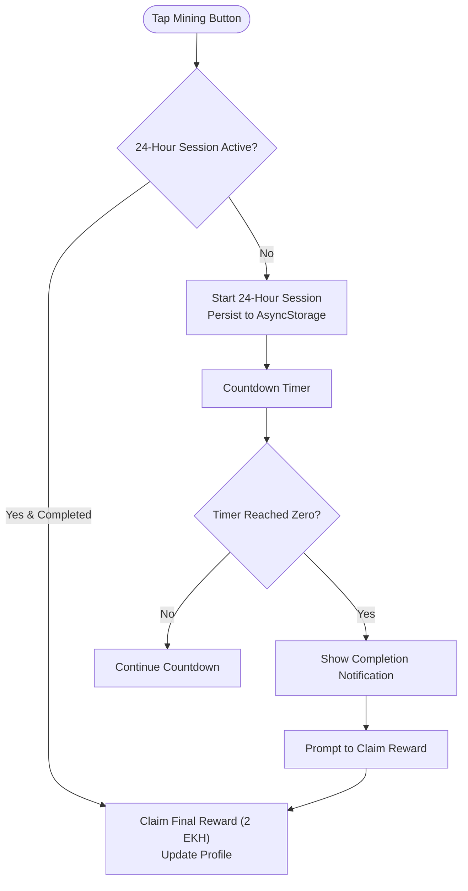
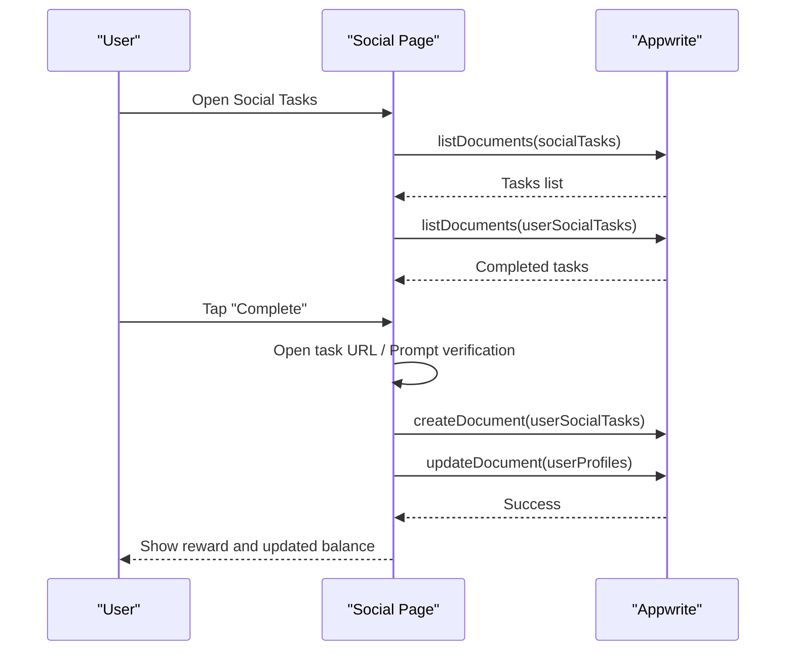
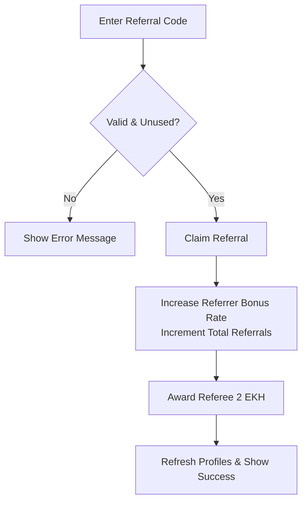
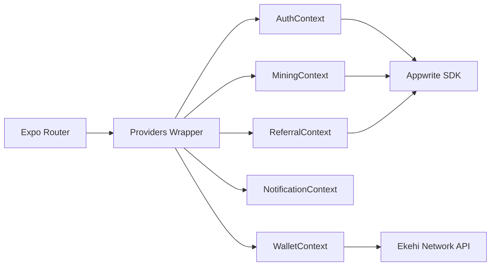

# Mobile Application (React Native)

<cite>
**Referenced Files in This Document**
- [package.json](file://mobileApp/package.json)
- [RootLayout](file://mobileApp/app/_layout.tsx)
- [AuthContext](file://mobileApp/src/contexts/AuthContext.tsx)
- [MiningContext](file://mobileApp/src/contexts/MiningContext.tsx)
- [ReferralContext](file://mobileApp/src/contexts/ReferralContext.tsx)
- [NotificationContext](file://mobileApp/src/contexts/NotificationContext.tsx)
- [WalletContext](file://mobileApp/src/contexts/WalletContext.tsx)
- [UserProfile types](file://mobileApp/src/types/index.ts)
- [Appwrite config](file://mobileApp/src/config/appwrite.ts)
- [Mine page](file://mobileApp/app/(tabs)/mine.tsx)
- [Social page](file://mobileApp/app/(tabs)/social.tsx)
- [AutoMiningManager](file://mobileApp/src/components/AutoMiningManager.tsx)
- [MiningRateService](file://mobileApp/src/services/MiningRateService.ts)
- [OAuth callback](file://mobileApp/app/oauth/callback.tsx)
- [Referral link page](file://mobileApp/app/referral/[code].tsx)
- [Validation utils](file://mobileApp/src/utils/validation.ts)
- [API config](file://mobileApp/src/config/api.ts)
</cite>

## Table of Contents
1. [Introduction](#introduction)
2. [Project Structure](#project-structure)
3. [Core Components](#core-components)
4. [Architecture Overview](#architecture-overview)
5. [Detailed Component Analysis](#detailed-component-analysis)
6. [Dependency Analysis](#dependency-analysis)
7. [Performance Considerations](#performance-considerations)
8. [Troubleshooting Guide](#troubleshooting-guide)
9. [Conclusion](#conclusion)
10. [Appendices](#appendices)

## Introduction
This document explains the React Native mobile application built with Expo Router. It covers the navigation architecture, context providers for state management, authentication with OAuth and email/password, mining mechanics (manual and auto), social task marketplace, referral system, notification system, and wallet integration. Practical examples and component integration guidelines are included to help developers understand and extend the system effectively.

## Project Structure
The mobile app uses Expo Router for navigation and a layered architecture:
- Navigation: Stack-based routing with nested tabs and OAuth routes
- Providers: Context providers for authentication, mining, referral, notifications, presale, and wallet
- Pages: Feature screens for mining, social tasks, leaderboard, presale, profile, and wallet
- Services: Business logic services for mining rate calculations and Appwrite interactions
- Utilities: Validation helpers and configuration modules

**Diagram sources**
- [RootLayout](file://mobileApp/app/_layout.tsx#L1-L39)
- [AuthContext](file://mobileApp/src/contexts/AuthContext.tsx#L1-L724)
- [MiningContext](file://mobileApp/src/contexts/MiningContext.tsx#L1-L619)
- [ReferralContext](file://mobileApp/src/contexts/ReferralContext.tsx#L1-L249)
- [NotificationContext](file://mobileApp/src/contexts/NotificationContext.tsx#L1-L58)
- [WalletContext](file://mobileApp/src/contexts/WalletContext.tsx#L1-L297)
- [AutoMiningManager](file://mobileApp/src/components/AutoMiningManager.tsx#L1-L54)
- [Mine page](file://mobileApp/app/(tabs)/mine.tsx#L1-L800)
- [Social page](file://mobileApp/app/(tabs)/social.tsx#L1-L683)
- [MiningRateService](file://mobileApp/src/services/MiningRateService.ts#L1-L231)

**Section sources**
- [package.json](file://mobileApp/package.json#L1-L108)
- [RootLayout](file://mobileApp/app/_layout.tsx#L1-L39)

## Core Components
- Authentication: OAuth with Google and email/password, session management, profile creation, and email/password recovery helpers
- Mining: Manual 24-hour mining session, session persistence, reward calculation, auto-mining configuration, and session recording
- Social Marketplace: Task discovery, platform-specific verification, reward distribution, and completion tracking
- Referral System: Code generation, commission tracking, and user acquisition analytics
- Notifications: In-app notification queue with auto-dismiss and retry support
- Wallet: Blockchain integration for balance synchronization and token transfers

**Section sources**
- [AuthContext](file://mobileApp/src/contexts/AuthContext.tsx#L1-L724)
- [MiningContext](file://mobileApp/src/contexts/MiningContext.tsx#L1-L619)
- [ReferralContext](file://mobileApp/src/contexts/ReferralContext.tsx#L1-L249)
- [NotificationContext](file://mobileApp/src/contexts/NotificationContext.tsx#L1-L58)
- [WalletContext](file://mobileApp/src/contexts/WalletContext.tsx#L1-L297)
- [UserProfile types](file://mobileApp/src/types/index.ts#L1-L98)
- [Appwrite config](file://mobileApp/src/config/appwrite.ts#L1-L51)
- [API config](file://mobileApp/src/config/api.ts#L1-L44)

## Architecture Overview
The app initializes providers at the root level and exposes them to all screens. Navigation is managed by Expo Router with a stack and nested tab structure. Authentication drives profile creation and mining state. Auto-mining updates are calculated from presale purchases and persisted to the user profile. Social tasks and referrals integrate with Appwrite collections for persistence and retrieval.

**Diagram sources**
- [RootLayout](file://mobileApp/app/_layout.tsx#L1-L39)
- [AuthContext](file://mobileApp/src/contexts/AuthContext.tsx#L1-L724)
- [MiningContext](file://mobileApp/src/contexts/MiningContext.tsx#L1-L619)
- [Mine page](file://mobileApp/app/(tabs)/mine.tsx#L1-L800)

## Detailed Component Analysis

### Authentication System (OAuth + Email/Password)
- OAuth with Google:
  - Generates OAuth URL with success/failure redirect URLs
  - Handles web vs. native browser sessions
  - Callback page creates a session and redirects to the main screen
- Email/Password:
  - Creates email-password sessions and triggers profile creation
- Profile creation:
  - Ensures user profile exists with defaults and referral metadata
  - Updates streak and bonuses for existing users
- Password recovery and email verification:
  - Helpers for initiating and updating recovery/verification

**Diagram sources**
- [AuthContext](file://mobileApp/src/contexts/AuthContext.tsx#L1-L724)
- [OAuth callback](file://mobileApp/app/oauth/callback.tsx#L1-L159)
- [Appwrite config](file://mobileApp/src/config/appwrite.ts#L1-L51)

**Section sources**
- [AuthContext](file://mobileApp/src/contexts/AuthContext.tsx#L1-L724)
- [OAuth callback](file://mobileApp/app/oauth/callback.tsx#L1-L159)
- [Appwrite config](file://mobileApp/src/config/appwrite.ts#L1-L51)

### Mining System (Manual + Auto)
- Manual mining:
  - Single tap starts a 24-hour session tracked locally and persisted
  - Reward (2 EKH) is credited upon session completion
  - Ad bonus (0.5 EKH) available with cooldown
- Auto-mining:
  - AutoMiningManager recalculates rate from presale purchases
  - MiningRateService computes total mining rate (manual + auto + referral)
  - Rates stored in user profile and refreshed across components

**Diagram sources**
- [Mine page](file://mobileApp/app/(tabs)/mine.tsx#L1-L800)
- [MiningContext](file://mobileApp/src/contexts/MiningContext.tsx#L1-L619)
- [AutoMiningManager](file://mobileApp/src/components/AutoMiningManager.tsx#L1-L54)
- [MiningRateService](file://mobileApp/src/services/MiningRateService.ts#L1-L231)

**Section sources**
- [Mine page](file://mobileApp/app/(tabs)/mine.tsx#L1-L800)
- [MiningContext](file://mobileApp/src/contexts/MiningContext.tsx#L1-L619)
- [AutoMiningManager](file://mobileApp/src/components/AutoMiningManager.tsx#L1-L54)
- [MiningRateService](file://mobileApp/src/services/MiningRateService.ts#L1-L231)

### Social Task Marketplace
- Discovery:
  - Lists active social tasks ordered by sort order
  - Shows completion status per user
- Platform-specific verification:
  - Manual, auto, and Telegram verification flows
  - Telegram tasks require user ID input for verification
- Reward distribution:
  - On completion, updates user profile with reward and records completion

**Diagram sources**
- [Social page](file://mobileApp/app/(tabs)/social.tsx#L1-L683)
- [UserProfile types](file://mobileApp/src/types/index.ts#L1-L98)

**Section sources**
- [Social page](file://mobileApp/app/(tabs)/social.tsx#L1-L683)
- [UserProfile types](file://mobileApp/src/types/index.ts#L1-L98)

### Referral System
- Code generation:
  - Generates unique referral codes with uniqueness checks
- Commission tracking:
  - Increases referrer’s referral bonus rate and total referrals
  - Awards referee 2 EKH on successful claim
- Analytics:
  - Retrieves referral history for analytics and reporting

**Diagram sources**
- [ReferralContext](file://mobileApp/src/contexts/ReferralContext.tsx#L1-L249)
- [Referral link page](file://mobileApp/app/referral/[code].tsx#L1-L87)

**Section sources**
- [ReferralContext](file://mobileApp/src/contexts/ReferralContext.tsx#L1-L249)
- [Referral link page](file://mobileApp/app/referral/[code].tsx#L1-L87)

### Notification System
- In-app notifications:
  - Queue-based notifications with auto-dismiss and optional retry
  - Supports success, error, info, and warning types

**Section sources**
- [NotificationContext](file://mobileApp/src/contexts/NotificationContext.tsx#L1-L58)

### Wallet Integration
- Blockchain integration:
  - Connect/disconnect wallet and persist address to user profile
  - Fetch balance from Ekehi Network API or fallback to profile balance
  - Transfer tokens via API with mock fallback
  - Transaction history retrieval

**Section sources**
- [WalletContext](file://mobileApp/src/contexts/WalletContext.tsx#L1-L297)
- [API config](file://mobileApp/src/config/api.ts#L1-L44)

## Dependency Analysis
Key dependencies and relationships:
- Navigation depends on Expo Router and providers wrap the Stack
- AuthContext orchestrates Appwrite authentication and profile creation
- MiningContext depends on AuthContext and PresaleContext for auto-mining rate updates
- AutoMiningManager listens to purchase changes and updates user profile
- Social and Mining pages depend on Appwrite collections for persistence
- WalletContext integrates with Ekehi Network API for blockchain operations

**Diagram sources**
- [RootLayout](file://mobileApp/app/_layout.tsx#L1-L39)
- [AuthContext](file://mobileApp/src/contexts/AuthContext.tsx#L1-L724)
- [MiningContext](file://mobileApp/src/contexts/MiningContext.tsx#L1-L619)
- [ReferralContext](file://mobileApp/src/contexts/ReferralContext.tsx#L1-L249)
- [NotificationContext](file://mobileApp/src/contexts/NotificationContext.tsx#L1-L58)
- [WalletContext](file://mobileApp/src/contexts/WalletContext.tsx#L1-L297)
- [Appwrite config](file://mobileApp/src/config/appwrite.ts#L1-L51)
- [API config](file://mobileApp/src/config/api.ts#L1-L44)

**Section sources**
- [package.json](file://mobileApp/package.json#L1-L108)
- [RootLayout](file://mobileApp/app/_layout.tsx#L1-L39)

## Performance Considerations
- Debounced profile refreshes and auth checks prevent redundant network calls
- Retry with exponential backoff for network operations improves resilience
- Silent refresh and subscriber notifications minimize unnecessary re-renders
- Local storage for mining sessions reduces server load during active sessions
- Auto-mining updates are triggered only when purchases change

[No sources needed since this section provides general guidance]

## Troubleshooting Guide
- OAuth configuration errors:
  - Verify redirect URLs and client IDs in Appwrite console
  - Inspect callback page for session creation and redirection
- Authentication loops:
  - Ensure auth check throttling and timeout handling are functioning
- Mining session issues:
  - Confirm AsyncStorage keys and session persistence logic
  - Validate session recording and reward claiming flows
- Social task verification:
  - For Telegram tasks, ensure user ID input validation and unique constraint handling
- Wallet connectivity:
  - Check API endpoint configuration and mock fallback behavior

**Section sources**
- [OAuth callback](file://mobileApp/app/oauth/callback.tsx#L1-L159)
- [AuthContext](file://mobileApp/src/contexts/AuthContext.tsx#L1-L724)
- [Mine page](file://mobileApp/app/(tabs)/mine.tsx#L1-L800)
- [Social page](file://mobileApp/app/(tabs)/social.tsx#L1-L683)
- [WalletContext](file://mobileApp/src/contexts/WalletContext.tsx#L1-L297)

## Conclusion
The mobile application implements a robust, provider-driven architecture with Expo Router navigation. Authentication, mining, social tasks, referrals, notifications, and wallet integration are modular and extensible. The design emphasizes reliability with retry mechanisms, throttled checks, and local persistence for smooth user experiences.

[No sources needed since this section summarizes without analyzing specific files]

## Appendices

### Component Integration Guidelines
- Authentication
  - Use AuthContext for sign-in/sign-out and profile creation
  - Handle OAuth callbacks and session creation in the callback page
- Mining
  - Use MiningContext for session lifecycle and reward updates
  - Integrate AutoMiningManager for automatic rate updates
- Social Marketplace
  - Use Appwrite collections for task discovery and completion tracking
  - Implement platform-specific verification flows
- Referral
  - Use ReferralContext for code generation and claim logic
  - Retrieve referral history for analytics
- Notifications
  - Use NotificationContext to display in-app messages
- Wallet
  - Use WalletContext for connection, balance, and transfer operations

**Section sources**
- [AuthContext](file://mobileApp/src/contexts/AuthContext.tsx#L1-L724)
- [MiningContext](file://mobileApp/src/contexts/MiningContext.tsx#L1-L619)
- [AutoMiningManager](file://mobileApp/src/components/AutoMiningManager.tsx#L1-L54)
- [Social page](file://mobileApp/app/(tabs)/social.tsx#L1-L683)
- [ReferralContext](file://mobileApp/src/contexts/ReferralContext.tsx#L1-L249)
- [NotificationContext](file://mobileApp/src/contexts/NotificationContext.tsx#L1-L58)
- [WalletContext](file://mobileApp/src/contexts/WalletContext.tsx#L1-L297)

### API Usage Patterns
- Appwrite
  - Use account and databases SDKs for authentication and CRUD operations
  - Apply Query builders for filtering and ordering
- Ekehi Network
  - Use API config constants for base URL, API key, and chain ID
  - Implement GET and POST endpoints for balance and transfers

**Section sources**
- [Appwrite config](file://mobileApp/src/config/appwrite.ts#L1-L51)
- [API config](file://mobileApp/src/config/api.ts#L1-L44)

### Validation Examples
- Email, password, and name validation helpers are available for form inputs

**Section sources**
- [Validation utils](file://mobileApp/src/utils/validation.ts#L1-L32)