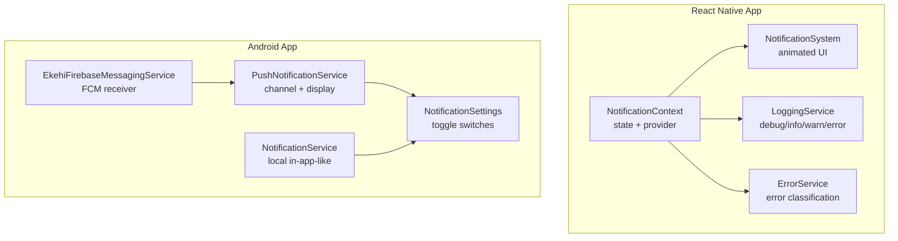
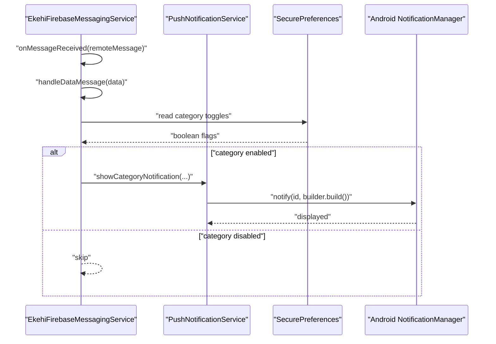
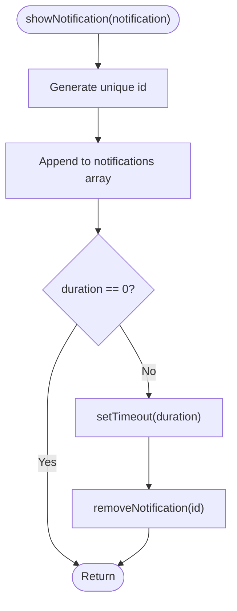
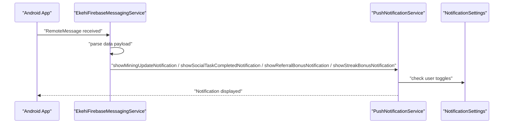
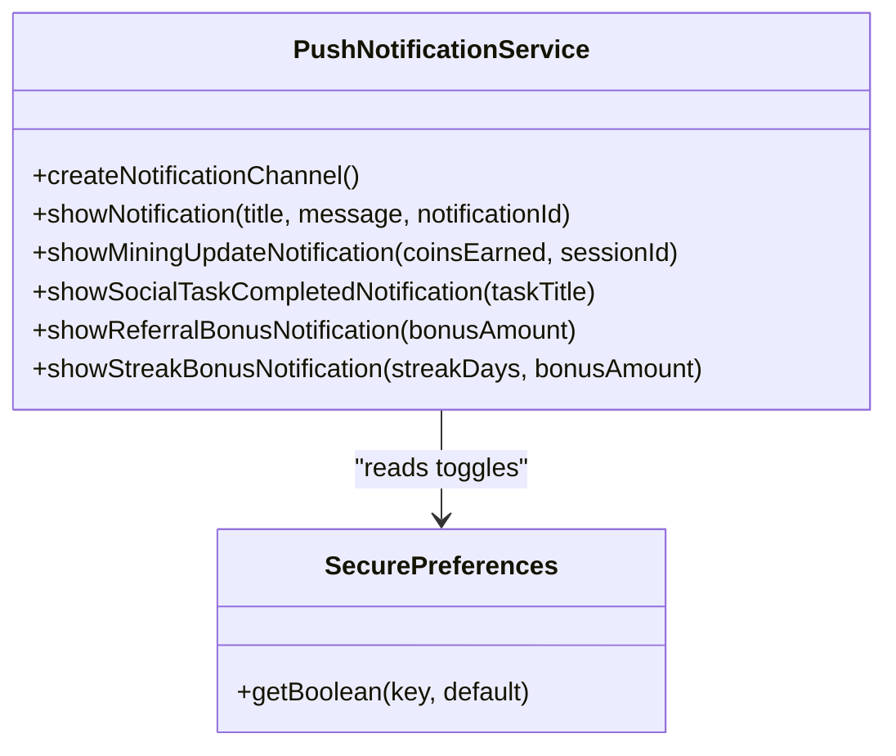
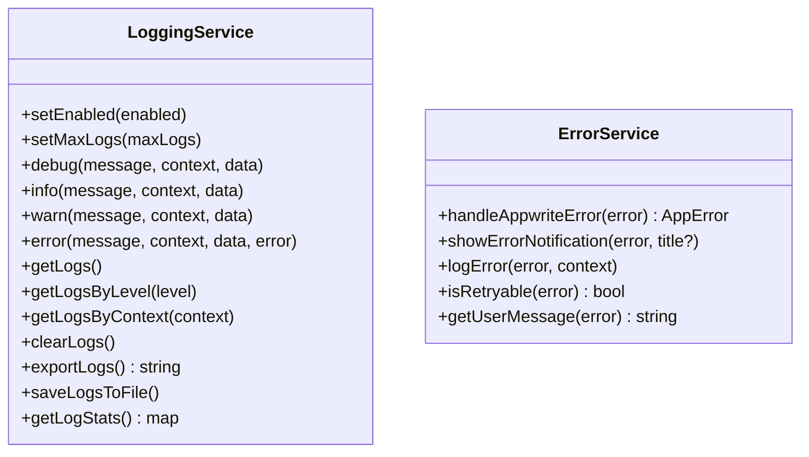
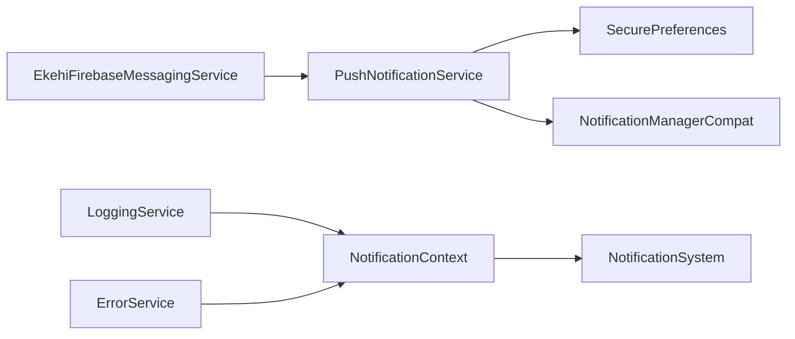

# Notification System

<cite>
**Referenced Files in This Document**
- [NotificationContext.tsx](file://mobileApp/src/contexts/NotificationContext.tsx)
- [NotificationSystem.tsx](file://mobileApp/src/components/NotificationSystem.tsx)
- [LoggingService.ts](file://mobileApp/src/services/LoggingService.ts)
- [ErrorService.ts](file://mobileApp/src/services/ErrorService.ts)
- [NotificationService.kt](file://ktMobileApp/app/src/main/java/com/ekehi/network/service/NotificationService.kt)
- [PushNotificationService.kt](file://ktMobileApp/app/src/main/java/com/ekehi/network/service/PushNotificationService.kt)
- [EkehiFirebaseMessagingService.kt](file://ktMobileApp/app/src/main/java/com/ekehi/network/service/EkehiFirebaseMessagingService.kt)
- [NotificationSettings.kt](file://ktMobileApp/app/src/main/java/com/ekehi/network/presentation/ui/components/NotificationSettings.kt)
</cite>

## Table of Contents
1. [Introduction](#introduction)
2. [Project Structure](#project-structure)
3. [Core Components](#core-components)
4. [Architecture Overview](#architecture-overview)
5. [Detailed Component Analysis](#detailed-component-analysis)
6. [Dependency Analysis](#dependency-analysis)
7. [Performance Considerations](#performance-considerations)
8. [Troubleshooting Guide](#troubleshooting-guide)
9. [Conclusion](#conclusion)
10. [Appendices](#appendices)

## Introduction
This document explains the notification system across both the React Native mobile app and the Android app. It covers:
- Firebase Cloud Messaging integration for push notifications and real-time updates
- Notification state management via a React context
- In-app notification UI and lifecycle
- Logging and error reporting services for debugging and analytics
- User preference management for enabling/disabling notification categories
- Notification scheduling, batching, and performance optimization
- Permission handling, consent management, and privacy considerations

## Project Structure
The notification system spans two platforms:
- React Native app (mobileApp): in-app notifications, context provider, and UI
- Android app (ktMobileApp): native push notifications, FCM service, and settings UI

**Diagram sources**
- [NotificationContext.tsx](file://mobileApp/src/contexts/NotificationContext.tsx#L1-L58)
- [NotificationSystem.tsx](file://mobileApp/src/components/NotificationSystem.tsx#L1-L270)
- [LoggingService.ts](file://mobileApp/src/services/LoggingService.ts#L1-L154)
- [ErrorService.ts](file://mobileApp/src/services/ErrorService.ts#L1-L120)
- [EkehiFirebaseMessagingService.kt](file://ktMobileApp/app/src/main/java/com/ekehi/network/service/EkehiFirebaseMessagingService.kt#L1-L90)
- [PushNotificationService.kt](file://ktMobileApp/app/src/main/java/com/ekehi/network/service/PushNotificationService.kt#L1-L131)
- [NotificationService.kt](file://ktMobileApp/app/src/main/java/com/ekehi/network/service/NotificationService.kt#L1-L96)
- [NotificationSettings.kt](file://ktMobileApp/app/src/main/java/com/ekehi/network/presentation/ui/components/NotificationSettings.kt#L1-L108)

**Section sources**
- [NotificationContext.tsx](file://mobileApp/src/contexts/NotificationContext.tsx#L1-L58)
- [NotificationSystem.tsx](file://mobileApp/src/components/NotificationSystem.tsx#L1-L270)
- [LoggingService.ts](file://mobileApp/src/services/LoggingService.ts#L1-L154)
- [ErrorService.ts](file://mobileApp/src/services/ErrorService.ts#L1-L120)
- [EkehiFirebaseMessagingService.kt](file://ktMobileApp/app/src/main/java/com/ekehi/network/service/EkehiFirebaseMessagingService.kt#L1-L90)
- [PushNotificationService.kt](file://ktMobileApp/app/src/main/java/com/ekehi/network/service/PushNotificationService.kt#L1-L131)
- [NotificationService.kt](file://ktMobileApp/app/src/main/java/com/ekehi/network/service/NotificationService.kt#L1-L96)
- [NotificationSettings.kt](file://ktMobileApp/app/src/main/java/com/ekehi/network/presentation/ui/components/NotificationSettings.kt#L1-L108)

## Core Components
- NotificationContext (React Native): manages in-app notification queue, auto-dismiss timers, and removal
- NotificationSystem (React Native): renders animated, themed notifications with retry and close actions
- LoggingService (React Native): structured logging with levels, filtering, and export
- ErrorService (React Native): categorizes errors, generates user-friendly messages, and logs
- EkehiFirebaseMessagingService (Android): receives FCM messages, routes by type, and delegates to PushNotificationService
- PushNotificationService (Android): creates channels, builds notifications, respects user toggles, and opens app on tap
- NotificationService (Android): local notification helpers for mining, social tasks, referrals, streaks
- NotificationSettings (Android): Compose UI toggles for per-category notification preferences

**Section sources**
- [NotificationContext.tsx](file://mobileApp/src/contexts/NotificationContext.tsx#L1-L58)
- [NotificationSystem.tsx](file://mobileApp/src/components/NotificationSystem.tsx#L1-L270)
- [LoggingService.ts](file://mobileApp/src/services/LoggingService.ts#L1-L154)
- [ErrorService.ts](file://mobileApp/src/services/ErrorService.ts#L1-L120)
- [EkehiFirebaseMessagingService.kt](file://ktMobileApp/app/src/main/java/com/ekehi/network/service/EkehiFirebaseMessagingService.kt#L1-L90)
- [PushNotificationService.kt](file://ktMobileApp/app/src/main/java/com/ekehi/network/service/PushNotificationService.kt#L1-L131)
- [NotificationService.kt](file://ktMobileApp/app/src/main/java/com/ekehi/network/service/NotificationService.kt#L1-L96)
- [NotificationSettings.kt](file://ktMobileApp/app/src/main/java/com/ekehi/network/presentation/ui/components/NotificationSettings.kt#L1-L108)

## Architecture Overview
The system integrates Firebase Cloud Messaging on Android to deliver push notifications. The FCM service parses message types and invokes the push notification service, which checks user preferences and displays notifications. On the React Native side, a context-based in-app notification system provides immediate feedback and user interaction controls.

**Diagram sources**
- [EkehiFirebaseMessagingService.kt](file://ktMobileApp/app/src/main/java/com/ekehi/network/service/EkehiFirebaseMessagingService.kt#L1-L90)
- [PushNotificationService.kt](file://ktMobileApp/app/src/main/java/com/ekehi/network/service/PushNotificationService.kt#L1-L131)

## Detailed Component Analysis

### React Native NotificationContext and UI
- State management: maintains an array of notifications with id, type, title, optional message, duration, and optional retry handler
- Lifecycle: auto-removes notifications after duration (default 5 seconds) unless duration is zero
- Provider pattern: exposes showNotification and removeNotification to consumers
- UI rendering: animated slide-in/out, gradient borders, retry/close actions, and progress indicator

**Diagram sources**
- [NotificationContext.tsx](file://mobileApp/src/contexts/NotificationContext.tsx#L1-L58)
- [NotificationSystem.tsx](file://mobileApp/src/components/NotificationSystem.tsx#L1-L270)

**Section sources**
- [NotificationContext.tsx](file://mobileApp/src/contexts/NotificationContext.tsx#L1-L58)
- [NotificationSystem.tsx](file://mobileApp/src/components/NotificationSystem.tsx#L1-L270)

### Android Firebase Cloud Messaging Integration
- Receives data and notification payloads
- Routes by message type: mining update, social task completed, referral bonus, streak bonus
- Delegates to PushNotificationService for display
- Logs incoming messages and token refresh events

**Diagram sources**
- [EkehiFirebaseMessagingService.kt](file://ktMobileApp/app/src/main/java/com/ekehi/network/service/EkehiFirebaseMessagingService.kt#L1-L90)
- [PushNotificationService.kt](file://ktMobileApp/app/src/main/java/com/ekehi/network/service/PushNotificationService.kt#L1-L131)
- [NotificationSettings.kt](file://ktMobileApp/app/src/main/java/com/ekehi/network/presentation/ui/components/NotificationSettings.kt#L1-L108)

**Section sources**
- [EkehiFirebaseMessagingService.kt](file://ktMobileApp/app/src/main/java/com/ekehi/network/service/EkehiFirebaseMessagingService.kt#L1-L90)

### Push Notification Service (Android)
- Creates notification channels for Android O+
- Respects global and category-specific toggles from SecurePreferences
- Builds notifications with PendingIntent to open MainActivity on tap
- Provides category-specific helpers for mining updates, social task completion, referral bonuses, and streak bonuses

**Diagram sources**
- [PushNotificationService.kt](file://ktMobileApp/app/src/main/java/com/ekehi/network/service/PushNotificationService.kt#L1-L131)

**Section sources**
- [PushNotificationService.kt](file://ktMobileApp/app/src/main/java/com/ekehi/network/service/PushNotificationService.kt#L1-L131)

### Local Notification Service (Android)
- Provides local notification helpers for mining completion, social task completion, referral bonus, and streak
- Reads category toggles from SecurePreferences before displaying
- Uses a fixed channel ID and notification ID for local notifications

**Section sources**
- [NotificationService.kt](file://ktMobileApp/app/src/main/java/com/ekehi/network/service/NotificationService.kt#L1-L96)

### Notification Settings UI (Android)
- Composable UI with four toggles: Mining Updates, Social Task Completion, Referral Bonuses, Streak Bonuses
- Each toggle maps to a SecurePreferences key for persistence
- Descriptive labels and switch styling

**Section sources**
- [NotificationSettings.kt](file://ktMobileApp/app/src/main/java/com/ekehi/network/presentation/ui/components/NotificationSettings.kt#L1-L108)

### Logging and Error Reporting Services
- LoggingService: in-memory ring buffer of logs with levels, filtering, export, and console mirroring
- ErrorService: classifies errors by HTTP codes and messages, provides user-friendly messages, and logs details

**Diagram sources**
- [LoggingService.ts](file://mobileApp/src/services/LoggingService.ts#L1-L154)
- [ErrorService.ts](file://mobileApp/src/services/ErrorService.ts#L1-L120)

**Section sources**
- [LoggingService.ts](file://mobileApp/src/services/LoggingService.ts#L1-L154)
- [ErrorService.ts](file://mobileApp/src/services/ErrorService.ts#L1-L120)

## Dependency Analysis
- Android FCM service depends on PushNotificationService and SecurePreferences
- PushNotificationService depends on SecurePreferences and Android NotificationManager
- React Native NotificationContext depends on React state hooks
- NotificationSystem depends on NotificationContext and UI libraries
- LoggingService and ErrorService are standalone services used across the app

**Diagram sources**
- [EkehiFirebaseMessagingService.kt](file://ktMobileApp/app/src/main/java/com/ekehi/network/service/EkehiFirebaseMessagingService.kt#L1-L90)
- [PushNotificationService.kt](file://ktMobileApp/app/src/main/java/com/ekehi/network/service/PushNotificationService.kt#L1-L131)
- [NotificationContext.tsx](file://mobileApp/src/contexts/NotificationContext.tsx#L1-L58)
- [NotificationSystem.tsx](file://mobileApp/src/components/NotificationSystem.tsx#L1-L270)
- [LoggingService.ts](file://mobileApp/src/services/LoggingService.ts#L1-L154)
- [ErrorService.ts](file://mobileApp/src/services/ErrorService.ts#L1-L120)

**Section sources**
- [EkehiFirebaseMessagingService.kt](file://ktMobileApp/app/src/main/java/com/ekehi/network/service/EkehiFirebaseMessagingService.kt#L1-L90)
- [PushNotificationService.kt](file://ktMobileApp/app/src/main/java/com/ekehi/network/service/PushNotificationService.kt#L1-L131)
- [NotificationContext.tsx](file://mobileApp/src/contexts/NotificationContext.tsx#L1-L58)
- [NotificationSystem.tsx](file://mobileApp/src/components/NotificationSystem.tsx#L1-L270)
- [LoggingService.ts](file://mobileApp/src/services/LoggingService.ts#L1-L154)
- [ErrorService.ts](file://mobileApp/src/services/ErrorService.ts#L1-L120)

## Performance Considerations
- Channel creation is performed once during initialization to avoid repeated overhead
- Notification IDs for push notifications are derived from current time or hash of identifiers to prevent collisions while maintaining uniqueness
- In-app notifications auto-remove after a configurable duration to prevent UI clutter
- LoggingService maintains a capped in-memory buffer to limit memory growth
- Avoid excessive re-renders by passing memoized callbacks and stable references where applicable

[No sources needed since this section provides general guidance]

## Troubleshooting Guide
- FCM token not received: verify service registration and logs for token refresh events
- Notifications not displayed: confirm category toggles in SecurePreferences and that channels are created
- In-app notifications not disappearing: ensure duration is set appropriately and that removeNotification is called
- Excessive logs: adjust LoggingService.setMaxLogs and enable/disable logging as needed
- Error handling: use ErrorService to classify and present user-friendly messages; log details for debugging

**Section sources**
- [EkehiFirebaseMessagingService.kt](file://ktMobileApp/app/src/main/java/com/ekehi/network/service/EkehiFirebaseMessagingService.kt#L1-L90)
- [PushNotificationService.kt](file://ktMobileApp/app/src/main/java/com/ekehi/network/service/PushNotificationService.kt#L1-L131)
- [NotificationContext.tsx](file://mobileApp/src/contexts/NotificationContext.tsx#L1-L58)
- [LoggingService.ts](file://mobileApp/src/services/LoggingService.ts#L1-L154)
- [ErrorService.ts](file://mobileApp/src/services/ErrorService.ts#L1-L120)

## Conclusion
The notification system combines a React Native in-app notification context with an Android push notification pipeline powered by Firebase Cloud Messaging. Preferences are persisted and respected across categories, while robust logging and error services support debugging and analytics. The architecture supports extensibility for additional notification types and scheduling strategies.

[No sources needed since this section summarizes without analyzing specific files]

## Appendices

### Example Scenarios and Message Formatting
- Mining update: title “Mining Update”, body indicating earned coins and session identifier
- Social task completed: title “Task Completed”, body including task title and reward acknowledgment
- Referral bonus: title “Referral Bonus”, body indicating bonus amount
- Streak bonus: title “Streak Bonus”, body including streak days and bonus amount
- General push: title and message from payload, with app opening on tap

**Section sources**
- [EkehiFirebaseMessagingService.kt](file://ktMobileApp/app/src/main/java/com/ekehi/network/service/EkehiFirebaseMessagingService.kt#L1-L90)
- [PushNotificationService.kt](file://ktMobileApp/app/src/main/java/com/ekehi/network/service/PushNotificationService.kt#L1-L131)

### User Preference Management
- Keys for toggles include mining, social task, referral, and streak categories
- Defaults are set to enabled for a better user experience unless otherwise configured
- Toggle UI is provided in the settings screen

**Section sources**
- [PushNotificationService.kt](file://ktMobileApp/app/src/main/java/com/ekehi/network/service/PushNotificationService.kt#L1-L131)
- [NotificationSettings.kt](file://ktMobileApp/app/src/main/java/com/ekehi/network/presentation/ui/components/NotificationSettings.kt#L1-L108)

### Scheduling, Batching, and Optimization
- Scheduling: use notification IDs derived from identifiers or timestamps to manage uniqueness
- Batching: group related notifications by category and defer non-critical ones
- Optimization: minimize channel creation, reuse builders, and cap log retention

[No sources needed since this section provides general guidance]

### Permissions, Consent, and Privacy
- Respect user toggles for each notification category
- Avoid sending sensitive data in notification payloads; prefer data payloads with minimal PII
- Provide clear settings UI and opt-out mechanisms
- Log only necessary diagnostic information and avoid persisting personal data

[No sources needed since this section provides general guidance]