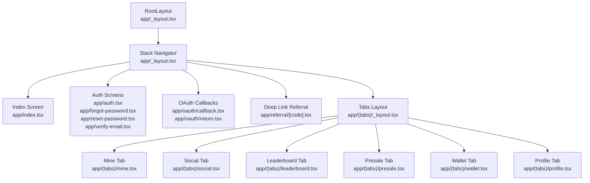
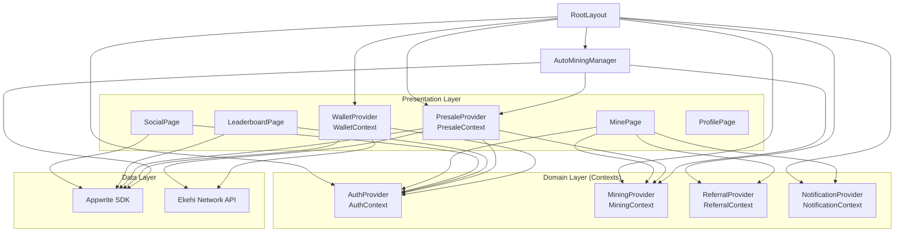
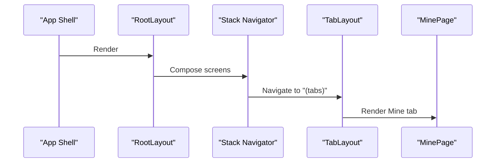
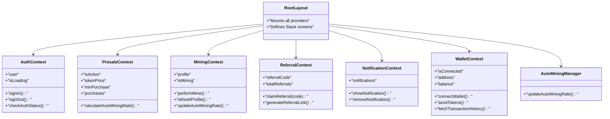
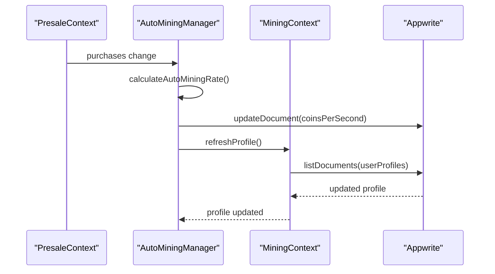
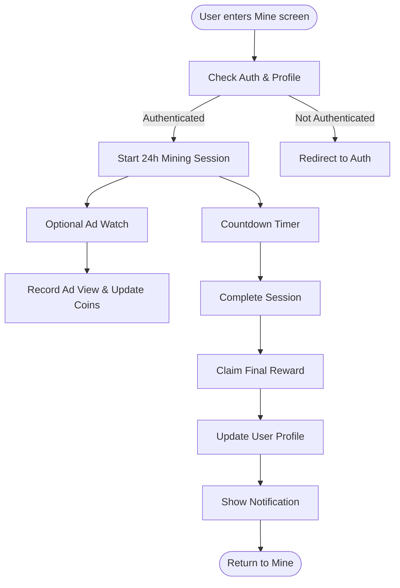
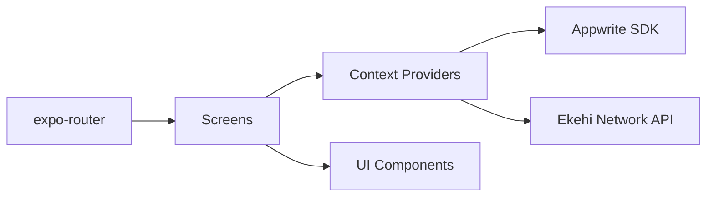

# Project Structure

<cite>
**Referenced Files in This Document**
- [RootLayout](file://mobileApp/app/_layout.tsx)
- [TabLayout](file://mobileApp/app/(tabs)/_layout.tsx)
- [MinePage](file://mobileApp/app/(tabs)/mine.tsx)
- [SocialPage](file://mobileApp/app/(tabs)/social.tsx)
- [LeaderboardPage](file://mobileApp/app/(tabs)/leaderboard.tsx)
- [PresalePage](file://mobileApp/app/(tabs)/presale.tsx)
- [WalletPage](file://mobileApp/app/(tabs)/wallet.tsx)
- [AuthContext](file://mobileApp/src/contexts/AuthContext.tsx)
- [MiningContext](file://mobileApp/src/contexts/MiningContext.tsx)
- [ReferralContext](file://mobileApp/src/contexts/ReferralContext.tsx)
- [NotificationContext](file://mobileApp/src/contexts/NotificationContext.tsx)
- [PresaleContext](file://mobileApp/src/contexts/PresaleContext.tsx)
- [WalletContext](file://mobileApp/src/contexts/WalletContext.tsx)
- [AutoMiningManager](file://mobileApp/src/components/AutoMiningManager.tsx)
- [UserProfile type](file://mobileApp/src/types/index.ts)
- [package.json](file://mobileApp/package.json)
</cite>

## Table of Contents
1. [Introduction](#introduction)
2. [Project Structure](#project-structure)
3. [Core Components](#core-components)
4. [Architecture Overview](#architecture-overview)
5. [Detailed Component Analysis](#detailed-component-analysis)
6. [Dependency Analysis](#dependency-analysis)
7. [Performance Considerations](#performance-considerations)
8. [Troubleshooting Guide](#troubleshooting-guide)
9. [Conclusion](#conclusion)

## Introduction
This document explains the React Native mobile application’s project structure built with Expo Router. It covers the tab-based navigation system, the context provider hierarchy, component organization, routing patterns, and the AutoMiningManager integration for background mining operations. It also provides guidelines for adding new screens, components, and context providers while preserving architectural consistency.

## Project Structure
The mobile app is organized under the mobileApp directory with:
- Routing and navigation in app/
- Feature-specific screens under app/(tabs)/
- Shared contexts under src/contexts/
- Shared components under src/components/
- Types under src/types/
- Services and utilities under src/services/ and src/utils/

Routing is managed by Expo Router. The root layout composes the global Stack navigator and mounts all context providers. Tab layouts define the bottom-tabbed interface.

**Diagram sources**
- [RootLayout](file://mobileApp/app/_layout.tsx#L1-L39)
- [TabLayout](file://mobileApp/app/(tabs)/_layout.tsx#L1-L80)

**Section sources**
- [RootLayout](file://mobileApp/app/_layout.tsx#L1-L39)
- [TabLayout](file://mobileApp/app/(tabs)/_layout.tsx#L1-L80)

## Core Components
- Context Providers (mounted in RootLayout):
  - AuthProvider: Authentication state and lifecycle.
  - PresaleProvider: Token presale state and auto mining rate computation.
  - MiningProvider: User profile, mining actions, and session management.
  - ReferralProvider: Referral code, history, and rewards.
  - NotificationProvider: Global notification queue.
  - WalletProvider: Ekehi Network wallet connection and token transfers.
- AutoMiningManager: Background updater of auto mining rates based on purchases.
- Screen components: Feature screens for Mine, Social, Leaderboard, Presale, Wallet, and Profile.

Key responsibilities:
- AuthContext: Handles sign-in/sign-out, profile creation, and secure account operations.
- MiningContext: Manages user profile, mining actions, and auto mining rate updates.
- PresaleContext: Processes purchases, computes auto mining benefits, and enforces caps.
- ReferralContext: Generates and validates referral codes, applies referral bonuses.
- NotificationContext: Centralized notifications with auto-dismiss.
- WalletContext: Wallet connect/disconnect, balance retrieval, transaction history, and sends tokens.
- AutoMiningManager: Synchronizes auto mining rate with backend and triggers refresh.

**Section sources**
- [AuthContext](file://mobileApp/src/contexts/AuthContext.tsx#L1-L724)
- [MiningContext](file://mobileApp/src/contexts/MiningContext.tsx#L1-L619)
- [PresaleContext](file://mobileApp/src/contexts/PresaleContext.tsx#L1-L414)
- [ReferralContext](file://mobileApp/src/contexts/ReferralContext.tsx#L1-L249)
- [NotificationContext](file://mobileApp/src/contexts/NotificationContext.tsx#L1-L58)
- [WalletContext](file://mobileApp/src/contexts/WalletContext.tsx#L1-L297)
- [AutoMiningManager](file://mobileApp/src/components/AutoMiningManager.tsx#L1-L54)

## Architecture Overview
The app uses a layered architecture:
- Presentation Layer: Screens and UI components.
- Domain Layer: Contexts encapsulate business logic and state.
- Data Layer: Appwrite SDK and Ekehi Network API integrations.

**Diagram sources**
- [RootLayout](file://mobileApp/app/_layout.tsx#L1-L39)
- [AutoMiningManager](file://mobileApp/src/components/AutoMiningManager.tsx#L1-L54)
- [MinePage](file://mobileApp/app/(tabs)/mine.tsx#L1-L762)
- [SocialPage](file://mobileApp/app/(tabs)/social.tsx#L1-L683)
- [LeaderboardPage](file://mobileApp/app/(tabs)/leaderboard.tsx#L1-L601)
- [PresalePage](file://mobileApp/app/(tabs)/presale.tsx#L1-L854)
- [WalletPage](file://mobileApp/app/(tabs)/wallet.tsx#L1-L596)
- [AuthContext](file://mobileApp/src/contexts/AuthContext.tsx#L1-L724)
- [MiningContext](file://mobileApp/src/contexts/MiningContext.tsx#L1-L619)
- [PresaleContext](file://mobileApp/src/contexts/PresaleContext.tsx#L1-L414)
- [ReferralContext](file://mobileApp/src/contexts/ReferralContext.tsx#L1-L249)
- [NotificationContext](file://mobileApp/src/contexts/NotificationContext.tsx#L1-L58)
- [WalletContext](file://mobileApp/src/contexts/WalletContext.tsx#L1-L297)

## Detailed Component Analysis

### Navigation and Routing
- Root layout composes a Stack navigator and mounts all context providers. It declares screens for index, auth, OAuth callbacks, email verification, and the tab group.
- Tab layout defines five tabs: Mine, Social, Leaderboard, Presale, Wallet, and Profile. Icons and styling are centralized in the tab layout.

**Diagram sources**
- [RootLayout](file://mobileApp/app/_layout.tsx#L1-L39)
- [TabLayout](file://mobileApp/app/(tabs)/_layout.tsx#L1-L80)
- [MinePage](file://mobileApp/app/(tabs)/mine.tsx#L1-L762)

**Section sources**
- [RootLayout](file://mobileApp/app/_layout.tsx#L1-L39)
- [TabLayout](file://mobileApp/app/(tabs)/_layout.tsx#L1-L80)

### Context Provider Hierarchy
The provider tree is declared in RootLayout and consumed by screens. Each context encapsulates a cohesive domain:
- AuthContext: user, isLoading, sign-in/out, profile creation, and account operations.
- MiningContext: profile, mining actions, session tracking, and auto mining rate synchronization.
- PresaleContext: presale state, purchases, auto mining rate calculation, and limits.
- ReferralContext: referral code, history, and rewards.
- NotificationContext: notifications queue and dismissal.
- WalletContext: wallet connect/disconnect, balance, transactions, and sends.

**Diagram sources**
- [RootLayout](file://mobileApp/app/_layout.tsx#L1-L39)
- [AuthContext](file://mobileApp/src/contexts/AuthContext.tsx#L1-L724)
- [MiningContext](file://mobileApp/src/contexts/MiningContext.tsx#L1-L619)
- [PresaleContext](file://mobileApp/src/contexts/PresaleContext.tsx#L1-L414)
- [ReferralContext](file://mobileApp/src/contexts/ReferralContext.tsx#L1-L249)
- [NotificationContext](file://mobileApp/src/contexts/NotificationContext.tsx#L1-L58)
- [WalletContext](file://mobileApp/src/contexts/WalletContext.tsx#L1-L297)
- [AutoMiningManager](file://mobileApp/src/components/AutoMiningManager.tsx#L1-L54)

**Section sources**
- [RootLayout](file://mobileApp/app/_layout.tsx#L1-L39)
- [AuthContext](file://mobileApp/src/contexts/AuthContext.tsx#L1-L724)
- [MiningContext](file://mobileApp/src/contexts/MiningContext.tsx#L1-L619)
- [PresaleContext](file://mobileApp/src/contexts/PresaleContext.tsx#L1-L414)
- [ReferralContext](file://mobileApp/src/contexts/ReferralContext.tsx#L1-L249)
- [NotificationContext](file://mobileApp/src/contexts/NotificationContext.tsx#L1-L58)
- [WalletContext](file://mobileApp/src/contexts/WalletContext.tsx#L1-L297)
- [AutoMiningManager](file://mobileApp/src/components/AutoMiningManager.tsx#L1-L54)

### AutoMiningManager Integration
AutoMiningManager listens to purchase changes and updates the user’s auto mining rate in the backend, then refreshes the profile. It ensures the UI reflects accurate passive mining earnings.

**Diagram sources**
- [AutoMiningManager](file://mobileApp/src/components/AutoMiningManager.tsx#L1-L54)
- [PresaleContext](file://mobileApp/src/contexts/PresaleContext.tsx#L1-L414)
- [MiningContext](file://mobileApp/src/contexts/MiningContext.tsx#L1-L619)

**Section sources**
- [AutoMiningManager](file://mobileApp/src/components/AutoMiningManager.tsx#L1-L54)
- [PresaleContext](file://mobileApp/src/contexts/PresaleContext.tsx#L1-L414)
- [MiningContext](file://mobileApp/src/contexts/MiningContext.tsx#L1-L619)

### Screen Composition and Patterns
- Mine screen orchestrates 24-hour mining sessions, ad bonuses, notifications, and referral sharing. It uses MiningContext for profile and actions, PresaleContext for auto mining rate, and NotificationContext for user feedback.
- Social screen lists tasks, opens external links, and records completions with Appwrite.
- Leaderboard screen fetches top users and renders a ranked grid with memoized entries.
- Presale screen handles token purchases, displays progress, and computes auto mining benefits.
- Wallet screen connects wallets, displays balances, and manages token transfers via Ekehi Network API.

**Diagram sources**
- [MinePage](file://mobileApp/app/(tabs)/mine.tsx#L1-L762)

**Section sources**
- [MinePage](file://mobileApp/app/(tabs)/mine.tsx#L1-L762)
- [SocialPage](file://mobileApp/app/(tabs)/social.tsx#L1-L683)
- [LeaderboardPage](file://mobileApp/app/(tabs)/leaderboard.tsx#L1-L601)
- [PresalePage](file://mobileApp/app/(tabs)/presale.tsx#L1-L854)
- [WalletPage](file://mobileApp/app/(tabs)/wallet.tsx#L1-L596)

### Component Organization and Naming Conventions
- Screens: app/(tabs)/<name>.tsx for tabbed views; app/<name>.tsx for standalone routes.
- Contexts: src/contexts/<Feature>Context.tsx with Provider and hook.
- Components: src/components/*.tsx for reusable UI/logic.
- Types: src/types/index.ts for shared interfaces.
- Utilities: src/utils/* for helpers; src/services/* for integrations.

**Section sources**
- [UserProfile type](file://mobileApp/src/types/index.ts#L1-L98)
- [package.json](file://mobileApp/package.json#L1-L108)

## Dependency Analysis
- Routing: expo-router controls navigation and screen composition.
- State: React Contexts provide cross-component state sharing.
- Data: Appwrite SDK for user profiles, purchases, tasks, and sessions; Ekehi Network API for wallet and token operations.
- UI: lucide-react-native icons; expo-linear-gradient for backgrounds; react-native components.

**Diagram sources**
- [package.json](file://mobileApp/package.json#L1-L108)
- [RootLayout](file://mobileApp/app/_layout.tsx#L1-L39)

**Section sources**
- [package.json](file://mobileApp/package.json#L1-L108)

## Performance Considerations
- Debouncing and throttling: MiningContext and AuthContext implement timers and ref counts to avoid redundant network calls.
- Memoization: Pages use memoized components (e.g., MemoizedLeaderboardEntry, MemoizedProfileStats) to reduce re-renders.
- Efficient profile updates: MiningContext supports silent refresh and targeted coin updates to minimize UI jank.
- Retry/backoff: Auth and mining operations wrap network calls with retry mechanisms to improve resilience.

[No sources needed since this section provides general guidance]

## Troubleshooting Guide
Common areas to inspect:
- Authentication failures: Review AuthContext sign-in/sign-out flows and error alerts.
- Network timeouts: Check retry logic and timeout handling in AuthContext and MiningContext.
- Missing profile data: Ensure user profile creation occurs on first login and that refreshProfile is invoked on user changes.
- Auto mining not updating: Confirm PresaleContext purchases are loaded and AutoMiningManager runs on changes.
- Wallet connectivity: Validate Ekehi Network API configuration and fallback behavior in WalletContext.

**Section sources**
- [AuthContext](file://mobileApp/src/contexts/AuthContext.tsx#L1-L724)
- [MiningContext](file://mobileApp/src/contexts/MiningContext.tsx#L1-L619)
- [PresaleContext](file://mobileApp/src/contexts/PresaleContext.tsx#L1-L414)
- [WalletContext](file://mobileApp/src/contexts/WalletContext.tsx#L1-L297)

## Conclusion
The project employs a clean, modular architecture with Expo Router for navigation and React Contexts for state management. The AutoMiningManager integrates seamlessly with PresaleContext and MiningContext to keep auto mining rates accurate. Screens are organized by feature and consume contexts appropriately. Following the guidelines below will help maintain consistency as new features are added.

## Guidelines for Extending the Application

- Adding a new screen:
  - Place under app/(tabs)/ for tabbed screens or app/ for standalone routes.
  - Import and declare the screen in RootLayout Stack if it is not part of the tabs group.
  - Consume required contexts at the top of the screen component.

- Adding a new context provider:
  - Create src/contexts/<Feature>Context.tsx with a Provider and a custom hook.
  - Mount the Provider in RootLayout beneath existing providers.
  - Export the hook and use it in relevant screens.

- Adding a new component:
  - Place under src/components/.
  - Keep presentational components pure and reusable.
  - For logic-heavy components, consider extracting to a hook or service.

- Integrating with Appwrite/Ekehi APIs:
  - Use the configured clients and collections from src/config.
  - Wrap network calls with retry/backoff and error handling.
  - Update context state and trigger refresh functions to keep UI consistent.

- Ensuring performance:
  - Use memoization for expensive renders.
  - Debounce frequent operations (e.g., profile refresh).
  - Prefer targeted state updates (e.g., updateCoinsOnly) when appropriate.

[No sources needed since this section provides general guidance]