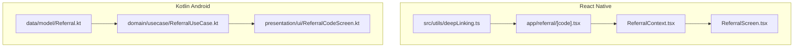
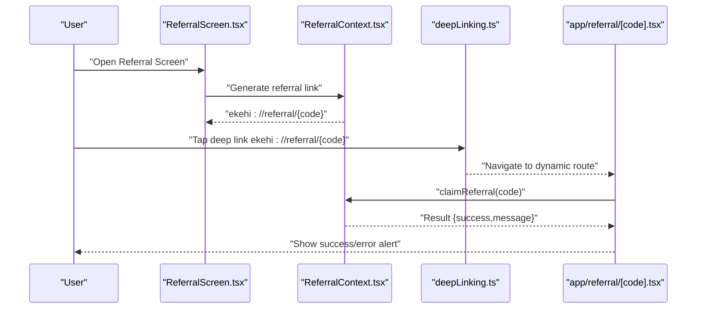
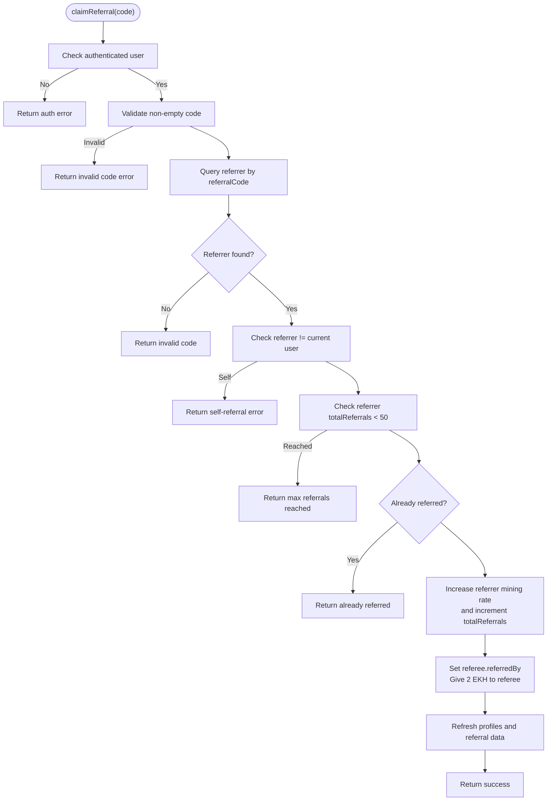
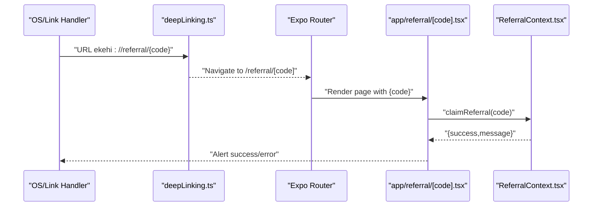
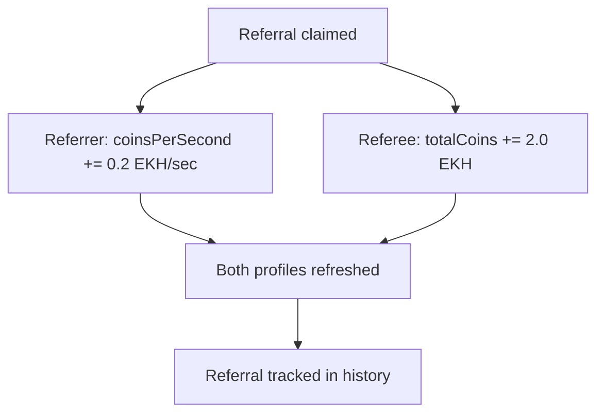
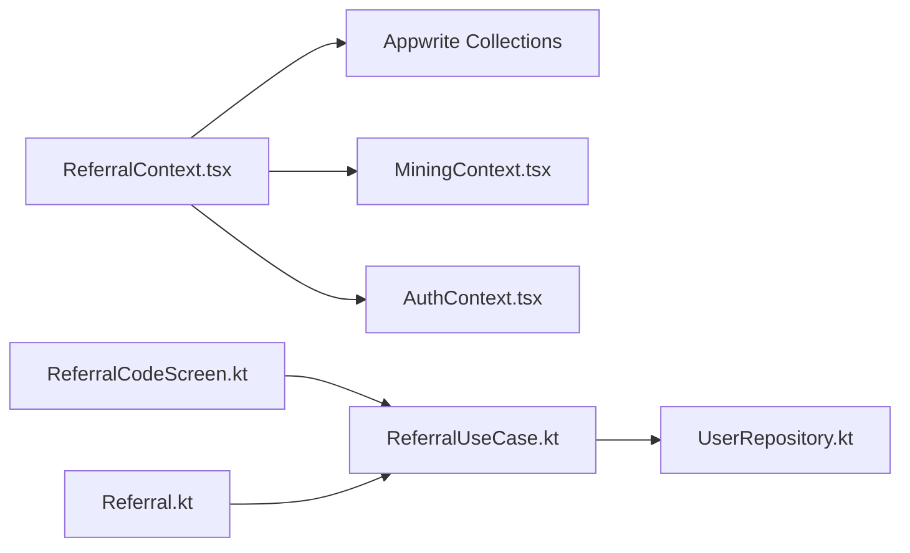
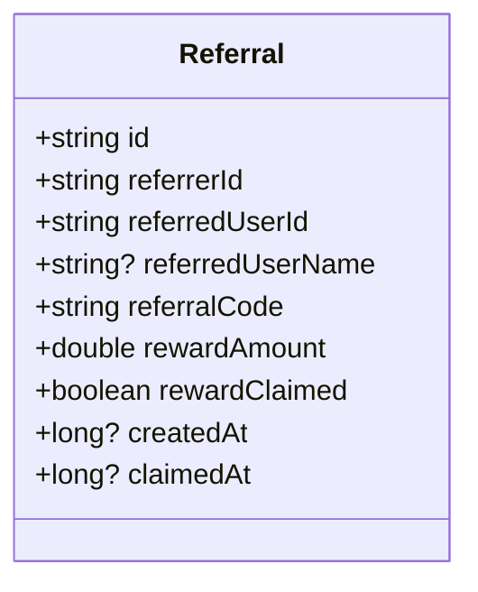

# Referral System

<cite>
**Referenced Files in This Document**
- [ReferralContext.tsx](file://mobileApp/src/contexts/ReferralContext.tsx)
- [ReferralScreen.tsx](file://mobileApp/src/components/ReferralScreen.tsx)
- [ReferralCodeScreen.kt](file://ktMobileApp/app/src/main/java/com/ekehi/network/presentation/ui/ReferralCodeScreen.kt)
- [ReferralUseCase.kt](file://ktMobileApp/app/src/main/java/com/ekehi/network/domain/usecase/ReferralUseCase.kt)
- [Referral.kt](file://ktMobileApp/app/src/main/java/com/ekehi/network/data/model/Referral.kt)
- [ReferralLinkPage.tsx](file://mobileApp/app/referral/[code].tsx)
- [referral.tsx](file://mobileApp/app/referral.tsx)
- [deepLinking.ts](file://mobileApp/src/utils/deepLinking.ts)
- [REFERRAL_SYSTEM_DOCUMENTATION.md](file://mobileApp/Documentations/REFERRAL_SYSTEM_DOCUMENTATION.md)
- [test-referral-system.js](file://mobileApp/Scripts/test-referral-system.js)
- [test-referral-logic.js](file://mobileApp/Scripts/test-referral-logic.js)
- [test-max-referrals.js](file://mobileApp/Scripts/test-max-referrals.js)
- [test-self-referral.js](file://mobileApp/Scripts/test-self-referral.js)
</cite>

## Table of Contents
1. [Introduction](#introduction)
2. [Project Structure](#project-structure)
3. [Core Components](#core-components)
4. [Architecture Overview](#architecture-overview)
5. [Detailed Component Analysis](#detailed-component-analysis)
6. [Dependency Analysis](#dependency-analysis)
7. [Performance Considerations](#performance-considerations)
8. [Troubleshooting Guide](#troubleshooting-guide)
9. [Conclusion](#conclusion)
10. [Appendices](#appendices)

## Introduction
This document explains the referral system component for the Ekehi Network mobile application. It covers referral code generation and sharing, deep linking integration, the ReferralContext implementation (including reward tracking and analytics hooks), the referral screen components (UI, sharing options, and statistics), the commission system (tiered rewards, payouts, and user acquisition tracking), practical examples (link generation, code validation, and distribution), and the analytics and fraud prevention strategies.

## Project Structure
The referral system spans both the React Native mobile app and the Kotlin Android app:
- React Native:
  - Context provider for referral operations and state
  - UI screens for displaying and claiming referral codes
  - Deep linking handlers for referral links
- Kotlin Android:
  - Domain use case for referral operations
  - UI screen for displaying and claiming referral codes
  - Data model representing a referral record

**Diagram sources**
- [ReferralContext.tsx](file://mobileApp/src/contexts/ReferralContext.tsx#L1-L249)
- [ReferralScreen.tsx](file://mobileApp/src/components/ReferralScreen.tsx#L1-L307)
- [ReferralLinkPage.tsx](file://mobileApp/app/referral/[code].tsx#L1-L87)
- [deepLinking.ts](file://mobileApp/src/utils/deepLinking.ts#L1-L40)
- [ReferralUseCase.kt](file://ktMobileApp/app/src/main/java/com/ekehi/network/domain/usecase/ReferralUseCase.kt#L1-L40)
- [ReferralCodeScreen.kt](file://ktMobileApp/app/src/main/java/com/ekehi/network/presentation/ui/ReferralCodeScreen.kt#L1-L459)
- [Referral.kt](file://ktMobileApp/app/src/main/java/com/ekehi/network/data/model/Referral.kt#L1-L13)

**Section sources**
- [REFERRAL_SYSTEM_DOCUMENTATION.md](file://mobileApp/Documentations/REFERRAL_SYSTEM_DOCUMENTATION.md#L1-L106)

## Core Components
- ReferralContext (React Native):
  - Provides referral code generation, claiming, history retrieval, and deep link generation
  - Tracks total referrals and displays referral-related info
  - Integrates with mining context to refresh user profiles after referral actions
- ReferralScreen (React Native):
  - Displays referral code, copy/share actions, claim form, statistics, and referral history
- ReferralLinkPage (React Native):
  - Handles dynamic deep links of the form ekehi://referral/:code and auto-claims the code when the user is authenticated
- deepLinking utility (React Native):
  - Parses incoming URLs, stores referral codes in storage, and routes to the appropriate handler
- ReferralUseCase (Kotlin Android):
  - Encapsulates referral operations and exposes a reactive stream of results
- ReferralCodeScreen (Kotlin Android):
  - Compose UI for displaying and claiming referral codes, copying, and sharing
- Referral data model (Kotlin Android):
  - Represents a referral record with reward amount, claim status, timestamps, and identifiers

**Section sources**
- [ReferralContext.tsx](file://mobileApp/src/contexts/ReferralContext.tsx#L1-L249)
- [ReferralScreen.tsx](file://mobileApp/src/components/ReferralScreen.tsx#L1-L307)
- [ReferralLinkPage.tsx](file://mobileApp/app/referral/[code].tsx#L1-L87)
- [deepLinking.ts](file://mobileApp/src/utils/deepLinking.ts#L1-L40)
- [ReferralUseCase.kt](file://ktMobileApp/app/src/main/java/com/ekehi/network/domain/usecase/ReferralUseCase.kt#L1-L40)
- [ReferralCodeScreen.kt](file://ktMobileApp/app/src/main/java/com/ekehi/network/presentation/ui/ReferralCodeScreen.kt#L1-L459)
- [Referral.kt](file://ktMobileApp/app/src/main/java/com/ekehi/network/data/model/Referral.kt#L1-L13)

## Architecture Overview
The referral system is composed of:
- UI layers (React Native and Kotlin Compose) that render referral information and capture user actions
- Context/use case layers that orchestrate referral operations
- Data persistence via Appwrite collections for user profiles and referral records
- Deep linking pipeline that captures referral codes and triggers automatic claiming

**Diagram sources**
- [ReferralScreen.tsx](file://mobileApp/src/components/ReferralScreen.tsx#L1-L307)
- [ReferralContext.tsx](file://mobileApp/src/contexts/ReferralContext.tsx#L1-L249)
- [deepLinking.ts](file://mobileApp/src/utils/deepLinking.ts#L1-L40)
- [ReferralLinkPage.tsx](file://mobileApp/app/referral/[code].tsx#L1-L87)

## Detailed Component Analysis

### ReferralContext (React Native)
Responsibilities:
- Generate unique referral codes with collision checks and fallback generation
- Claim referral codes with validation (self-referral, multiple claims, max referrals)
- Update referrer mining rate and referee balance atomically
- Provide referral link generation and history retrieval
- Refresh user profiles after operations

Key behaviors:
- Uniqueness loop with Appwrite query to avoid duplicates
- Validation rules enforced before updating documents
- Uses a dedicated mining rate service endpoint to increase referrer mining rate
- Returns structured results for UI feedback

**Diagram sources**
- [ReferralContext.tsx](file://mobileApp/src/contexts/ReferralContext.tsx#L99-L195)

**Section sources**
- [ReferralContext.tsx](file://mobileApp/src/contexts/ReferralContext.tsx#L1-L249)

### Referral Screen (React Native)
Responsibilities:
- Display referral code and stats
- Allow copying and sharing referral links
- Claim referral codes with user input
- Load and display referral history
- Provide visual feedback and loading states

Integration points:
- Uses useReferral for all referral operations
- Uses useAuth for user context
- Clipboard and Share APIs for user actions

**Section sources**
- [ReferralScreen.tsx](file://mobileApp/src/components/ReferralScreen.tsx#L1-L307)

### Referral Screen (Kotlin Android)
Responsibilities:
- Display referral code and benefits
- Copy code to clipboard and share via system chooser
- Claim referral via ViewModel and show success/error messages
- Present referral history and loading states

Integration points:
- Uses ProfileViewModel to drive UI state
- Emits Resource states for loading/success/error

**Section sources**
- [ReferralCodeScreen.kt](file://ktMobileApp/app/src/main/java/com/ekehi/network/presentation/ui/ReferralCodeScreen.kt#L1-L459)

### Deep Linking Integration
Mechanisms:
- Dynamic route handler app/referral/[code].tsx processes the code parameter
- deepLinking.ts parses URLs and stores referral codes for later use
- On link click, the app navigates to the dynamic route and claims the code if the user is authenticated

**Diagram sources**
- [deepLinking.ts](file://mobileApp/src/utils/deepLinking.ts#L1-L40)
- [ReferralLinkPage.tsx](file://mobileApp/app/referral/[code].tsx#L1-L87)
- [ReferralContext.tsx](file://mobileApp/src/contexts/ReferralContext.tsx#L99-L195)

**Section sources**
- [ReferralLinkPage.tsx](file://mobileApp/app/referral/[code].tsx#L1-L87)
- [deepLinking.ts](file://mobileApp/src/utils/deepLinking.ts#L1-L40)

### Commission System and Payout Processing
Current mechanics:
- Referee reward: 2.0 EKH credited to referee’s balance upon successful claim
- Referrer reward: Increased mining rate (coinsPerSecond) by 0.2 EKH/second per successful referral
- Maximum referrals enforced at 50 per user
- Atomic updates performed via Appwrite document updates

Future enhancements (as documented):
- Tiered rewards
- Payout processing workflows
- Analytics dashboard
- Expiration dates for referrals

**Diagram sources**
- [ReferralContext.tsx](file://mobileApp/src/contexts/ReferralContext.tsx#L149-L188)
- [REFERRAL_SYSTEM_DOCUMENTATION.md](file://mobileApp/Documentations/REFERRAL_SYSTEM_DOCUMENTATION.md#L45-L57)

**Section sources**
- [ReferralContext.tsx](file://mobileApp/src/contexts/ReferralContext.tsx#L149-L188)
- [REFERRAL_SYSTEM_DOCUMENTATION.md](file://mobileApp/Documentations/REFERRAL_SYSTEM_DOCUMENTATION.md#L45-L57)

### Referral Analytics and Tracking
Tracking capabilities present:
- Referral history retrieval for referrers
- Stats display (total referrals, per-referral reward, personal reward)
- Mining rate increases act as a measurable impact indicator

Analytics hooks:
- The context exposes methods to retrieve history and refresh data
- The Android UI also surfaces referral statistics and history

Note: The current implementation does not include a dedicated analytics dashboard. The documentation outlines potential future enhancements such as analytics dashboards and leaderboards.

**Section sources**
- [ReferralContext.tsx](file://mobileApp/src/contexts/ReferralContext.tsx#L202-L223)
- [ReferralScreen.tsx](file://mobileApp/src/components/ReferralScreen.tsx#L120-L183)
- [REFERRAL_SYSTEM_DOCUMENTATION.md](file://mobileApp/Documentations/REFERRAL_SYSTEM_DOCUMENTATION.md#L99-L106)

### Fraud Prevention and Duplicate Detection
Prevention strategies implemented:
- Self-referral prevention (referrer cannot equal current user)
- Single-use policy (users cannot claim multiple referral codes)
- Maximum referrals cap (50 per user)
- Unique referral code generation with collision checks and fallback

Validation tests:
- Logic tests confirm maximum referral limit enforcement
- Self-referral prevention logic verified
- End-to-end system test simulates claim and verifies atomic updates

**Section sources**
- [ReferralContext.tsx](file://mobileApp/src/contexts/ReferralContext.tsx#L117-L149)
- [test-max-referrals.js](file://mobileApp/Scripts/test-max-referrals.js#L1-L60)
- [test-self-referral.js](file://mobileApp/Scripts/test-self-referral.js#L1-L36)
- [test-referral-system.js](file://mobileApp/Scripts/test-referral-system.js#L100-L138)

## Dependency Analysis
High-level dependencies:
- React Native ReferralContext depends on:
  - Appwrite client for queries and updates
  - Mining context for profile refresh
  - Auth context for user identity
- Android ReferralUseCase depends on:
  - UserRepository for data operations
  - Resource model for reactive results
- UI components depend on their respective contexts/use cases

**Diagram sources**
- [ReferralContext.tsx](file://mobileApp/src/contexts/ReferralContext.tsx#L1-L249)
- [ReferralUseCase.kt](file://ktMobileApp/app/src/main/java/com/ekehi/network/domain/usecase/ReferralUseCase.kt#L1-L40)
- [ReferralCodeScreen.kt](file://ktMobileApp/app/src/main/java/com/ekehi/network/presentation/ui/ReferralCodeScreen.kt#L1-L459)
- [Referral.kt](file://ktMobileApp/app/src/main/java/com/ekehi/network/data/model/Referral.kt#L1-L13)

**Section sources**
- [ReferralContext.tsx](file://mobileApp/src/contexts/ReferralContext.tsx#L1-L249)
- [ReferralUseCase.kt](file://ktMobileApp/app/src/main/java/com/ekehi/network/domain/usecase/ReferralUseCase.kt#L1-L40)

## Performance Considerations
- Minimize database round-trips by batching updates where possible
- Use pagination for referral history retrieval when histories grow large
- Debounce user input for claiming forms to reduce unnecessary requests
- Cache frequently accessed referral data locally to improve UI responsiveness
- Monitor deep link handling latency and provide immediate feedback to users

## Troubleshooting Guide
Common issues and resolutions:
- Invalid referral code:
  - Ensure the code exists and belongs to another user
  - Confirm the referrer has not reached the maximum (50)
- Self-referral attempts:
  - Prevent users from using their own referral code
- Multiple claims:
  - Enforce single-use policy; users cannot claim multiple codes
- Authentication errors:
  - Ensure the user is logged in before claiming or generating links
- Deep link failures:
  - Verify the app scheme and dynamic route configuration
  - Confirm AsyncStorage stores the referral code on initial URL handling

**Section sources**
- [ReferralContext.tsx](file://mobileApp/src/contexts/ReferralContext.tsx#L117-L149)
- [ReferralLinkPage.tsx](file://mobileApp/app/referral/[code].tsx#L14-L56)
- [deepLinking.ts](file://mobileApp/src/utils/deepLinking.ts#L1-L40)

## Conclusion
The referral system integrates code generation, sharing, and deep linking with robust validation and reward distribution. The React Native and Kotlin implementations collaborate to deliver a cohesive user experience, with clear separation of concerns between UI, context/use case, and data. While the current implementation focuses on immediate rewards and basic tracking, the documentation outlines pathways for tiered rewards, analytics dashboards, and advanced fraud controls.

## Appendices

### Practical Examples

- Generating a referral link:
  - Use the context method to produce a deep link of the form ekehi://referral/{code}
  - Share the link via system share intents or copy to clipboard

- Validating a referral code:
  - Ensure the code is non-empty and corresponds to another user
  - Prevent self-referrals and enforce the maximum referrals cap

- Distributing rewards:
  - On successful claim, increase referrer mining rate and credit referee balance
  - Refresh profiles for both parties and update referral history

**Section sources**
- [ReferralContext.tsx](file://mobileApp/src/contexts/ReferralContext.tsx#L197-L200)
- [ReferralContext.tsx](file://mobileApp/src/contexts/ReferralContext.tsx#L149-L188)
- [test-referral-system.js](file://mobileApp/Scripts/test-referral-system.js#L100-L138)

### Data Model Overview

**Diagram sources**
- [Referral.kt](file://ktMobileApp/app/src/main/java/com/ekehi/network/data/model/Referral.kt#L1-L13)