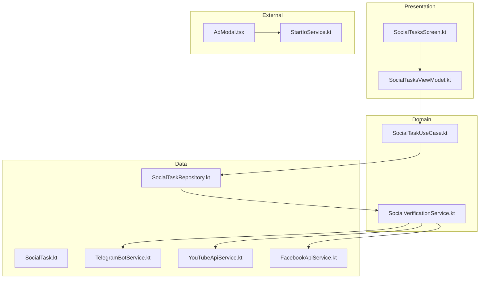
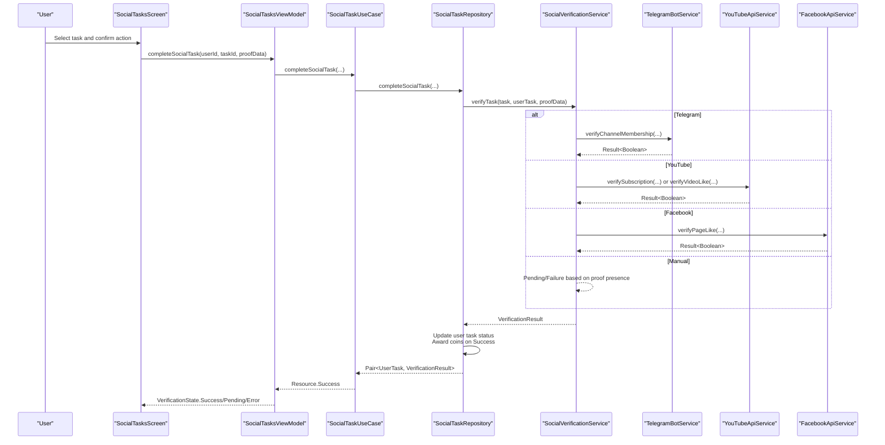
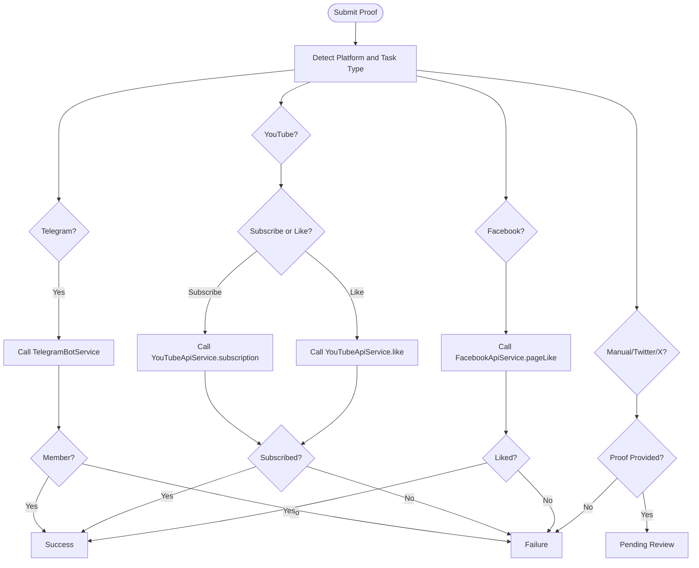
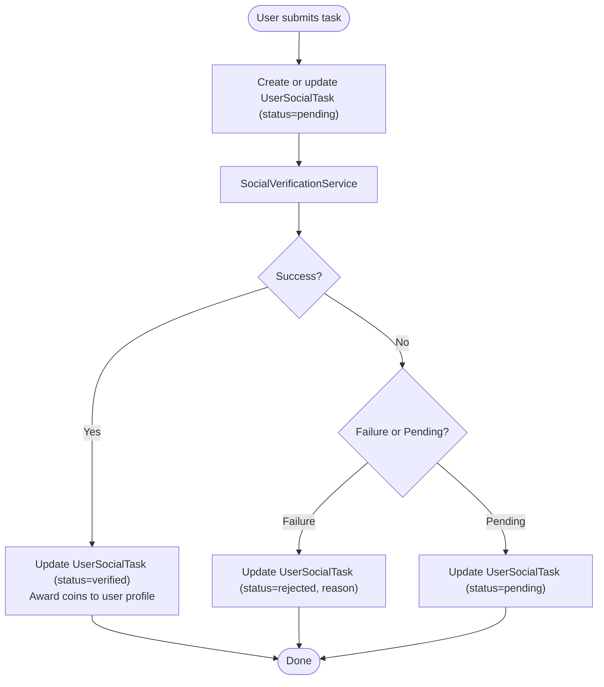
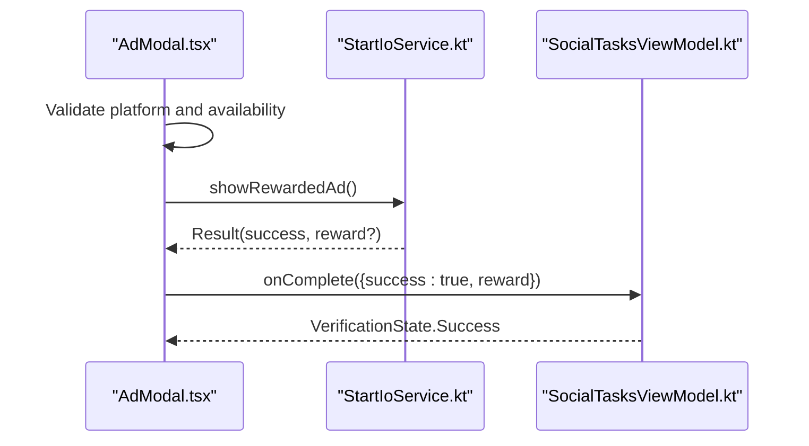
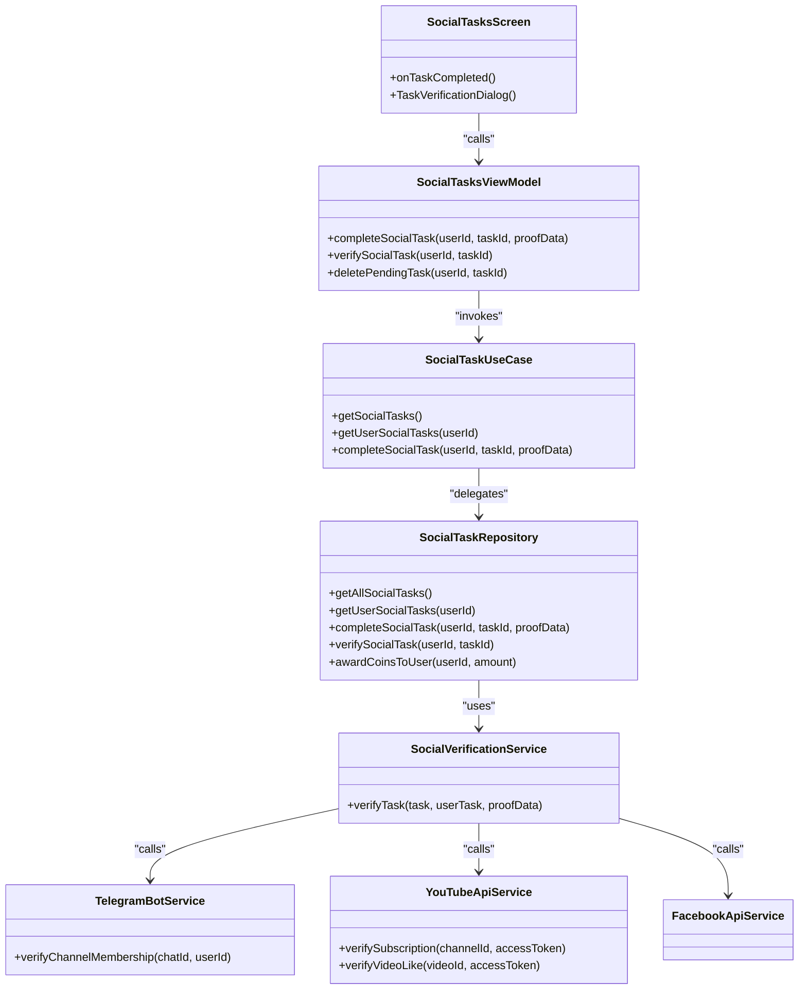

# Social Tasks Marketplace

<cite>
**Referenced Files in This Document**
- [SocialTask.kt](file://ktMobileApp/app/src/main/java/com/ekehi/network/data/model/SocialTask.kt)
- [SocialVerificationService.kt](file://ktMobileApp/app/src/main/java/com/ekehi/network/domain/verification/SocialVerificationService.kt)
- [TelegramBotService.kt](file://ktMobileApp/app/src/main/java/com/ekehi/network/service/TelegramBotService.kt)
- [YouTubeApiService.kt](file://ktMobileApp/app/src/main/java/com/ekehi/network/service/YouTubeApiService.kt)
- [FacebookApiService.kt](file://ktMobileApp/app/src/main/java/com/ekehi/network/service/FacebookApiService.kt)
- [SocialTaskRepository.kt](file://ktMobileApp/app/src/main/java/com/ekehi/network/data/repository/SocialTaskRepository.kt)
- [SocialTaskUseCase.kt](file://ktMobileApp/app/src/main/java/com/ekehi/network/domain/usecase/SocialTaskUseCase.kt)
- [SocialTasksViewModel.kt](file://ktMobileApp/app/src/main/java/com/ekehi/network/presentation/viewmodel/SocialTasksViewModel.kt)
- [SocialTasksScreen.kt](file://ktMobileApp/app/src/main/java/com/ekehi/network/presentation/ui/SocialTasksScreen.kt)
- [StartIoService.kt](file://ktMobileApp/app/src/main/java/com/ekehi/network/service/StartIoService.kt)
- [AdModal.tsx](file://mobileApp/src/components/AdModal.tsx)
</cite>

## Table of Contents
1. [Introduction](#introduction)
2. [Project Structure](#project-structure)
3. [Core Components](#core-components)
4. [Architecture Overview](#architecture-overview)
5. [Detailed Component Analysis](#detailed-component-analysis)
6. [Dependency Analysis](#dependency-analysis)
7. [Performance Considerations](#performance-considerations)
8. [Troubleshooting Guide](#troubleshooting-guide)
9. [Conclusion](#conclusion)
10. [Appendices](#appendices)

## Introduction
This document explains the Social Tasks Marketplace component, covering task discovery and filtering, platform-specific verification workflows for Telegram, YouTube, and Facebook, the reward system and quality assurance, Start.io ad integration for monetization and user acquisition, and the AdModal component for task-related advertisements. It also provides guidelines for adding new social platforms and extending marketplace functionality.

## Project Structure
The Social Tasks Marketplace spans three layers:
- Presentation layer (Compose UI and ViewModel)
- Domain layer (UseCases and Verification logic)
- Data layer (Repositories, Services, and Appwrite integration)

**Diagram sources**
- [SocialTasksScreen.kt](file://ktMobileApp/app/src/main/java/com/ekehi/network/presentation/ui/SocialTasksScreen.kt#L1-L200)
- [SocialTasksViewModel.kt](file://ktMobileApp/app/src/main/java/com/ekehi/network/presentation/viewmodel/SocialTasksViewModel.kt#L1-L185)
- [SocialTaskUseCase.kt](file://ktMobileApp/app/src/main/java/com/ekehi/network/domain/usecase/SocialTaskUseCase.kt#L1-L93)
- [SocialTaskRepository.kt](file://ktMobileApp/app/src/main/java/com/ekehi/network/data/repository/SocialTaskRepository.kt#L1-L220)
- [SocialVerificationService.kt](file://ktMobileApp/app/src/main/java/com/ekehi/network/domain/verification/SocialVerificationService.kt#L1-L161)
- [SocialTask.kt](file://ktMobileApp/app/src/main/java/com/ekehi/network/data/model/SocialTask.kt#L1-L22)
- [TelegramBotService.kt](file://ktMobileApp/app/src/main/java/com/ekehi/network/service/TelegramBotService.kt#L1-L69)
- [YouTubeApiService.kt](file://ktMobileApp/app/src/main/java/com/ekehi/network/service/YouTubeApiService.kt#L1-L98)
- [FacebookApiService.kt](file://ktMobileApp/app/src/main/java/com/ekehi/network/service/FacebookApiService.kt)
- [StartIoService.kt](file://ktMobileApp/app/src/main/java/com/ekehi/network/service/StartIoService.kt#L1-L296)
- [AdModal.tsx](file://mobileApp/src/components/AdModal.tsx#L1-L200)

**Section sources**
- [SocialTasksScreen.kt](file://ktMobileApp/app/src/main/java/com/ekehi/network/presentation/ui/SocialTasksScreen.kt#L1-L200)
- [SocialTaskRepository.kt](file://ktMobileApp/app/src/main/java/com/ekehi/network/data/repository/SocialTaskRepository.kt#L1-L120)

## Core Components
- SocialTask model defines task metadata, platform, type, reward, verification method, and status fields.
- SocialVerificationService orchestrates platform-specific verification and returns Success/Pending/Failure outcomes.
- SocialTaskRepository manages task lifecycle: fetching tasks, user task creation/update, verification, reward distribution, and pending deletion.
- SocialTaskUseCase exposes reactive streams for task lists and completion outcomes.
- SocialTasksViewModel coordinates UI actions, OAuth token injection for YouTube, and verification state updates.
- SocialTasksScreen renders task cards, handles OAuth callbacks, and triggers verification dialogs.
- StartIoService integrates rewarded video ads on Android.
- AdModal provides a cross-platform ad experience with Start.io integration on Android.

**Section sources**
- [SocialTask.kt](file://ktMobileApp/app/src/main/java/com/ekehi/network/data/model/SocialTask.kt#L1-L22)
- [SocialVerificationService.kt](file://ktMobileApp/app/src/main/java/com/ekehi/network/domain/verification/SocialVerificationService.kt#L1-L161)
- [SocialTaskRepository.kt](file://ktMobileApp/app/src/main/java/com/ekehi/network/data/repository/SocialTaskRepository.kt#L103-L225)
- [SocialTaskUseCase.kt](file://ktMobileApp/app/src/main/java/com/ekehi/network/domain/usecase/SocialTaskUseCase.kt#L1-L93)
- [SocialTasksViewModel.kt](file://ktMobileApp/app/src/main/java/com/ekehi/network/presentation/viewmodel/SocialTasksViewModel.kt#L66-L127)
- [SocialTasksScreen.kt](file://ktMobileApp/app/src/main/java/com/ekehi/network/presentation/ui/SocialTasksScreen.kt#L104-L170)
- [StartIoService.kt](file://ktMobileApp/app/src/main/java/com/ekehi/network/service/StartIoService.kt#L1-L120)
- [AdModal.tsx](file://mobileApp/src/components/AdModal.tsx#L1-L120)

## Architecture Overview
The marketplace follows a clean architecture:
- UI emits actions (select task, submit proof, OAuth callbacks).
- ViewModel translates actions into UseCase invocations.
- UseCase delegates to Repository for persistence and verification.
- Repository invokes SocialVerificationService, which calls platform APIs.
- Successful verifications trigger reward updates in user profiles.

**Diagram sources**
- [SocialTasksScreen.kt](file://ktMobileApp/app/src/main/java/com/ekehi/network/presentation/ui/SocialTasksScreen.kt#L720-L770)
- [SocialTasksViewModel.kt](file://ktMobileApp/app/src/main/java/com/ekehi/network/presentation/viewmodel/SocialTasksViewModel.kt#L70-L127)
- [SocialTaskUseCase.kt](file://ktMobileApp/app/src/main/java/com/ekehi/network/domain/usecase/SocialTaskUseCase.kt#L41-L76)
- [SocialTaskRepository.kt](file://ktMobileApp/app/src/main/java/com/ekehi/network/data/repository/SocialTaskRepository.kt#L103-L225)
- [SocialVerificationService.kt](file://ktMobileApp/app/src/main/java/com/ekehi/network/domain/verification/SocialVerificationService.kt#L16-L161)
- [TelegramBotService.kt](file://ktMobileApp/app/src/main/java/com/ekehi/network/service/TelegramBotService.kt#L24-L48)
- [YouTubeApiService.kt](file://ktMobileApp/app/src/main/java/com/ekehi/network/service/YouTubeApiService.kt#L24-L65)
- [FacebookApiService.kt](file://ktMobileApp/app/src/main/java/com/ekehi/network/service/FacebookApiService.kt)

## Detailed Component Analysis

### Task Discovery and Filtering
- Discovery: UseCase fetches all tasks and merges user-specific status to compute completion and verification flags.
- Filtering: The UI renders tasks grouped by platform/type and displays status badges. Users can refresh lists and see pending/rejected tasks reflected immediately.

Implementation highlights:
- Fetching tasks and user tasks, merging statuses, and exposing a combined list to the UI.
- Exposing counts and stats via reactive streams.

**Section sources**
- [SocialTaskUseCase.kt](file://ktMobileApp/app/src/main/java/com/ekehi/network/domain/usecase/SocialTaskUseCase.kt#L12-L40)
- [SocialTaskRepository.kt](file://ktMobileApp/app/src/main/java/com/ekehi/network/data/repository/SocialTaskRepository.kt#L61-L97)
- [SocialTasksScreen.kt](file://ktMobileApp/app/src/main/java/com/ekehi/network/presentation/ui/SocialTasksScreen.kt#L360-L410)

### Social Task Verification Workflows
Verification routes by platform and task type:
- Telegram: Membership check against a configured channel username using Telegram Bot API.
- YouTube: Subscription verification for channels or like verification for videos using YouTube Data API.
- Facebook: Page like verification using Facebook Graph API.
- Manual/Twitter/X: Requires proof submission (screenshots/usernames) and moves to pending review.

**Diagram sources**
- [SocialVerificationService.kt](file://ktMobileApp/app/src/main/java/com/ekehi/network/domain/verification/SocialVerificationService.kt#L16-L161)
- [TelegramBotService.kt](file://ktMobileApp/app/src/main/java/com/ekehi/network/service/TelegramBotService.kt#L24-L48)
- [YouTubeApiService.kt](file://ktMobileApp/app/src/main/java/com/ekehi/network/service/YouTubeApiService.kt#L24-L65)
- [FacebookApiService.kt](file://ktMobileApp/app/src/main/java/com/ekehi/network/service/FacebookApiService.kt)

**Section sources**
- [SocialVerificationService.kt](file://ktMobileApp/app/src/main/java/com/ekehi/network/domain/verification/SocialVerificationService.kt#L16-L161)

### Reward System and Quality Assurance
- Reward distribution: Coins are awarded only on successful verification. The repository updates user profile taskReward upon success.
- Quality assurance: Pending verifications are stored with status “pending” until resolved. Rejected verifications capture a rejection reason. Unique constraints prevent duplicate submissions per user-task pair.
- Manual review: Screenshots/usernames are accepted for manual verification; results are returned as pending until reviewed.

**Diagram sources**
- [SocialTaskRepository.kt](file://ktMobileApp/app/src/main/java/com/ekehi/network/data/repository/SocialTaskRepository.kt#L103-L225)

**Section sources**
- [SocialTaskRepository.kt](file://ktMobileApp/app/src/main/java/com/ekehi/network/data/repository/SocialTaskRepository.kt#L173-L207)
- [SocialTasksViewModel.kt](file://ktMobileApp/app/src/main/java/com/ekehi/network/presentation/viewmodel/SocialTasksViewModel.kt#L70-L127)

### Start.io Ad Integration for Monetization and User Acquisition
- Android rewarded video ad integration via StartIoService. The service preloads rewarded ads, falls back to interstitials if needed, and exposes readiness checks.
- AdModal on the web/mobile coordinates ad playback, countdown, skip logic, and reward delivery. It conditionally imports StartIoService on Android and disables ads on unsupported platforms.

**Diagram sources**
- [AdModal.tsx](file://mobileApp/src/components/AdModal.tsx#L87-L160)
- [StartIoService.kt](file://ktMobileApp/app/src/main/java/com/ekehi/network/service/StartIoService.kt#L103-L158)
- [SocialTasksViewModel.kt](file://ktMobileApp/app/src/main/java/com/ekehi/network/presentation/viewmodel/SocialTasksViewModel.kt#L70-L127)

**Section sources**
- [StartIoService.kt](file://ktMobileApp/app/src/main/java/com/ekehi/network/service/StartIoService.kt#L1-L120)
- [AdModal.tsx](file://mobileApp/src/components/AdModal.tsx#L1-L120)

### Task Moderation, Quality Control, and Platform-Specific Requirements
- Moderation: Pending submissions can be deleted by users before approval. Rejected tasks capture reasons for transparency.
- Quality control: Unique constraints and user-task pairing prevent duplicate completions. Telegram verification enforces membership checks; YouTube/Facebook verification validates external permissions.
- Platform-specific requirements:
  - Telegram: Requires channel username in task verificationData and user’s numeric Telegram ID in proofData.
  - YouTube: Requires access token and either channel subscription or video like verification.
  - Facebook: Requires access token and page like verification.
  - Manual/Twitter/X: Requires proof (screenshot/url/username).

**Section sources**
- [SocialTaskRepository.kt](file://ktMobileApp/app/src/main/java/com/ekehi/network/data/repository/SocialTaskRepository.kt#L141-L207)
- [SocialVerificationService.kt](file://ktMobileApp/app/src/main/java/com/ekehi/network/domain/verification/SocialVerificationService.kt#L31-L144)

### Guidelines for Adding New Social Platforms
- Define platform constants and extend verification routing in SocialVerificationService.
- Implement a dedicated service (e.g., TwitterApiService) with typed responses and Result<Boolean>.
- Update SocialTask verificationData expectations and UI prompts for proof submission.
- Add OAuth flows in SocialTasksScreen if the platform requires tokens.
- Ensure repository stores minimal required proofData and updates user task status accordingly.
- Add tests for new verification paths and error scenarios.

**Section sources**
- [SocialVerificationService.kt](file://ktMobileApp/app/src/main/java/com/ekehi/network/domain/verification/SocialVerificationService.kt#L16-L161)
- [SocialTasksScreen.kt](file://ktMobileApp/app/src/main/java/com/ekehi/network/presentation/ui/SocialTasksScreen.kt#L104-L170)

## Dependency Analysis

**Diagram sources**
- [SocialTasksScreen.kt](file://ktMobileApp/app/src/main/java/com/ekehi/network/presentation/ui/SocialTasksScreen.kt#L720-L770)
- [SocialTasksViewModel.kt](file://ktMobileApp/app/src/main/java/com/ekehi/network/presentation/viewmodel/SocialTasksViewModel.kt#L66-L127)
- [SocialTaskUseCase.kt](file://ktMobileApp/app/src/main/java/com/ekehi/network/domain/usecase/SocialTaskUseCase.kt#L12-L40)
- [SocialTaskRepository.kt](file://ktMobileApp/app/src/main/java/com/ekehi/network/data/repository/SocialTaskRepository.kt#L103-L225)
- [SocialVerificationService.kt](file://ktMobileApp/app/src/main/java/com/ekehi/network/domain/verification/SocialVerificationService.kt#L16-L161)
- [TelegramBotService.kt](file://ktMobileApp/app/src/main/java/com/ekehi/network/service/TelegramBotService.kt#L24-L48)
- [YouTubeApiService.kt](file://ktMobileApp/app/src/main/java/com/ekehi/network/service/YouTubeApiService.kt#L24-L65)
- [FacebookApiService.kt](file://ktMobileApp/app/src/main/java/com/ekehi/network/service/FacebookApiService.kt)

**Section sources**
- [SocialTaskRepository.kt](file://ktMobileApp/app/src/main/java/com/ekehi/network/data/repository/SocialTaskRepository.kt#L1-L120)

## Performance Considerations
- Network calls are offloaded to IO dispatcher in repositories and usecases.
- Preloading rewarded ads reduces latency on Android; fallback interstitials improve availability.
- UI uses reactive streams to avoid unnecessary recompositions and leverages skeleton loaders during loading states.
- Consider caching frequently accessed task metadata locally and debouncing refresh actions.

[No sources needed since this section provides general guidance]

## Troubleshooting Guide
Common issues and resolutions:
- Duplicate submissions: The repository detects unique/duplicate constraints and surfaces a descriptive error. Ensure unique constraints are userId + taskId combinations.
- OAuth failures: YouTube/Facebook sign-in results are logged with status codes; handle cancellation and network errors gracefully in the UI.
- Ad availability: On web or unsupported devices, AdModal disables ad actions and informs the user. Android requires Start.io initialization and ad readiness checks.
- Verification failures: Telegram membership checks, YouTube subscriptions/likes, and Facebook likes return explicit reasons; ensure required tokens and identifiers are provided.

**Section sources**
- [SocialTaskRepository.kt](file://ktMobileApp/app/src/main/java/com/ekehi/network/data/repository/SocialTaskRepository.kt#L213-L223)
- [SocialTasksScreen.kt](file://ktMobileApp/app/src/main/java/com/ekehi/network/presentation/ui/SocialTasksScreen.kt#L118-L200)
- [StartIoService.kt](file://ktMobileApp/app/src/main/java/com/ekehi/network/service/StartIoService.kt#L103-L158)
- [AdModal.tsx](file://mobileApp/src/components/AdModal.tsx#L87-L160)

## Conclusion
The Social Tasks Marketplace integrates platform-specific verification, robust reward distribution, and Start.io monetization. The modular architecture enables extensibility for new platforms while maintaining quality control and clear moderation pathways. The UI provides responsive feedback and supports manual review workflows.

[No sources needed since this section summarizes without analyzing specific files]

## Appendices

### Example Workflows and Calculations
- Task discovery and filtering: UseCase streams combine task metadata with user status to compute completion flags.
- Verification workflow: Platform-specific services validate external conditions; results drive status transitions and reward updates.
- Reward calculation: Coins are added to user profiles only on successful verification; pending tasks defer reward distribution.
- Ad monetization: Start.io rewarded ads are shown via StartIoService; AdModal coordinates playback and reward delivery.

**Section sources**
- [SocialTaskUseCase.kt](file://ktMobileApp/app/src/main/java/com/ekehi/network/domain/usecase/SocialTaskUseCase.kt#L12-L40)
- [SocialTaskRepository.kt](file://ktMobileApp/app/src/main/java/com/ekehi/network/data/repository/SocialTaskRepository.kt#L173-L207)
- [StartIoService.kt](file://ktMobileApp/app/src/main/java/com/ekehi/network/service/StartIoService.kt#L103-L158)
- [AdModal.tsx](file://mobileApp/src/components/AdModal.tsx#L139-L160)