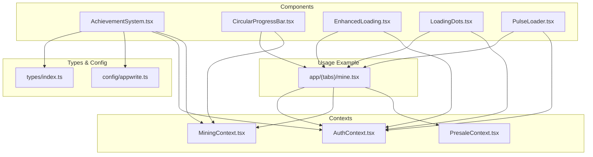
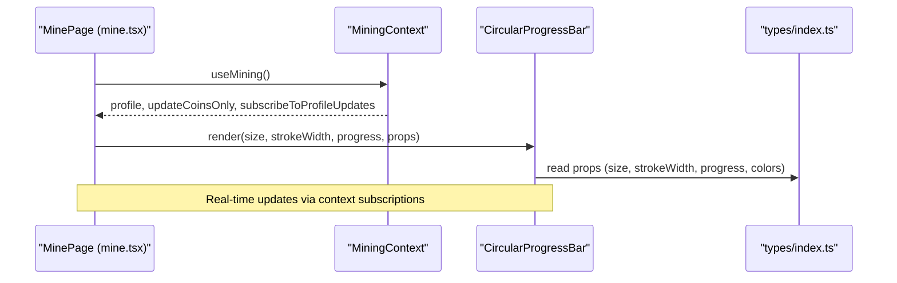
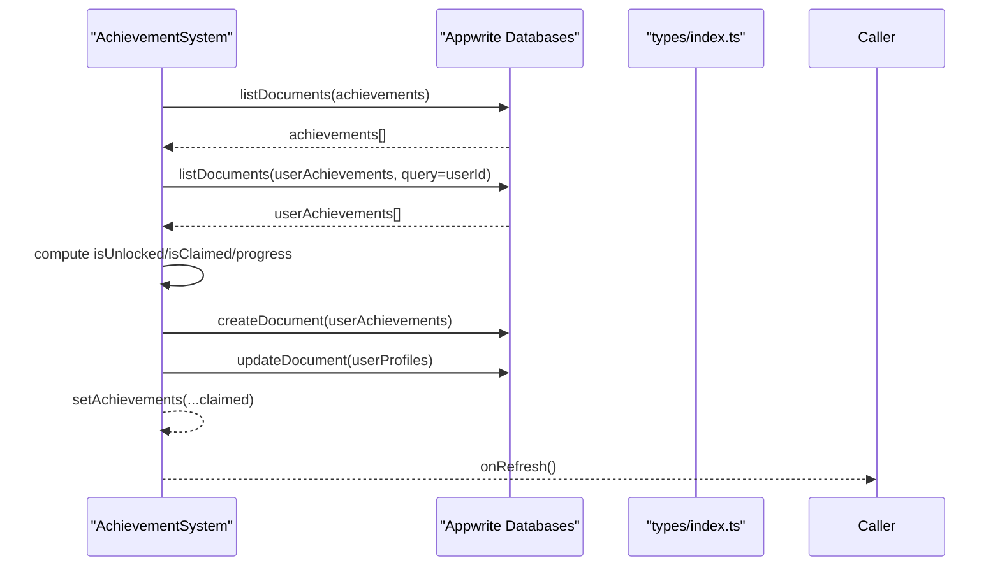
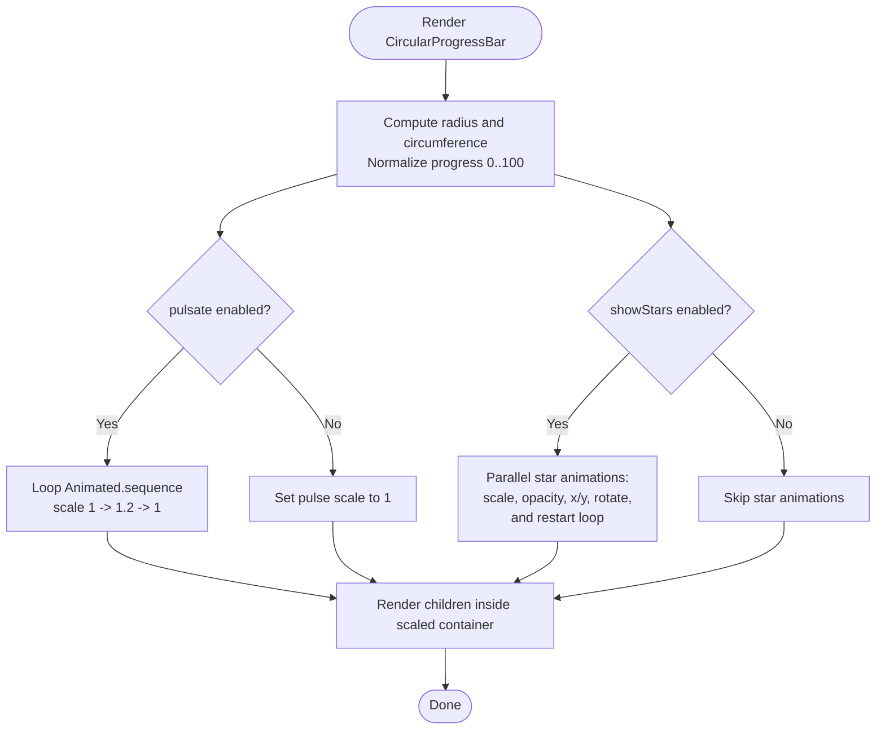
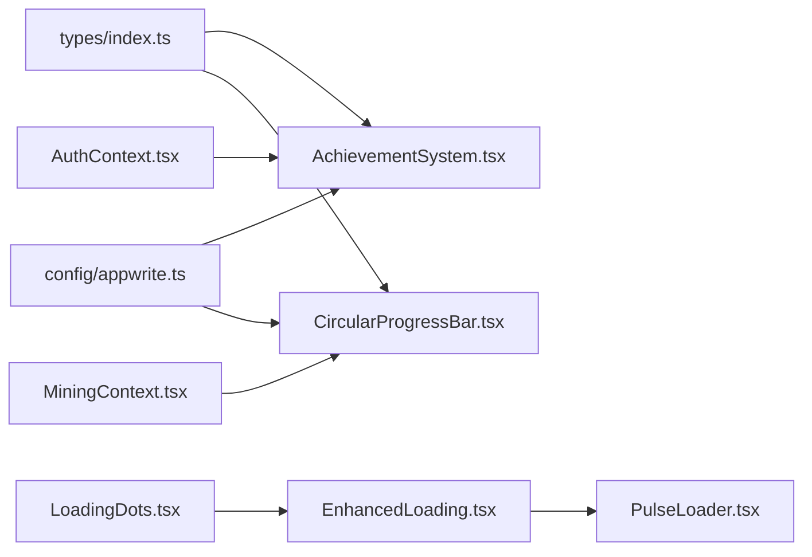

# UI Components

<cite>
**Referenced Files in This Document**
- [AchievementSystem.tsx](file://mobileApp/src/components/AchievementSystem.tsx)
- [CircularProgressBar.tsx](file://mobileApp/src/components/CircularProgressBar.tsx)
- [EnhancedLoading.tsx](file://mobileApp/src/components/EnhancedLoading.tsx)
- [LoadingDots.tsx](file://mobileApp/src/components/LoadingDots.tsx)
- [PulseLoader.tsx](file://mobileApp/src/components/PulseLoader.tsx)
- [index.ts](file://mobileApp/src/types/index.ts)
- [appwrite.ts](file://mobileApp/src/config/appwrite.ts)
- [AuthContext.tsx](file://mobileApp/src/contexts/AuthContext.tsx)
- [MiningContext.tsx](file://mobileApp/src/contexts/MiningContext.tsx)
- [PresaleContext.tsx](file://mobileApp/src/contexts/PresaleContext.tsx)
- [mine.tsx](file://mobileApp/app/(tabs)/mine.tsx)
</cite>

## Table of Contents
1. [Introduction](#introduction)
2. [Project Structure](#project-structure)
3. [Core Components](#core-components)
4. [Architecture Overview](#architecture-overview)
5. [Detailed Component Analysis](#detailed-component-analysis)
6. [Dependency Analysis](#dependency-analysis)
7. [Performance Considerations](#performance-considerations)
8. [Troubleshooting Guide](#troubleshooting-guide)
9. [Conclusion](#conclusion)
10. [Appendices](#appendices)

## Introduction
This document describes the UI components library used in the mobile application, focusing on:
- Achievement system with badge tracking, progress visualization, and user recognition
- Circular progress bar with animation effects, customizable styling, and real-time updates
- Enhanced loading components including loading dots and pulse loader implementations

It also covers component composition patterns, prop interfaces, styling approaches, practical usage examples, integration with context providers, performance optimizations, memory management, accessibility features, responsive design, cross-platform compatibility, and UX enhancements.

## Project Structure
The UI components are implemented as reusable React Native components under the mobile application’s component directory. They integrate with Appwrite for data persistence and with multiple contexts for authentication, mining, and presale logic.

**Diagram sources**
- [AchievementSystem.tsx](file://mobileApp/src/components/AchievementSystem.tsx#L1-L200)
- [CircularProgressBar.tsx](file://mobileApp/src/components/CircularProgressBar.tsx#L1-L120)
- [EnhancedLoading.tsx](file://mobileApp/src/components/EnhancedLoading.tsx#L1-L79)
- [LoadingDots.tsx](file://mobileApp/src/components/LoadingDots.tsx#L1-L65)
- [PulseLoader.tsx](file://mobileApp/src/components/PulseLoader.tsx#L1-L152)
- [index.ts](file://mobileApp/src/types/index.ts#L1-L98)
- [appwrite.ts](file://mobileApp/src/config/appwrite.ts#L1-L51)
- [AuthContext.tsx](file://mobileApp/src/contexts/AuthContext.tsx#L1-L120)
- [MiningContext.tsx](file://mobileApp/src/contexts/MiningContext.tsx#L1-L120)
- [PresaleContext.tsx](file://mobileApp/src/contexts/PresaleContext.tsx#L1-L120)
- [mine.tsx](file://mobileApp/app/(tabs)/mine.tsx#L10-L209)

**Section sources**
- [AchievementSystem.tsx](file://mobileApp/src/components/AchievementSystem.tsx#L1-L200)
- [CircularProgressBar.tsx](file://mobileApp/src/components/CircularProgressBar.tsx#L1-L120)
- [EnhancedLoading.tsx](file://mobileApp/src/components/EnhancedLoading.tsx#L1-L79)
- [LoadingDots.tsx](file://mobileApp/src/components/LoadingDots.tsx#L1-L65)
- [PulseLoader.tsx](file://mobileApp/src/components/PulseLoader.tsx#L1-L152)
- [index.ts](file://mobileApp/src/types/index.ts#L1-L98)
- [appwrite.ts](file://mobileApp/src/config/appwrite.ts#L1-L51)
- [AuthContext.tsx](file://mobileApp/src/contexts/AuthContext.tsx#L1-L120)
- [MiningContext.tsx](file://mobileApp/src/contexts/MiningContext.tsx#L1-L120)
- [PresaleContext.tsx](file://mobileApp/src/contexts/PresaleContext.tsx#L1-L120)
- [mine.tsx](file://mobileApp/app/(tabs)/mine.tsx#L10-L209)

## Core Components
- AchievementSystem: Fetches global achievements and user-specific unlocks, computes progress per achievement type, renders unlock/lock states, and supports claiming rewards with real-time profile updates.
- CircularProgressBar: Renders a scalable SVG progress ring with native driver animations, optional pulsating scaling, and floating star decorations with randomized motion and opacity.
- EnhancedLoading: A card-based loader with gradient background, spinner, optional message, and integrated PulseLoader dots.
- LoadingDots: Animated three-dot indicator using shared values and repeating timing animations.
- PulseLoader: Animated three-dot “pulse” loader with interpolated color transitions and configurable size and colors.

Key prop interfaces and styling approaches are documented in the Detailed Component Analysis section.

**Section sources**
- [AchievementSystem.tsx](file://mobileApp/src/components/AchievementSystem.tsx#L20-L120)
- [CircularProgressBar.tsx](file://mobileApp/src/components/CircularProgressBar.tsx#L5-L47)
- [EnhancedLoading.tsx](file://mobileApp/src/components/EnhancedLoading.tsx#L6-L20)
- [LoadingDots.tsx](file://mobileApp/src/components/LoadingDots.tsx#L5-L15)
- [PulseLoader.tsx](file://mobileApp/src/components/PulseLoader.tsx#L4-L16)

## Architecture Overview
The components integrate with Appwrite for data and with React contexts for state management. The AchievementSystem depends on user profile data and Appwrite collections for achievements and user achievements. The CircularProgressBar integrates with MiningContext for real-time updates. EnhancedLoading, LoadingDots, and PulseLoader are standalone presentational components used across screens.

**Diagram sources**
- [mine.tsx](file://mobileApp/app/(tabs)/mine.tsx#L10-L209)
- [CircularProgressBar.tsx](file://mobileApp/src/components/CircularProgressBar.tsx#L1-L60)
- [index.ts](file://mobileApp/src/types/index.ts#L1-L98)

**Section sources**
- [mine.tsx](file://mobileApp/app/(tabs)/mine.tsx#L10-L209)
- [CircularProgressBar.tsx](file://mobileApp/src/components/CircularProgressBar.tsx#L1-L120)
- [index.ts](file://mobileApp/src/types/index.ts#L1-L98)

## Detailed Component Analysis

### AchievementSystem
- Purpose: Display and manage user achievements with unlock/lock states, progress bars, rarity badges, and reward claiming.
- Data sources: Appwrite collections for achievements and user achievements; user profile for progress thresholds.
- Composition pattern: Accepts profile and onRefresh props; internally manages loading and claiming states; renders a list of achievement cards with gradient backgrounds and rarity-based styling.
- Progress visualization: Computes progress based on profile stats per achievement type and displays a horizontal progress bar with percentage text.
- User recognition: Shows rarity badges and special effects for legendary achievements (sparkle icons).
- Claiming flow: Creates a user achievement record and updates the user profile with reward coins; triggers onRefresh to synchronize UI.

**Diagram sources**
- [AchievementSystem.tsx](file://mobileApp/src/components/AchievementSystem.tsx#L53-L187)
- [index.ts](file://mobileApp/src/types/index.ts#L50-L63)
- [appwrite.ts](file://mobileApp/src/config/appwrite.ts#L21-L36)

**Section sources**
- [AchievementSystem.tsx](file://mobileApp/src/components/AchievementSystem.tsx#L20-L120)
- [AchievementSystem.tsx](file://mobileApp/src/components/AchievementSystem.tsx#L122-L187)
- [AchievementSystem.tsx](file://mobileApp/src/components/AchievementSystem.tsx#L189-L212)
- [AchievementSystem.tsx](file://mobileApp/src/components/AchievementSystem.tsx#L213-L379)
- [index.ts](file://mobileApp/src/types/index.ts#L50-L63)
- [appwrite.ts](file://mobileApp/src/config/appwrite.ts#L21-L36)

### CircularProgressBar
- Purpose: Render a scalable circular progress indicator with smooth native animations and optional visual effects.
- Animation effects: Pulsating scale animation controlled by a looped sequence; floating star decorations with randomized positions, rotations, scales, opacities, and pulsating combined transforms.
- Customizable styling: Size, stroke width, stroke color, background color, inner children rendering, and toggles for star effects and pulsation.
- Real-time updates: Consumed by screens that pass dynamic progress values; uses native driver for performance.

**Diagram sources**
- [CircularProgressBar.tsx](file://mobileApp/src/components/CircularProgressBar.tsx#L1-L120)
- [CircularProgressBar.tsx](file://mobileApp/src/components/CircularProgressBar.tsx#L120-L218)
- [CircularProgressBar.tsx](file://mobileApp/src/components/CircularProgressBar.tsx#L219-L299)

**Section sources**
- [CircularProgressBar.tsx](file://mobileApp/src/components/CircularProgressBar.tsx#L5-L47)
- [CircularProgressBar.tsx](file://mobileApp/src/components/CircularProgressBar.tsx#L48-L120)
- [CircularProgressBar.tsx](file://mobileApp/src/components/CircularProgressBar.tsx#L120-L218)
- [CircularProgressBar.tsx](file://mobileApp/src/components/CircularProgressBar.tsx#L219-L299)

### EnhancedLoading
- Purpose: Present a visually appealing loader card with spinner, message, and optional animated dots.
- Composition pattern: Uses a linear gradient card with centered content; composes PulseLoader for animated dots when enabled.

**Section sources**
- [EnhancedLoading.tsx](file://mobileApp/src/components/EnhancedLoading.tsx#L6-L20)
- [EnhancedLoading.tsx](file://mobileApp/src/components/EnhancedLoading.tsx#L21-L43)
- [PulseLoader.tsx](file://mobileApp/src/components/PulseLoader.tsx#L1-L152)

### LoadingDots
- Purpose: Lightweight animated three-dot indicator with staggered opacity animations.
- Composition pattern: Uses shared values and repeated timing animations with easing; exposes size and color props.

**Section sources**
- [LoadingDots.tsx](file://mobileApp/src/components/LoadingDots.tsx#L5-L15)
- [LoadingDots.tsx](file://mobileApp/src/components/LoadingDots.tsx#L16-L40)
- [LoadingDots.tsx](file://mobileApp/src/components/LoadingDots.tsx#L41-L65)

### PulseLoader
- Purpose: Animated three-dot “pulse” loader with interpolated color transitions and configurable size and colors.
- Composition pattern: Uses Animated.loop with Animated.sequence to cycle through dot color states; exposes size, color, backgroundColor, and style props.

**Section sources**
- [PulseLoader.tsx](file://mobileApp/src/components/PulseLoader.tsx#L4-L16)
- [PulseLoader.tsx](file://mobileApp/src/components/PulseLoader.tsx#L17-L71)
- [PulseLoader.tsx](file://mobileApp/src/components/PulseLoader.tsx#L72-L152)

## Dependency Analysis
- AchievementSystem depends on:
  - Appwrite SDK for listing documents and creating/updating records
  - UserProfile and Achievement types for shape and progress computation
  - AuthContext and MiningContext for user identity and profile updates
- CircularProgressBar depends on:
  - React Native Animated and SVG for animations and rendering
  - Props for sizing, colors, and effects
- EnhancedLoading composes PulseLoader and ActivityIndicator
- LoadingDots composes Animated primitives for dot animations
- PulseLoader composes Animated primitives for color transitions

**Diagram sources**
- [index.ts](file://mobileApp/src/types/index.ts#L1-L98)
- [appwrite.ts](file://mobileApp/src/config/appwrite.ts#L1-L51)
- [AchievementSystem.tsx](file://mobileApp/src/components/AchievementSystem.tsx#L1-L120)
- [CircularProgressBar.tsx](file://mobileApp/src/components/CircularProgressBar.tsx#L1-L120)
- [AuthContext.tsx](file://mobileApp/src/contexts/AuthContext.tsx#L1-L120)
- [MiningContext.tsx](file://mobileApp/src/contexts/MiningContext.tsx#L1-L120)
- [EnhancedLoading.tsx](file://mobileApp/src/components/EnhancedLoading.tsx#L1-L79)
- [PulseLoader.tsx](file://mobileApp/src/components/PulseLoader.tsx#L1-L152)
- [LoadingDots.tsx](file://mobileApp/src/components/LoadingDots.tsx#L1-L65)

**Section sources**
- [index.ts](file://mobileApp/src/types/index.ts#L1-L98)
- [appwrite.ts](file://mobileApp/src/config/appwrite.ts#L1-L51)
- [AchievementSystem.tsx](file://mobileApp/src/components/AchievementSystem.tsx#L1-L120)
- [CircularProgressBar.tsx](file://mobileApp/src/components/CircularProgressBar.tsx#L1-L120)
- [AuthContext.tsx](file://mobileApp/src/contexts/AuthContext.tsx#L1-L120)
- [MiningContext.tsx](file://mobileApp/src/contexts/MiningContext.tsx#L1-L120)
- [EnhancedLoading.tsx](file://mobileApp/src/components/EnhancedLoading.tsx#L1-L79)
- [PulseLoader.tsx](file://mobileApp/src/components/PulseLoader.tsx#L1-L152)
- [LoadingDots.tsx](file://mobileApp/src/components/LoadingDots.tsx#L1-L65)

## Performance Considerations
- Native driver animations: CircularProgressBar uses native driver for smoother animations and reduced JS thread work.
- Debouncing and memoization: MiningContext implements debounced profile refreshes and deep-equality checks to avoid unnecessary re-renders.
- Minimal re-renders: AchievementSystem computes unlock/claim states locally and updates only affected items.
- Lazy imports and platform-specific services: Conditional imports reduce bundle size and runtime overhead on non-target platforms.
- Retry and backoff: Contexts wrap network calls with retry mechanisms to improve resilience and perceived performance.
- Cleanup timers and intervals: Proper cleanup in screens prevents memory leaks and redundant work.

[No sources needed since this section provides general guidance]

## Troubleshooting Guide
- Achievement claims fail: Check Appwrite collection permissions and query correctness; confirm user profile exists and onRefresh is invoked after updates.
- Circular progress not updating: Ensure progress prop is passed from a subscribed context and that the component receives new values.
- Loading animations not visible: Verify props for EnhancedLoading (message, showDots) and ensure PulseLoader/LoadingDots are rendered.
- Auth-related loading loops: Confirm AuthContext and MiningContext are initialized and that user state is propagated to screens.

**Section sources**
- [AchievementSystem.tsx](file://mobileApp/src/components/AchievementSystem.tsx#L122-L187)
- [CircularProgressBar.tsx](file://mobileApp/src/components/CircularProgressBar.tsx#L1-L120)
- [EnhancedLoading.tsx](file://mobileApp/src/components/EnhancedLoading.tsx#L1-L79)
- [AuthContext.tsx](file://mobileApp/src/contexts/AuthContext.tsx#L1-L120)
- [MiningContext.tsx](file://mobileApp/src/contexts/MiningContext.tsx#L1-L120)

## Conclusion
The UI components library provides robust, animated, and data-driven components for achievements, progress visualization, and loading states. They integrate seamlessly with Appwrite and React contexts to deliver responsive, accessible, and performant experiences across platforms.

[No sources needed since this section summarizes without analyzing specific files]

## Appendices

### Practical Usage Examples
- AchievementSystem usage in MinePage:
  - Pass profile and onRefresh to keep UI synchronized after claiming rewards.
  - Reference: [mine.tsx](file://mobileApp/app/(tabs)/mine.tsx#L730-L742)

- CircularProgressBar usage in MinePage:
  - Pass progress percentage computed from remaining time and button size responsive to screen width.
  - Reference: [mine.tsx](file://mobileApp/app/(tabs)/mine.tsx#L10-L209)

- EnhancedLoading usage in MinePage:
  - Display during authentication and profile loading states.
  - Reference: [mine.tsx](file://mobileApp/app/(tabs)/mine.tsx#L430-L455)

- LoadingDots and PulseLoader usage across tabs:
  - Integrated in leaderboard, profile, social, and wallet screens for various loading states.
  - References:
    - [mine.tsx](file://mobileApp/app/(tabs)/mine.tsx#L10-L209)
    - [mine.tsx](file://mobileApp/app/(tabs)/mine.tsx#L430-L455)

### Component Prop Interfaces and Styling Approaches
- AchievementSystem props:
  - profile: UserProfile
  - onRefresh?: () => void
  - Reference: [AchievementSystem.tsx](file://mobileApp/src/components/AchievementSystem.tsx#L20-L24)

- CircularProgressBar props:
  - size?: number
  - strokeWidth?: number
  - progress: number (0–100)
  - strokeColor?: string
  - backgroundColor?: string
  - children?: React.ReactNode
  - showStars?: boolean
  - pulsate?: boolean
  - Reference: [CircularProgressBar.tsx](file://mobileApp/src/components/CircularProgressBar.tsx#L5-L25)

- EnhancedLoading props:
  - message?: string
  - showDots?: boolean
  - size?: 'small' | 'large'
  - color?: string
  - Reference: [EnhancedLoading.tsx](file://mobileApp/src/components/EnhancedLoading.tsx#L6-L18)

- LoadingDots props:
  - size?: number
  - color?: string
  - Reference: [LoadingDots.tsx](file://mobileApp/src/components/LoadingDots.tsx#L5-L9)

- PulseLoader props:
  - size?: number
  - color?: string
  - backgroundColor?: string
  - style?: object
  - Reference: [PulseLoader.tsx](file://mobileApp/src/components/PulseLoader.tsx#L4-L16)

### Integration with Context Providers
- AchievementSystem relies on:
  - AuthContext for user identity
  - MiningContext for profile data and onRefresh
  - Appwrite SDK for database operations
  - Reference: [AchievementSystem.tsx](file://mobileApp/src/components/AchievementSystem.tsx#L1-L120)

- CircularProgressBar integrates with:
  - MiningContext for real-time progress updates
  - Reference: [CircularProgressBar.tsx](file://mobileApp/src/components/CircularProgressBar.tsx#L1-L120)

- EnhancedLoading, LoadingDots, PulseLoader are presentational and used wherever loading feedback is needed:
  - Reference: [EnhancedLoading.tsx](file://mobileApp/src/components/EnhancedLoading.tsx#L1-L79), [LoadingDots.tsx](file://mobileApp/src/components/LoadingDots.tsx#L1-L65), [PulseLoader.tsx](file://mobileApp/src/components/PulseLoader.tsx#L1-L152)

### Accessibility and Responsive Design
- Accessibility:
  - Use appropriate contrast for gradients and text; ensure focusable elements are reachable.
  - Provide meaningful labels for interactive elements (buttons, modals).
- Responsive design:
  - Use percentage-based layouts and dynamic sizing (e.g., screen width-dependent button sizes).
  - Ensure touch targets meet minimum size guidelines.
- Cross-platform compatibility:
  - Conditional imports for platform-specific services.
  - Use platform-aware APIs for navigation and browser sessions.

[No sources needed since this section provides general guidance]