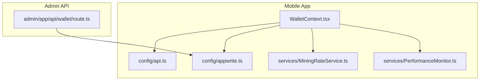
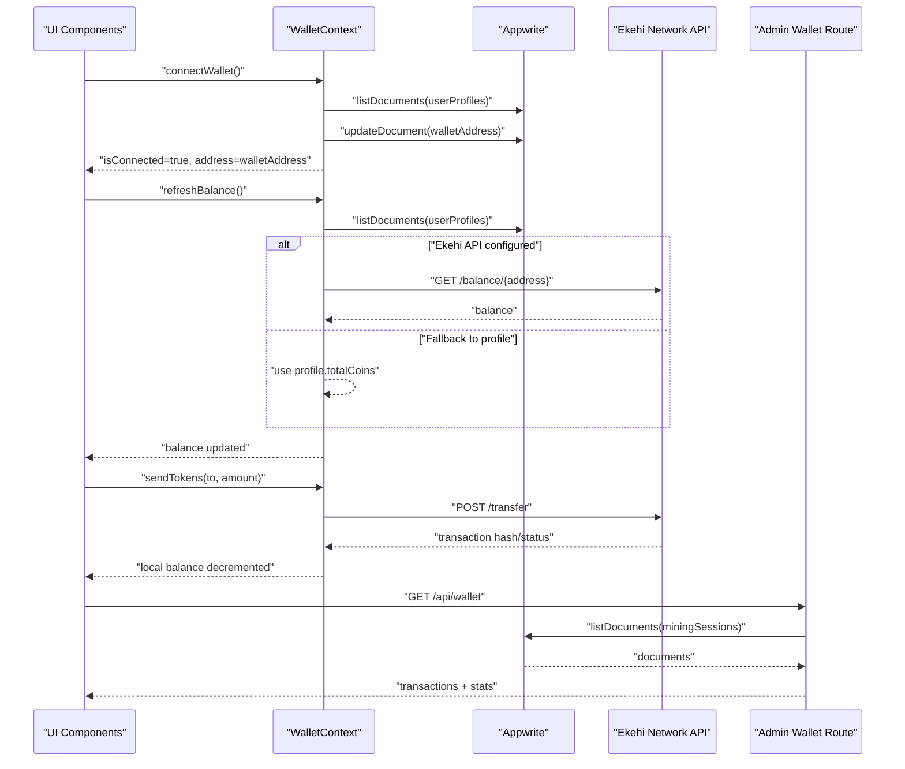
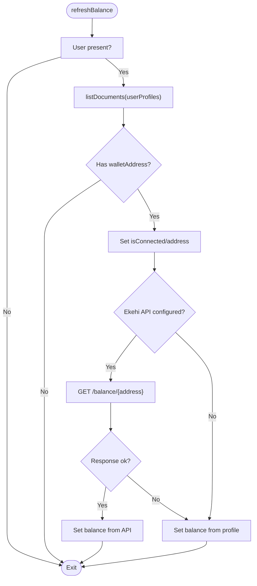
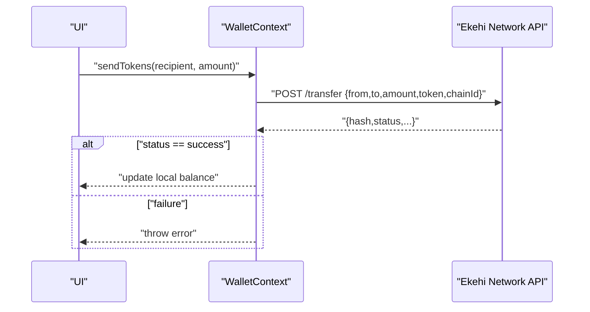
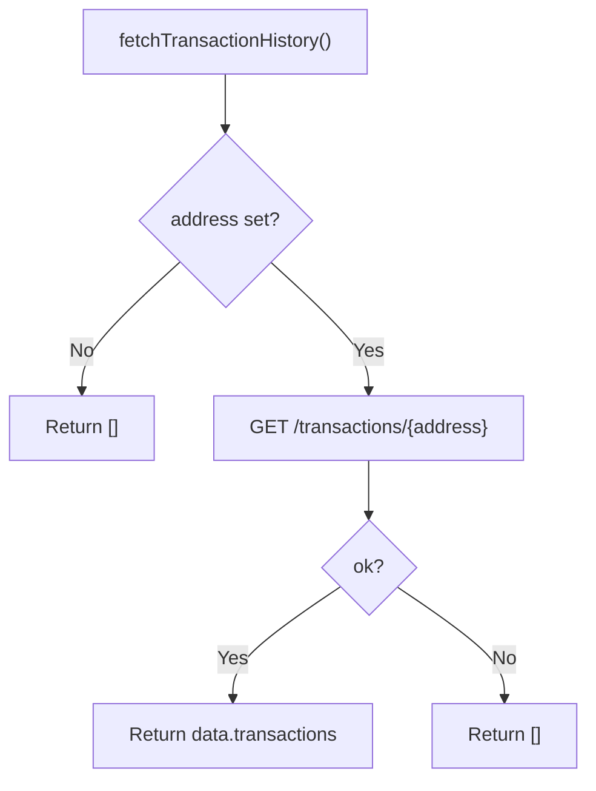
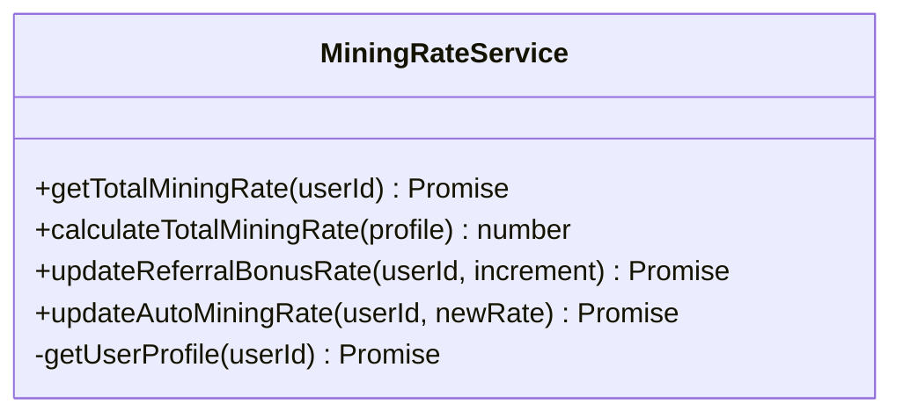
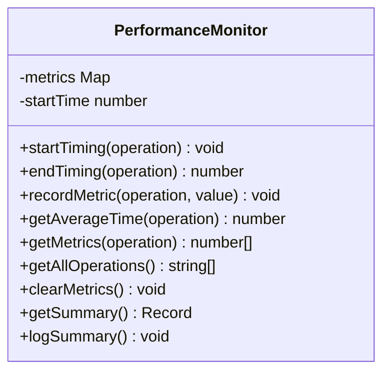
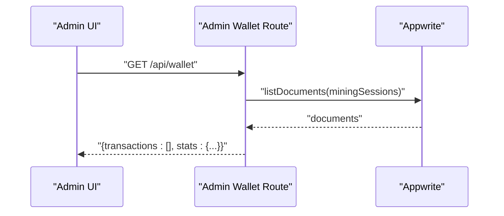
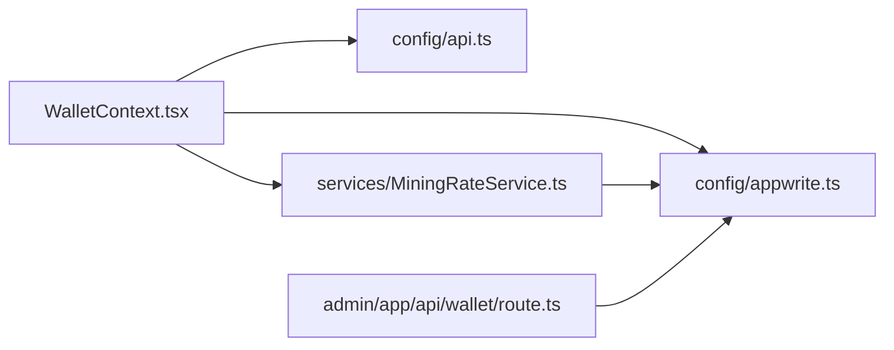

# Wallet Integration

<cite>
**Referenced Files in This Document**
- [WalletContext.tsx](file://mobileApp/src/contexts/WalletContext.tsx)
- [api.ts](file://mobileApp/src/config/api.ts)
- [appwrite.ts](file://mobileApp/src/config/appwrite.ts)
- [MiningRateService.ts](file://mobileApp/src/services/MiningRateService.ts)
- [PerformanceMonitor.ts](file://mobileApp/src/services/PerformanceMonitor.ts)
- [route.ts](file://admin/app/api/wallet/route.ts)
</cite>

## Table of Contents
1. [Introduction](#introduction)
2. [Project Structure](#project-structure)
3. [Core Components](#core-components)
4. [Architecture Overview](#architecture-overview)
5. [Detailed Component Analysis](#detailed-component-analysis)
6. [Dependency Analysis](#dependency-analysis)
7. [Performance Considerations](#performance-considerations)
8. [Troubleshooting Guide](#troubleshooting-guide)
9. [Conclusion](#conclusion)
10. [Appendices](#appendices)

## Introduction
This document explains the wallet integration component for the ekehi-mobile project. It covers how the frontend connects to a blockchain-like wallet abstraction, how balances and transactions are synchronized, and how the mining reward calculation service integrates with wallet state. It also documents performance monitoring for wallet operations, security considerations around private keys and authentication, compatibility and network switching guidance, and extension points for adding new blockchain networks.

## Project Structure
The wallet integration spans the mobile app’s React context, configuration, and services, plus an administrative API route that aggregates wallet-related data for reporting.

**Diagram sources**
- [WalletContext.tsx](file://mobileApp/src/contexts/WalletContext.tsx#L1-L297)
- [api.ts](file://mobileApp/src/config/api.ts#L1-L44)
- [appwrite.ts](file://mobileApp/src/config/appwrite.ts#L1-L51)
- [MiningRateService.ts](file://mobileApp/src/services/MiningRateService.ts#L1-L231)
- [PerformanceMonitor.ts](file://mobileApp/src/services/PerformanceMonitor.ts#L1-L120)
- [route.ts](file://admin/app/api/wallet/route.ts#L1-L66)

**Section sources**
- [WalletContext.tsx](file://mobileApp/src/contexts/WalletContext.tsx#L1-L297)
- [api.ts](file://mobileApp/src/config/api.ts#L1-L44)
- [appwrite.ts](file://mobileApp/src/config/appwrite.ts#L1-L51)
- [MiningRateService.ts](file://mobileApp/src/services/MiningRateService.ts#L1-L231)
- [PerformanceMonitor.ts](file://mobileApp/src/services/PerformanceMonitor.ts#L1-L120)
- [route.ts](file://admin/app/api/wallet/route.ts#L1-L66)

## Core Components
- WalletContext: Provides wallet connection state, address, balance, and actions to connect/disconnect, refresh balance, send tokens, and fetch transaction history. It integrates with Appwrite for user profile storage and optionally with the Ekehi Network API for balance and transaction data.
- API Configuration: Centralizes endpoints and keys for Appwrite and the Ekehi Network API.
- Appwrite Configuration: Initializes the Appwrite client and exposes collection identifiers used by WalletContext.
- MiningRateService: Computes and updates mining rates used for token distribution and reward calculations.
- PerformanceMonitor: Tracks timing and metrics for wallet operations.
- Admin Wallet Route: Aggregates wallet activity for dashboards and reports.

**Section sources**
- [WalletContext.tsx](file://mobileApp/src/contexts/WalletContext.tsx#L1-L297)
- [api.ts](file://mobileApp/src/config/api.ts#L1-L44)
- [appwrite.ts](file://mobileApp/src/config/appwrite.ts#L1-L51)
- [MiningRateService.ts](file://mobileApp/src/services/MiningRateService.ts#L1-L231)
- [PerformanceMonitor.ts](file://mobileApp/src/services/PerformanceMonitor.ts#L1-L120)
- [route.ts](file://admin/app/api/wallet/route.ts#L1-L66)

## Architecture Overview
The wallet integration follows a hybrid approach:
- Appwrite manages authentication and user profiles.
- The Ekehi Network API provides blockchain-like balance and transaction endpoints.
- WalletContext orchestrates state and calls into Appwrite and the Ekehi API.
- Admin API consolidates wallet activity for reporting.

**Diagram sources**
- [WalletContext.tsx](file://mobileApp/src/contexts/WalletContext.tsx#L1-L297)
- [api.ts](file://mobileApp/src/config/api.ts#L1-L44)
- [appwrite.ts](file://mobileApp/src/config/appwrite.ts#L1-L51)
- [route.ts](file://admin/app/api/wallet/route.ts#L1-L66)

## Detailed Component Analysis

### WalletContext Implementation
WalletContext encapsulates:
- State: isConnected, address, balance.
- Actions: connectWallet, disconnectWallet, refreshBalance, sendTokens, fetchTransactionHistory.
- Integrations: Appwrite for user profile reads/writes; optional Ekehi Network API for balance and transactions.

Key behaviors:
- On user presence, refreshBalance resolves the wallet address from the user profile and either fetches balance from the Ekehi API or falls back to the profile’s stored coin balance.
- connectWallet generates a mock wallet address and persists it to the user profile.
- sendTokens posts to the Ekehi transfer endpoint and updates local balance upon success.
- fetchTransactionHistory queries the Ekehi transactions endpoint.

**Diagram sources**
- [WalletContext.tsx](file://mobileApp/src/contexts/WalletContext.tsx#L53-L116)

**Section sources**
- [WalletContext.tsx](file://mobileApp/src/contexts/WalletContext.tsx#L1-L297)

### Transaction Signing and Transfer Flow
The transfer flow uses the Ekehi Network API’s transfer endpoint. The UI triggers sendTokens, which calls the internal sendEkehiTokens handler. On success, the UI decrements the local balance.

**Diagram sources**
- [WalletContext.tsx](file://mobileApp/src/contexts/WalletContext.tsx#L143-L178)

**Section sources**
- [WalletContext.tsx](file://mobileApp/src/contexts/WalletContext.tsx#L143-L178)

### Balance Synchronization and Transaction History
- Balance synchronization:
  - WalletContext.refreshBalance reads the user profile and sets the wallet address.
  - If the Ekehi API base URL is configured, it fetches balance from the Ekehi API; otherwise it uses profile.totalCoins.
- Transaction history:
  - WalletContext.fetchTransactionHistory calls the Ekehi transactions endpoint and returns a normalized list of transactions.

**Diagram sources**
- [WalletContext.tsx](file://mobileApp/src/contexts/WalletContext.tsx#L118-L141)

**Section sources**
- [WalletContext.tsx](file://mobileApp/src/contexts/WalletContext.tsx#L118-L141)

### Mining Rate Service for Rewards and Distribution
MiningRateService computes the total mining rate for a user by combining:
- Manual mining rate converted to per hour
- Auto mining rate
- Referral bonus rate

It also provides mutation methods to update auto and referral rates, persisting changes to Appwrite with retry logic.

**Diagram sources**
- [MiningRateService.ts](file://mobileApp/src/services/MiningRateService.ts#L1-L231)

**Section sources**
- [MiningRateService.ts](file://mobileApp/src/services/MiningRateService.ts#L1-L231)

### Performance Monitoring Integration
PerformanceMonitor tracks operation durations and custom metrics. While not directly wired into WalletContext yet, it can be integrated to measure:
- WalletContext.refreshBalance
- WalletContext.sendTokens
- Ekehi API requests
- Appwrite database operations

**Diagram sources**
- [PerformanceMonitor.ts](file://mobileApp/src/services/PerformanceMonitor.ts#L1-L120)

**Section sources**
- [PerformanceMonitor.ts](file://mobileApp/src/services/PerformanceMonitor.ts#L1-L120)

### Admin Wallet Reporting Endpoint
The admin route aggregates wallet activity by reading mining sessions and constructing mock transactions and statistics. This demonstrates how wallet activity can be surfaced for dashboards.

**Diagram sources**
- [route.ts](file://admin/app/api/wallet/route.ts#L1-L66)

**Section sources**
- [route.ts](file://admin/app/api/wallet/route.ts#L1-L66)

## Dependency Analysis
- WalletContext depends on:
  - Appwrite client and collections for user profile operations.
  - Ekehi Network API configuration for balance and transaction endpoints.
- MiningRateService depends on Appwrite for user profile reads and writes.
- Admin route depends on Appwrite for mining session aggregation.

**Diagram sources**
- [WalletContext.tsx](file://mobileApp/src/contexts/WalletContext.tsx#L1-L297)
- [api.ts](file://mobileApp/src/config/api.ts#L1-L44)
- [appwrite.ts](file://mobileApp/src/config/appwrite.ts#L1-L51)
- [MiningRateService.ts](file://mobileApp/src/services/MiningRateService.ts#L1-L231)
- [route.ts](file://admin/app/api/wallet/route.ts#L1-L66)

**Section sources**
- [WalletContext.tsx](file://mobileApp/src/contexts/WalletContext.tsx#L1-L297)
- [MiningRateService.ts](file://mobileApp/src/services/MiningRateService.ts#L1-L231)
- [route.ts](file://admin/app/api/wallet/route.ts#L1-L66)

## Performance Considerations
- Integrate PerformanceMonitor.startTiming/endTiming around:
  - WalletContext.refreshBalance
  - WalletContext.sendTokens
  - Ekehi API calls
  - Appwrite list/update operations
- Use retryWithBackoff for Appwrite operations to handle transient network errors.
- Cache recent balances and transaction lists to reduce redundant network calls.
- Batch or debounce frequent UI interactions (e.g., rapid refreshes) to avoid excessive API calls.

[No sources needed since this section provides general guidance]

## Troubleshooting Guide
Common issues and resolutions:
- Wallet not connecting:
  - Verify user is authenticated and user profile exists.
  - Confirm Appwrite collections are correctly configured.
- Balance not updating:
  - Check Ekehi API_BASE_URL and API_KEY configuration.
  - If API is unreachable, WalletContext falls back to profile.totalCoins.
- Transaction failures:
  - Inspect Ekehi transfer endpoint response and logs.
  - Ensure amount > 0 and a valid address is set.
- Admin wallet data missing:
  - Confirm mining sessions exist and admin route is reachable.

**Section sources**
- [WalletContext.tsx](file://mobileApp/src/contexts/WalletContext.tsx#L53-L116)
- [WalletContext.tsx](file://mobileApp/src/contexts/WalletContext.tsx#L143-L178)
- [route.ts](file://admin/app/api/wallet/route.ts#L1-L66)

## Conclusion
The wallet integration combines Appwrite-backed user profiles with optional Ekehi Network API calls to provide a functional wallet abstraction in the mobile app. WalletContext manages connection state, balance synchronization, and transfers, while MiningRateService supports reward calculations. Admin APIs aggregate wallet activity for reporting. PerformanceMonitor offers a foundation for measuring and optimizing wallet operations.

[No sources needed since this section summarizes without analyzing specific files]

## Appendices

### Practical Examples

- Connect a wallet:
  - Call WalletContext.connectWallet.
  - The context persists a mock wallet address to the user profile and marks the wallet as connected.
  - After connection, refreshBalance resolves the address and fetches balance from the Ekehi API if configured.

- Send tokens:
  - Call WalletContext.sendTokens(recipient, amount).
  - The context posts to the Ekehi transfer endpoint and decrements the local balance on success.

- View transaction history:
  - Call WalletContext.fetchTransactionHistory.
  - The context returns a normalized list of transactions from the Ekehi API.

- Mining reward calculation:
  - Use MiningRateService.getTotalMiningRate(userId) to compute combined hourly rewards.
  - Adjust rates via updateAutoMiningRate and updateReferralBonusRate.

**Section sources**
- [WalletContext.tsx](file://mobileApp/src/contexts/WalletContext.tsx#L180-L273)
- [MiningRateService.ts](file://mobileApp/src/services/MiningRateService.ts#L21-L108)

### Security Measures and Private Key Handling
- Private keys are not handled in the current implementation; wallet connections rely on a mock address persisted in the user profile.
- Authentication is managed by Appwrite; ensure OAuth client IDs and redirect URLs are configured securely.
- Treat API_KEY and BASE_URL as secrets; use environment variables in production.
- Validate and sanitize all inputs before calling external APIs.

**Section sources**
- [WalletContext.tsx](file://mobileApp/src/contexts/WalletContext.tsx#L180-L214)
- [api.ts](file://mobileApp/src/config/api.ts#L14-L19)
- [appwrite.ts](file://mobileApp/src/config/appwrite.ts#L38-L50)

### Compatibility, Network Switching, and Fee Optimization
- Network switching:
  - Modify Ekehi Network API configuration (BASE_URL, CHAIN_ID) to target different networks.
- Transaction fees:
  - The current transfer endpoint does not expose fee customization; consult the Ekehi API documentation for fee parameters and optimize by batching or scheduling transactions during off-peak periods.

**Section sources**
- [api.ts](file://mobileApp/src/config/api.ts#L14-L19)
- [WalletContext.tsx](file://mobileApp/src/contexts/WalletContext.tsx#L143-L178)

### Extending Wallet Support and New Networks
- Add a new blockchain provider:
  - Introduce provider-specific connection logic and persistence in WalletContext.
  - Extend API configuration with provider endpoints and credentials.
- Integrate new networks:
  - Update CHAIN_ID and token contract address in API configuration.
  - Ensure the Ekehi API supports the new chain and adjust endpoints accordingly.
- Transaction signing:
  - For real wallets, integrate a signing library and secure key storage; do not hardcode keys.
  - Implement signature verification and transaction status polling.

**Section sources**
- [WalletContext.tsx](file://mobileApp/src/contexts/WalletContext.tsx#L180-L214)
- [api.ts](file://mobileApp/src/config/api.ts#L14-L19)