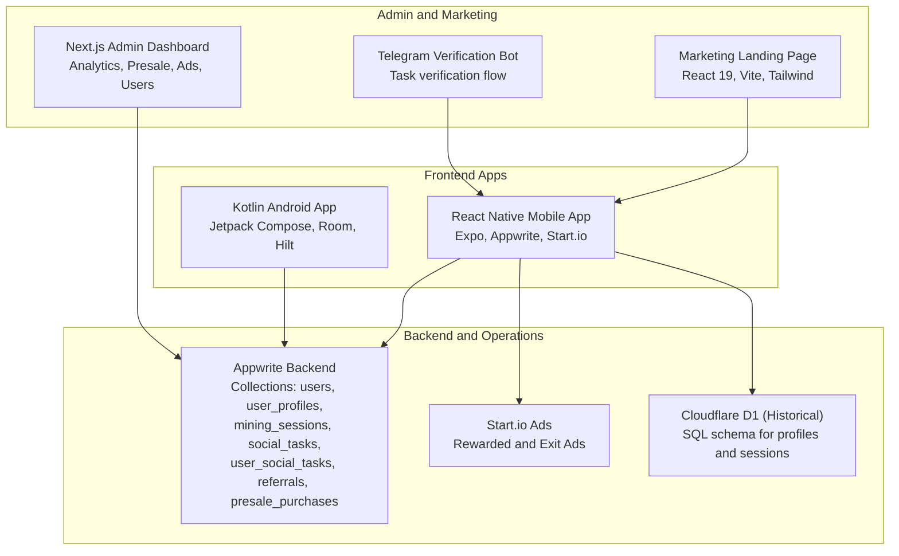
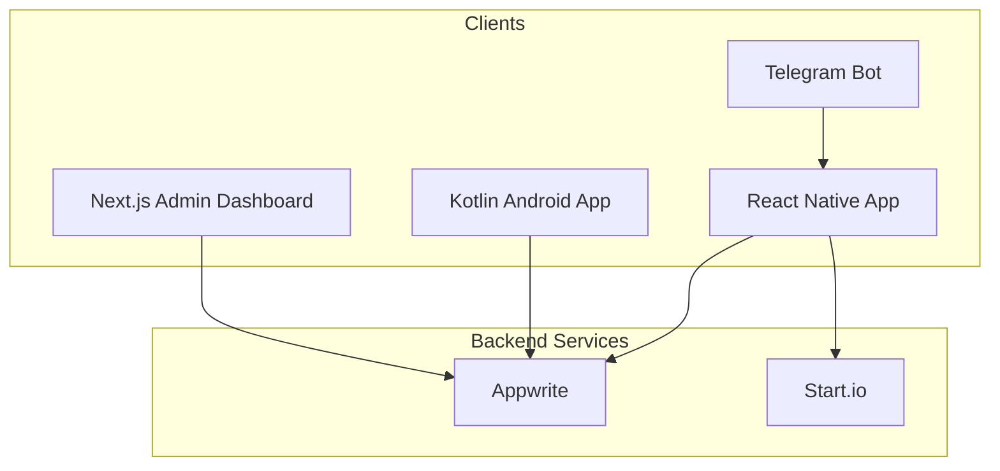
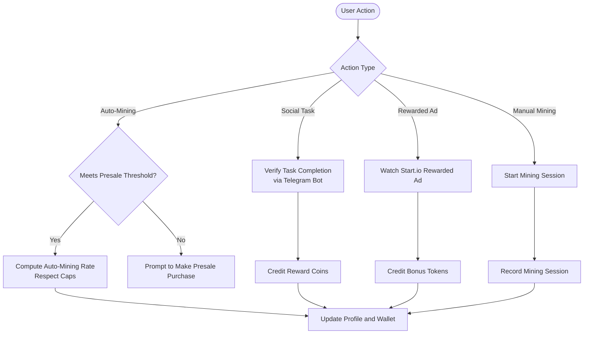
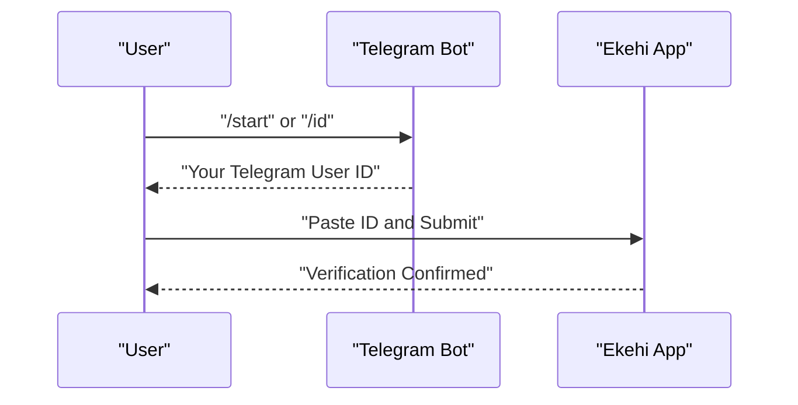
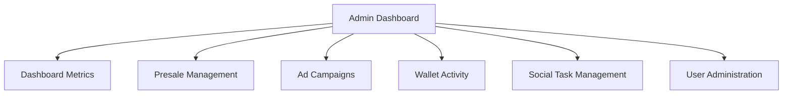
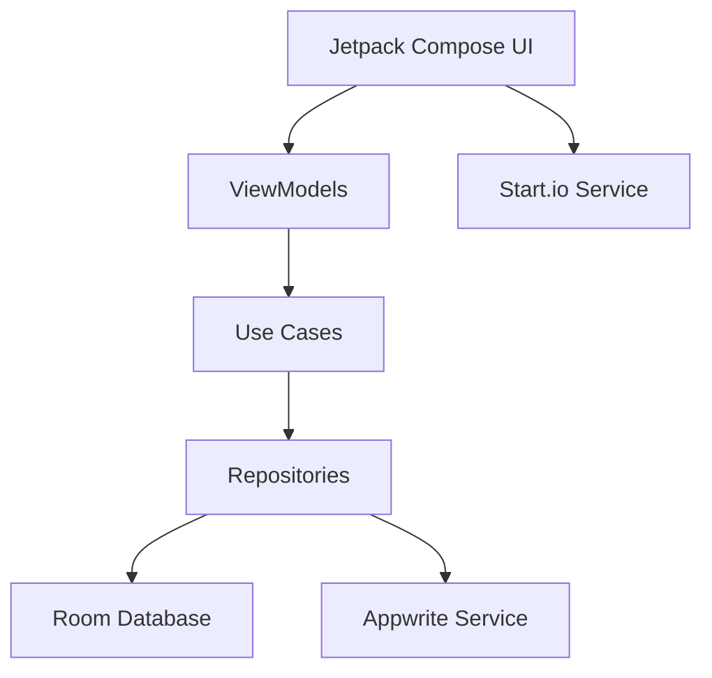
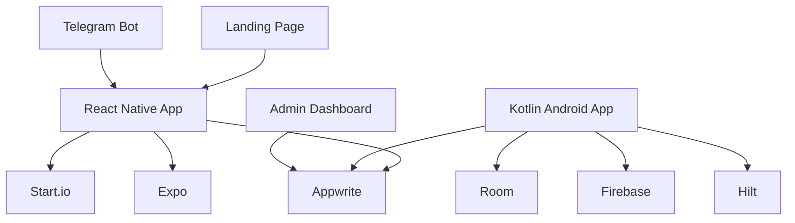

# Project Overview

<cite>
**Referenced Files in This Document**
- [mobileApp README](file://mobileApp/README.md)
- [admin README](file://admin/README.md)
- [LandPage README](file://LandPage/README.md)
- [ktMobileApp README](file://ktMobileApp/README.md)
- [Telegram Bot](file://my_bots/telegram_bot.py)
- [mobileApp package.json](file://mobileApp/package.json)
- [admin package.json](file://admin/package.json)
- [LandPage package.json](file://LandPage/package.json)
- [ktMobileApp build.gradle](file://ktMobileApp/build.gradle)
- [mobileApp appwrite config](file://mobileApp/src/config/appwrite.ts)
- [admin appwrite config](file://admin/lib/appwrite.ts)
- [Kotlin Appwrite service](file://ktMobileApp/app/src/main/java/com/ekehi/network/service/AppwriteService.kt)
- [Start.io service (React Native)](file://mobileApp/src/services/StartIoService.ts)
- [Cloudflare SQL schema](file://mobileApp/cloudflare-data/ekehi-network-db.sql)
</cite>

## Table of Contents
1. [Introduction](#introduction)
2. [Project Structure](#project-structure)
3. [Core Components](#core-components)
4. [Architecture Overview](#architecture-overview)
5. [Detailed Component Analysis](#detailed-component-analysis)
6. [Dependency Analysis](#dependency-analysis)
7. [Performance Considerations](#performance-considerations)
8. [Troubleshooting Guide](#troubleshooting-guide)
9. [Conclusion](#conclusion)

## Introduction
Ekehi Mobile is a blockchain-based token economy application designed to gamify user engagement through interactive mining mechanics, social tasks, and a referral system. The ecosystem comprises:
- A React Native mobile app (Expo) for iOS and Android
- A Kotlin Android app implementing a native Android experience
- A Next.js admin dashboard for operational oversight
- A marketing landing page for awareness and conversion
- A Telegram verification bot to anchor social identity and task completion

At the heart of the system is a token economy where users accumulate EKH tokens via manual mining, passive auto-mining tied to presale purchases, social tasks, and rewarded advertisements. Referral commissions further incentivize user acquisition. Appwrite powers backend services, while Start.io integrates rewarded and exit ads. The Kotlin app leverages Room for offline-first data persistence and Hilt for dependency injection.

## Project Structure
The repository is organized into distinct applications and supporting bots, each with its own tech stack and responsibilities:
- mobileApp: React Native + Expo frontend with Appwrite, Start.io, and local persistence
- ktMobileApp: Kotlin Android app with Jetpack Compose, Room, Hilt, and Appwrite
- admin: Next.js admin dashboard with Appwrite-backed analytics and management
- LandPage: Marketing landing page built with React 19, Vite, and Tailwind
- my_bots: Telegram bot for social task verification and user onboarding

**Diagram sources**
- [mobileApp README](file://mobileApp/README.md#L1-L178)
- [ktMobileApp README](file://ktMobileApp/README.md#L1-L209)
- [admin README](file://admin/README.md#L1-L109)
- [LandPage README](file://LandPage/README.md#L1-L82)
- [Telegram Bot](file://my_bots/telegram_bot.py#L1-L86)
- [mobileApp appwrite config](file://mobileApp/src/config/appwrite.ts#L1-L51)
- [admin appwrite config](file://admin/lib/appwrite.ts#L1-L33)
- [Kotlin Appwrite service](file://ktMobileApp/app/src/main/java/com/ekehi/network/service/AppwriteService.kt#L1-L43)
- [Start.io service (React Native)](file://mobileApp/src/services/StartIoService.ts#L1-L261)
- [Cloudflare SQL schema](file://mobileApp/cloudflare-data/ekehi-network-db.sql#L30-L60)

**Section sources**
- [mobileApp README](file://mobileApp/README.md#L1-L178)
- [admin README](file://admin/README.md#L1-L109)
- [LandPage README](file://LandPage/README.md#L1-L82)
- [ktMobileApp README](file://ktMobileApp/README.md#L1-L209)
- [Telegram Bot](file://my_bots/telegram_bot.py#L1-L86)

## Core Components
- Blockchain token economy: Users earn EKH tokens through manual mining, auto-mining (based on presale purchases), social tasks, and rewarded ads. Referral commissions drive acquisition.
- Mining sessions: Track per-session earnings, click counts, and duration for analytics and leaderboard placement.
- Social tasks: Platform-specific tasks (e.g., Telegram) with reward coins and verification flows.
- Referral system: Tracks referred_by links, total referrals, and lifetime earnings to compute referral commissions.
- Admin dashboard: Monitors presales, ads, wallets, social tasks, and users; powered by Appwrite.
- Telegram verification bot: Guides users to copy their Telegram ID and submit verification within the app.

Practical examples:
- Manual mining: A user mines for 10 minutes and earns coins proportional to their current rate; sessions are recorded in mining_sessions.
- Auto-mining: A user who purchases $200 unlocks a base mining rate; the rate caps at maximum thresholds and updates live.
- Social tasks: Completing a Telegram task grants reward_coins; the system records user_social_tasks entries.
- Referral commissions: A user with 5 direct referrals and $1000 in lifetime earnings receives a percentage-based commission.

**Section sources**
- [mobileApp README](file://mobileApp/README.md#L1-L178)
- [Cloudflare SQL schema](file://mobileApp/cloudflare-data/ekehi-network-db.sql#L30-L60)

## Architecture Overview
The system follows a multi-tier architecture:
- Frontends (React Native and Kotlin Android) communicate with Appwrite for authentication, data, and storage.
- Start.io SDK is integrated in the React Native app to serve rewarded and exit ads.
- Admin dashboard queries Appwrite for analytics and manages content.
- Telegram bot supports social task verification by providing a user’s Telegram ID.
- Historical data includes a Cloudflare D1 schema for profiles and mining sessions.

**Diagram sources**
- [mobileApp appwrite config](file://mobileApp/src/config/appwrite.ts#L1-L51)
- [admin appwrite config](file://admin/lib/appwrite.ts#L1-L33)
- [Kotlin Appwrite service](file://ktMobileApp/app/src/main/java/com/ekehi/network/service/AppwriteService.kt#L1-L43)
- [Start.io service (React Native)](file://mobileApp/src/services/StartIoService.ts#L1-L261)
- [Telegram Bot](file://my_bots/telegram_bot.py#L1-L86)

## Detailed Component Analysis

### Token Economy Mechanics
- Manual mining: Sessions capture user activity and earnings for leaderboard and analytics.
- Auto-mining: Tied to presale purchases with capped rates and limits.
- Social tasks: Reward distribution upon successful verification.
- Referral commissions: Derived from referred_by relationships and lifetime earnings.

**Diagram sources**
- [mobileApp README](file://mobileApp/README.md#L1-L178)
- [Start.io service (React Native)](file://mobileApp/src/services/StartIoService.ts#L1-L261)
- [Cloudflare SQL schema](file://mobileApp/cloudflare-data/ekehi-network-db.sql#L30-L60)

**Section sources**
- [mobileApp README](file://mobileApp/README.md#L1-L178)
- [Start.io service (React Native)](file://mobileApp/src/services/StartIoService.ts#L1-L261)
- [Cloudflare SQL schema](file://mobileApp/cloudflare-data/ekehi-network-db.sql#L30-L60)

### Telegram Verification Workflow
The Telegram bot provides a seamless verification flow for social tasks:
- The bot replies with the user’s Telegram ID and instructions.
- The user copies the ID and submits it in the app to verify membership for a task.

**Diagram sources**
- [Telegram Bot](file://my_bots/telegram_bot.py#L1-L86)

**Section sources**
- [Telegram Bot](file://my_bots/telegram_bot.py#L1-L86)

### Admin Dashboard Overview
The Next.js admin dashboard offers:
- Analytics and metrics
- Presale management
- Ad campaign monitoring
- Wallet activity tracking
- Social task moderation
- User administration

**Diagram sources**
- [admin README](file://admin/README.md#L1-L109)

**Section sources**
- [admin README](file://admin/README.md#L1-L109)

### Kotlin Android App Architecture Highlights
- Clean Architecture with MVVM
- Jetpack Compose UI
- Room database for offline-first data
- Hilt for dependency injection
- Appwrite Kotlin SDK for backend integration
- Start.io Android SDK for rewarded ads

**Diagram sources**
- [ktMobileApp README](file://ktMobileApp/README.md#L1-L209)
- [Kotlin Appwrite service](file://ktMobileApp/app/src/main/java/com/ekehi/network/service/AppwriteService.kt#L1-L43)
- [ktMobileApp build.gradle](file://ktMobileApp/build.gradle#L1-L9)

**Section sources**
- [ktMobileApp README](file://ktMobileApp/README.md#L1-L209)
- [Kotlin Appwrite service](file://ktMobileApp/app/src/main/java/com/ekehi/network/service/AppwriteService.kt#L1-L43)
- [ktMobileApp build.gradle](file://ktMobileApp/build.gradle#L1-L9)

## Dependency Analysis
Technology stack and integration points:
- Appwrite: Authentication, databases, and storage across all apps
- Start.io: Rewarded and exit ads in the React Native app
- Firebase: Present in the Kotlin app build configuration
- Room: Local persistence in the Kotlin app
- React Native + Expo: Cross-platform mobile frontend
- Next.js: Admin dashboard and marketing landing page

**Diagram sources**
- [mobileApp package.json](file://mobileApp/package.json#L1-L108)
- [admin package.json](file://admin/package.json#L1-L52)
- [LandPage package.json](file://LandPage/package.json#L1-L45)
- [ktMobileApp build.gradle](file://ktMobileApp/build.gradle#L1-L9)
- [mobileApp appwrite config](file://mobileApp/src/config/appwrite.ts#L1-L51)
- [admin appwrite config](file://admin/lib/appwrite.ts#L1-L33)
- [Kotlin Appwrite service](file://ktMobileApp/app/src/main/java/com/ekehi/network/service/AppwriteService.kt#L1-L43)

**Section sources**
- [mobileApp package.json](file://mobileApp/package.json#L1-L108)
- [admin package.json](file://admin/package.json#L1-L52)
- [LandPage package.json](file://LandPage/package.json#L1-L45)
- [ktMobileApp build.gradle](file://ktMobileApp/build.gradle#L1-L9)
- [mobileApp appwrite config](file://mobileApp/src/config/appwrite.ts#L1-L51)
- [admin appwrite config](file://admin/lib/appwrite.ts#L1-L33)
- [Kotlin Appwrite service](file://ktMobileApp/app/src/main/java/com/ekehi/network/service/AppwriteService.kt#L1-L43)

## Performance Considerations
- React Native mobile app emphasizes real-time updates, offline support, and memoization for efficient rendering.
- Kotlin Android app prioritizes offline-first design with Room and background sync via repositories and use cases.
- Start.io integration is platform-specific (Android) and includes safeguards for initialization and ad frequency.
- Admin dashboard leverages Next.js App Router and charting libraries for responsive analytics.

[No sources needed since this section provides general guidance]

## Troubleshooting Guide
Common areas to verify:
- OAuth configuration for Appwrite and redirect URLs in the React Native app
- Start.io availability and initialization on Android
- Appwrite collection IDs and environment variables across apps
- Kotlin app JVM and SDK setup requirements
- Telegram bot token and commands for verification

**Section sources**
- [mobileApp README](file://mobileApp/README.md#L84-L178)
- [Start.io service (React Native)](file://mobileApp/src/services/StartIoService.ts#L1-L261)
- [mobileApp appwrite config](file://mobileApp/src/config/appwrite.ts#L1-L51)
- [ktMobileApp README](file://ktMobileApp/README.md#L108-L173)
- [Telegram Bot](file://my_bots/telegram_bot.py#L1-L86)

## Conclusion
Ekehi Mobile delivers a cohesive blockchain-based token economy across multiple platforms. The React Native and Kotlin apps share backend integrations with Appwrite, while the Next.js admin dashboard and marketing landing page support operations and growth. Social tasks, mining mechanics, and referral systems form the engagement backbone, complemented by rewarded advertising via Start.io. The architecture balances real-time capabilities, offline resilience, and scalable admin oversight.