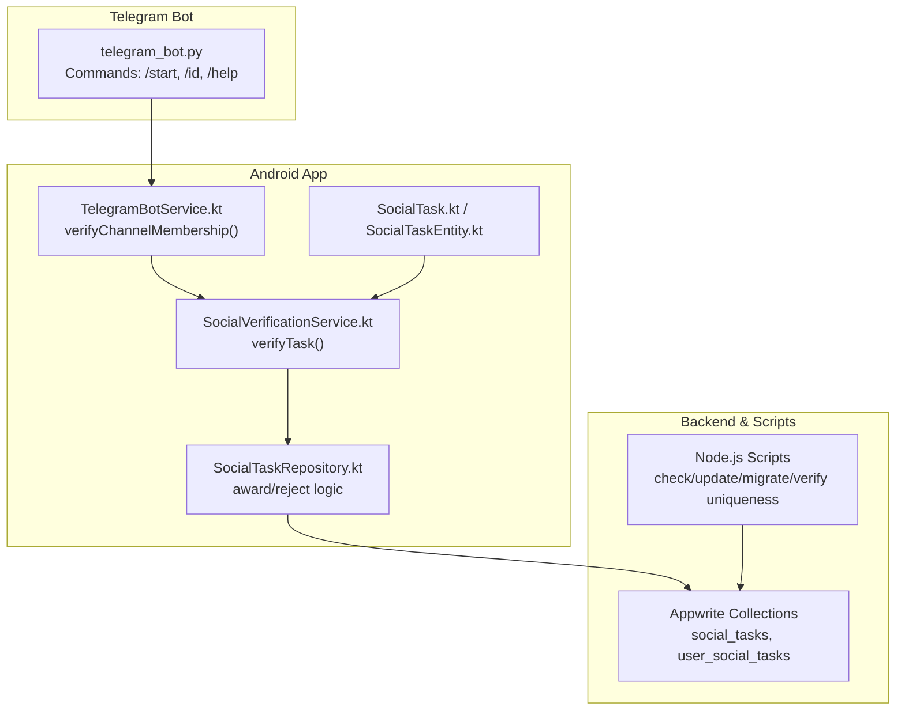
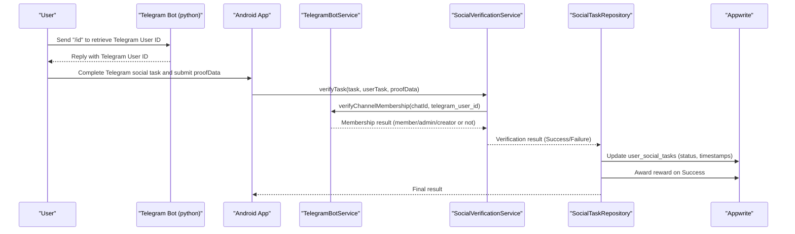
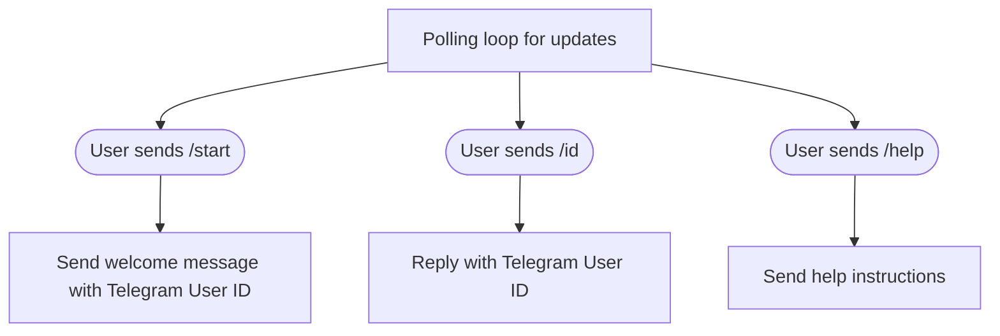
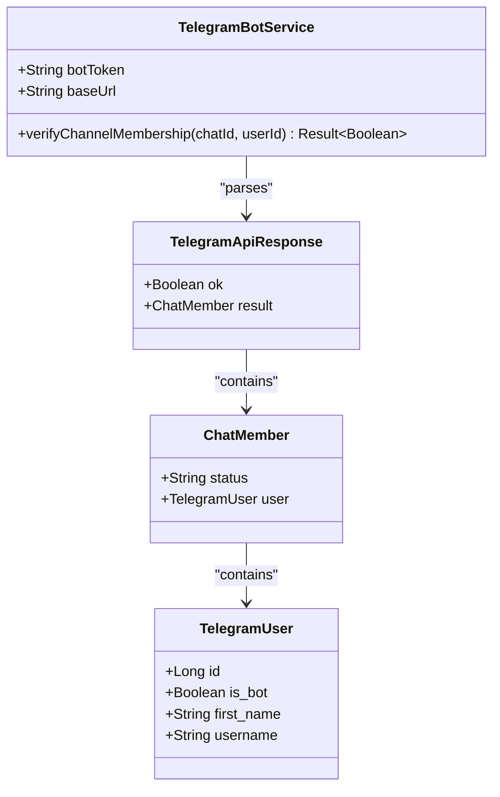
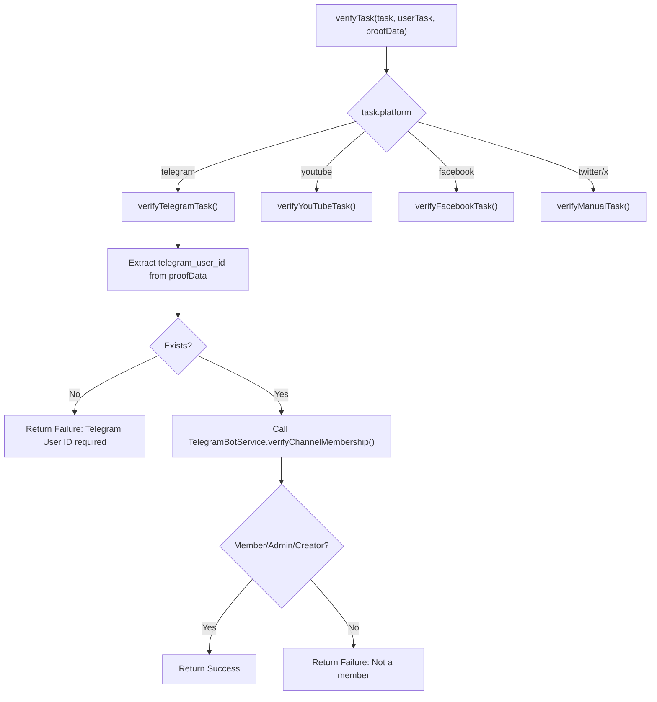
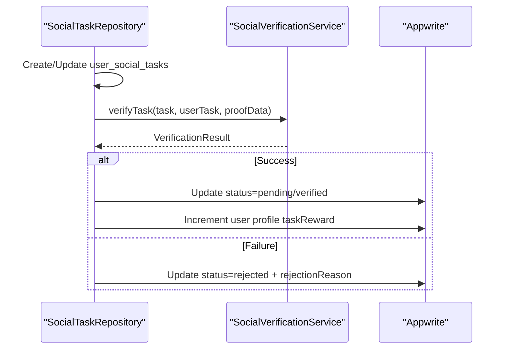
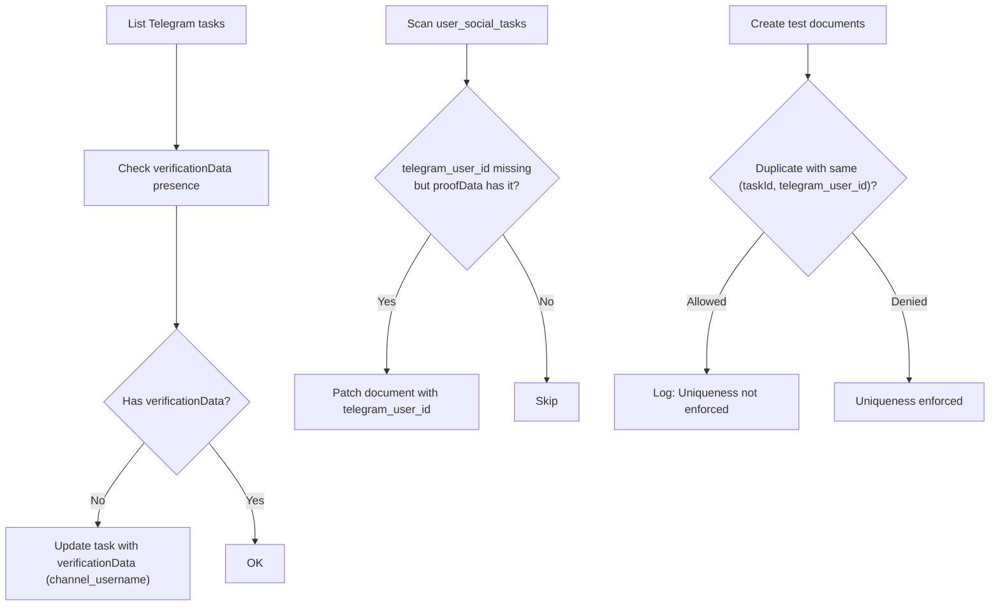
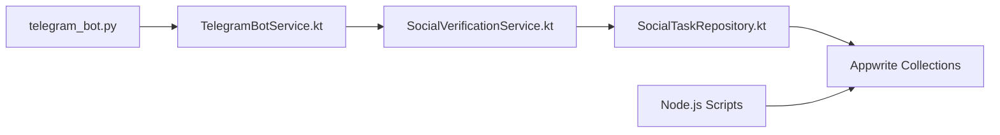

# Telegram Verification Bot

<cite>
**Referenced Files in This Document**
- [telegram_bot.py](file://my_bots/telegram_bot.py)
- [TelegramBotService.kt](file://ktMobileApp/app/src/main/java/com/ekehi/network/service/TelegramBotService.kt)
- [SocialVerificationService.kt](file://ktMobileApp/app/src/main/java/com/ekehi/network/domain/verification/SocialVerificationService.kt)
- [SocialTaskRepository.kt](file://ktMobileApp/app/src/main/java/com/ekehi/network/data/repository/SocialTaskRepository.kt)
- [SocialTask.kt](file://ktMobileApp/app/src/main/java/com/ekehi/network/data/model/SocialTask.kt)
- [SocialTaskEntity.kt](file://ktMobileApp/app/src/main/java/com/ekehi/network/data/local/entities/SocialTaskEntity.kt)
- [check-telegram-tasks.js](file://mobileApp/Scripts/check-telegram-tasks.js)
- [update-telegram-tasks.js](file://mobileApp/Scripts/update-telegram-tasks.js)
- [migrate-telegram-data.js](file://mobileApp/Scripts/migrate-telegram-data.js)
- [verify-telegram-uniqueness.js](file://mobileApp/Scripts/verify-telegram-uniqueness.js)
- [add-telegram-id-unique-index.js](file://mobileApp/Scripts/add-telegram-id-unique-index.js)
- [ErrorService.ts](file://mobileApp/src/services/ErrorService.ts)
- [retry.ts](file://mobileApp/src/utils/retry.ts)
</cite>

## Table of Contents
1. [Introduction](#introduction)
2. [Project Structure](#project-structure)
3. [Core Components](#core-components)
4. [Architecture Overview](#architecture-overview)
5. [Detailed Component Analysis](#detailed-component-analysis)
6. [Dependency Analysis](#dependency-analysis)
7. [Performance Considerations](#performance-considerations)
8. [Troubleshooting Guide](#troubleshooting-guide)
9. [Conclusion](#conclusion)
10. [Appendices](#appendices)

## Introduction
This document describes the Telegram verification bot component and its ecosystem within the Ekehi Mobile project. It explains how the Telegram bot supports user identity verification for social tasks, how the mobile app validates membership via Telegram Bot API, and how Appwrite backend services coordinate task completion and reward distribution. The document also covers configuration, webhook setup considerations, message handling patterns, security measures, rate limiting, error handling, practical examples, and deployment and monitoring guidance.

## Project Structure
The Telegram verification workflow spans three primary areas:
- Telegram bot (Python) that provides user identity retrieval commands
- Android mobile app service that verifies Telegram channel membership via Bot API
- Backend scripts and Appwrite integrations that manage task metadata, uniqueness constraints, and migration

**Diagram sources**
- [telegram_bot.py](file://my_bots/telegram_bot.py#L1-L86)
- [TelegramBotService.kt](file://ktMobileApp/app/src/main/java/com/ekehi/network/service/TelegramBotService.kt#L1-L69)
- [SocialVerificationService.kt](file://ktMobileApp/app/src/main/java/com/ekehi/network/domain/verification/SocialVerificationService.kt#L1-L37)
- [SocialTaskRepository.kt](file://ktMobileApp/app/src/main/java/com/ekehi/network/data/repository/SocialTaskRepository.kt#L146-L223)
- [SocialTask.kt](file://ktMobileApp/app/src/main/java/com/ekehi/network/data/model/SocialTask.kt#L1-L22)
- [SocialTaskEntity.kt](file://ktMobileApp/app/src/main/java/com/ekehi/network/data/local/entities/SocialTaskEntity.kt#L1-L23)
- [check-telegram-tasks.js](file://mobileApp/Scripts/check-telegram-tasks.js#L1-L63)
- [update-telegram-tasks.js](file://mobileApp/Scripts/update-telegram-tasks.js#L1-L75)
- [migrate-telegram-data.js](file://mobileApp/Scripts/migrate-telegram-data.js#L1-L207)
- [verify-telegram-uniqueness.js](file://mobileApp/Scripts/verify-telegram-uniqueness.js#L1-L149)

**Section sources**
- [telegram_bot.py](file://my_bots/telegram_bot.py#L1-L86)
- [TelegramBotService.kt](file://ktMobileApp/app/src/main/java/com/ekehi/network/service/TelegramBotService.kt#L1-L69)
- [SocialVerificationService.kt](file://ktMobileApp/app/src/main/java/com/ekehi/network/domain/verification/SocialVerificationService.kt#L1-L37)
- [SocialTaskRepository.kt](file://ktMobileApp/app/src/main/java/com/ekehi/network/data/repository/SocialTaskRepository.kt#L146-L223)
- [SocialTask.kt](file://ktMobileApp/app/src/main/java/com/ekehi/network/data/model/SocialTask.kt#L1-L22)
- [SocialTaskEntity.kt](file://ktMobileApp/app/src/main/java/com/ekehi/network/data/local/entities/SocialTaskEntity.kt#L1-L23)
- [check-telegram-tasks.js](file://mobileApp/Scripts/check-telegram-tasks.js#L1-L63)
- [update-telegram-tasks.js](file://mobileApp/Scripts/update-telegram-tasks.js#L1-L75)
- [migrate-telegram-data.js](file://mobileApp/Scripts/migrate-telegram-data.js#L1-L207)
- [verify-telegram-uniqueness.js](file://mobileApp/Scripts/verify-telegram-uniqueness.js#L1-L149)

## Core Components
- Telegram Bot (Python): Provides commands to retrieve the user’s Telegram ID and help instructions. The bot runs locally or in a hosted environment and exposes polling to receive updates.
- TelegramBotService (Android): Calls the Telegram Bot API to check if a user is a member of a configured Telegram chat (channel/group) using the bot token.
- SocialVerificationService (Android): Orchestrates verification per platform. For Telegram, it extracts the Telegram User ID from proof data and delegates to TelegramBotService to confirm membership.
- SocialTaskRepository (Android): Manages user task lifecycle, including creating/updating user tasks, invoking verification, and awarding rewards only on successful verification.
- Appwrite Scripts: Manage Telegram task metadata, uniqueness constraints, and migration of historical data to align with the verification model.
- Error Handling Utilities (React Native): Centralized error classification and retry logic for robust network operations.

**Section sources**
- [telegram_bot.py](file://my_bots/telegram_bot.py#L1-L86)
- [TelegramBotService.kt](file://ktMobileApp/app/src/main/java/com/ekehi/network/service/TelegramBotService.kt#L1-L69)
- [SocialVerificationService.kt](file://ktMobileApp/app/src/main/java/com/ekehi/network/domain/verification/SocialVerificationService.kt#L1-L37)
- [SocialTaskRepository.kt](file://ktMobileApp/app/src/main/java/com/ekehi/network/data/repository/SocialTaskRepository.kt#L146-L223)
- [ErrorService.ts](file://mobileApp/src/services/ErrorService.ts#L39-L72)
- [retry.ts](file://mobileApp/src/utils/retry.ts#L153-L176)

## Architecture Overview
The Telegram verification architecture integrates a user-facing Telegram bot, an Android app service, and Appwrite-backed data stores. The flow ensures that users provide a Telegram User ID via the bot, the app verifies membership against the Telegram Bot API, and Appwrite enforces uniqueness and reward distribution.

**Diagram sources**
- [telegram_bot.py](file://my_bots/telegram_bot.py#L1-L86)
- [TelegramBotService.kt](file://ktMobileApp/app/src/main/java/com/ekehi/network/service/TelegramBotService.kt#L1-L69)
- [SocialVerificationService.kt](file://ktMobileApp/app/src/main/java/com/ekehi/network/domain/verification/SocialVerificationService.kt#L1-L37)
- [SocialTaskRepository.kt](file://ktMobileApp/app/src/main/java/com/ekehi/network/data/repository/SocialTaskRepository.kt#L146-L223)

## Detailed Component Analysis

### Telegram Bot (Python)
- Responsibilities:
  - Responds to /start, /id, and /help commands
  - Returns the user’s Telegram User ID in HTML-formatted messages
  - Guides users on how to use the ID for verification
- Message processing:
  - Uses telegram-python library to register command handlers
  - Runs polling with allowed update types
- Configuration:
  - Requires a bot token (configured in code)
- Security:
  - Minimal; intended for user self-service retrieval of Telegram ID

**Diagram sources**
- [telegram_bot.py](file://my_bots/telegram_bot.py#L1-L86)

**Section sources**
- [telegram_bot.py](file://my_bots/telegram_bot.py#L1-L86)

### TelegramBotService (Android)
- Responsibilities:
  - Calls Telegram Bot API to fetch chat member status
  - Interprets status as member/administrator/creator or not
- Inputs:
  - chat_id (channel/group identifier)
  - user_id (Telegram User ID)
- Outputs:
  - Boolean indicating membership status
- Error handling:
  - Wraps exceptions into Result types

**Diagram sources**
- [TelegramBotService.kt](file://ktMobileApp/app/src/main/java/com/ekehi/network/service/TelegramBotService.kt#L1-L69)

**Section sources**
- [TelegramBotService.kt](file://ktMobileApp/app/src/main/java/com/ekehi/network/service/TelegramBotService.kt#L1-L69)

### SocialVerificationService (Android)
- Responsibilities:
  - Routes verification by platform
  - For Telegram, extracts telegram_user_id from proofData and calls TelegramBotService
- Inputs:
  - SocialTask (includes platform and verificationData)
  - UserSocialTask (submission)
  - proofData (contains telegram_user_id)
- Outputs:
  - VerificationResult (Success/Failure with reason)

**Diagram sources**
- [SocialVerificationService.kt](file://ktMobileApp/app/src/main/java/com/ekehi/network/domain/verification/SocialVerificationService.kt#L1-L37)
- [TelegramBotService.kt](file://ktMobileApp/app/src/main/java/com/ekehi/network/service/TelegramBotService.kt#L1-L69)

**Section sources**
- [SocialVerificationService.kt](file://ktMobileApp/app/src/main/java/com/ekehi/network/domain/verification/SocialVerificationService.kt#L1-L37)
- [TelegramBotService.kt](file://ktMobileApp/app/src/main/java/com/ekehi/network/service/TelegramBotService.kt#L1-L69)

### SocialTaskRepository (Android)
- Responsibilities:
  - Create or update user task documents
  - Invoke verification service
  - Update status and timestamps
  - Award reward coins only on success
  - Detect uniqueness constraint violations and surface actionable messages
- Reward distribution:
  - Updates user profile taskReward upon successful verification

**Diagram sources**
- [SocialTaskRepository.kt](file://ktMobileApp/app/src/main/java/com/ekehi/network/data/repository/SocialTaskRepository.kt#L146-L223)

**Section sources**
- [SocialTaskRepository.kt](file://ktMobileApp/app/src/main/java/com/ekehi/network/data/repository/SocialTaskRepository.kt#L146-L223)

### Appwrite Integration and Telegram Task Management
- Task metadata:
  - social_tasks collection holds platform-specific verificationData (e.g., channel_username for Telegram)
- Uniqueness enforcement:
  - Compound unique index on (taskId, telegram_user_id) prevents duplicate completions
- Data migration:
  - Historical user_social_tasks documents are scanned and updated to include telegram_user_id when present in proofData
- Validation scripts:
  - Check verificationData presence and structure
  - Update tasks with required verificationData
  - Verify uniqueness constraints via controlled duplication attempts

**Diagram sources**
- [check-telegram-tasks.js](file://mobileApp/Scripts/check-telegram-tasks.js#L1-L63)
- [update-telegram-tasks.js](file://mobileApp/Scripts/update-telegram-tasks.js#L1-L75)
- [migrate-telegram-data.js](file://mobileApp/Scripts/migrate-telegram-data.js#L1-L207)
- [verify-telegram-uniqueness.js](file://mobileApp/Scripts/verify-telegram-uniqueness.js#L1-L149)

**Section sources**
- [check-telegram-tasks.js](file://mobileApp/Scripts/check-telegram-tasks.js#L1-L63)
- [update-telegram-tasks.js](file://mobileApp/Scripts/update-telegram-tasks.js#L1-L75)
- [migrate-telegram-data.js](file://mobileApp/Scripts/migrate-telegram-data.js#L1-L207)
- [verify-telegram-uniqueness.js](file://mobileApp/Scripts/verify-telegram-uniqueness.js#L1-L149)

## Dependency Analysis
- Telegram Bot depends on the telegram-python library and a configured bot token.
- Android app depends on:
  - TelegramBotService for Bot API calls
  - SocialVerificationService for orchestration
  - SocialTaskRepository for persistence and reward logic
  - Appwrite SDK for database operations
- Backend scripts depend on Node.js Appwrite SDK and HTTPS requests to Appwrite endpoints.

**Diagram sources**
- [telegram_bot.py](file://my_bots/telegram_bot.py#L1-L86)
- [TelegramBotService.kt](file://ktMobileApp/app/src/main/java/com/ekehi/network/service/TelegramBotService.kt#L1-L69)
- [SocialVerificationService.kt](file://ktMobileApp/app/src/main/java/com/ekehi/network/domain/verification/SocialVerificationService.kt#L1-L37)
- [SocialTaskRepository.kt](file://ktMobileApp/app/src/main/java/com/ekehi/network/data/repository/SocialTaskRepository.kt#L146-L223)
- [check-telegram-tasks.js](file://mobileApp/Scripts/check-telegram-tasks.js#L1-L63)
- [update-telegram-tasks.js](file://mobileApp/Scripts/update-telegram-tasks.js#L1-L75)
- [migrate-telegram-data.js](file://mobileApp/Scripts/migrate-telegram-data.js#L1-L207)
- [verify-telegram-uniqueness.js](file://mobileApp/Scripts/verify-telegram-uniqueness.js#L1-L149)

**Section sources**
- [TelegramBotService.kt](file://ktMobileApp/app/src/main/java/com/ekehi/network/service/TelegramBotService.kt#L1-L69)
- [SocialVerificationService.kt](file://ktMobileApp/app/src/main/java/com/ekehi/network/domain/verification/SocialVerificationService.kt#L1-L37)
- [SocialTaskRepository.kt](file://ktMobileApp/app/src/main/java/com/ekehi/network/data/repository/SocialTaskRepository.kt#L146-L223)
- [check-telegram-tasks.js](file://mobileApp/Scripts/check-telegram-tasks.js#L1-L63)
- [update-telegram-tasks.js](file://mobileApp/Scripts/update-telegram-tasks.js#L1-L75)
- [migrate-telegram-data.js](file://mobileApp/Scripts/migrate-telegram-data.js#L1-L207)
- [verify-telegram-uniqueness.js](file://mobileApp/Scripts/verify-telegram-uniqueness.js#L1-L149)

## Performance Considerations
- Bot polling:
  - Use allowed_updates to reduce unnecessary updates
  - Consider rate limits from Telegram and adjust polling intervals
- Network reliability:
  - Implement exponential backoff and jitter for Bot API calls
  - Apply retry logic for transient failures
- Database operations:
  - Batch reads/writes for migration scripts
  - Use pagination to avoid timeouts during large scans
- Concurrency:
  - Avoid concurrent verification requests for the same (taskId, telegram_user_id) to respect uniqueness constraints

[No sources needed since this section provides general guidance]

## Troubleshooting Guide
- Telegram Bot not responding:
  - Verify token configuration and that the bot is started with proper logging
  - Ensure allowed_updates includes relevant update types
- Membership verification fails:
  - Confirm chat_id and telegram_user_id correctness
  - Check that the bot is added to the chat and has sufficient permissions
- Uniqueness constraint errors:
  - Validate compound index (taskId, telegram_user_id) exists
  - Review migration script output for telegram_user_id population
- Error surfacing:
  - Android app surfaces uniqueness-related errors with actionable messages
  - Use centralized error classification and retry utilities for robustness

**Section sources**
- [telegram_bot.py](file://my_bots/telegram_bot.py#L1-L86)
- [TelegramBotService.kt](file://ktMobileApp/app/src/main/java/com/ekehi/network/service/TelegramBotService.kt#L1-L69)
- [SocialTaskRepository.kt](file://ktMobileApp/app/src/main/java/com/ekehi/network/data/repository/SocialTaskRepository.kt#L210-L223)
- [verify-telegram-uniqueness.js](file://mobileApp/Scripts/verify-telegram-uniqueness.js#L1-L149)
- [migrate-telegram-data.js](file://mobileApp/Scripts/migrate-telegram-data.js#L1-L207)
- [ErrorService.ts](file://mobileApp/src/services/ErrorService.ts#L39-L72)
- [retry.ts](file://mobileApp/src/utils/retry.ts#L153-L176)

## Conclusion
The Telegram verification bot and supporting services form a cohesive system for automating social task verification. The bot provides a simple way for users to retrieve their Telegram User ID, the Android app validates membership via Telegram Bot API, and Appwrite enforces data integrity and reward distribution. Scripts ensure legacy data compatibility and uniqueness constraints are in place. Together, these components reduce manual moderation overhead and streamline the verification workflow.

[No sources needed since this section summarizes without analyzing specific files]

## Appendices

### Practical Examples
- Bot commands:
  - /start: Sends a welcome message with the user’s Telegram User ID
  - /id: Re-sends the Telegram User ID
  - /help: Displays help and verification steps
- Verification process:
  - User obtains Telegram User ID from the bot
  - User completes a Telegram social task in the app and submits proofData
  - App verifies membership and updates the user task accordingly
- Integration testing:
  - Use Node.js scripts to check/update Telegram tasks
  - Verify uniqueness constraints via duplication attempts
  - Migrate historical data to populate telegram_user_id

**Section sources**
- [telegram_bot.py](file://my_bots/telegram_bot.py#L1-L86)
- [check-telegram-tasks.js](file://mobileApp/Scripts/check-telegram-tasks.js#L1-L63)
- [update-telegram-tasks.js](file://mobileApp/Scripts/update-telegram-tasks.js#L1-L75)
- [verify-telegram-uniqueness.js](file://mobileApp/Scripts/verify-telegram-uniqueness.js#L1-L149)
- [migrate-telegram-data.js](file://mobileApp/Scripts/migrate-telegram-data.js#L1-L207)

### Deployment and Monitoring
- Bot deployment:
  - Host the Python bot with a stable runtime and environment variables for the token
  - Configure allowed_updates and logging
- Monitoring:
  - Track command usage and error rates
  - Monitor Bot API call latency and failure rates
- Security:
  - Restrict bot token access
  - Sanitize logs and avoid exposing sensitive identifiers
- Rate limiting:
  - Apply throttling for Bot API calls
  - Enforce uniqueness constraints at the database level

[No sources needed since this section provides general guidance]