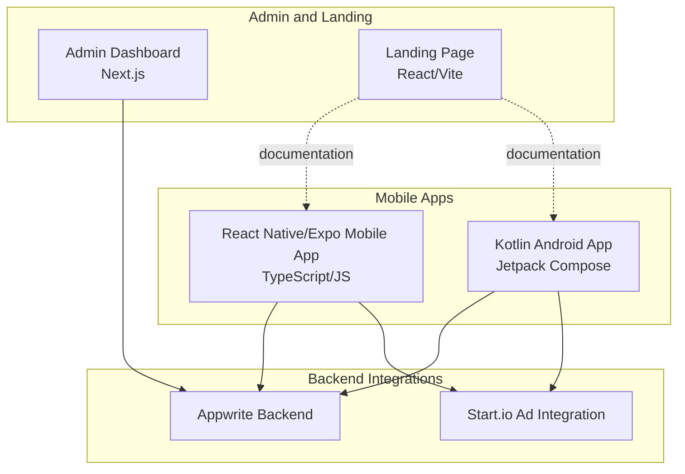
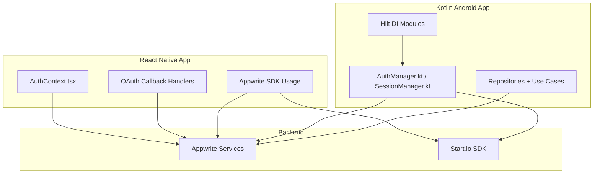
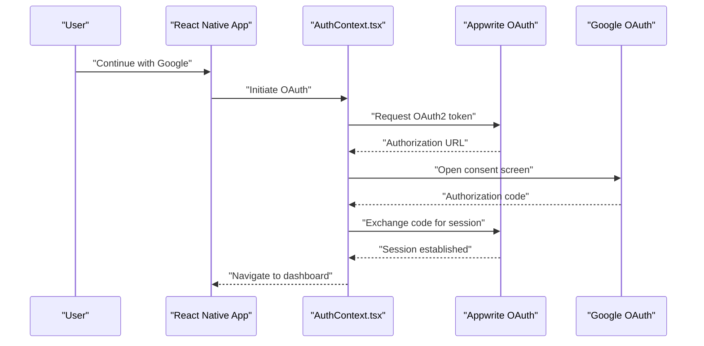
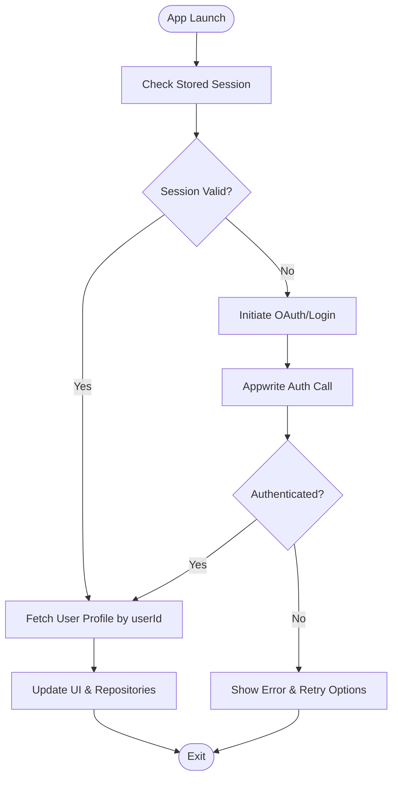
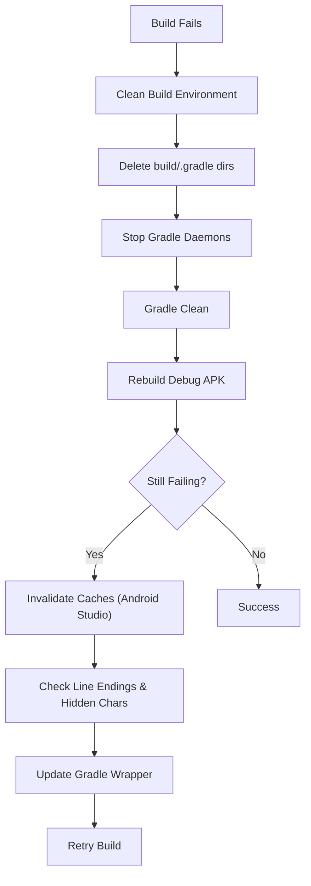
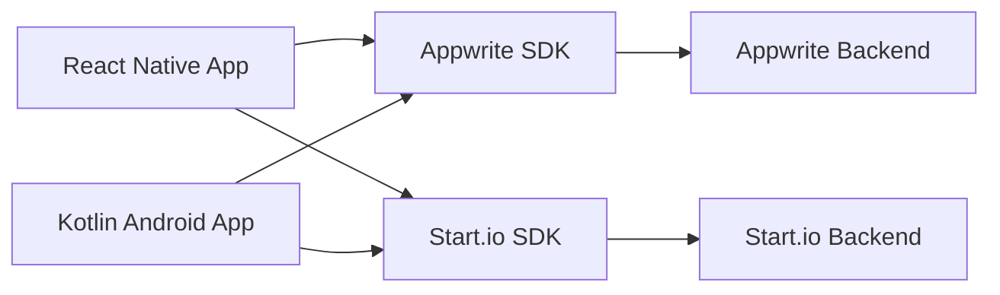

# Troubleshooting and Maintenance

<cite>
**Referenced Files in This Document**
- [ktMobileApp/README.md](file://ktMobileApp/README.md)
- [ktMobileApp/BUILD_ISSUES.md](file://ktMobileApp/BUILD_ISSUES.md)
- [ktMobileApp/JVM_FIX.md](file://ktMobileApp/JVM_FIX.md)
- [ktMobileApp/ANDROID_SDK_SETUP.md](file://ktMobileApp/ANDROID_SDK_SETUP.md)
- [ktMobileApp/APPWRITE_INTEGRATION_FIXES.md](file://ktMobileApp/APPWRITE_INTEGRATION_FIXES.md)
- [mobileApp/README.md](file://mobileApp/README.md)
- [mobileApp/Documentations/OAUTH_SETUP_GUIDE.md](file://mobileApp/Documentations/OAUTH_SETUP_GUIDE.md)
- [mobileApp/Documentations/AUTHENTICATION_FIXES.md](file://mobileApp/Documentations/AUTHENTICATION_FIXES.md)
- [mobileApp/Documentations/APPWRITE_OAUTH_FIX.md](file://mobileApp/Documentations/APPWRITE_OAUTH_FIX.md)
- [mobileApp/Documentations/APPWRITE_REDIRECT_URLS_TROUBLESHOOTING.md](file://mobileApp/Documentations/APPWRITE_REDIRECT_URLS_TROUBLESHOOTING.md)
- [mobileApp/Documentations/APPWRITE_MIGRATION_GUIDE.md](file://mobileApp/Documentations/APPWRITE_MIGRATION_GUIDE.md)
- [mobileApp/Documentations/APPWRITE_DATA_MIGRATION.md](file://mobileApp/Documentations/APPWRITE_DATA_MIGRATION.md)
- [EKEHI_MOBILE_FAQ.md](file://EKEHI_MOBILE_FAQ.md)
- [JVM_FIX_MANUAL_STEPS.md](file://JVM_FIX_MANUAL_STEPS.md)
</cite>

## Table of Contents
1. [Introduction](#introduction)
2. [Project Structure](#project-structure)
3. [Core Components](#core-components)
4. [Architecture Overview](#architecture-overview)
5. [Detailed Component Analysis](#detailed-component-analysis)
6. [Dependency Analysis](#dependency-analysis)
7. [Performance Considerations](#performance-considerations)
8. [Troubleshooting Guide](#troubleshooting-guide)
9. [Conclusion](#conclusion)
10. [Appendices](#appendices)

## Introduction
This document provides comprehensive troubleshooting and maintenance guidance for the Ekehi Mobile application across its React Native/Expo mobile app, Kotlin Android app, and supporting admin/landing pages. It focuses on OAuth configuration problems, authentication flow issues, session management errors, build issues for both platforms, database migration concerns, API connectivity problems, performance troubleshooting, JVM and Android SDK setup, environment configuration, and operational maintenance procedures such as database schema updates, API versioning, and security patches. It also covers monitoring/logging strategies, error tracking, incident response procedures, debugging tools, diagnostic commands, and escalation paths.

## Project Structure
The repository contains multiple apps and documentation sets:
- React Native/Expo mobile app (TypeScript/JavaScript) with extensive OAuth and Appwrite documentation
- Kotlin Android app (Jetpack Compose) with JVM, SDK, and Appwrite integration troubleshooting
- Admin dashboard (Next.js) and landing page (React/Vite) with supporting documentation
- Centralized troubleshooting and maintenance documents

**Section sources**
- [mobileApp/README.md](file://mobileApp/README.md#L1-L178)
- [ktMobileApp/README.md](file://ktMobileApp/README.md#L1-L209)

## Core Components
- Authentication and OAuth:
  - React Native/Expo app with Google OAuth and email/password flows
  - Kotlin Android app with Appwrite-backed authentication and secure session management
- Backend integration:
  - Appwrite for user management, profiles, mining sessions, social tasks, leaderboard, and achievements
  - Start.io for rewarded ads
- Build and environment:
  - Android SDK and Gradle configuration for Kotlin app
  - Node.js, npm/pnpm, and Expo toolchain for React Native app
- Monitoring and diagnostics:
  - Logging services, performance monitors, and error services in the React Native app
  - Scripted verification and migration tools

**Section sources**
- [mobileApp/README.md](file://mobileApp/README.md#L1-L178)
- [ktMobileApp/README.md](file://ktMobileApp/README.md#L1-L209)

## Architecture Overview
The apps integrate with Appwrite for identity and data, and Start.io for monetization. The React Native app uses Appwrite’s OAuth and SDKs, while the Kotlin app uses Appwrite Kotlin SDK and Hilt DI. Both apps rely on consistent Appwrite configuration across platforms.

**Diagram sources**
- [mobileApp/Documentations/OAUTH_SETUP_GUIDE.md](file://mobileApp/Documentations/OAUTH_SETUP_GUIDE.md#L1-L751)
- [ktMobileApp/README.md](file://ktMobileApp/README.md#L1-L209)

## Detailed Component Analysis

### OAuth Configuration and Authentication Flow (React Native/Expo)
Common issues include incorrect redirect URLs, mismatched platform types, and deep link configuration. The OAuth setup guide provides step-by-step instructions for Google Cloud Console and Appwrite, including correct success/failure URLs and platform registration.

**Diagram sources**
- [mobileApp/Documentations/OAUTH_SETUP_GUIDE.md](file://mobileApp/Documentations/OAUTH_SETUP_GUIDE.md#L1-L751)
- [mobileApp/Documentations/AUTHENTICATION_FIXES.md](file://mobileApp/Documentations/AUTHENTICATION_FIXES.md#L1-L61)

**Section sources**
- [mobileApp/Documentations/OAUTH_SETUP_GUIDE.md](file://mobileApp/Documentations/OAUTH_SETUP_GUIDE.md#L1-L751)
- [mobileApp/Documentations/APPWRITE_OAUTH_FIX.md](file://mobileApp/Documentations/APPWRITE_OAUTH_FIX.md#L1-L71)
- [mobileApp/Documentations/APPWRITE_REDIRECT_URLS_TROUBLESHOOTING.md](file://mobileApp/Documentations/APPWRITE_REDIRECT_URLS_TROUBLESHOOTING.md#L1-L230)
- [mobileApp/Documentations/AUTHENTICATION_FIXES.md](file://mobileApp/Documentations/AUTHENTICATION_FIXES.md#L1-L61)

### Session Management and Authentication Flow (Kotlin Android)
Issues often stem from Appwrite collection mismatches, endpoint misconfiguration, and incorrect querying patterns. The Appwrite integration fixes document outlines corrected collection IDs, endpoint alignment, and robust document conversion methods.

**Diagram sources**
- [ktMobileApp/APPWRITE_INTEGRATION_FIXES.md](file://ktMobileApp/APPWRITE_INTEGRATION_FIXES.md#L1-L155)

**Section sources**
- [ktMobileApp/APPWRITE_INTEGRATION_FIXES.md](file://ktMobileApp/APPWRITE_INTEGRATION_FIXES.md#L1-L155)

### Build Issues (Android/Kotlin)
Common build errors include compilation parameter issues and resource merge EOF exceptions. The build issues document provides a step-by-step clean environment solution, cache invalidation, and Gradle wrapper updates.

**Diagram sources**
- [ktMobileApp/BUILD_ISSUES.md](file://ktMobileApp/BUILD_ISSUES.md#L1-L57)

**Section sources**
- [ktMobileApp/BUILD_ISSUES.md](file://ktMobileApp/BUILD_ISSUES.md#L1-L57)

### JVM and Android SDK Setup (Kotlin)
JVM version conflicts and missing SDK paths are frequent blockers. The JVM fix document details updating Gradle build options, ensuring the correct JDK path, and verifying Gradle daemon compatibility. The Android SDK setup guide explains installing SDK components and configuring local.properties.

**Section sources**
- [ktMobileApp/JVM_FIX.md](file://ktMobileApp/JVM_FIX.md#L1-L115)
- [ktMobileApp/ANDROID_SDK_SETUP.md](file://ktMobileApp/ANDROID_SDK_SETUP.md#L1-L51)
- [ktMobileApp/README.md](file://ktMobileApp/README.md#L108-L141)

### Database Migration and Schema Updates (React Native/Expo)
The migration and data migration guides outline collection structure, environment variables, and scripted workflows for collection creation, data export/migration, and verification. They also highlight recent updates to collection attributes and mining system changes.

**Section sources**
- [mobileApp/Documentations/APPWRITE_MIGRATION_GUIDE.md](file://mobileApp/Documentations/APPWRITE_MIGRATION_GUIDE.md#L1-L467)
- [mobileApp/Documentations/APPWRITE_DATA_MIGRATION.md](file://mobileApp/Documentations/APPWRITE_DATA_MIGRATION.md#L1-L146)

### API Connectivity and Backend Integration
Both apps rely on Appwrite endpoints and SDKs. Ensure endpoints, project IDs, and collection IDs are consistent across platforms. The Kotlin app aligns with the React Native app’s endpoint and collection IDs, and uses field-based queries rather than document ID assumptions.

**Section sources**
- [ktMobileApp/APPWRITE_INTEGRATION_FIXES.md](file://ktMobileApp/APPWRITE_INTEGRATION_FIXES.md#L1-L155)
- [mobileApp/Documentations/APPWRITE_MIGRATION_GUIDE.md](file://mobileApp/Documentations/APPWRITE_MIGRATION_GUIDE.md#L1-L467)

### Performance Troubleshooting
- React Native app includes performance monitoring and logging services; leverage them to track slow operations, excessive re-renders, and network latency.
- Kotlin app integrates performance monitoring utilities; use them to detect heavy computations and long-running tasks.
- Optimize image assets, reduce unnecessary subscriptions, and implement memoization where appropriate.

[No sources needed since this section provides general guidance]

### Monitoring and Logging Strategies
- React Native app:
  - LoggingService and PerformanceMonitor utilities for structured logs and metrics.
  - ErrorService for centralized error reporting.
- Kotlin app:
  - SecurityLogger and performance monitoring components for backend and UI performance insights.
- Admin dashboard:
  - Analytics and charts for high-level metrics; use them to correlate user behavior with backend health.

**Section sources**
- [mobileApp/src/services/LoggingService.ts](file://mobileApp/src/services/LoggingService.ts)
- [mobileApp/src/services/PerformanceMonitor.ts](file://mobileApp/src/services/PerformanceMonitor.ts)
- [mobileApp/src/services/ErrorService.ts](file://mobileApp/src/services/ErrorService.ts)
- [ktMobileApp/app/src/main/java/com/ekehi/network/security/SecurityLogger.kt](file://ktMobileApp/app/src/main/java/com/ekehi/network/security/SecurityLogger.kt)

### Security Patches and Environment Configuration
- Keep Appwrite SDKs and platform dependencies updated.
- Maintain separate environments (dev/staging/prod) with distinct credentials and endpoints.
- Enforce secure preferences, input validation, and output encoding in the Kotlin app.
- Rotate OAuth client IDs/secrets periodically and monitor usage.

**Section sources**
- [ktMobileApp/README.md](file://ktMobileApp/README.md#L173-L176)
- [mobileApp/Documentations/OAUTH_SETUP_GUIDE.md](file://mobileApp/Documentations/OAUTH_SETUP_GUIDE.md#L582-L606)

## Dependency Analysis
The apps depend on consistent backend configuration and platform-specific SDKs. Misalignment in Appwrite endpoints, collection IDs, or platform registrations leads to authentication and data retrieval failures.

**Diagram sources**
- [mobileApp/README.md](file://mobileApp/README.md#L1-L178)
- [ktMobileApp/README.md](file://ktMobileApp/README.md#L1-L209)

**Section sources**
- [mobileApp/README.md](file://mobileApp/README.md#L1-L178)
- [ktMobileApp/README.md](file://ktMobileApp/README.md#L1-L209)

## Performance Considerations
- Minimize synchronous disk I/O and heavy computations on the main thread (especially in Kotlin).
- Debounce or throttle network requests and UI updates (React Native).
- Use lazy loading for images and lists.
- Monitor memory usage and avoid retain cycles in both apps.
- Leverage caching strategies for frequently accessed data.

[No sources needed since this section provides general guidance]

## Troubleshooting Guide

### OAuth Configuration Problems (React Native/Expo)
- Symptom: “Invalid success param” or “Register your new client (OAuth) as a new platform.”
- Resolution:
  - Register Flutter/React Native platform in Appwrite with correct package/bundle ID and redirect URLs.
  - Ensure success URL is ekehi://oauth/return and failure URL is ekehi://auth.
  - Verify Google Cloud OAuth client IDs and scopes.
  - Confirm deep link scheme matches app.json.

**Section sources**
- [mobileApp/Documentations/APPWRITE_OAUTH_FIX.md](file://mobileApp/Documentations/APPWRITE_OAUTH_FIX.md#L1-L71)
- [mobileApp/Documentations/APPWRITE_REDIRECT_URLS_TROUBLESHOOTING.md](file://mobileApp/Documentations/APPWRITE_REDIRECT_URLS_TROUBLESHOOTING.md#L1-L230)
- [mobileApp/Documentations/OAUTH_SETUP_GUIDE.md](file://mobileApp/Documentations/OAUTH_SETUP_GUIDE.md#L1-L751)

### Authentication Flow Issues (React Native/Expo)
- Symptom: OAuth flow not returning to app or navigation errors.
- Resolution:
  - Validate OAuth URLs and deep link configuration.
  - Test with the provided scripts and commands.
  - Improve error handling and navigation state management.

**Section sources**
- [mobileApp/Documentations/AUTHENTICATION_FIXES.md](file://mobileApp/Documentations/AUTHENTICATION_FIXES.md#L1-L61)
- [mobileApp/README.md](file://mobileApp/README.md#L152-L167)

### Session Management Errors (Kotlin Android)
- Symptom: Profile or mining data not loading; incorrect querying by document ID.
- Resolution:
  - Align Appwrite endpoint with the React Native app.
  - Use collection IDs instead of names.
  - Query by userId field and apply unique() for document creation.
  - Add null checks in document conversion methods.

**Section sources**
- [ktMobileApp/APPWRITE_INTEGRATION_FIXES.md](file://ktMobileApp/APPWRITE_INTEGRATION_FIXES.md#L1-L155)

### Build Issues (Android/Kotlin)
- Symptom: Compilation error “No value passed for parameter ‘context’” or resource merge EOFException.
- Resolution:
  - Clean build and Gradle caches, invalidate caches, and update Gradle wrapper.
  - Check line endings and hidden characters in resources.
  - Rebuild after applying fixes.

**Section sources**
- [ktMobileApp/BUILD_ISSUES.md](file://ktMobileApp/BUILD_ISSUES.md#L1-L57)

### JVM and Android SDK Setup Problems
- Symptom: Unsupported class file major version or SDK location not found.
- Resolution:
  - Use JDK 17 (LTS) and set org.gradle.java.home accordingly.
  - Install Android SDK and configure sdk.dir in local.properties.
  - Verify Gradle and JDK versions.

**Section sources**
- [ktMobileApp/JVM_FIX.md](file://ktMobileApp/JVM_FIX.md#L1-L115)
- [ktMobileApp/ANDROID_SDK_SETUP.md](file://ktMobileApp/ANDROID_SDK_SETUP.md#L1-L51)
- [ktMobileApp/README.md](file://ktMobileApp/README.md#L108-L141)

### Database Migration and Schema Updates
- Symptom: Collections missing or data not appearing after migration.
- Resolution:
  - Use update-collections and migrate-data scripts with correct environment variables.
  - Verify collection IDs and attributes match the app’s expectations.
  - Export Cloudflare data first if migrating from Cloudflare D1.

**Section sources**
- [mobileApp/Documentations/APPWRITE_DATA_MIGRATION.md](file://mobileApp/Documentations/APPWRITE_DATA_MIGRATION.md#L1-L146)
- [mobileApp/Documentations/APPWRITE_MIGRATION_GUIDE.md](file://mobileApp/Documentations/APPWRITE_MIGRATION_GUIDE.md#L1-L467)

### API Connectivity Problems
- Symptom: Authentication or data retrieval fails intermittently.
- Resolution:
  - Verify Appwrite endpoint and project/database IDs.
  - Ensure consistent platform registrations across Android/iOS/Web.
  - Check network connectivity and firewall rules.

**Section sources**
- [ktMobileApp/APPWRITE_INTEGRATION_FIXES.md](file://ktMobileApp/APPWRITE_INTEGRATION_FIXES.md#L1-L155)
- [mobileApp/Documentations/OAUTH_SETUP_GUIDE.md](file://mobileApp/Documentations/OAUTH_SETUP_GUIDE.md#L1-L751)

### Maintenance Procedures
- Database schema updates:
  - Use update-appwrite-collections.js to adjust attributes and permissions.
  - Keep collection IDs synchronized across frontend/backend.
- API versioning:
  - Pin Appwrite SDK versions and test compatibility before upgrades.
- Security patches:
  - Rotate OAuth credentials and enforce secure coding practices.
  - Regularly audit platform registrations and redirect URLs.

**Section sources**
- [mobileApp/Documentations/APPWRITE_DATA_MIGRATION.md](file://mobileApp/Documentations/APPWRITE_DATA_MIGRATION.md#L1-L146)
- [mobileApp/Documentations/APPWRITE_MIGRATION_GUIDE.md](file://mobileApp/Documentations/APPWRITE_MIGRATION_GUIDE.md#L1-L467)

### Debugging Tools and Diagnostic Commands
- React Native:
  - Use test scripts for OAuth configuration and connection checks.
  - Inspect environment variables and deep link registration.
- Kotlin:
  - Clean and rebuild projects; stop Gradle daemons when switching JDK versions.
  - Validate SDK path and Gradle wrapper.

**Section sources**
- [mobileApp/README.md](file://mobileApp/README.md#L120-L178)
- [ktMobileApp/README.md](file://ktMobileApp/README.md#L130-L141)

### Escalation Procedures for Complex Issues
- Document exact symptoms, environment details, and steps taken.
- Capture logs from LoggingService (React Native) and SecurityLogger (Kotlin).
- Provide reproducible test cases and environment configuration details.
- Engage Appwrite and platform-specific community channels with precise error messages and versions.

**Section sources**
- [EKEHI_MOBILE_FAQ.md](file://EKEHI_MOBILE_FAQ.md)
- [JVM_FIX_MANUAL_STEPS.md](file://JVM_FIX_MANUAL_STEPS.md)

## Conclusion
This guide consolidates troubleshooting and maintenance practices for the Ekehi Mobile ecosystem. By aligning OAuth and Appwrite configurations, maintaining consistent endpoints and collection IDs, and following platform-specific build and JVM guidelines, most issues can be resolved quickly. Adopt structured logging, performance monitoring, and regular security audits to sustain reliability and performance.

## Appendices
- Frequently asked questions and common issues are documented centrally for quick reference.
- Manual JVM fix steps are available for environments requiring explicit JDK configuration.

**Section sources**
- [EKEHI_MOBILE_FAQ.md](file://EKEHI_MOBILE_FAQ.md)
- [JVM_FIX_MANUAL_STEPS.md](file://JVM_FIX_MANUAL_STEPS.md)